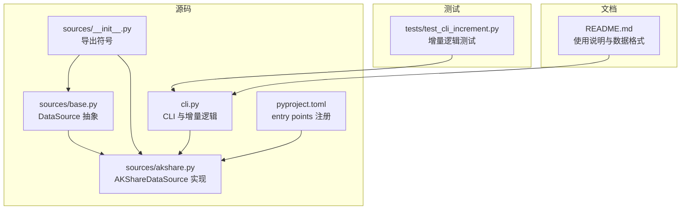
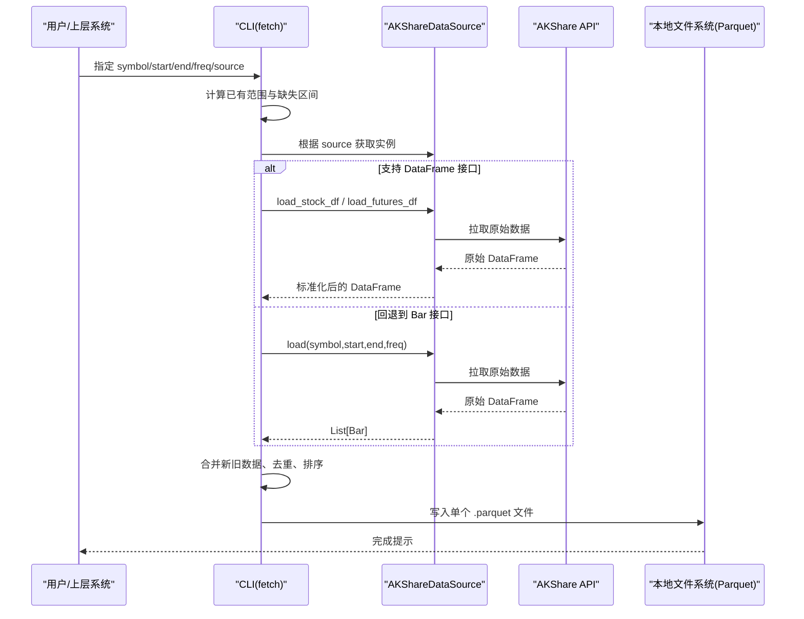
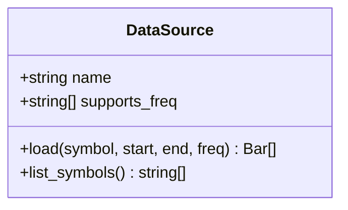
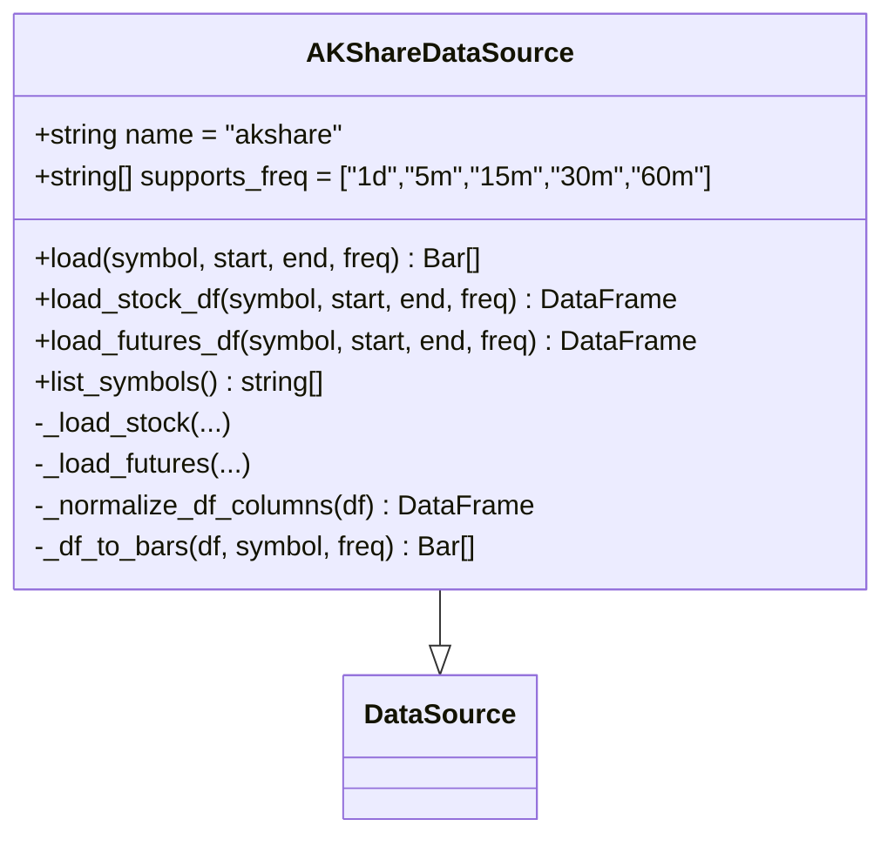
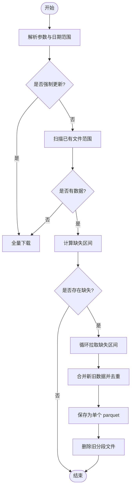
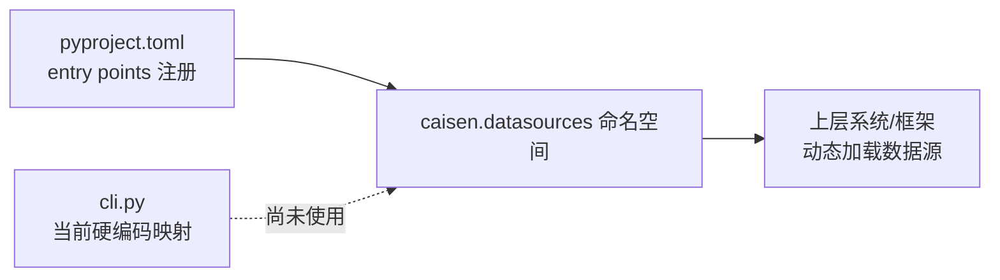
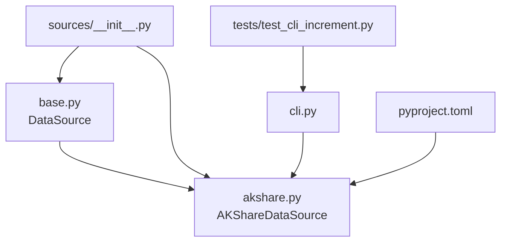

# 数据源架构设计

<cite>
**本文引用的文件**   
- [base.py](file://src/caisen_data/sources/base.py)
- [akshare.py](file://src/caisen_data/sources/akshare.py)
- [__init__.py](file://src/caisen_data/sources/__init__.py)
- [cli.py](file://src/caisen_data/cli.py)
- [README.md](file://README.md)
- [pyproject.toml](file://pyproject.toml)
- [test_cli_increment.py](file://tests/test_cli_increment.py)
</cite>

## 目录
1. [引言](#引言)
2. [项目结构](#项目结构)
3. [核心组件](#核心组件)
4. [架构总览](#架构总览)
5. [详细组件分析](#详细组件分析)
6. [依赖关系分析](#依赖关系分析)
7. [性能与扩展性](#性能与扩展性)
8. [故障排查指南](#故障排查指南)
9. [结论](#结论)
10. [附录：自定义数据源开发指南](#附录自定义数据源开发指南)

## 引言
本文件面向开发者，系统化阐述 caisen-data 的数据源架构设计。重点包括：
- DataSource 抽象基类的设计理念：统一接口、模板方法模式、插件化优势
- AKShareDataSource 的具体实现：数据获取逻辑、错误处理机制、重试策略现状与建议
- 数据源注册机制与 entry points 的使用方式
- 数据标准化流程与文件格式规范
- 架构图与组件交互图，帮助理解整体设计与扩展路径

## 项目结构
仓库采用“按功能分层 + 数据源插件”的组织方式：
- src/caisen_data/sources：数据源抽象与具体实现
- src/caisen_data/cli：命令行入口、增量下载、本地 Parquet 合并与保存
- tests：增量逻辑的单元测试
- pyproject.toml：包元信息、脚本入口、entry points 注册
- README.md：使用说明、数据格式说明

图表来源
- [base.py:14-43](file://src/caisen_data/sources/base.py#L14-L43)
- [akshare.py:37-245](file://src/caisen_data/sources/akshare.py#L37-L245)
- [__init__.py:1-6](file://src/caisen_data/sources/__init__.py#L1-L6)
- [cli.py:119-123](file://src/caisen_data/cli.py#L119-L123)
- [pyproject.toml:25-26](file://pyproject.toml#L25-L26)
- [test_cli_increment.py:1-231](file://tests/test_cli_increment.py#L1-L231)
- [README.md:90-144](file://README.md#L90-L144)

章节来源
- [base.py:14-43](file://src/caisen_data/sources/base.py#L14-L43)
- [akshare.py:37-245](file://src/caisen_data/sources/akshare.py#L37-L245)
- [__init__.py:1-6](file://src/caisen_data/sources/__init__.py#L1-L6)
- [cli.py:119-123](file://src/caisen_data/cli.py#L119-L123)
- [pyproject.toml:25-26](file://pyproject.toml#L25-L26)
- [README.md:90-144](file://README.md#L90-L144)

## 核心组件
- DataSource 抽象基类：定义统一的 load 接口与可选 list_symbols 能力，声明支持的频率集合与名称标识，作为所有数据源的契约。
- AKShareDataSource：基于 AKShare 提供股票与期货主力合约数据，支持多频率；内部包含列名标准化、DataFrame 与 Bar 对象转换、标的列表获取等。
- CLI 层：负责增量计算、缺失区间发现、数据合并与 Parquet 持久化；通过硬编码映射选择数据源实例（当前未使用 entry points）。
- 包配置：在 pyproject.toml 中通过 entry points 将 AKShareDataSource 注册到 caisen.datasources 命名空间，供上层系统动态发现。

章节来源
- [base.py:14-43](file://src/caisen_data/sources/base.py#L14-L43)
- [akshare.py:37-245](file://src/caisen_data/sources/akshare.py#L37-L245)
- [cli.py:119-123](file://src/caisen_data/cli.py#L119-L123)
- [pyproject.toml:25-26](file://pyproject.toml#L25-L26)

## 架构总览
从调用方视角，数据流分为两条路径：
- Python API：直接调用 AKShareDataSource.load/load_*_df，返回 Bar 或 DataFrame
- CLI 工具：解析参数、计算增量、调用数据源、合并并保存为 Parquet

图表来源
- [cli.py:140-276](file://src/caisen_data/cli.py#L140-L276)
- [akshare.py:115-190](file://src/caisen_data/sources/akshare.py#L115-L190)
- [akshare.py:192-225](file://src/caisen_data/sources/akshare.py#L192-L225)

## 详细组件分析

### DataSource 抽象基类
- 设计理念
  - 统一接口：load(symbol, start, end, freq) -> List[Bar]，屏蔽不同数据源差异
  - 可选能力：list_symbols() 用于列出可用标的
  - 能力声明：name、supports_freq 暴露数据源特性，便于上层校验与路由
  - 依赖解耦：Bar 类型可选导入，避免无 caisen 环境时无法运行
- 模板方法模式应用
  - 基类定义标准流程骨架（如 load），子类可覆盖具体实现；同时保留 list_symbols 默认空实现，子类按需重写
  - 通过 supports_freq 约束频率支持，上层可在调用前进行快速校验
- 复杂度与可扩展性
  - 新增数据源只需继承 DataSource 并实现 load（及可选 list_symbols）
  - 通过 supports_freq 与 name 配合，上层可实现自动发现与路由

图表来源
- [base.py:14-43](file://src/caisen_data/sources/base.py#L14-L43)

章节来源
- [base.py:14-43](file://src/caisen_data/sources/base.py#L14-L43)

### AKShareDataSource 实现
- 数据获取逻辑
  - 股票：仅日线，调用 stock_zh_a_hist，标准化列名为 OHLCV 标准字段，附加 symbol 与 freq
  - 期货：支持日线与分钟线，分别调用 futures_main_sina 与 futures_zh_minute_sina；分钟数据需按日期范围过滤
  - 统一列名映射：_normalize_df_columns 将中文列名映射为标准英文列名，确保后续处理一致
- 数据结构与转换
  - _df_to_bars：将 DataFrame 转换为 Bar 列表，优先列式数值转换，逐行构造 Bar 对象
  - 支持两种输出：DataFrame 接口（无需 caisen 依赖）与 Bar 列表接口（需要 caisen）
- 错误处理机制
  - 依赖检查：若 akshare 未安装，抛出 ImportError；若 caisen 未安装且需要 Bar，则抛出明确 ImportError
  - 异常捕获：list_symbols 捕获网络异常并记录日志，返回空列表保证健壮性
- 重试策略
  - 当前实现未内置重试逻辑；建议在外部（CLI 或上层调度）增加指数退避重试，或在数据源层封装带重试的网络请求
- 标的列表
  - list_symbols 通过 stock_info_a_code_name 获取 A 股代码，并按规则拼接 .SZ/.SH 后缀

图表来源
- [akshare.py:37-245](file://src/caisen_data/sources/akshare.py#L37-L245)
- [base.py:14-43](file://src/caisen_data/sources/base.py#L14-L43)

章节来源
- [akshare.py:37-245](file://src/caisen_data/sources/akshare.py#L37-L245)

### CLI 与增量逻辑
- 增量计算
  - get_existing_range：扫描目录下 parquet 文件名，解析起止日期，得到已有时间范围
  - normalize_ranges：合并重叠或相邻的日期范围
  - find_range_gaps：计算请求范围内缺失的区间
- 数据合并与保存
  - merge_parquet_files：读取目录下所有 parquet 并合并、去重、排序
  - fetch 命令：根据缺失区间循环拉取数据，合并后写入单一 parquet 文件，删除旧分段文件
- 数据源选择
  - _get_datasource：当前为硬编码映射，仅支持 akshare；未使用 entry points 动态发现

图表来源
- [cli.py:19-116](file://src/caisen_data/cli.py#L19-L116)
- [cli.py:140-276](file://src/caisen_data/cli.py#L140-L276)

章节来源
- [cli.py:19-116](file://src/caisen_data/cli.py#L19-L116)
- [cli.py:140-276](file://src/caisen_data/cli.py#L140-L276)
- [test_cli_increment.py:1-231](file://tests/test_cli_increment.py#L1-L231)

### 数据源注册机制与 entry points
- 当前 CLI 通过硬编码映射选择数据源实例，未使用 entry points
- 包配置已在 pyproject.toml 中将 AKShareDataSource 注册到 caisen.datasources 命名空间，供上层系统动态发现
- 建议：在 CLI 中引入 entry points 发现机制，以支持第三方数据源热插拔

图表来源
- [pyproject.toml:25-26](file://pyproject.toml#L25-L26)
- [cli.py:119-123](file://src/caisen_data/cli.py#L119-L123)

章节来源
- [pyproject.toml:25-26](file://pyproject.toml#L25-L26)
- [cli.py:119-123](file://src/caisen_data/cli.py#L119-L123)

## 依赖关系分析
- 模块内依赖
  - sources/__init__.py 导出 DataSource 与 AKShareDataSource
  - cli.py 依赖 AKShareDataSource 的 DataFrame 接口与 Bar 接口
  - base.py 对 Bar 做可选导入，避免运行时强依赖
- 外部依赖
  - akshare：数据拉取
  - pandas/pyarrow：数据处理与 Parquet 读写
  - click：CLI 框架
  - caisen：Bar 对象（可选）

图表来源
- [__init__.py:1-6](file://src/caisen_data/sources/__init__.py#L1-L6)
- [cli.py:1-314](file://src/caisen_data/cli.py#L1-L314)
- [pyproject.toml:1-29](file://pyproject.toml#L1-L29)
- [test_cli_increment.py:1-231](file://tests/test_cli_increment.py#L1-L231)

章节来源
- [__init__.py:1-6](file://src/caisen_data/sources/__init__.py#L1-L6)
- [cli.py:1-314](file://src/caisen_data/cli.py#L1-L314)
- [pyproject.toml:1-29](file://pyproject.toml#L1-L29)
- [test_cli_increment.py:1-231](file://tests/test_cli_increment.py#L1-L231)

## 性能与扩展性
- 性能要点
  - 列式预处理：_df_to_bars 预先提取列为 numpy/pandas 序列，减少逐行字典开销
  - 去重与排序：merge_parquet_files 基于 timestamp 去重与排序，保证数据一致性
  - 单文件存储：合并后写入单一 parquet，降低小文件碎片带来的 I/O 压力
- 扩展性建议
  - 引入重试与熔断：在网络不稳定场景下，对 AKShare 调用增加指数退避重试与失败熔断
  - 异步拉取：对多标的批量拉取可使用并发策略，结合速率限制与错误隔离
  - 插件化注册：CLI 改用 entry points 动态发现数据源，支持第三方扩展

## 故障排查指南
- 常见错误与定位
  - ImportError: akshare not installed
    - 现象：调用 AKShareDataSource 相关方法时报错
    - 处理：安装 akshare 依赖
  - ImportError: caisen 未安装
    - 现象：使用 load() 返回 Bar 对象时报错
    - 处理：安装 caisen 或使用 DataFrame 接口
  - 未知数据源
    - 现象：CLI 报未知数据源
    - 处理：确认 source 参数为 akshare，或扩展 _get_datasource 映射
- 日志与调试
  - 使用 logger 记录关键步骤与异常，便于定位问题
  - 通过 list-symbols 验证数据源连通性与可用性

章节来源
- [akshare.py:51-72](file://src/caisen_data/sources/akshare.py#L51-L72)
- [akshare.py:129-132](file://src/caisen_data/sources/akshare.py#L129-L132)
- [akshare.py:227-245](file://src/caisen_data/sources/akshare.py#L227-L245)
- [cli.py:182-186](file://src/caisen_data/cli.py#L182-L186)

## 结论
本架构通过 DataSource 抽象统一数据源接口，结合 AKShareDataSource 的具体实现，提供了灵活、可扩展的数据获取方案。CLI 层实现了完善的增量下载与本地 Parquet 管理，满足回测系统的数据准备需求。未来可通过 entry points 完善插件化注册、增强重试与并发策略，进一步提升系统的健壮性与扩展性。

## 附录：自定义数据源开发指南
- 继承基类
  - 新建类继承 DataSource，设置 name 与 supports_freq
  - 实现 load(symbol, start, end, freq) -> List[Bar]
  - 可选实现 list_symbols() 以支持标的列表查询
- 数据标准化
  - 参考 _normalize_df_columns，将不同 API 的列名映射为标准 OHLCV 字段
  - 确保 timestamp 为 datetime 类型，volume 缺失时填充为 0
- 错误处理
  - 在依赖缺失时抛出明确的 ImportError
  - 捕获网络异常并记录日志，返回空结果或降级策略
- 注册新数据源
  - 在 pyproject.toml 的 [project.entry-points."caisen.datasources"] 中添加映射，指向新数据源类
  - 在 CLI 的 _get_datasource 中增加映射（或改为 entry points 动态发现）
- 数据文件格式规范
  - 列名：timestamp、symbol、freq、open、high、low、close、volume
  - 数据类型：timestamp 为 datetime，其余为 float/string
  - 存储：按 symbol/freq 子目录组织，文件名使用实际数据起止日期，如 20230101_20241231.parquet

章节来源
- [base.py:14-43](file://src/caisen_data/sources/base.py#L14-L43)
- [akshare.py:92-113](file://src/caisen_data/sources/akshare.py#L92-L113)
- [akshare.py:192-225](file://src/caisen_data/sources/akshare.py#L192-L225)
- [pyproject.toml:25-26](file://pyproject.toml#L25-L26)
- [README.md:90-144](file://README.md#L90-L144)