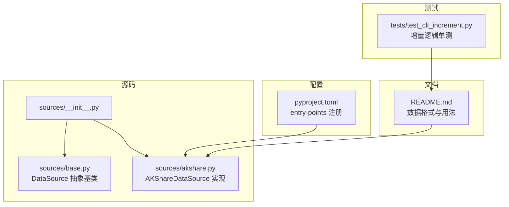
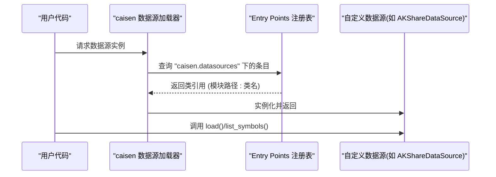
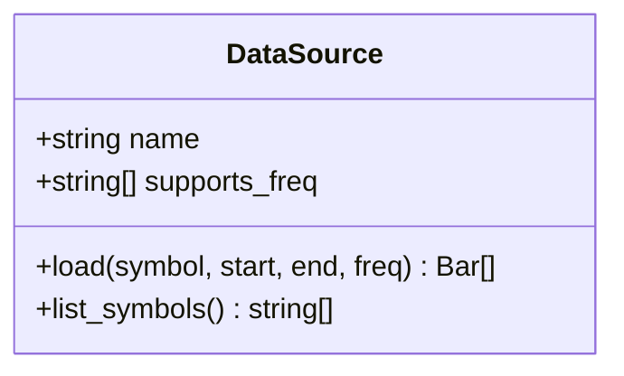
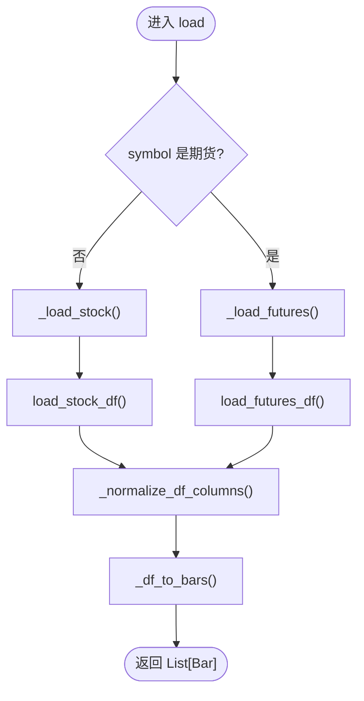
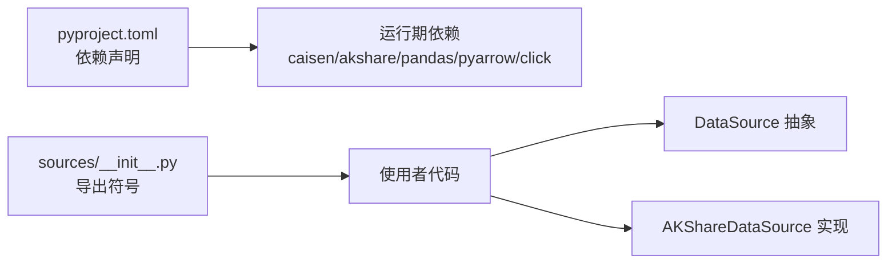

# 自定义数据源开发

<cite>
**本文引用的文件**
- [base.py](file://src/caisen_data/sources/base.py)
- [akshare.py](file://src/caisen_data/sources/akshare.py)
- [__init__.py](file://src/caisen_data/sources/__init__.py)
- [pyproject.toml](file://pyproject.toml)
- [README.md](file://README.md)
- [test_cli_increment.py](file://tests/test_cli_increment.py)
</cite>

## 目录
1. [简介](#简介)
2. [项目结构](#项目结构)
3. [核心组件](#核心组件)
4. [架构总览](#架构总览)
5. [详细组件分析](#详细组件分析)
6. [依赖关系分析](#依赖关系分析)
7. [性能与优化建议](#性能与优化建议)
8. [调试与测试指南](#调试与测试指南)
9. [开发清单与最佳实践](#开发清单与最佳实践)
10. [结论](#结论)

## 简介
本指南面向希望为 caisen-data 扩展新数据源的开发者，系统讲解如何基于 DataSource 抽象基类实现自定义数据源。内容涵盖：
- 继承 DataSource 的完整步骤（导入、类定义、方法重写）
- load() 与 list_symbols() 的实现规范
- 数据格式转换与 Bar 对象创建约定
- 通过 entry points 注册数据源（含 pyproject.toml 配置语法）
- 单元测试与集成测试策略
- 开发清单与最佳实践

## 项目结构
仓库采用“按功能分层 + 数据源插件化”的组织方式：
- src/caisen_data/sources：数据源抽象与具体实现
- tests：增量抓取等功能的单测
- pyproject.toml：构建与入口点注册
- README.md：使用说明与数据格式说明

图表来源
- [__init__.py:1-6](file://src/caisen_data/sources/__init__.py#L1-L6)
- [base.py:14-43](file://src/caisen_data/sources/base.py#L14-L43)
- [akshare.py:37-41](file://src/caisen_data/sources/akshare.py#L37-L41)
- [pyproject.toml:25-26](file://pyproject.toml#L25-L26)
- [README.md:117-131](file://README.md#L117-L131)

章节来源
- [__init__.py:1-6](file://src/caisen_data/sources/__init__.py#L1-L6)
- [base.py:14-43](file://src/caisen_data/sources/base.py#L14-L43)
- [akshare.py:37-41](file://src/caisen_data/sources/akshare.py#L37-L41)
- [pyproject.toml:25-26](file://pyproject.toml#L25-L26)
- [README.md:117-131](file://README.md#L117-L131)

## 核心组件
- DataSource 抽象基类：定义数据源统一接口，包括 name、supports_freq、load()、list_symbols()。
- AKShareDataSource：一个可运行的数据源实现，演示了从外部 API 拉取数据、标准化列名、构造 Bar 列表以及列出标的的流程。

关键要点
- 必须实现 load(symbol, start, end, freq="1d") -> List[Bar]
- 可选实现 list_symbols() -> List[str]
- supports_freq 声明支持的数据频率集合
- name 用于标识数据源，配合 entry points 进行注册

章节来源
- [base.py:14-43](file://src/caisen_data/sources/base.py#L14-L43)
- [akshare.py:37-41](file://src/caisen_data/sources/akshare.py#L37-L41)

## 架构总览
数据源通过 Python 的 entry points 机制被框架发现并加载。以 akshare 为例，在 pyproject.toml 中声明 entry point，将字符串映射到具体的数据源类。

图表来源
- [pyproject.toml:25-26](file://pyproject.toml#L25-L26)
- [akshare.py:37-41](file://src/caisen_data/sources/akshare.py#L37-L41)

## 详细组件分析

### 抽象基类 DataSource
职责
- 定义数据源契约：统一的 load() 与 list_symbols() 接口
- 提供默认属性：name、supports_freq

设计要点
- 使用 ABC 抽象基类强制子类实现 load()
- 对 Bar 类型采用延迟导入，避免未安装 caisen 时直接报错
- list_symbols() 提供空实现的默认行为，子类按需覆盖

图表来源
- [base.py:14-43](file://src/caisen_data/sources/base.py#L14-L43)

章节来源
- [base.py:14-43](file://src/caisen_data/sources/base.py#L14-L43)

### 示例实现 AKShareDataSource
职责
- 从 AKShare 获取股票/期货行情
- 标准化不同 API 返回的列名为统一 OHLCV 格式
- 将 DataFrame 转换为 Bar 列表
- 提供 list_symbols() 获取 A 股列表

关键流程
- load() 根据 symbol 判断股票或期货，分别走 _load_stock/_load_futures
- 内部先获取 DataFrame，再统一列名，最后转为 Bar 列表
- 分钟级数据需要额外按时间范围过滤

图表来源
- [akshare.py:43-90](file://src/caisen_data/sources/akshare.py#L43-L90)
- [akshare.py:115-190](file://src/caisen_data/sources/akshare.py#L115-L190)
- [akshare.py:192-225](file://src/caisen_data/sources/akshare.py#L192-L225)

章节来源
- [akshare.py:37-41](file://src/caisen_data/sources/akshare.py#L37-L41)
- [akshare.py:43-90](file://src/caisen_data/sources/akshare.py#L43-L90)
- [akshare.py:115-190](file://src/caisen_data/sources/akshare.py#L115-L190)
- [akshare.py:192-225](file://src/caisen_data/sources/akshare.py#L192-L225)

### 数据格式与 Bar 对象规范
- 标准列名约定：timestamp、open、high、low、close、volume、symbol、freq
- 列名标准化：不同 API 返回的中文/英文列名将映射为标准列名
- Bar 对象字段：timestamp、symbol、freq、open、high、low、close、volume
- 缺失值处理：volume 缺失时填充为 0；无效行跳过

参考路径
- 列名映射与标准化：[akshare.py:92-113](file://src/caisen_data/sources/akshare.py#L92-L113)
- DataFrame 转 Bar 列表：[akshare.py:192-225](file://src/caisen_data/sources/akshare.py#L192-L225)
- 数据格式说明（Parquet 列）：[README.md:117-131](file://README.md#L117-L131)

章节来源
- [akshare.py:92-113](file://src/caisen_data/sources/akshare.py#L92-L113)
- [akshare.py:192-225](file://src/caisen_data/sources/akshare.py#L192-L225)
- [README.md:117-131](file://README.md#L117-L131)

### 数据源注册与 entry points
- 在 pyproject.toml 的 [project.entry-points."caisen.datasources"] 下声明键值对
- 键为数据源名称（如 akshare），值为“模块路径:类名”
- 安装后，框架可通过该入口点动态加载数据源类

配置位置
- [pyproject.toml:25-26](file://pyproject.toml#L25-L26)

章节来源
- [pyproject.toml:25-26](file://pyproject.toml#L25-L26)

## 依赖关系分析
- 运行时依赖：caisen（Bar 类型）、akshare（数据获取）、pandas（数据处理）、pyarrow（Parquet 读写）、click（CLI）
- 可选依赖：pytest（开发测试）
- 包导出：__init__.py 暴露 DataSource 与 AKShareDataSource

图表来源
- [pyproject.toml:11-17](file://pyproject.toml#L11-L17)
- [__init__.py:1-6](file://src/caisen_data/sources/__init__.py#L1-L6)
- [base.py:14-43](file://src/caisen_data/sources/base.py#L14-L43)
- [akshare.py:37-41](file://src/caisen_data/sources/akshare.py#L37-L41)

章节来源
- [pyproject.toml:11-17](file://pyproject.toml#L11-L17)
- [__init__.py:1-6](file://src/caisen_data/sources/__init__.py#L1-L6)
- [base.py:14-43](file://src/caisen_data/sources/base.py#L14-L43)
- [akshare.py:37-41](file://src/caisen_data/sources/akshare.py#L37-L41)

## 性能与优化建议
- 批量列式处理：优先使用 pandas 向量化操作，减少逐行迭代开销
- 缺失值与类型安全：提前做类型转换与缺失值填充，避免后续异常
- 时间过滤：分钟级数据在内存中进行时间范围过滤，注意索引与重置
- 日志记录：对外部依赖不可用时给出明确错误提示，便于定位问题

参考路径
- 列式处理与类型转换：[akshare.py:192-225](file://src/caisen_data/sources/akshare.py#L192-L225)
- 时间过滤逻辑：[akshare.py:183-190](file://src/caisen_data/sources/akshare.py#L183-L190)

## 调试与测试指南

### 单元测试策略
- 针对数据清洗与合并逻辑编写用例，确保边界条件正确
- 使用临时目录模拟文件系统，验证增量合并与去重行为
- 断言输出列名、数据类型与行数是否符合预期

参考路径
- 日期范围解析与归一化：[test_cli_increment.py:23-86](file://tests/test_cli_increment.py#L23-L86)
- 区间缺口查找：[test_cli_increment.py:93-148](file://tests/test_cli_increment.py#L93-L148)
- 已有范围读取与合并去重：[test_cli_increment.py:156-216](file://tests/test_cli_increment.py#L156-L216)

### 集成测试建议
- 端到端流程：从数据源拉取数据 -> 标准化 -> 写入 Parquet -> 读回校验
- 多频率场景：覆盖日线与分钟线，验证时间过滤与排序
- 容错性：模拟外部依赖缺失或网络异常，确认错误信息清晰

参考路径
- 数据格式与列约定：[README.md:117-131](file://README.md#L117-L131)
- 数据源实现中的异常处理与日志：[akshare.py:51-52](file://src/caisen_data/sources/akshare.py#L51-L52), [akshare.py:227-245](file://src/caisen_data/sources/akshare.py#L227-L245)

章节来源
- [test_cli_increment.py:23-216](file://tests/test_cli_increment.py#L23-L216)
- [README.md:117-131](file://README.md#L117-L131)
- [akshare.py:51-52](file://src/caisen_data/sources/akshare.py#L51-L52)
- [akshare.py:227-245](file://src/caisen_data/sources/akshare.py#L227-L245)

## 开发清单与最佳实践

### 快速上手清单
- 新建数据源类，继承 DataSource
- 实现 load() 方法，返回 List[Bar]
- 可选实现 list_symbols() 方法，返回可用标的列表
- 在 __init__.py 中导出新数据源类
- 在 pyproject.toml 中添加 entry points 注册
- 编写单元测试与集成测试，覆盖正常与异常路径
- 更新 README 文档，补充数据源说明与示例

### 最佳实践
- 明确 supports_freq，仅声明实际支持的频率
- 统一列名映射，保证下游一致性
- 对缺失依赖给出清晰的 ImportError 提示
- 使用日志记录关键步骤与异常
- 保持数据源无状态或显式管理状态，便于并发与缓存

章节来源
- [__init__.py:1-6](file://src/caisen_data/sources/__init__.py#L1-L6)
- [pyproject.toml:25-26](file://pyproject.toml#L25-L26)
- [base.py:14-43](file://src/caisen_data/sources/base.py#L14-L43)
- [akshare.py:51-52](file://src/caisen_data/sources/akshare.py#L51-L52)

## 结论
通过继承 DataSource 抽象基类并在 pyproject.toml 中注册 entry points，即可快速扩展新的数据源。遵循统一的列名与 Bar 对象规范，结合完善的测试与日志，能够显著提升数据源的稳定性与可维护性。建议在实际项目中复用现有实现（如 AKShareDataSource）的模式，逐步完善自己的数据源能力。