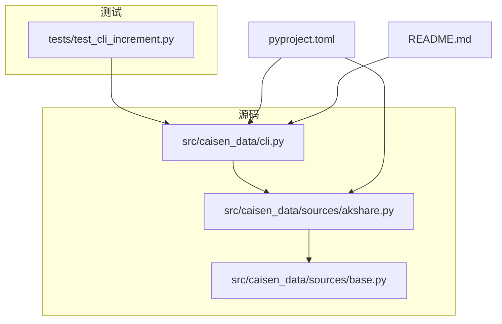
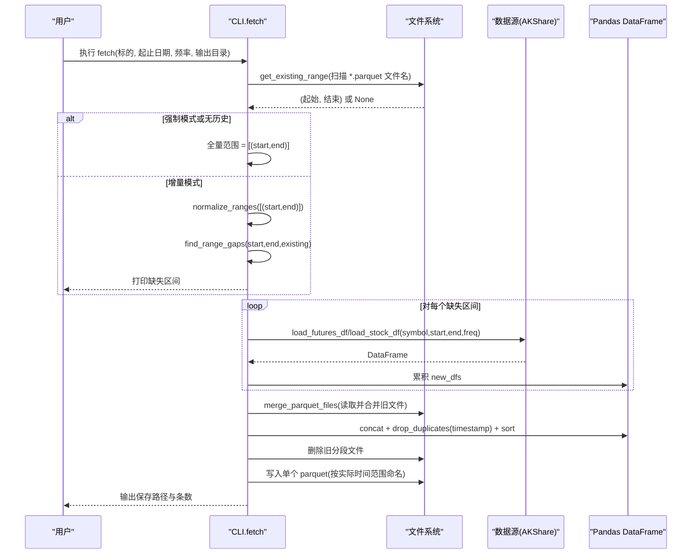
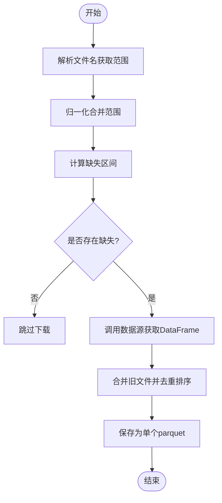
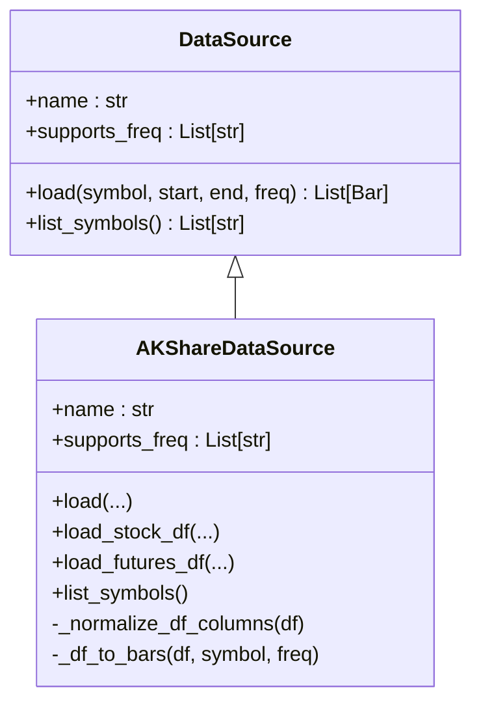
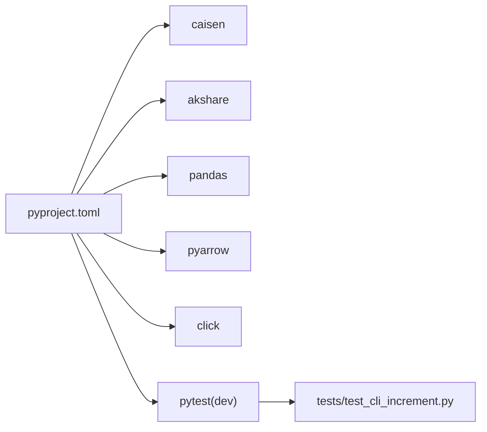

# 测试指南

<cite>
**本文引用的文件**   
- [README.md](file://README.md)
- [pyproject.toml](file://pyproject.toml)
- [cli.py](file://src/caisen_data/cli.py)
- [base.py](file://src/caisen_data/sources/base.py)
- [akshare.py](file://src/caisen_data/sources/akshare.py)
- [test_cli_increment.py](file://tests/test_cli_increment.py)
</cite>

## 目录
1. [简介](#简介)
2. [项目结构](#项目结构)
3. [核心组件](#核心组件)
4. [架构总览](#架构总览)
5. [详细组件分析](#详细组件分析)
6. [依赖分析](#依赖分析)
7. [性能考虑](#性能考虑)
8. [故障排查指南](#故障排查指南)
9. [结论](#结论)
10. [附录](#附录)

## 简介
本测试指南面向 caisen-data 项目的测试体系，聚焦以下目标：
- 说明测试架构与策略（单元测试、集成测试的组织方式）
- 解析现有测试用例，尤其是增量更新功能的实现与覆盖点
- 提供编写新测试用例的指导原则与最佳实践
- 说明测试环境搭建与依赖管理
- 给出覆盖率要求建议与性能测试方法
- 提供调试技巧与常用工具推荐
- 解释如何模拟外部数据源与文件系统操作进行测试

## 项目结构
当前仓库的测试相关结构与关键文件如下：
- tests/test_cli_increment.py：针对 CLI 增量逻辑的单元测试集合
- src/caisen_data/cli.py：CLI 入口与增量更新核心算法（范围合并、缺口计算、文件合并等）
- src/caisen_data/sources/base.py：数据源抽象接口
- src/caisen_data/sources/akshare.py：AKShare 数据源实现（含 DataFrame 接口与 Bar 转换）
- pyproject.toml：构建与依赖声明（包含 pytest 可选依赖）
- README.md：使用说明与数据格式约定

图表来源
- [test_cli_increment.py:1-231](file://tests/test_cli_increment.py#L1-L231)
- [cli.py:1-314](file://src/caisen_data/cli.py#L1-L314)
- [base.py:1-43](file://src/caisen_data/sources/base.py#L1-L43)
- [akshare.py:1-245](file://src/caisen_data/sources/akshare.py#L1-L245)
- [pyproject.toml:1-29](file://pyproject.toml#L1-L29)
- [README.md:1-144](file://README.md#L1-L144)

章节来源
- [pyproject.toml:1-29](file://pyproject.toml#L1-L29)
- [README.md:1-144](file://README.md#L1-L144)

## 核心组件
本节从测试视角梳理被测核心组件及其职责。

- CLI 增量逻辑（cli.py）
  - 文件名解析：parse_date_range_from_filename
  - 已有范围推断：get_existing_range
  - 范围归一化：normalize_ranges
  - 缺失区间计算：find_range_gaps
  - Parquet 合并：merge_parquet_files
  - fetch 命令主流程：基于上述函数完成增量下载、合并与落盘

- 数据源接口与实现（sources/base.py, sources/akshare.py）
  - DataSource 抽象类定义 load 与 list_symbols 接口
  - AKShareDataSource 提供 stock/futures 的 DataFrame 接口与 Bar 转换

- 测试用例（tests/test_cli_increment.py）
  - 覆盖 parse_date_range_from_filename、normalize_ranges、find_range_gaps、get_existing_range、merge_parquet_files 以及默认数据目录常量校验

章节来源
- [cli.py:19-116](file://src/caisen_data/cli.py#L19-L116)
- [base.py:14-43](file://src/caisen_data/sources/base.py#L14-L43)
- [akshare.py:37-245](file://src/caisen_data/sources/akshare.py#L37-L245)
- [test_cli_increment.py:1-231](file://tests/test_cli_increment.py#L1-L231)

## 架构总览
下图展示 CLI 增量更新的端到端流程，包括“已有范围推断—缺口计算—下载—合并—去重—保存”的关键步骤。

图表来源
- [cli.py:140-276](file://src/caisen_data/cli.py#L140-L276)
- [cli.py:32-116](file://src/caisen_data/cli.py#L32-L116)
- [akshare.py:115-190](file://src/caisen_data/sources/akshare.py#L115-L190)

## 详细组件分析

### 增量更新核心算法与测试映射
本节将增量更新的核心函数与其对应测试进行对照，帮助理解测试覆盖点与边界条件。

- 文件名解析 parse_date_range_from_filename
  - 功能：从形如 YYYYMMDD_YYYYMMDD.parquet 的文件名中解析起止日期
  - 测试要点：有效文件名、无效文件名、单段文件名、非法日期格式
  - 参考测试类：TestParseDateRangeFromFilename

- 范围归一化 normalize_ranges
  - 功能：合并重叠或相邻的日期范围，返回有序不重叠列表
  - 测试要点：空列表、单范围、重叠、相邻、非重叠、未排序输入
  - 参考测试类：TestNormalizeRanges

- 缺失区间计算 find_range_gaps
  - 功能：在请求范围内找出未被已有范围覆盖的区间
  - 测试要点：无已有数据、完全覆盖、末尾缺口、开头缺口、中间缺口、已有数据在请求范围外、已有数据超出请求范围
  - 参考测试类：TestFindRangeGaps

- 已有范围推断 get_existing_range
  - 功能：仅通过文件名推断已有数据的起止范围（无需读取内容）
  - 测试要点：目录不存在、空目录、存在多个 parquet、跳过无效文件名
  - 参考测试类：TestGetExistingRange

- Parquet 合并 merge_parquet_files
  - 功能：读取目录下所有 parquet 并合并，按 timestamp 去重排序
  - 测试要点：空目录、单文件、多文件合并与去重
  - 参考测试类：TestMergeParquetFiles

- 默认数据目录 DEFAULT_DATA_DIR
  - 断言：默认目录不应硬编码为 /home/user/data，应位于用户主目录下
  - 参考测试类：TestDefaultDataDir

图表来源
- [cli.py:19-116](file://src/caisen_data/cli.py#L19-L116)
- [cli.py:140-276](file://src/caisen_data/cli.py#L140-L276)

章节来源
- [test_cli_increment.py:23-36](file://tests/test_cli_increment.py#L23-L36)
- [test_cli_increment.py:43-86](file://tests/test_cli_increment.py#L43-L86)
- [test_cli_increment.py:93-148](file://tests/test_cli_increment.py#L93-L148)
- [test_cli_increment.py:156-176](file://tests/test_cli_increment.py#L156-L176)
- [test_cli_increment.py:183-216](file://tests/test_cli_increment.py#L183-L216)
- [test_cli_increment.py:224-231](file://tests/test_cli_increment.py#L224-L231)
- [cli.py:19-116](file://src/caisen_data/cli.py#L19-L116)

### 数据源接口与测试策略
- 接口设计
  - DataSource 抽象类定义了统一的 load 与 list_symbols 接口
  - AKShareDataSource 实现了 DataFrame 接口（load_stock_df、load_futures_df），避免强依赖 Bar 对象；当使用 load() 返回 Bar 时，需要安装 caisen 包

- 测试策略建议
  - 单元测试：对 DataFrame 接口的列名规范化、类型转换、过滤逻辑进行验证
  - 隔离网络：使用 mock 替换 akshare 调用，确保测试可重复且快速
  - 异常路径：模拟 akshare 未安装、网络错误、空结果等情况

图表来源
- [base.py:14-43](file://src/caisen_data/sources/base.py#L14-L43)
- [akshare.py:37-245](file://src/caisen_data/sources/akshare.py#L37-L245)

章节来源
- [base.py:14-43](file://src/caisen_data/sources/base.py#L14-L43)
- [akshare.py:37-245](file://src/caisen_data/sources/akshare.py#L37-L245)

## 依赖分析
- 构建与依赖
  - 构建系统：hatchling
  - Python 版本：>=3.10
  - 运行依赖：caisen、akshare、pandas、pyarrow、click
  - 开发依赖：pytest（可选依赖 dev）
  - CLI 入口：caisen-data -> caisen_data.cli:main
  - 插件注册：entry-points "caisen.datasources" 指向 AKShareDataSource

- 测试依赖
  - pytest 作为测试框架
  - pandas 用于构造与验证 DataFrame
  - pathlib 用于临时目录与路径操作

图表来源
- [pyproject.toml:1-29](file://pyproject.toml#L1-L29)
- [test_cli_increment.py:1-231](file://tests/test_cli_increment.py#L1-L231)

章节来源
- [pyproject.toml:1-29](file://pyproject.toml#L1-L29)

## 性能考虑
- 增量更新性能关键点
  - 文件名扫描：get_existing_range 仅扫描文件名，避免读取文件内容，降低 I/O 开销
  - 合并与去重：merge_parquet_files 使用 concat + drop_duplicates(subset=["timestamp"]) + sort_values("timestamp")，保证幂等性与一致性
  - 大文件处理：当数据量较大时，建议分批读取与合并，避免一次性加载过多内存

- 建议的性能测试方法
  - 生成不同规模的数据集（例如 1k、10k、100k 行），测量 merge_parquet_files 的执行时间与内存占用
  - 对比多次合并的去重耗时，评估索引优化空间（如预先按 timestamp 排序）
  - 使用 timeit 或 perf_counter 记录关键路径耗时，建立回归基线

[本节为通用指导，不涉及具体文件分析]

## 故障排查指南
- 常见问题定位
  - 文件名解析失败：检查文件名是否符合 YYYYMMDD_YYYYMMDD.parquet 规范
  - 增量未生效：确认已有范围推断是否正确，查看缺失区间打印日志
  - 合并后数据重复：检查 timestamp 是否唯一，确认去重逻辑是否生效
  - 数据源不可用：确认 akshare 已安装，或使用 DataFrame 接口绕过 Bar 依赖

- 调试技巧
  - 启用日志：在 CLI 模块中使用了 logging，可通过设置日志级别观察详细过程
  - 使用 tmp_path fixture：测试中利用 pytest 的 tmp_path 创建临时目录，避免污染真实文件系统
  - 断言细化：对关键中间结果（如缺失区间、合并后的行数与列顺序）进行断言，便于快速定位问题

章节来源
- [cli.py:140-276](file://src/caisen_data/cli.py#L140-L276)
- [test_cli_increment.py:156-216](file://tests/test_cli_increment.py#L156-L216)

## 结论
本项目测试以单元测试为主，围绕 CLI 增量更新的核心算法展开，覆盖了文件名解析、范围归一化、缺口计算、已有范围推断与 Parquet 合并等关键路径。建议在后续扩展中补充数据源层的单元测试与集成测试，完善覆盖率与性能基准，并通过 mock 与 fixtures 提升测试稳定性与可维护性。

[本节为总结性内容，不涉及具体文件分析]

## 附录

### 测试环境搭建与依赖管理
- 安装开发依赖
  - 使用 pip 安装可选依赖：pip install -e ".[dev]"
- 运行测试
  - 在项目根目录执行：pytest
- 指定测试文件
  - pytest tests/test_cli_increment.py
- 指定测试类或方法
  - pytest tests/test_cli_increment.py::TestFindRangeGaps
  - pytest tests/test_cli_increment.py::TestFindRangeGaps::test_gap_in_middle

章节来源
- [pyproject.toml:19-21](file://pyproject.toml#L19-L21)
- [test_cli_increment.py:1-231](file://tests/test_cli_increment.py#L1-L231)

### 编写新测试用例的指导原则与最佳实践
- 组织方式
  - 按功能域划分测试类，每个类聚焦一个函数或一组相关函数
  - 使用描述性测试方法名，明确表达输入与期望行为
- 数据准备
  - 使用 tmp_path 管理临时目录，避免影响真实文件系统
  - 使用 pandas 构造最小数据集，覆盖边界情况（空、单条、重复、乱序）
- 断言策略
  - 断言返回值结构、长度、顺序与关键列值
  - 对副作用（如文件删除、写入）进行断言
- 隔离外部依赖
  - 使用 unittest.mock.patch 或 pytest-mock 替换 akshare 调用
  - 对网络异常、空结果、类型不一致等异常路径进行覆盖
- 可重复性与速度
  - 避免真实网络请求，使用固定数据与确定性逻辑
  - 控制数据规模，确保测试快速稳定

章节来源
- [test_cli_increment.py:156-216](file://tests/test_cli_increment.py#L156-L216)
- [akshare.py:115-190](file://src/caisen_data/sources/akshare.py#L115-L190)

### 模拟外部数据源与文件系统操作
- 模拟外部数据源
  - 使用 @patch("caisen_data.sources.akshare.ak.stock_zh_a_hist") 或 futures 相关 API，返回预置 DataFrame
  - 模拟 ImportError（akshare 未安装）与 ValueError（不支持的频率）
- 模拟文件系统
  - 使用 tmp_path 创建临时目录，写入/删除 parquet 文件
  - 验证 get_existing_range 与 merge_parquet_files 的行为在不同文件组合下的一致性

章节来源
- [cli.py:32-116](file://src/caisen_data/cli.py#L32-L116)
- [akshare.py:115-190](file://src/caisen_data/sources/akshare.py#L115-L190)

### 测试覆盖率要求建议
- 建议指标
  - 语句覆盖率 ≥ 80%
  - 分支覆盖率 ≥ 70%
  - 关键路径（增量更新）覆盖率 ≥ 90%
- 执行方式
  - 使用 pytest-cov 插件：pytest --cov=src/caisen_data --cov-report=term-missing
- 持续集成
  - 在 CI 中收集覆盖率报告，设定阈值门禁

[本节为通用指导，不涉及具体文件分析]

### 性能测试方法
- 基准测试
  - 使用 pytest-benchmark 或 timeit 对 merge_parquet_files 与 find_range_gaps 进行基准测试
- 压力测试
  - 生成大规模 parquet 文件，评估合并与去重的时间与内存消耗
- 回归监控
  - 记录关键场景的耗时基线，防止性能退化

[本节为通用指导，不涉及具体文件分析]

### 常用工具推荐
- 测试框架：pytest
- 覆盖率：pytest-cov
- 基准测试：pytest-benchmark
- Mock：unittest.mock 或 pytest-mock
- 临时文件：pytest tmp_path fixture

[本节为通用指导，不涉及具体文件分析]