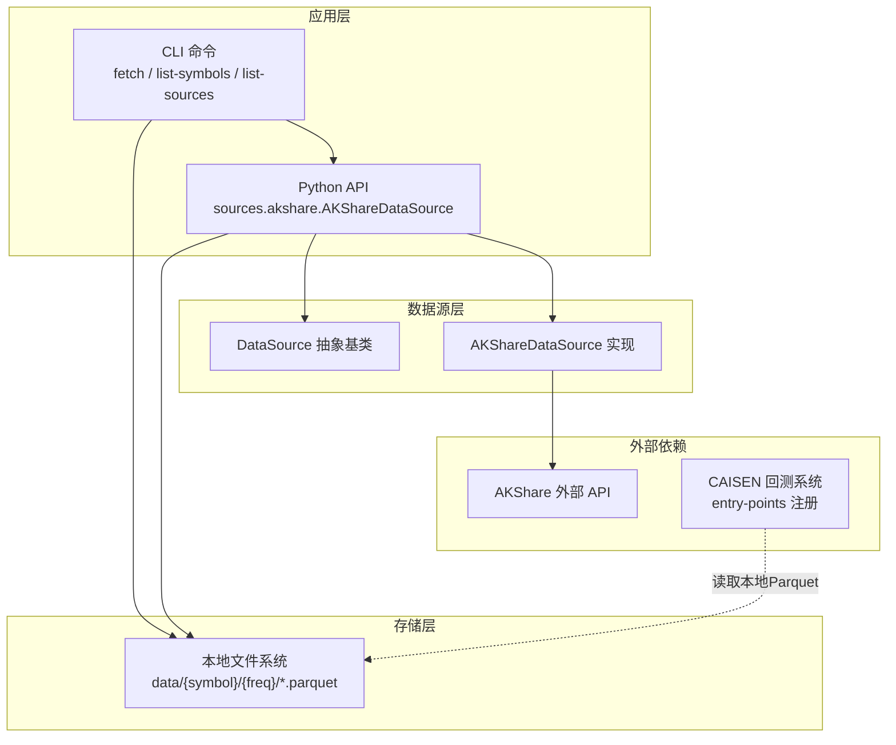
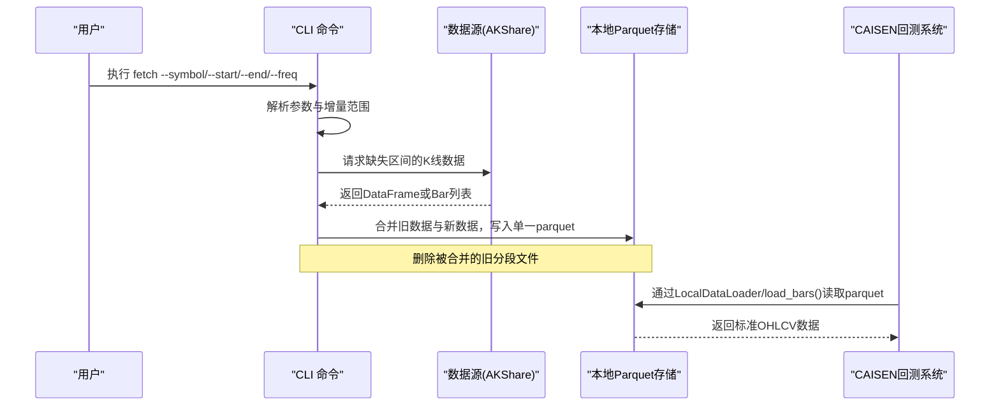
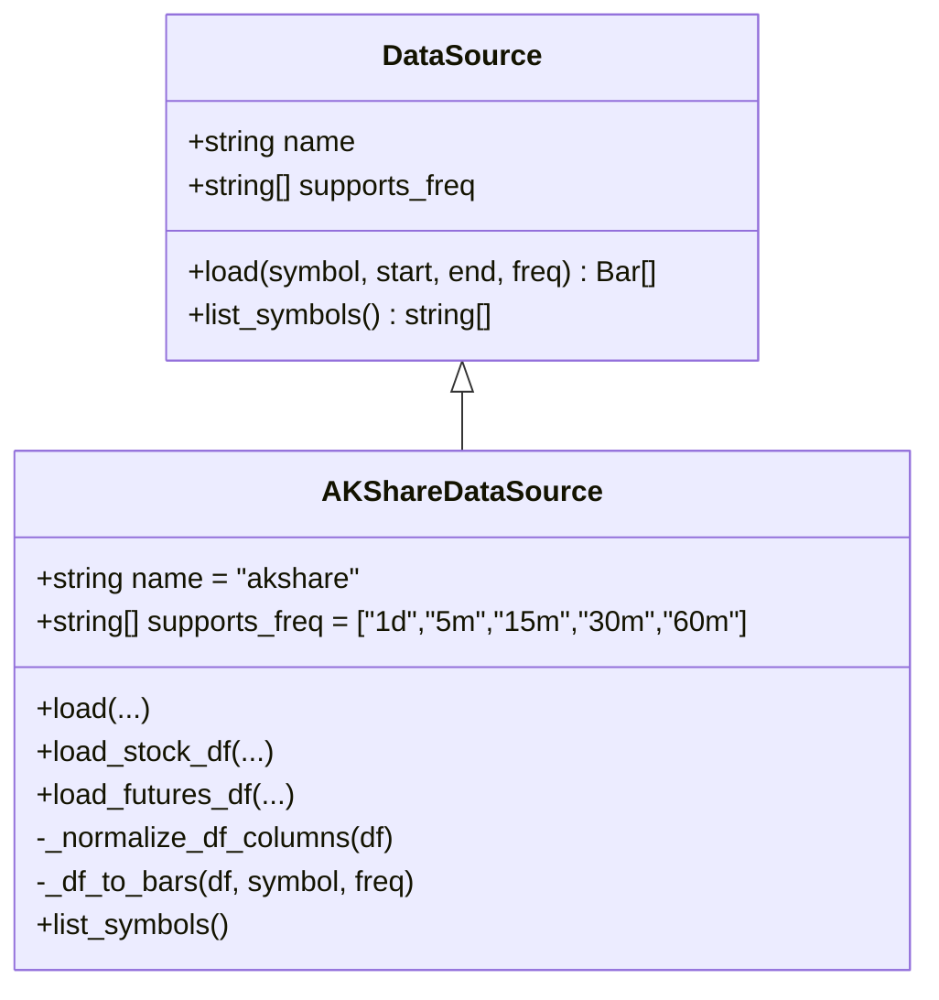
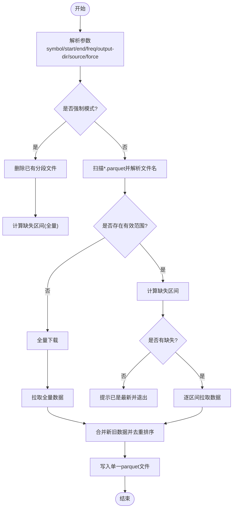
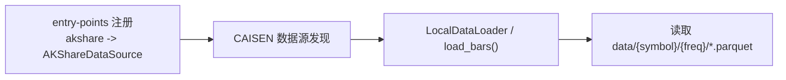
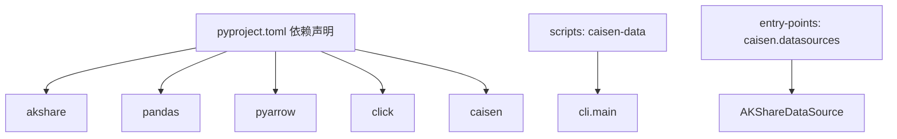

# 项目概述

<cite>
**本文引用的文件**   
- [README.md](file://README.md)
- [pyproject.toml](file://pyproject.toml)
- [src/caisen_data/__init__.py](file://src/caisen_data/__init__.py)
- [src/caisen_data/cli.py](file://src/caisen_data/cli.py)
- [src/caisen_data/sources/__init__.py](file://src/caisen_data/sources/__init__.py)
- [src/caisen_data/sources/base.py](file://src/caisen_data/sources/base.py)
- [src/caisen_data/sources/akshare.py](file://src/caisen_data/sources/akshare.py)
- [tests/test_cli_increment.py](file://tests/test_cli_increment.py)
</cite>

## 目录
1. [简介](#简介)
2. [项目结构](#项目结构)
3. [核心组件](#核心组件)
4. [架构总览](#架构总览)
5. [详细组件分析](#详细组件分析)
6. [依赖关系分析](#依赖关系分析)
7. [性能与存储特性](#性能与存储特性)
8. [故障排查指南](#故障排查指南)
9. [结论](#结论)
10. [附录：蔡森理论数据建议与使用场景](#附录蔡森理论数据建议与使用场景)

## 简介
caisen-data 是一个为 CAISEN 回测生态提供金融数据抓取能力的 CLI 工具与 Python 库，专注于 A 股与期货数据的增量更新与本地持久化。其核心价值在于：
- 统一的数据源抽象层，便于扩展新的外部数据接口
- 基于文件名解析的增量更新机制，避免重复下载并自动合并新数据
- 以 Parquet 列式格式进行高效本地存储，便于后续分析与回测读取
- 通过 entry-points 与 CAISEN 回测系统无缝集成，支持在 caisen 中直接加载本地数据

该项目同时提供命令行与 Python API 两种使用方式，既适合自动化流水线，也适合交互式研究。

## 项目结构
项目采用“功能模块 + 数据源插件”的组织方式：
- src/caisen_data：包根与入口
  - cli.py：CLI 命令实现（fetch、list-symbols、list-sources）
  - sources：数据源抽象与具体实现
    - base.py：DataSource 抽象基类
    - akshare.py：AKShare 数据源实现
    - __init__.py：导出 DataSource 与 AKShareDataSource
  - __init__.py：包元信息与日志初始化
- tests：单元测试，覆盖增量逻辑与合并行为
- data/ag：示例数据存储目录（按标的与频率组织）
- pyproject.toml：构建配置、依赖声明、CLI 入口与 CAISEN 数据源注册
- README.md：安装、快速开始、数据格式与协作说明

图表来源
- [src/caisen_data/cli.py:126-314](file://src/caisen_data/cli.py#L126-L314)
- [src/caisen_data/sources/base.py:14-43](file://src/caisen_data/sources/base.py#L14-L43)
- [src/caisen_data/sources/akshare.py:37-245](file://src/caisen_data/sources/akshare.py#L37-L245)
- [pyproject.toml:22-26](file://pyproject.toml#L22-L26)

章节来源
- [README.md:1-144](file://README.md#L1-L144)
- [pyproject.toml:1-29](file://pyproject.toml#L1-L29)
- [src/caisen_data/__init__.py:1-8](file://src/caisen_data/__init__.py#L1-L8)
- [src/caisen_data/cli.py:1-314](file://src/caisen_data/cli.py#L1-L314)
- [src/caisen_data/sources/__init__.py:1-6](file://src/caisen_data/sources/__init__.py#L1-L6)
- [src/caisen_data/sources/base.py:1-43](file://src/caisen_data/sources/base.py#L1-L43)
- [src/caisen_data/sources/akshare.py:1-245](file://src/caisen_data/sources/akshare.py#L1-L245)
- [tests/test_cli_increment.py:1-231](file://tests/test_cli_increment.py#L1-L231)

## 核心组件
- CLI 命令层
  - fetch：根据 symbol、start/end、freq 拉取数据，执行增量计算、合并与保存
  - list-symbols：列出可用标的（当前仅支持 akshare）
  - list-sources：列出已注册数据源
- 数据源抽象层
  - DataSource：定义 load() 与 list_symbols() 接口，屏蔽不同数据源差异
  - AKShareDataSource：实现股票与期货数据获取，支持多种频率
- 增量与合并逻辑
  - 基于文件名解析已有时间范围，计算缺失区间
  - 多段 parquet 合并去重排序后写回单个文件
- 存储格式
  - Parquet 列式存储，包含 timestamp/open/high/low/close/volume/symbol/freq 等字段

章节来源
- [src/caisen_data/cli.py:126-314](file://src/caisen_data/cli.py#L126-L314)
- [src/caisen_data/sources/base.py:14-43](file://src/caisen_data/sources/base.py#L14-L43)
- [src/caisen_data/sources/akshare.py:37-245](file://src/caisen_data/sources/akshare.py#L37-L245)
- [README.md:90-131](file://README.md#L90-L131)

## 架构总览
整体数据流从外部数据源到本地存储，再到 CAISEN 回测系统：

图表来源
- [src/caisen_data/cli.py:140-276](file://src/caisen_data/cli.py#L140-L276)
- [src/caisen_data/sources/akshare.py:115-190](file://src/caisen_data/sources/akshare.py#L115-L190)
- [README.md:103-116](file://README.md#L103-L116)

## 详细组件分析

### 数据源抽象层与 AKShare 实现
- 抽象基类 DataSource
  - 定义统一的 load(symbol, start, end, freq) 接口与可选的 list_symbols()
  - 支持 supports_freq 能力声明，便于上层调度
- AKShareDataSource
  - 区分股票与期货路径：股票仅日线；期货支持日线与分钟级
  - 标准化列名映射，确保输出一致（timestamp/open/high/low/close/volume/symbol/freq）
  - 提供 DataFrame 接口（load_stock_df/load_futures_df），降低对 caisen 的强依赖
  - 内部 _df_to_bars 将 DataFrame 转换为 Bar 对象（当 caisen 可用时）

图表来源
- [src/caisen_data/sources/base.py:14-43](file://src/caisen_data/sources/base.py#L14-L43)
- [src/caisen_data/sources/akshare.py:37-245](file://src/caisen_data/sources/akshare.py#L37-L245)

章节来源
- [src/caisen_data/sources/base.py:1-43](file://src/caisen_data/sources/base.py#L1-43)
- [src/caisen_data/sources/akshare.py:1-245](file://src/caisen_data/sources/akshare.py#L1-L245)
- [src/caisen_data/sources/__init__.py:1-6](file://src/caisen_data/sources/__init__.py#L1-L6)

### CLI 增量更新流程
- 增量范围计算
  - 从文件名解析已有时间范围（无需读取文件内容）
  - 合并相邻/重叠范围，计算缺失区间
- 下载与合并
  - 优先使用 DataFrame 接口减少对象转换开销
  - 合并新旧数据，去重并按时间排序
  - 删除被合并的旧分段文件，保持目录整洁
- 输出
  - 以实际数据起止日期命名单个 parquet 文件

图表来源
- [src/caisen_data/cli.py:19-116](file://src/caisen_data/cli.py#L19-L116)
- [src/caisen_data/cli.py:140-276](file://src/caisen_data/cli.py#L140-L276)

章节来源
- [src/caisen_data/cli.py:1-314](file://src/caisen_data/cli.py#L1-L314)
- [tests/test_cli_increment.py:1-231](file://tests/test_cli_increment.py#L1-L231)

### 与 CAISEN 回测系统的集成
- 通过 pyproject.toml 的 entry-points 将 AKShareDataSource 注册为 caisen 的数据源
- CAISEN 可通过 LocalDataLoader 或 load_bars() 直接读取本地 parquet 文件，形成“数据准备—回测运行”的闭环

图表来源
- [pyproject.toml:25-26](file://pyproject.toml#L25-L26)
- [README.md:103-116](file://README.md#L103-L116)

章节来源
- [pyproject.toml:22-26](file://pyproject.toml#L22-L26)
- [README.md:103-116](file://README.md#L103-L116)

## 依赖关系分析
- 运行时依赖
  - akshare：外部行情数据接口
  - pandas/pyarrow：数据处理与 Parquet 读写
  - click：CLI 框架
  - caisen：回测系统与 Bar 类型（可选，部分接口需要）
- 构建与脚本
  - hatchling：构建后端
  - scripts：caisen-data 可执行入口
  - entry-points：向 caisen 注册数据源

图表来源
- [pyproject.toml:11-26](file://pyproject.toml#L11-L26)

章节来源
- [pyproject.toml:1-29](file://pyproject.toml#L1-L29)

## 性能与存储特性
- 增量优化
  - 基于文件名解析已有范围，避免读取大量文件内容
  - 缺失区间合并与去重，减少网络请求与磁盘 I/O
- 存储格式
  - Parquet 列式压缩，适合时序 OHLCV 数据的高效读写与分析
  - 单文件聚合策略，简化下游读取与索引管理
- 内存与速度
  - 优先使用 DataFrame 接口，减少对象构造开销
  - 合并阶段按 timestamp 去重与排序，保证一致性

[本节为通用性能讨论，不直接分析具体代码文件]

## 故障排查指南
- 常见错误与定位
  - 未安装 akshare：调用时会抛出明确 ImportError，需先安装依赖
  - 股票频率不支持：股票仅支持日线，分钟级会报错
  - 未知数据源：CLI 会提示并记录错误日志
  - 无数据返回：区间可能无交易数据，需调整时间范围
- 日志与调试
  - 使用 logging.getLogger("caisen_data.cli") 与 logger.info/warning/error 输出关键步骤
  - 测试用例覆盖了文件名解析、范围合并、缺失区间计算与文件合并去重等行为，可作为参考

章节来源
- [src/caisen_data/sources/akshare.py:115-190](file://src/caisen_data/sources/akshare.py#L115-L190)
- [src/caisen_data/cli.py:182-230](file://src/caisen_data/cli.py#L182-L230)
- [tests/test_cli_increment.py:1-231](file://tests/test_cli_increment.py#L1-L231)

## 结论
caisen-data 以简洁清晰的架构实现了金融数据的稳定抓取与增量更新，并通过 Parquet 本地存储与 CAISEN 回测系统深度集成，形成了“数据准备—回测运行”的一体化工作流。对于初学者而言，掌握 CLI 的基本用法与数据目录结构即可快速上手；对于进阶用户，可扩展新的数据源实现以满足更多市场与品种需求。

[本节为总结性内容，不直接分析具体代码文件]

## 附录：蔡森理论数据建议与使用场景
- 时间框架：日线或周线，避免小周期杂讯
- 数据长度：半年以上用于趋势判断
- 整理平台：至少 10-20 根 K 线形成有效平台
- 推荐示例：下载两年日线数据，满足蔡森理论的分析要求

章节来源
- [README.md:132-144](file://README.md#L132-L144)