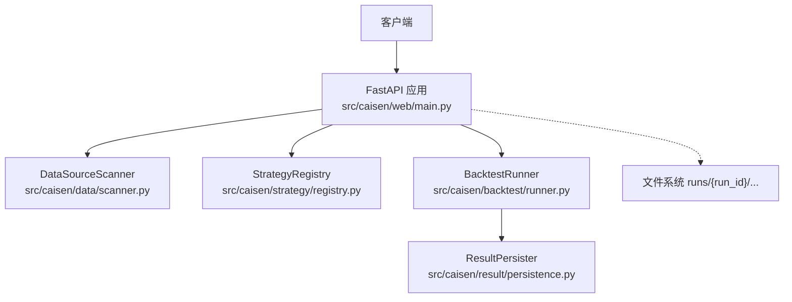
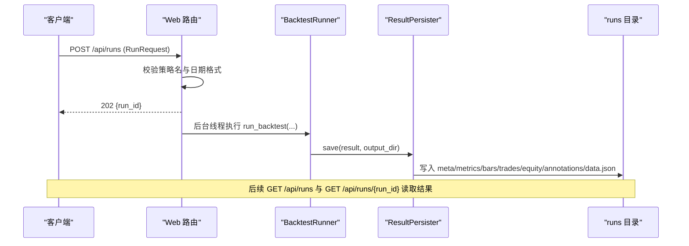
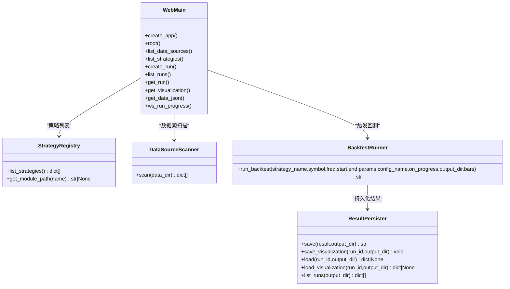

# RESTful API 接口

<cite>
**本文引用的文件**
- [src/caisen/web/main.py](file://src/caisen/web/main.py)
- [src/caisen/backtest/runner.py](file://src/caisen/backtest/runner.py)
- [src/caisen/result/persistence.py](file://src/caisen/result/persistence.py)
- [src/caisen/data/scanner.py](file://src/caisen/data/scanner.py)
- [src/caisen/strategy/registry.py](file://src/caisen/strategy/registry.py)
- [tests/test_post_runs_endpoint.py](file://tests/test_post_runs_endpoint.py)
- [tests/test_websocket_progress.py](file://tests/test_websocket_progress.py)
</cite>

## 目录
1. [简介](#简介)
2. [项目结构](#项目结构)
3. [核心组件](#核心组件)
4. [架构总览](#架构总览)
5. [详细接口说明](#详细接口说明)
6. [依赖关系分析](#依赖关系分析)
7. [性能与并发特性](#性能与并发特性)
8. [错误处理与状态码](#错误处理与状态码)
9. [调用示例](#调用示例)
10. [故障排查指南](#故障排查指南)
11. [结论](#结论)

## 简介
本文件为 Caisen 量化回测系统的 RESTful API 文档，覆盖数据源查询、策略列表、回测任务管理（创建、列表、详情、可视化数据）、健康检查等核心接口。同时说明 RunRequest 数据模型的结构与校验规则、异步任务管理机制（HTTP 触发 + WebSocket 进度推送）以及结果持久化流程，并提供 curl 与 Python 客户端调用示例和最佳实践建议。

## 项目结构
Caisen 的 Web 服务基于 FastAPI 实现，位于 src/caisen/web/main.py；后端通过 BacktestRunner 执行回测，使用 ResultPersister 持久化结果，并通过 DataSourceScanner 扫描本地数据目录，StrategyRegistry 提供可用策略列表。

图表来源
- [src/caisen/web/main.py:68-304](file://src/caisen/web/main.py#L68-L304)
- [src/caisen/data/scanner.py:10-34](file://src/caisen/data/scanner.py#L10-L34)
- [src/caisen/strategy/registry.py:108-134](file://src/caisen/strategy/registry.py#L108-L134)
- [src/caisen/backtest/runner.py:26-94](file://src/caisen/backtest/runner.py#L26-L94)
- [src/caisen/result/persistence.py:59-133](file://src/caisen/result/persistence.py#L59-L133)

章节来源
- [src/caisen/web/main.py:68-304](file://src/caisen/web/main.py#L68-L304)

## 核心组件
- Web 路由与服务：定义所有 HTTP/WebSocket 端点、CORS、静态资源与安全路径解析。
- 数据源扫描：按 data_dir/{symbol}/{freq}/*.parquet 推断可用数据范围。
- 策略注册表：列出可运行策略及其参数 schema 与配置预设。
- 回测执行器：封装“加载数据 → 实例化策略 → 引擎运行 → 持久化”的完整流程，支持进度回调。
- 结果持久化：生成 run_id、保存 meta/metrics/bars/trades/equity/annotations/data.json 等。

章节来源
- [src/caisen/web/main.py:68-304](file://src/caisen/web/main.py#L68-L304)
- [src/caisen/data/scanner.py:10-34](file://src/caisen/data/scanner.py#L10-L34)
- [src/caisen/strategy/registry.py:108-134](file://src/caisen/strategy/registry.py#L108-L134)
- [src/caisen/backtest/runner.py:26-94](file://src/caisen/backtest/runner.py#L26-L94)
- [src/caisen/result/persistence.py:59-133](file://src/caisen/result/persistence.py#L59-L133)

## 架构总览
Web 层作为统一入口，将请求分发到各子系统；回测任务在后台线程或 WebSocket 连接内执行，完成后由 ResultPersister 写入 runs 目录，前端通过 /api/runs 与 /api/runs/{run_id} 获取结果与可视化数据。

图表来源
- [src/caisen/web/main.py:107-132](file://src/caisen/web/main.py#L107-L132)
- [src/caisen/backtest/runner.py:26-94](file://src/caisen/backtest/runner.py#L26-L94)
- [src/caisen/result/persistence.py:59-133](file://src/caisen/result/persistence.py#L59-L133)

## 详细接口说明

### 通用约定
- 内容类型：JSON（除直接返回文件的接口）。
- 认证：当前无鉴权要求。
- 跨域：已启用允许所有来源。

### 健康检查
- 方法：GET
- 路径：/health
- 响应体：{"status": "ok"}
- 用途：服务可用性探测

章节来源
- [src/caisen/web/main.py:224-227](file://src/caisen/web/main.py#L224-L227)

### 列出数据源
- 方法：GET
- 路径：/api/data-sources
- 请求参数：无
- 响应体：
  - data_sources: 数组，每项包含 symbol、freq、date_range.start、date_range.end
- 行为：扫描 data_dir 下 {symbol}/{freq}/*.parquet，从文件名 YYYYMMDD_YYYYMMDD.parquet 推断起止日期

章节来源
- [src/caisen/web/main.py:96-100](file://src/caisen/web/main.py#L96-L100)
- [src/caisen/data/scanner.py:10-34](file://src/caisen/data/scanner.py#L10-L34)

### 列出策略
- 方法：GET
- 路径：/api/strategies
- 请求参数：无
- 响应体：
  - strategies: 数组，每项包含 name、display_name、type、note、params_schema、config_presets
- 行为：动态发现内置策略并提取参数 schema 与配置预设

章节来源
- [src/caisen/web/main.py:102-105](file://src/caisen/web/main.py#L102-L105)
- [src/caisen/strategy/registry.py:108-134](file://src/caisen/strategy/registry.py#L108-L134)

### 创建回测任务（异步）
- 方法：POST
- 路径：/api/runs
- 请求体：RunRequest（见下方数据模型）
- 成功响应：202 Accepted，{"run_id": "<占位ID>"}
- 失败响应：
  - 422：策略未注册或日期格式不合法
- 行为：立即返回 run_id，实际回测在后台线程执行；可通过 /api/runs 轮询结果

章节来源
- [src/caisen/web/main.py:107-132](file://src/caisen/web/main.py#L107-L132)
- [tests/test_post_runs_endpoint.py:36-43](file://tests/test_post_runs_endpoint.py#L36-L43)
- [tests/test_post_runs_endpoint.py:50-53](file://tests/test_post_runs_endpoint.py#L50-L53)
- [tests/test_post_runs_endpoint.py:60-63](file://tests/test_post_runs_endpoint.py#L60-L63)

#### RunRequest 数据模型与校验
- 字段：
  - strategy_name: 字符串，必填
  - symbol: 字符串，必填
  - freq: 字符串，必填
  - start: 字符串，必填，格式 YYYY-MM-DD
  - end: 字符串，必填，格式 YYYY-MM-DD
  - config_name: 可选字符串，策略配置预设文件名（不含 .yaml），None 时使用策略默认值
- 校验规则：
  - start/end 必须匹配 YYYY-MM-DD 正则，否则 422
  - strategy_name 必须在已注册策略列表中，否则 422
- 注意：
  - 请求体中若包含 params 字段将被忽略（服务端以 config_name 或策略默认值为准）

章节来源
- [src/caisen/web/main.py:42-55](file://src/caisen/web/main.py#L42-L55)
- [src/caisen/web/main.py:107-112](file://src/caisen/web/main.py#L107-L112)

### 列出回测结果
- 方法：GET
- 路径：/api/runs
- 请求参数：无
- 响应体：
  - count: 有效结果数量
  - runs: 数组，每项包含 run_id、strategy_name、created_at、metrics
- 过滤规则：
  - 仅返回存在 meta.json 且存在 data.json 或 bars.parquet 的记录
  - 若 meta.json 中 bar_count == 0，视为无效并排除

章节来源
- [src/caisen/web/main.py:134-183](file://src/caisen/web/main.py#L134-L183)
- [src/caisen/result/persistence.py:260-274](file://src/caisen/result/persistence.py#L260-L274)

### 获取回测结果详情
- 方法：GET
- 路径：/api/runs/{run_id}
- 路径参数：run_id（字符串）
- 成功响应：包含 meta、equity_curve、trades、annotations、metrics、bars 等
- 失败响应：
  - 404：run_id 不存在或结果不完整

章节来源
- [src/caisen/web/main.py:185-192](file://src/caisen/web/main.py#L185-L192)
- [src/caisen/result/persistence.py:204-245](file://src/caisen/result/persistence.py#L204-L245)

### 获取可视化数据（data.json）
- 方法：GET
- 路径：/api/runs/{run_id}/visualization
- 路径参数：run_id
- 成功响应：data.json 内容（meta、metrics、bars、equity_curve、trades、annotations）
- 失败响应：
  - 404：可视化数据不存在

章节来源
- [src/caisen/web/main.py:194-201](file://src/caisen/web/main.py#L194-L201)
- [src/caisen/result/persistence.py:247-257](file://src/caisen/result/persistence.py#L247-L257)

### 直接下载 data.json 文件
- 方法：GET
- 路径：/api/runs/{run_id}/data.json
- 路径参数：run_id
- 成功响应：application/json 文件流
- 失败响应：
  - 404：data.json 不存在

章节来源
- [src/caisen/web/main.py:203-214](file://src/caisen/web/main.py#L203-L214)

### WebSocket 进度推送
- 协议：WS
- 路径：/ws/runs/{run_id}/progress
- 查询参数：
  - strategy_name、symbol、freq、start、end、config_name（可选）
- 消息协议：
  - running：{"status":"running","processed":N,"total":T,"current_date":"YYYY-MM-DD"}
  - done：{"status":"done","run_id":"真实run_id"}
  - error：{"status":"error","message":"错误描述"}
- 行为：
  - 连接后在独立线程执行回测，每 100 根 K 线推送一次进度
  - 完成或出错后发送终态消息并关闭连接
  - 超时（最长等待 5 分钟）返回 error 并关闭连接

章节来源
- [src/caisen/web/main.py:247-302](file://src/caisen/web/main.py#L247-L302)
- [tests/test_websocket_progress.py:50-58](file://tests/test_websocket_progress.py#L50-58)
- [tests/test_websocket_progress.py:65-81](file://tests/test_websocket_progress.py#L65-81)
- [tests/test_websocket_progress.py:88-101](file://tests/test_websocket_progress.py#L88-L101)
- [tests/test_websocket_progress.py:108-129](file://tests/test_websocket_progress.py#L108-L129)

### 其他静态资源与健康页面
- GET /：返回前端 index.html
- GET /report.html：返回报告页面
- GET /js/{filename}：返回 JS 模块
- GET /src/css/{filename}：返回 CSS 样式
- 安全：所有路径均经过 _safe_resolve 校验，防止路径遍历

章节来源
- [src/caisen/web/main.py:86-94](file://src/caisen/web/main.py#L86-94)
- [src/caisen/web/main.py:216-222](file://src/caisen/web/main.py#L216-L222)
- [src/caisen/web/main.py:229-245](file://src/caisen/web/main.py#L229-L245)
- [src/caisen/web/main.py:28-39](file://src/caisen/web/main.py#L28-L39)

## 依赖关系分析
- Web 路由依赖：
  - StrategyRegistry.list_strategies()
  - DataSourceScanner.scan(data_dir)
  - BacktestRunner.run_backtest(...)
  - ResultPersister.list_runs/load/load_visualization/save/save_visualization
- 回测执行器依赖：
  - ProjectConfig（输出目录、数据目录）
  - StrategyRegistry.get_module_path()
  - DataConfig + load_bars（数据加载）
  - BacktestEngine（引擎运行）
  - ResultPersister.save()
- 结果持久化依赖：
  - MetricsCalculator（指标计算）
  - pandas（Parquet 读写）

图表来源
- [src/caisen/web/main.py:68-304](file://src/caisen/web/main.py#L68-L304)
- [src/caisen/strategy/registry.py:108-143](file://src/caisen/strategy/registry.py#L108-L143)
- [src/caisen/data/scanner.py:10-34](file://src/caisen/data/scanner.py#L10-L34)
- [src/caisen/backtest/runner.py:26-94](file://src/caisen/backtest/runner.py#L26-L94)
- [src/caisen/result/persistence.py:59-133](file://src/caisen/result/persistence.py#L59-L133)

章节来源
- [src/caisen/web/main.py:68-304](file://src/caisen/web/main.py#L68-L304)
- [src/caisen/backtest/runner.py:26-94](file://src/caisen/backtest/runner.py#L26-L94)
- [src/caisen/result/persistence.py:59-133](file://src/caisen/result/persistence.py#L59-L133)

## 性能与并发特性
- 异步任务：POST /api/runs 使用 daemon 线程执行回测，避免阻塞请求。
- 进度推送：WebSocket 端点在独立线程执行回测，通过队列桥接 on_progress 回调，降低主事件循环压力。
- 结果读取：/api/runs 与 /api/runs/{run_id} 仅读取 JSON/Parquet，适合高频轮询。
- 建议：
  - 对大区间回测建议使用 WebSocket 跟踪进度，减少轮询开销。
  - 合理设置 runs 目录磁盘空间与 I/O 性能，避免 Parquet 读写瓶颈。

[本节为通用指导，无需源码引用]

## 错误处理与状态码
- 202 Accepted：POST /api/runs 成功接受任务，返回 run_id。
- 400 Bad Request：非法路径字符或路径逃逸出允许范围（内部安全校验）。
- 404 Not Found：run_id 不存在、可视化数据缺失、静态资源缺失。
- 422 Unprocessable Entity：策略未注册、日期格式不合法。
- WebSocket 错误：
  - status=error：回测异常或超时，message 携带错误描述。

章节来源
- [src/caisen/web/main.py:28-39](file://src/caisen/web/main.py#L28-L39)
- [src/caisen/web/main.py:107-112](file://src/caisen/web/main.py#L107-L112)
- [src/caisen/web/main.py:185-201](file://src/caisen/web/main.py#L185-L201)
- [src/caisen/web/main.py:247-302](file://src/caisen/web/main.py#L247-L302)
- [tests/test_post_runs_endpoint.py:50-63](file://tests/test_post_runs_endpoint.py#L50-L63)

## 调用示例

### curl 示例
- 健康检查
  - curl http://localhost:8000/health
- 列出数据源
  - curl http://localhost:8000/api/data-sources
- 列出策略
  - curl http://localhost:8000/api/strategies
- 创建回测任务
  - curl -X POST http://localhost:8000/api/runs \
      -H "Content-Type: application/json" \
      -d '{"strategy_name":"CaiSenStrategy","symbol":"ag","freq":"1d","start":"2023-01-01","end":"2024-12-31","config_name":"caisen_default"}'
- 列出回测结果
  - curl http://localhost:8000/api/runs
- 获取结果详情
  - curl http://localhost:8000/api/runs/CaiSenStrategy_20260522_1
- 获取可视化数据
  - curl http://localhost:8000/api/runs/CaiSenStrategy_20260522_1/visualization
- 下载 data.json
  - curl -O http://localhost:8000/api/runs/CaiSenStrategy_20260522_1/data.json

### Python 客户端示例
- 创建任务并轮询结果
  - 使用 requests.post("/api/runs") 获取 run_id，随后循环 requests.get("/api/runs") 直到目标 run_id 出现在 runs 列表中。
- 获取可视化数据
  - 使用 requests.get("/api/runs/{run_id}/visualization") 获取 data.json 内容。
- WebSocket 进度监听
  - 使用 websockets.connect("ws://localhost:8000/ws/runs/{run_id}/progress?strategy_name=...&symbol=...&freq=...&start=...&end=...&config_name=...") 接收 running/done/error 消息。

[本节为通用示例，无需源码引用]

## 故障排查指南
- 422 策略未注册：确认 strategy_name 来自 /api/strategies 返回的 name 字段。
- 422 日期格式错误：确保 start/end 为 YYYY-MM-DD。
- 404 结果未找到：确认 run_id 正确且结果已持久化（runs 目录下存在 meta.json 与 data.json 或 bars.parquet）。
- WebSocket 长时间无消息：检查网络连通性与服务器日志；确认回测是否因数据不足抛出异常。
- 路径访问被拒：检查 run_id 是否包含非法字符或尝试路径遍历。

章节来源
- [tests/test_post_runs_endpoint.py:50-63](file://tests/test_post_runs_endpoint.py#L50-L63)
- [src/caisen/web/main.py:185-201](file://src/caisen/web/main.py#L185-L201)
- [src/caisen/web/main.py:247-302](file://src/caisen/web/main.py#L247-L302)

## 结论
Caisen 的 RESTful API 提供了完整的数据源查询、策略列表、回测任务管理与结果获取能力。通过 Pydantic 校验与策略注册表预检保证输入合法性，结合后台线程与 WebSocket 实现非阻塞执行与实时进度反馈。结果持久化采用结构化目录与 Parquet/JSON 混合存储，便于前后端高效消费。建议在生产环境结合限流、鉴权与监控增强系统稳定性与安全性。