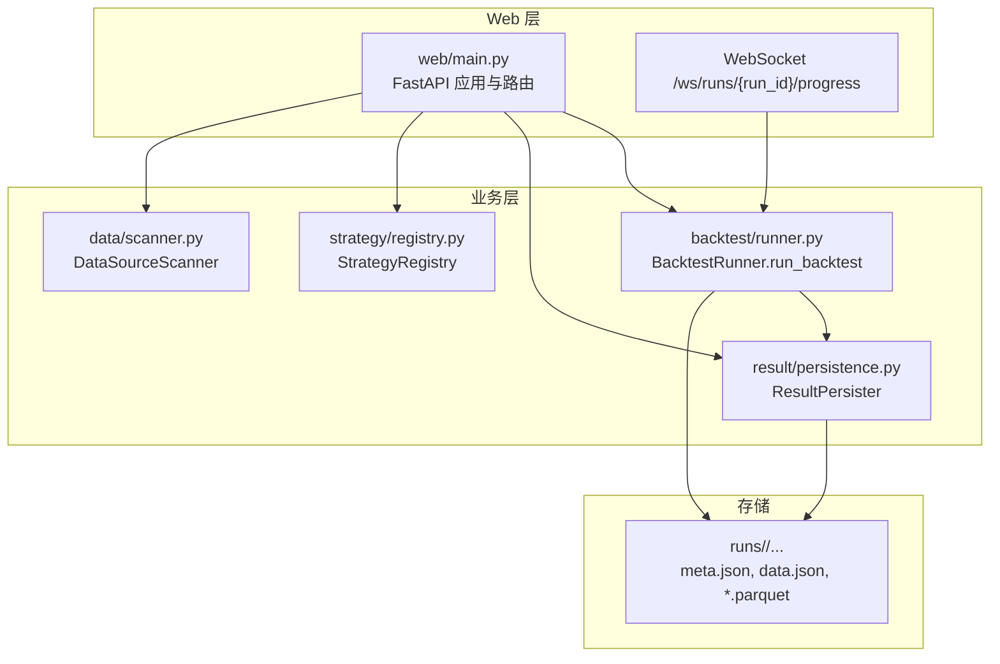
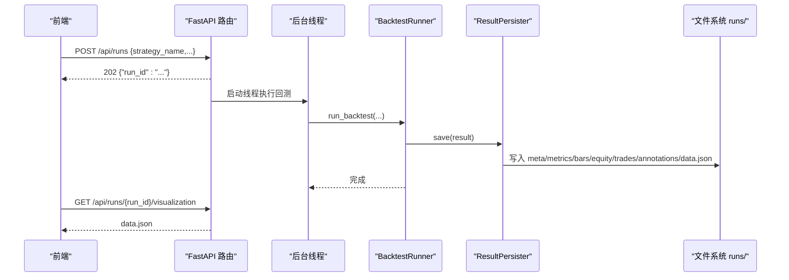
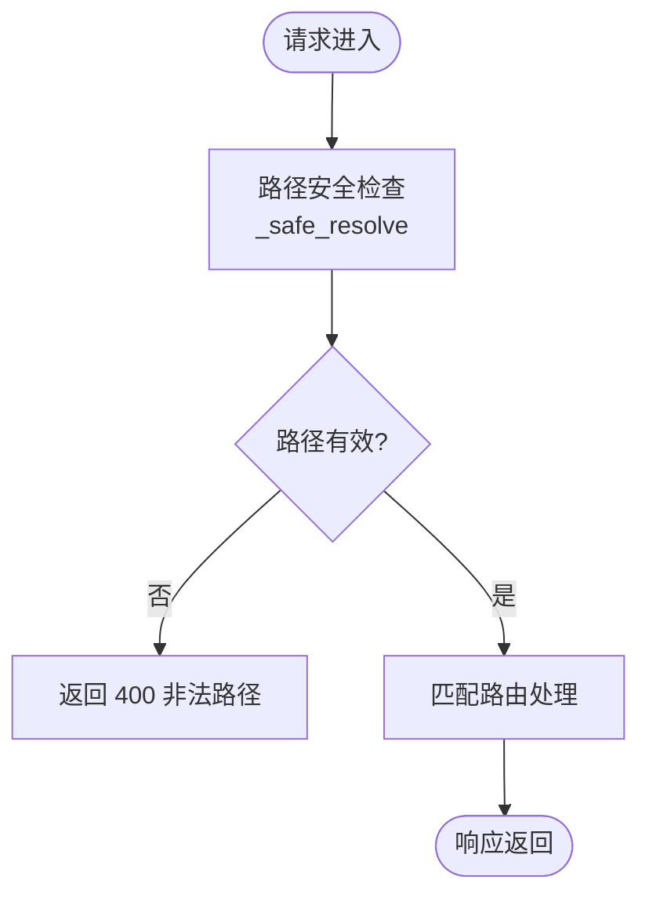
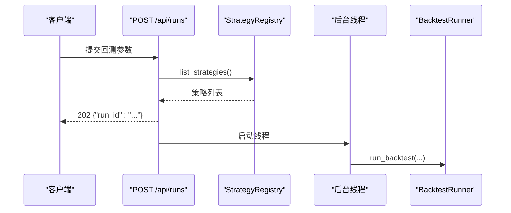
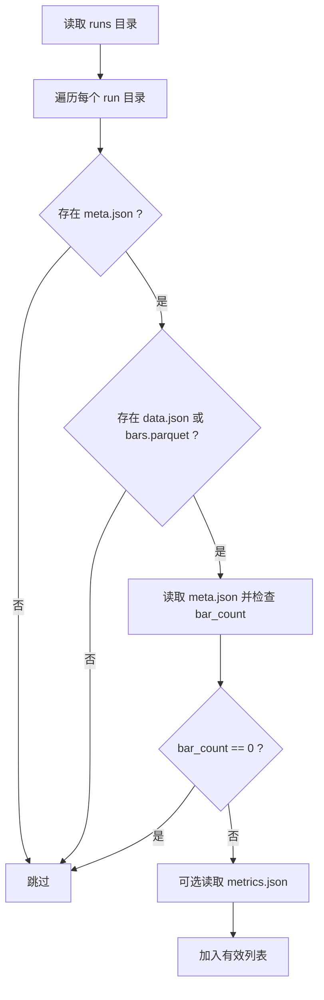
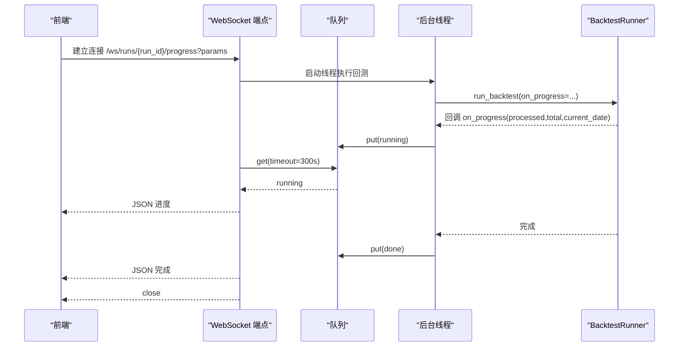
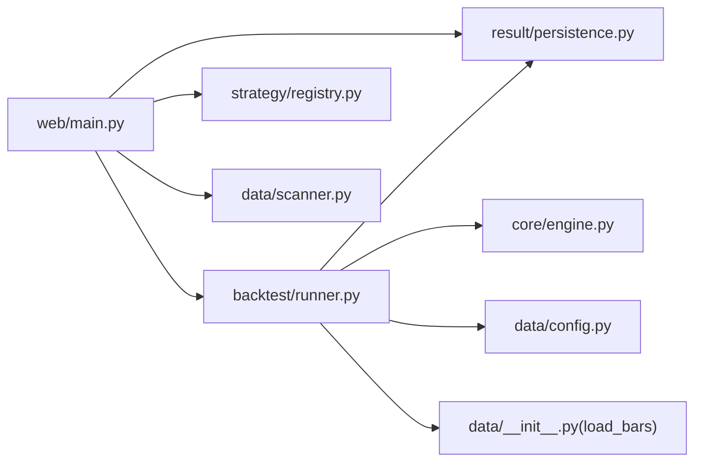

# Web API 服务

<cite>
**本文引用的文件**
- [src/caisen/web/main.py](file://src/caisen/web/main.py)
- [src/caisen/backtest/runner.py](file://src/caisen/backtest/runner.py)
- [src/caisen/result/persistence.py](file://src/caisen/result/persistence.py)
- [src/caisen/strategy/registry.py](file://src/caisen/strategy/registry.py)
- [src/caisen/data/scanner.py](file://src/caisen/data/scanner.py)
- [README.md](file://README.md)
- [docs/agents/issues/010-websocket-progress.md](file://docs/agents/issues/010-websocket-progress.md)
- [docs/agents/issues/009-backtest-runner.md](file://docs/agents/issues/009-backtest-runner.md)
- [tests/test_post_runs_endpoint.py](file://tests/test_post_runs_endpoint.py)
- [src/caisen/frontend/src/js/backtest-panel.js](file://src/caisen/frontend/src/js/backtest-panel.js)
</cite>

## 目录
1. [简介](#简介)
2. [项目结构](#项目结构)
3. [核心组件](#核心组件)
4. [架构总览](#架构总览)
5. [详细组件分析](#详细组件分析)
6. [依赖关系分析](#依赖关系分析)
7. [性能与并发](#性能与并发)
8. [故障排查指南](#故障排查指南)
9. [结论](#结论)
10. [附录：API 使用示例与客户端集成](#附录api-使用示例与客户端集成)

## 简介
本技术文档面向 Caisen Web API 服务，聚焦基于 FastAPI 的后端架构设计、RESTful 接口、WebSocket 实时通信、异步任务调度、结果持久化以及前端集成实践。文档从系统架构到代码级实现进行分层说明，并提供可视化图表帮助读者快速理解数据流与控制流。

## 项目结构
Web API 服务位于 src/caisen/web/main.py，采用 FastAPI 应用工厂模式创建 app，并通过中间件、路由和 WebSocket 端点组织功能。回测执行封装在 BacktestRunner，结果持久化由 ResultPersister 负责，策略注册与参数预设通过 StrategyRegistry 管理，本地数据源扫描由 DataSourceScanner 提供。

图示来源
- [src/caisen/web/main.py:68-304](file://src/caisen/web/main.py#L68-L304)
- [src/caisen/backtest/runner.py:26-94](file://src/caisen/backtest/runner.py#L26-L94)
- [src/caisen/result/persistence.py:62-136](file://src/caisen/result/persistence.py#L62-L136)
- [src/caisen/strategy/registry.py:108-134](file://src/caisen/strategy/registry.py#L108-L134)
- [src/caisen/data/scanner.py:10-34](file://src/caisen/data/scanner.py#L10-L34)

章节来源
- [src/caisen/web/main.py:68-304](file://src/caisen/web/main.py#L68-L304)
- [README.md:86-96](file://README.md#L86-L96)

## 核心组件
- FastAPI 应用与路由
  - 应用工厂 create_app() 初始化 FastAPI 实例，注册 CORS 中间件，定义 REST 路由与 WebSocket 端点。
  - 关键路由包括：根页面、健康检查、策略列表、数据源列表、回测任务提交、回测结果查询、可视化数据获取、静态资源访问。
- 回测执行器 BacktestRunner
  - 统一封装“加载数据 → 实例化策略 → 运行引擎 → 持久化结果”的完整流程，支持进度回调 on_progress。
- 结果持久化 ResultPersister
  - 生成 run_id，保存 meta.json、metrics.json、bars.parquet、equity.parquet、trades.parquet、annotations.json，并生成 data.json 供前端渲染。
- 策略注册表 StrategyRegistry
  - 内置策略清单、动态提取参数 schema、扫描配置预设（configs/strategies/*.yaml）。
- 数据源扫描 DataSourceScanner
  - 根据约定目录结构推断可用 symbol/freq/date_range。

章节来源
- [src/caisen/web/main.py:68-304](file://src/caisen/web/main.py#L68-L304)
- [src/caisen/backtest/runner.py:26-94](file://src/caisen/backtest/runner.py#L26-L94)
- [src/caisen/result/persistence.py:62-136](file://src/caisen/result/persistence.py#L62-L136)
- [src/caisen/strategy/registry.py:108-134](file://src/caisen/strategy/registry.py#L108-L134)
- [src/caisen/data/scanner.py:10-34](file://src/caisen/data/scanner.py#L10-L34)

## 架构总览
后端采用“HTTP + WebSocket + 线程后台任务”的组合模式：
- HTTP 用于元数据查询与任务触发（非阻塞返回）；
- WebSocket 用于长连接进度推送与状态同步；
- 线程后台执行回测，避免阻塞事件循环；
- 结果落盘后，前端通过 REST 拉取 data.json 或聚合结果进行可视化。

图示来源
- [src/caisen/web/main.py:107-132](file://src/caisen/web/main.py#L107-L132)
- [src/caisen/backtest/runner.py:26-94](file://src/caisen/backtest/runner.py#L26-L94)
- [src/caisen/result/persistence.py:62-136](file://src/caisen/result/persistence.py#L62-L136)

## 详细组件分析

### Web 层：路由与中间件
- 中间件
  - 启用 CORS，允许跨域请求，便于前端独立部署。
- 安全路径解析
  - 提供 _safe_resolve 校验用户输入，防止路径遍历攻击，限制访问范围在 output_dir 或前端静态目录内。
- 路由职责
  - 根路径返回前端入口 HTML；
  - /api/strategies 列出策略及参数 schema、配置预设；
  - /api/data-sources 扫描本地数据目录，返回 symbol/freq/date_range；
  - POST /api/runs 预校验策略名，立即返回占位 run_id，后台线程执行回测；
  - GET /api/runs 过滤无效 run（缺失必要文件或 bar_count==0），附带 metrics；
  - GET /api/runs/{run_id} 与 /visualization 返回聚合结果与 data.json；
  - GET /api/runs/{run_id}/data.json 直接下载 data.json；
  - /report.html 返回报告页；
  - /health 健康检查；
  - /js/* 与 /src/css/* 提供前端静态资源。

图示来源
- [src/caisen/web/main.py:28-39](file://src/caisen/web/main.py#L28-L39)
- [src/caisen/web/main.py:86-245](file://src/caisen/web/main.py#L86-L245)

章节来源
- [src/caisen/web/main.py:68-304](file://src/caisen/web/main.py#L68-L304)

### 回测任务管理：POST /api/runs
- 预校验策略名是否在注册表中；
- 生成占位 run_id（含时间戳），立即返回 202；
- 在 daemon 线程中调用 BacktestRunner.run_backtest；
- 异常捕获并记录日志，不影响主进程。

图示来源
- [src/caisen/web/main.py:107-132](file://src/caisen/web/main.py#L107-L132)
- [src/caisen/strategy/registry.py:108-134](file://src/caisen/strategy/registry.py#L108-L134)
- [src/caisen/backtest/runner.py:26-94](file://src/caisen/backtest/runner.py#L26-L94)

章节来源
- [src/caisen/web/main.py:107-132](file://src/caisen/web/main.py#L107-L132)
- [tests/test_post_runs_endpoint.py:43-83](file://tests/test_post_runs_endpoint.py#L43-L83)

### 结果查询：GET /api/runs 与 GET /api/runs/{run_id}
- 列表接口仅返回有效的 run：存在 meta.json，且存在 data.json 或 bars.parquet，且 meta.bar_count != 0；同时读取 metrics.json 附加返回。
- 详情接口返回聚合后的结果（包含 equity_curve、trades、annotations、metrics、bars 等）。

图示来源
- [src/caisen/web/main.py:134-183](file://src/caisen/web/main.py#L134-L183)
- [src/caisen/result/persistence.py:206-248](file://src/caisen/result/persistence.py#L206-L248)

章节来源
- [src/caisen/web/main.py:134-183](file://src/caisen/web/main.py#L134-L183)
- [src/caisen/result/persistence.py:206-248](file://src/caisen/result/persistence.py#L206-L248)

### 可视化数据：GET /api/runs/{run_id}/visualization 与 /data.json
- visualization 返回 data.json 内容；
- data.json 直接以 FileResponse 提供下载，设置 inline 展示。

章节来源
- [src/caisen/web/main.py:194-214](file://src/caisen/web/main.py#L194-L214)
- [src/caisen/result/persistence.py:138-205](file://src/caisen/result/persistence.py#L138-L205)

### WebSocket 实时通信：/ws/runs/{run_id}/progress
- 协议约定：
  - running：{status:"running", processed, total, current_date}
  - done：{status:"done", run_id}
  - error：{status:"error", message}
- 服务端在独立线程中执行回测，每 100 根 K 线触发一次进度回调，通过队列转发消息至 WebSocket；超时则发送错误消息并关闭连接。

图示来源
- [src/caisen/web/main.py:247-303](file://src/caisen/web/main.py#L247-L303)
- [docs/agents/issues/010-websocket-progress.md:1-45](file://docs/agents/issues/010-websocket-progress.md#L1-L45)
- [src/caisen/backtest/runner.py:80-90](file://src/caisen/backtest/runner.py#L80-L90)

章节来源
- [src/caisen/web/main.py:247-303](file://src/caisen/web/main.py#L247-L303)
- [docs/agents/issues/010-websocket-progress.md:1-45](file://docs/agents/issues/010-websocket-progress.md#L1-L45)

### 异步任务调度与并行执行
- 当前实现使用 Python 标准库 threading 在后台线程执行回测，避免阻塞 FastAPI 事件循环；
- 未引入外部任务队列（如 Celery/RQ），因此并行度受限于线程数与 I/O 模型；
- 如需更高并发与资源隔离，建议引入任务队列与进程池，结合限流与重试机制。

章节来源
- [src/caisen/web/main.py:118-131](file://src/caisen/web/main.py#L118-L131)
- [src/caisen/backtest/runner.py:26-94](file://src/caisen/backtest/runner.py#L26-L94)

### 文件持久化服务
- ResultPersister.save 生成 run_id，保存多类文件：
  - meta.json：元数据（策略名、品种、频率、起止时间、bar_count、初始资金、最终净值、总交易次数、创建时间等）
  - metrics.json：绩效指标（年化收益、最大回撤、夏普比率、胜率、盈亏比、总交易次数等）
  - bars.parquet：K 线数据
  - equity.parquet：净值曲线
  - trades.parquet：交易记录
  - annotations.json：可视化标注
  - data.json：前端可视化综合文件（聚合上述数据）
- ResultPersister.list_runs/load/load_visualization 提供查询与读取能力。

章节来源
- [src/caisen/result/persistence.py:62-136](file://src/caisen/result/persistence.py#L62-L136)
- [src/caisen/result/persistence.py:138-205](file://src/caisen/result/persistence.py#L138-L205)
- [src/caisen/result/persistence.py:206-277](file://src/caisen/result/persistence.py#L206-L277)

### 策略注册与参数预设
- StrategyRegistry 维护内置策略清单，动态导入并校验是否为 Strategy 子类；
- 自动提取 __init__ 签名中的默认参数，生成 params_schema；
- 扫描 configs/strategies/*.yaml 为策略提供配置预设名称列表；
- BacktestRunner 支持从 YAML 预设加载参数，并与直接传入的 params 合并（优先级：params > config_name > 默认值）。

章节来源
- [src/caisen/strategy/registry.py:108-143](file://src/caisen/strategy/registry.py#L108-L143)
- [src/caisen/backtest/runner.py:97-121](file://src/caisen/backtest/runner.py#L97-L121)

### 数据源扫描
- DataSourceScanner.scan 按约定目录结构 {data_dir}/{symbol}/{freq}/*.parquet 扫描；
- 通过文件名 YYYYMMDD_YYYYMMDD.parquet 推断 date_range，不读取文件内容。

章节来源
- [src/caisen/data/scanner.py:10-53](file://src/caisen/data/scanner.py#L10-L53)

## 依赖关系分析
- web/main.py 依赖：
  - backtest/runner.BacktestRunner
  - result.persistence.ResultPersister
  - strategy.registry.StrategyRegistry
  - data.scanner.DataSourceScanner
  - FastAPI、CORS、Pydantic、Uvicorn
- runner.py 依赖：
  - core.engine.BacktestEngine
  - result.persistence.ResultPersister
  - strategy.registry.StrategyRegistry
  - data.config.DataConfig 与 data.load_bars
- persistence.py 依赖：
  - pandas、json、pathlib
  - result.calculator.MetricsCalculator

图示来源
- [src/caisen/web/main.py:17-21](file://src/caisen/web/main.py#L17-L21)
- [src/caisen/backtest/runner.py:13-19](file://src/caisen/backtest/runner.py#L13-L19)
- [src/caisen/result/persistence.py:10](file://src/caisen/result/persistence.py#L10)

章节来源
- [src/caisen/web/main.py:17-21](file://src/caisen/web/main.py#L17-L21)
- [src/caisen/backtest/runner.py:13-19](file://src/caisen/backtest/runner.py#L13-L19)

## 性能与并发
- 线程后台执行：避免阻塞事件循环，但单进程多线程在高并发下可能受 GIL 影响；
- 进度回调粒度：每 100 根 K 线触发一次，平衡了实时性与开销；
- 文件 I/O：Parquet 读写高效，但 data.json 生成涉及多次读取与序列化，建议在大数据量场景考虑分块或增量更新；
- 建议优化：
  - 引入任务队列（Celery/RQ）与进程池，提升并行度与隔离性；
  - 对大文件下载启用 Range 请求与缓存；
  - 增加速率限制与熔断保护，防止恶意请求；
  - 对高频查询（如 /api/runs）引入内存缓存或 Redis 缓存。

[本节为通用指导，无需具体文件引用]

## 故障排查指南
- 常见错误与定位
  - 策略未注册：POST /api/runs 返回 422，需确认策略名存在于注册表；
  - 日期格式错误：Pydantic 校验失败返回 422，需符合 YYYY-MM-DD；
  - 数据为空：BacktestRunner 抛出明确异常，需检查 data_dir 与符号/频率/日期范围；
  - 结果缺失：list_runs 过滤无效 run，检查 meta.json、data.json/bars.parquet 是否存在；
  - WebSocket 超时：长时间无进度消息将返回错误并关闭连接，检查 on_progress 是否被正确触发。
- 日志与调试
  - 后端使用 logging.exception 记录后台执行异常；
  - 前端在 backtest-panel.js 中打印关键步骤与错误信息，便于定位问题。

章节来源
- [src/caisen/web/main.py:107-132](file://src/caisen/web/main.py#L107-L132)
- [src/caisen/backtest/runner.py:77-78](file://src/caisen/backtest/runner.py#L77-L78)
- [src/caisen/web/main.py:247-303](file://src/caisen/web/main.py#L247-L303)
- [src/caisen/frontend/src/js/backtest-panel.js:223-293](file://src/caisen/frontend/src/js/backtest-panel.js#L223-L293)

## 结论
Caisen Web API 服务以 FastAPI 为核心，结合线程后台任务与 WebSocket 实现了轻量高效的回测管理与可视化展示。其模块化设计清晰，职责分离良好，适合中小规模使用。若需扩展高并发与复杂调度，建议引入任务队列与更完善的监控、认证与限流机制。

[本节为总结，无需具体文件引用]

## 附录：API 使用示例与客户端集成

### REST 接口概览
- GET /：返回前端入口 HTML
- GET /health：健康检查
- GET /api/strategies：列出策略与参数 schema、配置预设
- GET /api/data-sources：列出本地可用数据源（symbol/freq/date_range）
- POST /api/runs：提交回测任务，返回 202 与占位 run_id
- GET /api/runs：列出有效回测结果（附带 metrics）
- GET /api/runs/{run_id}：获取回测结果详情
- GET /api/runs/{run_id}/visualization：获取 data.json 内容
- GET /api/runs/{run_id}/data.json：下载 data.json
- GET /report.html：返回报告页面
- GET /js/{filename}、GET /src/css/{filename}：静态资源

章节来源
- [src/caisen/web/main.py:86-245](file://src/caisen/web/main.py#L86-L245)

### WebSocket 协议
- 端点：/ws/runs/{run_id}/progress
- 参数：strategy_name、symbol、freq、start、end、config_name（可选）
- 消息：
  - running：{status:"running", processed, total, current_date}
  - done：{status:"done", run_id}
  - error：{status:"error", message}

章节来源
- [src/caisen/web/main.py:247-303](file://src/caisen/web/main.py#L247-L303)
- [docs/agents/issues/010-websocket-progress.md:1-45](file://docs/agents/issues/010-websocket-progress.md#L1-L45)

### 前端集成要点
- 新建回测面板逻辑：
  - 构造 WebSocket URL：buildWsUrl(runId, params)
  - 构造 POST 请求体：buildRunRequest(fields)
  - 处理 WS 消息：handleWsMessage(msg)，根据 status 更新进度或跳转报告页
- 错误处理与重试：
  - fetch 失败时解析 detail 并提示；
  - WebSocket onerror/onclose 记录错误与关闭码；
  - 可在此基础上增加指数退避重连与最大重试次数。

章节来源
- [src/caisen/frontend/src/js/backtest-panel.js:18-69](file://src/caisen/frontend/src/js/backtest-panel.js#L18-L69)
- [src/caisen/frontend/src/js/backtest-panel.js:223-293](file://src/caisen/frontend/src/js/backtest-panel.js#L223-L293)

### 认证授权与安全
- 当前未实现认证与鉴权机制；
- 建议：
  - 引入 JWT 或 Session 认证；
  - 对敏感操作（如删除 run）增加权限控制；
  - 使用反向代理（Nginx）进行 TLS 终止与访问控制；
  - 对路径访问进一步收紧白名单。

[本节为通用指导，无需具体文件引用]

### 错误处理与重试机制（客户端侧）
- 网络错误：捕获异常并重试（带退避）；
- 业务错误：根据 HTTP 状态码与 detail 字段提示用户；
- WebSocket 断线：监听 onclose，延迟重连，直至收到终态消息。

章节来源
- [src/caisen/frontend/src/js/backtest-panel.js:223-293](file://src/caisen/frontend/src/js/backtest-panel.js#L223-L293)

### 性能监控与日志记录
- 后端日志：logging.exception 记录后台执行异常；
- 前端日志：console.log/error 输出关键步骤；
- 建议：
  - 接入结构化日志（JSON）与集中式日志平台；
  - 增加请求耗时与错误率指标；
  - 对关键路径添加埋点（如回测开始/结束、文件写入耗时）。

章节来源
- [src/caisen/web/main.py:128-129](file://src/caisen/web/main.py#L128-L129)
- [src/caisen/frontend/src/js/backtest-panel.js:223-293](file://src/caisen/frontend/src/js/backtest-panel.js#L223-L293)