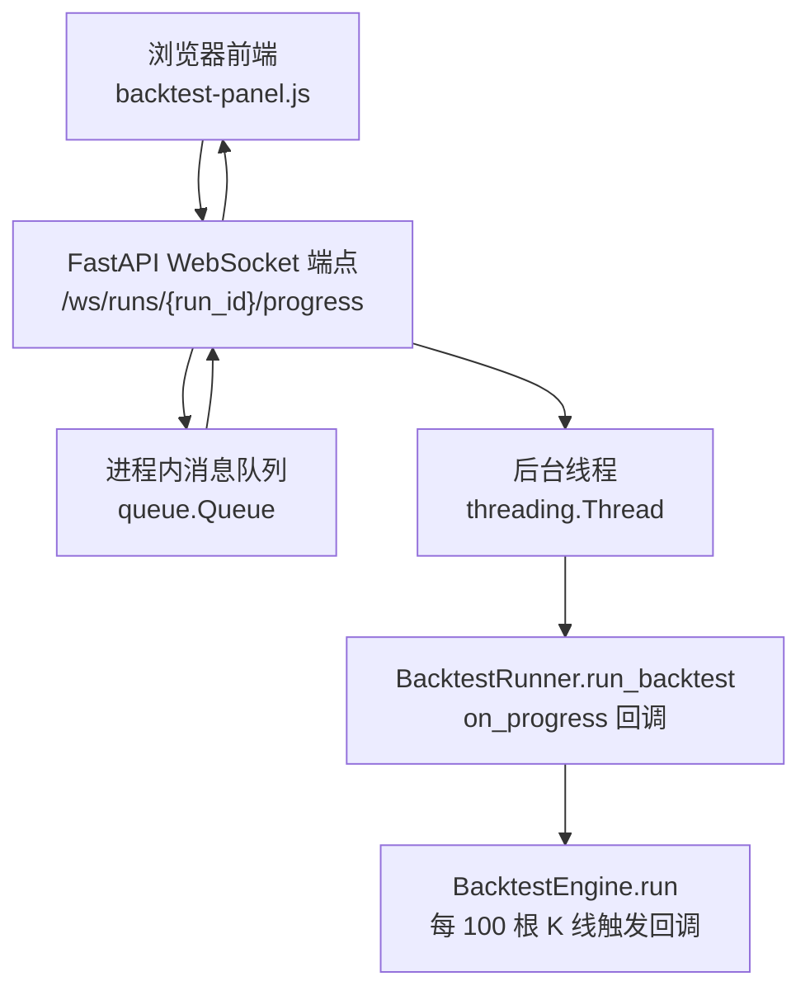
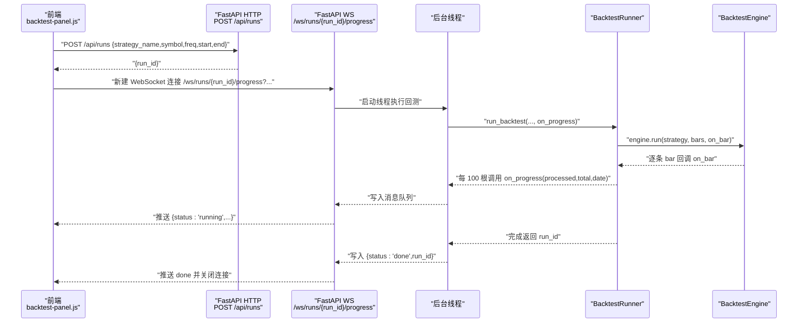
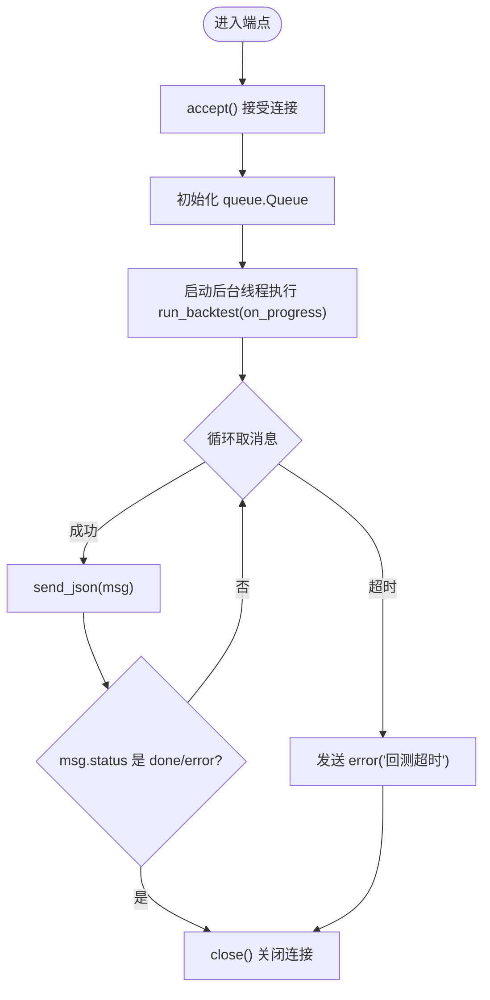
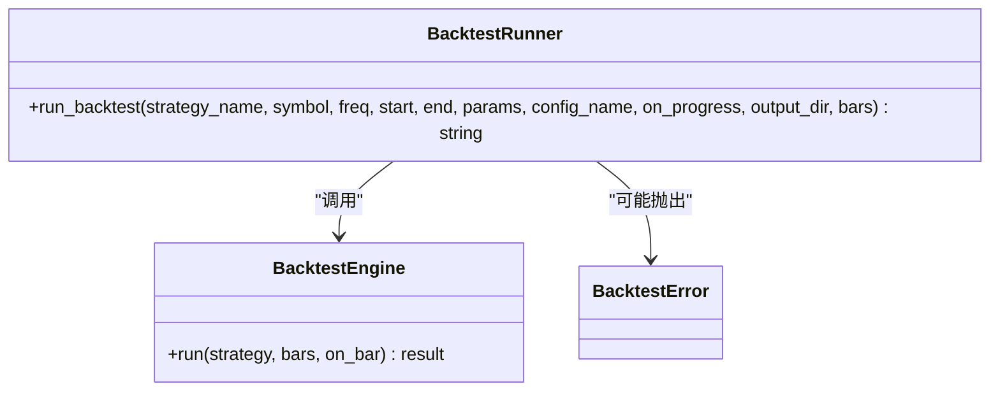
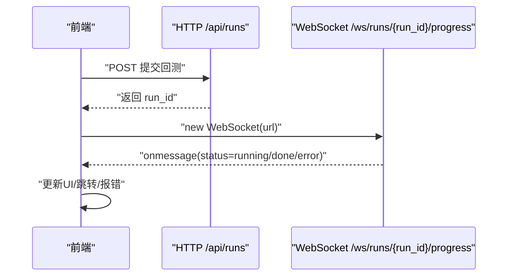
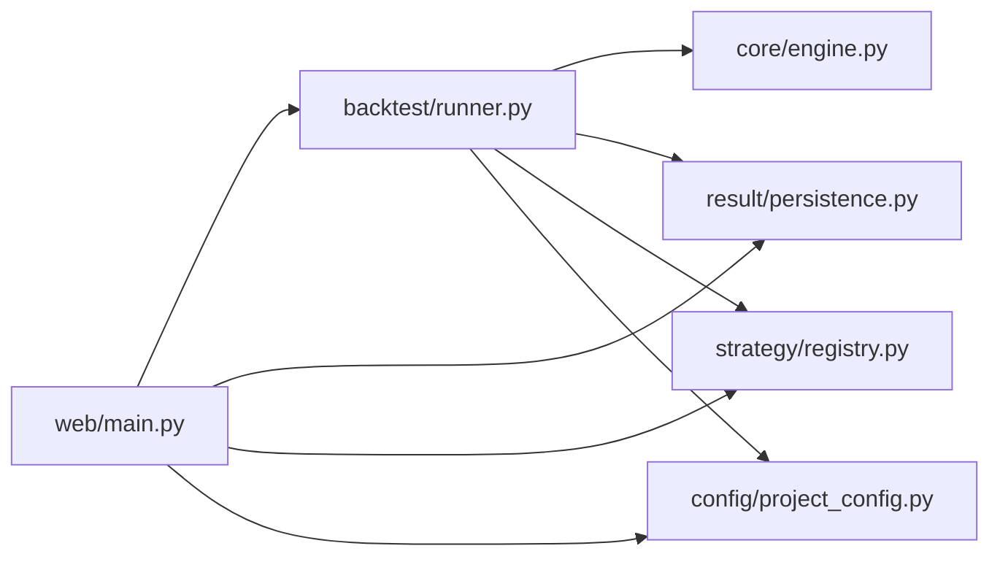

# WebSocket 实时通信

<cite>
**本文引用的文件列表**
- [src/caisen/web/main.py](file://src/caisen/web/main.py)
- [src/caisen/backtest/runner.py](file://src/caisen/backtest/runner.py)
- [src/caisen/frontend/src/js/backtest-panel.js](file://src/caisen/frontend/src/js/backtest-panel.js)
- [tests/test_websocket_progress.py](file://tests/test_websocket_progress.py)
- [docs/agents/issues/010-websocket-progress.md](file://docs/agents/issues/010-websocket-progress.md)
</cite>

## 目录
1. [简介](#简介)
2. [项目结构](#项目结构)
3. [核心组件](#核心组件)
4. [架构总览](#架构总览)
5. [详细组件分析](#详细组件分析)
6. [依赖关系分析](#依赖关系分析)
7. [性能与并发](#性能与并发)
8. [前端集成示例](#前端集成示例)
9. [调试、监控与排障](#调试监控与排障)
10. [结论](#结论)

## 简介
本技术文档聚焦于后端 /ws/runs/{run_id}/progress 的 WebSocket 实时通信机制，覆盖连接协议、消息格式、生命周期管理、进度推送（running/done/error）、断线重连策略、心跳检测与超时处理、多线程下的消息队列实现、线程安全保证与性能优化，并提供前端 JavaScript 客户端集成示例与错误处理逻辑。同时包含调试技巧、监控指标和故障排查指南。

## 项目结构
WebSocket 进度端点位于 FastAPI 应用内，负责接收客户端连接、在独立线程中执行回测并通过消息队列将进度推送给客户端；BacktestRunner 封装了回测流程并暴露 on_progress 回调；前端通过 fetch 创建任务后，再建立 WebSocket 连接监听进度。

图示来源
- [src/caisen/web/main.py:247-303](file://src/caisen/web/main.py#L247-L303)
- [src/caisen/backtest/runner.py:26-94](file://src/caisen/backtest/runner.py#L26-L94)

章节来源
- [src/caisen/web/main.py:247-303](file://src/caisen/web/main.py#L247-L303)
- [src/caisen/backtest/runner.py:26-94](file://src/caisen/backtest/runner.py#L26-L94)

## 核心组件
- WebSocket 端点：/ws/runs/{run_id}/progress，负责接受连接、参数校验、启动后台线程、桥接 on_progress 到 WebSocket 推送、发送终态消息并关闭连接。
- BacktestRunner：封装数据加载、策略实例化、引擎运行、结果持久化，并在每 100 根 K 线时调用 on_progress(processed, total, current_date)。
- 前端 backtest-panel.js：发起 POST /api/runs 获取 run_id，随后构造 ws/wss URL 建立连接，解析 running/done/error 消息并更新 UI。

章节来源
- [src/caisen/web/main.py:247-303](file://src/caisen/web/main.py#L247-L303)
- [src/caisen/backtest/runner.py:26-94](file://src/caisen/backtest/runner.py#L26-L94)
- [src/caisen/frontend/src/js/backtest-panel.js:18-69](file://src/caisen/frontend/src/js/backtest-panel.js#L18-L69)

## 架构总览
下图展示了从前端提交回测请求到 WebSocket 进度推送的完整时序。

图示来源
- [src/caisen/web/main.py:247-303](file://src/caisen/web/main.py#L247-L303)
- [src/caisen/backtest/runner.py:80-94](file://src/caisen/backtest/runner.py#L80-L94)
- [src/caisen/frontend/src/js/backtest-panel.js:226-293](file://src/caisen/frontend/src/js/backtest-panel.js#L226-L293)

## 详细组件分析

### WebSocket 端点 /ws/runs/{run_id}/progress
- 连接建立
  - 使用 FastAPI WebSocket 路由，路径为 /ws/runs/{run_id}/progress，query 参数包括 strategy_name、symbol、freq、start、end、config_name。
  - 连接成功后立即 accept()。
- 消息格式定义
  - running：{status:"running", processed:int, total:int, current_date:string}
  - done：{status:"done", run_id:string}
  - error：{status:"error", message:string}
- 生命周期管理
  - 服务端在独立线程中执行 BacktestRunner.run_backtest，并将 on_progress 回调写入进程内 queue.Queue。
  - 主协程循环从队列取消息并 send_json，遇到终态（done/error）则退出循环并 close()。
  - 若队列等待超过 300 秒，发送 error 消息并关闭连接。
- 错误处理
  - 捕获 BacktestRunner 抛出的异常，包装为 error 消息推送。
  - 超时场景也作为 error 消息推送。

图示来源
- [src/caisen/web/main.py:247-303](file://src/caisen/web/main.py#L247-L303)

章节来源
- [src/caisen/web/main.py:247-303](file://src/caisen/web/main.py#L247-L303)
- [docs/agents/issues/010-websocket-progress.md:1-45](file://docs/agents/issues/010-websocket-progress.md#L1-L45)

### BacktestRunner 与进度回调
- 接口约定
  - run_backtest(...) -> str(run_id)，支持可选 on_progress(processed, total, current_date)。
- 进度频率
  - 内部对 Bar 遍历计数，每 100 根或最后一条触发 on_progress。
- 错误语义
  - 数据为空、策略未注册等明确错误抛出 BacktestError，由上层统一转为 error 消息。

图示来源
- [src/caisen/backtest/runner.py:26-94](file://src/caisen/backtest/runner.py#L26-L94)
- [src/caisen/backtest/runner.py:22-24](file://src/caisen/backtest/runner.py#L22-L24)

章节来源
- [src/caisen/backtest/runner.py:26-94](file://src/caisen/backtest/runner.py#L26-L94)

### 前端集成（JavaScript）
- 构建 URL
  - buildWsUrl(runId, params) 根据当前页面协议选择 ws/wss，拼接 query 参数。
- 发起任务
  - POST /api/runs 获取 run_id，失败则展示错误信息。
- 连接与消息处理
  - 建立 WebSocket 连接，onmessage 解析 JSON，按 status 分支：
    - running：计算百分比并更新进度条与日期标签。
    - done：跳转到 report.html?run_id=xxx。
    - error：显示错误信息。
- 错误处理
  - onerror 提示“WebSocket 连接失败”。
  - onclose 记录关闭码。
  - 注意：当前实现未内置自动重连与心跳检测。

图示来源
- [src/caisen/frontend/src/js/backtest-panel.js:18-69](file://src/caisen/frontend/src/js/backtest-panel.js#L18-L69)
- [src/caisen/frontend/src/js/backtest-panel.js:226-293](file://src/caisen/frontend/src/js/backtest-panel.js#L226-L293)

章节来源
- [src/caisen/frontend/src/js/backtest-panel.js:18-69](file://src/caisen/frontend/src/js/backtest-panel.js#L18-L69)
- [src/caisen/frontend/src/js/backtest-panel.js:226-293](file://src/caisen/frontend/src/js/backtest-panel.js#L226-L293)

## 依赖关系分析
- 模块耦合
  - web.main 依赖 BacktestRunner、ResultPersister、StrategyRegistry、ProjectConfig。
  - BacktestRunner 依赖 StrategyRegistry、BacktestEngine、ResultPersister、ProjectConfig。
  - 前端仅依赖浏览器原生 WebSocket 与 Fetch API。
- 外部依赖
  - FastAPI、Uvicorn、websockets（由 FastAPI 驱动）。
- 潜在环依赖
  - 无直接循环导入；各层职责清晰。

图示来源
- [src/caisen/web/main.py:17-21](file://src/caisen/web/main.py#L17-L21)
- [src/caisen/backtest/runner.py:13-19](file://src/caisen/backtest/runner.py#L13-L19)

章节来源
- [src/caisen/web/main.py:17-21](file://src/caisen/web/main.py#L17-L21)
- [src/caisen/backtest/runner.py:13-19](file://src/caisen/backtest/runner.py#L13-L19)

## 性能与并发
- 线程模型
  - 每个 WebSocket 连接对应一个 daemon 线程执行回测，避免阻塞事件循环。
- 消息队列
  - 使用 queue.Queue 进行线程间通信，生产者（后台线程）put，消费者（WebSocket 协程）get(timeout=300)。
- 进度频率
  - 每 100 根 K 线触发一次 on_progress，控制推送频率，降低网络与序列化开销。
- 超时保护
  - 队列 get 超时 300 秒即视为回测超时，推送 error 并关闭连接，防止资源泄漏。
- 可扩展性建议
  - 多进程部署时，需引入分布式队列（如 Redis）以跨进程共享消息。
  - 可考虑批量聚合消息或自适应推送频率（基于数据规模动态调整）。

章节来源
- [src/caisen/web/main.py:267-303](file://src/caisen/web/main.py#L267-L303)
- [src/caisen/backtest/runner.py:80-94](file://src/caisen/backtest/runner.py#L80-L94)

## 前端集成示例
以下为最小可用的 JavaScript 客户端实现要点（不直接粘贴代码，提供关键路径与说明）：
- 连接建立
  - 使用 buildWsUrl(runId, params) 生成 ws/wss URL，new WebSocket(url) 建立连接。
  - 参考路径：[buildWsUrl 与连接逻辑:18-25](file://src/caisen/frontend/src/js/backtest-panel.js#L18-L25), [连接与事件绑定:248-293](file://src/caisen/frontend/src/js/backtest-panel.js#L248-L293)
- 消息处理
  - handleWsMessage 解析 status 分支：
    - running：更新进度条与日期标签。
    - done：location.href 跳转到报告页。
    - error：显示错误信息。
  - 参考路径：[消息处理函数:44-69](file://src/caisen/frontend/src/js/backtest-panel.js#L44-L69)
- 错误处理
  - onerror 提示连接失败；onclose 记录关闭码。
  - 参考路径：[错误与关闭处理:285-293](file://src/caisen/frontend/src/js/backtest-panel.js#L285-L293)
- 注意事项
  - 当前实现未包含自动重连与心跳检测，如需增强可在 onclose/onerror 处增加指数退避重试逻辑。

章节来源
- [src/caisen/frontend/src/js/backtest-panel.js:18-69](file://src/caisen/frontend/src/js/backtest-panel.js#L18-L69)
- [src/caisen/frontend/src/js/backtest-panel.js:248-293](file://src/caisen/frontend/src/js/backtest-panel.js#L248-L293)

## 调试、监控与排障
- 调试技巧
  - 使用 pytest 的 TestClient 模拟 WebSocket 连接，验证 running/done/error 消息序列与连接关闭行为。
    - 参考测试用例：[测试集:50-129](file://tests/test_websocket_progress.py#L50-L129)
  - 在后端日志中打印关键节点（连接建立、消息入队/出队、异常堆栈），便于定位问题。
- 监控指标
  - 连接数、平均处理时长、消息吞吐（每秒推送条数）、超时次数、错误率。
  - 建议在中间件或装饰器中统计这些指标并上报至监控系统。
- 常见问题与排查
  - 未收到 running 消息：检查数据量是否小于 100 根；确认 on_progress 是否被调用。
    - 参考：[进度触发条件:80-94](file://src/caisen/backtest/runner.py#L80-L94)
  - 长时间无响应：检查队列 get 超时逻辑与后台线程是否存活。
    - 参考：[超时处理:292-303](file://src/caisen/web/main.py#L292-L303)
  - 前端无法连接：确认 CORS 配置与 ws/wss 协议匹配。
    - 参考：[CORS 设置:77-83](file://src/caisen/web/main.py#L77-L83)
  - 策略或数据问题：查看 BacktestError 的具体 message，定位数据缺失或策略未注册。
    - 参考：[错误类型定义:22-24](file://src/caisen/backtest/runner.py#L22-L24)

章节来源
- [tests/test_websocket_progress.py:50-129](file://tests/test_websocket_progress.py#L50-L129)
- [src/caisen/backtest/runner.py:80-94](file://src/caisen/backtest/runner.py#L80-L94)
- [src/caisen/web/main.py:77-83](file://src/caisen/web/main.py#L77-L83)
- [src/caisen/web/main.py:292-303](file://src/caisen/web/main.py#L292-L303)
- [src/caisen/backtest/runner.py:22-24](file://src/caisen/backtest/runner.py#L22-L24)

## 结论
该 WebSocket 实时通信机制通过 FastAPI 端点、进程内消息队列与后台线程解耦了回测执行与消息推送，实现了稳定的 running/done/error 状态流转。每 100 根 K 线的推送频率兼顾了实时性与性能。当前实现已具备完善的错误与超时处理，但尚未内置心跳与自动重连，前端可按需扩展。在生产环境中，建议结合分布式队列与监控指标进一步提升可靠性与可观测性。