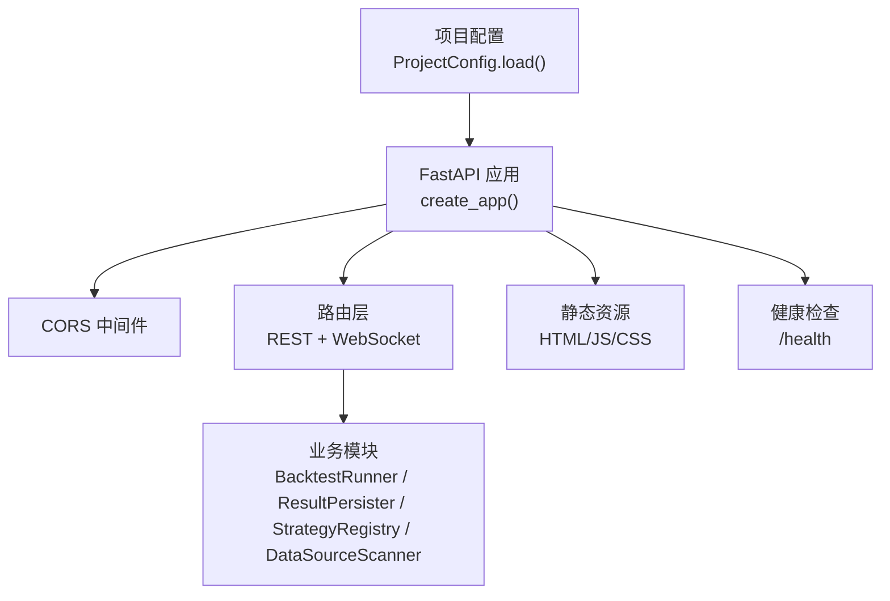
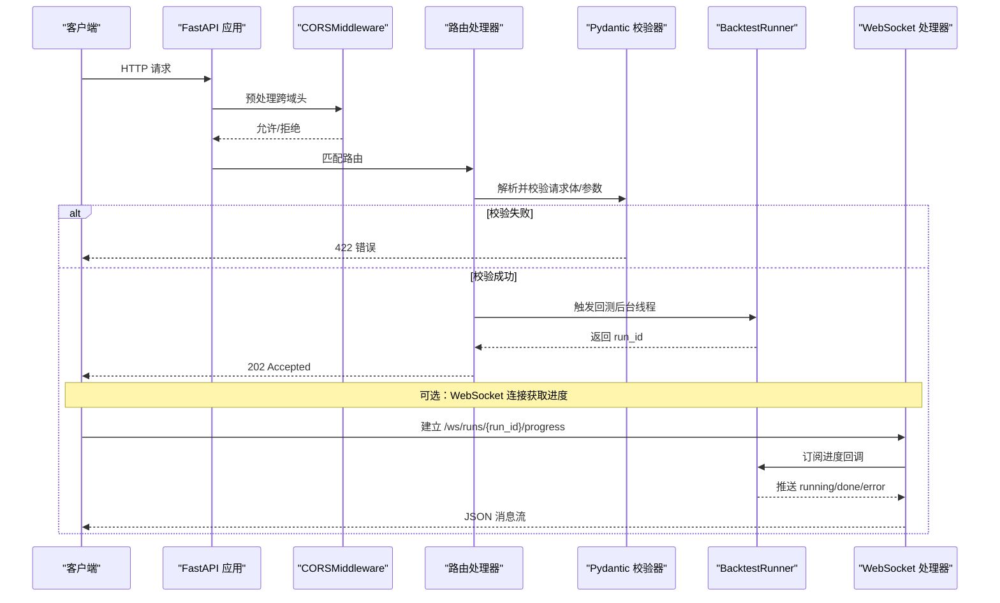
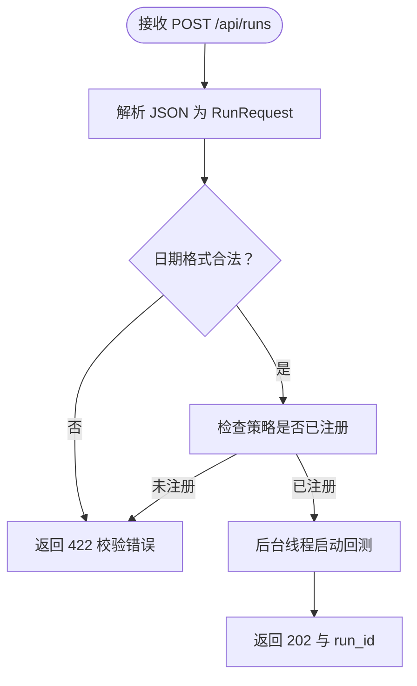
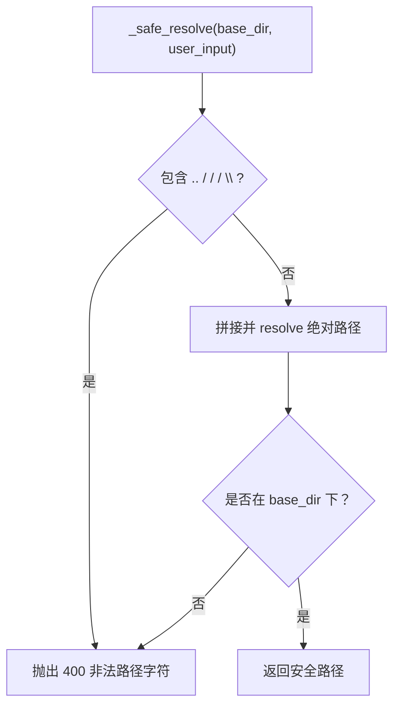
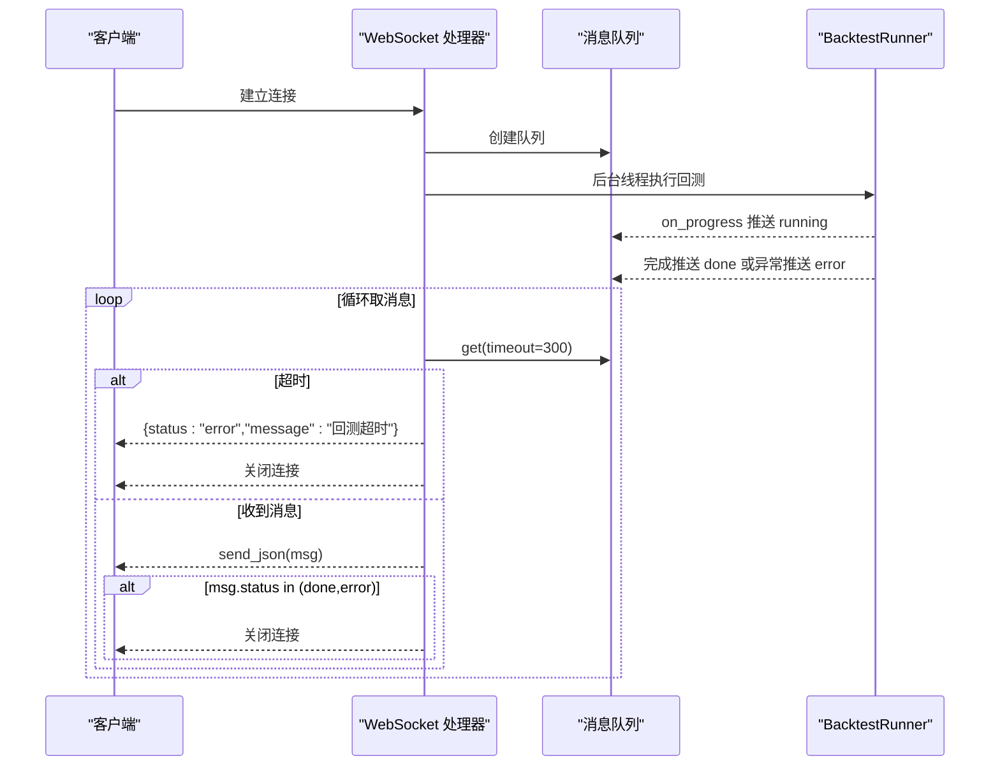
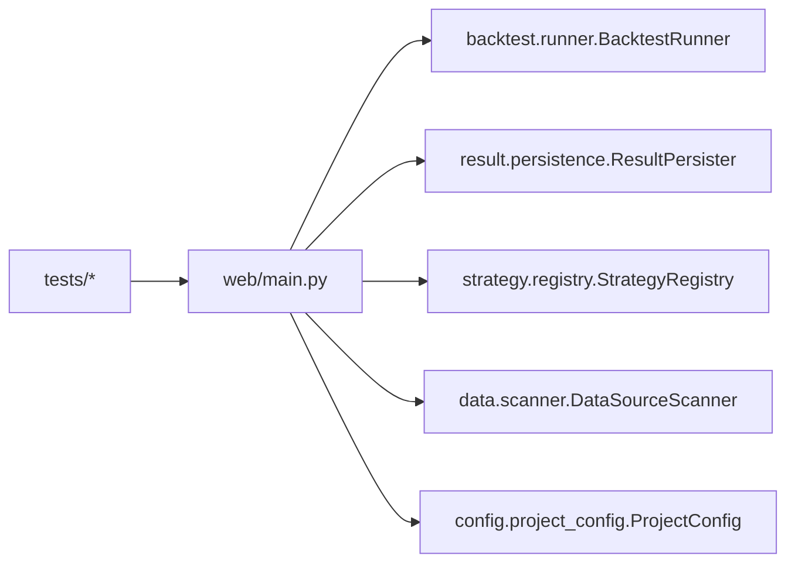

# 中间件与安全机制

<cite>
**本文引用的文件列表**
- [src/caisen/web/main.py](file://src/caisen/web/main.py)
- [configs/project.yaml](file://configs/project.yaml)
- [src/caisen/config/project_config.py](file://src/caisen/config/project_config.py)
- [src/caisen/data/exceptions.py](file://src/caisen/data/exceptions.py)
- [tests/test_web_api.py](file://tests/test_web_api.py)
- [tests/test_path_traversal.py](file://tests/test_path_traversal.py)
- [tests/test_post_runs_endpoint.py](file://tests/test_post_runs_endpoint.py)
- [tests/test_websocket_progress.py](file://tests/test_websocket_progress.py)
</cite>

## 目录
1. [简介](#简介)
2. [项目结构](#项目结构)
3. [核心组件](#核心组件)
4. [架构总览](#架构总览)
5. [详细组件分析](#详细组件分析)
6. [依赖关系分析](#依赖关系分析)
7. [性能考量](#性能考量)
8. [故障排查指南](#故障排查指南)
9. [结论](#结论)
10. [附录](#附录)

## 简介
本技术文档聚焦于 Web 服务中间件与安全机制，围绕以下目标展开：
- CORS 跨域配置的安全考虑与最佳实践
- FastAPI 中间件的注册机制与执行顺序
- 请求验证与参数校验（含 Pydantic 模型）及数据清洗
- 错误处理与异常捕获的统一策略（自定义异常类、错误响应格式）
- 健康检查端点设计与监控集成
- 安全加固建议（输入验证、输出编码、防护攻击）
- 日志记录、性能监控与调试工具的配置指南

## 项目结构
Web 服务入口位于 src/caisen/web/main.py，提供 REST API、静态资源与 WebSocket 进度推送。项目级配置通过 configs/project.yaml 加载，默认值在 src/caisen/config/project_config.py 中定义。

图表来源
- [src/caisen/web/main.py:68-84](file://src/caisen/web/main.py#L68-L84)
- [src/caisen/config/project_config.py:30-55](file://src/caisen/config/project_config.py#L30-L55)

章节来源
- [src/caisen/web/main.py:68-84](file://src/caisen/web/main.py#L68-L84)
- [src/caisen/config/project_config.py:17-28](file://src/caisen/config/project_config.py#L17-L28)
- [configs/project.yaml:1-13](file://configs/project.yaml#L1-L13)

## 核心组件
- 应用创建与中间件注册：在 create_app 中初始化 FastAPI 实例并添加 CORSMiddleware。
- 请求验证：使用 Pydantic BaseModel 与 field_validator 对日期等字段进行严格校验。
- 路径安全：_safe_resolve 函数用于防止路径遍历攻击。
- 健康检查：/health 返回简单状态。
- 异步任务与进度：POST /api/runs 后台线程触发回测；WebSocket /ws/runs/{run_id}/progress 实时推送进度。
- 配置加载：从 configs/project.yaml 读取 data_dir、output_dir、api_port，缺失时回退到默认值。

章节来源
- [src/caisen/web/main.py:68-84](file://src/caisen/web/main.py#L68-L84)
- [src/caisen/web/main.py:42-56](file://src/caisen/web/main.py#L42-L56)
- [src/caisen/web/main.py:28-39](file://src/caisen/web/main.py#L28-L39)
- [src/caisen/web/main.py:224-227](file://src/caisen/web/main.py#L224-L227)
- [src/caisen/web/main.py:107-132](file://src/caisen/web/main.py#L107-L132)
- [src/caisen/web/main.py:247-303](file://src/caisen/web/main.py#L247-L303)
- [src/caisen/config/project_config.py:30-55](file://src/caisen/config/project_config.py#L30-L55)

## 架构总览
下图展示了请求进入后的中间件与路由处理流程，以及关键安全控制点。

图表来源
- [src/caisen/web/main.py:68-84](file://src/caisen/web/main.py#L68-L84)
- [src/caisen/web/main.py:107-132](file://src/caisen/web/main.py#L107-L132)
- [src/caisen/web/main.py:247-303](file://src/caisen/web/main.py#L247-L303)

## 详细组件分析

### CORS 跨域配置与安全
- 当前实现：在 create_app 中添加 CORSMiddleware，allow_origins 设置为通配符，allow_credentials 为 True，allow_methods 和 allow_headers 均为通配符。
- 安全风险：
  - 通配 origin 配合 credentials=True 会允许任意站点携带凭据访问，存在严重跨站风险。
  - 通配方法与头部可能暴露不必要的接口能力。
- 最佳实践：
  - 将 allow_origins 限制为可信前端域名白名单。
  - 若启用 credentials，避免使用通配 origin。
  - 明确 allow_methods 与 allow_headers，仅开放必要项。
  - 结合网关或反向代理统一管控跨域策略。

章节来源
- [src/caisen/web/main.py:76-83](file://src/caisen/web/main.py#L76-L83)

### FastAPI 中间件注册与执行顺序
- 注册位置：create_app 中通过 app.add_middleware 注册 CORSMiddleware。
- 执行顺序：中间件按注册顺序包裹请求/响应生命周期。CORS 作为最外层中间件，优先处理跨域预检与实际请求的头部。
- 扩展建议：如需统一鉴权、限流、审计等，可在 CORS 之后注册其他中间件，形成“外层通用 -> 内层业务”的分层结构。

章节来源
- [src/caisen/web/main.py:68-84](file://src/caisen/web/main.py#L68-L84)

### 请求验证与参数校验（Pydantic 模型）
- RunRequest 模型定义了 strategy_name、symbol、freq、start、end、config_name 等字段。
- 使用 field_validator 对 start/end 进行正则校验，确保日期格式为 YYYY-MM-DD。
- 校验失败时由 FastAPI 自动返回 422 错误，便于前端统一处理。
- 数据清洗：validator 可在此处做规范化（如去除空白字符），但当前仅做格式校验。

图表来源
- [src/caisen/web/main.py:42-56](file://src/caisen/web/main.py#L42-L56)
- [src/caisen/web/main.py:107-132](file://src/caisen/web/main.py#L107-L132)

章节来源
- [src/caisen/web/main.py:42-56](file://src/caisen/web/main.py#L42-L56)
- [tests/test_web_api.py:137-145](file://tests/test_web_api.py#L137-L145)
- [tests/test_post_runs_endpoint.py:36-43](file://tests/test_post_runs_endpoint.py#L36-L43)

### 路径安全与防遍历攻击
- _safe_resolve 函数对传入的路径片段进行安全检查：
  - 禁止包含 ..、/、\ 等危险字符。
  - 解析后确认最终路径仍在允许的 base_dir 范围内。
- 该函数被多处使用，例如获取运行详情、可视化数据与静态资源。

图表来源
- [src/caisen/web/main.py:28-39](file://src/caisen/web/main.py#L28-L39)

章节来源
- [src/caisen/web/main.py:28-39](file://src/caisen/web/main.py#L28-L39)
- [tests/test_path_traversal.py:15-52](file://tests/test_path_traversal.py#L15-L52)

### 健康检查端点与监控集成
- /health 返回 {"status": "ok"}，适合容器编排与健康探针。
- 测试覆盖：tests/test_web_api.py 验证了健康检查返回码与响应体。
- 监控集成建议：
  - 在 Kubernetes 中使用 livenessProbe/readinessProbe 调用 /health。
  - 结合 Prometheus 指标导出器（如 prometheus-fastapi-instrumentator）采集 QPS、延迟、错误率等。

章节来源
- [src/caisen/web/main.py:224-227](file://src/caisen/web/main.py#L224-L227)
- [tests/test_web_api.py:22-25](file://tests/test_web_api.py#L22-L25)

### WebSocket 进度推送与错误处理
- /ws/runs/{run_id}/progress 支持实时推送：
  - 连接后在后台线程执行回测，通过队列收集进度消息。
  - 推送 running/done/error 三类状态，超时则返回 error 并关闭连接。
- 错误处理：
  - 回测异常会被捕获并转换为 error 消息。
  - 测试覆盖了 error 消息内容与 done 后连接关闭行为。

图表来源
- [src/caisen/web/main.py:247-303](file://src/caisen/web/main.py#L247-L303)

章节来源
- [src/caisen/web/main.py:247-303](file://src/caisen/web/main.py#L247-L303)
- [tests/test_websocket_progress.py:88-101](file://tests/test_websocket_progress.py#L88-L101)
- [tests/test_websocket_progress.py:108-129](file://tests/test_websocket_progress.py#L108-L129)

### 错误处理与异常捕获的统一策略
- 当前策略：
  - 路由内部显式 raise HTTPException 以返回特定状态码与 detail。
  - 后台线程中的异常通过 logger.exception 记录，不直接传播至 HTTP 响应。
  - WebSocket 中将异常转换为 error 消息。
- 改进建议：
  - 引入全局异常处理器（@app.exception_handler）统一格式化错误响应，包括 code、message、traceId 等。
  - 定义领域异常基类（如 DataLoadError 及其子类），在 Web 层映射为一致的 HTTP 错误格式。
  - 对后台任务增加重试与告警机制。

章节来源
- [src/caisen/web/main.py:107-132](file://src/caisen/web/main.py#L107-L132)
- [src/caisen/web/main.py:247-303](file://src/caisen/web/main.py#L247-L303)
- [src/caisen/data/exceptions.py:4-47](file://src/caisen/data/exceptions.py#L4-L47)

### 配置管理与端口绑定
- ProjectConfig.load 从 configs/project.yaml 读取 data_dir、output_dir、api_port，不存在时回退到默认值。
- serve 函数通过 uvicorn.run 启动服务，log_level 设为 info。
- 生产环境建议：
  - 通过环境变量或配置中心注入敏感信息。
  - 使用 gunicorn+uvicorn workers 提升并发能力。
  - 开启结构化日志并接入集中式日志系统。

章节来源
- [src/caisen/config/project_config.py:30-55](file://src/caisen/config/project_config.py#L30-L55)
- [configs/project.yaml:1-13](file://configs/project.yaml#L1-L13)
- [src/caisen/web/main.py:311-319](file://src/caisen/web/main.py#L311-L319)

## 依赖关系分析
- Web 层依赖：
  - BacktestRunner：执行回测逻辑。
  - ResultPersister：持久化与读取回测结果。
  - StrategyRegistry：列出可用策略。
  - DataSourceScanner：扫描本地数据源。
- 配置依赖：
  - ProjectConfig：加载项目级配置。
- 测试依赖：
  - TestClient 用于端到端断言。
  - 针对路径遍历、健康检查、后端任务与 WebSocket 的专项测试。

图表来源
- [src/caisen/web/main.py:17-21](file://src/caisen/web/main.py#L17-L21)
- [src/caisen/config/project_config.py:30-55](file://src/caisen/config/project_config.py#L30-L55)

章节来源
- [src/caisen/web/main.py:17-21](file://src/caisen/web/main.py#L17-L21)
- [tests/test_web_api.py:1-150](file://tests/test_web_api.py#L1-150)
- [tests/test_path_traversal.py:1-72](file://tests/test_path_traversal.py#L1-72)
- [tests/test_post_runs_endpoint.py:1-46](file://tests/test_post_runs_endpoint.py#L1-46)
- [tests/test_websocket_progress.py:75-129](file://tests/test_websocket_progress.py#L75-L129)

## 性能考量
- 中间件开销：CORS 预检与实际请求均需处理，生产环境应最小化 allow_* 范围。
- 后台任务：POST /api/runs 采用 daemon 线程执行，注意线程池与任务队列管理，避免无界增长。
- I/O 操作：ResultPersister 的文件读写需关注磁盘 I/O 瓶颈，必要时引入缓存或对象存储。
- 监控指标：建议接入延迟分位数、错误率、队列长度、线程数等指标。

[本节为通用指导，不涉及具体文件分析]

## 故障排查指南
- 健康检查失败：
  - 检查 /health 是否可达，确认进程存活与端口监听。
- 跨域问题：
  - 核对浏览器控制台报错，调整 allow_origins、allow_credentials、allow_methods、allow_headers。
- 参数校验失败：
  - 查看 422 响应体，确认日期格式与必填字段。
- 路径遍历拦截：
  - 检查 400 错误，确认传入路径片段不含危险字符。
- WebSocket 超时或断开：
  - 检查后台线程是否正常运行，确认 on_progress 回调是否正常推送消息。

章节来源
- [tests/test_web_api.py:22-25](file://tests/test_web_api.py#L22-L25)
- [tests/test_path_traversal.py:21-52](file://tests/test_path_traversal.py#L21-L52)
- [tests/test_web_api.py:137-145](file://tests/test_web_api.py#L137-L145)
- [tests/test_websocket_progress.py:88-101](file://tests/test_websocket_progress.py#L88-L101)

## 结论
本项目在 Web 层实现了基础的中间件与路由功能，具备请求校验、路径安全与健康检查能力。为进一步强化安全与可观测性，建议：
- 收紧 CORS 策略，避免通配 origin 与凭据同时启用。
- 引入全局异常处理器与领域异常映射，统一错误响应格式。
- 完善日志与指标采集，结合容器编排进行健康探测与弹性伸缩。
- 对后台任务引入任务队列与重试机制，增强稳定性。

[本节为总结性内容，不涉及具体文件分析]

## 附录

### 安全加固建议清单
- 输入验证：
  - 使用 Pydantic 模型与自定义 validator 进行强类型校验与格式约束。
  - 对路径参数使用 _safe_resolve 进行白名单与范围校验。
- 输出编码：
  - 对 HTML/JS/CSS 静态资源使用正确的 Content-Type，避免 XSS。
  - 对动态 JSON 输出保持最小化字段，避免泄露敏感信息。
- 防护攻击：
  - 限制请求大小与速率（可通过网关或中间件）。
  - 禁用不必要的 HTTP 方法，仅开放 GET/POST/WS 等必要能力。
  - 对后台任务设置超时与资源上限，防止资源耗尽。

[本节为通用指导，不涉及具体文件分析]

### 日志与调试配置指南
- 日志级别：serve 中 log_level="info"，生产环境建议根据场景调整为 warning 或 error。
- 结构化日志：建议使用 json 格式输出，便于集中采集与分析。
- 调试工具：
  - 使用 TestClient 进行端到端测试。
  - 结合 pytest 与 mock 覆盖异常路径与边界条件。

章节来源
- [src/caisen/web/main.py:311-319](file://src/caisen/web/main.py#L311-L319)
- [tests/test_web_api.py:1-150](file://tests/test_web_api.py#L1-150)