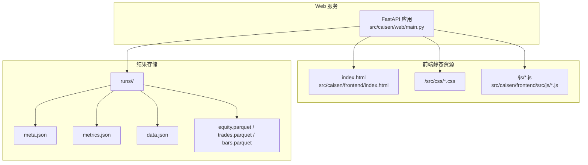
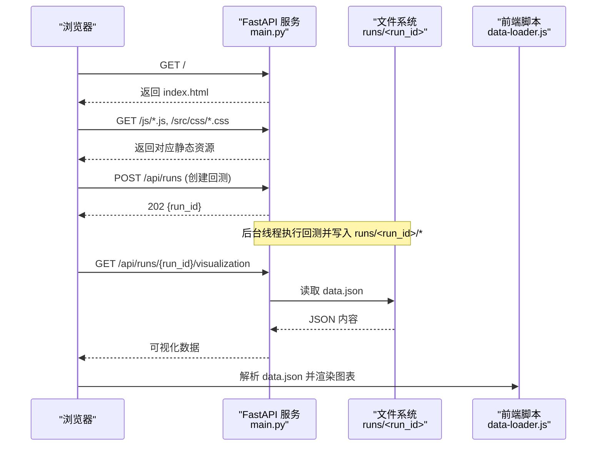
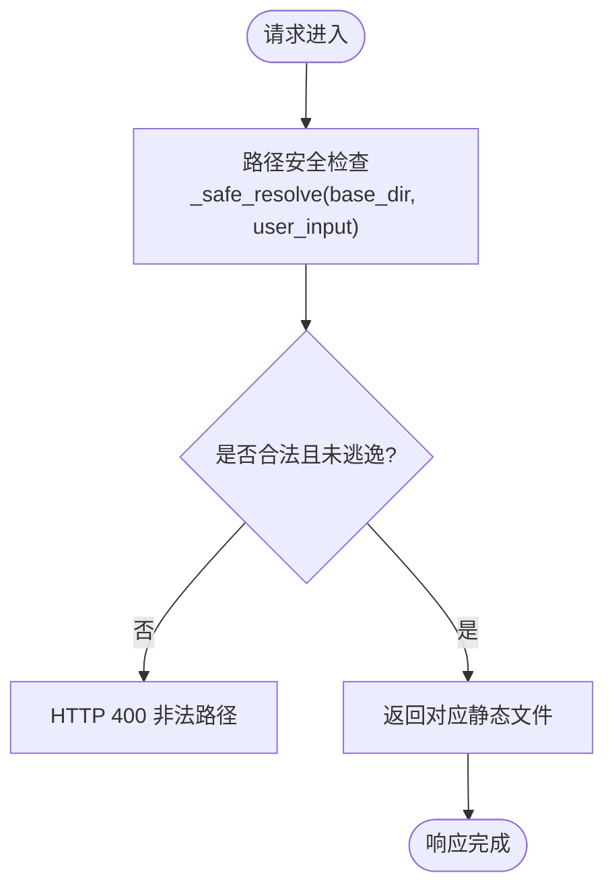
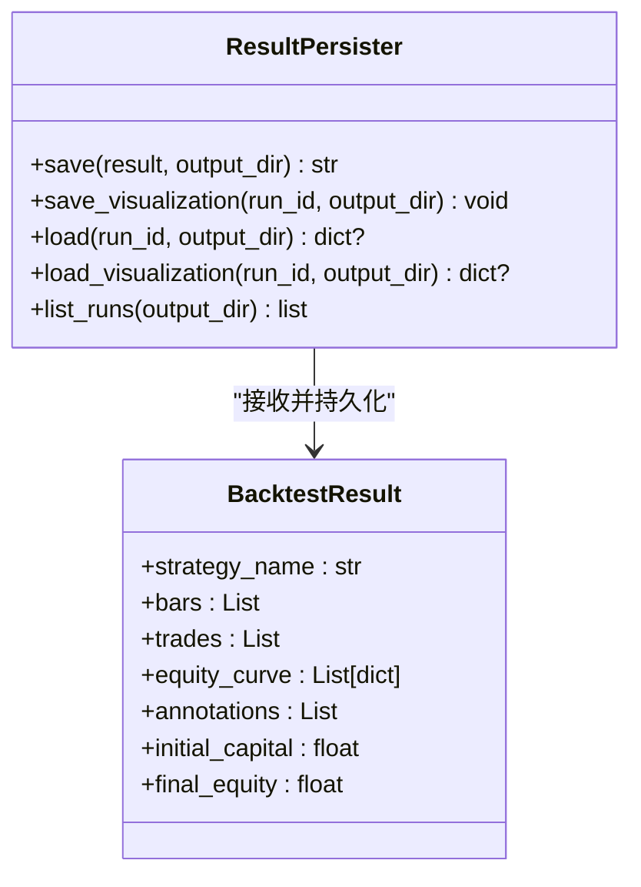
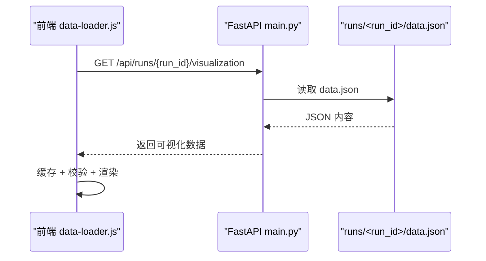
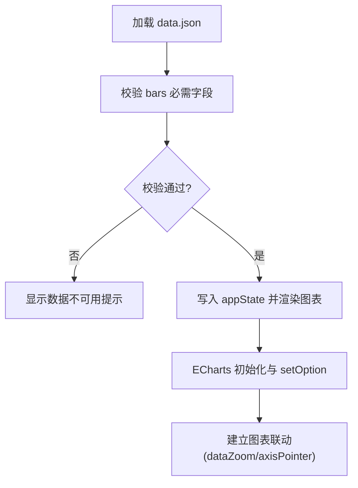
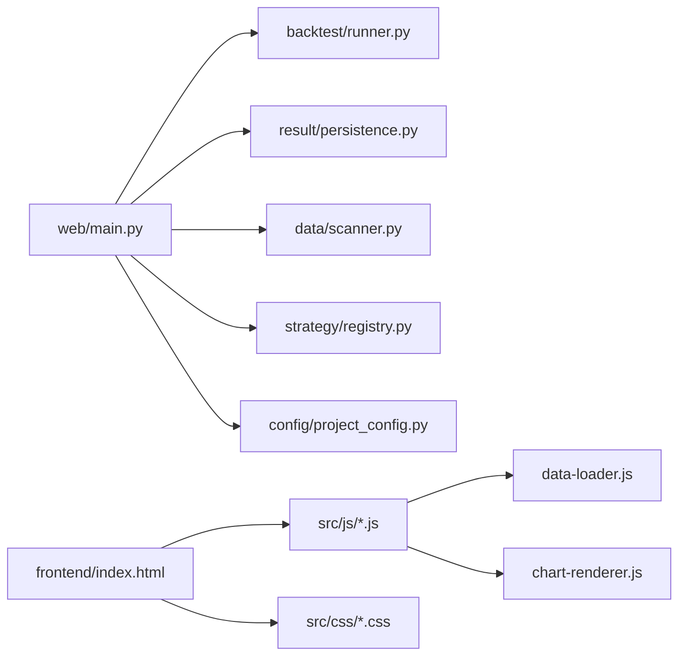

# 文件服务与静态资源

<cite>
**本文引用的文件列表**
- [src/caisen/web/main.py](file://src/caisen/web/main.py)
- [src/caisen/result/persistence.py](file://src/caisen/result/persistence.py)
- [src/caisen/frontend/index.html](file://src/caisen/frontend/index.html)
- [src/caisen/frontend/src/js/data-loader.js](file://src/caisen/frontend/src/js/data-loader.js)
- [src/caisen/frontend/src/js/chart-renderer.js](file://src/caisen/frontend/src/js/chart-renderer.js)
- [src/caisen/result/types.py](file://src/caisen/result/types.py)
- [configs/project.yaml](file://configs/project.yaml)
- [runs/CaiSenStrategy_20260522_1/meta.json](file://runs/CaiSenStrategy_20260522_1/meta.json)
- [runs/CaiSenStrategy_20260522_1/metrics.json](file://runs/CaiSenStrategy_20260522_1/metrics.json)
</cite>

## 目录
1. [简介](#简介)
2. [项目结构](#项目结构)
3. [核心组件](#核心组件)
4. [架构总览](#架构总览)
5. [详细组件分析](#详细组件分析)
6. [依赖关系分析](#依赖关系分析)
7. [性能考量](#性能考量)
8. [故障排查指南](#故障排查指南)
9. [结论](#结论)
10. [附录](#附录)

## 简介
本文件围绕“文件服务与静态资源”主题，系统性梳理该量化回测系统的 Web 服务、前端静态资源组织与访问方式、回测结果存储结构与可视化数据生成流程，并给出下载接口设计、权限控制、版本管理与清理策略的实现要点。文档同时提供可操作的图表数据格式说明、渲染要求以及完整性校验、备份恢复与性能优化的最佳实践建议。

## 项目结构
系统采用 FastAPI 作为后端 Web 服务，前端静态资源位于 src/caisen/frontend 目录，通过后端路由直接提供 HTML、CSS、JS 等静态资源；回测结果持久化在 runs 目录下，包含 meta.json、metrics.json、data.json 等结构化文件，供前端可视化消费。

图示来源
- [src/caisen/web/main.py:68-106](file://src/caisen/web/main.py#L68-L106)
- [src/caisen/frontend/index.html:1-20](file://src/caisen/frontend/index.html#L1-L20)
- [src/caisen/result/persistence.py:59-133](file://src/caisen/result/persistence.py#L59-L133)

章节来源
- [src/caisen/web/main.py:68-106](file://src/caisen/web/main.py#L68-L106)
- [src/caisen/frontend/index.html:1-20](file://src/caisen/frontend/index.html#L1-L20)
- [src/caisen/result/persistence.py:59-133](file://src/caisen/result/persistence.py#L59-L133)

## 核心组件
- Web 服务与静态资源分发：FastAPI 应用负责返回入口 HTML、按路径分发 JS/CSS 模块，并提供回测运行、结果查询与可视化数据读取的 REST/WebSocket 接口。
- 结果持久化：将回测结果保存为多文件（meta.json、metrics.json、data.json、parquet 二进制），并生成前端可直接消费的 data.json。
- 前端数据加载与渲染：根据 URL 参数选择从 API 或本地 data.json 加载数据，进行缓存、校验与 ECharts 渲染。

章节来源
- [src/caisen/web/main.py:68-106](file://src/caisen/web/main.py#L68-L106)
- [src/caisen/result/persistence.py:59-133](file://src/caisen/result/persistence.py#L59-L133)
- [src/caisen/frontend/src/js/data-loader.js:175-245](file://src/caisen/frontend/src/js/data-loader.js#L175-L245)

## 架构总览
下图展示从用户发起请求到前端渲染的关键调用链，包括静态资源获取、回测任务触发、结果持久化与可视化数据读取。

图示来源
- [src/caisen/web/main.py:86-106](file://src/caisen/web/main.py#L86-L106)
- [src/caisen/web/main.py:107-132](file://src/caisen/web/main.py#L107-L132)
- [src/caisen/web/main.py:194-201](file://src/caisen/web/main.py#L194-L201)
- [src/caisen/result/persistence.py:135-201](file://src/caisen/result/persistence.py#L135-L201)
- [src/caisen/frontend/src/js/data-loader.js:175-245](file://src/caisen/frontend/src/js/data-loader.js#L175-L245)

## 详细组件分析

### 前端静态资源组织与访问
- 入口页面：/ 返回 index.html，其中通过 <link> 和 <script type="module"> 引用 /src/css/main.css 与 /js/runs-list.js、/js/backtest-panel.js 等模块。
- 静态资源路由：
  - /js/{filename}：提供 src/caisen/frontend/src/js 下的 JS 模块。
  - /src/css/{filename}：提供 src/caisen/frontend/src/css 下的样式文件。
- 安全校验：所有路径均经过 _safe_resolve 校验，防止路径遍历攻击。

图示来源
- [src/caisen/web/main.py:28-39](file://src/caisen/web/main.py#L28-L39)
- [src/caisen/web/main.py:229-245](file://src/caisen/web/main.py#L229-L245)
- [src/caisen/frontend/index.html:10-12](file://src/caisen/frontend/index.html#L10-L12)

章节来源
- [src/caisen/web/main.py:86-94](file://src/caisen/web/main.py#L86-L94)
- [src/caisen/web/main.py:229-245](file://src/caisen/web/main.py#L229-L245)
- [src/caisen/frontend/index.html:10-12](file://src/caisen/frontend/index.html#L10-L12)

### 回测结果存储结构
- 目录命名：runs/<run_id>/，run_id 由策略名+日期+序号组成，保证同策略同日多次运行不冲突。
- 文件清单与用途：
  - meta.json：元数据（策略名、品种、频率、时间范围、K线数量、初始/最终净值、交易次数、创建时间）。
  - metrics.json：绩效指标（年化收益、最大回撤、夏普比率、胜率、盈亏比等）。
  - data.json：前端可视化综合文件，聚合 meta、metrics、bars、equity_curve、trades、annotations。
  - equity.parquet、trades.parquet、bars.parquet：高性能列式存储，便于大数据量读写。
- 生成时机：ResultPersister.save 在完成各文件写入后，调用 save_visualization 生成 data.json。

图示来源
- [src/caisen/result/persistence.py:59-133](file://src/caisen/result/persistence.py#L59-L133)
- [src/caisen/result/types.py:9-32](file://src/caisen/result/types.py#L9-L32)

章节来源
- [src/caisen/result/persistence.py:59-133](file://src/caisen/result/persistence.py#L59-L133)
- [src/caisen/result/types.py:9-32](file://src/caisen/result/types.py#L9-L32)
- [runs/CaiSenStrategy_20260522_1/meta.json:1-14](file://runs/CaiSenStrategy_20260522_1/meta.json#L1-L14)
- [runs/CaiSenStrategy_20260522_1/metrics.json:1-11](file://runs/CaiSenStrategy_20260522_1/metrics.json#L1-L11)

### 可视化数据生成与访问模式
- 生成逻辑：ResultPersister.save_visualization 读取 meta.json、metrics.json、parquet 文件，组装为 data.json，字段包括 meta、metrics、bars、equity_curve、trades、annotations。
- 访问模式：
  - 前端通过 /api/runs/{run_id}/visualization 获取 data.json。
  - 也支持直接 /api/runs/{run_id}/data.json 以 application/json 形式返回。
- 前端处理：data-loader.js 优先使用 run_id 走 API 拉取，否则回退到本地 data.json；具备内存缓存与数据有效性校验。

图示来源
- [src/caisen/result/persistence.py:135-201](file://src/caisen/result/persistence.py#L135-L201)
- [src/caisen/web/main.py:194-214](file://src/caisen/web/main.py#L194-L214)
- [src/caisen/frontend/src/js/data-loader.js:175-245](file://src/caisen/frontend/src/js/data-loader.js#L175-L245)

章节来源
- [src/caisen/result/persistence.py:135-201](file://src/caisen/result/persistence.py#L135-L201)
- [src/caisen/web/main.py:194-214](file://src/caisen/web/main.py#L194-L214)
- [src/caisen/frontend/src/js/data-loader.js:175-245](file://src/caisen/frontend/src/js/data-loader.js#L175-L245)

### 文件下载接口设计与大文件处理
- 当前实现：
  - /api/runs/{run_id}/data.json：以 FileResponse 返回 data.json，设置 Content-Disposition 为 inline，适合浏览器内预览。
  - /api/runs/{run_id}/visualization：返回 JSON 对象，适合前端直接消费。
- 大文件与流式传输：
  - 当前未实现分块/Range 下载与断点续传。对于超大 data.json，建议引入 Range 头支持与分片读取，以降低内存占用与首屏延迟。
  - 对 parquet 文件可通过专用端点按需读取列或行范围，避免全量加载。
- 缓存策略：
  - 服务端：可为 data.json 添加 ETag/Last-Modified 与强缓存头，减少重复传输。
  - 客户端：data-loader.js 已实现内存级 Map 缓存，可按需扩展为 localStorage/IndexedDB 持久化缓存。

章节来源
- [src/caisen/web/main.py:203-214](file://src/caisen/web/main.py#L203-L214)
- [src/caisen/web/main.py:194-201](file://src/caisen/web/main.py#L194-L201)
- [src/caisen/frontend/src/js/data-loader.js:175-245](file://src/caisen/frontend/src/js/data-loader.js#L175-L245)

### 可视化数据格式与渲染要求
- data.json 结构：
  - meta：策略名、品种、频率、起止时间。
  - metrics：各项绩效指标。
  - bars：K线数组，至少包含 timestamp、open、high、low、close。
  - equity_curve：净值曲线数组。
  - trades：交易记录数组。
  - annotations：标注数组。
- 渲染要求：
  - 前端使用 ECharts 渲染 K 线与净值曲线，支持缩放联动、均线叠加、回撤图、热力图、交易分布等。
  - 渲染前进行数据校验，缺失关键字段时显示友好错误提示。
  - 非首屏图表采用懒加载（IntersectionObserver）提升首屏性能。

图示来源
- [src/caisen/frontend/src/js/data-loader.js:119-170](file://src/caisen/frontend/src/js/data-loader.js#L119-L170)
- [src/caisen/frontend/src/js/chart-renderer.js:95-137](file://src/caisen/frontend/src/js/chart-renderer.js#L95-L137)
- [src/caisen/frontend/src/js/chart-renderer.js:254-332](file://src/caisen/frontend/src/js/chart-renderer.js#L254-L332)

章节来源
- [src/caisen/result/persistence.py:135-201](file://src/caisen/result/persistence.py#L135-L201)
- [src/caisen/frontend/src/js/data-loader.js:119-170](file://src/caisen/frontend/src/js/data-loader.js#L119-L170)
- [src/caisen/frontend/src/js/chart-renderer.js:95-137](file://src/caisen/frontend/src/js/chart-renderer.js#L95-L137)

### 文件权限控制、版本管理与清理策略
- 权限控制：
  - 路径安全：_safe_resolve 拒绝包含 ..、/、\ 的输入，并确保目标路径在允许基目录下，防止路径遍历。
  - CORS：默认允许跨域，生产环境应限制 allow_origins。
- 版本管理：
  - run_id 包含日期与递增序号，天然形成版本序列；前端支持基于 metrics 的版本对比视图。
- 清理策略：
  - 当前未内置自动清理机制。建议结合外部定时任务（如 cron）按策略/时间窗口删除旧 run 目录，或提供管理端点用于手动清理。

章节来源
- [src/caisen/web/main.py:28-39](file://src/caisen/web/main.py#L28-L39)
- [src/caisen/web/main.py:76-83](file://src/caisen/web/main.py#L76-L83)
- [src/caisen/result/persistence.py:17-39](file://src/caisen/result/persistence.py#L17-39)

### 文件完整性校验、备份恢复与性能优化
- 完整性校验：
  - 服务端：在列出 runs 时检查 meta.json 存在性与 bar_count > 0，过滤无效结果。
  - 前端：校验 bars 必需字段，缺失则显示错误并隐藏图表区域。
- 备份恢复：
  - 建议对 runs 目录定期快照（如 rsync 或云盘同步），恢复时直接复制回原输出目录。
- 性能优化：
  - 服务端：启用 gzip/br 压缩、HTTP 缓存头、连接复用；对 data.json 增加 ETag/Last-Modified。
  - 前端：懒加载非首屏图表、合并 resize 事件、去抖重绘、按需加载 ECharts 插件。
  - 存储：继续使用 Parquet 存储大表数据，data.json 仅聚合必要字段，避免冗余。

章节来源
- [src/caisen/web/main.py:134-183](file://src/caisen/web/main.py#L134-L183)
- [src/caisen/frontend/src/js/data-loader.js:119-170](file://src/caisen/frontend/src/js/data-loader.js#L119-L170)
- [src/caisen/frontend/src/js/chart-renderer.js:29-46](file://src/caisen/frontend/src/js/chart-renderer.js#L29-L46)

## 依赖关系分析
- Web 服务依赖：
  - FastAPI、CORS、FileResponse、WebSocket。
  - 业务依赖：BacktestRunner、ProjectConfig、DataSourceScanner、ResultPersister、StrategyRegistry。
- 前端依赖：
  - ECharts（CDN 引入）、模块化 JS（Module Import）。
- 结果持久化依赖：
  - pandas（Parquet 读写）、json（序列化）。

图示来源
- [src/caisen/web/main.py:17-21](file://src/caisen/web/main.py#L17-L21)
- [src/caisen/frontend/index.html:10-12](file://src/caisen/frontend/index.html#L10-L12)
- [src/caisen/frontend/src/js/data-loader.js:1-15](file://src/caisen/frontend/src/js/data-loader.js#L1-15)
- [src/caisen/frontend/src/js/chart-renderer.js:1-10](file://src/caisen/frontend/src/js/chart-renderer.js#L1-L10)

章节来源
- [src/caisen/web/main.py:17-21](file://src/caisen/web/main.py#L17-L21)
- [src/caisen/frontend/index.html:10-12](file://src/caisen/frontend/index.html#L10-L12)

## 性能考量
- 首屏优化：
  - 懒加载非首屏图表，减少初始渲染开销。
  - 合并窗口 resize 事件，避免频繁重绘。
- 数据传输：
  - 对 data.json 启用 HTTP 缓存与压缩，降低带宽占用。
  - 考虑分块下载与 Range 支持，提升大文件体验。
- 渲染性能：
  - 使用 ECharts 增量更新（setOption with notMerge=false）减少重建成本。
  - 对大数据集进行采样或分页加载。

## 故障排查指南
- 常见问题定位：
  - 404 前端资源：检查 /js、/src/css 路由与安全路径校验。
  - 无数据或图表空白：确认 runs/<run_id>/data.json 是否存在且 bars 字段完整。
  - 回测失败：查看 WebSocket 进度消息中的 error 状态与日志。
- 调试建议：
  - 使用浏览器开发者工具观察网络请求与缓存命中。
  - 在服务端日志中检索回测异常堆栈。

章节来源
- [src/caisen/web/main.py:229-245](file://src/caisen/web/main.py#L229-L245)
- [src/caisen/web/main.py:247-303](file://src/caisen/web/main.py#L247-L303)
- [src/caisen/frontend/src/js/data-loader.js:175-245](file://src/caisen/frontend/src/js/data-loader.js#L175-L245)

## 结论
本系统通过 FastAPI 提供简洁的前端静态资源分发与回测结果访问能力，配合 Parquet 与 JSON 混合存储方案，兼顾了大数据量与可读性。前端采用模块化与懒加载策略，提升了交互体验。建议在后续迭代中完善大文件下载、服务端缓存与清理策略，以满足更高吞吐与更严格的运维需求。

## 附录
- 配置项参考：
  - data_dir：本地行情数据根目录。
  - output_dir：回测结果输出目录。
  - api_port：Web 服务端口。

章节来源
- [configs/project.yaml:1-13](file://configs/project.yaml#L1-L13)