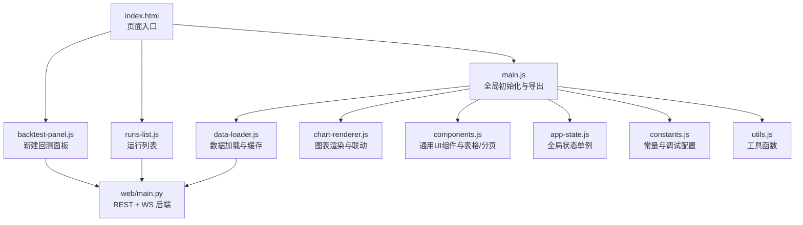
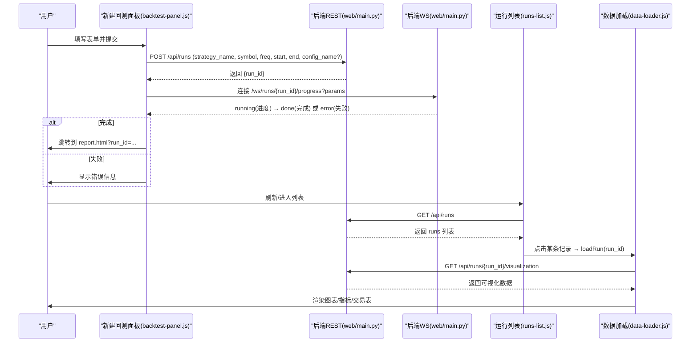
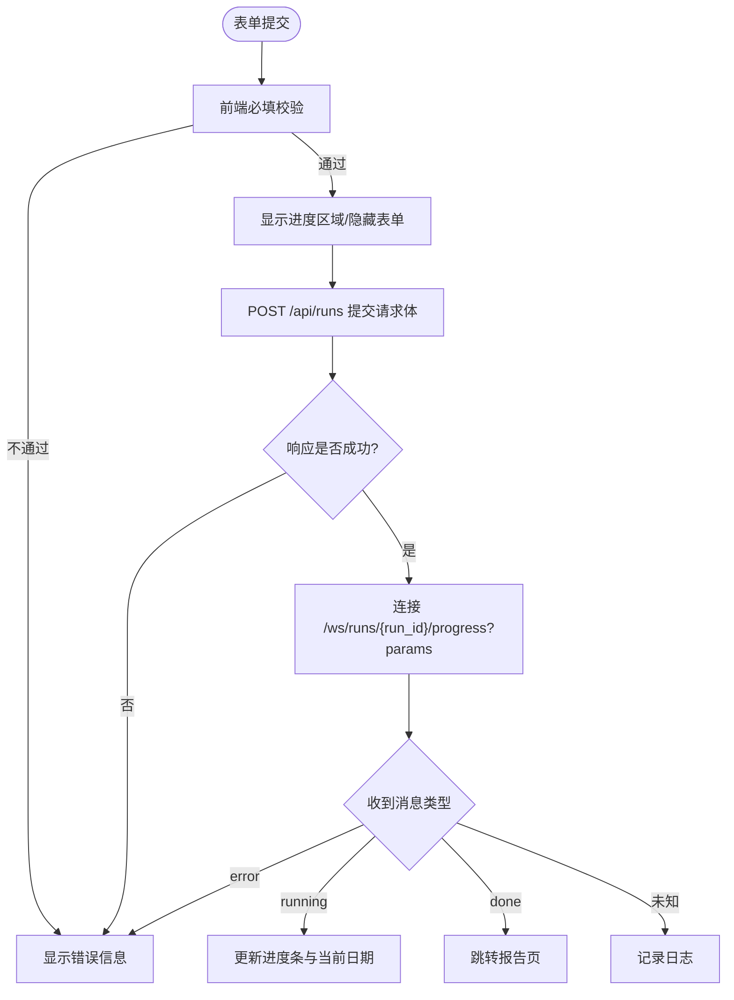
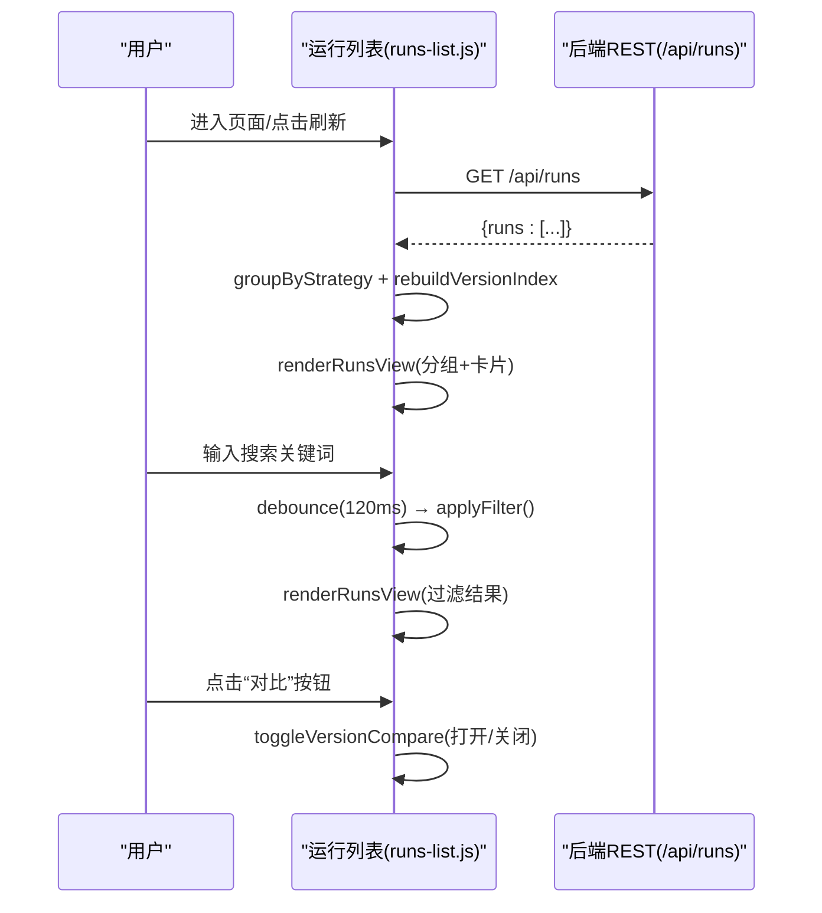
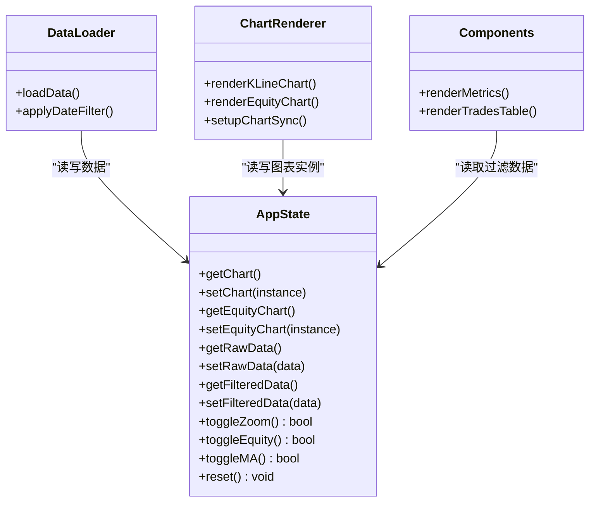
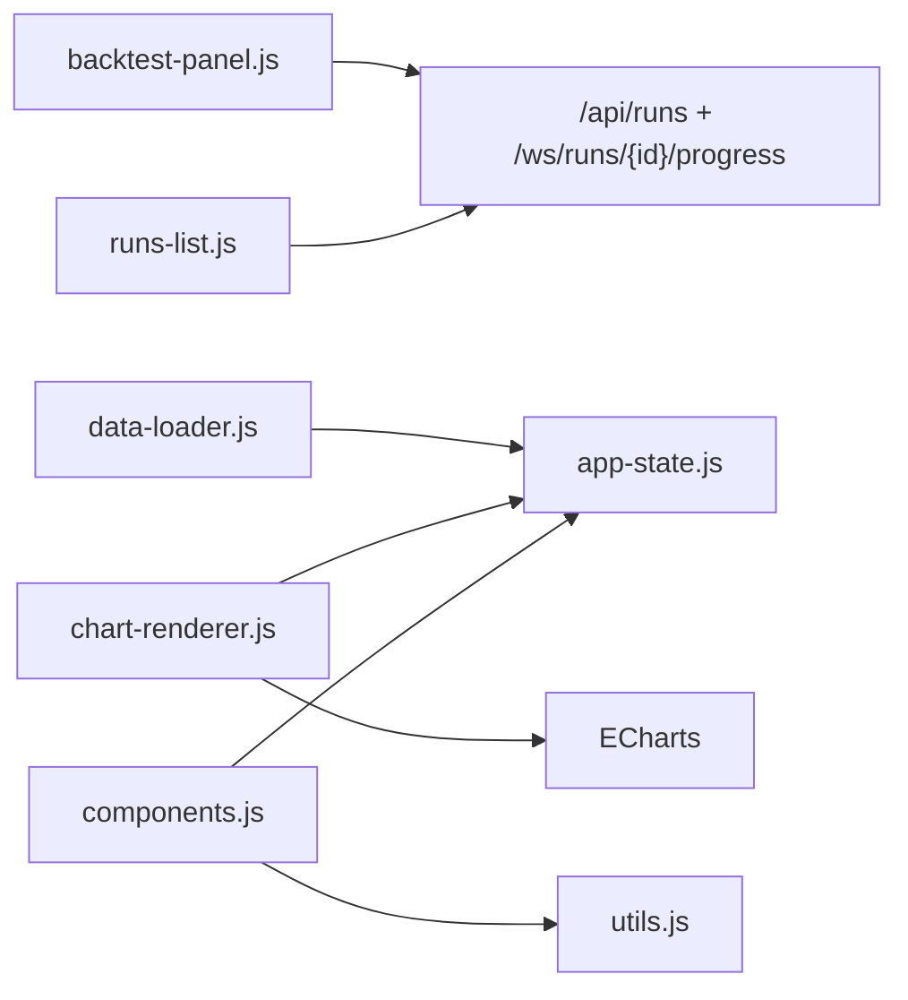

# 交互式组件

<cite>
**本文引用的文件**   
- [index.html](file://src/caisen/frontend/index.html)
- [backtest-panel.js](file://src/caisen/frontend/src/js/backtest-panel.js)
- [runs-list.js](file://src/caisen/frontend/src/js/runs-list.js)
- [app-state.js](file://src/caisen/frontend/src/js/app-state.js)
- [data-loader.js](file://src/caisen/frontend/src/js/data-loader.js)
- [chart-renderer.js](file://src/caisen/frontend/src/js/chart-renderer.js)
- [components.js](file://src/caisen/frontend/src/js/components.js)
- [constants.js](file://src/caisen/frontend/src/js/constants.js)
- [utils.js](file://src/caisen/frontend/src/js/utils.js)
- [main.js](file://src/caisen/frontend/src/js/main.js)
- [web/main.py](file://src/caisen/web/main.py)
</cite>

## 目录
1. [简介](#简介)
2. [项目结构](#项目结构)
3. [核心组件](#核心组件)
4. [架构总览](#架构总览)
5. [详细组件分析](#详细组件分析)
6. [依赖关系分析](#依赖关系分析)
7. [性能考量](#性能考量)
8. [故障排查指南](#故障排查指南)
9. [结论](#结论)
10. [附录：开发指南与最佳实践](#附录开发指南与最佳实践)

## 简介
本技术文档围绕 Caisen 前端交互式组件展开，重点覆盖以下方面：
- 回测面板组件：表单验证、参数配置、进度监控与错误处理
- 运行列表组件：数据加载、排序筛选、分页显示与操作反馈
- 应用状态管理：全局状态存储、状态同步机制与事件驱动架构
- 用户交互处理：表单提交、异步操作、实时反馈与用户引导
- 组件通信模式：父子/兄弟/跨层级状态共享
- 组件开发指南：自定义组件创建、事件定义规范与生命周期管理
- 用户体验优化与可访问性支持

## 项目结构
前端采用模块化组织方式，入口 HTML 通过 ES Module 引入关键脚本；页面逻辑按职责拆分为“新建回测面板”、“运行列表”、“数据加载”、“图表渲染”、“通用组件”等模块。后端提供 REST 与 WebSocket 接口，支撑策略枚举、数据源枚举、触发回测与进度推送。

图示来源
- [index.html:120-132](file://src/caisen/frontend/index.html#L120-L132)
- [backtest-panel.js:82-110](file://src/caisen/frontend/src/js/backtest-panel.js#L82-L110)
- [runs-list.js:567-595](file://src/caisen/frontend/src/js/runs-list.js#L567-L595)
- [data-loader.js:175-245](file://src/caisen/frontend/src/js/data-loader.js#L175-L245)
- [chart-renderer.js:95-137](file://src/caisen/frontend/src/js/chart-renderer.js#L95-L137)
- [components.js:738-746](file://src/caisen/frontend/src/js/components.js#L738-L746)
- [app-state.js:79-79](file://src/caisen/frontend/src/js/app-state.js#L79-L79)
- [constants.js:98-109](file://src/caisen/frontend/src/js/constants.js#L98-L109)
- [utils.js:164-185](file://src/caisen/frontend/src/js/utils.js#L164-L185)
- [web/main.py:85-116](file://src/caisen/web/main.py#L85-L116)

章节来源
- [index.html:120-132](file://src/caisen/frontend/index.html#L120-L132)
- [main.js:52-59](file://src/caisen/frontend/src/js/main.js#L52-L59)

## 核心组件
- 新建回测面板（backtest-panel.js）
  - 负责策略与数据源下拉填充、表单校验、POST 触发回测、WebSocket 进度监听与错误提示
- 运行列表（runs-list.js）
  - 负责拉取并分组展示历史回测记录、搜索过滤、版本对比、迷你净值曲线懒加载
- 数据加载（data-loader.js）
  - 负责根据 URL 参数选择 API 或本地数据、数据缓存、可视化数据校验、渲染管线调度
- 图表渲染（chart-renderer.js）
  - 负责 K 线、权益曲线等图表的初始化、更新、联动与懒加载
- 通用组件（components.js）
  - 提供指标渲染、交易表排序/分页/虚拟滚动、图例与日期输入初始化等
- 应用状态（app-state.js）
  - 提供全局状态单例，集中管理图表实例、原始/过滤数据、视图开关等
- 常量与工具（constants.js, utils.js）
  - 提供策略显示名映射、颜色主题、调试日志、数值/时间格式化与数据过滤工具

章节来源
- [backtest-panel.js:18-69](file://src/caisen/frontend/src/js/backtest-panel.js#L18-L69)
- [runs-list.js:24-42](file://src/caisen/frontend/src/js/runs-list.js#L24-L42)
- [data-loader.js:175-245](file://src/caisen/frontend/src/js/data-loader.js#L175-L245)
- [chart-renderer.js:59-90](file://src/caisen/frontend/src/js/chart-renderer.js#L59-L90)
- [components.js:486-527](file://src/caisen/frontend/src/js/components.js#L486-L527)
- [app-state.js:6-79](file://src/caisen/frontend/src/js/app-state.js#L6-L79)
- [constants.js:15-29](file://src/caisen/frontend/src/js/constants.js#L15-L29)
- [utils.js:164-185](file://src/caisen/frontend/src/js/utils.js#L164-L185)

## 架构总览
前后端交互采用 REST + WebSocket 的组合：
- REST：获取策略列表、数据源列表、历史运行列表、单个运行可视化数据
- WebSocket：回测进度推送（running/done/error），完成后自动跳转报告页

图示来源
- [backtest-panel.js:203-293](file://src/caisen/frontend/src/js/backtest-panel.js#L203-L293)
- [web/main.py:107-116](file://src/caisen/web/main.py#L107-L116)
- [web/main.py:247-271](file://src/caisen/web/main.py#L247-L271)
- [runs-list.js:567-595](file://src/caisen/frontend/src/js/runs-list.js#L567-L595)
- [data-loader.js:175-245](file://src/caisen/frontend/src/js/data-loader.js#L175-L245)

## 详细组件分析

### 回测面板组件（新建回测）
- 功能要点
  - 并行加载策略与数据源选项，动态生成下拉菜单
  - 策略切换时更新“配置预设”下拉与 LLM 提示
  - 表单必填校验（策略、数据源、起止日期、日期顺序）
  - 提交后隐藏表单、显示进度条，建立 WebSocket 连接
  - 解析 WS 消息：running 更新进度，done 跳转报告页，error 显示错误
- 关键流程
  - 构建 WS URL：将 run_id 与查询参数编码为路径与查询串
  - 构造请求体：仅包含必要字段，可选 config_name
  - 错误处理：HTTP 非 2xx 解析 detail 字段；WS 异常捕获并提示

图示来源
- [backtest-panel.js:18-69](file://src/caisen/frontend/src/js/backtest-panel.js#L18-L69)
- [backtest-panel.js:203-293](file://src/caisen/frontend/src/js/backtest-panel.js#L203-L293)

章节来源
- [backtest-panel.js:82-110](file://src/caisen/frontend/src/js/backtest-panel.js#L82-L110)
- [backtest-panel.js:112-145](file://src/caisen/frontend/src/js/backtest-panel.js#L112-L145)
- [backtest-panel.js:184-201](file://src/caisen/frontend/src/js/backtest-panel.js#L184-L201)
- [backtest-panel.js:203-293](file://src/caisen/frontend/src/js/backtest-panel.js#L203-L293)
- [web/main.py:85-116](file://src/caisen/web/main.py#L85-L116)
- [web/main.py:247-271](file://src/caisen/web/main.py#L247-L271)

### 运行列表组件
- 功能要点
  - 从 /api/runs 拉取全部记录，按策略分组并按最新时间排序
  - 搜索框防抖过滤（策略名/标的名）
  - 每个策略内计算稳定版本号 v0/v1/…，不受过滤影响
  - 迷你净值曲线懒加载（仅前 N 条），对比面板按需渲染
  - 卡片可点击跳转详情，空态/错误态友好提示
- 关键流程
  - 首次加载：renderLoading → fetch → rebuildVersionIndex → renderRunsView
  - 搜索：input 事件 → debounce → applyFilter → 重新渲染
  - 对比：toggleVersionCompare → 打开面板 → 渲染对比图 → 关闭销毁实例

图示来源
- [runs-list.js:567-595](file://src/caisen/frontend/src/js/runs-list.js#L567-L595)
- [runs-list.js:24-42](file://src/caisen/frontend/src/js/runs-list.js#L24-L42)
- [runs-list.js:125-146](file://src/caisen/frontend/src/js/runs-list.js#L125-L146)
- [runs-list.js:485-523](file://src/caisen/frontend/src/js/runs-list.js#L485-L523)

章节来源
- [runs-list.js:567-595](file://src/caisen/frontend/src/js/runs-list.js#L567-L595)
- [runs-list.js:528-555](file://src/caisen/frontend/src/js/runs-list.js#L528-L555)
- [runs-list.js:485-523](file://src/caisen/frontend/src/js/runs-list.js#L485-L523)

### 应用状态管理（app-state.js）
- 设计要点
  - 单例模式暴露 getters/setters/toggle/reset 方法
  - 统一管理图表实例、原始/过滤数据、视图开关（缩放、权益可见、均线叠加）、标注过滤
  - 与其他模块解耦，通过导入 appState 进行读写
- 使用场景
  - data-loader 设置 rawData/filteredData
  - chart-renderer 读取/更新图表实例与联动
  - components 读取 filteredData 渲染指标/交易表

图示来源
- [app-state.js:6-79](file://src/caisen/frontend/src/js/app-state.js#L6-L79)
- [data-loader.js:221-231](file://src/caisen/frontend/src/js/data-loader.js#L221-L231)
- [chart-renderer.js:95-137](file://src/caisen/frontend/src/js/chart-renderer.js#L95-L137)
- [components.js:172-247](file://src/caisen/frontend/src/js/components.js#L172-L247)

章节来源
- [app-state.js:6-79](file://src/caisen/frontend/src/js/app-state.js#L6-L79)
- [data-loader.js:221-231](file://src/caisen/frontend/src/js/data-loader.js#L221-L231)
- [chart-renderer.js:254-332](file://src/caisen/frontend/src/js/chart-renderer.js#L254-L332)
- [components.js:738-746](file://src/caisen/frontend/src/js/components.js#L738-L746)

### 用户交互处理
- 表单提交与异步
  - 新建回测面板：submit 事件 → 校验 → POST → WS 监听 → 跳转/错误
- 实时反馈
  - 进度条百分比与当前日期实时更新
  - 列表加载/错误/空态 UI 快速切换
- 用户引导
  - 无数据时提示先执行一次回测
  - 对比按钮在不足两个版本时禁用并给出提示

章节来源
- [backtest-panel.js:203-293](file://src/caisen/frontend/src/js/backtest-panel.js#L203-L293)
- [runs-list.js:333-376](file://src/caisen/frontend/src/js/runs-list.js#L333-L376)
- [runs-list.js:290-328](file://src/caisen/frontend/src/js/runs-list.js#L290-L328)

### 组件通信模式
- 父子组件通信
  - index.html 作为宿主，通过 ES Module 导入并调用子模块初始化函数
- 兄弟组件通信
  - 通过全局 appState 单例共享数据与视图状态
- 跨层级状态共享
  - data-loader 写入 appState，chart-renderer 与 components 读取并更新视图
- 事件驱动
  - DOM 事件（submit/input/change）驱动业务流
  - 图表联动通过 ECharts 事件（dataZoom/updateAxisPointer）实现跨图表同步

章节来源
- [index.html:120-132](file://src/caisen/frontend/index.html#L120-L132)
- [app-state.js:6-79](file://src/caisen/frontend/src/js/app-state.js#L6-L79)
- [chart-renderer.js:254-332](file://src/caisen/frontend/src/js/chart-renderer.js#L254-L332)

## 依赖关系分析
- 模块耦合
  - backtest-panel.js 依赖 web/main.py 的 REST/WS 接口
  - runs-list.js 依赖 /api/runs 与 /api/runs/{id}/visualization
  - data-loader.js 依赖 app-state.js 与 chart-renderer.js
  - components.js 依赖 app-state.js 与 utils.js
- 外部依赖
  - ECharts 用于图表渲染
  - FastAPI + WebSockets（后端）

图示来源
- [backtest-panel.js:203-293](file://src/caisen/frontend/src/js/backtest-panel.js#L203-L293)
- [runs-list.js:567-595](file://src/caisen/frontend/src/js/runs-list.js#L567-L595)
- [data-loader.js:221-231](file://src/caisen/frontend/src/js/data-loader.js#L221-L231)
- [chart-renderer.js:95-137](file://src/caisen/frontend/src/js/chart-renderer.js#L95-L137)
- [components.js:738-746](file://src/caisen/frontend/src/js/components.js#L738-L746)

章节来源
- [web/main.py:85-116](file://src/caisen/web/main.py#L85-L116)
- [web/main.py:247-271](file://src/caisen/web/main.py#L247-L271)

## 性能考量
- 懒加载与 IntersectionObserver
  - 非首屏图表（回撤、热力图、分布）延迟初始化，减少首屏开销
- 防抖与节流
  - 窗口 resize 统一防抖，避免频繁重绘
  - 搜索输入防抖 120ms，降低重排压力
- 大数据集渲染
  - 交易表超过阈值启用虚拟滚动，仅渲染可视区域行
- 网络与缓存
  - 可视化数据按 run_id 缓存，避免重复请求
  - 迷你净值曲线采样降点，提升渲染速度

章节来源
- [chart-renderer.js:59-90](file://src/caisen/frontend/src/js/chart-renderer.js#L59-L90)
- [chart-renderer.js:30-46](file://src/caisen/frontend/src/js/chart-renderer.js#L30-L46)
- [runs-list.js:541-555](file://src/caisen/frontend/src/js/runs-list.js#L541-L555)
- [components.js:559-636](file://src/caisen/frontend/src/js/components.js#L559-L636)
- [data-loader.js:17-20](file://src/caisen/frontend/src/js/data-loader.js#L17-L20)

## 故障排查指南
- 常见问题定位
  - 策略/数据源加载失败：检查 /api/strategies 与 /api/data-sources 响应
  - 回测启动失败：查看 POST /api/runs 返回的 detail 字段
  - WebSocket 连接失败：确认 /ws/runs/{run_id}/progress 可达与参数正确
  - 可视化数据不可用：validateVisualizationData 会阻断渲染并提示
- 调试建议
  - 使用 DEBUG_CONFIG 输出关键节点日志
  - 浏览器控制台查看网络请求与 WS 消息
  - 对图表 setOption 异常启用简化配置回退

章节来源
- [backtest-panel.js:112-145](file://src/caisen/frontend/src/js/backtest-panel.js#L112-L145)
- [backtest-panel.js:203-293](file://src/caisen/frontend/src/js/backtest-panel.js#L203-L293)
- [data-loader.js:119-170](file://src/caisen/frontend/src/js/data-loader.js#L119-L170)
- [chart-renderer.js:179-197](file://src/caisen/frontend/src/js/chart-renderer.js#L179-L197)
- [constants.js:98-109](file://src/caisen/frontend/src/js/constants.js#L98-L109)

## 结论
Caisen 前端以清晰的模块边界与单例状态管理为核心，结合 REST + WebSocket 的双通道交互，实现了从“新建回测”到“运行列表”再到“可视化报告”的完整闭环。通过懒加载、防抖、虚拟滚动等手段保障性能，并通过完善的错误态与用户引导提升体验。后续可在组件化封装、测试覆盖率与可访问性增强方面持续迭代。

## 附录：开发指南与最佳实践
- 自定义组件创建
  - 新增独立 JS 模块，遵循纯函数优先原则，DOM 操作集中在渲染层
  - 通过 appState 共享状态，避免直接跨模块引用 DOM
- 事件定义规范
  - 使用语义化 ID 与 aria-* 属性，确保键盘与屏幕阅读器可用
  - 对外暴露 window.* 函数需保持幂等与可重入
- 生命周期管理
  - 初始化入口在 main.js 中集中注册，按需 lazyInitChart 控制渲染时机
  - 图表实例在 appState 中统一管理，必要时 dispose 释放资源
- 用户体验优化
  - 空态/错误态文案清晰，提供重试/返回列表等快捷操作
  - 大列表分页/虚拟滚动，首屏只渲染必要内容
- 可访问性支持
  - 为交互元素添加 tabindex、role、aria-label、aria-expanded 等属性
  - 键盘导航支持 Enter/Space 触发主要操作

章节来源
- [main.js:52-59](file://src/caisen/frontend/src/js/main.js#L52-L59)
- [chart-renderer.js:59-90](file://src/caisen/frontend/src/js/chart-renderer.js#L59-L90)
- [runs-list.js:224-284](file://src/caisen/frontend/src/js/runs-list.js#L224-L284)
- [components.js:314-383](file://src/caisen/frontend/src/js/components.js#L314-L383)