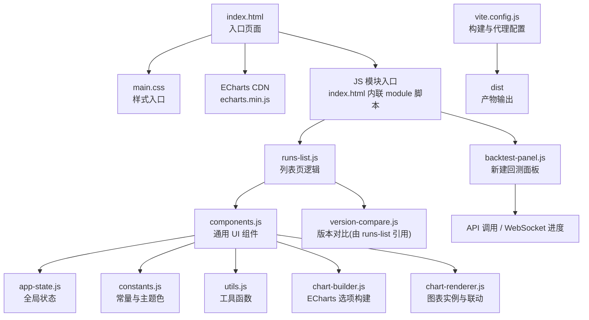
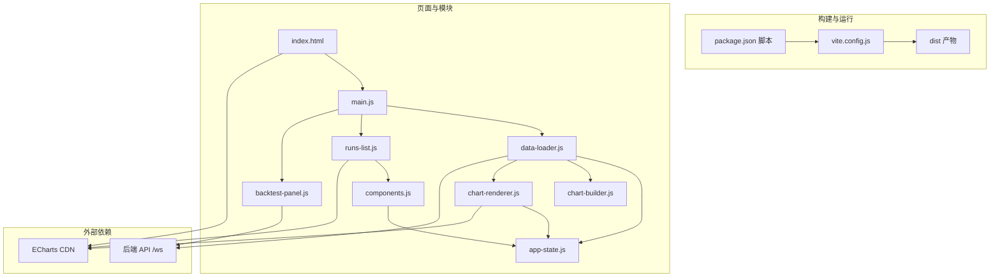
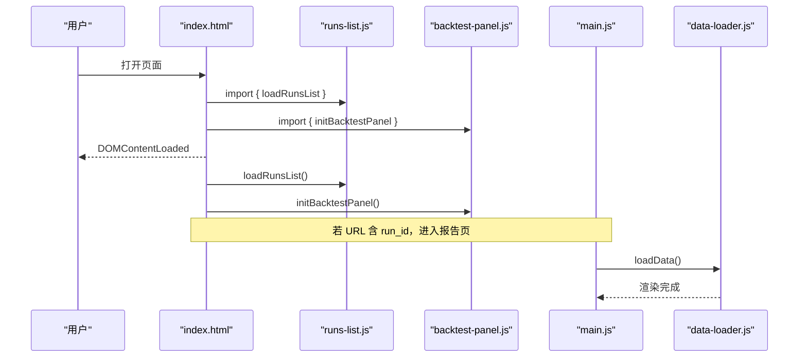
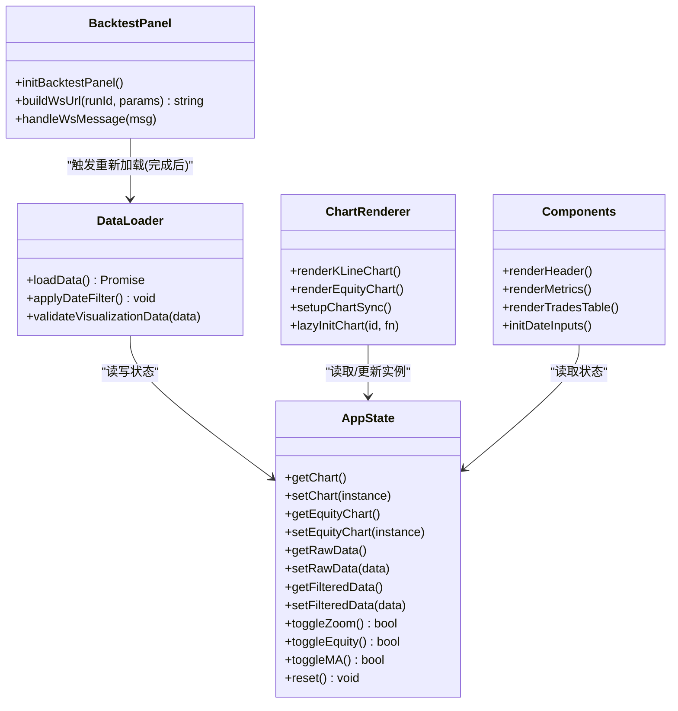
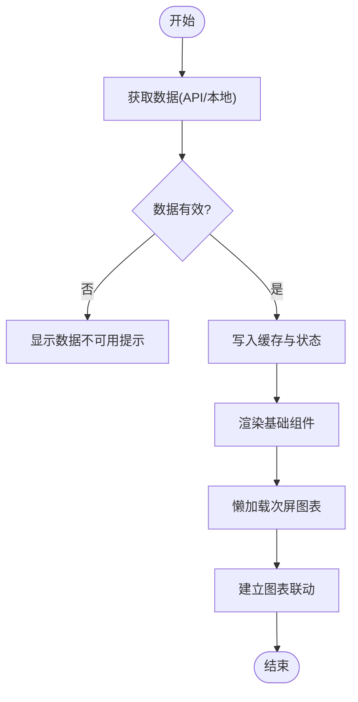
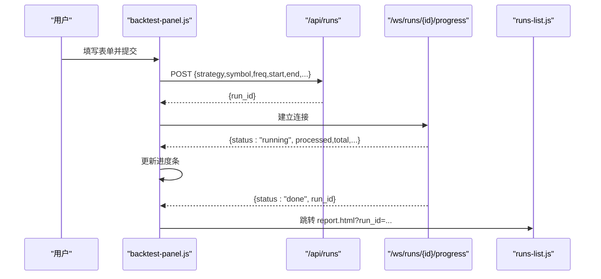
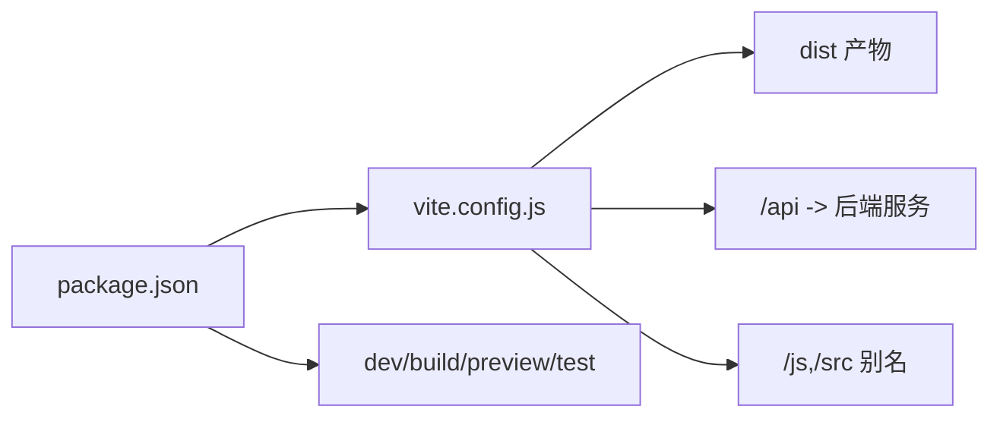

# 前端架构设计

<cite>
**本文引用的文件**   
- [index.html](file://src/caisen/frontend/index.html)
- [vite.config.js](file://src/caisen/frontend/vite.config.js)
- [package.json](file://src/caisen/frontend/package.json)
- [main.css](file://src/caisen/frontend/src/css/main.css)
- [variables.css](file://src/caisen/frontend/src/css/variables.css)
- [main.js](file://src/caisen/frontend/src/js/main.js)
- [app-state.js](file://src/caisen/frontend/src/js/app-state.js)
- [data-loader.js](file://src/caisen/frontend/src/js/data-loader.js)
- [chart-builder.js](file://src/caisen/frontend/src/js/chart-builder.js)
- [chart-renderer.js](file://src/caisen/frontend/src/js/chart-renderer.js)
- [components.js](file://src/caisen/frontend/src/js/components.js)
- [constants.js](file://src/caisen/frontend/src/js/constants.js)
- [utils.js](file://src/caisen/frontend/src/js/utils.js)
- [backtest-panel.js](file://src/caisen/frontend/src/js/backtest-panel.js)
- [runs-list.js](file://src/caisen/frontend/src/js/runs-list.js)
</cite>

## 目录
1. [简介](#简介)
2. [项目结构](#项目结构)
3. [核心组件](#核心组件)
4. [架构总览](#架构总览)
5. [详细组件分析](#详细组件分析)
6. [依赖关系分析](#依赖关系分析)
7. [性能考量](#性能考量)
8. [故障排查指南](#故障排查指南)
9. [结论](#结论)
10. [附录：扩展指南](#附录扩展指南)

## 简介
本文件为 Caisen 前端架构的技术文档，聚焦于基于 Vite + ECharts 的前端技术栈与模块化组织方式。内容涵盖：
- 技术选型与设计决策（Vite、ECharts、ESM）
- 模块划分与组件化模式
- 构建配置与开发服务器设置
- 应用初始化流程（DOM 加载到模块导入）
- 状态管理（全局状态存储、数据流控制、事件通信）
- 扩展指南（新模块、第三方库集成、插件方法）
- 性能优化技巧与浏览器兼容性考虑

## 项目结构
前端位于 src/caisen/frontend 下，采用“入口 HTML + ESM 模块 + CSS 模块化”的轻量架构：
- 入口页面 index.html 负责引入主样式与 ECharts CDN，并通过 type="module" 脚本启动业务模块
- JS 模块按职责拆分：应用入口、状态、数据加载、图表构建与渲染、UI 组件、工具与常量等
- CSS 通过 main.css 聚合 variables/reset/layout/components/pages 等子样式，便于统一主题与布局

图示来源
- [index.html:1-135](file://src/caisen/frontend/index.html#L1-L135)
- [main.css:1-7](file://src/caisen/frontend/src/css/main.css#L1-L7)
- [vite.config.js:1-43](file://src/caisen/frontend/vite.config.js#L1-L43)

章节来源
- [index.html:1-135](file://src/caisen/frontend/index.html#L1-L135)
- [main.css:1-7](file://src/caisen/frontend/src/css/main.css#L1-L7)
- [vite.config.js:1-43](file://src/caisen/frontend/vite.config.js#L1-L43)
- [package.json:1-26](file://src/caisen/frontend/package.json#L1-L26)

## 核心组件
- 应用入口 main.js：导出全局函数供 HTML 内联脚本使用；注册全局错误捕获；在 report 页面自动加载数据
- 全局状态 app-state.js：以工厂函数创建单例，集中持有图表实例、原始/过滤数据、交互开关等
- 数据加载 data-loader.js：从 API 或本地文件获取数据，校验格式，缓存结果，驱动渲染管线
- 图表构建 chart-builder.js：将数据转换为 ECharts option（K 线、净值曲线、回撤区域、新高标记等）
- 图表渲染 chart-renderer.js：初始化/更新图表实例，处理缩放联动、懒加载、响应式 resize
- UI 组件 components.js：指标卡片、交易表（分页/虚拟滚动）、图例、日期输入、错误/空态展示
- 常量 constants.js：策略显示名映射、形态颜色、图表配色、布局常量、调试开关
- 工具 utils.js：数值/时间格式化、坐标有效性校验、日期过滤等纯函数
- 新建回测面板 backtest-panel.js：表单提交、WebSocket 进度、跳转报告页
- 回测列表 runs-list.js：分组渲染、搜索过滤、迷你火花线、版本对比

章节来源
- [main.js:1-96](file://src/caisen/frontend/src/js/main.js#L1-L96)
- [app-state.js:1-79](file://src/caisen/frontend/src/js/app-state.js#L1-L79)
- [data-loader.js:1-286](file://src/caisen/frontend/src/js/data-loader.js#L1-L286)
- [chart-builder.js:1-638](file://src/caisen/frontend/src/js/chart-builder.js#L1-L638)
- [chart-renderer.js:1-333](file://src/caisen/frontend/src/js/chart-renderer.js#L1-L333)
- [components.js:1-747](file://src/caisen/frontend/src/js/components.js#L1-L747)
- [constants.js:1-109](file://src/caisen/frontend/src/js/constants.js#L1-L109)
- [utils.js:1-185](file://src/caisen/frontend/src/js/utils.js#L1-L185)
- [backtest-panel.js:1-328](file://src/caisen/frontend/src/js/backtest-panel.js#L1-L328)
- [runs-list.js:1-609](file://src/caisen/frontend/src/js/runs-list.js#L1-L609)

## 架构总览
整体采用“入口 HTML + ESM 模块 + 全局状态 + 数据驱动渲染”的轻量架构。构建层由 Vite 提供开发与生产构建能力，并配置了 API 代理与别名解析。运行时通过 fetch/WebSocket 与后端交互，ECharts 负责可视化渲染。

图示来源
- [vite.config.js:1-43](file://src/caisen/frontend/vite.config.js#L1-L43)
- [package.json:1-26](file://src/caisen/frontend/package.json#L1-L26)
- [index.html:1-135](file://src/caisen/frontend/index.html#L1-L135)
- [main.js:1-96](file://src/caisen/frontend/src/js/main.js#L1-L96)
- [data-loader.js:1-286](file://src/caisen/frontend/src/js/data-loader.js#L1-L286)
- [chart-renderer.js:1-333](file://src/caisen/frontend/src/js/chart-renderer.js#L1-L333)
- [chart-builder.js:1-638](file://src/caisen/frontend/src/js/chart-builder.js#L1-L638)
- [components.js:1-747](file://src/caisen/frontend/src/js/components.js#L1-L747)
- [runs-list.js:1-609](file://src/caisen/frontend/src/js/runs-list.js#L1-L609)
- [backtest-panel.js:1-328](file://src/caisen/frontend/src/js/backtest-panel.js#L1-L328)

## 详细组件分析

### 应用初始化流程（从 DOM 加载到模块导入）
- index.html 引入主样式与 ECharts CDN，并在 body 底部以 type="module" 脚本导入 runs-list 与 backtest-panel，暴露 window.refreshRuns
- DOMContentLoaded 触发后，执行 loadRunsList() 与 initBacktestPanel()
- main.js 作为报告页入口，监听 URL 参数 run_id，存在则调用 loadData() 进入详情渲染流程

图示来源
- [index.html:120-132](file://src/caisen/frontend/index.html#L120-L132)
- [main.js:51-59](file://src/caisen/frontend/src/js/main.js#L51-L59)
- [data-loader.js:175-245](file://src/caisen/frontend/src/js/data-loader.js#L175-L245)

章节来源
- [index.html:120-132](file://src/caisen/frontend/index.html#L120-L132)
- [main.js:51-59](file://src/caisen/frontend/src/js/main.js#L51-L59)
- [data-loader.js:175-245](file://src/caisen/frontend/src/js/data-loader.js#L175-L245)

### 状态管理机制（全局状态、数据流、事件通信）
- 全局状态 appState：集中保存图表实例、原始/过滤数据、交互开关（缩放、均线、权益可见性），并提供 getter/setter 与 toggle 方法
- 数据流：data-loader 拉取并校验数据 → 写入 appState → 触发各组件渲染（头部、指标、交易表、图例、日期输入）→ 按需懒加载次屏图表
- 事件通信：
  - 图表联动：chart-renderer 建立 dataZoom 与 updateAxisPointer 的双向同步
  - WebSocket：backtest-panel 连接 /ws/runs/{runId}/progress，接收 running/done/error 消息，驱动进度条与跳转

图示来源
- [app-state.js:1-79](file://src/caisen/frontend/src/js/app-state.js#L1-L79)
- [data-loader.js:175-286](file://src/caisen/frontend/src/js/data-loader.js#L175-L286)
- [chart-renderer.js:95-174](file://src/caisen/frontend/src/js/chart-renderer.js#L95-L174)
- [components.js:738-747](file://src/caisen/frontend/src/js/components.js#L738-L747)
- [backtest-panel.js:18-69](file://src/caisen/frontend/src/js/backtest-panel.js#L18-L69)

章节来源
- [app-state.js:1-79](file://src/caisen/frontend/src/js/app-state.js#L1-L79)
- [data-loader.js:175-286](file://src/caisen/frontend/src/js/data-loader.js#L175-L286)
- [chart-renderer.js:254-332](file://src/caisen/frontend/src/js/chart-renderer.js#L254-L332)
- [backtest-panel.js:248-293](file://src/caisen/frontend/src/js/backtest-panel.js#L248-L293)

### 图表构建与渲染（ECharts 集成）
- chart-builder：计算 MA、新高检测、回撤区间、构建 K 线与净值曲线 option，支持大数据量优化（large/sampling）
- chart-renderer：实例化/更新图表，处理窗口 resize 防抖、IntersectionObserver 懒加载、跨图表联动
- 数据验证：data-loader 对 bars/equity_curve/trades/annotations 进行必要字段校验，失败时友好提示并隐藏图表区

图示来源
- [data-loader.js:119-170](file://src/caisen/frontend/src/js/data-loader.js#L119-L170)
- [data-loader.js:175-245](file://src/caisen/frontend/src/js/data-loader.js#L175-L245)
- [chart-builder.js:116-171](file://src/caisen/frontend/src/js/chart-builder.js#L116-L171)
- [chart-renderer.js:59-90](file://src/caisen/frontend/src/js/chart-renderer.js#L59-L90)
- [chart-renderer.js:254-332](file://src/caisen/frontend/src/js/chart-renderer.js#L254-L332)

章节来源
- [chart-builder.js:116-171](file://src/caisen/frontend/src/js/chart-builder.js#L116-L171)
- [chart-renderer.js:95-174](file://src/caisen/frontend/src/js/chart-renderer.js#L95-L174)
- [data-loader.js:175-245](file://src/caisen/frontend/src/js/data-loader.js#L175-L245)

### 新建回测面板（表单与 WebSocket 进度）
- 并行加载策略与数据源，动态填充下拉框
- 表单提交 POST /api/runs，成功后建立 WebSocket 连接，实时更新进度条，完成后跳转到 report.html?run_id=...
- 错误处理：网络异常、WS 错误、服务端错误均反馈至 UI

图示来源
- [backtest-panel.js:203-246](file://src/caisen/frontend/src/js/backtest-panel.js#L203-L246)
- [backtest-panel.js:248-293](file://src/caisen/frontend/src/js/backtest-panel.js#L248-L293)
- [backtest-panel.js:18-69](file://src/caisen/frontend/src/js/backtest-panel.js#L18-L69)

章节来源
- [backtest-panel.js:82-110](file://src/caisen/frontend/src/js/backtest-panel.js#L82-L110)
- [backtest-panel.js:203-246](file://src/caisen/frontend/src/js/backtest-panel.js#L203-L246)
- [backtest-panel.js:248-293](file://src/caisen/frontend/src/js/backtest-panel.js#L248-L293)

### 回测列表与版本对比
- 分组渲染：按 strategy_name 分组，按最近更新时间排序
- 搜索过滤：debounce 输入，按策略名与标的模糊匹配
- 迷你火花线：仅对前 N 个条目异步拉取 equity_curve 并绘制
- 版本对比：展开面板后渲染多版本净值对比图，关闭时销毁实例

章节来源
- [runs-list.js:24-42](file://src/caisen/frontend/src/js/runs-list.js#L24-L42)
- [runs-list.js:528-555](file://src/caisen/frontend/src/js/runs-list.js#L528-L555)
- [runs-list.js:423-447](file://src/caisen/frontend/src/js/runs-list.js#L423-L447)
- [runs-list.js:485-523](file://src/caisen/frontend/src/js/runs-list.js#L485-L523)

## 依赖关系分析
- 构建与脚本：package.json 定义 dev/build/preview/test/e2e 脚本，依赖 vite、vitest、@playwright/test
- 构建配置：vite.config.js 配置 root/base、多入口（index.html/report.html）、server.proxy 转发 /api、resolve.alias 简化路径、test 环境 jsdom
- 运行时依赖：ECharts 通过 CDN 引入，避免打包体积膨胀；其余均为内部 ESM 模块

图示来源
- [package.json:1-26](file://src/caisen/frontend/package.json#L1-L26)
- [vite.config.js:1-43](file://src/caisen/frontend/vite.config.js#L1-L43)

章节来源
- [package.json:1-26](file://src/caisen/frontend/package.json#L1-L26)
- [vite.config.js:1-43](file://src/caisen/frontend/vite.config.js#L1-L43)

## 性能考量
- 大数据量优化
  - K 线与成交量启用 large/largeThreshold，超万点禁用动画
  - 净值曲线与回撤使用 sampling:'lttb' 降采样
  - markPoints/markLines 在大集合中限制数量
- 懒加载与延迟初始化
  - IntersectionObserver 懒加载次屏图表（回撤、热力图、分布）
  - 列表页迷你火花线异步加载且限前 N 项
- 渲染优化
  - 统一 resize 防抖，减少频繁 setOption
  - 交易表超过阈值启用虚拟滚动，固定表头
- 资源与缓存
  - 数据缓存 Map 避免重复请求
  - ECharts 通过 CDN 引入，减小包体

章节来源
- [chart-builder.js:143-171](file://src/caisen/frontend/src/js/chart-builder.js#L143-L171)
- [chart-builder.js:381-429](file://src/caisen/frontend/src/js/chart-builder.js#L381-L429)
- [chart-renderer.js:29-46](file://src/caisen/frontend/src/js/chart-renderer.js#L29-L46)
- [chart-renderer.js:59-90](file://src/caisen/frontend/src/js/chart-renderer.js#L59-L90)
- [components.js:559-636](file://src/caisen/frontend/src/js/components.js#L559-L636)
- [data-loader.js:17-210](file://src/caisen/frontend/src/js/data-loader.js#L17-L210)
- [runs-list.js:423-447](file://src/caisen/frontend/src/js/runs-list.js#L423-L447)

## 故障排查指南
- 全局错误捕获
  - main.js 注册 onerror 与 onunhandledrejection，统一记录错误信息
- 数据校验与降级
  - data-loader 校验 bars/equity_curve 必填字段，不合法时显示友好提示并隐藏图表
  - chart-renderer 在 setOption 失败时尝试简化配置（移除 markPoint/markLine）
- 网络与 WebSocket
  - backtest-panel 捕获 fetch 与 WS 错误，及时提示用户
- 调试日志
  - constants.DEBUG_CONFIG 提供 log/warn/error 开关，便于定位问题

章节来源
- [main.js:37-47](file://src/caisen/frontend/src/js/main.js#L37-L47)
- [data-loader.js:119-170](file://src/caisen/frontend/src/js/data-loader.js#L119-L170)
- [chart-renderer.js:179-197](file://src/caisen/frontend/src/js/chart-renderer.js#L179-L197)
- [backtest-panel.js:285-293](file://src/caisen/frontend/src/js/backtest-panel.js#L285-L293)
- [constants.js:98-109](file://src/caisen/frontend/src/js/constants.js#L98-L109)

## 结论
Caisen 前端采用轻量、清晰的模块化架构，结合 Vite 的高效构建与 ECharts 的强大可视化能力，实现了从列表浏览、新建回测到详情可视化的完整闭环。通过全局状态集中管理、数据驱动渲染与完善的性能优化策略，兼顾了可维护性与用户体验。后续可在保持现有边界的前提下，持续扩展更多图表与分析维度。

## 附录：扩展指南

### 新增模块
- 在 src/js 下新增 .js 模块，遵循单一职责原则
- 在 index.html 或 main.js 中以 ES Module 方式导入并挂载到 window（如需兼容内联 onclick）
- 在 vite.config.js 的 resolve.alias 中补充路径别名（如需要）

章节来源
- [index.html:120-132](file://src/caisen/frontend/index.html#L120-L132)
- [main.js:22-35](file://src/caisen/frontend/src/js/main.js#L22-L35)
- [vite.config.js:30-35](file://src/caisen/frontend/vite.config.js#L30-L35)

### 集成第三方库
- 推荐通过 CDN 引入（如 ECharts），避免打包体积膨胀
- 若需打包，请在 package.json 添加依赖，并在模块中 import 使用
- 注意与 ESM 的兼容性，确保 polyfill 与全局变量注入策略一致

章节来源
- [index.html:11](file://src/caisen/frontend/index.html#L11)
- [package.json:15-17](file://src/caisen/frontend/package.json#L15-L17)

### 插件与自定义渲染
- 复用 chart-builder 的 option 构建模式，封装新的图表类型
- 通过 chart-renderer.lazyInitChart 实现按需渲染
- 利用 appState 共享状态，保证跨组件一致性

章节来源
- [chart-builder.js:116-171](file://src/caisen/frontend/src/js/chart-builder.js#L116-L171)
- [chart-renderer.js:59-90](file://src/caisen/frontend/src/js/chart-renderer.js#L59-L90)
- [app-state.js:6-79](file://src/caisen/frontend/src/js/app-state.js#L6-L79)

### 构建与部署
- 开发：npm run dev，默认端口 8000，/api 请求代理到后端
- 构建：npm run build，输出 dist，包含 index.html 与 report.html 两个入口
- 预览：npm run preview，用于本地验证生产构建产物

章节来源
- [package.json:6-14](file://src/caisen/frontend/package.json#L6-L14)
- [vite.config.js:8-29](file://src/caisen/frontend/vite.config.js#L8-L29)

### 浏览器兼容性
- 使用现代浏览器特性（ESM、IntersectionObserver、Fetch、WebSocket）
- 对不支持 IntersectionObserver 的环境，懒加载会回退为立即初始化
- 建议目标浏览器为最新稳定版，必要时引入 polyfill

章节来源
- [chart-renderer.js:72-76](file://src/caisen/frontend/src/js/chart-renderer.js#L72-L76)