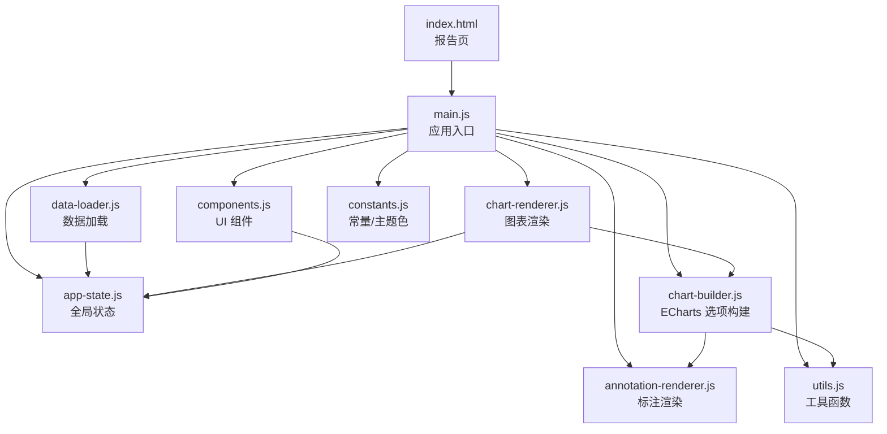
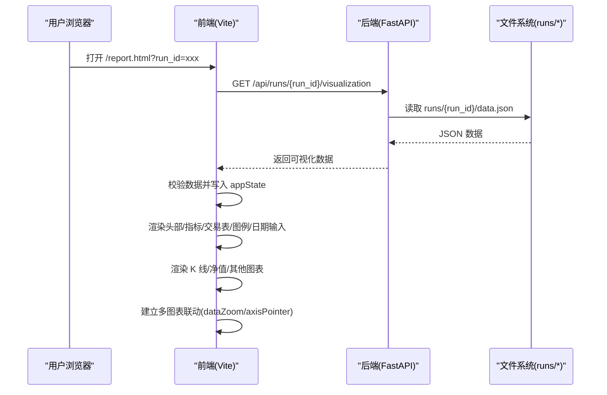
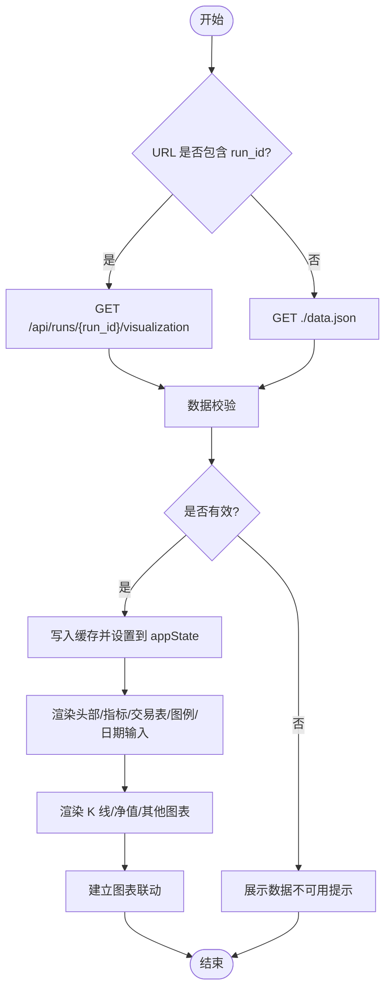
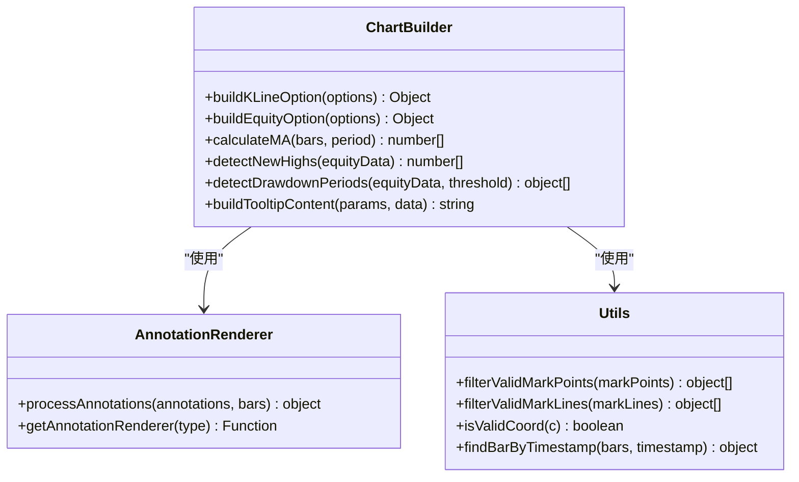
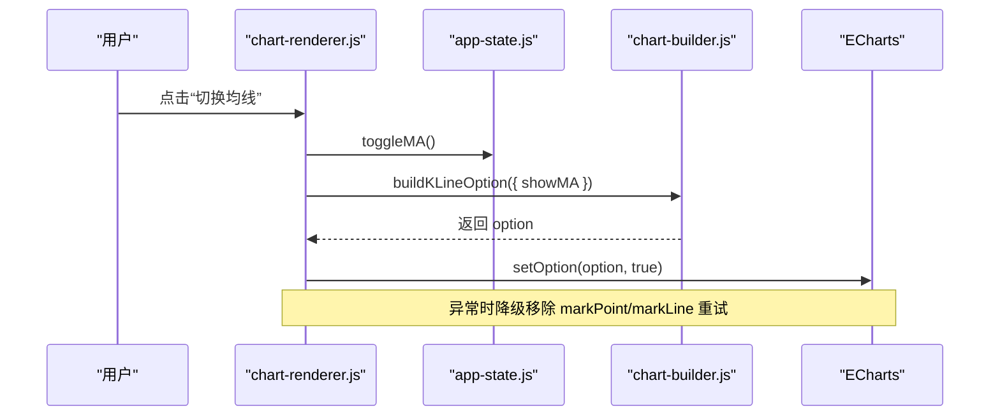
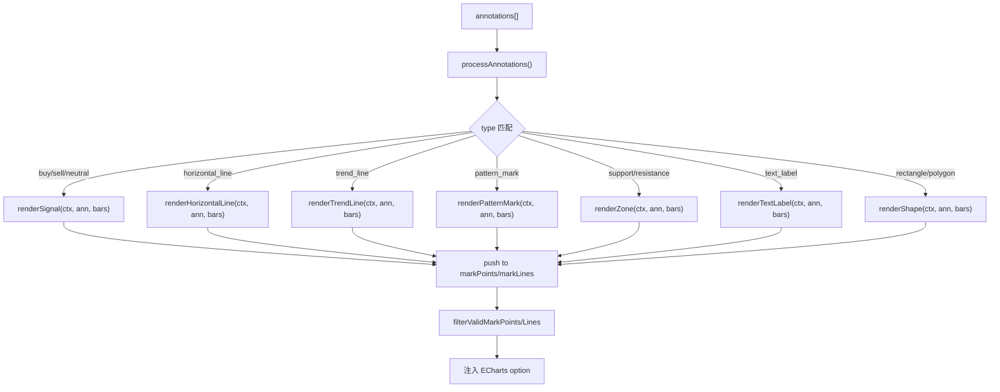
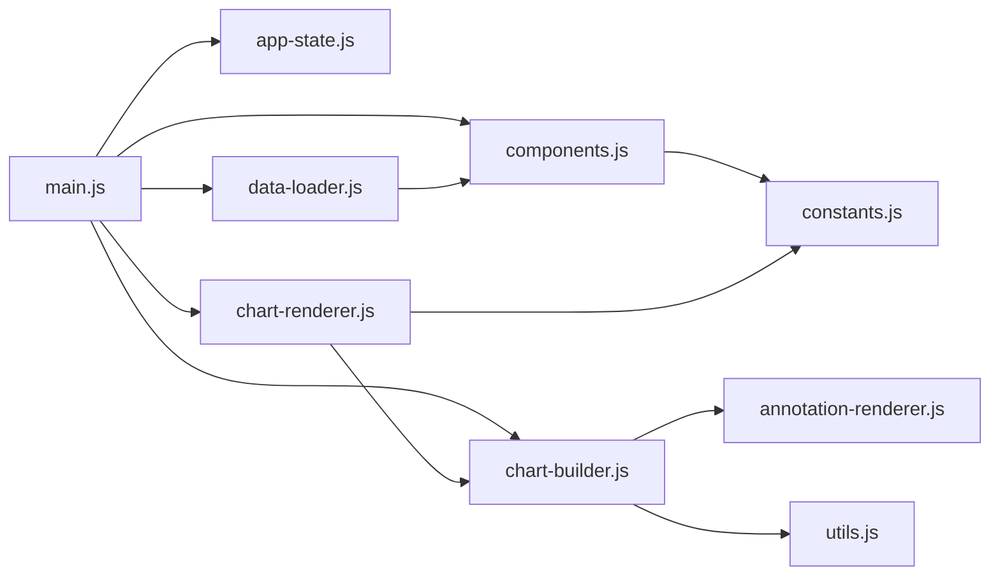

# 可视化系统

<cite>
**本文引用的文件**   
- [main.js](file://src/caisen/frontend/src/js/main.js)
- [chart-renderer.js](file://src/caisen/frontend/src/js/chart-renderer.js)
- [data-loader.js](file://src/caisen/frontend/src/js/data-loader.js)
- [app-state.js](file://src/caisen/frontend/src/js/app-state.js)
- [chart-builder.js](file://src/caisen/frontend/src/js/chart-builder.js)
- [components.js](file://src/caisen/frontend/src/js/components.js)
- [annotation-renderer.js](file://src/caisen/frontend/src/js/annotation-renderer.js)
- [constants.js](file://src/caisen/frontend/src/js/constants.js)
- [utils.js](file://src/caisen/frontend/src/js/utils.js)
- [variables.css](file://src/caisen/frontend/src/css/variables.css)
- [vite.config.js](file://src/caisen/frontend/vite.config.js)
- [package.json](file://src/caisen/frontend/package.json)
- [main.py](file://src/caisen/web/main.py)
</cite>

## 目录
1. [简介](#简介)
2. [项目结构](#项目结构)
3. [核心组件](#核心组件)
4. [架构总览](#架构总览)
5. [详细组件分析](#详细组件分析)
6. [依赖关系分析](#依赖关系分析)
7. [性能考量](#性能考量)
8. [故障排查指南](#故障排查指南)
9. [结论](#结论)
10. [附录](#附录)

## 简介
本技术文档面向 Caisen 前端可视化系统，聚焦基于 Vite + ECharts 的前端架构与实现。内容涵盖模块化组织、组件化开发、响应式布局、图表渲染引擎（K 线图、净值曲线、交易标注、形态标记）、交互能力（缩放平移、数据筛选、指标切换、用户反馈）、数据加载链路（后端 API → 前端可视化）、样式系统与主题定制（CSS 变量管理、响应式设计），以及自定义图表组件扩展指南、性能优化技巧与浏览器兼容性建议。

## 项目结构
前端采用模块化的 ES Module 组织方式，核心职责划分清晰：
- 应用入口与全局导出：统一暴露页面所需的全局函数，集中错误处理与自动初始化逻辑
- 状态管理：单一 appState 对象维护所有图表实例、原始/过滤数据及开关状态
- 数据加载：从后端 /api/runs/{run_id}/visualization 或本地 data.json 获取数据，进行校验与缓存
- 图表构建器：生成 K 线与净值曲线的 ECharts option，包含均线、成交量、回撤区域、新高点等
- 图表渲染器：负责 ECharts 实例的懒加载、resize 联动、同步缩放与十字光标联动
- UI 组件：头部信息、指标卡片、交易表（含虚拟滚动）、图例、日期筛选等
- 标注渲染器：将 annotation 数据转换为 markPoints/markLines，支持多种标注类型
- 常量与工具：颜色、布局、调试配置、通用工具函数
- 样式系统：CSS 变量统一管理深色主题、语义色、渐变、阴影、间距与圆角等
- 构建与代理：Vite 配置多入口、开发服务器代理到后端 API

**图示来源**
- [main.js:1-96](file://src/caisen/frontend/src/js/main.js#L1-L96)
- [app-state.js:1-79](file://src/caisen/frontend/src/js/app-state.js#L1-L79)
- [data-loader.js:1-286](file://src/caisen/frontend/src/js/data-loader.js#L1-L286)
- [chart-renderer.js:1-333](file://src/caisen/frontend/src/js/chart-renderer.js#L1-L333)
- [chart-builder.js:1-638](file://src/caisen/frontend/src/js/chart-builder.js#L1-L638)
- [components.js:1-747](file://src/caisen/frontend/src/js/components.js#L1-L747)
- [annotation-renderer.js:1-437](file://src/caisen/frontend/src/js/annotation-renderer.js#L1-L437)
- [constants.js:1-109](file://src/caisen/frontend/src/js/constants.js#L1-L109)
- [utils.js:1-185](file://src/caisen/frontend/src/js/utils.js#L1-L185)

**章节来源**
- [main.js:1-96](file://src/caisen/frontend/src/js/main.js#L1-L96)
- [vite.config.js:1-43](file://src/caisen/frontend/vite.config.js#L1-L43)
- [package.json:1-26](file://src/caisen/frontend/package.json#L1-L26)

## 核心组件
- 应用入口 main.js
  - 统一导出全局函数供 HTML 内联脚本调用
  - 注册全局错误捕获与未处理 Promise 拒绝回调
  - 在 DOMContentLoaded 时根据 URL 参数决定是否自动加载数据
- 状态管理 app-state.js
  - 提供图表实例、原始/过滤数据、缩放/均线显示等状态的 getter/setter/toggle/reset
  - 单例模式跨模块共享
- 数据加载 data-loader.js
  - 支持从后端 /api/runs/{run_id}/visualization 或本地 data.json 拉取数据
  - 内置数据有效性校验与友好错误提示
  - 日期筛选后刷新各图表与面板
- 图表构建 chart-builder.js
  - 计算 MA5/MA20、新高点检测、回撤区间检测
  - 构建 K 线（OHLC + 成交量）与净值曲线（含回撤面积、新高点标记）
  - 大数优化：large/largeThreshold、采样策略 lttb、markPoints 数量限制
- 图表渲染 chart-renderer.js
  - 懒初始化 IntersectionObserver，避免首屏外图表阻塞
  - 统一的 resize 防抖，批量触发所有图表实例 resize
  - 多图表联动：dataZoom 与 updateAxisPointer 同步
- UI 组件 components.js
  - 指标卡片、迷你净值折线、交易列表（排序+分页+虚拟滚动）、图例、日期输入
  - 趋势箭头与数值格式化
- 标注渲染 annotation-renderer.js
  - 将 annotation 转为 markPoints/markLines，支持买卖信号、水平线、趋势线、形态标记、支撑/阻力区、文本标签、矩形、多边形等
- 常量与工具 constants.js, utils.js
  - 策略展示名映射、形态颜色、图表主题色、调试配置
  - 时间戳格式化、年化收益计算、坐标/数值合法性校验、按时间模糊匹配 bar

**章节来源**
- [main.js:1-96](file://src/caisen/frontend/src/js/main.js#L1-L96)
- [app-state.js:1-79](file://src/caisen/frontend/src/js/app-state.js#L1-L79)
- [data-loader.js:1-286](file://src/caisen/frontend/src/js/data-loader.js#L1-L286)
- [chart-builder.js:1-638](file://src/caisen/frontend/src/js/chart-builder.js#L1-L638)
- [chart-renderer.js:1-333](file://src/caisen/frontend/src/js/chart-renderer.js#L1-L333)
- [components.js:1-747](file://src/caisen/frontend/src/js/components.js#L1-L747)
- [annotation-renderer.js:1-437](file://src/caisen/frontend/src/js/annotation-renderer.js#L1-L437)
- [constants.js:1-109](file://src/caisen/frontend/src/js/constants.js#L1-L109)
- [utils.js:1-185](file://src/caisen/frontend/src/js/utils.js#L1-L185)

## 架构总览
前后端分离，前端通过 Vite 构建并开发，生产由 Python FastAPI 服务静态资源并提供 REST/WebSocket 接口。

**图示来源**
- [data-loader.js:175-245](file://src/caisen/frontend/src/js/data-loader.js#L175-L245)
- [main.py:194-201](file://src/caisen/web/main.py#L194-L201)

**章节来源**
- [main.py:86-245](file://src/caisen/web/main.py#L86-L245)
- [vite.config.js:1-43](file://src/caisen/frontend/vite.config.js#L1-L43)

## 详细组件分析

### 数据加载与处理流程
- 数据来源优先级
  - 若 URL 包含 run_id，则请求后端 /api/runs/{run_id}/visualization
  - 否则回退到本地 ./data.json
- 数据校验
  - 检查 bars 数组非空且包含必要字段 timestamp/open/high/low/close
  - 失败时隐藏图表区域并展示“数据不可用”友好提示
- 缓存机制
  - 使用 Map 缓存已加载的 runId→rawData，避免重复请求
- 筛选与刷新
  - 根据 start-date/end-date 对 bars/equity_curve/trades/annotations 进行时间范围过滤
  - 更新 appState.filteredData 后重绘所有相关组件

**图示来源**
- [data-loader.js:175-245](file://src/caisen/frontend/src/js/data-loader.js#L175-L245)
- [data-loader.js:249-286](file://src/caisen/frontend/src/js/data-loader.js#L249-L286)

**章节来源**
- [data-loader.js:1-286](file://src/caisen/frontend/src/js/data-loader.js#L1-L286)

### 图表渲染引擎（K 线与净值）
- K 线图
  - 数据准备：dates/klineData/volumes；MA5/MA20 预计算
  - 标注与交易标记：processAnnotations/processTrades 合并为 markPoints/markLines
  - 大数优化：bars>5000 启用 large/largeThreshold；>10000 限制 markPoints 数量
  - 交互：inside dataZoom，可选 slider；tooltip 卡片风格，含 OHLCV 与涨跌幅
- 净值曲线
  - 计算回撤序列、新高点索引、深度回撤区间（阈值 5%）
  - 新高点 markPoint、回撤区间 markArea、基准线 markLine
  - 双轴：左轴净值、右轴回撤百分比
  - 大数优化：equity>5000 启用采样 lttb

**图示来源**
- [chart-builder.js:116-171](file://src/caisen/frontend/src/js/chart-builder.js#L116-L171)
- [chart-builder.js:368-429](file://src/caisen/frontend/src/js/chart-builder.js#L368-L429)
- [chart-builder.js:20-37](file://src/caisen/frontend/src/js/chart-builder.js#L20-L37)
- [chart-builder.js:45-102](file://src/caisen/frontend/src/js/chart-builder.js#L45-L102)
- [annotation-renderer.js:15-36](file://src/caisen/frontend/src/js/annotation-renderer.js#L15-L36)
- [utils.js:93-117](file://src/caisen/frontend/src/js/utils.js#L93-L117)
- [utils.js:140-155](file://src/caisen/frontend/src/js/utils.js#L140-L155)

**章节来源**
- [chart-builder.js:1-638](file://src/caisen/frontend/src/js/chart-builder.js#L1-L638)
- [annotation-renderer.js:1-437](file://src/caisen/frontend/src/js/annotation-renderer.js#L1-L437)
- [utils.js:1-185](file://src/caisen/frontend/src/js/utils.js#L1-L185)

### 交互式功能（缩放平移、数据筛选、指标切换、用户反馈）
- 缩放与联动
  - 内部缩放 inside dataZoom，可选滑块 slider
  - 多图表联动：dataZoom 与 updateAxisPointer 同步，WeakSet 防止重复绑定
- 指标切换
  - 均线叠加 toggleMA：控制 series 中 MA5/MA20 显示
  - 净值可见性 toggleEquity：控制容器显隐
- 数据筛选
  - 日期选择器触发 applyDateFilter，过滤 bars/equity_curve/trades/annotations 并重绘
- 用户反馈
  - 全局错误捕获 onerror/onunhandledrejection
  - 图表 setOption 异常降级：移除 markPoint/markLine 简化配置重试
  - 懒加载 IntersectionObserver 提升首屏体验

**图示来源**
- [chart-renderer.js:240-247](file://src/caisen/frontend/src/js/chart-renderer.js#L240-L247)
- [chart-renderer.js:179-197](file://src/caisen/frontend/src/js/chart-renderer.js#L179-L197)
- [chart-builder.js:116-171](file://src/caisen/frontend/src/js/chart-builder.js#L116-L171)

**章节来源**
- [chart-renderer.js:1-333](file://src/caisen/frontend/src/js/chart-renderer.js#L1-L333)
- [main.js:36-48](file://src/caisen/frontend/src/js/main.js#L36-L48)

### 标注与形态标记
- 标注类型
  - 买卖信号、中性信号、水平线、趋势线、形态标记（含领口线）、支撑/阻力区、成交量尖峰、文本标签、矩形、多边形
- 渲染机制
  - processAnnotations 遍历 annotations，按 type 分发至对应 render* 函数
  - 将结果推入 ctx.markPoints/ctx.markLines，最终注入 ECharts option
- 健壮性
  - 坐标与数值合法性校验，无效项被 filterValidMarkPoints/filterValidMarkLines 过滤
  - 时间模糊匹配 findBarByTimestamp，兼容日内数据误差

**图示来源**
- [annotation-renderer.js:15-36](file://src/caisen/frontend/src/js/annotation-renderer.js#L15-L36)
- [annotation-renderer.js:77-94](file://src/caisen/frontend/src/js/annotation-renderer.js#L77-L94)
- [annotation-renderer.js:152-172](file://src/caisen/frontend/src/js/annotation-renderer.js#L152-L172)
- [annotation-renderer.js:180-206](file://src/caisen/frontend/src/js/annotation-renderer.js#L180-L206)
- [annotation-renderer.js:214-285](file://src/caisen/frontend/src/js/annotation-renderer.js#L214-L285)
- [utils.js:93-117](file://src/caisen/frontend/src/js/utils.js#L93-L117)

**章节来源**
- [annotation-renderer.js:1-437](file://src/caisen/frontend/src/js/annotation-renderer.js#L1-L437)
- [utils.js:1-185](file://src/caisen/frontend/src/js/utils.js#L1-L185)

### 样式系统与主题定制
- CSS 变量体系
  - 背景层级、边框、文本层次、语义/交易色、渐变、玻璃态、字号、间距、圆角、阴影、过渡、z-index
- 图表主题
  - CHART_COLORS 集中定义涨跌色、网格/文本/边框/提示框背景、净值/回撤线条色
- 响应式
  - 统一 resize 防抖，窗口变化时批量调用各图表实例 resize
  - grid 与 axisLabel 在不同图表中自适应

**章节来源**
- [variables.css:1-106](file://src/caisen/frontend/src/css/variables.css#L1-L106)
- [constants.js:54-64](file://src/caisen/frontend/src/js/constants.js#L54-L64)
- [chart-renderer.js:29-46](file://src/caisen/frontend/src/js/chart-renderer.js#L29-L46)

### 自定义图表组件开发指南
- 新增指标
  - 在 chart-builder.js 中添加计算函数（如新的技术指标），并在 buildSeriesConfig 中追加 line/bar 系列
  - 复用 calculateMA 的思路，注意大数场景下的采样策略
- 扩展标注类型
  - 在 annotation-renderer.js 的 getAnnotationRenderer 中注册新 type 对应的 render* 函数
  - 遵循 ctx.markPoints/markLines 的 push 约定，确保坐标/数值合法
- 交互行为定制
  - 在 chart-renderer.js 中监听 ECharts 事件（如 dataZoom/updateAxisPointer），按需扩展联动或自定义行为
  - 利用 app-state 的 toggle/getter/setter 管理开关状态

**章节来源**
- [chart-builder.js:273-335](file://src/caisen/frontend/src/js/chart-builder.js#L273-L335)
- [annotation-renderer.js:43-59](file://src/caisen/frontend/src/js/annotation-renderer.js#L43-L59)
- [chart-renderer.js:254-332](file://src/caisen/frontend/src/js/chart-renderer.js#L254-L332)
- [app-state.js:47-74](file://src/caisen/frontend/src/js/app-state.js#L47-L74)

## 依赖关系分析
- 模块耦合
  - main.js 作为聚合层，导入并导出各模块对外 API
  - chart-renderer.js 依赖 chart-builder.js 与 app-state.js
  - chart-builder.js 依赖 annotation-renderer.js 与 utils.js
  - components.js 依赖 app-state.js 与 PATTERN_COLORS
- 外部依赖
  - ECharts 5.x 用于图表渲染
  - Vite 作为构建与开发服务器，提供多入口与 API 代理
  - FastAPI 提供 REST 与 WebSocket 接口，静态资源托管

**图示来源**
- [main.js:1-96](file://src/caisen/frontend/src/js/main.js#L1-L96)
- [chart-renderer.js:1-333](file://src/caisen/frontend/src/js/chart-renderer.js#L1-L333)
- [chart-builder.js:1-638](file://src/caisen/frontend/src/js/chart-builder.js#L1-L638)
- [components.js:1-747](file://src/caisen/frontend/src/js/components.js#L1-L747)
- [annotation-renderer.js:1-437](file://src/caisen/frontend/src/js/annotation-renderer.js#L1-L437)
- [constants.js:1-109](file://src/caisen/frontend/src/js/constants.js#L1-L109)
- [utils.js:1-185](file://src/caisen/frontend/src/js/utils.js#L1-L185)

**章节来源**
- [package.json:1-26](file://src/caisen/frontend/package.json#L1-L26)
- [vite.config.js:1-43](file://src/caisen/frontend/vite.config.js#L1-L43)
- [main.py:86-245](file://src/caisen/web/main.py#L86-L245)

## 性能考量
- 大数据集优化
  - K 线/成交量启用 large/largeThreshold，>10000 条禁用动画
  - 净值/回撤启用采样 lttb，减少绘制开销
  - 限制 markPoints 数量（如前 100 个）
- 懒加载与防抖
  - IntersectionObserver 延迟非首屏图表初始化
  - 统一 resize 防抖，避免频繁重绘
- 内存与实例管理
  - WeakSet 跟踪已绑定的图表实例，避免重复事件绑定
  - 迷你折线图表在重新渲染前主动 dispose
- 网络与缓存
  - 本地 Map 缓存 runId→rawData，避免重复请求
  - 后端路径安全校验，防止越权访问

[本节为通用性能建议，不直接分析具体文件]

## 故障排查指南
- 常见错误定位
  - 全局错误捕获：onerror/unhandledrejection 输出堆栈与上下文
  - 图表 setOption 异常：降级移除 markPoint/markLine 后重试
  - 数据校验失败：展示“数据不可用”提示并隐藏图表区域
- 日志与调试
  - DEBUG_CONFIG 提供 log/error/warn 开关与时间戳
  - 关键路径打印日志（如 K 线渲染、ECharts 初始化、图表联动）

**章节来源**
- [main.js:36-48](file://src/caisen/frontend/src/js/main.js#L36-L48)
- [chart-renderer.js:179-197](file://src/caisen/frontend/src/js/chart-renderer.js#L179-L197)
- [data-loader.js:119-170](file://src/caisen/frontend/src/js/data-loader.js#L119-L170)
- [constants.js:98-109](file://src/caisen/frontend/src/js/constants.js#L98-L109)

## 结论
Caisen 前端可视化系统以清晰的模块化与组件化设计，结合 Vite 与 ECharts 实现了高性能、可定制的量化回测可视化方案。通过统一的状态管理、稳健的数据加载与校验、丰富的标注与形态标记、完善的交互与联动，以及强大的样式与主题系统，系统在易用性与可扩展性之间取得良好平衡。针对大数据量与复杂交互场景，提供了多项性能优化策略，并通过全局错误处理与调试工具提升了可维护性与可观测性。

## 附录
- 开发与构建
  - 开发：Vite 启动本地服务，端口 8000，/api 代理到后端
  - 构建：输出 dist，支持多入口 index.html/report.html
- 后端集成
  - REST：/api/runs、/api/runs/{run_id}/visualization、/api/runs/{run_id}/data.json
  - WebSocket：/ws/runs/{run_id}/progress 推送回测进度
- 浏览器兼容性
  - 使用 IntersectionObserver 懒加载，不支持时立即初始化
  - 使用 ES Module 与 fetch，现代浏览器均支持

**章节来源**
- [vite.config.js:1-43](file://src/caisen/frontend/vite.config.js#L1-L43)
- [main.py:247-303](file://src/caisen/web/main.py#L247-L303)
- [chart-renderer.js:59-90](file://src/caisen/frontend/src/js/chart-renderer.js#L59-L90)