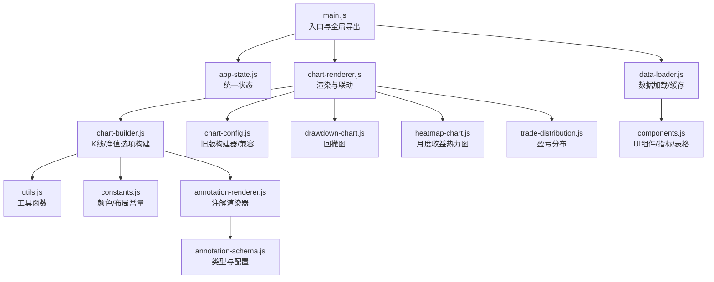
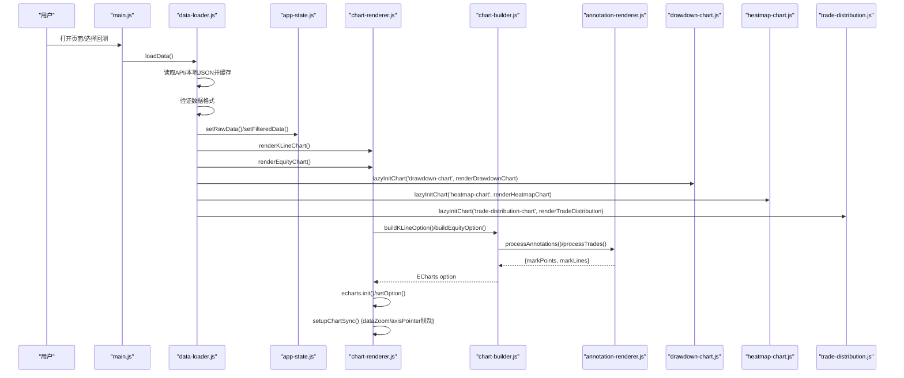
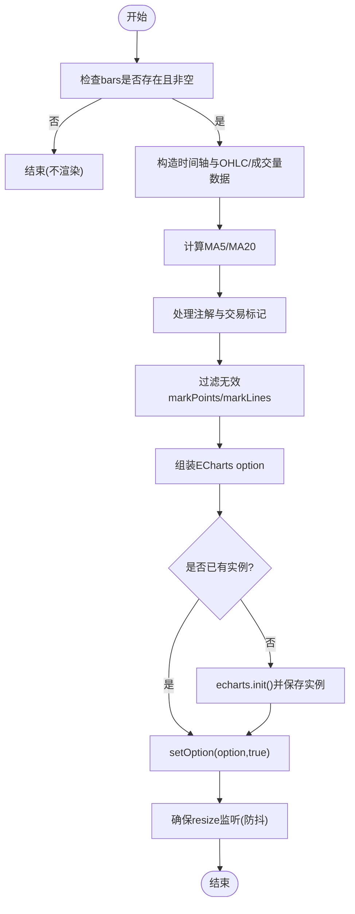
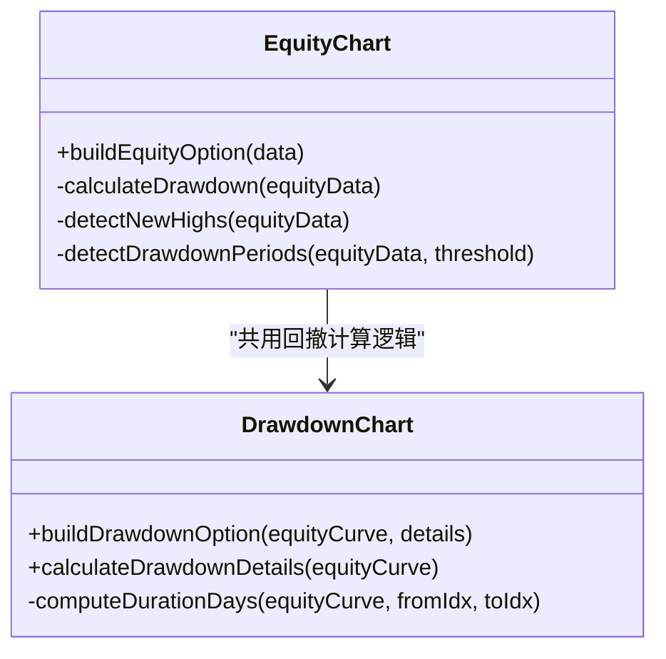
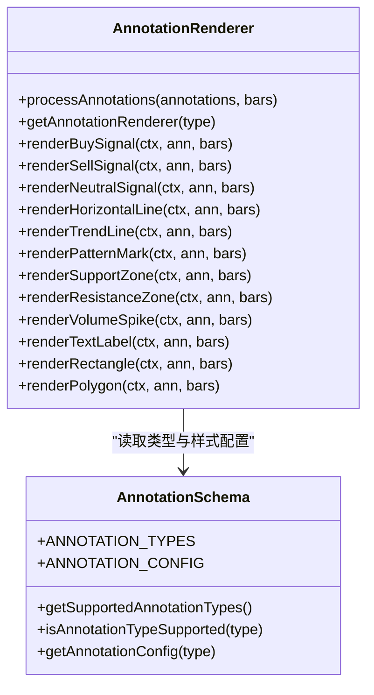
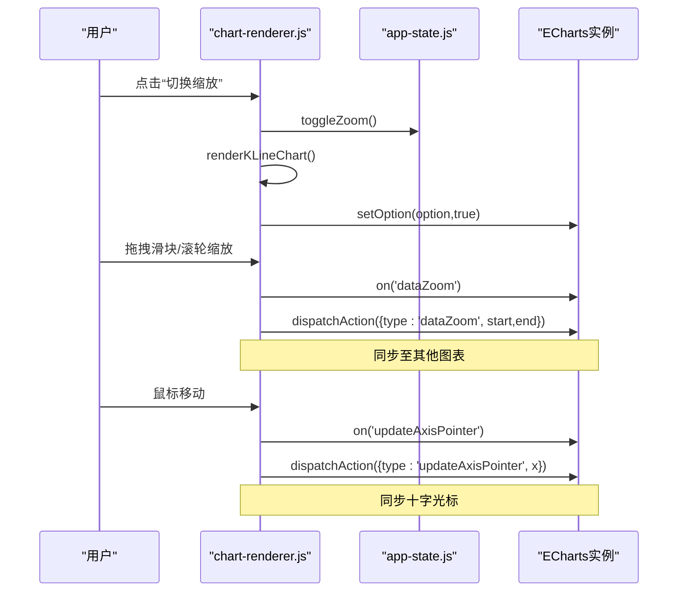
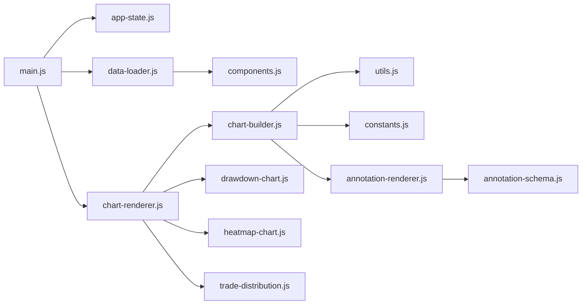

# 图表渲染引擎

<cite>
**本文引用的文件**   
- [chart-renderer.js](file://src/caisen/frontend/src/js/chart-renderer.js)
- [chart-builder.js](file://src/caisen/frontend/src/js/chart-builder.js)
- [chart-config.js](file://src/caisen/frontend/src/js/chart-config.js)
- [annotation-renderer.js](file://src/caisen/frontend/src/js/annotation-renderer.js)
- [drawdown-chart.js](file://src/caisen/frontend/src/js/drawdown-chart.js)
- [app-state.js](file://src/caisen/frontend/src/js/app-state.js)
- [annotation-schema.js](file://src/caisen/frontend/src/js/annotation-schema.js)
- [constants.js](file://src/caisen/frontend/src/js/constants.js)
- [utils.js](file://src/caisen/frontend/src/js/utils.js)
- [main.js](file://src/caisen/frontend/src/js/main.js)
- [data-loader.js](file://src/caisen/frontend/src/js/data-loader.js)
- [components.js](file://src/caisen/frontend/src/js/components.js)
- [heatmap-chart.js](file://src/caisen/frontend/src/js/heatmap-chart.js)
- [trade-distribution.js](file://src/caisen/frontend/src/js/trade-distribution.js)
- [version-compare.js](file://src/caisen/frontend/src/js/version-compare.js)
</cite>

## 目录
1. [简介](#简介)
2. [项目结构](#项目结构)
3. [核心组件](#核心组件)
4. [架构总览](#架构总览)
5. [详细组件分析](#详细组件分析)
6. [依赖关系分析](#依赖关系分析)
7. [性能考量](#性能考量)
8. [故障排查指南](#故障排查指南)
9. [结论](#结论)
10. [附录：自定义开发指南](#附录自定义开发指南)

## 简介
本技术文档面向 Caisen 图表渲染引擎，聚焦基于 ECharts 的前端可视化实现。内容覆盖：
- 图表实例管理、配置对象生成与数据绑定机制
- K 线图绘制（OHLC 数据处理、蜡烛图样式、成交量叠加、均线指标）
- 净值曲线渲染（时间序列处理、多账户对比扩展点、动态更新）
- 交易标注系统（买卖点标记、形态识别展示、自定义标注类型）
- 交互功能（缩放平移、数据筛选、指标切换、响应式适配）
- 自定义图表组件开发（新指标、主题定制、性能优化）
- 错误处理与降级方案

## 项目结构
前端可视化模块采用模块化组织，职责清晰：
- 应用入口与全局导出：main.js
- 状态管理：app-state.js
- 数据加载与缓存：data-loader.js
- 图表构建器（ECharts option 生成）：chart-builder.js、chart-config.js
- 图表渲染与联动：chart-renderer.js
- 注解渲染与类型定义：annotation-renderer.js、annotation-schema.js
- 辅助工具与常量：utils.js、constants.js
- 独立图表：回撤图 drawdown-chart.js、热力图 heatmap-chart.js、盈亏分布 trade-distribution.js、版本对比 version-compare.js
- UI 组件与指标面板：components.js

图示来源
- [main.js:1-96](file://src/caisen/frontend/src/js/main.js#L1-L96)
- [app-state.js:1-79](file://src/caisen/frontend/src/js/app-state.js#L1-L79)
- [data-loader.js:1-286](file://src/caisen/frontend/src/js/data-loader.js#L1-L286)
- [chart-renderer.js:1-333](file://src/caisen/frontend/src/js/chart-renderer.js#L1-L333)
- [chart-builder.js:1-638](file://src/caisen/frontend/src/js/chart-builder.js#L1-L638)
- [chart-config.js:1-653](file://src/caisen/frontend/src/js/chart-config.js#L1-L653)
- [annotation-renderer.js:1-437](file://src/caisen/frontend/src/js/annotation-renderer.js#L1-L437)
- [annotation-schema.js:1-128](file://src/caisen/frontend/src/js/annotation-schema.js#L1-L128)
- [utils.js:1-185](file://src/caisen/frontend/src/js/utils.js#L1-L185)
- [constants.js:1-109](file://src/caisen/frontend/src/js/constants.js#L1-L109)
- [drawdown-chart.js:1-255](file://src/caisen/frontend/src/js/drawdown-chart.js#L1-L255)
- [heatmap-chart.js:1-253](file://src/caisen/frontend/src/js/heatmap-chart.js#L1-L253)
- [trade-distribution.js:1-273](file://src/caisen/frontend/src/js/trade-distribution.js#L1-L273)
- [components.js:1-747](file://src/caisen/frontend/src/js/components.js#L1-L747)

章节来源
- [main.js:1-96](file://src/caisen/frontend/src/js/main.js#L1-L96)
- [app-state.js:1-79](file://src/caisen/frontend/src/js/app-state.js#L1-L79)
- [data-loader.js:1-286](file://src/caisen/frontend/src/js/data-loader.js#L1-L286)

## 核心组件
- 应用状态 appState：集中管理所有 ECharts 实例、原始/过滤数据、开关项（缩放、MA、权益可见性）、注解过滤器等，提供 getter/setter/toggle/reset 方法。
- 数据加载 data-loader：负责从 API 或本地 JSON 拉取数据，校验数据结构，写入 appState，触发全量渲染与懒加载非首屏图表，并建立跨图表联动。
- 图表渲染 chart-renderer：封装 K 线与净值图的初始化与 setOption 流程，统一 resize 防抖、懒加载 IntersectionObserver、跨图表 dataZoom 与十字光标同步。
- 图表构建 chart-builder：将过滤后的数据转换为 ECharts option，包含 OHLC、成交量、均线、markPoint/markLine/markArea 等；同时提供净值曲线、回撤计算、新高检测等算法。
- 注解系统 annotation-renderer + annotation-schema：以“类型→渲染器”的注册表模式，将后端/策略产生的标注（买卖信号、支撑阻力、形态、文本、几何图形）转为 markPoints/markLines。
- 辅助工具 utils/constants：数值格式化、坐标有效性校验、日期过滤、主题色与布局常量。
- 独立图表：回撤图、月度收益热力图、交易盈亏分布直方图、版本对比图。
- UI 组件 components：指标卡片、迷你折线、交易列表（含虚拟滚动）、图例与日期输入等。

章节来源
- [app-state.js:1-79](file://src/caisen/frontend/src/js/app-state.js#L1-L79)
- [data-loader.js:1-286](file://src/caisen/frontend/src/js/data-loader.js#L1-L286)
- [chart-renderer.js:1-333](file://src/caisen/frontend/src/js/chart-renderer.js#L1-L333)
- [chart-builder.js:1-638](file://src/caisen/frontend/src/js/chart-builder.js#L1-L638)
- [annotation-renderer.js:1-437](file://src/caisen/frontend/src/js/annotation-renderer.js#L1-L437)
- [annotation-schema.js:1-128](file://src/caisen/frontend/src/js/annotation-schema.js#L1-L128)
- [utils.js:1-185](file://src/caisen/frontend/src/js/utils.js#L1-L185)
- [constants.js:1-109](file://src/caisen/frontend/src/js/constants.js#L1-L109)
- [drawdown-chart.js:1-255](file://src/caisen/frontend/src/js/drawdown-chart.js#L1-L255)
- [heatmap-chart.js:1-253](file://src/caisen/frontend/src/js/heatmap-chart.js#L1-L253)
- [trade-distribution.js:1-273](file://src/caisen/frontend/src/js/trade-distribution.js#L1-L273)
- [components.js:1-747](file://src/caisen/frontend/src/js/components.js#L1-L747)

## 架构总览
整体数据流与控制流如下：

图示来源
- [main.js:1-96](file://src/caisen/frontend/src/js/main.js#L1-L96)
- [data-loader.js:1-286](file://src/caisen/frontend/src/js/data-loader.js#L1-L286)
- [chart-renderer.js:1-333](file://src/caisen/frontend/src/js/chart-renderer.js#L1-L333)
- [chart-builder.js:1-638](file://src/caisen/frontend/src/js/chart-builder.js#L1-L638)
- [annotation-renderer.js:1-437](file://src/caisen/frontend/src/js/annotation-renderer.js#L1-L437)
- [drawdown-chart.js:1-255](file://src/caisen/frontend/src/js/drawdown-chart.js#L1-L255)
- [heatmap-chart.js:1-253](file://src/caisen/frontend/src/js/heatmap-chart.js#L1-L253)
- [trade-distribution.js:1-273](file://src/caisen/frontend/src/js/trade-distribution.js#L1-L273)

## 详细组件分析

### K 线图渲染（OHLC、成交量、均线、标注）
- 数据准备：从 bars 提取 dates、klineData（[open, close, low, high]）、volumes（带涨跌色与透明度）。
- 指标计算：MA5/MA20 滑动平均；在大数据模式下启用 large/sampling 优化。
- 标注融合：通过 processAnnotations 与 processTrades 合并 markPoints/markLines，并进行有效性过滤。
- 选项构建：grid 双区（主图+成交量）、x/y axis、dataZoom（inside/slider 可选）、series（candlestick/bar/line），以及 tooltip/toolbox 等。
- 渲染流程：若已有实例则 setOption(true)，否则 init 后 setOption，统一调用 ensureResizeHandler 进行窗口尺寸自适应。

图示来源
- [chart-renderer.js:95-137](file://src/caisen/frontend/src/js/chart-renderer.js#L95-L137)
- [chart-builder.js:116-171](file://src/caisen/frontend/src/js/chart-builder.js#L116-L171)
- [chart-builder.js:273-335](file://src/caisen/frontend/src/js/chart-builder.js#L273-L335)
- [chart-config.js:21-114](file://src/caisen/frontend/src/js/chart-config.js#L21-L114)
- [annotation-renderer.js:15-36](file://src/caisen/frontend/src/js/annotation-renderer.js#L15-L36)
- [utils.js:93-117](file://src/caisen/frontend/src/js/utils.js#L93-L117)

章节来源
- [chart-renderer.js:95-137](file://src/caisen/frontend/src/js/chart-renderer.js#L95-L137)
- [chart-builder.js:116-171](file://src/caisen/frontend/src/js/chart-builder.js#L116-L171)
- [chart-builder.js:273-335](file://src/caisen/frontend/src/js/chart-builder.js#L273-L335)
- [chart-config.js:21-114](file://src/caisen/frontend/src/js/chart-config.js#L21-L114)
- [annotation-renderer.js:15-36](file://src/caisen/frontend/src/js/annotation-renderer.js#L15-L36)
- [utils.js:93-117](file://src/caisen/frontend/src/js/utils.js#L93-L117)

### 净值曲线与回撤图
- 净值曲线：从 equity_curve 抽取净值序列与时间轴，计算回撤序列、新高点、深度回撤区间（阈值默认 5%），并以 markLine/markPoint/markArea 高亮基准线与回撤段。
- 回撤图：独立区域图，计算最大回撤起止索引、恢复点与持续天数，使用 markArea 高亮最大回撤区间，并在底部/恢复点添加标记。
- 联动：与 K 线/净值图共享 dataZoom 与 axisPointer 同步。

图示来源
- [chart-builder.js:368-429](file://src/caisen/frontend/src/js/chart-builder.js#L368-L429)
- [chart-builder.js:431-560](file://src/caisen/frontend/src/js/chart-builder.js#L431-L560)
- [drawdown-chart.js:12-86](file://src/caisen/frontend/src/js/drawdown-chart.js#L12-L86)
- [drawdown-chart.js:91-228](file://src/caisen/frontend/src/js/drawdown-chart.js#L91-L228)

章节来源
- [chart-builder.js:368-429](file://src/caisen/frontend/src/js/chart-builder.js#L368-L429)
- [chart-builder.js:431-560](file://src/caisen/frontend/src/js/chart-builder.js#L431-L560)
- [drawdown-chart.js:12-86](file://src/caisen/frontend/src/js/drawdown-chart.js#L12-L86)
- [drawdown-chart.js:91-228](file://src/caisen/frontend/src/js/drawdown-chart.js#L91-L228)

### 交易标注系统（买卖点、形态、自定义类型）
- 类型注册：annotation-schema.js 定义 ANNOTATION_TYPES 与 ANNOTATION_CONFIG，作为单一真相源。
- 渲染器：annotation-renderer.js 根据 type 分发到具体渲染函数，产出 markPoints/markLines。
- 支持类型：买入/卖出/中性信号、水平线、趋势线、支撑/阻力区、形态标记（含领口线）、文本标签、矩形、多边形、放量尖峰占位等。
- 交易标记：processTrades 将成交记录映射为买卖点标记。

图示来源
- [annotation-schema.js:1-128](file://src/caisen/frontend/src/js/annotation-schema.js#L1-L128)
- [annotation-renderer.js:15-59](file://src/caisen/frontend/src/js/annotation-renderer.js#L15-L59)
- [annotation-renderer.js:77-437](file://src/caisen/frontend/src/js/annotation-renderer.js#L77-L437)
- [chart-config.js:268-347](file://src/caisen/frontend/src/js/chart-config.js#L268-L347)

章节来源
- [annotation-schema.js:1-128](file://src/caisen/frontend/src/js/annotation-schema.js#L1-L128)
- [annotation-renderer.js:15-59](file://src/caisen/frontend/src/js/annotation-renderer.js#L15-L59)
- [annotation-renderer.js:77-437](file://src/caisen/frontend/src/js/annotation-renderer.js#L77-L437)
- [chart-config.js:268-347](file://src/caisen/frontend/src/js/chart-config.js#L268-L347)

### 交互功能（缩放、联动、筛选、响应式）
- 缩放与重置：toggleZoom/resetZoom 控制 inside/slider 与 dispatchAction 重置。
- 联动：setupChartSync 对 K 线/净值/回撤三图建立 dataZoom 与 updateAxisPointer 双向同步，避免重复绑定（WeakSet）。
- 筛选：applyDateFilter 按起止日期过滤 bars/equity/trades/annotations，并刷新各图表与图例。
- 响应式：ensureResizeHandler 统一防抖 resize，lazyInitChart 使用 IntersectionObserver 延迟初始化非首屏图表。

图示来源
- [chart-renderer.js:202-224](file://src/caisen/frontend/src/js/chart-renderer.js#L202-L224)
- [chart-renderer.js:254-332](file://src/caisen/frontend/src/js/chart-renderer.js#L254-L332)
- [data-loader.js:250-286](file://src/caisen/frontend/src/js/data-loader.js#L250-L286)
- [chart-renderer.js:42-46](file://src/caisen/frontend/src/js/chart-renderer.js#L42-L46)
- [chart-renderer.js:59-90](file://src/caisen/frontend/src/js/chart-renderer.js#L59-L90)

章节来源
- [chart-renderer.js:202-224](file://src/caisen/frontend/src/js/chart-renderer.js#L202-L224)
- [chart-renderer.js:254-332](file://src/caisen/frontend/src/js/chart-renderer.js#L254-L332)
- [data-loader.js:250-286](file://src/caisen/frontend/src/js/data-loader.js#L250-L286)
- [chart-renderer.js:42-46](file://src/caisen/frontend/src/js/chart-renderer.js#L42-L46)
- [chart-renderer.js:59-90](file://src/caisen/frontend/src/js/chart-renderer.js#L59-L90)

### 其他图表（热力图、盈亏分布、版本对比）
- 月度收益热力图：从 equity_curve 聚合月收益，构建矩阵并附加年度均值列与月度均值行，visualMap 三段渐变配色。
- 交易盈亏分布：配对买卖计算收益率，分桶统计直方图，叠加正态拟合曲线，标注均值/中位数。
- 版本对比：同一策略多版本关键指标对比，双轴设计（百分比/比率），自动 resize 与 dispose。

章节来源
- [heatmap-chart.js:15-105](file://src/caisen/frontend/src/js/heatmap-chart.js#L15-L105)
- [heatmap-chart.js:110-229](file://src/caisen/frontend/src/js/heatmap-chart.js#L110-L229)
- [trade-distribution.js:11-102](file://src/caisen/frontend/src/js/trade-distribution.js#L11-L102)
- [trade-distribution.js:107-246](file://src/caisen/frontend/src/js/trade-distribution.js#L107-L246)
- [version-compare.js:51-148](file://src/caisen/frontend/src/js/version-compare.js#L51-L148)
- [version-compare.js:153-192](file://src/caisen/frontend/src/js/version-compare.js#L153-L192)

## 依赖关系分析
- 低耦合：渲染层仅消费 appState 提供的数据与实例，构建层专注 option 拼装，注解渲染器通过类型注册表解耦。
- 直接依赖：
  - chart-renderer → chart-builder、app-state、constants
  - chart-builder → utils、constants、annotation-renderer（通过 re-export）
  - data-loader → app-state、chart-renderer、components、annotation-filter
  - drawdown/heatmap/trade-distribution → app-state、各自构建函数
- 潜在循环：无显式循环依赖；main.js 作为装配层导入各模块。

图示来源
- [main.js:1-96](file://src/caisen/frontend/src/js/main.js#L1-L96)
- [chart-renderer.js:1-333](file://src/caisen/frontend/src/js/chart-renderer.js#L1-L333)
- [chart-builder.js:1-638](file://src/caisen/frontend/src/js/chart-builder.js#L1-L638)
- [annotation-renderer.js:1-437](file://src/caisen/frontend/src/js/annotation-renderer.js#L1-L437)
- [annotation-schema.js:1-128](file://src/caisen/frontend/src/js/annotation-schema.js#L1-L128)
- [data-loader.js:1-286](file://src/caisen/frontend/src/js/data-loader.js#L1-L286)
- [components.js:1-747](file://src/caisen/frontend/src/js/components.js#L1-L747)
- [drawdown-chart.js:1-255](file://src/caisen/frontend/src/js/drawdown-chart.js#L1-L255)
- [heatmap-chart.js:1-253](file://src/caisen/frontend/src/js/heatmap-chart.js#L1-L253)
- [trade-distribution.js:1-273](file://src/caisen/frontend/src/js/trade-distribution.js#L1-L273)

## 性能考量
- 大数据模式：当 bars > 5000 或 > 10000 时，启用 large/largeThreshold 与 sampling='lttb'，减少渲染压力。
- 防抖 resize：统一 250ms 防抖，避免频繁重绘。
- 懒加载：IntersectionObserver 延迟初始化非首屏图表，降低首屏开销。
- 标记点裁剪：超大集合限制 markPoints 数量（如前 100），避免过多 DOM/SVG 节点。
- 虚拟滚动：交易列表超过阈值时使用虚拟滚动，提升长列表性能。
- 缓存：data-loader 维护内存缓存，避免重复请求。

章节来源
- [chart-builder.js:144-151](file://src/caisen/frontend/src/js/chart-builder.js#L144-L151)
- [chart-builder.js:273-335](file://src/caisen/frontend/src/js/chart-builder.js#L273-L335)
- [chart-renderer.js:30-46](file://src/caisen/frontend/src/js/chart-renderer.js#L30-L46)
- [chart-renderer.js:59-90](file://src/caisen/frontend/src/js/chart-renderer.js#L59-L90)
- [components.js:559-636](file://src/caisen/frontend/src/js/components.js#L559-L636)
- [data-loader.js:17-210](file://src/caisen/frontend/src/js/data-loader.js#L17-L210)

## 故障排查指南
- 数据不可用：data-loader 内置 validateVisualizationData，缺失字段或缺失 bars 时会显示友好提示并隐藏图表区域。
- 渲染异常降级：chart-renderer.handleChartError 捕获 setOption 失败，尝试移除 markPoint/markLine 后重试；若仍失败，输出错误日志。
- 全局错误捕获：main.js 注册 window.onerror 与 unhandledrejection，统一输出调试信息。
- 常见定位步骤：
  - 确认 bars/equity_curve 存在且字段完整
  - 检查注解 timestamp 与 bars 匹配（模糊匹配容差 1 小时）
  - 查看控制台 DEBUG_CONFIG 日志定位断点
  - 确认容器 ID 存在（如 kline-chart、equity-chart、drawdown-chart 等）

章节来源
- [data-loader.js:119-170](file://src/caisen/frontend/src/js/data-loader.js#L119-L170)
- [chart-renderer.js:179-197](file://src/caisen/frontend/src/js/chart-renderer.js#L179-L197)
- [main.js:37-47](file://src/caisen/frontend/src/js/main.js#L37-L47)
- [utils.js:140-155](file://src/caisen/frontend/src/js/utils.js#L140-L155)

## 结论
该渲染引擎以清晰的模块化分层与 ECharts 原生能力结合，实现了高性能、可扩展的金融可视化体验。通过统一的注解系统与类型注册表，新增标注类型与指标的成本极低；通过联动与懒加载、大数据优化，兼顾了交互性与性能。建议在后续迭代中继续完善多账户对比与实时推送能力，并引入更完善的单元测试与覆盖率保障。

## 附录：自定义开发指南

### 新增指标（例如 MACD/RSI）
- 在 chart-builder.js 中新增计算函数（参考 calculateMA），返回与 bars 等长的数组（缺失值用 null）。
- 在 buildSeriesConfig 中按需追加 line series，设置 xAxisIndex/yAxisIndex、smooth、symbol、lineStyle 等。
- 如需 legend 控制，调整 buildKLineLegendConfig 与 showMA 开关逻辑。
- 在 tooltip formatter 中补充对应 seriesName 的展示。

章节来源
- [chart-builder.js:20-37](file://src/caisen/frontend/src/js/chart-builder.js#L20-L37)
- [chart-builder.js:303-335](file://src/caisen/frontend/src/js/chart-builder.js#L303-L335)
- [chart-builder.js:195-210](file://src/caisen/frontend/src/js/chart-builder.js#L195-L210)
- [chart-builder.js:569-633](file://src/caisen/frontend/src/js/chart-builder.js#L569-L633)

### 新增注解类型
- 在 annotation-schema.js 的 ANNOTATION_TYPES 与 ANNOTATION_CONFIG 中添加新类型与默认样式。
- 在 annotation-renderer.js 的 getAnnotationRenderer 注册表中增加映射，并实现对应渲染函数（产出 markPoints/markLines）。
- 若需要过滤面板支持，可在 annotation-filter.js 中扩展分组与 label。

章节来源
- [annotation-schema.js:8-102](file://src/caisen/frontend/src/js/annotation-schema.js#L8-L102)
- [annotation-renderer.js:43-59](file://src/caisen/frontend/src/js/annotation-renderer.js#L43-L59)
- [annotation-renderer.js:77-437](file://src/caisen/frontend/src/js/annotation-renderer.js#L77-L437)
- [annotation-filter.js:60-130](file://src/caisen/frontend/src/js/annotation-filter.js#L60-L130)

### 主题与样式定制
- 修改 constants.js 中的 CHART_COLORS 与 PATTERN_COLORS，即可全局生效。
- 针对特定图表可局部覆盖 itemStyle/lineStyle/areaStyle 等属性。

章节来源
- [constants.js:54-64](file://src/caisen/frontend/src/js/constants.js#L54-L64)
- [constants.js:34-49](file://src/caisen/frontend/src/js/constants.js#L34-L49)

### 性能优化技巧
- 大数据场景开启 large/sampling，限制 markPoints/markLines 数量。
- 使用懒加载 IntersectionObserver 延迟非首屏图表。
- 统一防抖 resize，避免频繁重绘。
- 列表类视图使用虚拟滚动。

章节来源
- [chart-builder.js:144-151](file://src/caisen/frontend/src/js/chart-builder.js#L144-L151)
- [chart-renderer.js:59-90](file://src/caisen/frontend/src/js/chart-renderer.js#L59-L90)
- [chart-renderer.js:30-46](file://src/caisen/frontend/src/js/chart-renderer.js#L30-L46)
- [components.js:559-636](file://src/caisen/frontend/src/js/components.js#L559-L636)

### 多账户对比与动态更新（扩展建议）
- 多账户对比：在 buildEquityOption 中接收多组 equity_curve，分别生成 series，并通过 legend 控制显示；tooltip 中聚合展示。
- 动态更新：在数据增量到达时，复用现有实例，仅 setOption 变更部分（如 series.data），避免重建实例；必要时使用 appendData（视 ECharts 版本与需求）。

章节来源
- [chart-builder.js:368-429](file://src/caisen/frontend/src/js/chart-builder.js#L368-L429)
- [chart-renderer.js:115-133](file://src/caisen/frontend/src/js/chart-renderer.js#L115-L133)