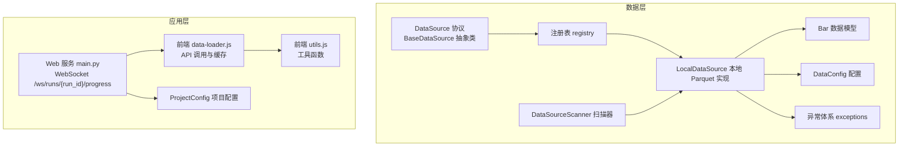
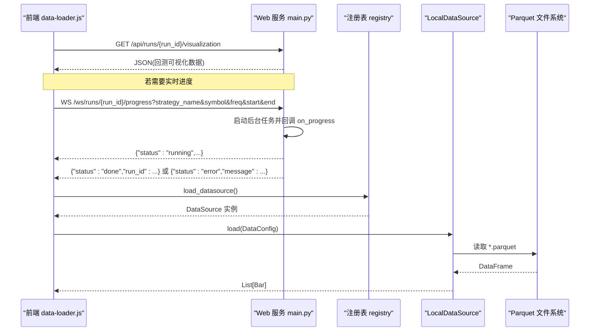
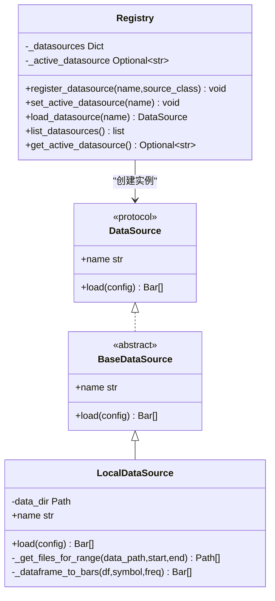
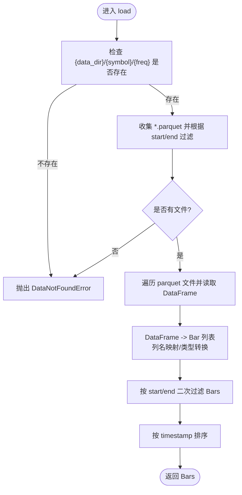
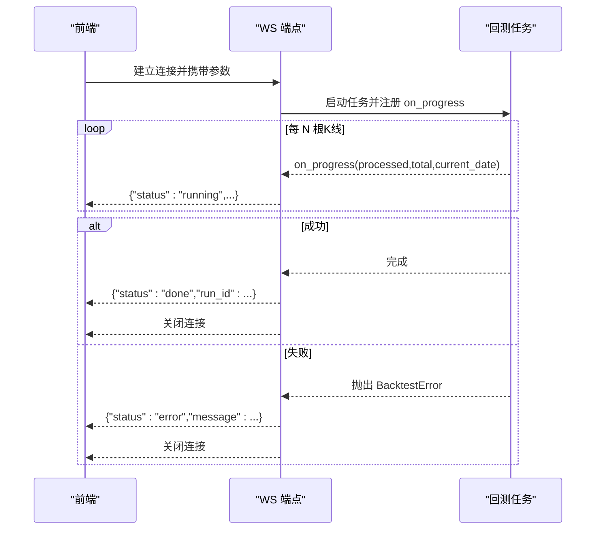
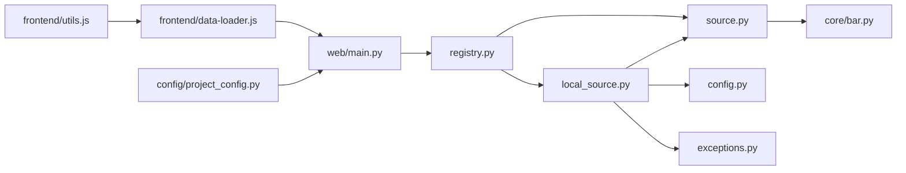

# 数据加载与处理

<cite>
**本文引用的文件**   
- [src/caisen/data/__init__.py](file://src/caisen/data/__init__.py)
- [src/caisen/data/source.py](file://src/caisen/data/source.py)
- [src/caisen/data/local_source.py](file://src/caisen/data/local_source.py)
- [src/caisen/data/config.py](file://src/caisen/data/config.py)
- [src/caisen/data/registry.py](file://src/caisen/data/registry.py)
- [src/caisen/data/exceptions.py](file://src/caisen/data/exceptions.py)
- [src/caisen/data/scanner.py](file://src/caisen/data/scanner.py)
- [src/caisen/core/bar.py](file://src/caisen/core/bar.py)
- [src/caisen/web/main.py](file://src/caisen/web/main.py)
- [tests/test_websocket_progress.py](file://tests/test_websocket_progress.py)
- [src/caisen/frontend/src/js/data-loader.js](file://src/caisen/frontend/src/js/data-loader.js)
- [src/caisen/frontend/src/js/utils.js](file://src/caisen/frontend/src/js/utils.js)
- [src/caisen/config/project_config.py](file://src/caisen/config/project_config.py)
</cite>

## 目录
1. [简介](#简介)
2. [项目结构](#项目结构)
3. [核心组件](#核心组件)
4. [架构总览](#架构总览)
5. [详细组件分析](#详细组件分析)
6. [依赖关系分析](#依赖关系分析)
7. [性能考量](#性能考量)
8. [故障排查指南](#故障排查指南)
9. [结论](#结论)
10. [附录](#附录)

## 简介
本技术文档聚焦 Caisen 的数据加载与处理模块，围绕以下目标展开：
- 数据获取机制：封装数据源接口、注册与选择、本地 Parquet 读取、日期范围过滤与列名兼容。
- 数据处理流程：格式转换（DataFrame → Bar）、校验与清洗、内存友好处理、缓存策略与增量更新思路。
- WebSocket 通信：连接管理、进度推送、错误上报与断线重连建议。
- 数据验证与清洗：字段校验、异常类型体系、标准化输出。
- 工具函数库：前端可视化侧的数值格式化、时间戳处理、坐标与标注过滤等。
- 扩展指南：新增数据源接入、自定义处理器开发、性能优化技巧。
- 调试与监控：日志与错误提示、测试覆盖要点。

## 项目结构
数据相关代码主要位于 src/caisen/data 下，配合 core.bar 作为统一数据模型，web.main 提供 WebSocket 实时推送能力，前端 data-loader.js 负责可视化数据的加载与缓存。

图表来源
- [src/caisen/data/source.py:10-62](file://src/caisen/data/source.py#L10-L62)
- [src/caisen/data/registry.py:1-108](file://src/caisen/data/registry.py#L1-L108)
- [src/caisen/data/local_source.py:15-199](file://src/caisen/data/local_source.py#L15-L199)
- [src/caisen/data/config.py:1-51](file://src/caisen/data/config.py#L1-L51)
- [src/caisen/data/exceptions.py:1-47](file://src/caisen/data/exceptions.py#L1-L47)
- [src/caisen/core/bar.py:1-38](file://src/caisen/core/bar.py#L1-L38)
- [src/caisen/data/scanner.py:1-53](file://src/caisen/data/scanner.py#L1-L53)
- [src/caisen/web/main.py:247-271](file://src/caisen/web/main.py#L247-L271)
- [src/caisen/frontend/src/js/data-loader.js:1-286](file://src/caisen/frontend/src/js/data-loader.js#L1-L286)
- [src/caisen/frontend/src/js/utils.js:1-185](file://src/caisen/frontend/src/js/utils.js#L1-L185)
- [src/caisen/config/project_config.py:1-56](file://src/caisen/config/project_config.py#L1-L56)

章节来源
- [src/caisen/data/__init__.py:1-49](file://src/caisen/data/__init__.py#L1-L49)
- [src/caisen/data/source.py:1-62](file://src/caisen/data/source.py#L1-L62)
- [src/caisen/data/local_source.py:1-199](file://src/caisen/data/local_source.py#L1-L199)
- [src/caisen/data/config.py:1-51](file://src/caisen/data/config.py#L1-L51)
- [src/caisen/data/registry.py:1-108](file://src/caisen/data/registry.py#L1-L108)
- [src/caisen/data/exceptions.py:1-47](file://src/caisen/data/exceptions.py#L1-L47)
- [src/caisen/data/scanner.py:1-53](file://src/caisen/data/scanner.py#L1-L53)
- [src/caisen/core/bar.py:1-38](file://src/caisen/core/bar.py#L1-L38)
- [src/caisen/web/main.py:247-271](file://src/caisen/web/main.py#L247-L271)
- [src/caisen/frontend/src/js/data-loader.js:1-286](file://src/caisen/frontend/src/js/data-loader.js#L1-L286)
- [src/caisen/frontend/src/js/utils.js:1-185](file://src/caisen/frontend/src/js/utils.js#L1-L185)
- [src/caisen/config/project_config.py:1-56](file://src/caisen/config/project_config.py#L1-L56)

## 核心组件
- 数据源协议与基类
  - DataSource 协议定义了 load(config) 与 name 属性，用于统一数据源接入。
  - BaseDataSource 提供抽象方法与默认 name 实现，便于继承扩展。
- 本地数据源 LocalDataSource
  - 从 {data_dir}/{symbol}/{freq}/*.parquet 读取数据，支持单日或区间命名模式。
  - 将 DataFrame 转换为 Bar 列表，自动映射中英文列名，按 timestamp 排序返回。
  - 根据 start/end 进行二次过滤，确保结果在指定范围内。
- 配置 DataConfig
  - 包含 symbol、freq、start、end、data_dir 等字段，并在构造时校验 freq 是否受支持。
  - 提供 data_path 与 to_dict 辅助方法。
- 注册表 registry
  - 线程安全地维护数据源名称到类的映射，支持设置活跃数据源、动态注册与查询。
  - 未显式指定时默认使用 local。
- 异常体系 exceptions
  - 定义 DataLoadError 及其子类：DataNotFoundError、DataSourceNotAvailableError、InvalidDateRangeError、DataValidationError。
- 扫描器 scanner
  - 不读文件内容，仅通过文件名推断可用 symbol/freq/date_range，便于快速发现数据。
- 数据模型 Bar
  - 标准 K 线数据结构，提供 to_dict/from_dict 序列化/反序列化。

章节来源
- [src/caisen/data/source.py:10-62](file://src/caisen/data/source.py#L10-L62)
- [src/caisen/data/local_source.py:15-199](file://src/caisen/data/local_source.py#L15-L199)
- [src/caisen/data/config.py:1-51](file://src/caisen/data/config.py#L1-L51)
- [src/caisen/data/registry.py:1-108](file://src/caisen/data/registry.py#L1-L108)
- [src/caisen/data/exceptions.py:1-47](file://src/caisen/data/exceptions.py#L1-L47)
- [src/caisen/data/scanner.py:1-53](file://src/caisen/data/scanner.py#L1-L53)
- [src/caisen/core/bar.py:1-38](file://src/caisen/core/bar.py#L1-L38)

## 架构总览
后端以“协议 + 注册表 + 具体实现”的方式解耦数据源；前端通过 REST 与 WebSocket 与后端交互，完成可视化数据的拉取与运行进度推送。

图表来源
- [src/caisen/web/main.py:247-271](file://src/caisen/web/main.py#L247-L271)
- [src/caisen/frontend/src/js/data-loader.js:175-245](file://src/caisen/frontend/src/js/data-loader.js#L175-L245)
- [src/caisen/data/registry.py:67-88](file://src/caisen/data/registry.py#L67-L88)
- [src/caisen/data/local_source.py:39-80](file://src/caisen/data/local_source.py#L39-L80)

## 详细组件分析

### 数据源协议与注册表
- 设计要点
  - 通过 Protocol 约束外部数据源的最小接口，降低耦合。
  - 注册表使用全局字典与锁保证并发安全，支持运行时切换与扩展。
- 关键行为
  - register_datasource(name, source_class)：注册新数据源。
  - set_active_datasource(name)：设置当前活跃数据源。
  - load_datasource(name=None)：优先使用指定名，其次活跃名，最后回退到 local。
  - list_datasources()/get_active_datasource()：枚举与查询。

图表来源
- [src/caisen/data/source.py:10-62](file://src/caisen/data/source.py#L10-L62)
- [src/caisen/data/local_source.py:15-199](file://src/caisen/data/local_source.py#L15-L199)
- [src/caisen/data/registry.py:1-108](file://src/caisen/data/registry.py#L1-L108)

章节来源
- [src/caisen/data/source.py:10-62](file://src/caisen/data/source.py#L10-L62)
- [src/caisen/data/registry.py:1-108](file://src/caisen/data/registry.py#L1-L108)

### 本地数据源 LocalDataSource
- 文件匹配策略
  - 支持两种命名：{YYYYMMDD}.parquet 与 {YYYYMMDD}_{YYYYMMDD}.parquet，以及通用 data.parquet。
  - 当传入 start/end 时，基于字符串比较过滤文件集合，避免读取无关文件。
- 列名兼容与数据转换
  - 支持英文与中文列名映射，缺失必填列抛出 DataValidationError。
  - 将每行转为 Bar 对象，timestamp 统一为 datetime，并按时间排序返回。
- 日期范围二次过滤
  - 在文件级过滤基础上，再对 Bars 做 start/end 精确过滤，确保边界正确。

图表来源
- [src/caisen/data/local_source.py:39-80](file://src/caisen/data/local_source.py#L39-L80)
- [src/caisen/data/local_source.py:82-137](file://src/caisen/data/local_source.py#L82-L137)
- [src/caisen/data/local_source.py:139-199](file://src/caisen/data/local_source.py#L139-L199)

章节来源
- [src/caisen/data/local_source.py:15-199](file://src/caisen/data/local_source.py#L15-L199)

### 配置与数据模型
- DataConfig
  - 校验 freq 是否在 SUPPORTED_FREQS 中，否则抛出 ValueError。
  - 提供 data_path 便捷路径生成与 to_dict 序列化。
- Bar
  - 标准 K 线字段，to_dict/from_dict 支持 ISO 时间串互转。

章节来源
- [src/caisen/data/config.py:1-51](file://src/caisen/data/config.py#L1-L51)
- [src/caisen/core/bar.py:1-38](file://src/caisen/core/bar.py#L1-L38)

### 数据扫描器 DataSourceScanner
- 功能
  - 遍历 data_dir 下的 symbol/freq 目录，基于文件名推断 date_range。
  - 不读取文件内容，适合快速展示可用数据集。
- 适用场景
  - 前端“运行列表”或数据概览面板，提升用户体验。

章节来源
- [src/caisen/data/scanner.py:1-53](file://src/caisen/data/scanner.py#L1-L53)

### WebSocket 通信（进度推送）
- 端点
  - /ws/runs/{run_id}/progress：连接后在后台执行回测，周期性推送 running 消息，完成后推送 done 或 error。
- 消息协议
  - running：包含 processed、total、current_date。
  - done：包含 run_id。
  - error：包含 message。
- 客户端行为
  - 前端 tests 中验证了收到 running/done/error 消息及连接关闭行为。

图表来源
- [src/caisen/web/main.py:247-271](file://src/caisen/web/main.py#L247-L271)
- [tests/test_websocket_progress.py:48-129](file://tests/test_websocket_progress.py#L48-L129)

章节来源
- [src/caisen/web/main.py:247-271](file://src/caisen/web/main.py#L247-L271)
- [tests/test_websocket_progress.py:48-129](file://tests/test_websocket_progress.py#L48-L129)

### 前端数据加载与缓存
- 数据来源
  - 若 URL 含 run_id，则请求 /api/runs/{run_id}/visualization；否则回退到本地 data.json。
- 缓存策略
  - 内存 Map 缓存 runId -> rawData，避免重复网络请求。
- 数据校验
  - validateVisualizationData 检查 bars 数组与必要字段，失败则显示友好错误界面。
- 渲染流程
  - 设置 appState 原始与过滤数据，触发各图表渲染与联动同步。

章节来源
- [src/caisen/frontend/src/js/data-loader.js:175-245](file://src/caisen/frontend/src/js/data-loader.js#L175-L245)
- [src/caisen/frontend/src/js/data-loader.js:119-170](file://src/caisen/frontend/src/js/data-loader.js#L119-L170)

### 工具函数库（前端）
- 数值格式化 formatValue：百分比/货币/比率三种模式，非有限数特殊处理。
- 时间戳格式化 formatTimestamp：本地化显示。
- 年化收益 calculateAnnualReturn：基于 equity_curve 与 meta.freq 估算年化处理。
- 数值与坐标校验 isFiniteNum、isValidCoordPoint、isValidCoord。
- 标注过滤 filterValidMarkPoints/filterValidMarkLines：保障渲染稳定性。
- 时间筛选 applyDateFilterToData：深拷贝后按起止时间过滤 bars/trades/annotations 等。

章节来源
- [src/caisen/frontend/src/js/utils.js:1-185](file://src/caisen/frontend/src/js/utils.js#L1-L185)

## 依赖关系分析
- 模块内聚与耦合
  - data.source 定义最小契约，local_source 强依赖 pandas 与 Bar 模型，registry 集中管理实例化。
  - web.main 与前端 data-loader.js 通过 REST/WS 松耦合交互。
- 外部依赖
  - pandas（Parquet 读写）、PyYAML（项目配置）。
- 潜在循环依赖
  - 未发现直接循环导入；注意在大型扩展中保持 registry 与具体实现的单向依赖。

图表来源
- [src/caisen/data/source.py:1-62](file://src/caisen/data/source.py#L1-L62)
- [src/caisen/data/local_source.py:1-199](file://src/caisen/data/local_source.py#L1-L199)
- [src/caisen/data/config.py:1-51](file://src/caisen/data/config.py#L1-L51)
- [src/caisen/data/exceptions.py:1-47](file://src/caisen/data/exceptions.py#L1-L47)
- [src/caisen/data/registry.py:1-108](file://src/caisen/data/registry.py#L1-L108)
- [src/caisen/web/main.py:247-271](file://src/caisen/web/main.py#L247-L271)
- [src/caisen/frontend/src/js/data-loader.js:1-286](file://src/caisen/frontend/src/js/data-loader.js#L1-L286)
- [src/caisen/frontend/src/js/utils.js:1-185](file://src/caisen/frontend/src/js/utils.js#L1-L185)
- [src/caisen/config/project_config.py:1-56](file://src/caisen/config/project_config.py#L1-L56)

章节来源
- [src/caisen/data/registry.py:1-108](file://src/caisen/data/registry.py#L1-L108)
- [src/caisen/data/local_source.py:1-199](file://src/caisen/data/local_source.py#L1-L199)
- [src/caisen/web/main.py:247-271](file://src/caisen/web/main.py#L247-L271)
- [src/caisen/frontend/src/js/data-loader.js:1-286](file://src/caisen/frontend/src/js/data-loader.js#L1-L286)

## 性能考量
- I/O 与内存
  - 文件级过滤减少不必要的磁盘读取；逐文件读取并合并 Bars，避免一次性加载全量数据。
  - 建议在大数据集上采用分块读取与惰性迭代，以降低峰值内存占用。
- 计算复杂度
  - 列名映射 O(C)，DataFrame→Bar 转换 O(N)，排序 O(N log N)。
- 缓存与增量
  - 前端已实现 runId 级别内存缓存；后端可考虑基于 symbol/freq/start/end 的 LRU 缓存，结合增量更新（如只追加最新分区）。
- 并发与锁
  - 注册表使用细粒度锁保护全局状态，避免竞态条件。

## 故障排查指南
- 常见异常
  - DataNotFoundError：无匹配文件或目录不存在。
  - DataValidationError：缺少必填列或列名无法映射。
  - DataSourceNotAvailableError：未注册或未找到数据源。
  - InvalidDateRangeError：日期范围非法。
- 定位步骤
  - 确认 data_dir/symbol/freq 路径与文件名是否符合约定。
  - 检查 parquet 列名是否包含 timestamp/open/high/low/close/volume 或其别名。
  - 查看前端控制台错误与后端日志，核对 API 响应与 WS 消息。
- 测试用例参考
  - WebSocket 进度消息与连接关闭行为验证。

章节来源
- [src/caisen/data/exceptions.py:1-47](file://src/caisen/data/exceptions.py#L1-L47)
- [tests/test_websocket_progress.py:48-129](file://tests/test_websocket_progress.py#L48-L129)

## 结论
Caisen 的数据加载与处理模块通过清晰的协议与注册表实现了可扩展的数据源接入；本地 Parquet 实现兼顾易用性与兼容性；前后端通过 REST/WS 协作完成可视化与实时反馈。后续可在后端引入更完善的缓存与增量更新机制，进一步提升大规模数据场景下的性能与稳定性。

## 附录

### 扩展指南
- 新增数据源接入
  - 实现 DataSource 协议或继承 BaseDataSource，注册至 registry。
  - 遵循统一的 Bar 结构与异常体系，确保上层无需感知差异。
- 自定义处理器开发
  - 在 LocalDataSource 的基础上派生，增加压缩、去重、对齐等逻辑。
  - 利用 DataConfig 传递额外参数，保持接口稳定。
- 性能优化技巧
  - 使用分区与列裁剪减少 I/O；对高频访问数据引入 LRU 缓存；按需懒加载与分页。
- 调试与监控
  - 在前端启用 DEBUG_CONFIG 日志；在后端记录关键路径耗时与异常堆栈；为 WS 消息添加追踪 ID。