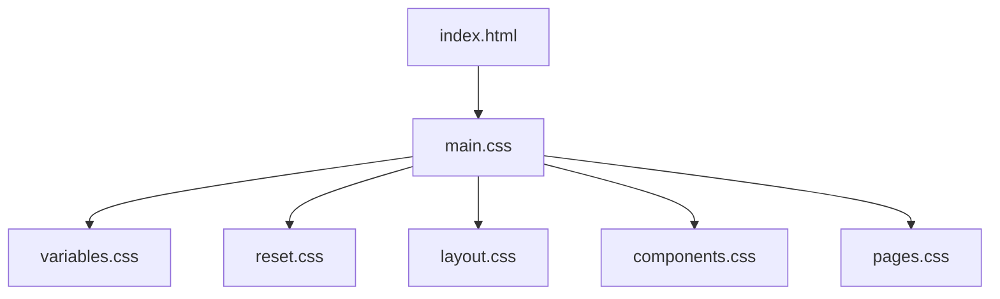
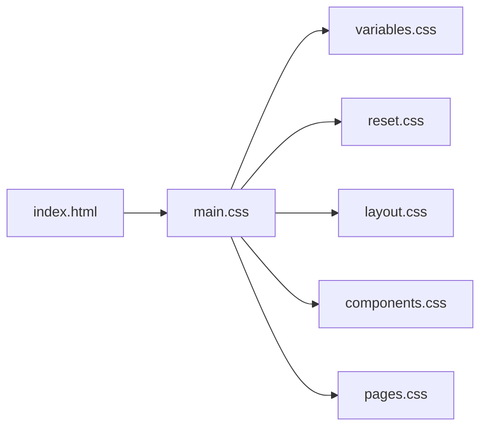

# 样式系统

<cite>
**本文引用的文件**   
- [main.css](file://src/caisen/frontend/src/css/main.css)
- [variables.css](file://src/caisen/frontend/src/css/variables.css)
- [reset.css](file://src/caisen/frontend/src/css/reset.css)
- [layout.css](file://src/caisen/frontend/src/css/layout.css)
- [components.css](file://src/caisen/frontend/src/css/components.css)
- [pages.css](file://src/caisen/frontend/src/css/pages.css)
- [index.html](file://src/caisen/frontend/index.html)
- [constants.js](file://src/caisen/frontend/src/js/constants.js)
</cite>

## 目录
1. [简介](#简介)
2. [项目结构](#项目结构)
3. [核心组件](#核心组件)
4. [架构总览](#架构总览)
5. [详细组件分析](#详细组件分析)
6. [依赖关系分析](#依赖关系分析)
7. [性能考量](#性能考量)
8. [故障排查指南](#故障排查指南)
9. [结论](#结论)
10. [附录](#附录)

## 简介
本文件为 Caisen 前端样式系统的技术文档，聚焦于 CSS 架构设计、变量体系、组件与布局组织、响应式策略、主题与动画机制，以及开发实践与性能优化建议。目标是帮助开发者快速理解并高效扩展样式系统，同时保证一致性与可维护性。

## 项目结构
样式系统采用模块化组织方式，通过入口文件统一导入各模块：
- 入口文件 main.css 负责按顺序引入变量、重置、布局、组件与页面样式。
- variables.css 集中定义全局 CSS 变量（颜色、字体、间距、圆角、阴影、过渡、层级等）。
- reset.css 提供基础重置、滚动条、无障碍与焦点可见性样式。
- layout.css 定义容器、英雄区、策略分组、对比面板及通用动画。
- components.css 实现卡片、按钮、表格、筛选面板、状态占位等通用 UI 组件。
- pages.css 针对报告页的头部、图表容器、指标网格、交易表等页面级样式。



图示来源
- [index.html:10](file://src/caisen/frontend/index.html#L10)
- [main.css:1-7](file://src/caisen/frontend/src/css/main.css#L1-L7)

章节来源
- [main.css:1-7](file://src/caisen/frontend/src/css/main.css#L1-L7)
- [index.html:10](file://src/caisen/frontend/index.html#L10)

## 核心组件
本节概述样式系统中的关键概念与约定：
- 变量系统：以 :root 下的语义化变量为核心，覆盖背景、边框、文本、语义色、渐变、玻璃态、字号、间距、圆角、阴影、过渡、z-index 等。
- 组件样式：基于 BEM 风格命名（如 .run-card、.card-header、.btn-primary），强调组合与复用。
- 布局系统：使用 Flex/Grid 构建响应式布局，配合统一的间距与容器宽度。
- 主题定制：通过覆盖 :root 变量即可切换主题；组件广泛引用变量，避免硬编码。
- 动画与过渡：统一使用 --transition-* 变量与 @keyframes 动画，支持减少动效偏好。

章节来源
- [variables.css:1-106](file://src/caisen/frontend/src/css/variables.css#L1-L106)
- [components.css:1-120](file://src/caisen/frontend/src/css/components.css#L1-L120)
- [layout.css:1-60](file://src/caisen/frontend/src/css/layout.css#L1-L60)
- [reset.css:1-53](file://src/caisen/frontend/src/css/reset.css#L1-L53)

## 架构总览
样式系统遵循“变量驱动 + 模块分层”的架构：
- 变量层：所有视觉与行为参数集中在 variables.css，确保一致性。
- 基础层：reset.css 提供跨浏览器一致的基线。
- 布局层：layout.css 定义页面骨架与通用区块。
- 组件层：components.css 提供可复用的 UI 构件。
- 页面层：pages.css 针对具体页面进行组合与微调。

```mermaid
classDiagram
class Variables {
"+背景/边框/文本/语义色"
"+渐变/玻璃态"
"+字号/间距/圆角"
"+阴影/过渡/z-index"
}
class Reset {
"+基础重置"
"+滚动条"
"+无障碍/焦点"
}
class Layout {
"+容器/英雄区"
"+策略分组/对比面板"
"+通用动画"
}
class Components {
"+卡片/按钮/表格"
"+筛选面板/状态占位"
}
class Pages {
"+报告页头部/图表容器"
"+指标网格/交易表"
}
Variables <.. Reset : "使用"
Variables <.. Layout : "使用"
Variables <.. Components : "使用"
Variables <.. Pages : "使用"
Reset --> Layout : "作为基线"
Layout --> Components : "组合"
Layout --> Pages : "组合"
```

图示来源
- [variables.css:1-106](file://src/caisen/frontend/src/css/variables.css#L1-L106)
- [reset.css:1-53](file://src/caisen/frontend/src/css/reset.css#L1-L53)
- [layout.css:1-120](file://src/caisen/frontend/src/css/layout.css#L1-L120)
- [components.css:1-120](file://src/caisen/frontend/src/css/components.css#L1-L120)
- [pages.css:1-120](file://src/caisen/frontend/src/css/pages.css#L1-L120)

## 详细组件分析

### 变量系统（CSS 变量管理）
- 颜色主题
  - 背景层次：--bg-primary/--bg-secondary/--bg-tertiary 构成三层深色背景，--bg-card 兼容别名。
  - 边框：--border-subtle/--border-default/--border-strong 与悬停高亮 --border-hover。
  - 文本：--text-primary/--text-secondary/--text-muted 形成三级文本层级。
  - 语义/交易色：--color-up/--color-down/--color-neutral/--color-accent 及其半透明背景用于数据可视化。
  - 状态色：success/warning/danger/info 及其背景，便于错误与提示。
  - 渐变：--gradient-up/--gradient-down/--gradient-primary/--gradient-hero/--gradient-text 用于装饰与强调。
  - 玻璃态：--glass-bg/--glass-bg-strong/--glass-border/--glass-blur 提供毛玻璃效果。
- 字体系统
  - 字号阶梯：--font-size-xs 到 --font-size-3xl，统一排版节奏。
  - 字体族在 reset.css 中设置，优先 Inter，回退系统字体栈。
- 间距规范
  - --spacing-xs 到 --spacing-3xl，贯穿布局与组件内边距。
- 圆角与阴影
  - --radius-sm/md/lg/xl/full 统一圆角。
  - --shadow-xs/md/lg/xl 与发光阴影 --shadow-glow-* 增强层次感。
- 过渡与层级
  - --transition-fast/normal/slow 统一动效时长与缓动。
  - --z-base/sticky/overlay/tooltip 控制堆叠上下文。

主题定制机制
- 通过覆盖 :root 中的变量即可实现主题切换或品牌定制。
- 组件广泛使用 var(--*) 引用变量，避免硬编码，提升可维护性。

章节来源
- [variables.css:1-106](file://src/caisen/frontend/src/css/variables.css#L1-L106)
- [reset.css:12-20](file://src/caisen/frontend/src/css/reset.css#L12-L20)

### 布局系统
- 容器与栅格
  - .container 限制最大宽度并提供统一内边距与纵向间距。
  - 多处使用 Grid/Flex 自适应列数与间距，结合 --spacing-* 保持节奏。
- 英雄区与策略分组
  - .hero 使用渐变背景与装饰线，标题与副标题采用渐变色文字。
  - .strategy-section 与 .compare-panel 提供策略分组与对比面板的布局与交互。
- 响应式断点
  - 使用 @media (max-width: 768px) 对移动端进行适配，调整容器、字号、图表高度与网格列数。

章节来源
- [layout.css:1-120](file://src/caisen/frontend/src/css/layout.css#L1-L120)
- [layout.css:295-303](file://src/caisen/frontend/src/css/layout.css#L295-L303)
- [layout.css:346-374](file://src/caisen/frontend/src/css/layout.css#L346-L374)

### 组件样式规范
- 命名约定
  - 采用 BEM 风格：块 .run-card，元素 .card-header，修饰符 .is-incomplete/.positive/.negative 等。
  - 通用按钮 .btn 与变体 .btn-primary/.btn-ghost，保持一致的交互与焦点样式。
- 样式复用
  - 大量使用 Glassmorphism 卡片模式（背景、模糊、边框、阴影）统一视觉语言。
  - 表格、筛选面板、状态占位（loading/error/empty）等通用组件可在多页面复用。
- 主题定制
  - 组件不直接写死颜色与尺寸，全部通过变量注入，便于全局替换。

章节来源
- [components.css:1-120](file://src/caisen/frontend/src/css/components.css#L1-L120)
- [components.css:499-570](file://src/caisen/frontend/src/css/components.css#L499-L570)
- [components.css:630-705](file://src/caisen/frontend/src/css/components.css#L630-L705)

### 页面样式（报告页）
- 头部与图表容器
  - .header/.report-header 提供信息展示与操作区域。
  - .chart-container 包裹图表，具备玻璃态外观与悬停反馈。
- 指标网格与交易表
  - .metrics-grid/.metric-card 展示关键指标，支持正负中性语义色。
  - .trades-table 固定表头、斑马纹、悬停高亮与自定义滚动条。
- 响应式适配
  - 在小屏下调整头部布局、图表高度与指标卡片尺寸，保障可读性。

章节来源
- [pages.css:1-120](file://src/caisen/frontend/src/css/pages.css#L1-L120)
- [pages.css:178-298](file://src/caisen/frontend/src/css/pages.css#L178-L298)
- [pages.css:305-348](file://src/caisen/frontend/src/css/pages.css#L305-L348)

### 动画与过渡效果
- 微交互
  - 卡片悬停位移、边框高亮、阴影增强；按钮点击缩放与亮度变化。
  - 筛选面板折叠/展开、对比面板滑入/滑出。
- 性能优化
  - 使用 transform 与 opacity 触发合成层动画，避免重排重绘。
  - 统一过渡时长与缓动函数，减少抖动与卡顿。
- 浏览器兼容性
  - 使用 -webkit-backdrop-filter 与标准 backdrop-filter 双写，兼容旧版 WebKit。
  - 尊重 prefers-reduced-motion，自动禁用或缩短动画。

章节来源
- [components.css:18-63](file://src/caisen/frontend/src/css/components.css#L18-L63)
- [components.css:516-538](file://src/caisen/frontend/src/css/components.css#L516-L538)
- [layout.css:305-344](file://src/caisen/frontend/src/css/layout.css#L305-L344)
- [reset.css:42-52](file://src/caisen/frontend/src/css/reset.css#L42-L52)

### 响应式设计实现
- 断点定义
  - 主要断点为 768px，适用于平板与手机横竖屏切换。
- 移动端适配
  - 单列网格、缩小字号与间距、降低图表高度，提升可读性与触控体验。
- 弹性布局策略
  - 使用 auto-fill/minmax 与 flex-wrap 实现自适应排列。
  - 通过 gap 控制间距，避免多余 margin 计算。

章节来源
- [components.css:386-399](file://src/caisen/frontend/src/css/components.css#L386-L399)
- [layout.css:346-374](file://src/caisen/frontend/src/css/layout.css#L346-L374)
- [pages.css:305-348](file://src/caisen/frontend/src/css/pages.css#L305-L348)

### 样式开发指南
- 新增组件样式
  - 在 components.css 中新增类名，遵循 BEM 命名与变量引用规范。
  - 若涉及页面特定布局，放入 pages.css 对应区块。
- 主题扩展
  - 在 variables.css 的 :root 中新增或覆盖变量，无需改动组件代码。
  - 如需新语义色，增加 --color-* 与对应的背景半透明变量。
- 样式调试技巧
  - 使用浏览器开发者工具检查变量生效情况与层叠优先级。
  - 关注 prefers-reduced-motion 与焦点可见性，确保无障碍体验。
  - 对于复杂动画，使用性能面板观察合成层与重排重绘。

章节来源
- [variables.css:1-106](file://src/caisen/frontend/src/css/variables.css#L1-L106)
- [components.css:1-120](file://src/caisen/frontend/src/css/components.css#L1-L120)
- [pages.css:1-120](file://src/caisen/frontend/src/css/pages.css#L1-L120)
- [reset.css:42-52](file://src/caisen/frontend/src/css/reset.css#L42-L52)

## 依赖关系分析
样式模块之间的依赖关系清晰且单向：
- index.html 引入 main.css。
- main.css 依次引入 variables.css、reset.css、layout.css、components.css、pages.css。
- 组件与页面样式均依赖 variables.css 提供的变量。



图示来源
- [index.html:10](file://src/caisen/frontend/index.html#L10)
- [main.css:1-7](file://src/caisen/frontend/src/css/main.css#L1-L7)

章节来源
- [index.html:10](file://src/caisen/frontend/index.html#L10)
- [main.css:1-7](file://src/caisen/frontend/src/css/main.css#L1-L7)

## 性能考量
- 动画与合成层
  - 优先使用 transform 与 opacity 进行动画，减少布局抖动。
  - 合理设置 transition-duration，避免过长导致用户感知延迟。
- 背景与模糊
  - backdrop-filter 会带来额外开销，谨慎在大面积区域使用；必要时降级处理。
- 滚动与表格
  - 表格使用 sticky 表头与固定布局，避免频繁重排；自定义滚动条仅在小范围使用。
- 资源加载
  - 主样式通过单一入口 main.css 引入，减少 HTTP 请求；字体预连接已配置。

[本节为通用指导，不涉及具体文件分析]

## 故障排查指南
- 变量未生效
  - 检查 :root 是否被覆盖或作用域问题；确认 main.css 正确引入 variables.css。
- 主题不一致
  - 确认组件是否使用了变量而非硬编码值；必要时在 :root 中补充缺失变量。
- 动画异常或卡顿
  - 检查是否触发了重排属性（width/height/top/left）；改用 transform/opacity。
  - 在低性能设备上启用 prefers-reduced-motion 以减少负担。
- 焦点与无障碍
  - 验证 :focus-visible 样式是否显示；确保键盘导航可用。

章节来源
- [reset.css:42-52](file://src/caisen/frontend/src/css/reset.css#L42-L52)
- [layout.css:339-344](file://src/caisen/frontend/src/css/layout.css#L339-L344)

## 结论
Caisen 样式系统通过变量驱动与模块化分层，实现了高一致性、易扩展与良好的用户体验。变量体系覆盖全面，组件与布局遵循统一规范，响应式与动画兼顾性能与可访问性。建议在后续迭代中持续完善变量字典、组件文档与自动化测试，进一步提升可维护性与团队协作效率。

[本节为总结，不涉及具体文件分析]

## 附录

### 常用变量清单（节选）
- 背景与边框
  - --bg-primary, --bg-secondary, --bg-tertiary, --bg-card, --bg-card-hover
  - --border-subtle, --border-default, --border-strong, --border-color, --border-hover
- 文本
  - --text-primary, --text-secondary, --text-muted
- 语义与状态色
  - --color-up, --color-down, --color-neutral, --color-accent
  - --color-success, --color-warning, --color-danger, --color-info 及对应背景
- 渐变与玻璃态
  - --gradient-up, --gradient-down, --gradient-primary, --gradient-hero, --gradient-text
  - --glass-bg, --glass-bg-strong, --glass-border, --glass-blur
- 字体与间距
  - --font-size-xs ~ --font-size-3xl
  - --spacing-xs ~ --spacing-3xl
- 圆角与阴影
  - --radius-sm, --radius-md, --radius-lg, --radius-xl, --radius-full
  - --shadow-xs, --shadow-sm, --shadow-md, --shadow-lg, --shadow-xl, --shadow-glow-*
- 过渡与层级
  - --transition-fast, --transition-normal, --transition-slow
  - --z-base, --z-sticky, --z-overlay, --z-tooltip

章节来源
- [variables.css:1-106](file://src/caisen/frontend/src/css/variables.css#L1-L106)

### 组件与页面类名参考（节选）
- 组件
  - .cards-grid, .run-card, .card-header, .card-badge, .card-metrics, .card-footer
  - .btn, .btn-primary, .btn-ghost
  - .annotation-filter-panel, .filter-header, .filter-body
  - .stat-card, table 增强样式
- 页面
  - .report-container, .header, .report-header
  - .chart-container, .chart-header, .chart-controls, .date-filter
  - .metrics-grid, .metric-card
  - .trades-section, .trades-panel, .trades-table

章节来源
- [components.css:1-120](file://src/caisen/frontend/src/css/components.css#L1-L120)
- [components.css:499-570](file://src/caisen/frontend/src/css/components.css#L499-L570)
- [pages.css:1-120](file://src/caisen/frontend/src/css/pages.css#L1-L120)
- [pages.css:178-298](file://src/caisen/frontend/src/css/pages.css#L178-L298)

### 与 JavaScript 常量的协作
- 常量文件中定义了策略显示名称映射、图案颜色、图表主题色与布局常量，供渲染逻辑使用。
- 样式系统与 JS 常量解耦，但可通过变量与类名协同工作，例如根据策略类型动态添加类名以应用不同主题色。

章节来源
- [constants.js:15-29](file://src/caisen/frontend/src/js/constants.js#L15-L29)
- [constants.js:34-64](file://src/caisen/frontend/src/js/constants.js#L34-L64)
- [constants.js:69-82](file://src/caisen/frontend/src/js/constants.js#L69-L82)