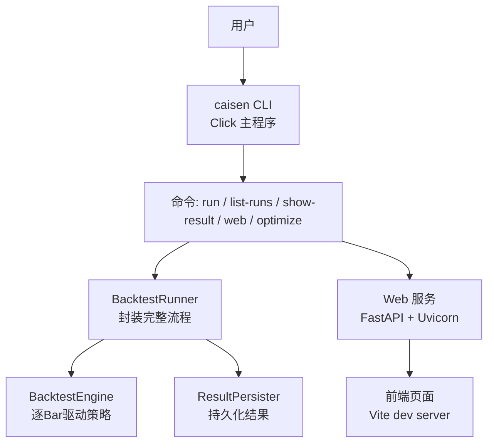
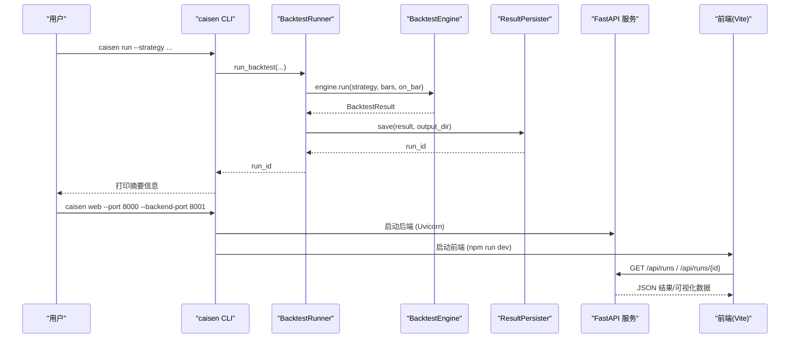
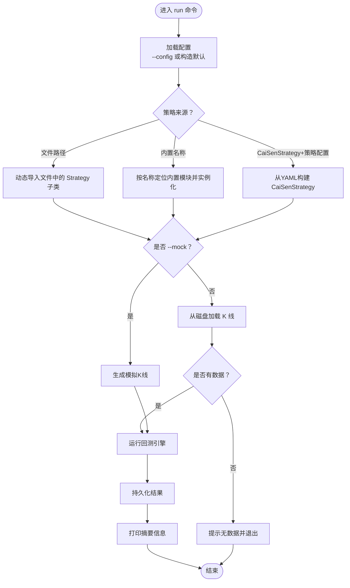
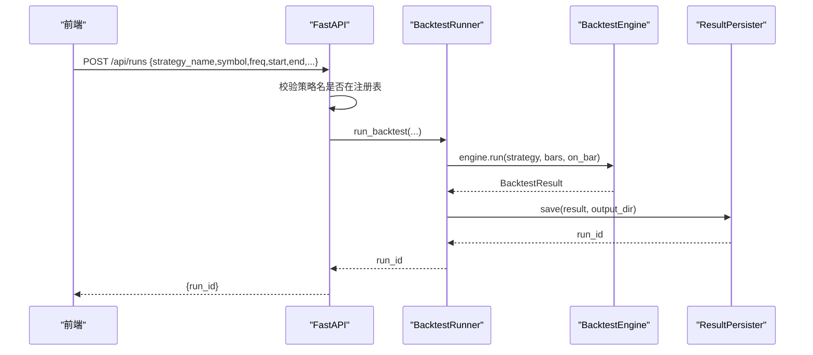
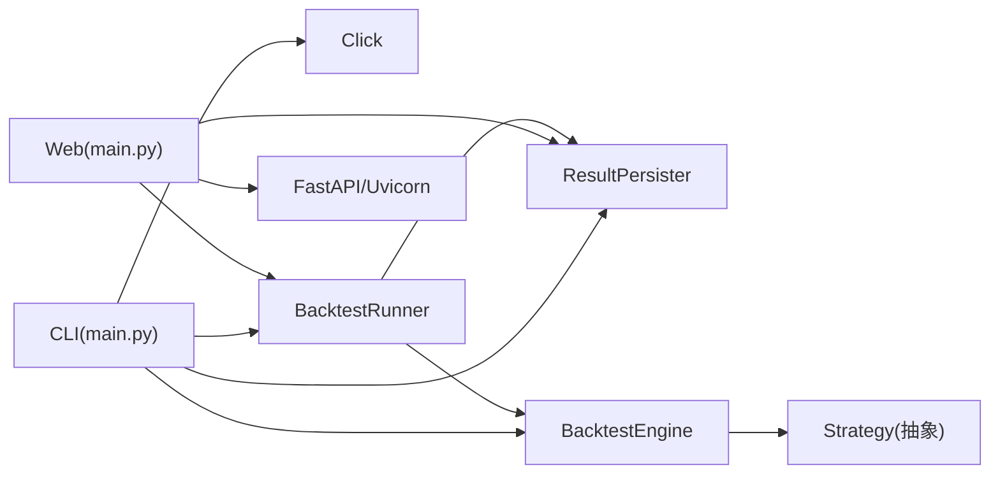

# 命令行接口

<cite>
**本文引用的文件**   
- [src/caisen/cli/main.py](file://src/caisen/cli/main.py)
- [pyproject.toml](file://pyproject.toml)
- [src/caisen/web/main.py](file://src/caisen/web/main.py)
- [src/caisen/backtest/runner.py](file://src/caisen/backtest/runner.py)
- [src/caisen/core/engine.py](file://src/caisen/core/engine.py)
- [src/caisen/result/persistence.py](file://src/caisen/result/persistence.py)
- [src/caisen/config/project_config.py](file://src/caisen/config/project_config.py)
- [configs/project.yaml](file://configs/project.yaml)
- [scripts/batch_backtest.py](file://scripts/batch_backtest.py)
- [scripts/focused_backtest.py](file://scripts/focused_backtest.py)
- [examples/ma_cross.py](file://examples/ma_cross.py)
</cite>

## 目录
1. [简介](#简介)
2. [项目结构](#项目结构)
3. [核心组件](#核心组件)
4. [架构总览](#架构总览)
5. [详细组件分析](#详细组件分析)
6. [依赖关系分析](#依赖关系分析)
7. [性能与扩展性](#性能与扩展性)
8. [故障排查指南](#故障排查指南)
9. [结论](#结论)
10. [附录：常用工作流与最佳实践](#附录常用工作流与最佳实践)

## 简介
本文件面向 Caisen 量化回测系统的命令行接口（CLI），基于 Click 框架组织命令分组、参数解析与错误处理，覆盖以下能力：
- 运行回测：run
- 列出记录：list-runs
- 查看结果：show-result
- 启动服务：web（前端 + 后端）
- 参数优化：optimize（网格搜索）
- 批量与聚焦脚本：batch_backtest.py、focused_backtest.py
- 参数传递机制：命令行 > 配置文件 > 默认值
- 自定义命令开发指南：如何新增命令、策略注册与扩展点

## 项目结构
CLI 入口由包安装脚本暴露，实际实现位于 src/caisen/cli/main.py。Web 服务由 FastAPI 提供，CLI 的 web 子命令会同时拉起后端 API 与前端 Vite 开发服务器。

图表来源
- [src/caisen/cli/main.py:63-371](file://src/caisen/cli/main.py#L63-L371)
- [src/caisen/backtest/runner.py:26-94](file://src/caisen/backtest/runner.py#L26-L94)
- [src/caisen/core/engine.py:19-91](file://src/caisen/core/engine.py#L19-L91)
- [src/caisen/result/persistence.py:59-133](file://src/caisen/result/persistence.py#L59-L133)
- [src/caisen/web/main.py:68-304](file://src/caisen/web/main.py#L68-L304)

章节来源
- [pyproject.toml:21-22](file://pyproject.toml#L21-L22)
- [src/caisen/cli/main.py:63-371](file://src/caisen/cli/main.py#L63-L371)

## 核心组件
- CLI 命令组与命令定义：使用 Click 的 @click.group 和 @click.command 装饰器声明命令及选项/参数。
- 回测执行器：BacktestRunner 将“加载数据 → 实例化策略 → 运行引擎 → 持久化”串联为统一入口。
- 回测引擎：BacktestEngine 按 Bar 驱动策略 on_bar，计算成交、持仓、净值曲线与标注。
- 结果持久化：ResultPersister 输出 meta.json、metrics.json、trades.parquet、equity.parquet、bars.parquet、annotations.json、data.json。
- Web 服务：FastAPI 提供 REST 与 WebSocket 进度推送；CLI 的 web 命令负责同时启动前后端。
- 项目配置：ProjectConfig 从 configs/project.yaml 读取全局配置，缺失时静默降级到内嵌默认值。

章节来源
- [src/caisen/cli/main.py:63-371](file://src/caisen/cli/main.py#L63-L371)
- [src/caisen/backtest/runner.py:26-94](file://src/caisen/backtest/runner.py#L26-L94)
- [src/caisen/core/engine.py:19-91](file://src/caisen/core/engine.py#L19-L91)
- [src/caisen/result/persistence.py:59-133](file://src/caisen/result/persistence.py#L59-L133)
- [src/caisen/web/main.py:68-304](file://src/caisen/web/main.py#L68-L304)
- [src/caisen/config/project_config.py:24-55](file://src/caisen/config/project_config.py#L24-L55)

## 架构总览
下图展示 CLI 到 Web 服务的端到端调用链，以及回测执行的关键路径。

图表来源
- [src/caisen/cli/main.py:69-191](file://src/caisen/cli/main.py#L69-L191)
- [src/caisen/backtest/runner.py:26-94](file://src/caisen/backtest/runner.py#L26-L94)
- [src/caisen/core/engine.py:33-91](file://src/caisen/core/engine.py#L33-L91)
- [src/caisen/result/persistence.py:62-133](file://src/caisen/result/persistence.py#L62-L133)
- [src/caisen/web/main.py:68-304](file://src/caisen/web/main.py#L68-L304)

## 详细组件分析

### CLI 命令设计（基于 Click）
- 命令分组：cli 作为根命令组，所有子命令通过 @cli.command() 注册。
- 参数解析：每个命令使用 @click.option 与 @click.argument 声明参数与选项，支持类型转换、默认值与帮助文本。
- 错误处理：对缺失数据、导入失败等场景进行显式提示并退出进程。

关键命令说明
- run：运行回测
  - 主要选项：--strategy/-s、--strategy-type/-t、--symbol、--freq、--start、--end、--config/-c、--output-dir、--mock、--strategy-config
  - 行为要点：
    - 若指定 --config，则从 YAML 构建 Config；否则根据 CLI 参数构造 DataConfig 与输出目录
    - 策略加载优先级：本地文件路径 > 内置策略名 > examples 示例策略
    - CaiSenStrategy 可通过 --strategy-config 指定 YAML 参数
    - 数据加载：优先真实数据，若无数据且未启用 --mock 则提示并退出
    - 运行引擎后保存结果，打印交易数、最终净值、总收益等摘要
- list-runs：列出所有回测结果
  - 输出 run_id、策略名、创建时间等元信息
- show-result：查看某次回测结果
  - 显示策略名称、年化收益、最大回撤、夏普比率、胜率、总交易次数等
- web：启动可视化报告服务
  - 同时启动后端（FastAPI/Uvicorn）与前端（Vite dev server）
  - 支持 --run-id 直接打开指定结果
  - 设置环境变量 VITE_API_PROXY 指向后端地址
- optimize：蔡森策略参数优化（网格搜索）
  - 支持 --workers、--top-n、--mock 等
  - 生成最优配置的 YAML 文件

章节来源
- [src/caisen/cli/main.py:63-371](file://src/caisen/cli/main.py#L63-L371)

#### run 命令流程图

图表来源
- [src/caisen/cli/main.py:69-191](file://src/caisen/cli/main.py#L69-L191)

### Web 服务（FastAPI + WebSocket）
- 应用创建：create_app 定义路由、中间件（CORS）、静态资源访问与安全路径校验。
- 关键接口：
  - GET /：返回前端 index.html
  - GET /api/data-sources：扫描本地数据源
  - GET /api/strategies：列出已注册策略
  - POST /api/runs：异步触发回测，立即返回占位 run_id
  - GET /api/runs：过滤有效结果（存在 meta.json 与 data/bars 数据）
  - GET /api/runs/{run_id}：获取详情
  - GET /api/runs/{run_id}/visualization：获取 data.json
  - GET /report.html：返回报告页
  - WS /ws/runs/{run_id}/progress：实时推送进度（running/done/error）
- CLI 集成：web 命令通过线程启动后端，再启动前端 Vite 开发服务器，并注入 VITE_API_PROXY 环境变量。

章节来源
- [src/caisen/web/main.py:68-304](file://src/caisen/web/main.py#L68-L304)
- [src/caisen/cli/main.py:235-295](file://src/caisen/cli/main.py#L235-L295)

#### Web 请求时序（以创建回测为例）

图表来源
- [src/caisen/web/main.py:107-132](file://src/caisen/web/main.py#L107-L132)
- [src/caisen/backtest/runner.py:26-94](file://src/caisen/backtest/runner.py#L26-L94)
- [src/caisen/core/engine.py:33-91](file://src/caisen/core/engine.py#L33-L91)
- [src/caisen/result/persistence.py:62-133](file://src/caisen/result/persistence.py#L62-L133)

### 回测引擎与结果持久化
- BacktestEngine：
  - 每根 Bar 调用策略 on_bar，兼容旧版返回 Order 的行为
  - 订单执行考虑滑点、手续费、仓位比例与全仓逻辑
  - 维护持仓、现金与净值曲线，并在最后汇总最终权益
- ResultPersister：
  - 生成唯一 run_id（策略名_日期_序号）
  - 保存多格式数据：JSON（meta/metrics/annotations/data）、Parquet（trades/equity/bars）
  - 提供 load/list_runs/load_visualization 等便捷方法

章节来源
- [src/caisen/core/engine.py:19-210](file://src/caisen/core/engine.py#L19-L210)
- [src/caisen/result/persistence.py:59-274](file://src/caisen/result/persistence.py#L59-L274)

### 参数传递机制与优先级
- 项目级配置：ProjectConfig 从 configs/project.yaml 读取 data_dir、output_dir、api_port；不存在时静默使用内嵌默认值。
- CLI 层：
  - run 命令支持 --config 指定全局配置 YAML；否则根据 CLI 参数构造 DataConfig
  - CaiSenStrategy 支持 --strategy-config 指定策略参数 YAML
- Web 层：
  - create_app 内部通过 ProjectConfig.load() 初始化 output_dir，CLI 的 web 命令可 set_output_dir 覆盖
- 优先级总结：
  - 运行时参数（CLI/Web 入参）> 配置文件（project.yaml/策略 YAML）> 内嵌默认值

章节来源
- [src/caisen/config/project_config.py:24-55](file://src/caisen/config/project_config.py#L24-L55)
- [configs/project.yaml:1-13](file://configs/project.yaml#L1-L13)
- [src/caisen/cli/main.py:83-97](file://src/caisen/cli/main.py#L83-L97)
- [src/caisen/web/main.py:58-66](file://src/caisen/web/main.py#L58-L66)

### 批量处理工具与参数优化
- batch_backtest.py：
  - 分段拉取 LLM 信号（窗口大小与重叠可配），统计买卖信号数量
  - 内置简易回测器，计算收益率、胜率并保存结果
- focused_backtest.py：
  - 针对若干代表性区间快速验证胜率，输出交易明细与汇总
- optimize（CLI 命令）：
  - 基于网格搜索的参数优化，支持并行 workers 与 top-n 筛选
  - 自动导出最优配置 YAML 供后续复现

章节来源
- [scripts/batch_backtest.py:1-200](file://scripts/batch_backtest.py#L1-L200)
- [scripts/focused_backtest.py:1-191](file://scripts/focused_backtest.py#L1-L191)
- [src/caisen/cli/main.py:297-364](file://src/caisen/cli/main.py#L297-L364)

### 自定义命令与扩展点
- 新增 CLI 命令：
  - 在 cli/main.py 中定义新的函数并使用 @cli.command("name") 装饰器注册
  - 使用 @click.option/@click.argument 声明参数与选项，结合 click.echo/sys.exit 进行交互与错误处理
- 策略扩展：
  - 继承 Strategy 基类，实现 on_init/on_bar/on_session_end/reset
  - 通过 BacktestRunner 的策略注册表加载策略（或由 CLI 动态导入）
- 插件机制与扩展点：
  - 当前代码未实现统一的插件系统；建议通过策略注册表与配置 YAML 实现“配置即插件”的扩展方式
  - 可在 BacktestRunner._instantiate_strategy 基础上增加更多策略发现与加载策略

章节来源
- [src/caisen/cli/main.py:63-371](file://src/caisen/cli/main.py#L63-L371)
- [src/caisen/strategy/base.py:19-37](file://src/caisen/strategy/base.py#L19-L37)
- [src/caisen/backtest/runner.py:124-143](file://src/caisen/backtest/runner.py#L124-L143)

## 依赖关系分析
- CLI 依赖：
  - Click（命令框架）
  - FastAPI/Uvicorn（Web 服务）
  - PyYAML（配置解析）
  - Pandas/PyArrow（结果持久化）
- 模块耦合：
  - CLI 与 Web 共享 ResultPersister 与 ProjectConfig
  - BacktestRunner 解耦 HTTP 与引擎，便于测试与复用
  - Engine 与 Strategy 通过抽象接口松耦合

图表来源
- [src/caisen/cli/main.py:63-371](file://src/caisen/cli/main.py#L63-L371)
- [src/caisen/web/main.py:68-304](file://src/caisen/web/main.py#L68-L304)
- [src/caisen/backtest/runner.py:26-94](file://src/caisen/backtest/runner.py#L26-L94)
- [src/caisen/core/engine.py:19-91](file://src/caisen/core/engine.py#L19-L91)
- [src/caisen/result/persistence.py:59-133](file://src/caisen/result/persistence.py#L59-L133)

章节来源
- [pyproject.toml:11-19](file://pyproject.toml#L11-L19)
- [src/caisen/cli/main.py:63-371](file://src/caisen/cli/main.py#L63-L371)
- [src/caisen/web/main.py:68-304](file://src/caisen/web/main.py#L68-L304)

## 性能与扩展性
- 并行优化：optimize 命令支持 --workers 并行网格搜索，适合大规模参数空间探索
- I/O 优化：结果持久化采用 Parquet 存储大表（trades/equity/bars），减少 JSON 体积与提升读取效率
- 进度反馈：WebSocket 进度推送避免长轮询开销，提升用户体验
- 可扩展性：
  - 策略通过注册表加载，便于新增策略而不修改核心流程
  - 配置 YAML 支持分层参数合并，降低硬编码复杂度

[本节为通用指导，不直接分析具体文件]

## 故障排查指南
- 数据未找到：
  - 现象：提示“无数据”，建议使用 --mock 生成测试数据或检查 data_dir 与符号/频率/日期范围
  - 相关位置：CLI run 的数据加载与异常处理
- 策略未注册或导入失败：
  - 现象：提示策略未找到或导入错误
  - 相关位置：CLI 内置策略映射与动态导入逻辑
- Web 服务端口冲突：
  - 现象：端口占用导致启动失败
  - 解决：调整 --port 与 --backend-port，或释放占用端口
- 路径安全：
  - Web 服务对 run_id 与静态资源路径进行安全检查，防止路径遍历攻击

章节来源
- [src/caisen/cli/main.py:150-176](file://src/caisen/cli/main.py#L150-L176)
- [src/caisen/cli/main.py:100-148](file://src/caisen/cli/main.py#L100-L148)
- [src/caisen/web/main.py:28-39](file://src/caisen/web/main.py#L28-L39)

## 结论
Caisen CLI 以 Click 为核心，围绕 run、list-runs、show-result、web、optimize 等命令构建了完整的回测与可视化工作流。通过 BacktestRunner 与 BacktestEngine 的解耦设计，配合 ResultPersister 的多格式持久化与 Web 层的 REST/WS 能力，形成了易用、可扩展的量化回测平台。参数传递遵循“运行时 > 配置文件 > 默认值”的清晰优先级，便于在不同环境灵活切换。

[本节为总结，不直接分析具体文件]

## 附录：常用工作流与最佳实践
- 快速回测（使用示例策略）
  - 使用内置 MACrossStrategy 进行简单均线交叉回测
  - 参考示例策略文件以了解 Strategy 接口的实现方式
- 使用 CaiSen 策略与参数优化
  - 通过 --strategy-config 指定策略 YAML 参数
  - 使用 optimize 命令进行网格搜索，导出最优配置
- 批量与聚焦验证
  - 使用 batch_backtest.py 进行分段 LLM 信号批量回测
  - 使用 focused_backtest.py 对代表性区间进行快速胜率验证
- 可视化与协作
  - 使用 web 命令启动前后端，浏览器访问前端页面查看结果
  - 通过 /api/runs 与 /api/runs/{run_id} 接口对接自动化流程

章节来源
- [examples/ma_cross.py:10-45](file://examples/ma_cross.py#L10-L45)
- [src/caisen/cli/main.py:297-364](file://src/caisen/cli/main.py#L297-L364)
- [scripts/batch_backtest.py:1-200](file://scripts/batch_backtest.py#L1-L200)
- [scripts/focused_backtest.py:1-191](file://scripts/focused_backtest.py#L1-L191)
- [src/caisen/web/main.py:68-304](file://src/caisen/web/main.py#L68-L304)