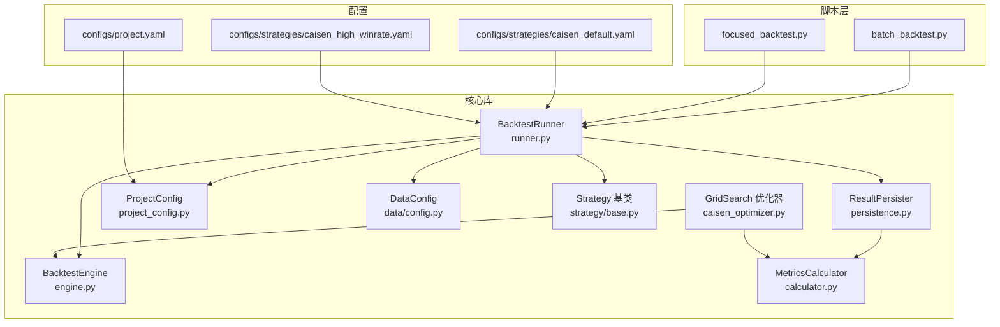
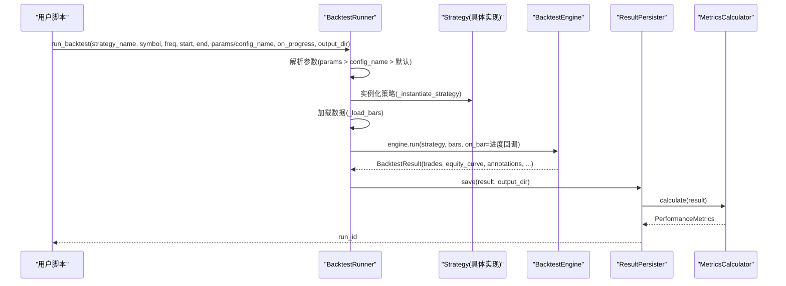
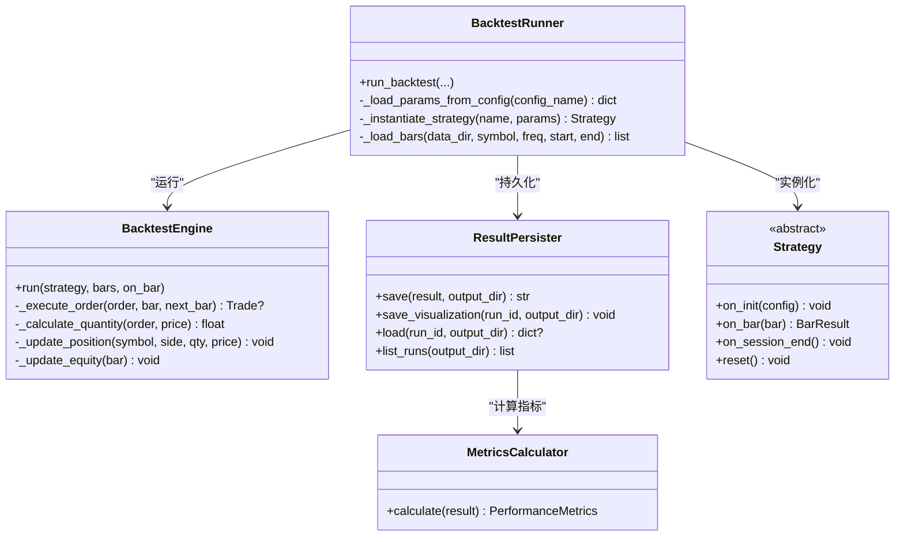
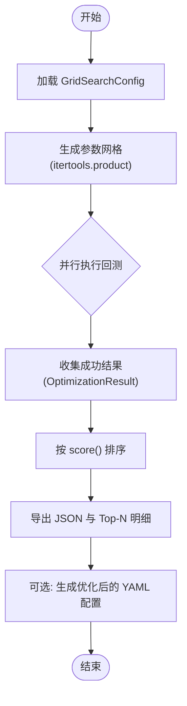
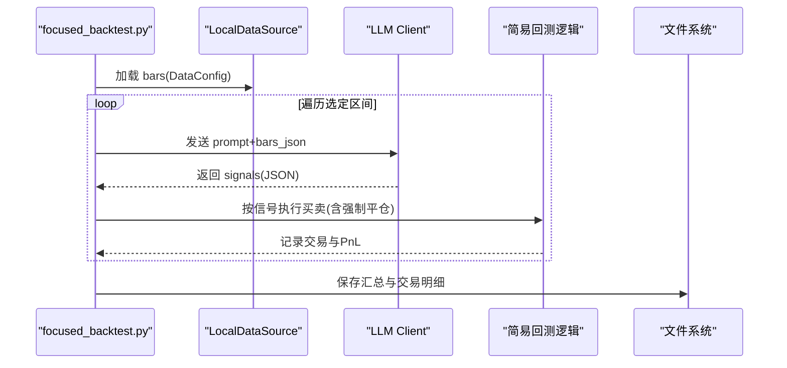
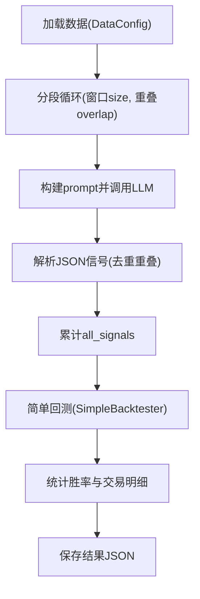
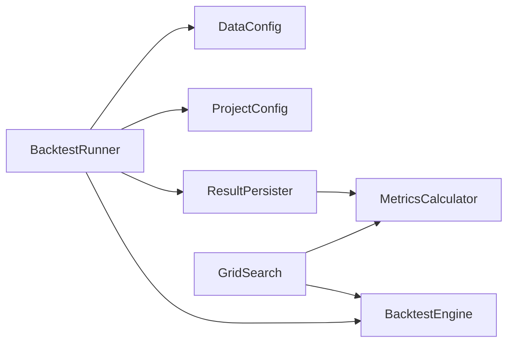

# 批量处理工具

<cite>
**本文引用的文件**   
- [scripts/batch_backtest.py](file://scripts/batch_backtest.py)
- [scripts/focused_backtest.py](file://scripts/focused_backtest.py)
- [src/caisen/backtest/runner.py](file://src/caisen/backtest/runner.py)
- [src/caisen/core/engine.py](file://src/caisen/core/engine.py)
- [src/caisen/result/persistence.py](file://src/caisen/result/persistence.py)
- [src/caisen/result/calculator.py](file://src/caisen/result/calculator.py)
- [src/caisen/config/project_config.py](file://src/caisen/config/project_config.py)
- [configs/project.yaml](file://configs/project.yaml)
- [configs/strategies/caisen_default.yaml](file://configs/strategies/caisen_default.yaml)
- [configs/strategies/caisen_high_winrate.yaml](file://configs/strategies/caisen_high_winrate.yaml)
- [src/caisen/data/config.py](file://src/caisen/data/config.py)
- [src/caisen/strategy/base.py](file://src/caisen/strategy/base.py)
- [src/caisen/strategy/algorithm/caisen_optimizer.py](file://src/caisen/strategy/algorithm/caisen_optimizer.py)
</cite>

## 目录
1. [简介](#简介)
2. [项目结构](#项目结构)
3. [核心组件](#核心组件)
4. [架构总览](#架构总览)
5. [详细组件分析](#详细组件分析)
6. [依赖关系分析](#依赖关系分析)
7. [性能考虑](#性能考虑)
8. [故障排查指南](#故障排查指南)
9. [结论](#结论)
10. [附录](#附录)

## 简介
本技术文档围绕 Caisen 的批量处理与参数优化能力展开，重点覆盖以下方面：
- 多策略并行执行（以 runner 为核心）：策略配置加载、数据加载、引擎运行、结果持久化与指标计算。
- 参数优化（网格搜索）：参数空间定义、组合生成、并行回测、评分排序与最优配置导出。
- 分段验证脚本：快速胜率评估与代表性区间回测。
- 调度机制与进度跟踪：任务队列、并发控制、错误恢复与输出组织。
- 配置文件规范：策略组合、参数范围、执行约束。
- 性能调优：内存管理、CPU 利用率与 I/O 优化建议。
- 实际工作流示例与最佳实践。

## 项目结构
仓库采用分层模块化设计：
- scripts：面向用户的批处理与快速验证脚本入口。
- src/caisen：核心库，包含回测引擎、策略接口、结果持久化、指标计算、数据配置等。
- configs：项目级与策略级 YAML 配置。
- runs：回测结果输出目录。

图表来源
- [src/caisen/backtest/runner.py:1-163](file://src/caisen/backtest/runner.py#L1-L163)
- [src/caisen/core/engine.py:1-210](file://src/caisen/core/engine.py#L1-L210)
- [src/caisen/result/persistence.py:1-274](file://src/caisen/result/persistence.py#L1-L274)
- [src/caisen/result/calculator.py:1-185](file://src/caisen/result/calculator.py#L1-L185)
- [src/caisen/config/project_config.py:1-56](file://src/caisen/config/project_config.py#L1-L56)
- [src/caisen/data/config.py:1-51](file://src/caisen/data/config.py#L1-L51)
- [src/caisen/strategy/base.py:1-37](file://src/caisen/strategy/base.py#L1-L37)
- [src/caisen/strategy/algorithm/caisen_optimizer.py:1-360](file://src/caisen/strategy/algorithm/caisen_optimizer.py#L1-L360)
- [configs/project.yaml:1-13](file://configs/project.yaml#L1-L13)
- [configs/strategies/caisen_default.yaml:1-50](file://configs/strategies/caisen_default.yaml#L1-L50)
- [configs/strategies/caisen_high_winrate.yaml:1-23](file://configs/strategies/caisen_high_winrate.yaml#L1-L23)

章节来源
- [src/caisen/backtest/runner.py:1-163](file://src/caisen/backtest/runner.py#L1-L163)
- [src/caisen/core/engine.py:1-210](file://src/caisen/core/engine.py#L1-L210)
- [src/caisen/result/persistence.py:1-274](file://src/caisen/result/persistence.py#L1-L274)
- [src/caisen/result/calculator.py:1-185](file://src/caisen/result/calculator.py#L1-L185)
- [src/caisen/config/project_config.py:1-56](file://src/caisen/config/project_config.py#L1-L56)
- [src/caisen/data/config.py:1-51](file://src/caisen/data/config.py#L1-L51)
- [src/caisen/strategy/base.py:1-37](file://src/caisen/strategy/base.py#L1-L37)
- [src/caisen/strategy/algorithm/caisen_optimizer.py:1-360](file://src/caisen/strategy/algorithm/caisen_optimizer.py#L1-L360)
- [configs/project.yaml:1-13](file://configs/project.yaml#L1-L13)
- [configs/strategies/caisen_default.yaml:1-50](file://configs/strategies/caisen_default.yaml#L1-L50)
- [configs/strategies/caisen_high_winrate.yaml:1-23](file://configs/strategies/caisen_high_winrate.yaml#L1-L23)

## 核心组件
- BacktestRunner：封装“加载配置→实例化策略→加载数据→运行引擎→持久化结果”的完整流程，支持进度回调与输出目录注入。
- BacktestEngine：逐根 K 线驱动策略决策、订单执行、持仓与净值更新，返回统一结果对象。
- ResultPersister：将结果拆分为 meta/equity/trades/annotations/metrics/bars 等多文件，并生成前端 data.json。
- MetricsCalculator：计算年化收益、最大回撤、夏普比率、胜率、盈亏比等指标。
- ProjectConfig/DataConfig：项目与数据加载配置，提供默认值与校验。
- Strategy 基类：定义 on_init/on_bar/on_session_end 生命周期钩子。
- GridSearch 优化器：定义参数网格、并行回测、评分排序与最优配置导出。

章节来源
- [src/caisen/backtest/runner.py:1-163](file://src/caisen/backtest/runner.py#L1-L163)
- [src/caisen/core/engine.py:1-210](file://src/caisen/core/engine.py#L1-L210)
- [src/caisen/result/persistence.py:1-274](file://src/caisen/result/persistence.py#L1-L274)
- [src/caisen/result/calculator.py:1-185](file://src/caisen/result/calculator.py#L1-L185)
- [src/caisen/config/project_config.py:1-56](file://src/caisen/config/project_config.py#L1-L56)
- [src/caisen/data/config.py:1-51](file://src/caisen/data/config.py#L1-L51)
- [src/caisen/strategy/base.py:1-37](file://src/caisen/strategy/base.py#L1-L37)
- [src/caisen/strategy/algorithm/caisen_optimizer.py:1-360](file://src/caisen/strategy/algorithm/caisen_optimizer.py#L1-L360)

## 架构总览
下图展示了从脚本到引擎、再到结果持久化的端到端调用链。

图表来源
- [src/caisen/backtest/runner.py:26-94](file://src/caisen/backtest/runner.py#L26-L94)
- [src/caisen/core/engine.py:33-91](file://src/caisen/core/engine.py#L33-L91)
- [src/caisen/result/persistence.py:62-133](file://src/caisen/result/persistence.py#L62-L133)
- [src/caisen/result/calculator.py:45-79](file://src/caisen/result/calculator.py#L45-L79)

## 详细组件分析

### 多策略并行执行（基于 Runner 与 Engine）
- 参数优先级：传入 params 最高；其次为 config_name 对应的 YAML 展平参数；最后使用策略 __init__ 默认值。
- 策略实例化：通过注册表获取模块路径，反射导入类，按签名过滤可接受参数后构造。
- 数据加载：根据 DataConfig 从磁盘读取 Parquet 数据，空数据直接报错。
- 引擎运行：每根 bar 触发策略 on_bar，兼容旧版 Order/BarResult 返回；执行订单、更新持仓与净值曲线；可选 on_bar 进度回调。
- 结果持久化：生成 run_id，保存 meta/equity/trades/annotations/metrics/bars，并生成 data.json。

图表来源
- [src/caisen/backtest/runner.py:26-163](file://src/caisen/backtest/runner.py#L26-L163)
- [src/caisen/core/engine.py:19-210](file://src/caisen/core/engine.py#L19-L210)
- [src/caisen/result/persistence.py:59-274](file://src/caisen/result/persistence.py#L59-L274)
- [src/caisen/result/calculator.py:34-185](file://src/caisen/result/calculator.py#L34-L185)
- [src/caisen/strategy/base.py:19-37](file://src/caisen/strategy/base.py#L19-L37)

章节来源
- [src/caisen/backtest/runner.py:26-163](file://src/caisen/backtest/runner.py#L26-L163)
- [src/caisen/core/engine.py:33-91](file://src/caisen/core/engine.py#L33-L91)
- [src/caisen/result/persistence.py:62-133](file://src/caisen/result/persistence.py#L62-L133)
- [src/caisen/result/calculator.py:45-79](file://src/caisen/result/calculator.py#L45-L79)
- [src/caisen/strategy/base.py:19-37](file://src/caisen/strategy/base.py#L19-L37)

### 参数优化（网格搜索）
- 参数空间定义：通过 GridSearchConfig 集中声明 stop_loss_factor、min_profit_pct、trailing_stop_pct、platform_min_bars、volume_threshold 及 patterns 开关组合。
- 组合生成：itertools.product 笛卡尔积生成所有参数组合。
- 并行执行：ThreadPoolExecutor 并发提交单次回测任务，收集成功结果。
- 评分排序：综合年化收益、最大回撤、夏普比率、胜率加权打分，降序排列。
- 结果导出：输出 JSON 汇总与 Top-N 明细；支持生成可直接使用的 YAML 配置。

图表来源
- [src/caisen/strategy/algorithm/caisen_optimizer.py:111-152](file://src/caisen/strategy/algorithm/caisen_optimizer.py#L111-L152)
- [src/caisen/strategy/algorithm/caisen_optimizer.py:190-305](file://src/caisen/strategy/algorithm/caisen_optimizer.py#L190-L305)
- [src/caisen/strategy/algorithm/caisen_optimizer.py:308-360](file://src/caisen/strategy/algorithm/caisen_optimizer.py#L308-L360)

章节来源
- [src/caisen/strategy/algorithm/caisen_optimizer.py:17-108](file://src/caisen/strategy/algorithm/caisen_optimizer.py#L17-L108)
- [src/caisen/strategy/algorithm/caisen_optimizer.py:111-152](file://src/caisen/strategy/algorithm/caisen_optimizer.py#L111-L152)
- [src/caisen/strategy/algorithm/caisen_optimizer.py:190-305](file://src/caisen/strategy/algorithm/caisen_optimizer.py#L190-L305)
- [src/caisen/strategy/algorithm/caisen_optimizer.py:308-360](file://src/caisen/strategy/algorithm/caisen_optimizer.py#L308-L360)

### 分段验证脚本（focused_backtest.py）
- 功能：选取若干代表性区间，调用 LLM 生成信号后进行简单回测，统计胜率与交易明细。
- 特点：快速验证形态识别与信号质量，便于迭代 prompt 或阈值。
- 输出：保存汇总与交易明细 JSON。

图表来源
- [scripts/focused_backtest.py:31-191](file://scripts/focused_backtest.py#L31-L191)

章节来源
- [scripts/focused_backtest.py:31-191](file://scripts/focused_backtest.py#L31-L191)

### 批量测试脚本（batch_backtest.py）
- 功能：分段分析（窗口+重叠），调用 LLM 生成信号，进行简单回测，统计胜率并保存结果。
- 特点：适合对大段数据进行滑动窗口式信号采集与快速回测。
- 输出：保存时间戳、配置、最终资金、收益率、交易数、胜率与部分信号。

图表来源
- [scripts/batch_backtest.py:36-200](file://scripts/batch_backtest.py#L36-L200)

章节来源
- [scripts/batch_backtest.py:36-200](file://scripts/batch_backtest.py#L36-L200)

### 配置文件格式规范
- 项目级配置（configs/project.yaml）
  - data_dir：本地行情数据根目录（Parquet 存放位置）。
  - output_dir：回测结果输出目录。
  - api_port：Web 服务端口。
- 策略级配置（configs/strategies/*.yaml）
  - params：策略参数集合（平台检测、破底翻、仓位管理、风控等）。
  - patterns：形态开关（W_BOTTOM、M_TOP、HEAD_AND_SHOULDERS_*、TRIANGLE、FLAG、RECTANGLE、ROUNDING_BOTTOM、CUP_HANDLE、BREAKOUT_PULLBACK）。
  - pattern_weights：形态权重（用于质量评分）。
- 参数优先级：运行时 params > config_name 对应 YAML 展平参数 > 策略默认值。

章节来源
- [configs/project.yaml:1-13](file://configs/project.yaml#L1-L13)
- [configs/strategies/caisen_default.yaml:1-50](file://configs/strategies/caisen_default.yaml#L1-L50)
- [configs/strategies/caisen_high_winrate.yaml:1-23](file://configs/strategies/caisen_high_winrate.yaml#L1-L23)
- [src/caisen/backtest/runner.py:97-121](file://src/caisen/backtest/runner.py#L97-L121)

### 调度机制与进度跟踪
- 任务队列与并发：优化器使用线程池并发提交回测任务，按完成顺序收集结果。
- 进度跟踪：Runner 在引擎中每 100 根 bar 触发一次 on_progress 回调，便于外部 UI 或日志展示。
- 错误恢复：优化器内部捕获异常并跳过失败组合；Runner 对空数据抛出明确错误；持久化层保证元数据与指标落盘。

章节来源
- [src/caisen/strategy/algorithm/caisen_optimizer.py:225-244](file://src/caisen/strategy/algorithm/caisen_optimizer.py#L225-L244)
- [src/caisen/backtest/runner.py:80-94](file://src/caisen/backtest/runner.py#L80-L94)
- [src/caisen/result/persistence.py:62-133](file://src/caisen/result/persistence.py#L62-L133)

## 依赖关系分析
- Runner 依赖：ProjectConfig（全局路径）、DataConfig（数据范围）、StrategyRegistry（策略定位）、BacktestEngine（执行）、ResultPersister（落盘）。
- Engine 依赖：Order/Trade/Portfolio/Position/Annotation/BarResult 等核心数据结构。
- Persistence 依赖：MetricsCalculator（指标计算）、pandas（Parquet 读写）。
- Optimizer 依赖：BacktestEngine、MetricsCalculator、CaiSenStrategy（延迟导入避免循环依赖）。

图表来源
- [src/caisen/backtest/runner.py:1-163](file://src/caisen/backtest/runner.py#L1-L163)
- [src/caisen/core/engine.py:1-210](file://src/caisen/core/engine.py#L1-L210)
- [src/caisen/result/persistence.py:1-274](file://src/caisen/result/persistence.py#L1-L274)
- [src/caisen/result/calculator.py:1-185](file://src/caisen/result/calculator.py#L1-L185)
- [src/caisen/strategy/algorithm/caisen_optimizer.py:1-360](file://src/caisen/strategy/algorithm/caisen_optimizer.py#L1-L360)

章节来源
- [src/caisen/backtest/runner.py:1-163](file://src/caisen/backtest/runner.py#L1-L163)
- [src/caisen/core/engine.py:1-210](file://src/caisen/core/engine.py#L1-L210)
- [src/caisen/result/persistence.py:1-274](file://src/caisen/result/persistence.py#L1-L274)
- [src/caisen/result/calculator.py:1-185](file://src/caisen/result/calculator.py#L1-L185)
- [src/caisen/strategy/algorithm/caisen_optimizer.py:1-360](file://src/caisen/strategy/algorithm/caisen_optimizer.py#L1-L360)

## 性能考虑
- 内存管理
  - 合理设置 DataConfig 的时间范围，避免一次性加载过大区间。
  - 优化器并行时注意 bars 共享引用，避免重复拷贝。
- CPU 利用率
  - 调整 n_workers 匹配物理核数；I/O 密集场景可适当降低线程数。
  - 指标计算与持久化尽量在单进程内完成，减少跨进程开销。
- I/O 优化
  - 使用 Parquet 存储 bars/equity/trades，提升读写效率。
  - 批量写入 data.json 前合并必要字段，减少多次序列化。
- 错误与重试
  - 对网络/LLM 调用增加重试与超时控制（针对 batch/focused 脚本）。
  - 优化器捕获异常并继续其他组合，确保整体成功率。

[本节为通用指导，不直接分析具体文件]

## 故障排查指南
- 数据为空
  - 现象：Runner 抛出“数据为空”错误。
  - 排查：确认 DataConfig 的 symbol/freq/start/end 与 data_dir 下目录结构一致。
- 策略未注册或加载失败
  - 现象：Runner 提示策略模块未注册或加载失败。
  - 排查：检查 StrategyRegistry 是否已注册目标策略类名，模块路径是否正确。
- 指标计算异常
  - 现象：无交易或净值曲线过短导致指标为 0。
  - 排查：确认策略产生有效交易，且 equity_curve 非空。
- 结果缺失
  - 现象：runs 目录下缺少某些文件。
  - 排查：检查 ResultPersister.save 是否被调用，output_dir 权限与磁盘空间。

章节来源
- [src/caisen/backtest/runner.py:77-79](file://src/caisen/backtest/runner.py#L77-L79)
- [src/caisen/backtest/runner.py:124-143](file://src/caisen/backtest/runner.py#L124-L143)
- [src/caisen/result/persistence.py:62-133](file://src/caisen/result/persistence.py#L62-L133)
- [src/caisen/result/calculator.py:81-122](file://src/caisen/result/calculator.py#L81-L122)

## 结论
- Runner 提供了标准化的回测流水线，结合 ProjectConfig 与策略 YAML 可实现灵活配置。
- 优化器通过网格搜索与并发执行，高效探索参数空间并输出可复用的配置。
- focused/batch 脚本适用于快速验证与大规模信号采集，配合持久化与可视化数据，形成闭环。
- 建议在大规模批量场景中关注内存占用、线程数与 I/O 吞吐，并结合错误恢复机制提升稳定性。

[本节为总结性内容，不直接分析具体文件]

## 附录
- 使用工作流示例
  - 快速验证：使用 focused_backtest.py 选择代表性区间，评估信号质量与胜率。
  - 批量扫描：使用 batch_backtest.py 对长序列进行滑动窗口分析，汇总胜率与交易明细。
  - 参数优化：使用 caisen_optimizer.grid_search 定义参数网格，设置 n_workers，得到 Top-N 最优参数与自动生成 YAML。
  - 正式回测：通过 BacktestRunner.run_backtest 指定 strategy_name、symbol、freq、start/end、config_name 或 params，并传入 on_progress 回调与 output_dir。
- 最佳实践
  - 先小范围验证（focused），再扩大范围（batch），最后做系统优化（grid search）。
  - 合理划分 DataConfig 的时间窗，避免峰值内存。
  - 对 LLM 调用增加重试与超时保护，避免阻塞主流程。
  - 定期清理 runs 目录，保留关键 run_id 与 data.json 以便回溯。

[本节为概念性说明，不直接分析具体文件]