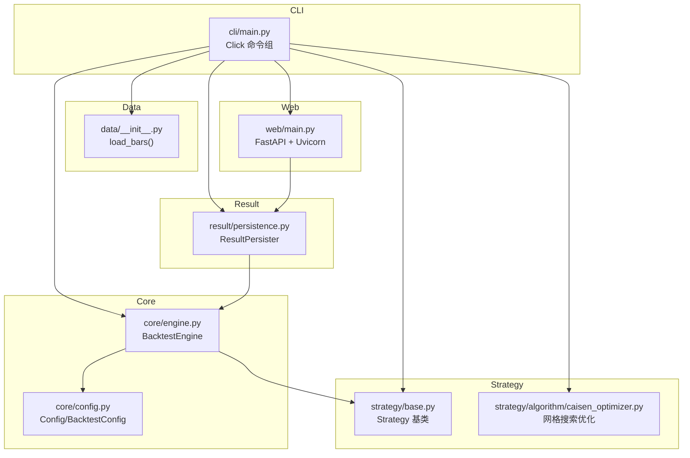
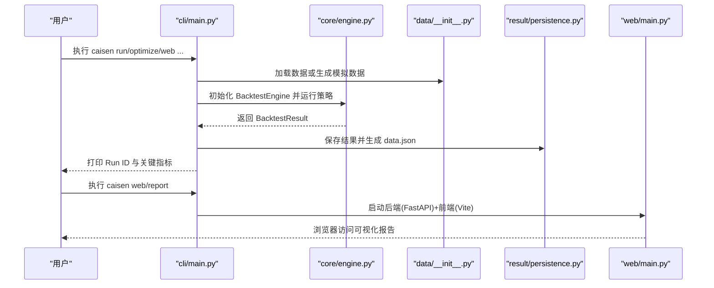
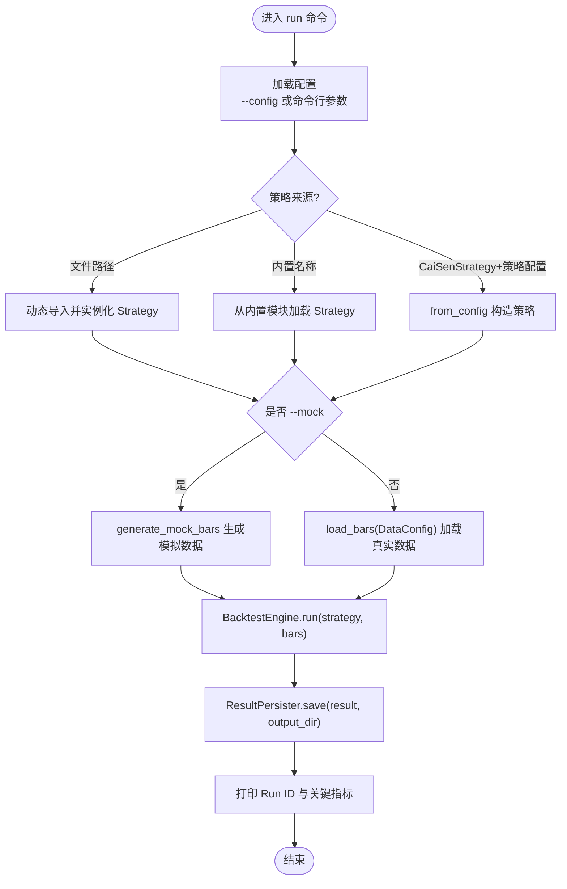
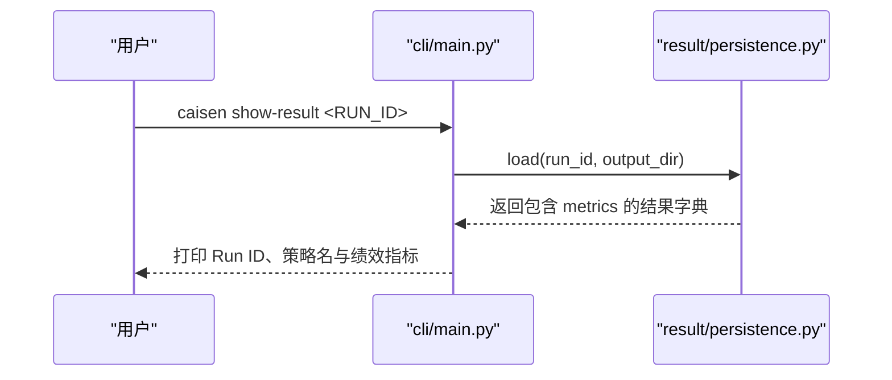
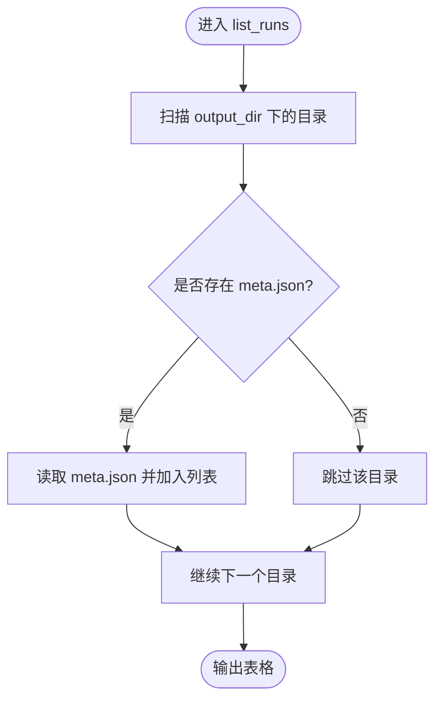
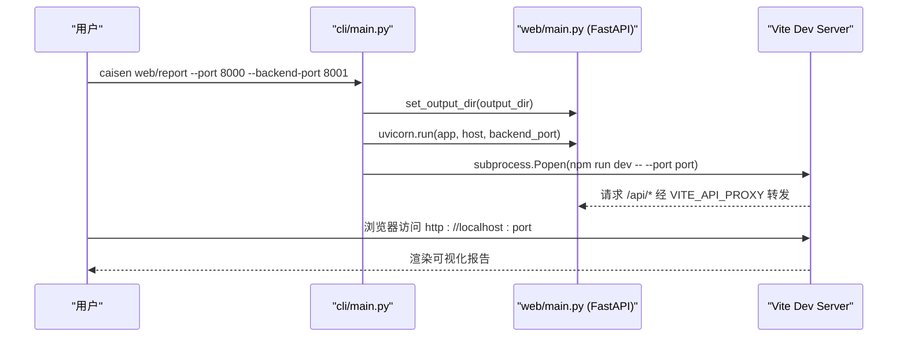
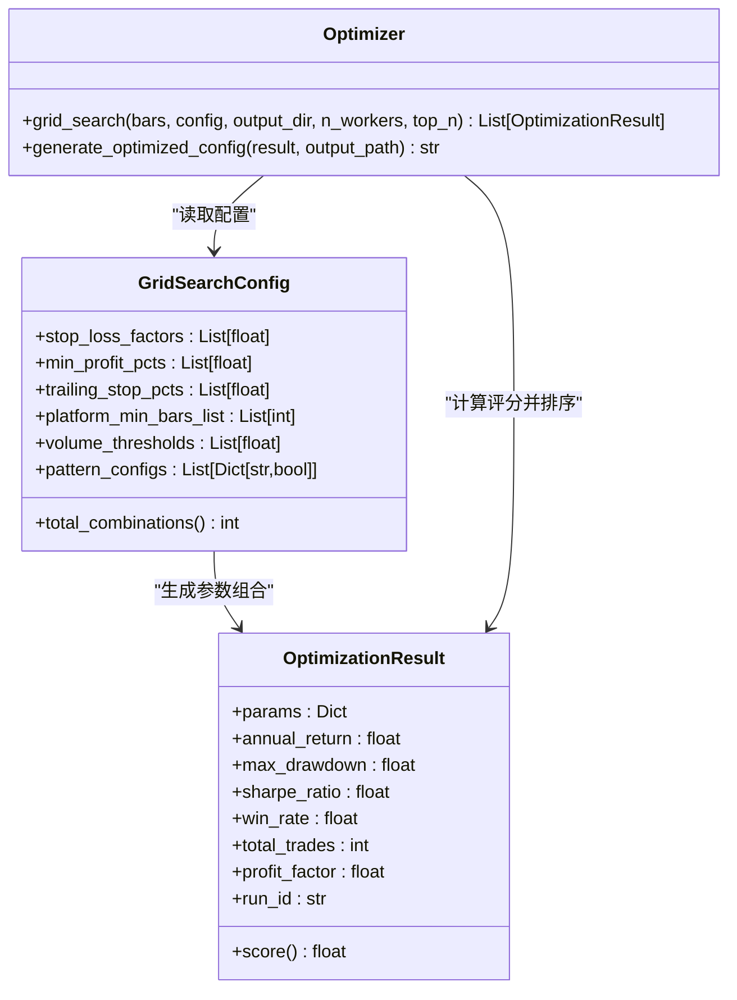
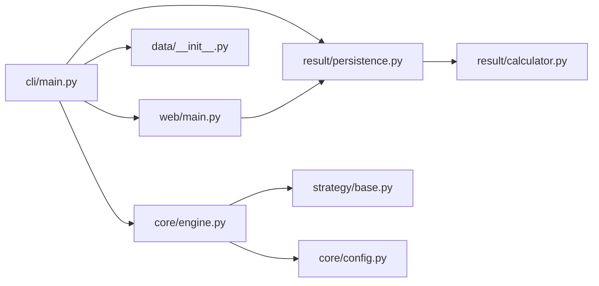

# 核心命令

<cite>
**本文引用的文件**
- [src/caisen/cli/main.py](file://src/caisen/cli/main.py)
- [src/caisen/core/engine.py](file://src/caisen/core/engine.py)
- [src/caisen/result/persistence.py](file://src/caisen/result/persistence.py)
- [src/caisen/data/__init__.py](file://src/caisen/data/__init__.py)
- [src/caisen/web/main.py](file://src/caisen/web/main.py)
- [src/caisen/strategy/base.py](file://src/caisen/strategy/base.py)
- [src/caisen/strategy/algorithm/caisen_optimizer.py](file://src/caisen/strategy/algorithm/caisen_optimizer.py)
- [src/caisen/core/config.py](file://src/caisen/core/config.py)
- [README.md](file://README.md)
- [pyproject.toml](file://pyproject.toml)
</cite>

## 目录
1. [简介](#简介)
2. [项目结构](#项目结构)
3. [核心组件](#核心组件)
4. [架构总览](#架构总览)
5. [详细组件分析](#详细组件分析)
6. [依赖关系分析](#依赖关系分析)
7. [性能考量](#性能考量)
8. [故障排查指南](#故障排查指南)
9. [结论](#结论)
10. [附录](#附录)

## 简介
本文件面向 Caisen 量化回测系统的核心 CLI 命令，围绕基于 Click 的命令架构、参数解析与错误处理机制展开，深入解释以下命令的完整功能与使用方式：
- run：策略加载（内置策略、自定义文件、LLM 策略）、数据源配置、模拟数据生成与回测执行流程
- show_result：结果查看，包括绩效指标展示与格式化输出
- list_runs：回测记录管理，列出所有有效运行
- web/report：可视化服务启动机制，前后端协调与端口配置
- optimize：蔡森策略参数优化，网格搜索与并行计算设置

文档同时提供每个命令的参数说明、使用示例与常见错误处理方案，并辅以架构图、时序图与流程图帮助理解。

## 项目结构
CLI 入口位于 src/caisen/cli/main.py，通过 Click 定义命令组与子命令；回测引擎在 core.engine.BacktestEngine；结果持久化在 result.persistence.ResultPersister；数据加载在 data.__init__.load_bars；Web 服务在 web.main；策略基类在 strategy.base；优化器在 strategy.algorithm.caisen_optimizer。

图表来源
- [src/caisen/cli/main.py:63-371](file://src/caisen/cli/main.py#L63-L371)
- [src/caisen/core/engine.py:19-91](file://src/caisen/core/engine.py#L19-L91)
- [src/caisen/result/persistence.py:59-133](file://src/caisen/result/persistence.py#L59-L133)
- [src/caisen/data/__init__.py:34-49](file://src/caisen/data/__init__.py#L34-L49)
- [src/caisen/web/main.py:68-304](file://src/caisen/web/main.py#L68-L304)
- [src/caisen/strategy/base.py:19-37](file://src/caisen/strategy/base.py#L19-L37)
- [src/caisen/strategy/algorithm/caisen_optimizer.py:190-305](file://src/caisen/strategy/algorithm/caisen_optimizer.py#L190-L305)

章节来源
- [src/caisen/cli/main.py:63-371](file://src/caisen/cli/main.py#L63-L371)
- [pyproject.toml:21-22](file://pyproject.toml#L21-L22)

## 核心组件
- Click 命令组与子命令：cli 作为根命令，run、show_result、list_runs、web、optimize 为子命令，分别负责回测、结果查看、记录列表、可视化服务与参数优化。
- 回测引擎 BacktestEngine：驱动策略逐 K 线执行，订单执行、持仓更新、净值曲线计算与结果返回。
- 结果持久化 ResultPersister：保存 meta.json、metrics.json、trades.parquet、equity.parquet、bars.parquet、annotations.json 与 data.json，并提供 load/list 能力。
- 数据加载 load_bars：根据 DataConfig 从注册的数据源加载 Bar 序列，支持本地数据扫描与异常抛出。
- Web 服务 FastAPI：提供前端页面、静态资源、后端 API（列出数据源/策略、创建回测、查询结果、WebSocket 进度推送）。
- 策略基类 Strategy：定义 on_init/on_bar/on_session_end 生命周期接口，兼容旧版 Order 返回。
- 优化器 GridSearchConfig/grid_search：网格搜索组合生成、多线程并行回测、评分排序与最优配置导出。

章节来源
- [src/caisen/cli/main.py:63-371](file://src/caisen/cli/main.py#L63-L371)
- [src/caisen/core/engine.py:19-91](file://src/caisen/core/engine.py#L19-L91)
- [src/caisen/result/persistence.py:59-133](file://src/caisen/result/persistence.py#L59-L133)
- [src/caisen/data/__init__.py:34-49](file://src/caisen/data/__init__.py#L34-L49)
- [src/caisen/web/main.py:68-304](file://src/caisen/web/main.py#L68-L304)
- [src/caisen/strategy/base.py:19-37](file://src/caisen/strategy/base.py#L19-L37)
- [src/caisen/strategy/algorithm/caisen_optimizer.py:190-305](file://src/caisen/strategy/algorithm/caisen_optimizer.py#L190-L305)

## 架构总览
下图展示了 CLI 到各模块的调用关系与数据流：用户通过 caisen 命令触发子命令，CLI 负责参数解析与流程编排，核心逻辑由引擎、数据、结果与 Web 服务协同完成。

图表来源
- [src/caisen/cli/main.py:63-371](file://src/caisen/cli/main.py#L63-L371)
- [src/caisen/core/engine.py:33-91](file://src/caisen/core/engine.py#L33-L91)
- [src/caisen/result/persistence.py:63-133](file://src/caisen/result/persistence.py#L63-L133)
- [src/caisen/data/__init__.py:34-49](file://src/caisen/data/__init__.py#L34-L49)
- [src/caisen/web/main.py:68-304](file://src/caisen/web/main.py#L68-L304)

## 详细组件分析

### run 命令：策略加载、数据配置、模拟数据与回测执行
- 参数解析与配置加载
  - 支持 --config 指定 YAML 配置文件，否则按命令行参数构建 Config（含 BacktestConfig 与 DataConfig）
  - 输出目录默认 ./runs，可通过 --output-dir 覆盖
- 策略加载机制
  - 若 --strategy 是文件路径，动态导入并查找 Strategy 子类实例
  - 若为内置策略名（如 MACrossStrategy、CaiSenStrategy），从对应模块加载
  - 若指定 CaiSenStrategy 且提供 --strategy-config（YAML），则通过 from_config 构造策略
  - LLM 策略类型通过 --strategy-type=llm 预留扩展点（当前 CLI 主流程以 code 为主）
- 数据加载与模拟数据
  - 非 mock 模式：使用 DataConfig 调用 load_bars 加载本地数据，未找到时提示使用 --mock
  - mock 模式：生成随机价格序列的 Bar 列表，便于快速测试
- 回测执行与结果保存
  - 初始化 BacktestEngine，传入 BacktestConfig
  - 执行 engine.run(strategy, bars)，得到 BacktestResult
  - 通过 ResultPersister.save 持久化结果，生成 run_id 并打印关键指标

图表来源
- [src/caisen/cli/main.py:69-191](file://src/caisen/cli/main.py#L69-L191)
- [src/caisen/core/engine.py:33-91](file://src/caisen/core/engine.py#L33-L91)
- [src/caisen/result/persistence.py:63-133](file://src/caisen/result/persistence.py#L63-L133)
- [src/caisen/data/__init__.py:34-49](file://src/caisen/data/__init__.py#L34-L49)

章节来源
- [src/caisen/cli/main.py:69-191](file://src/caisen/cli/main.py#L69-L191)
- [src/caisen/core/config.py:9-94](file://src/caisen/core/config.py#L9-L94)
- [src/caisen/data/__init__.py:34-49](file://src/caisen/data/__init__.py#L34-L49)
- [src/caisen/result/persistence.py:63-133](file://src/caisen/result/persistence.py#L63-L133)

#### 使用示例
- 使用内置策略与模拟数据
  - caisen run -s MACrossStrategy --mock
- 指定标的与日期范围
  - caisen run -s MACrossStrategy --mock --symbol ag --start 2024-01-01 --end 2024-12-31
- 使用配置文件
  - caisen run -s MACrossStrategy -c config/backtest.yaml
- 指定输出目录
  - caisen run -s MACrossStrategy --mock --output-dir /tmp/results

章节来源
- [README.md:121-149](file://README.md#L121-L149)

#### 常见错误与处理
- 数据未找到：提示使用 --mock 标志生成测试数据
- 策略未找到：检查 --strategy 是否为有效文件或内置策略名
- 策略配置加载失败：确认 --strategy-config 路径与格式正确

章节来源
- [src/caisen/cli/main.py:150-176](file://src/caisen/cli/main.py#L150-L176)

### show_result 命令：结果查看与指标展示
- 功能概述
  - 根据 run_id 加载结果，显示策略名、年化收益、最大回撤、夏普比率、胜率、总交易次数等
- 数据来源
  - 通过 ResultPersister.load(run_id, output_dir) 读取 meta.json 及相关文件
- 输出格式
  - 控制台文本格式化输出，便于快速审阅

图表来源
- [src/caisen/cli/main.py:193-217](file://src/caisen/cli/main.py#L193-L217)
- [src/caisen/result/persistence.py:204-245](file://src/caisen/result/persistence.py#L204-L245)

章节来源
- [src/caisen/cli/main.py:193-217](file://src/caisen/cli/main.py#L193-L217)
- [src/caisen/result/persistence.py:204-245](file://src/caisen/result/persistence.py#L204-L245)

#### 使用示例
- 列出所有回测记录
  - caisen list-runs
- 查看具体结果详情
  - caisen show-result MACrossStrategy_20260518_1

章节来源
- [README.md:151-171](file://README.md#L151-L171)

### list_runs 命令：回测记录管理
- 功能概述
  - 遍历输出目录，筛选存在 meta.json 的运行，按时间顺序列出
- 输出字段
  - Run ID、策略名、创建时间

图表来源
- [src/caisen/cli/main.py:219-233](file://src/caisen/cli/main.py#L219-L233)
- [src/caisen/result/persistence.py:260-274](file://src/caisen/result/persistence.py#L260-L274)

章节来源
- [src/caisen/cli/main.py:219-233](file://src/caisen/cli/main.py#L219-L233)
- [src/caisen/result/persistence.py:260-274](file://src/caisen/result/persistence.py#L260-L274)

### web/report 命令：可视化服务启动机制
- 功能概述
  - 启动后端 FastAPI 应用与前端 Vite 开发服务器，提供可视化报告页面与 API
- 前后端协调
  - 后端：FastAPI 提供 /api/* 路由与 WebSocket 进度推送
  - 前端：Vite dev server 通过环境变量 VITE_API_PROXY 代理到后端
- 端口配置
  - 前端端口 --port（默认 8000），后端端口 --backend-port（默认 8001），主机地址 --host（默认 0.0.0.0）
- 直接打开指定回测
  - 通过 --run-id 参数，前端 URL 附加 ?run_id=...

图表来源
- [src/caisen/cli/main.py:235-295](file://src/caisen/cli/main.py#L235-L295)
- [src/caisen/web/main.py:68-304](file://src/caisen/web/main.py#L68-L304)

章节来源
- [src/caisen/cli/main.py:235-295](file://src/caisen/cli/main.py#L235-L295)
- [src/caisen/web/main.py:68-304](file://src/caisen/web/main.py#L68-L304)

#### 使用示例
- 启动可视化服务
  - caisen web/report
- 指定端口与直接打开某个回测
  - caisen web/report --port 8080 --run-id MACrossStrategy_20260518_1

章节来源
- [README.md:173-185](file://README.md#L173-L185)

### optimize 命令：参数优化（网格搜索与并行计算）
- 功能概述
  - 对蔡森策略进行网格搜索，遍历参数组合，计算综合评分，返回 Top N 最优结果
- 网格搜索配置
  - GridSearchConfig 定义止损因子、最小盈利目标、移动止损、平台最少 K 线数、成交量阈值、形态开关组合等
- 并行计算
  - 使用 ThreadPoolExecutor 并行执行单次回测，n_workers 控制并发度
- 结果输出
  - 控制台打印 Top N 结果与关键参数
  - 保存 optimization_results_{timestamp}.json 与自动生成最优配置文件

图表来源
- [src/caisen/strategy/algorithm/caisen_optimizer.py:17-108](file://src/caisen/strategy/algorithm/caisen_optimizer.py#L17-L108)
- [src/caisen/strategy/algorithm/caisen_optimizer.py:190-305](file://src/caisen/strategy/algorithm/caisen_optimizer.py#L190-L305)
- [src/caisen/strategy/algorithm/caisen_optimizer.py:308-360](file://src/caisen/strategy/algorithm/caisen_optimizer.py#L308-L360)

章节来源
- [src/caisen/cli/main.py:297-365](file://src/caisen/cli/main.py#L297-L365)
- [src/caisen/strategy/algorithm/caisen_optimizer.py:190-305](file://src/caisen/strategy/algorithm/caisen_optimizer.py#L190-L305)

#### 使用示例
- 使用模拟数据进行优化
  - caisen optimize --mock --workers 4 --top-n 10
- 指定标的与频率
  - caisen optimize --symbol ag --freq 1d --start 2024-01-01 --end 2024-12-31

章节来源
- [src/caisen/cli/main.py:297-365](file://src/caisen/cli/main.py#L297-L365)

## 依赖关系分析
- CLI 依赖
  - Click 用于命令分组与参数解析
  - FastAPI/Uvicorn 用于 Web 服务
  - Pandas/PyArrow 用于 Parquet 读写
- 模块耦合
  - CLI 与 Core/Result/Data/Web 解耦良好，通过函数式接口交互
  - BacktestEngine 依赖 Strategy 抽象与 BacktestConfig
  - ResultPersister 依赖 MetricsCalculator 与文件系统
  - Web 服务依赖 ResultPersister 与 StrategyRegistry

图表来源
- [src/caisen/cli/main.py:63-371](file://src/caisen/cli/main.py#L63-L371)
- [src/caisen/core/engine.py:19-91](file://src/caisen/core/engine.py#L19-L91)
- [src/caisen/result/persistence.py:59-133](file://src/caisen/result/persistence.py#L59-L133)
- [src/caisen/web/main.py:68-304](file://src/caisen/web/main.py#L68-L304)

章节来源
- [pyproject.toml:11-19](file://pyproject.toml#L11-L19)
- [src/caisen/cli/main.py:63-371](file://src/caisen/cli/main.py#L63-L371)

## 性能考量
- 网格搜索并行度
  - 通过 --workers 调整线程池大小，平衡 CPU 利用率与内存占用
- 数据加载效率
  - 使用 Parquet 存储与读取，减少 I/O 开销
- 回测循环
  - BacktestEngine 逐 K 线执行，避免不必要的对象创建与重复计算
- Web 服务
  - 异步 FastAPI 与 Uvicorn 提升并发处理能力

## 故障排查指南
- 数据未找到
  - 现象：提示使用 --mock 标志生成测试数据
  - 处理：确认数据目录结构与 DataConfig 配置，或使用 --mock
- 策略未找到
  - 现象：策略名不在内置映射或无法从文件导入
  - 处理：检查 --strategy 路径或内置策略名是否正确
- 策略配置加载失败
  - 现象：from_config 抛出异常
  - 处理：确认 --strategy-config 路径与 YAML 格式
- Web 服务端口冲突
  - 现象：端口被占用导致启动失败
  - 处理：更换 --port 或 --backend-port
- 结果缺失
  - 现象：list_runs 无输出或 show_result 找不到 run_id
  - 处理：确认 output_dir 与 run_id 格式，检查 meta.json 是否存在

章节来源
- [src/caisen/cli/main.py:150-176](file://src/caisen/cli/main.py#L150-L176)
- [src/caisen/cli/main.py:193-217](file://src/caisen/cli/main.py#L193-L217)
- [src/caisen/cli/main.py:219-233](file://src/caisen/cli/main.py#L219-L233)
- [src/caisen/cli/main.py:235-295](file://src/caisen/cli/main.py#L235-L295)

## 结论
Caisen 的核心 CLI 命令以 Click 为中心，结合 BacktestEngine、ResultPersister、DataLoader 与 Web 服务，形成完整的回测与可视化工作流。run 命令支持多策略来源与灵活配置，optimize 命令提供高效的网格搜索与并行优化，web/report 命令实现前后端一体化服务。通过合理的错误处理与性能优化，系统具备良好的可扩展性与易用性。

## 附录
- 安装与入口
  - 通过 pyproject.toml 的 entry_points 将 caisen 命令绑定到 cli/main.py:cli
- 配置文件参考
  - configs/strategies/caisen_default.yaml 与 examples/caisen_strategy_template.yaml 提供策略与回测配置模板

章节来源
- [pyproject.toml:21-22](file://pyproject.toml#L21-L22)
- [configs/strategies/caisen_default.yaml:1-50](file://configs/strategies/caisen_default.yaml#L1-L50)
- [examples/caisen_strategy_template.yaml:1-59](file://examples/caisen_strategy_template.yaml#L1-L59)