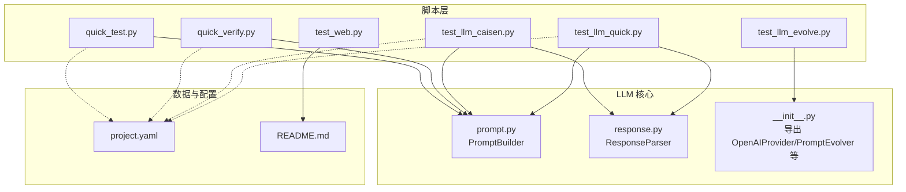
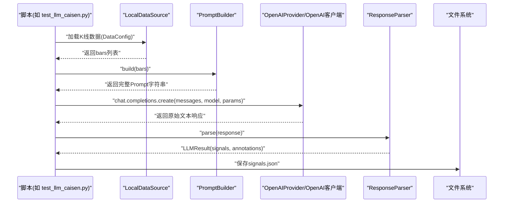
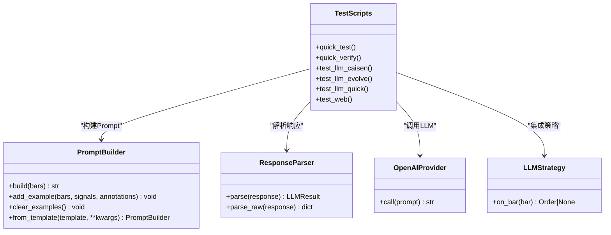

# 辅助脚本集

<cite>
**本文引用的文件**   
- [scripts/quick_test.py](file://scripts/quick_test.py)
- [scripts/quick_verify.py](file://scripts/quick_verify.py)
- [scripts/test_llm_caisen.py](file://scripts/test_llm_caisen.py)
- [scripts/test_llm_evolve.py](file://scripts/test_llm_evolve.py)
- [scripts/test_llm_quick.py](file://scripts/test_llm_quick.py)
- [scripts/test_web.py](file://scripts/test_web.py)
- [src/caisen/strategy/llm/__init__.py](file://src/caisen/strategy/llm/__init__.py)
- [src/caisen/strategy/llm/prompt.py](file://src/caisen/strategy/llm/prompt.py)
- [src/caisen/strategy/llm/response.py](file://src/caisen/strategy/llm/response.py)
- [configs/project.yaml](file://configs/project.yaml)
- [README.md](file://README.md)
</cite>

## 目录
1. [简介](#简介)
2. [项目结构](#项目结构)
3. [核心组件](#核心组件)
4. [架构总览](#架构总览)
5. [详细组件分析](#详细组件分析)
6. [依赖关系分析](#依赖关系分析)
7. [性能与稳定性考量](#性能与稳定性考量)
8. [故障排查指南](#故障排查指南)
9. [结论](#结论)
10. [附录：使用与扩展指南](#附录使用与扩展指南)

## 简介
本技术文档聚焦于 Caisen 项目的“辅助脚本集”，覆盖快速测试、验证、LLM 策略集成与演化、以及 Web 服务测试等关键脚本。文档旨在帮助开发者快速理解各脚本的职责、参数配置、输出结果解读，并提供定制与扩展建议，以便将脚本纳入自动化测试流程。

## 项目结构
辅助脚本位于 scripts 目录，围绕 LLM 策略的端到端验证与调试展开；同时提供 Web 服务的端到端 UI 测试。核心 LLM 能力（Prompt 构建、响应解析、缓存与进化）由 src/caisen/strategy/llm 模块提供。

图表来源
- [scripts/quick_test.py:1-114](file://scripts/quick_test.py#L1-L114)
- [scripts/quick_verify.py:1-113](file://scripts/quick_verify.py#L1-L113)
- [scripts/test_llm_caisen.py:1-138](file://scripts/test_llm_caisen.py#L1-L138)
- [scripts/test_llm_evolve.py:1-30](file://scripts/test_llm_evolve.py#L1-L30)
- [scripts/test_llm_quick.py:1-107](file://scripts/test_llm_quick.py#L1-L107)
- [scripts/test_web.py:1-67](file://scripts/test_web.py#L1-L67)
- [src/caisen/strategy/llm/prompt.py:1-153](file://src/caisen/strategy/llm/prompt.py#L1-L153)
- [src/caisen/strategy/llm/response.py:1-128](file://src/caisen/strategy/llm/response.py#L1-L128)
- [src/caisen/strategy/llm/__init__.py:1-19](file://src/caisen/strategy/llm/__init__.py#L1-L19)
- [configs/project.yaml:1-13](file://configs/project.yaml#L1-L13)
- [README.md:1-396](file://README.md#L1-L396)

章节来源
- [README.md:1-396](file://README.md#L1-L396)
- [configs/project.yaml:1-13](file://configs/project.yaml#L1-L13)

## 核心组件
本节概述辅助脚本集的核心职责与交互方式：
- quick_test.py：快速环境验证与基础功能测试，加载本地 K 线数据，构造 Prompt，调用本地 LLM 并保存信号结果。
- quick_verify.py：快速验证 Prompt 效果，选取特定时间窗口数据进行端到端验证，输出统计摘要与结果文件。
- test_llm_caisen.py：蔡森形态策略集成测试，基于官方 Prompt 模板进行完整调用与结果持久化。
- test_llm_evolve.py：Prompt 快速进化测试，利用 OpenAIProvider 与 quick_evolution 对 Prompt 进行迭代优化。
- test_llm_quick.py：快速验证 LLM 策略链路（Provider、PromptBuilder、ResponseParser、LLMStrategy）。
- test_web.py：启动 Web 服务并使用 Playwright 进行页面与图表的端到端验证。

章节来源
- [scripts/quick_test.py:1-114](file://scripts/quick_test.py#L1-L114)
- [scripts/quick_verify.py:1-113](file://scripts/quick_verify.py#L1-L113)
- [scripts/test_llm_caisen.py:1-138](file://scripts/test_llm_caisen.py#L1-L138)
- [scripts/test_llm_evolve.py:1-30](file://scripts/test_llm_evolve.py#L1-L30)
- [scripts/test_llm_quick.py:1-107](file://scripts/test_llm_quick.py#L1-L107)
- [scripts/test_web.py:1-67](file://scripts/test_web.py#L1-L67)

## 架构总览
以下序列图展示典型 LLM 策略调用链：数据加载 → Prompt 构建 → LLM 调用 → 响应解析 → 结果持久化。

图表来源
- [scripts/test_llm_caisen.py:1-138](file://scripts/test_llm_caisen.py#L1-L138)
- [src/caisen/strategy/llm/prompt.py:1-153](file://src/caisen/strategy/llm/prompt.py#L1-L153)
- [src/caisen/strategy/llm/response.py:1-128](file://src/caisen/strategy/llm/response.py#L1-L128)

## 详细组件分析

### quick_test.py：快速测试与环境验证
- 目标：在最小依赖下验证数据加载、Prompt 组装、LLM 调用与结果保存是否可用。
- 主要流程：
  - 清理可能冲突的模块后，添加项目路径以导入数据模块。
  - 通过 DataConfig 和 LocalDataSource 加载指定品种与周期的 K 线。
  - 读取 Prompt 模板文件，提取系统提示、规则框架、输出格式与示例模板。
  - 截取最近若干根 K 线，构造 JSON 并拼装为最终 Prompt。
  - 使用 OpenAI 兼容客户端调用本地 LLM 服务，解析返回的 JSON 信号，打印摘要并保存到 runs 目录。
- 关键参数与行为：
  - 数据目录、品种、周期、样本长度、模型名称、温度与最大 token 数。
  - 自动从 markdown 代码块或纯 JSON 中提取信号，支持容错处理。
- 输出：
  - 控制台打印 Prompt 长度、响应预览、信号统计与样例。
  - 生成 last_signals.json 到 runs/llm_caisen_test。

章节来源
- [scripts/quick_test.py:1-114](file://scripts/quick_test.py#L1-L114)

### quick_verify.py：快速验证与数据完整性检查
- 目标：针对特定时间窗口验证 Prompt 效果，便于快速定位问题。
- 主要流程：
  - 读取 Prompt 模板并提取必要片段。
  - 按起止日期加载数据，取中间一段有波动的 K 线作为测试集。
  - 构造 Prompt 并调用本地 LLM，解析信号并统计买卖数量。
  - 保存包含测试范围、信号列表与原始响应截断的 quick_verify.json。
- 适用场景：
  - Prompt 调优后的回归验证。
  - 不同行情区间的稳定性评估。

章节来源
- [scripts/quick_verify.py:1-113](file://scripts/quick_verify.py#L1-L113)

### test_llm_caisen.py：蔡森策略集成测试
- 目标：基于官方 Prompt 模板执行完整的 LLM 策略调用，验证端到端可用性。
- 主要流程：
  - 使用 DataConfig 加载指定区间数据，限制样本量以避免 token 过多。
  - 从 prompts.caisen_pattern 导入系统提示、规则框架、输出格式与示例模板。
  - 调用本地 LLM，解析 JSON 信号，统计买卖信号数量。
  - 以时间戳命名保存 signals.json 到 runs/llm_caisen_test。
- 错误处理：
  - 捕获 JSON 解析异常并打印原始响应前缀，便于调试。
  - 捕获网络或客户端异常并打印堆栈。

章节来源
- [scripts/test_llm_caisen.py:1-138](file://scripts/test_llm_caisen.py#L1-L138)

### test_llm_evolve.py：Prompt 演化测试
- 目标：快速验证 Prompt 进化能力，选择最优 Prompt 提升信号质量。
- 主要流程：
  - 准备少量模拟 K 线数据。
  - 创建 OpenAIProvider 客户端，调用 quick_evolution 进行多轮进化。
  - 输出最佳评分与最优 Prompt 文本。
- 关键点：
  - 依赖 llm 模块导出的 OpenAIProvider 与 quick_evolution。
  - 适合在离线环境下进行 Prompt 搜索与对比。

章节来源
- [scripts/test_llm_evolve.py:1-30](file://scripts/test_llm_evolve.py#L1-L30)
- [src/caisen/strategy/llm/__init__.py:1-19](file://src/caisen/strategy/llm/__init__.py#L1-L19)

### test_llm_quick.py：快速验证 LLM 策略链路
- 目标：验证 Provider、PromptBuilder、ResponseParser 与 LLMStrategy 的协作。
- 主要流程：
  - 初始化 OpenAIProvider 指向本地端点。
  - 使用 PromptBuilder 构建 Prompt，调用 client.call 获取响应。
  - 使用 ResponseParser 解析响应，校验 signals 与 annotations。
  - 组合 LLMStrategy，模拟 on_init/on_bar 流程，观察订单输出。
- 输出：
  - 分步打印各阶段状态与结果，便于定位问题。

章节来源
- [scripts/test_llm_quick.py:1-107](file://scripts/test_llm_quick.py#L1-L107)
- [src/caisen/strategy/llm/prompt.py:1-153](file://src/caisen/strategy/llm/prompt.py#L1-L153)
- [src/caisen/strategy/llm/response.py:1-128](file://src/caisen/strategy/llm/response.py#L1-L128)

### test_web.py：Web 服务与前端页面验证
- 目标：启动后端服务并通过 Playwright 进行端到端 UI 测试。
- 主要流程：
  - 启动 caisen.cli.main 的 web 子命令，监听指定端口。
  - 打开主页面，等待网络空闲，检查标题与运行卡片是否存在。
  - 点击运行卡片进入报告页，检查图表元素是否存在。
  - 截图保存用于可视化验证。
- 注意事项：
  - 需要安装 playwright 驱动与浏览器。
  - 确保 runs 目录下存在可渲染的回测结果。

章节来源
- [scripts/test_web.py:1-67](file://scripts/test_web.py#L1-L67)
- [README.md:1-396](file://README.md#L1-L396)

## 依赖关系分析
- 脚本层依赖：
  - data.local_source 与 data.config 用于加载本地 Parquet 数据。
  - strategy.llm 模块提供 Prompt 构建、响应解析、Provider 与进化能力。
  - openai 兼容客户端用于调用本地 LLM 服务。
- 配置与路径：
  - project.yaml 定义数据目录、输出目录与 API 端口。
  - 脚本中多处硬编码路径需与项目实际部署一致。

图表来源
- [src/caisen/strategy/llm/prompt.py:1-153](file://src/caisen/strategy/llm/prompt.py#L1-L153)
- [src/caisen/strategy/llm/response.py:1-128](file://src/caisen/strategy/llm/response.py#L1-L128)
- [src/caisen/strategy/llm/__init__.py:1-19](file://src/caisen/strategy/llm/__init__.py#L1-L19)
- [scripts/test_llm_quick.py:1-107](file://scripts/test_llm_quick.py#L1-L107)

章节来源
- [src/caisen/strategy/llm/__init__.py:1-19](file://src/caisen/strategy/llm/__init__.py#L1-L19)
- [src/caisen/strategy/llm/prompt.py:1-153](file://src/caisen/strategy/llm/prompt.py#L1-L153)
- [src/caisen/strategy/llm/response.py:1-128](file://src/caisen/strategy/llm/response.py#L1-L128)
- [scripts/test_llm_quick.py:1-107](file://scripts/test_llm_quick.py#L1-L107)

## 性能与稳定性考量
- Prompt 长度控制：
  - 脚本默认限制样本 K 线数量，避免 token 超限导致响应截断。
  - PromptBuilder 支持关闭内置示例以减少推理模型的 thinking token 消耗。
- 响应解析鲁棒性：
  - ResponseParser 支持多种提取策略（纯 JSON、markdown 代码块、截断降级），提高成功率。
- 并发与批处理：
  - 当前脚本为单进程顺序执行，如需批量验证可扩展为并行任务队列。
- I/O 与存储：
  - 结果写入 runs 目录，注意磁盘空间与文件命名冲突（使用时间戳避免覆盖）。

[本节为通用指导，不直接分析具体文件]

## 故障排查指南
- 无法加载数据：
  - 检查 data_dir 与 symbol/freq 目录结构是否符合要求。
  - 确认 parquet 文件列名与类型正确。
- LLM 调用失败：
  - 确认本地 LLM 服务地址与模型名称正确。
  - 检查网络连接与权限，必要时降低 temperature 或 max_tokens。
- 响应解析失败：
  - 查看原始响应前缀，确认是否为合法 JSON 或包含思考过程被截断。
  - 调整 Prompt 减少复杂描述，或增加 max_tokens。
- Web 测试失败：
  - 确认 playwright 已安装且浏览器可用。
  - 检查 runs 目录是否存在可渲染的结果，端口未被占用。

章节来源
- [scripts/quick_test.py:1-114](file://scripts/quick_test.py#L1-L114)
- [scripts/quick_verify.py:1-113](file://scripts/quick_verify.py#L1-L113)
- [scripts/test_llm_caisen.py:1-138](file://scripts/test_llm_caisen.py#L1-L138)
- [scripts/test_llm_quick.py:1-107](file://scripts/test_llm_quick.py#L1-L107)
- [scripts/test_web.py:1-67](file://scripts/test_web.py#L1-L67)
- [src/caisen/strategy/llm/response.py:1-128](file://src/caisen/strategy/llm/response.py#L1-L128)

## 结论
辅助脚本集覆盖了从环境验证、Prompt 效果验证、LLM 策略集成与演化，到 Web 服务端到端测试的全链路需求。通过合理配置与扩展，可将这些脚本无缝接入 CI/CD，实现持续的质量保障与快速反馈。

[本节为总结性内容，不直接分析具体文件]

## 附录：使用与扩展指南

### 使用场景与参数配置
- quick_test.py
  - 场景：首次部署或环境变更后快速自检。
  - 关键参数：数据目录、品种、周期、样本长度、模型名称、温度、max_tokens。
  - 输出：last_signals.json 与控制台摘要。
- quick_verify.py
  - 场景：Prompt 调优后的回归验证。
  - 关键参数：起止日期、样本窗口。
  - 输出：quick_verify.json 与统计信息。
- test_llm_caisen.py
  - 场景：蔡森形态策略集成测试。
  - 关键参数：数据区间、样本量、模型与参数。
  - 输出：带时间戳的 signals.json。
- test_llm_evolve.py
  - 场景：Prompt 快速进化与对比。
  - 关键参数：迭代次数、模型与端点。
  - 输出：最佳评分与最优 Prompt。
- test_llm_quick.py
  - 场景：快速验证 LLM 策略链路。
  - 关键参数：Provider 端点、Prompt 规则、解析器配置。
  - 输出：分步日志与订单输出。
- test_web.py
  - 场景：Web 服务与前端页面验证。
  - 关键参数：端口、浏览器选项。
  - 输出：截图与测试结果。

章节来源
- [scripts/quick_test.py:1-114](file://scripts/quick_test.py#L1-L114)
- [scripts/quick_verify.py:1-113](file://scripts/quick_verify.py#L1-L113)
- [scripts/test_llm_caisen.py:1-138](file://scripts/test_llm_caisen.py#L1-L138)
- [scripts/test_llm_evolve.py:1-30](file://scripts/test_llm_evolve.py#L1-L30)
- [scripts/test_llm_quick.py:1-107](file://scripts/test_llm_quick.py#L1-L107)
- [scripts/test_web.py:1-67](file://scripts/test_web.py#L1-L67)

### 新测试用例添加建议
- 新增独立脚本：
  - 遵循现有脚本风格，明确输入输出与错误处理。
  - 使用统一的 runs 目录与命名规范。
- 复用核心模块：
  - 通过 PromptBuilder 与 ResponseParser 统一构建与解析逻辑。
  - 使用 OpenAIProvider 抽象 LLM 客户端，便于切换后端。
- 配置管理：
  - 将可变参数外置至配置文件或环境变量，避免硬编码。
  - 参考 project.yaml 的结构组织全局配置。

章节来源
- [src/caisen/strategy/llm/prompt.py:1-153](file://src/caisen/strategy/llm/prompt.py#L1-L153)
- [src/caisen/strategy/llm/response.py:1-128](file://src/caisen/strategy/llm/response.py#L1-L128)
- [configs/project.yaml:1-13](file://configs/project.yaml#L1-L13)

### 自动化测试集成
- 单元测试与集成测试：
  - 将 quick_verify.py 与 test_llm_quick.py 纳入 pytest 套件，设置超时与重试。
- CI/CD 流水线：
  - 在构建阶段执行 quick_test.py 进行环境自检。
  - 在发布前执行 test_llm_caisen.py 与 test_web.py 进行端到端验证。
- 产物归档：
  - 将生成的 signals.json 与截图上传为工件，便于回溯与分析。

[本节为通用指导，不直接分析具体文件]