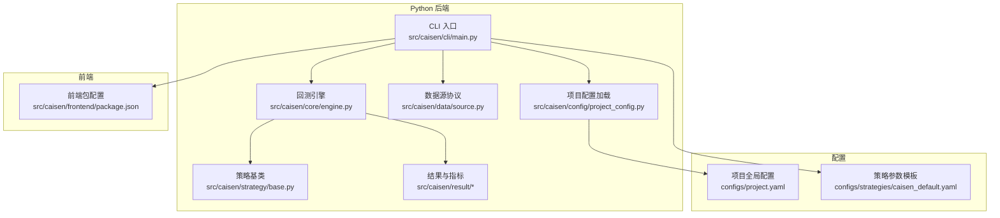
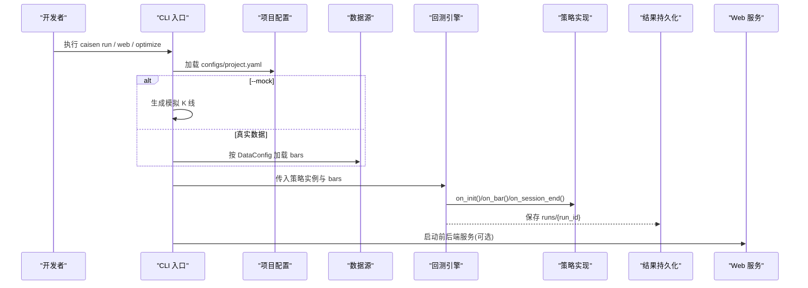
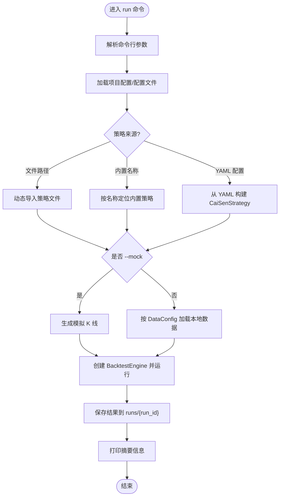
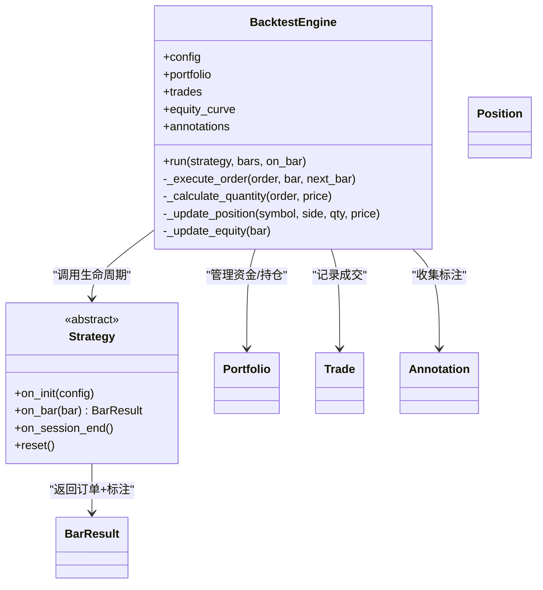
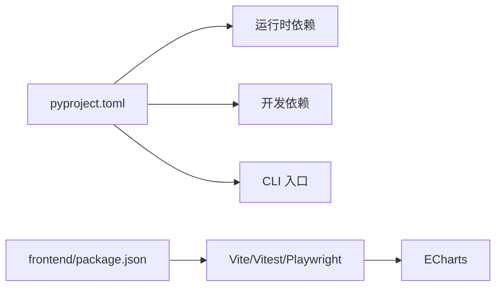

# 开发者指南

<cite>
**本文引用的文件**   
- [README.md](file://README.md)
- [pyproject.toml](file://pyproject.toml)
- [AGENTS.md](file://AGENTS.md)
- [src/caisen/__init__.py](file://src/caisen/__init__.py)
- [src/caisen/cli/main.py](file://src/caisen/cli/main.py)
- [src/caisen/core/engine.py](file://src/caisen/core/engine.py)
- [src/caisen/strategy/base.py](file://src/caisen/strategy/base.py)
- [src/caisen/config/project_config.py](file://src/caisen/config/project_config.py)
- [configs/project.yaml](file://configs/project.yaml)
- [src/caisen/data/source.py](file://src/caisen/data/source.py)
- [src/caisen/frontend/package.json](file://src/caisen/frontend/package.json)
- [tests/test_backtest_engine.py](file://tests/test_backtest_engine.py)
- [examples/ma_cross.py](file://examples/ma_cross.py)
- [configs/strategies/caisen_default.yaml](file://configs/strategies/caisen_default.yaml)
- [docs/README.md](file://docs/README.md)
</cite>

## 目录
1. [简介](#简介)
2. [项目结构](#项目结构)
3. [核心组件](#核心组件)
4. [架构总览](#架构总览)
5. [详细组件分析](#详细组件分析)
6. [依赖关系分析](#依赖关系分析)
7. [性能与可扩展性](#性能与可扩展性)
8. [开发环境与工具链](#开发环境与工具链)
9. [代码规范与风格指南](#代码规范与风格指南)
10. [文档与注释规范](#文档与注释规范)
11. [代码审查流程与质量门禁](#代码审查流程与质量门禁)
12. [版本控制与分支管理](#版本控制与分支管理)
13. [新功能开发指南](#新功能开发指南)
14. [常见问题与故障排除](#常见问题与故障排除)
15. [贡献代码流程](#贡献代码流程)
16. [结论](#结论)

## 简介
Caisen 是一个支持“代码策略 + LLM 策略”的量化回测系统，提供可视化报告（K 线、净值曲线、交易标注、形态标记）、结果持久化（Parquet）以及 CLI/Web 服务。本指南面向开发者，覆盖环境搭建、编码规范、架构设计原则、代码审查、版本控制、新功能开发、问题排查与协作贡献等全流程。

## 项目结构
- 源码位于 src/caisen，包含 CLI、回测引擎、数据源、策略、结果计算与持久化、前端可视化等模块。
- 配置集中在 configs，包括全局项目配置与策略参数模板。
- 测试位于 tests，涵盖 Python 与前端 JS 测试。
- 示例策略位于 examples，便于快速上手。
- 文档集中于 docs，含 ADR、平台与策略问题记录等。

图表来源
- [src/caisen/cli/main.py:1-371](file://src/caisen/cli/main.py#L1-L371)
- [src/caisen/core/engine.py:1-210](file://src/caisen/core/engine.py#L1-L210)
- [src/caisen/strategy/base.py:1-37](file://src/caisen/strategy/base.py#L1-L37)
- [src/caisen/data/source.py:1-62](file://src/caisen/data/source.py#L1-L62)
- [src/caisen/config/project_config.py:1-56](file://src/caisen/config/project_config.py#L1-L56)
- [configs/project.yaml:1-13](file://configs/project.yaml#L1-L13)
- [src/caisen/frontend/package.json:1-26](file://src/caisen/frontend/package.json#L1-L26)
- [configs/strategies/caisen_default.yaml:1-50](file://configs/strategies/caisen_default.yaml#L1-L50)

章节来源
- [README.md:1-396](file://README.md#L1-L396)
- [pyproject.toml:1-59](file://pyproject.toml#L1-L59)

## 核心组件
- CLI 主入口：提供 run、list-runs、show-result、web、optimize 等命令，负责参数解析、策略加载、数据加载、引擎运行与结果保存。
- 回测引擎：驱动策略逐 bar 执行，处理订单执行、滑点与手续费、持仓与现金更新、净值曲线生成与标注收集。
- 策略基类：定义 on_init/on_bar/on_session_end/reset 生命周期钩子，约定 BarResult 返回契约。
- 数据源协议：定义 DataSource Protocol 与 BaseDataSource 抽象，便于扩展不同数据源。
- 项目配置：从 configs/project.yaml 加载全局配置，缺失字段回退默认值。
- 前端：基于 Vite + ECharts，提供可视化报告页面与脚本命令。

章节来源
- [src/caisen/cli/main.py:1-371](file://src/caisen/cli/main.py#L1-L371)
- [src/caisen/core/engine.py:1-210](file://src/caisen/core/engine.py#L1-L210)
- [src/caisen/strategy/base.py:1-37](file://src/caisen/strategy/base.py#L1-L37)
- [src/caisen/data/source.py:1-62](file://src/caisen/data/source.py#L1-L62)
- [src/caisen/config/project_config.py:1-56](file://src/caisen/config/project_config.py#L1-L56)
- [src/caisen/frontend/package.json:1-26](file://src/caisen/frontend/package.json#L1-L26)

## 架构总览
整体采用“CLI 编排 + 引擎驱动 + 策略插件 + 数据源协议 + 结果持久化 + 前端可视化”的分层架构。CLI 作为统一入口，组合配置、数据、策略与引擎；引擎负责时序推进与撮合；策略以插件方式接入；数据源通过协议解耦；结果以 Parquet/JSON 持久化；前端通过 API 消费结果并渲染。

图表来源
- [src/caisen/cli/main.py:1-371](file://src/caisen/cli/main.py#L1-L371)
- [src/caisen/config/project_config.py:1-56](file://src/caisen/config/project_config.py#L1-L56)
- [src/caisen/core/engine.py:1-210](file://src/caisen/core/engine.py#L1-L210)
- [src/caisen/strategy/base.py:1-37](file://src/caisen/strategy/base.py#L1-L37)

## 详细组件分析

### CLI 主入口（caisen.cli.main）
- 功能要点
  - 命令组 cli 下挂载 run/list-runs/show-result/web/optimize 子命令。
  - run 支持内置策略名或文件路径加载，支持策略 YAML 配置注入（如 CaiSenStrategy）。
  - mock 模式自动生成 K 线用于快速验证。
  - web 命令同时启动 FastAPI 后端与 Vite 前端，设置 VITE_API_PROXY 代理到后端端口。
  - optimize 命令对蔡森策略进行网格搜索，输出最优配置 YAML。
- 关键流程
  - 参数解析 → 配置加载 → 策略加载 → 数据加载 → 引擎运行 → 结果保存 → 控制台输出。
- 错误处理
  - 数据未找到时提示使用 --mock；策略导入失败给出明确错误信息并退出。

图表来源
- [src/caisen/cli/main.py:1-371](file://src/caisen/cli/main.py#L1-L371)

章节来源
- [src/caisen/cli/main.py:1-371](file://src/caisen/cli/main.py#L1-L371)

### 回测引擎（BacktestEngine）
- 职责
  - 维护 Portfolio、Trades、EquityCurve、Annotations。
  - 驱动策略 on_bar 决策，兼容旧版 Order/None 返回与新版 BarResult。
  - 执行订单：计算成交价（考虑滑点）、数量（全仓/比例）、手续费，更新持仓与现金。
  - 每根 bar 后更新净值曲线，最终汇总 BacktestResult。
- 复杂度
  - 时间 O(N)，N 为 bars 数量；空间 O(N) 存储净值曲线与交易记录。
- 可优化点
  - 批量净值计算、向量化指标计算、惰性写入大文件。

图表来源
- [src/caisen/core/engine.py:1-210](file://src/caisen/core/engine.py#L1-L210)
- [src/caisen/strategy/base.py:1-37](file://src/caisen/strategy/base.py#L1-L37)

章节来源
- [src/caisen/core/engine.py:1-210](file://src/caisen/core/engine.py#L1-L210)
- [src/caisen/strategy/base.py:1-37](file://src/caisen/strategy/base.py#L1-L37)

### 策略基类与示例
- 基类约定
  - on_init：回测前初始化。
  - on_bar：每根 bar 返回 BarResult（含 Order 与 Annotations），兼容旧版返回 Order/None。
  - on_session_end：回测结束后清理。
  - reset：重置状态以便重复运行。
- 示例策略
  - MACrossStrategy：均线金叉死叉，演示 quantity=0 的全仓下单语义。

章节来源
- [src/caisen/strategy/base.py:1-37](file://src/caisen/strategy/base.py#L1-L37)
- [examples/ma_cross.py:1-45](file://examples/ma_cross.py#L1-L45)

### 数据源协议与扩展
- 协议
  - DataSource Protocol 定义 load(DataConfig) -> List[Bar] 与 name 属性。
  - BaseDataSource 提供通用实现骨架。
- 扩展建议
  - 自定义数据源需实现 Protocol，并通过 Entry Points 注册（见 README 相关说明）。

章节来源
- [src/caisen/data/source.py:1-62](file://src/caisen/data/source.py#L1-L62)
- [README.md:1-396](file://README.md#L1-L396)

### 项目配置加载
- 行为
  - 从 configs/project.yaml 读取 data_dir/output_dir/api_port，不存在则静默回退默认值。
  - 自动推断项目根目录，避免硬编码路径。
- 使用场景
  - CLI 在 run/web/optimize 中读取全局配置，确保一致的数据与输出路径。

章节来源
- [src/caisen/config/project_config.py:1-56](file://src/caisen/config/project_config.py#L1-L56)
- [configs/project.yaml:1-13](file://configs/project.yaml#L1-L13)

### 前端可视化
- 技术栈
  - Vite 开发服务器，ECharts 渲染图表，Vitest 单元测试，Playwright E2E。
- 脚本
  - dev/build/preview/test/e2e 等命令，便于开发与发布。
- 集成
  - CLI web 命令设置 VITE_API_PROXY 指向后端 FastAPI，实现前后端联调。

章节来源
- [src/caisen/frontend/package.json:1-26](file://src/caisen/frontend/package.json#L1-L26)
- [src/caisen/cli/main.py:235-295](file://src/caisen/cli/main.py#L235-L295)

## 依赖关系分析
- 构建与打包
  - 使用 hatchling 构建 wheel，暴露 caisen CLI 入口。
  - 可选依赖 dev 包含 pytest、pytest-cov、vitest、ruff。
- 运行时依赖
  - pyyaml、pandas、pyarrow、click、fastapi、uvicorn、websockets。
- 前端依赖
  - echarts 运行时，vite/vitest/playwright 开发测试工具。

图表来源
- [pyproject.toml:1-59](file://pyproject.toml#L1-L59)
- [src/caisen/frontend/package.json:1-26](file://src/caisen/frontend/package.json#L1-L26)

章节来源
- [pyproject.toml:1-59](file://pyproject.toml#L1-L59)
- [src/caisen/frontend/package.json:1-26](file://src/caisen/frontend/package.json#L1-L26)

## 性能与可扩展性
- 回测性能
  - 单进程顺序遍历 bars，适合中小规模数据；大规模数据可考虑并行分片与聚合。
- 内存占用
  - 净值曲线与交易记录随 N 线性增长，建议按需采样或流式持久化。
- 可扩展性
  - 数据源通过 Protocol 解耦，易于接入多种数据格式与远程源。
  - 策略通过基类与 BarResult 契约扩展，支持复杂标注与多信号。

## 开发环境与工具链
- 环境要求
  - Python >= 3.10，pip。
- 安装与入口
  - 开发模式安装后，可通过 caisen CLI 运行。
- 前端开发
  - 进入 src/caisen/frontend，使用 npm/yarn/pnpm 安装依赖后运行 dev。
- 调试
  - CLI 支持 --mock 快速验证；web 命令同时启动前后端，便于联调。

章节来源
- [README.md:1-396](file://README.md#L1-L396)
- [pyproject.toml:1-59](file://pyproject.toml#L1-L59)
- [src/caisen/frontend/package.json:1-26](file://src/caisen/frontend/package.json#L1-L26)

## 代码规范与风格指南
- Python
  - 使用 ruff 进行 lint 与格式化，启用 pyflakes/pycodestyle/isort/pyupgrade/flake8-bugbear 规则集。
  - __init__.py 允许空导出（F401 忽略）。
  - 行长度限制已放宽（E501 忽略），但建议保持可读性。
- JavaScript
  - 使用 Vitest 进行单元测试，Playwright 进行端到端测试。
  - 遵循模块化组织，命名清晰，避免全局污染。
- 类型与接口
  - 优先使用 typing 注解；数据模型使用 dataclass。
  - 对外暴露稳定的 Protocol/ABC 接口，降低耦合。

章节来源
- [pyproject.toml:32-50](file://pyproject.toml#L32-L50)
- [src/caisen/data/source.py:1-62](file://src/caisen/data/source.py#L1-L62)
- [src/caisen/strategy/base.py:1-37](file://src/caisen/strategy/base.py#L1-L37)

## 文档与注释规范
- 模块级 docstring 描述职责与用法。
- 函数/方法 docstring 说明参数、返回值与异常。
- 公共接口（Protocol/ABC）需补充使用示例与约束说明。
- 配置项需在 YAML 中附带注释，解释取值范围与影响。

章节来源
- [src/caisen/config/project_config.py:1-56](file://src/caisen/config/project_config.py#L1-L56)
- [configs/strategies/caisen_default.yaml:1-50](file://configs/strategies/caisen_default.yaml#L1-L50)

## 代码审查流程与质量门禁
- 提交前自检
  - 运行 ruff 检查与格式化。
  - 运行 pytest 与 vitest 测试套件。
  - 必要时生成覆盖率报告。
- PR 检查清单
  - 变更是否新增/修改了公共接口？是否有向后兼容说明？
  - 是否补充/更新了相关文档与 ADR？
  - 是否覆盖了关键用例与边界条件？
  - 性能回归是否评估？
- 自动化门禁
  - CI 应包含 lint、unit test、e2e test、覆盖率阈值检查。

章节来源
- [pyproject.toml:24-31](file://pyproject.toml#L24-L31)
- [docs/README.md:1-45](file://docs/README.md#L1-L45)

## 版本控制与分支管理
- 分支策略
  - main：稳定发布分支。
  - develop：集成开发分支。
  - feature/*：新功能分支。
  - fix/*：缺陷修复分支。
  - release/*：预发布分支。
- 提交规范
  - 使用约定式提交（feat/fix/docs/chore 等），便于生成变更日志。
- 标签与发布
  - 使用语义化版本（MAJOR.MINOR.PATCH），打 tag 并附变更说明。

## 新功能开发指南
- 需求分析
  - 明确目标用户、输入输出、约束与验收标准。
- 设计文档
  - 在 docs/adr 中记录架构决策与权衡。
  - 若涉及 UI，补充前端交互与数据契约。
- 实现步骤
  - 新建 feature 分支，先写最小可用原型。
  - 编写单元测试与 E2E 用例，保证契约稳定。
  - 更新配置与文档，确保可复现。
- 测试要求
  - 覆盖正常路径与异常路径；边界条件与并发安全（如涉及）。
  - 性能基准测试（如涉及大数据量）。
- 上线准备
  - 更新 README/usage-guide，完善 CLI 帮助与错误提示。
  - 发布前完成回归测试与兼容性检查。

## 常见问题与故障排除
- CLI 找不到命令
  - 确认 PATH 包含 ~/.local/bin，或使用完整路径执行。
- 数据未找到
  - 使用 --mock 快速验证；或检查 configs/project.yaml 的 data_dir 与数据目录结构。
- 策略未加载
  - 确认策略类继承自 Strategy，且名称匹配；或提供文件路径。
- 前端无法访问后端
  - 检查 web 命令输出的前后端端口与 VITE_API_PROXY 设置。
- 优化任务过慢
  - 调整 optimize 的 workers/top-n 与搜索空间，减少参数组合。

章节来源
- [README.md:1-396](file://README.md#L1-L396)
- [src/caisen/cli/main.py:1-371](file://src/caisen/cli/main.py#L1-L371)
- [configs/project.yaml:1-13](file://configs/project.yaml#L1-L13)

## 贡献代码流程
- Fork 仓库并在本地克隆。
- 创建 feature 分支，遵循提交规范。
- 编写/更新测试与文档，确保本地通过所有检查。
- 推送并提交 PR，填写变更说明与关联 Issue。
- 响应评审意见，合并至 develop/main。

## 结论
Caisen 以清晰的模块化与协议化设计，提供了可扩展的回测框架与友好的可视化体验。遵循本指南的环境搭建、编码规范、审查流程与版本管理，将显著提升团队协作效率与交付质量。