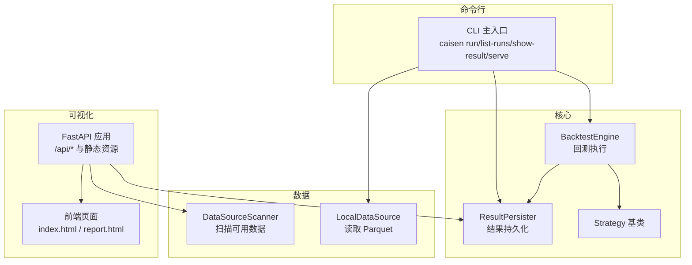
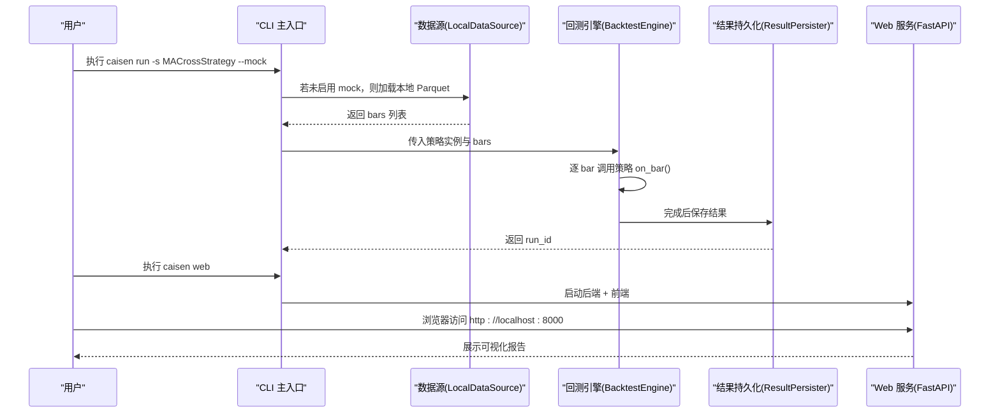
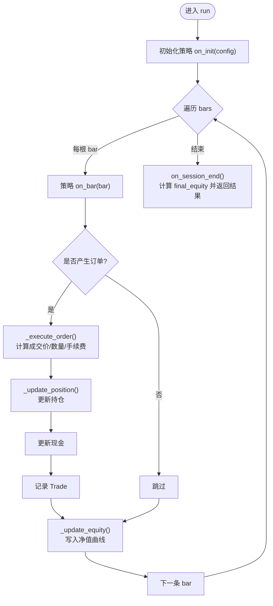
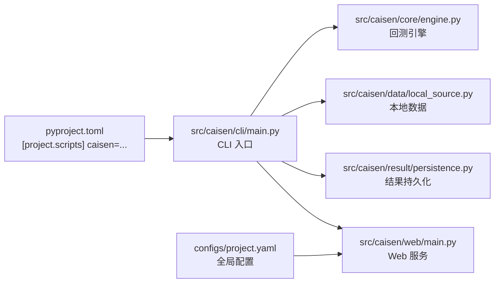

# 快速开始

<cite>
**本文引用的文件**   
- [README.md](file://README.md)
- [pyproject.toml](file://pyproject.toml)
- [configs/project.yaml](file://configs/project.yaml)
- [src/caisen/cli/main.py](file://src/caisen/cli/main.py)
- [examples/ma_cross.py](file://examples/ma_cross.py)
- [src/caisen/core/engine.py](file://src/caisen/core/engine.py)
- [src/caisen/strategy/base.py](file://src/caisen/strategy/base.py)
- [src/caisen/data/local_source.py](file://src/caisen/data/local_source.py)
- [src/caisen/result/persistence.py](file://src/caisen/result/persistence.py)
- [src/caisen/web/main.py](file://src/caisen/web/main.py)
- [configs/strategies/caisen_default.yaml](file://configs/strategies/caisen_default.yaml)
- [examples/caisen_strategy_template.yaml](file://examples/caisen_strategy_template.yaml)
- [scripts/quick_test.py](file://scripts/quick_test.py)
</cite>

## 目录
1. [简介](#简介)
2. [项目结构](#项目结构)
3. [核心组件](#核心组件)
4. [架构总览](#架构总览)
5. [详细组件分析](#详细组件分析)
6. [依赖关系分析](#依赖关系分析)
7. [性能与注意事项](#性能与注意事项)
8. [故障排除指南](#故障排除指南)
9. [结论](#结论)
10. [附录：常用命令与参数](#附录常用命令与参数)

## 简介
本指南面向首次接触 Caisen 量化回测系统的用户，目标是在 30 分钟内完成环境安装、配置、运行内置策略并查看可视化报告。内容覆盖：
- Python 环境与依赖安装
- PATH 配置与 CLI 验证
- 使用模拟数据快速回测
- 使用本地真实数据回测（Parquet）
- 启动可视化服务并查看结果
- 常见问题排查与预期输出示例

## 项目结构
Caisen 采用模块化设计，CLI 入口统一暴露命令行工具，核心引擎负责回测执行，数据模块支持本地 Parquet 读取，结果持久化生成前端可视化所需的数据文件，Web 服务提供可视化页面与 API。

图表来源
- [src/caisen/cli/main.py:63-191](file://src/caisen/cli/main.py#L63-L191)
- [src/caisen/core/engine.py:19-91](file://src/caisen/core/engine.py#L19-L91)
- [src/caisen/strategy/base.py:19-37](file://src/caisen/strategy/base.py#L19-L37)
- [src/caisen/data/local_source.py:15-80](file://src/caisen/data/local_source.py#L15-L80)
- [src/caisen/result/persistence.py:62-136](file://src/caisen/result/persistence.py#L62-L136)
- [src/caisen/web/main.py:52-286](file://src/caisen/web/main.py#L52-L286)

章节来源
- [README.md:291-320](file://README.md#L291-L320)
- [pyproject.toml:21-22](file://pyproject.toml#L21-L22)

## 核心组件
- CLI 主入口：提供 run、list-runs、show-result、web 等命令，封装策略加载、数据获取、回测执行与结果展示。
- 回测引擎：驱动策略逐根 K 线处理，计算成交、持仓、净值曲线，并收集标注。
- 策略基类：定义 on_init/on_bar/on_session_end/reset 生命周期接口，兼容旧版返回 Order 的写法。
- 数据源：从本地 Parquet 按 symbol/freq/date 结构读取，支持单日期或日期范围命名。
- 结果持久化：保存 meta.json、metrics.json、equity/trades/bars.parquet、annotations.json 以及 data.json 供前端渲染。
- Web 服务：FastAPI 提供数据源扫描、策略列表、回测任务触发、进度推送与可视化数据接口。

章节来源
- [src/caisen/cli/main.py:63-191](file://src/caisen/cli/main.py#L63-L191)
- [src/caisen/core/engine.py:19-91](file://src/caisen/core/engine.py#L19-L91)
- [src/caisen/strategy/base.py:19-37](file://src/caisen/strategy/base.py#L19-L37)
- [src/caisen/data/local_source.py:15-80](file://src/caisen/data/local_source.py#L15-L80)
- [src/caisen/result/persistence.py:62-136](file://src/caisen/result/persistence.py#L62-L136)
- [src/caisen/web/main.py:52-286](file://src/caisen/web/main.py#L52-L286)

## 架构总览
下图展示了“命令行 -> 引擎 -> 数据 -> 结果 -> Web”的端到端流程。

图表来源
- [src/caisen/cli/main.py:63-191](file://src/caisen/cli/main.py#L63-L191)
- [src/caisen/core/engine.py:33-91](file://src/caisen/core/engine.py#L33-L91)
- [src/caisen/result/persistence.py:62-136](file://src/caisen/result/persistence.py#L62-L136)
- [src/caisen/web/main.py:235-295](file://src/caisen/web/main.py#L235-L295)

## 详细组件分析

### CLI 主入口（run/list-runs/show-result/web）
- run：解析参数，加载策略（支持内置名称、文件路径、配置文件），选择 mock 或本地数据，执行回测并打印关键指标；保存结果后输出 run_id。
- list-runs：列出 runs 目录下所有有效记录。
- show-result：根据 run_id 加载并打印绩效摘要。
- web：同时启动 FastAPI 后端与 Vite 前端，支持直接打开指定 run_id。

章节来源
- [src/caisen/cli/main.py:63-191](file://src/caisen/cli/main.py#L63-L191)
- [src/caisen/cli/main.py:193-233](file://src/caisen/cli/main.py#L193-L233)
- [src/caisen/cli/main.py:235-295](file://src/caisen/cli/main.py#L235-L295)

### 回测引擎（BacktestEngine）
- 初始化组合与交易记录容器，设置初始资金。
- 对每根 bar 调用策略 on_bar，兼容 BarResult 与旧版 Order 返回。
- 订单执行考虑滑点与手续费，更新持仓与现金，记录成交。
- 每步更新净值曲线，最终返回包含 bars、trades、equity_curve、annotations 的结果对象。

图表来源
- [src/caisen/core/engine.py:33-91](file://src/caisen/core/engine.py#L33-L91)
- [src/caisen/core/engine.py:93-209](file://src/caisen/core/engine.py#L93-L209)

章节来源
- [src/caisen/core/engine.py:19-91](file://src/caisen/core/engine.py#L19-L91)
- [src/caisen/core/engine.py:93-209](file://src/caisen/core/engine.py#L93-L209)

### 策略基类与示例策略
- 基类定义 on_init/on_bar/on_session_end/reset 生命周期，导出 Annotation/AnnotationType/BarResult 以便策略扩展标注。
- 示例均线交叉策略演示了基于价格序列计算均线并产生买卖信号的基本模式。

章节来源
- [src/caisen/strategy/base.py:19-37](file://src/caisen/strategy/base.py#L19-L37)
- [examples/ma_cross.py:10-45](file://examples/ma_cross.py#L10-L45)

### 数据源（LocalDataSource）
- 读取约定目录 {data_dir}/{symbol}/{freq}/*.parquet，文件名可为单日期或起止日期范围。
- 列名支持中英文混写映射，校验必要字段并转换为 Bar 对象。
- 支持按 start/end 过滤时间范围。

章节来源
- [src/caisen/data/local_source.py:15-80](file://src/caisen/data/local_source.py#L15-L80)
- [src/caisen/data/local_source.py:139-199](file://src/caisen/data/local_source.py#L139-L199)

### 结果持久化（ResultPersister）
- 生成唯一 run_id（策略名_日期_序号），保存 meta/metrics/equity/trades/bars/annotations 及 data.json。
- 提供 load/list_runs/save_visualization 等方法，便于 CLI 与 Web 复用。

章节来源
- [src/caisen/result/persistence.py:16-43](file://src/caisen/result/persistence.py#L16-L43)
- [src/caisen/result/persistence.py:62-136](file://src/caisen/result/persistence.py#L62-L136)
- [src/caisen/result/persistence.py:206-277](file://src/caisen/result/persistence.py#L206-L277)

### Web 服务（FastAPI）
- 提供 /api/data-sources、/api/strategies、/api/runs、/api/runs/{run_id}、/api/runs/{run_id}/visualization 等接口。
- 支持 WebSocket 实时推送回测进度，返回 HTML 页面与静态资源。
- 通过 set_output_dir 动态覆盖结果目录。

章节来源
- [src/caisen/web/main.py:52-286](file://src/caisen/web/main.py#L52-L286)
- [src/caisen/web/main.py:293-301](file://src/caisen/web/main.py#L293-L301)

## 依赖关系分析
- 构建与脚本入口由 pyproject.toml 声明，安装后可直接使用 caisen 命令。
- 运行时依赖包括 click、pandas、pyarrow、fastapi、uvicorn、websockets 等。
- 项目全局配置位于 configs/project.yaml，可覆盖默认数据目录、输出目录与 API 端口。

图表来源
- [pyproject.toml:21-22](file://pyproject.toml#L21-L22)
- [src/caisen/cli/main.py:63-191](file://src/caisen/cli/main.py#L63-L191)
- [src/caisen/core/engine.py:19-91](file://src/caisen/core/engine.py#L19-L91)
- [src/caisen/data/local_source.py:15-80](file://src/caisen/data/local_source.py#L15-L80)
- [src/caisen/result/persistence.py:62-136](file://src/caisen/result/persistence.py#L62-L136)
- [src/caisen/web/main.py:52-286](file://src/caisen/web/main.py#L52-L286)
- [configs/project.yaml:1-13](file://configs/project.yaml#L1-L13)

章节来源
- [pyproject.toml:1-22](file://pyproject.toml#L1-L22)
- [configs/project.yaml:1-13](file://configs/project.yaml#L1-L13)

## 性能与注意事项
- 数据格式为 Parquet，列式存储压缩率高、查询快，适合时序数据按日期分区访问。
- 回测过程中每根 bar 都会更新净值曲线，建议合理控制回测区间长度。
- 订单执行考虑滑点与手续费，实际收益会受这些成本影响。
- Web 服务前后端并行启动，避免前端找不到 API 的竞态问题。

章节来源
- [docs/adr/0002-parquet-data-storage.md:1-11](file://docs/adr/0002-parquet-data-storage.md#L1-L11)
- [src/caisen/core/engine.py:93-209](file://src/caisen/core/engine.py#L93-L209)
- [src/caisen/web/main.py:235-295](file://src/caisen/web/main.py#L235-L295)

## 故障排除指南
- 找不到 caisen 命令
  - 确认已使用开发模式安装，并将 ~/.local/bin 加入 PATH。
  - 也可直接使用完整路径执行。
- 提示未找到数据
  - 使用 --mock 先跑通流程；或使用本地 Parquet 数据，确保目录结构与列名正确。
- 策略未注册或导入失败
  - 检查策略名称是否为内置名称，或文件路径是否正确；必要时在 CLI 中指定策略类型。
- Web 服务无法访问
  - 确认端口未被占用；检查防火墙与 host 绑定；确认前端与后端均正常启动。
- 可视化数据缺失
  - 确认 runs 目录下存在 data.json 或 bars.parquet；可通过 list-runs 筛选有效记录。

章节来源
- [README.md:20-41](file://README.md#L20-L41)
- [src/caisen/cli/main.py:149-176](file://src/caisen/cli/main.py#L149-L176)
- [src/caisen/web/main.py:118-167](file://src/caisen/web/main.py#L118-L167)

## 结论
通过以上步骤，您可以在 30 分钟内完成环境搭建、运行内置策略、查看结果与可视化报告。后续可基于本地真实数据与自定义策略进行更深入的策略研究与优化。

## 附录：常用命令与参数

- 安装与环境
  - 克隆仓库并安装依赖（开发模式）
  - 将 ~/.local/bin 加入 PATH
  - 验证安装：caisen --help

- 运行回测（模拟数据）
  - 使用内置均线策略：caisen run -s MACrossStrategy --mock
  - 指定标的与日期范围：caisen run -s MACrossStrategy --mock --symbol ag --start 2024-01-01 --end 2024-12-31

- 运行回测（真实数据）
  - 准备本地 Parquet 数据，目录结构：{data_dir}/{symbol}/{freq}/{date}.parquet
  - 运行：caisen run -s MACrossStrategy --symbol ag --start 2024-01-01 --end 2024-12-31

- 查看结果
  - 列出所有回测记录：caisen list-runs
  - 查看某次回测详情：caisen show-result <RUN_ID>

- 启动可视化服务
  - 启动服务：caisen serve
  - 指定端口与直接打开某个回测：caisen serve --port 8080 --run-id <RUN_ID>
  - 浏览器访问：http://localhost:8000

- 蔡森策略配置
  - 使用默认配置模板：caisen run -s CaiSenStrategy -c configs/strategies/caisen_default.yaml
  - 自定义策略模板参考：examples/caisen_strategy_template.yaml

- 其他
  - 策略类型：--strategy-type code|llm
  - 频率：--freq 1d|1h|30m|15m|5m
  - 输出目录：--output-dir ./runs

章节来源
- [README.md:50-186](file://README.md#L50-L186)
- [src/caisen/cli/main.py:69-191](file://src/caisen/cli/main.py#L69-L191)
- [configs/strategies/caisen_default.yaml:1-50](file://configs/strategies/caisen_default.yaml#L1-L50)
- [examples/caisen_strategy_template.yaml:1-59](file://examples/caisen_strategy_template.yaml#L1-L59)