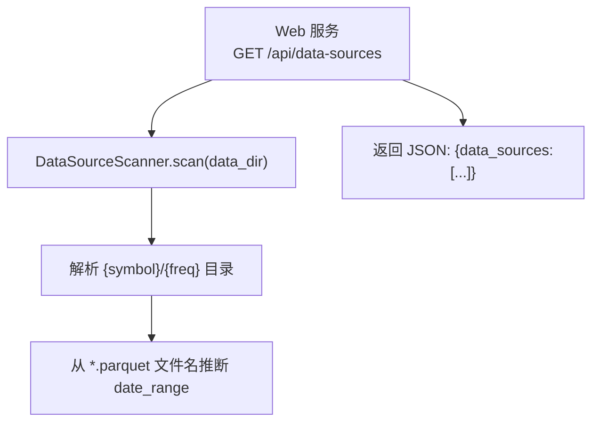
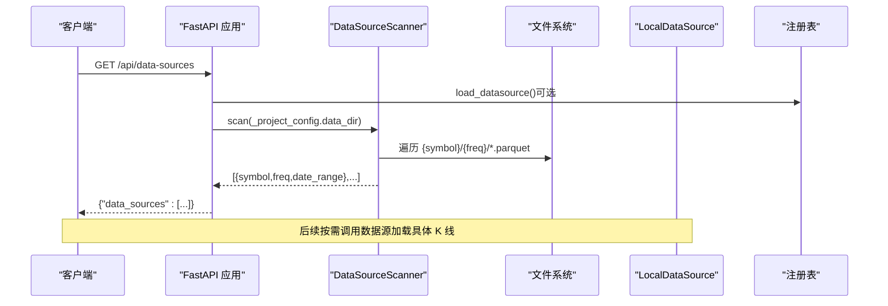
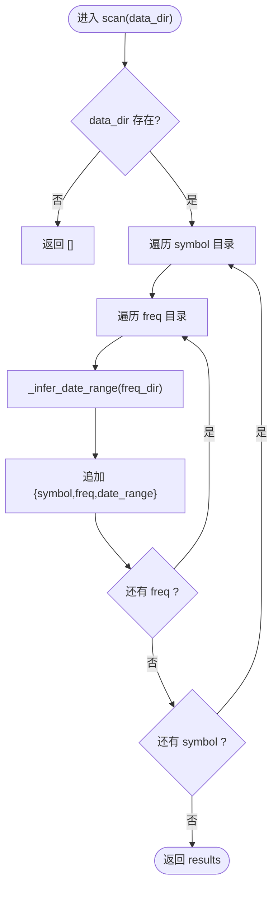
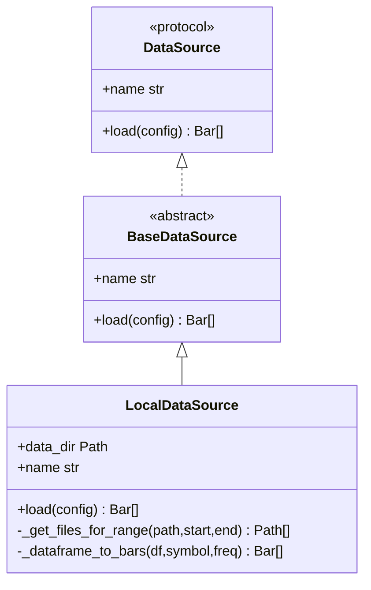
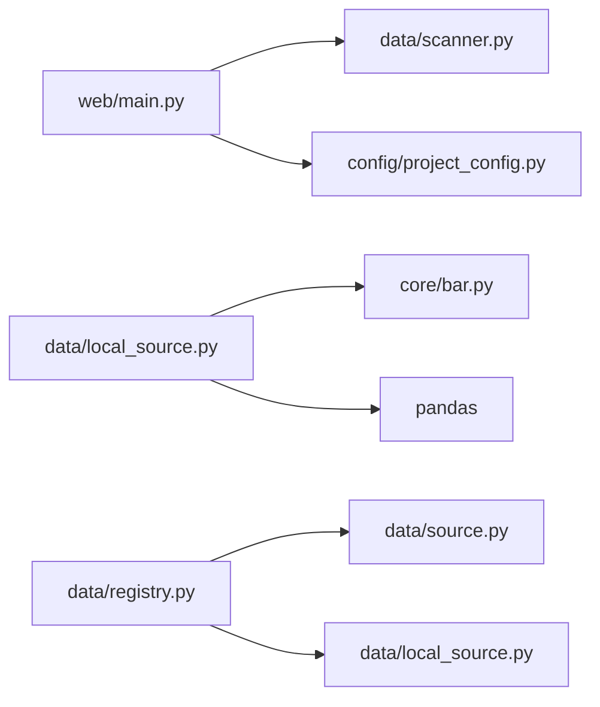

# 数据扫描与发现

<cite>
**本文引用的文件**   
- [scanner.py](file://src/caisen/data/scanner.py)
- [local_source.py](file://src/caisen/data/local_source.py)
- [config.py](file://src/caisen/data/config.py)
- [source.py](file://src/caisen/data/source.py)
- [registry.py](file://src/caisen/data/registry.py)
- [exceptions.py](file://src/caisen/data/exceptions.py)
- [main.py](file://src/caisen/web/main.py)
- [project_config.py](file://src/caisen/config/project_config.py)
- [007-data-source-scanner.md](file://docs/agents/issues/007-data-source-scanner.md)
- [test_data_source_scanner.py](file://tests/test_data_source_scanner.py)
</cite>

## 目录
1. [简介](#简介)
2. [项目结构](#项目结构)
3. [核心组件](#核心组件)
4. [架构总览](#架构总览)
5. [详细组件分析](#详细组件分析)
6. [依赖关系分析](#依赖关系分析)
7. [性能考虑](#性能考虑)
8. [故障排查指南](#故障排查指南)
9. [结论](#结论)
10. [附录](#附录)

## 简介
本文件围绕“数据扫描与发现”机制，系统性阐述本地 Parquet 数据的目录扫描、元数据推断、加载流程、异常处理、可扩展的数据源注册机制，以及与 Web API 的集成方式。文档同时给出扫描结果的数据结构与查询接口说明，并提供扩展点与最佳实践建议。

## 项目结构
数据扫描与发现相关代码集中在 data 模块与 web 服务中：
- 扫描器：负责遍历 {data_dir}/{symbol}/{freq}/*.parquet，并基于文件名推断日期范围
- 数据源协议与实现：定义 DataSource 协议与 LocalDataSource 默认实现
- 配置与注册表：DataConfig 描述加载参数；registry 提供线程安全的数据源注册与选择
- Web 端点：/api/data-sources 暴露扫描结果供前端使用
- 项目配置：ProjectConfig 提供 data_dir 等全局路径

图表来源
- [main.py:96-100](file://src/caisen/web/main.py#L96-L100)
- [scanner.py:10-34](file://src/caisen/data/scanner.py#L10-L34)

章节来源
- [scanner.py:1-53](file://src/caisen/data/scanner.py#L1-L53)
- [main.py:96-100](file://src/caisen/web/main.py#L96-L100)
- [project_config.py:17-55](file://src/caisen/config/project_config.py#L17-L55)

## 核心组件
- 数据源协议与基类
  - DataSource 协议：定义 load(config) -> List[Bar] 与 name 属性
  - BaseDataSource：抽象基类，统一命名约定
- 本地数据源实现
  - LocalDataSource：按 {symbol}/{freq} 读取 parquet，支持单日与区间两种命名模式，校验列名并转换为 Bar
- 数据源注册表
  - register_datasource / get_datasource / load_datasource：线程安全的注册与获取
- 扫描器
  - DataSourceScanner.scan：遍历 symbol/freq 目录，仅通过文件名推断 date_range，不读文件内容
- 配置
  - DataConfig：symbol、freq、start、end、data_dir 及校验
- 异常体系
  - DataLoadError 及其子类：DataNotFoundError、InvalidDateRangeError、DataValidationError、DataSourceNotAvailableError

章节来源
- [source.py:10-62](file://src/caisen/data/source.py#L10-L62)
- [local_source.py:15-199](file://src/caisen/data/local_source.py#L15-L199)
- [registry.py:1-108](file://src/caisen/data/registry.py#L1-L108)
- [scanner.py:10-53](file://src/caisen/data/scanner.py#L10-L53)
- [config.py:1-51](file://src/caisen/data/config.py#L1-L51)
- [exceptions.py:1-47](file://src/caisen/data/exceptions.py#L1-L47)

## 架构总览
下图展示从 Web 请求到扫描结果的端到端流程，以及数据加载时的关键分支逻辑。

图表来源
- [main.py:96-100](file://src/caisen/web/main.py#L96-L100)
- [registry.py:67-88](file://src/caisen/data/registry.py#L67-L88)
- [scanner.py:10-34](file://src/caisen/data/scanner.py#L10-L34)

## 详细组件分析

### 扫描器：DataSourceScanner
- 功能要点
  - 遍历 data_dir 下的 symbol 与 freq 子目录
  - 对每个 freq 目录，扫描 *.parquet 并通过文件名推断 date_range
  - 若目录不存在或为空，返回空列表，不抛错
- 文件名约定
  - 支持 {YYYYMMDD}_{YYYYMMDD}.parquet 的区间命名
  - 通过最小 start 与最大 end 合并多个文件的覆盖范围
- 复杂度
  - 时间 O(N)，N 为 parquet 文件数量（仅字符串解析）
  - 空间 O(1) 额外开销（不计结果集）

图表来源
- [scanner.py:10-34](file://src/caisen/data/scanner.py#L10-L34)
- [scanner.py:37-53](file://src/caisen/data/scanner.py#L37-L53)

章节来源
- [scanner.py:10-53](file://src/caisen/data/scanner.py#L10-L53)
- [test_data_source_scanner.py:14-38](file://tests/test_data_source_scanner.py#L14-L38)

### 数据源协议与本地实现：LocalDataSource
- 协议与基类
  - DataSource 协议要求实现 load(config) 与 name
  - BaseDataSource 提供抽象方法与默认 name
- 本地加载流程
  - 根据 config.data_dir/symbol/freq 定位目录
  - _get_files_for_range 支持两类命名：
    - 单日：{YYYYMMDD}.parquet
    - 区间：{YYYYMMDD}_{YYYYMMDD}.parquet
  - 将 DataFrame 转为 Bar 对象，支持中英文列名映射
  - 最终按 timestamp 排序返回
- 错误处理
  - 找不到文件或无匹配文件时抛出 DataNotFoundError
  - 列缺失时抛出 DataValidationError

图表来源
- [source.py:10-62](file://src/caisen/data/source.py#L10-L62)
- [local_source.py:15-199](file://src/caisen/data/local_source.py#L15-L199)

章节来源
- [source.py:10-62](file://src/caisen/data/source.py#L10-L62)
- [local_source.py:39-80](file://src/caisen/data/local_source.py#L39-L80)
- [local_source.py:82-137](file://src/caisen/data/local_source.py#L82-L137)
- [local_source.py:139-199](file://src/caisen/data/local_source.py#L139-L199)

### 数据源注册表：registry
- 能力
  - 线程安全地注册、设置活跃数据源、获取实例、列出已注册名称
- 默认行为
  - 内置 local 数据源
  - 未显式指定时回退到 local
- 异常
  - 未知数据源名抛出 DataSourceNotAvailableError

章节来源
- [registry.py:1-108](file://src/caisen/data/registry.py#L1-L108)
- [exceptions.py:24-29](file://src/caisen/data/exceptions.py#L24-L29)

### Web 集成：/api/data-sources
- 端点职责
  - 读取 ProjectConfig.data_dir
  - 调用 DataSourceScanner.scan 返回可用数据源清单
- 响应格式
  - { "data_sources": [ { "symbol", "freq", "date_range": { "start","end" } }, ... ] }

章节来源
- [main.py:96-100](file://src/caisen/web/main.py#L96-L100)
- [project_config.py:17-55](file://src/caisen/config/project_config.py#L17-L55)
- [007-data-source-scanner.md:18-31](file://docs/agents/issues/007-data-source-scanner.md#L18-L31)

### 配置模型：DataConfig
- 字段
  - symbol、freq、start、end、data_dir
- 校验
  - freq 必须在 SUPPORTED_FREQS 内
- 辅助
  - data_path 属性拼接 {data_dir}/{symbol}/{freq}
  - to_dict 序列化

章节来源
- [config.py:1-51](file://src/caisen/data/config.py#L1-L51)

### 异常体系
- DataLoadError：数据加载错误基类
- DataNotFoundError：未找到数据
- InvalidDateRangeError：日期范围无效
- DataValidationError：数据格式校验失败
- DataSourceNotAvailableError：数据源不可用

章节来源
- [exceptions.py:1-47](file://src/caisen/data/exceptions.py#L1-L47)

## 依赖关系分析
- 模块耦合
  - Web 层依赖 scanner 与 project_config
  - scanner 仅依赖 pathlib，无外部 IO 重操作
  - local_source 依赖 pandas 与 core.bar
  - registry 管理数据源生命周期与线程安全
- 外部依赖
  - pandas（Parquet 读写）
  - FastAPI（Web 服务）
  - PyYAML（项目配置）

图表来源
- [main.py:96-100](file://src/caisen/web/main.py#L96-L100)
- [scanner.py:10-34](file://src/caisen/data/scanner.py#L10-L34)
- [local_source.py:15-199](file://src/caisen/data/local_source.py#L15-L199)
- [registry.py:1-108](file://src/caisen/data/registry.py#L1-L108)
- [source.py:10-62](file://src/caisen/data/source.py#L10-L62)

## 性能考虑
- 扫描阶段
  - 仅遍历目录与解析文件名，不读取 Parquet 内容，I/O 开销极低
  - 适合在 Web 启动或页面初始化时执行
- 加载阶段
  - 按日期过滤减少 I/O 与内存占用
  - 列名映射与类型转换在 Python 层进行，数据量大时可考虑向量化优化
- 并发与缓存
  - 注册表使用锁保证线程安全
  - 可在上层引入扫描结果缓存（如进程内 LRU 或 Redis），避免重复扫描

[本节为通用指导，无需源码引用]

## 故障排查指南
- 常见问题
  - 目录不存在或为空：scan 返回空列表，属正常行为
  - 文件名不符合约定：无法推断 date_range，结果为 None
  - 缺少必要列：抛出 DataValidationError
  - 未找到匹配文件：抛出 DataNotFoundError
- 定位步骤
  - 检查 data_dir 是否正确（参考 ProjectConfig）
  - 确认 {symbol}/{freq} 目录结构与 *.parquet 命名
  - 查看异常信息中的 symbol、freq、start/end 以缩小范围
  - 使用 /api/data-sources 验证扫描结果是否包含目标条目

章节来源
- [scanner.py:10-34](file://src/caisen/data/scanner.py#L10-L34)
- [local_source.py:53-80](file://src/caisen/data/local_source.py#L53-L80)
- [local_source.py:139-199](file://src/caisen/data/local_source.py#L139-L199)
- [exceptions.py:9-47](file://src/caisen/data/exceptions.py#L9-L47)

## 结论
当前数据扫描与发现机制以轻量、可解释的方式完成本地 Parquet 数据的目录发现与元数据推断，并通过 Web 端点对外暴露。数据加载遵循统一的协议与注册表，具备良好的扩展性。建议在大规模场景下引入扫描结果缓存与增量更新策略，进一步提升性能与可用性。

[本节为总结性内容，无需源码引用]

## 附录

### 扫描结果数据结构
- 顶层键
  - data_sources：数组
- 元素字段
  - symbol：字符串，品种标识
  - freq：字符串，频率标识
  - date_range：对象
    - start：字符串，起始日期（YYYY-MM-DD）
    - end：字符串，结束日期（YYYY-MM-DD）

章节来源
- [007-data-source-scanner.md:18-31](file://docs/agents/issues/007-data-source-scanner.md#L18-L31)
- [test_data_source_scanner.py:41-64](file://tests/test_data_source_scanner.py#L41-L64)

### 查询接口
- GET /api/data-sources
  - 作用：列出本地可用行情数据
  - 成功响应：200，JSON 体包含 data_sources
  - 失败情况：通常不会因目录不存在而报错，返回空列表

章节来源
- [main.py:96-100](file://src/caisen/web/main.py#L96-L100)
- [007-data-source-scanner.md:18-31](file://docs/agents/issues/007-data-source-scanner.md#L18-L31)

### 自定义扫描规则与扩展点
- 自定义数据源
  - 实现 DataSource 协议（或继承 BaseDataSource），并在 registry 中注册
  - 可通过 set_active_datasource 切换默认数据源
- 自定义扫描规则
  - 扩展 _infer_date_range 的解析逻辑，支持更多命名模式
  - 在 scan 中增加过滤条件（例如只保留特定 freq 集合）
- 多路径扫描
  - 在 Web 层聚合多个 data_dir 的扫描结果后合并返回
- 增量更新
  - 维护扫描结果缓存（含 last_scan_time、file_mtime 等），仅在文件变更时重新扫描
  - 结合文件系统事件或定时任务触发增量刷新

章节来源
- [source.py:10-62](file://src/caisen/data/source.py#L10-L62)
- [registry.py:22-47](file://src/caisen/data/registry.py#L22-L47)
- [scanner.py:37-53](file://src/caisen/data/scanner.py#L37-L53)