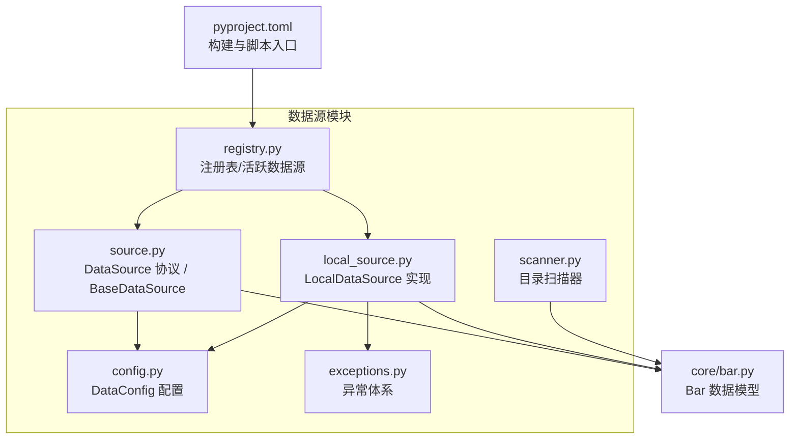
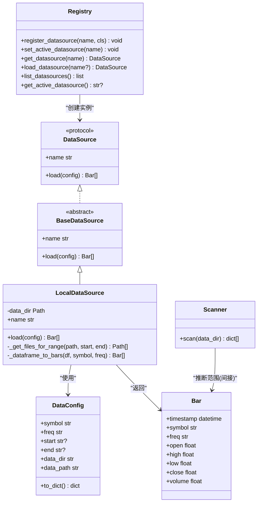
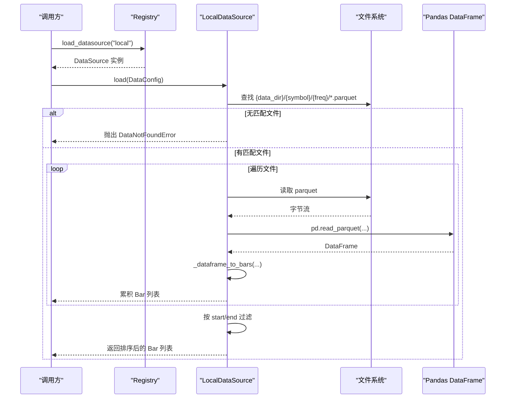
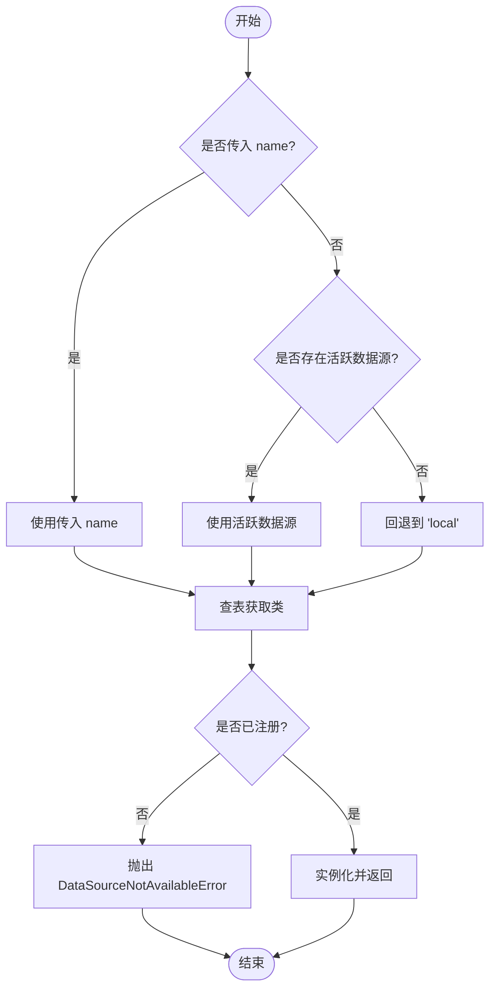
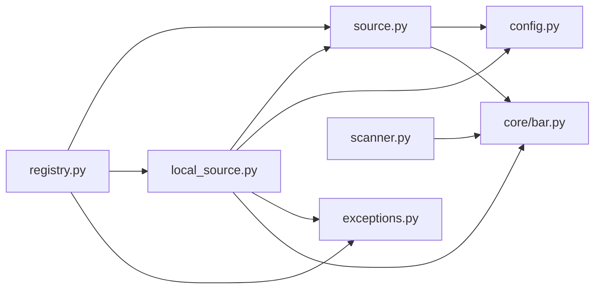

# 数据源架构设计

<cite>
**本文引用的文件**
- [src/caisen/data/source.py](file://src/caisen/data/source.py)
- [src/caisen/data/config.py](file://src/caisen/data/config.py)
- [src/caisen/data/registry.py](file://src/caisen/data/registry.py)
- [src/caisen/data/local_source.py](file://src/caisen/data/local_source.py)
- [src/caisen/data/exceptions.py](file://src/caisen/data/exceptions.py)
- [src/caisen/core/bar.py](file://src/caisen/core/bar.py)
- [src/caisen/data/scanner.py](file://src/caisen/data/scanner.py)
- [tests/test_local_data_loader.py](file://tests/test_local_data_loader.py)
- [tests/test_data_source_scanner.py](file://tests/test_data_source_scanner.py)
- [pyproject.toml](file://pyproject.toml)
</cite>

## 目录
1. [简介](#简介)
2. [项目结构](#项目结构)
3. [核心组件](#核心组件)
4. [架构总览](#架构总览)
5. [详细组件分析](#详细组件分析)
6. [依赖关系分析](#依赖关系分析)
7. [性能考虑](#性能考虑)
8. [故障排查指南](#故障排查指南)
9. [结论](#结论)
10. [附录](#附录)

## 简介
本文件围绕数据源子系统，系统性阐述 DataSource Protocol 的设计理念与接口定义、抽象基类 BaseDataSource 提供的通用能力、数据源生命周期管理、错误处理机制与性能优化策略。同时详细说明 DataConfig 配置对象的结构与用法（时间范围过滤、字段选择与参数校验），并提供自定义数据源的完整实现指南（协议实现、异常处理、测试方法）以及注册机制与插件系统的集成方式。

## 项目结构
数据源相关代码集中在 src/caisen/data 目录下，核心文件职责如下：
- source.py：定义 DataSource 协议与 BaseDataSource 抽象基类
- config.py：定义 DataConfig 配置对象及频率校验
- registry.py：提供线程安全的注册表、活跃数据源管理与实例加载
- local_source.py：本地 Parquet 数据源实现
- exceptions.py：统一的异常类型体系
- scanner.py：扫描本地数据目录并推断可用标的与周期

图表来源
- [src/caisen/data/source.py:1-62](file://src/caisen/data/source.py#L1-L62)
- [src/caisen/data/config.py:1-51](file://src/caisen/data/config.py#L1-L51)
- [src/caisen/data/registry.py:1-108](file://src/caisen/data/registry.py#L1-L108)
- [src/caisen/data/local_source.py:1-199](file://src/caisen/data/local_source.py#L1-L199)
- [src/caisen/data/exceptions.py:1-47](file://src/caisen/data/exceptions.py#L1-L47)
- [src/caisen/core/bar.py:1-38](file://src/caisen/core/bar.py#L1-L38)
- [src/caisen/data/scanner.py:1-53](file://src/caisen/data/scanner.py#L1-L53)
- [pyproject.toml:1-59](file://pyproject.toml#L1-L59)

章节来源
- [src/caisen/data/source.py:1-62](file://src/caisen/data/source.py#L1-L62)
- [src/caisen/data/config.py:1-51](file://src/caisen/data/config.py#L1-L51)
- [src/caisen/data/registry.py:1-108](file://src/caisen/data/registry.py#L1-L108)
- [src/caisen/data/local_source.py:1-199](file://src/caisen/data/local_source.py#L1-L199)
- [src/caisen/data/exceptions.py:1-47](file://src/caisen/data/exceptions.py#L1-L47)
- [src/caisen/core/bar.py:1-38](file://src/caisen/core/bar.py#L1-L38)
- [src/caisen/data/scanner.py:1-53](file://src/caisen/data/scanner.py#L1-L53)
- [pyproject.toml:1-59](file://pyproject.toml#L1-L59)

## 核心组件
- DataSource 协议：定义 load(config) -> List[Bar] 与 name 属性，作为外部数据源必须实现的契约。
- BaseDataSource 抽象基类：提供默认 name 实现与抽象 load 方法，便于继承扩展。
- DataConfig：包含 symbol、freq、start、end、data_dir 等字段，支持 freq 校验与 data_path 计算。
- LocalDataSource：基于本地 Parquet 文件的数据源实现，支持日期范围筛选与多列名兼容。
- Registry：线程安全的数据源注册表，支持动态注册、设置活跃数据源、获取实例与列举已注册项。
- Scanner：扫描 {data_dir}/{symbol}/{freq}/*.parquet 目录结构，推断可用数据的时间范围。
- Bar：K线数据模型，统一 timestamp、symbol、freq、OHLCV 字段。

章节来源
- [src/caisen/data/source.py:10-62](file://src/caisen/data/source.py#L10-L62)
- [src/caisen/data/config.py:11-51](file://src/caisen/data/config.py#L11-L51)
- [src/caisen/data/local_source.py:15-199](file://src/caisen/data/local_source.py#L15-L199)
- [src/caisen/data/registry.py:1-108](file://src/caisen/data/registry.py#L1-L108)
- [src/caisen/data/scanner.py:10-53](file://src/caisen/data/scanner.py#L10-L53)
- [src/caisen/core/bar.py:8-38](file://src/caisen/core/bar.py#L8-L38)

## 架构总览
数据源子系统采用“协议 + 抽象基类 + 具体实现 + 注册表”的分层设计：
- 上层通过注册表获取数据源实例，调用 load(DataConfig) 获取标准化 Bar 列表。
- 数据源内部负责读取存储介质（如本地 Parquet）、解析为 Bar 对象并进行必要过滤与排序。
- 异常体系贯穿加载流程，确保错误可定位与可恢复。
- 扫描器独立于加载器，用于发现与展示可用数据集合。

图表来源
- [src/caisen/data/source.py:10-62](file://src/caisen/data/source.py#L10-L62)
- [src/caisen/data/local_source.py:15-199](file://src/caisen/data/local_source.py#L15-L199)
- [src/caisen/data/config.py:11-51](file://src/caisen/data/config.py#L11-L51)
- [src/caisen/core/bar.py:8-38](file://src/caisen/core/bar.py#L8-L38)
- [src/caisen/data/registry.py:1-108](file://src/caisen/data/registry.py#L1-L108)
- [src/caisen/data/scanner.py:10-53](file://src/caisen/data/scanner.py#L10-L53)

## 详细组件分析

### DataSource 协议与 BaseDataSource 抽象基类
- 设计理念
  - 以 Protocol 明确最小接口，降低耦合；BaseDataSource 提供默认 name 与抽象 load，简化实现。
  - 所有外部数据源需实现 load(config) -> List[Bar]，保证上层一致调用。
- 关键行为
  - load：按 DataConfig 的 symbol/freq/start/end 加载并按时间戳排序返回。
  - name：标识数据源名称，便于注册与选择。
- 复杂度与健壮性
  - 协议无额外开销；BaseDataSource 仅做默认实现，不引入运行时成本。

章节来源
- [src/caisen/data/source.py:10-62](file://src/caisen/data/source.py#L10-L62)

### DataConfig 配置对象
- 结构与用途
  - symbol：交易标的
  - freq：K线频率，受 SUPPORTED_FREQS 约束
  - start/end：可选的起止日期（YYYY-MM-DD）
  - data_dir：数据根目录
  - data_path：根据 symbol/freq 拼接路径
  - to_dict：序列化配置
- 参数验证
  - __post_init__ 中校验 freq 是否在支持列表中，否则抛出 ValueError。
- 使用建议
  - 在构造时即完成基础校验，避免后续重复检查。
  - 结合 DataNotFoundError 与 InvalidDateRangeError 进行边界处理。

章节来源
- [src/caisen/data/config.py:11-51](file://src/caisen/data/config.py#L11-L51)

### 本地数据源 LocalDataSource
- 目录约定
  - {data_dir}/{symbol}/{freq}/{date}.parquet 或 {start}_{end}.parquet
- 加载流程
  - 校验目录存在性与匹配文件集合
  - 读取每个 parquet 文件，转换为 Bar 列表
  - 按 start/end 进一步过滤，最终按时间戳排序返回
- 列名兼容
  - 支持英文与中文列名映射，缺失必填列时抛出 DataValidationError
- 文件匹配策略
  - 单日期文件：YYYYMMDD.parquet
  - 区间文件：YYYYMMDD_YYYYMMDD.parquet
  - 未指定范围时返回全部文件
- 异常处理
  - 找不到文件或无匹配文件：DataNotFoundError
  - 列缺失或格式错误：DataValidationError
  - 日期范围非法：InvalidDateRangeError（由上层或调用方判断）

图表来源
- [src/caisen/data/registry.py:67-88](file://src/caisen/data/registry.py#L67-L88)
- [src/caisen/data/local_source.py:39-80](file://src/caisen/data/local_source.py#L39-L80)
- [src/caisen/data/local_source.py:139-199](file://src/caisen/data/local_source.py#L139-L199)

章节来源
- [src/caisen/data/local_source.py:15-199](file://src/caisen/data/local_source.py#L15-L199)
- [src/caisen/data/exceptions.py:9-47](file://src/caisen/data/exceptions.py#L9-L47)

### 注册表与活跃数据源
- 功能
  - register_datasource：注册新数据源类
  - set_active_datasource：设置全局活跃数据源
  - get_datasource/load_datasource：按名称或活跃状态获取实例
  - list_datasources/get_active_datasource：查询与监控
- 线程安全
  - 使用 threading.Lock 保护所有读写操作，避免并发冲突
- 默认行为
  - 内置 "local" 数据源，未显式设置时自动回退到 local

图表来源
- [src/caisen/data/registry.py:67-88](file://src/caisen/data/registry.py#L67-L88)
- [src/caisen/data/registry.py:22-46](file://src/caisen/data/registry.py#L22-L46)

章节来源
- [src/caisen/data/registry.py:1-108](file://src/caisen/data/registry.py#L1-L108)

### 扫描器 DataSourceScanner
- 作用
  - 扫描 {data_dir}/{symbol}/{freq} 目录，推断可用数据的时间范围（从文件名提取）
- 输出
  - 返回 symbol、freq、date_range(start/end) 的列表，供前端或工具展示
- 容错
  - 目录不存在或为空时返回空列表，不抛异常

章节来源
- [src/caisen/data/scanner.py:10-53](file://src/caisen/data/scanner.py#L10-L53)

### Bar 数据模型
- 字段
  - timestamp、symbol、freq、open、high、low、close、volume
- 辅助方法
  - to_dict/from_dict：序列化和反序列化

章节来源
- [src/caisen/core/bar.py:8-38](file://src/caisen/core/bar.py#L8-L38)

## 依赖关系分析
- 模块内依赖
  - local_source 依赖 config、exceptions、bar
  - registry 依赖 source、local_source、exceptions
  - scanner 独立，仅用于目录扫描
- 外部依赖
  - pandas/pyarrow 用于 Parquet 读写
  - fastapi/websockets 用于 Web 端点（扫描结果暴露）
- 潜在循环
  - 当前未发现循环导入；registry 对 local_source 的直接导入仅在初始化阶段，符合常规实践

图表来源
- [src/caisen/data/source.py:1-62](file://src/caisen/data/source.py#L1-L62)
- [src/caisen/data/local_source.py:1-199](file://src/caisen/data/local_source.py#L1-L199)
- [src/caisen/data/registry.py:1-108](file://src/caisen/data/registry.py#L1-L108)
- [src/caisen/data/scanner.py:1-53](file://src/caisen/data/scanner.py#L1-L53)
- [src/caisen/core/bar.py:1-38](file://src/caisen/core/bar.py#L1-L38)

章节来源
- [src/caisen/data/source.py:1-62](file://src/caisen/data/source.py#L1-L62)
- [src/caisen/data/local_source.py:1-199](file://src/caisen/data/local_source.py#L1-L199)
- [src/caisen/data/registry.py:1-108](file://src/caisen/data/registry.py#L1-L108)
- [src/caisen/data/scanner.py:1-53](file://src/caisen/data/scanner.py#L1-L53)
- [src/caisen/core/bar.py:1-38](file://src/caisen/core/bar.py#L1-L38)

## 性能考虑
- I/O 与内存
  - 逐文件读取 parquet 并迭代行生成 Bar，适合中小规模数据；超大数据集建议分块读取或按需切片以减少峰值内存。
- 文件匹配
  - 优先通过文件名快速裁剪候选文件集合，减少不必要的磁盘访问。
- 排序与过滤
  - 先按文件顺序合并再整体排序，若数据量极大可考虑增量归并排序或在存储侧预排序。
- 列名映射
  - 列名映射在每次转换时执行，可在数据源初始化阶段缓存映射以提升性能。
- 并发
  - 注册表已加锁，但数据加载本身未并行化；如需并行加载多个标的，应在上层控制并发度与资源隔离。

[本节为通用指导，无需特定文件引用]

## 故障排查指南
- 常见异常
  - DataNotFoundError：路径不存在或无匹配文件，检查 data_dir/symbol/freq 与文件名模式
  - DataValidationError：缺少必填列或类型不符，核对列名映射与数据类型
  - DataSourceNotAvailableError：未注册或未找到数据源，确认注册表与名称
  - InvalidDateRangeError：起止日期非法，确保 start <= end
- 调试建议
  - 打印 DataConfig 的 data_path 与实际目录结构对比
  - 使用 Scanner 的输出验证目录命名是否符合约定
  - 在单元测试中模拟临时目录与样例数据，覆盖边界条件

章节来源
- [src/caisen/data/exceptions.py:4-47](file://src/caisen/data/exceptions.py#L4-L47)
- [tests/test_local_data_loader.py:105-179](file://tests/test_local_data_loader.py#L105-L179)
- [tests/test_data_source_scanner.py:1-65](file://tests/test_data_source_scanner.py#L1-65)

## 结论
数据源架构通过清晰的协议与抽象基类解耦了上层逻辑与底层存储，配合线程安全的注册表与完善的异常体系，提供了可扩展、可维护且易于测试的数据接入方案。DataConfig 将配置与校验前置，提升了鲁棒性；LocalDataSource 展示了标准实现范式。未来可通过 entry_points 完善插件系统，进一步提升生态扩展能力。

[本节为总结，无需特定文件引用]

## 附录

### 自定义数据源实现指南
- 步骤
  1. 新建类并继承 BaseDataSource，实现 load(config) -> List[Bar]
  2. 在 __init__ 中完成必要的初始化（连接池、缓存等）
  3. 在 load 中依据 DataConfig 进行数据拉取、转换与过滤
  4. 遵循异常规范，抛出 DataLoadError 子类
  5. 通过 register_datasource 注册到全局注册表
  6. 编写单元测试，覆盖成功、缺失、无效范围、列名兼容等场景
- 示例要点
  - 参考 LocalDataSource 的文件匹配与列名映射策略
  - 参考 test_local_data_loader 的断言风格与用例组织
  - 参考 test_data_source_scanner 的目录扫描与 API 集成测试

章节来源
- [src/caisen/data/source.py:41-62](file://src/caisen/data/source.py#L41-L62)
- [src/caisen/data/local_source.py:15-199](file://src/caisen/data/local_source.py#L15-L199)
- [tests/test_local_data_loader.py:1-179](file://tests/test_local_data_loader.py#L1-179)
- [tests/test_data_source_scanner.py:1-65](file://tests/test_data_source_scanner.py#L1-65)

### 数据源注册机制与插件系统集成
- 当前实现
  - 通过 register_datasource 动态注册；默认内置 "local"
  - 支持 set_active_datasource 切换全局活跃数据源
- 插件系统现状
  - 文档指出尚未在 pyproject.toml 配置 entry_points，导致外部数据源无法自动发现
  - 建议在 pyproject.toml 中添加 caisen.datasources 分组与入口函数，以便安装时自动注册
- 建议
  - 在包外部的数据源项目中实现 DataSource 协议并通过 entry_points 暴露
  - 在主程序启动时扫描并注册这些入口，实现零配置接入

章节来源
- [src/caisen/data/registry.py:22-46](file://src/caisen/data/registry.py#L22-L46)
- [pyproject.toml:1-59](file://pyproject.toml#L1-L59)