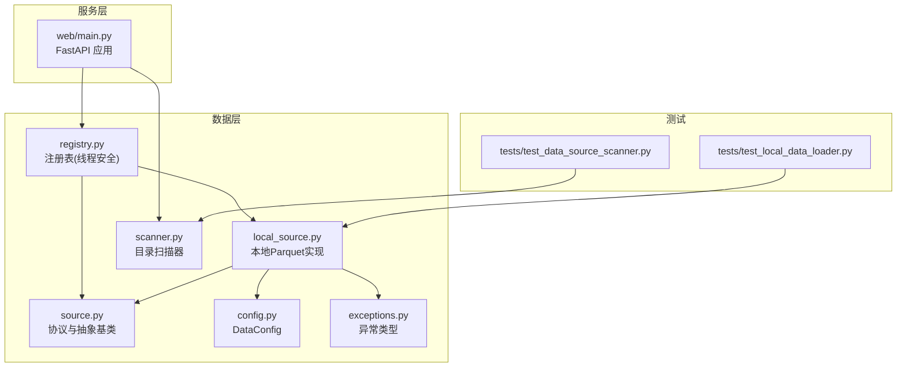
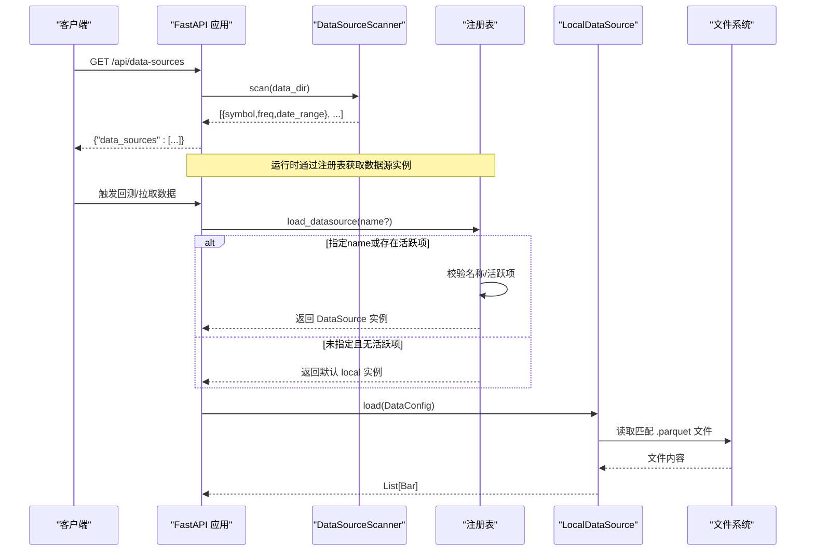
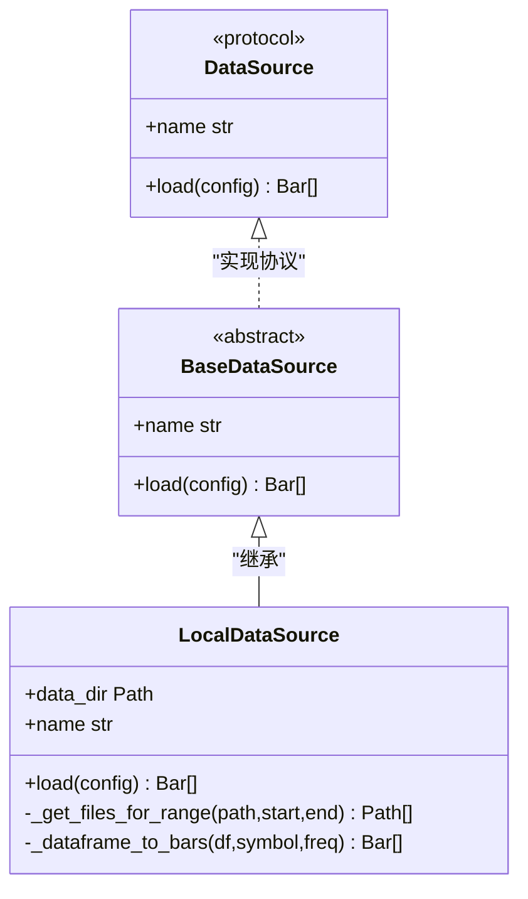
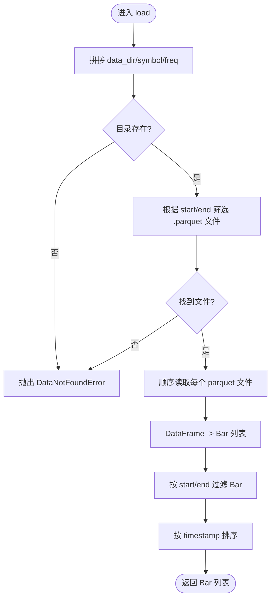
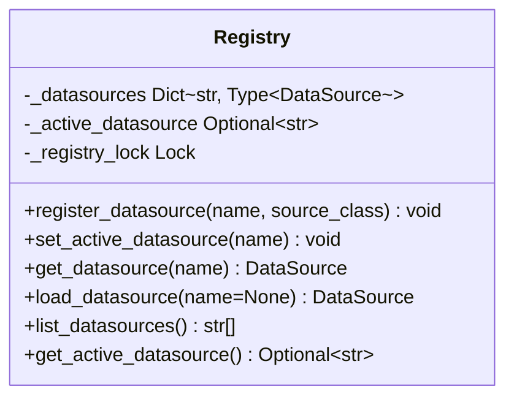
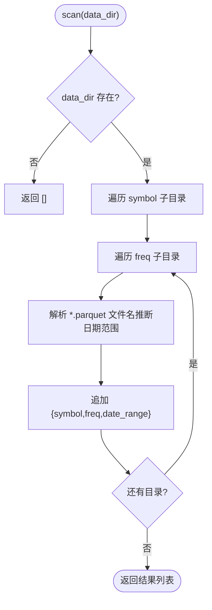
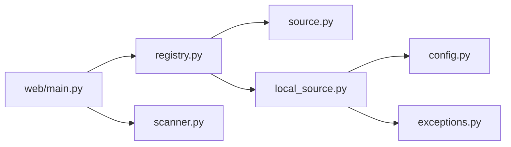
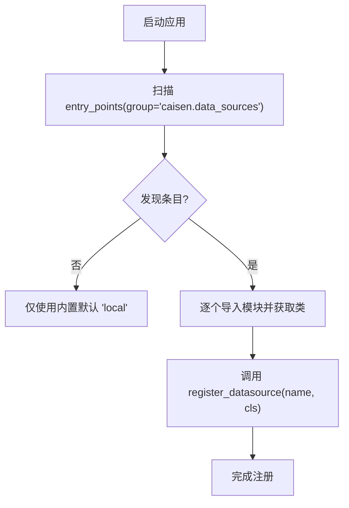

# 数据源注册管理

<cite>
**本文引用的文件**   
- [src/caisen/data/registry.py](file://src/caisen/data/registry.py)
- [src/caisen/data/source.py](file://src/caisen/data/source.py)
- [src/caisen/data/local_source.py](file://src/caisen/data/local_source.py)
- [src/caisen/data/config.py](file://src/caisen/data/config.py)
- [src/caisen/data/scanner.py](file://src/caisen/data/scanner.py)
- [src/caisen/data/exceptions.py](file://src/caisen/data/exceptions.py)
- [src/caisen/web/main.py](file://src/caisen/web/main.py)
- [tests/test_data_source_scanner.py](file://tests/test_data_source_scanner.py)
- [tests/test_local_data_loader.py](file://tests/test_local_data_loader.py)
</cite>

## 目录
1. [简介](#简介)
2. [项目结构](#项目结构)
3. [核心组件](#核心组件)
4. [架构总览](#架构总览)
5. [详细组件分析](#详细组件分析)
6. [依赖关系分析](#依赖关系分析)
7. [性能考量](#性能考量)
8. [故障排查指南](#故障排查指南)
9. [结论](#结论)
10. [附录](#附录)

## 简介
本文件围绕“数据源注册管理系统”进行系统化文档化，重点覆盖以下方面：
- 注册表的设计模式与并发安全
- 动态发现与加载数据源组件的机制（当前实现为本地 Parquet 扫描）
- Entry Points 的使用与配置说明（现状与扩展建议）
- 插件发现算法的实现细节
- 数据源生命周期管理（初始化、配置注入、销毁清理）
- 并发访问控制与线程安全保证
- 自定义数据源的注册方法与最佳实践
- 注册表的监控与调试工具使用指南

## 项目结构
数据源相关代码集中在 src/caisen/data 目录下，包含协议定义、抽象基类、默认实现、注册表、配置与扫描器；Web 层提供数据源清单接口。测试用例覆盖扫描器与本地数据加载器的关键路径。

图表来源
- [src/caisen/data/registry.py:1-108](file://src/caisen/data/registry.py#L1-L108)
- [src/caisen/data/source.py:1-62](file://src/caisen/data/source.py#L1-L62)
- [src/caisen/data/local_source.py:1-199](file://src/caisen/data/local_source.py#L1-L199)
- [src/caisen/data/config.py:1-51](file://src/caisen/data/config.py#L1-L51)
- [src/caisen/data/scanner.py:1-53](file://src/caisen/data/scanner.py#L1-L53)
- [src/caisen/data/exceptions.py:1-47](file://src/caisen/data/exceptions.py#L1-L47)
- [src/caisen/web/main.py:1-319](file://src/caisen/web/main.py#L1-L319)
- [tests/test_data_source_scanner.py:1-65](file://tests/test_data_source_scanner.py#L1-L65)
- [tests/test_local_data_loader.py:1-179](file://tests/test_local_data_loader.py#L1-L179)

章节来源
- [src/caisen/data/registry.py:1-108](file://src/caisen/data/registry.py#L1-L108)
- [src/caisen/data/source.py:1-62](file://src/caisen/data/source.py#L1-L62)
- [src/caisen/data/local_source.py:1-199](file://src/caisen/data/local_source.py#L1-L199)
- [src/caisen/data/config.py:1-51](file://src/caisen/data/config.py#L1-L51)
- [src/caisen/data/scanner.py:1-53](file://src/caisen/data/scanner.py#L1-L53)
- [src/caisen/data/exceptions.py:1-47](file://src/caisen/data/exceptions.py#L1-L47)
- [src/caisen/web/main.py:1-319](file://src/caisen/web/main.py#L1-L319)
- [tests/test_data_source_scanner.py:1-65](file://tests/test_data_source_scanner.py#L1-L65)
- [tests/test_local_data_loader.py:1-179](file://tests/test_local_data_loader.py#L1-L179)

## 核心组件
- 数据源协议与抽象基类
  - DataSource 协议定义了 load(config) 与 name 属性契约，供外部插件实现。
  - BaseDataSource 提供通用能力与默认 name 行为，便于快速实现具体数据源。
- 本地数据源实现
  - LocalDataSource 基于 parquet 文件读取，支持单日期与范围命名两种模式，并做列名兼容与时间过滤。
- 数据源注册表
  - 全局字典维护已注册的数据源名称到类的映射，提供注册、设置活跃、获取实例、列出与查询活跃项等 API。
  - 所有写操作通过模块级互斥锁保护，确保并发安全。
- 数据加载配置
  - DataConfig 封装 symbol、freq、start/end、data_dir 等参数，并提供 data_path 便捷属性与 to_dict 序列化。
- 本地数据扫描器
  - DataSourceScanner.scan 遍历 {data_dir}/{symbol}/{freq}/*.parquet，推断可用 symbol/freq 及日期范围，用于前端展示与选择。
- Web 集成
  - FastAPI 提供 /api/data-sources 端点，调用扫描器返回可用数据源清单。

章节来源
- [src/caisen/data/source.py:1-62](file://src/caisen/data/source.py#L1-L62)
- [src/caisen/data/local_source.py:1-199](file://src/caisen/data/local_source.py#L1-L199)
- [src/caisen/data/registry.py:1-108](file://src/caisen/data/registry.py#L1-L108)
- [src/caisen/data/config.py:1-51](file://src/caisen/data/config.py#L1-L51)
- [src/caisen/data/scanner.py:1-53](file://src/caisen/data/scanner.py#L1-L53)
- [src/caisen/web/main.py:96-100](file://src/caisen/web/main.py#L96-L100)

## 架构总览
下图展示了从 Web 请求到数据源加载的整体流程，以及注册表在其中的作用。

图表来源
- [src/caisen/web/main.py:96-100](file://src/caisen/web/main.py#L96-L100)
- [src/caisen/data/scanner.py:10-34](file://src/caisen/data/scanner.py#L10-L34)
- [src/caisen/data/registry.py:67-88](file://src/caisen/data/registry.py#L67-L88)
- [src/caisen/data/local_source.py:39-80](file://src/caisen/data/local_source.py#L39-L80)

## 详细组件分析

### 数据源协议与抽象基类
- 设计要点
  - 以 Protocol 约束外部插件的最小接口，降低耦合。
  - BaseDataSource 提供默认 name 实现与抽象方法骨架，简化子类开发。
- 复杂度与性能
  - 协议与抽象类本身无运行时开销；实际性能取决于具体实现。
- 错误处理
  - 约定 load 抛出 DataLoadError 及其子类，便于上层统一捕获。

图表来源
- [src/caisen/data/source.py:10-62](file://src/caisen/data/source.py#L10-L62)
- [src/caisen/data/local_source.py:15-199](file://src/caisen/data/local_source.py#L15-L199)

章节来源
- [src/caisen/data/source.py:1-62](file://src/caisen/data/source.py#L1-L62)
- [src/caisen/data/local_source.py:1-199](file://src/caisen/data/local_source.py#L1-L199)

### 本地数据源实现（LocalDataSource）
- 功能特性
  - 支持两种文件名模式：单日期 {YYYYMMDD}.parquet 与范围 {YYYYMMDD}_{YYYYMMDD}.parquet。
  - 列名兼容中英文，自动映射 timestamp/open/high/low/close/volume。
  - 按 start/end 对 Bar 列表进行二次过滤，并按时间戳排序。
- 关键算法
  - 文件筛选：将查询区间标准化为 YYYYMMDD 字符串，比较文件命名片段，判断是否重叠。
  - DataFrame 转 Bar：逐行构造 Bar 对象，必要时转换时间类型为 datetime。
- 复杂度
  - 文件筛选 O(N)，N 为候选 parquet 数量；DataFrame 转 Bar O(M)，M 为行数。
- 错误处理
  - 找不到文件或路径不存在时抛出 DataNotFoundError。
  - 列缺失时抛出 DataValidationError。

图表来源
- [src/caisen/data/local_source.py:39-80](file://src/caisen/data/local_source.py#L39-L80)
- [src/caisen/data/local_source.py:82-137](file://src/caisen/data/local_source.py#L82-L137)
- [src/caisen/data/local_source.py:139-199](file://src/caisen/data/local_source.py#L139-L199)

章节来源
- [src/caisen/data/local_source.py:1-199](file://src/caisen/data/local_source.py#L1-L199)
- [tests/test_local_data_loader.py:1-179](file://tests/test_local_data_loader.py#L1-L179)

### 数据源注册表（Registry）
- 设计模式
  - 全局注册表 + 工厂式创建：通过名称查找类并实例化，避免直接依赖具体实现。
  - 活跃数据源：允许设置一个全局“活跃”数据源，作为默认加载目标。
- 并发安全
  - 使用模块级 threading.Lock 保护注册表读写与活跃项切换，避免竞态条件。
- 主要 API
  - register_datasource(name, source_class)：注册新数据源。
  - set_active_datasource(name)：设置活跃数据源。
  - get_datasource(name)：按名称获取实例。
  - load_datasource(name=None)：优先使用传入名，其次活跃项，最后回退到 "local"。
  - list_datasources()：列出所有已注册名称。
  - get_active_datasource()：查询当前活跃数据源。
- 错误处理
  - 未知名称时抛出 DataSourceNotAvailableError 或 ValueError（设置活跃项时）。

图表来源
- [src/caisen/data/registry.py:1-108](file://src/caisen/data/registry.py#L1-L108)

章节来源
- [src/caisen/data/registry.py:1-108](file://src/caisen/data/registry.py#L1-L108)

### 数据加载配置（DataConfig）
- 字段与校验
  - symbol、freq、start、end、data_dir；freq 必须在 SUPPORTED_FREQS 中。
- 便捷属性与方法
  - data_path：生成 {data_dir}/{symbol}/{freq}。
  - to_dict：序列化为字典，便于持久化或传输。

章节来源
- [src/caisen/data/config.py:1-51](file://src/caisen/data/config.py#L1-L51)

### 本地数据扫描器（DataSourceScanner）
- 扫描规则
  - 目录约定：{data_dir}/{symbol}/{freq}/*.parquet。
  - 文件名约定：YYYYMMDD_YYYYMMDD.parquet，从中推断 date_range。
- 输出结构
  - 每项包含 symbol、freq、date_range（start/end），若无有效文件则 date_range 为 None。
- 健壮性
  - 目录不存在或为空时返回空列表，不抛错。

图表来源
- [src/caisen/data/scanner.py:10-34](file://src/caisen/data/scanner.py#L10-L34)
- [src/caisen/data/scanner.py:37-53](file://src/caisen/data/scanner.py#L37-L53)

章节来源
- [src/caisen/data/scanner.py:1-53](file://src/caisen/data/scanner.py#L1-L53)
- [tests/test_data_source_scanner.py:1-65](file://tests/test_data_source_scanner.py#L1-L65)

### Web 集成与数据源清单接口
- 端点
  - GET /api/data-sources：调用 DataSourceScanner.scan(_project_config.data_dir) 返回可用数据源清单。
- 用途
  - 前端下拉菜单展示 symbol/freq 组合，辅助用户选择数据范围。

章节来源
- [src/caisen/web/main.py:96-100](file://src/caisen/web/main.py#L96-L100)
- [tests/test_data_source_scanner.py:41-65](file://tests/test_data_source_scanner.py#L41-L65)

## 依赖关系分析
- 组件耦合
  - registry 依赖 source 协议与 local_source 默认实现。
  - local_source 依赖 config、bar、exceptions。
  - web/main 依赖 scanner 与 strategy registry（与本主题无关部分略）。
- 潜在循环
  - 当前未见循环导入；各模块职责清晰。
- 外部依赖
  - pandas/pyarrow 用于 parquet 读写；fastapi/uvicorn 用于 Web 服务。

图表来源
- [src/caisen/data/registry.py:1-108](file://src/caisen/data/registry.py#L1-L108)
- [src/caisen/data/source.py:1-62](file://src/caisen/data/source.py#L1-L62)
- [src/caisen/data/local_source.py:1-199](file://src/caisen/data/local_source.py#L1-L199)
- [src/caisen/data/config.py:1-51](file://src/caisen/data/config.py#L1-L51)
- [src/caisen/data/exceptions.py:1-47](file://src/caisen/data/exceptions.py#L1-L47)
- [src/caisen/data/scanner.py:1-53](file://src/caisen/data/scanner.py#L1-L53)
- [src/caisen/web/main.py:1-319](file://src/caisen/web/main.py#L1-L319)

章节来源
- [src/caisen/data/registry.py:1-108](file://src/caisen/data/registry.py#L1-L108)
- [src/caisen/data/local_source.py:1-199](file://src/caisen/data/local_source.py#L1-L199)
- [src/caisen/web/main.py:1-319](file://src/caisen/web/main.py#L1-L319)

## 性能考量
- I/O 密集
  - 大量 parquet 文件读取与 DataFrame 转换是主要瓶颈；建议按需分区、合并小文件、使用列裁剪与并行读取。
- 内存占用
  - 全量加载可能占用较多内存；建议结合 start/end 缩小范围，或在数据源内部实现流式/分页读取。
- 计算开销
  - 文件筛选与时间过滤均为线性复杂度；若数据规模大，可引入索引或元数据缓存。
- 并发策略
  - 注册表层面已加锁；数据源实例创建为轻量操作，但 load 内部应尽量避免共享可变状态，或使用线程局部变量。

## 故障排查指南
- 常见问题
  - 数据未找到：检查 data_dir/symbol/freq 目录是否存在，确认 parquet 命名是否符合预期。
  - 列缺失：确认 parquet 包含 timestamp/open/high/low/close/volume（或中文别名）。
  - 频率不支持：检查 freq 是否在 SUPPORTED_FREQS 内。
  - 未知数据源：确认已通过 register_datasource 注册，或通过 load_datasource 回退到 "local"。
- 定位步骤
  - 使用 list_datasources 与 get_active_datasource 检查注册表状态。
  - 使用 /api/data-sources 验证扫描器是否能识别数据目录。
  - 查看异常类型：DataNotFoundError、DataValidationError、DataSourceNotAvailableError。
- 日志与调试
  - 在 Web 层已有基础异常记录；可在数据源实现中添加结构化日志，记录文件路径、行数、耗时等。

章节来源
- [src/caisen/data/exceptions.py:1-47](file://src/caisen/data/exceptions.py#L1-L47)
- [src/caisen/data/registry.py:22-108](file://src/caisen/data/registry.py#L22-L108)
- [src/caisen/web/main.py:96-100](file://src/caisen/web/main.py#L96-L100)

## 结论
本系统通过协议+抽象基类的方式解耦数据源实现，配合线程安全的注册表与灵活的默认回退策略，提供了可扩展的数据接入能力。本地数据源实现了常见的 parquet 场景，扫描器为前端提供数据可用性视图。未来可按需引入 Entry Points 与更完善的插件发现机制，进一步提升生态扩展性与运维可观测性。

## 附录

### Entry Points 的使用与配置（现状与建议）
- 现状
  - 当前仓库未显式使用 Python Entry Points 进行数据源自动发现；默认数据源 "local" 在注册表中预置。
- 建议方案
  - 在 pyproject.toml 中声明 entry_points，例如：
    - group: caisen.data_sources
    - key: 数据源名称
    - value: 模块路径:类名
  - 启动时通过 importlib.metadata.entry_points 枚举并调用 register_datasource 完成自动注册。
  - 保持向后兼容：未启用自动发现时，仍可通过手动 register_datasource 注册。

[本节为概念性说明，不涉及具体源码引用]

### 插件发现算法（概念流程）

[本图为概念流程，非现有代码结构映射]

### 数据源生命周期管理
- 初始化
  - 通过 register_datasource 注册类；实例化由 get_datasource/load_datasource 负责。
- 配置注入
  - 调用方构造 DataConfig 并传入 load(config)。
- 销毁清理
  - 当前实现未显式持有长连接或资源句柄；若有外部资源，应在数据源类中提供 close/cleanup 方法并在合适时机调用。

章节来源
- [src/caisen/data/registry.py:22-88](file://src/caisen/data/registry.py#L22-L88)
- [src/caisen/data/config.py:11-51](file://src/caisen/data/config.py#L11-L51)

### 并发访问控制与线程安全
- 注册表
  - 使用 threading.Lock 保护注册表写入与活跃项切换，避免多线程竞争。
- 数据源实例
  - 每次 load_datasource 返回新实例，避免共享状态；若实现含共享资源，需在数据源内部自行保证线程安全。

章节来源
- [src/caisen/data/registry.py:10-46](file://src/caisen/data/registry.py#L10-L46)

### 自定义数据源注册方法与最佳实践
- 最小实现
  - 实现 DataSource 协议或继承 BaseDataSource，提供 load(config) 与 name。
- 注册方式
  - 手动：在应用启动阶段调用 register_datasource("your_name", YourSourceClass)。
  - 自动（建议）：通过 Entry Points 声明，启动时自动发现并注册。
- 错误处理
  - 遵循异常约定：找不到数据抛 DataNotFoundError，格式错误抛 DataValidationError。
- 性能建议
  - 尽量利用 start/end 限制数据范围；避免一次性加载超大文件；考虑增量更新与缓存策略。
- 可观测性
  - 记录关键指标：文件数、行数、耗时、错误率；暴露健康检查或指标端点。

章节来源
- [src/caisen/data/source.py:10-62](file://src/caisen/data/source.py#L10-L62)
- [src/caisen/data/registry.py:22-31](file://src/caisen/data/registry.py#L22-L31)
- [src/caisen/data/exceptions.py:1-47](file://src/caisen/data/exceptions.py#L1-L47)

### 注册表监控与调试工具使用指南
- 运行时检查
  - list_datasources：查看已注册数据源名称集合。
  - get_active_datasource：查看当前活跃数据源。
  - set_active_datasource：切换活跃数据源（注意权限与影响面）。
- Web 端点
  - GET /api/data-sources：返回本地可用数据源清单，便于前端展示与问题复现。
- 单元测试参考
  - tests/test_data_source_scanner.py：验证扫描器在不同目录结构与文件命名下的行为。
  - tests/test_local_data_loader.py：验证文件筛选、列名兼容与数据转换逻辑。

章节来源
- [src/caisen/data/registry.py:91-108](file://src/caisen/data/registry.py#L91-L108)
- [src/caisen/web/main.py:96-100](file://src/caisen/web/main.py#L96-L100)
- [tests/test_data_source_scanner.py:1-65](file://tests/test_data_source_scanner.py#L1-L65)
- [tests/test_local_data_loader.py:1-179](file://tests/test_local_data_loader.py#L1-L179)