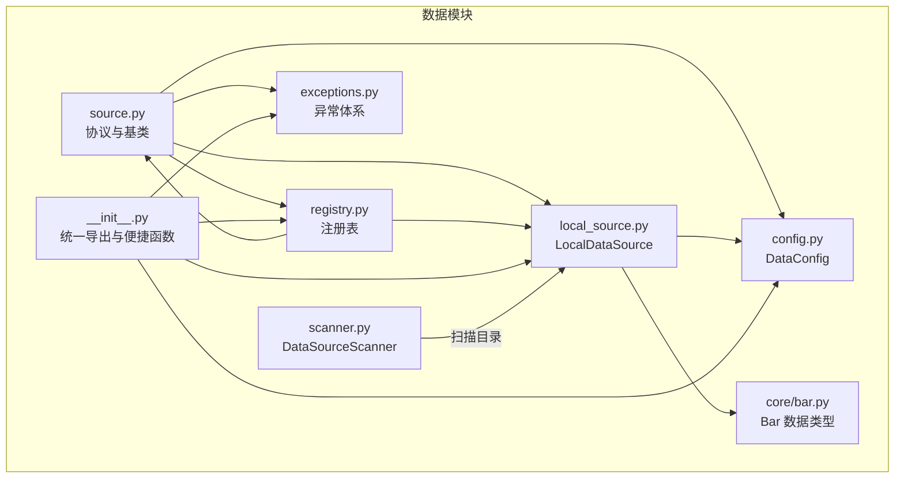
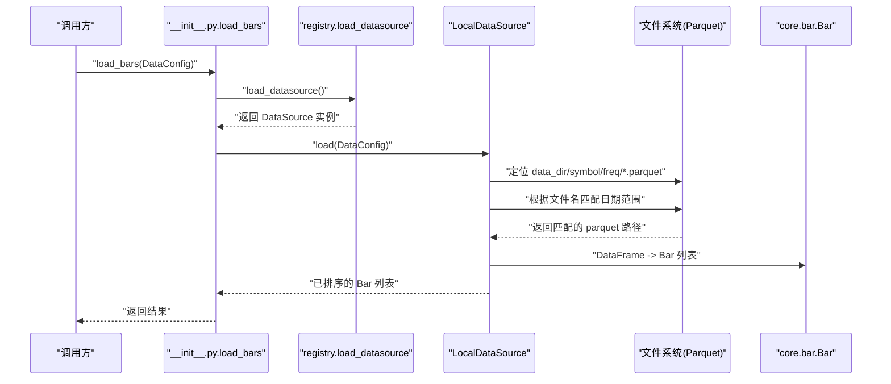
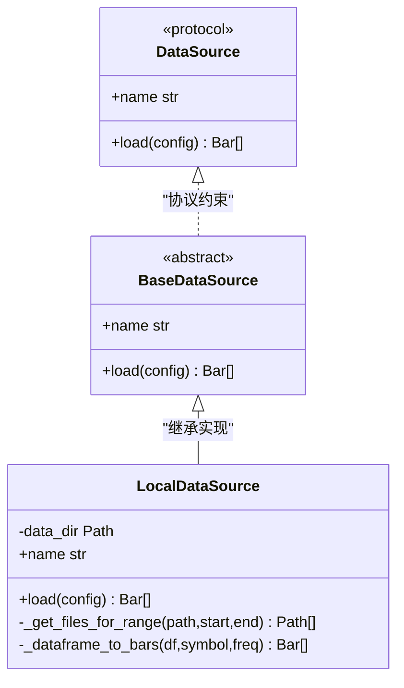
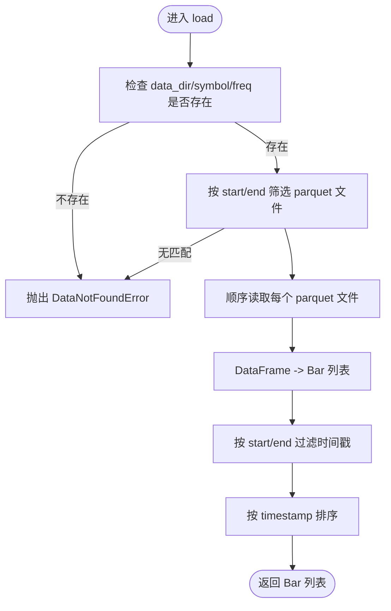
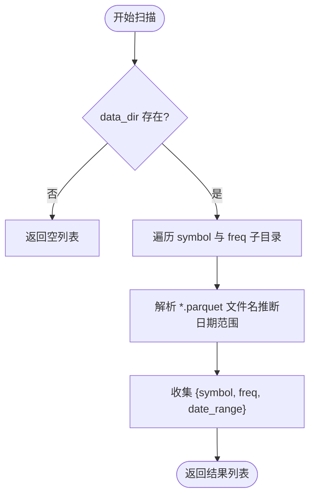
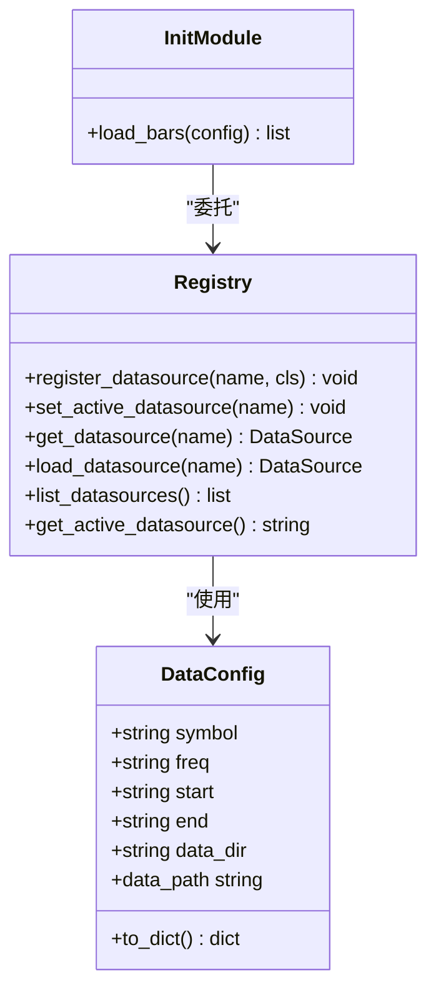
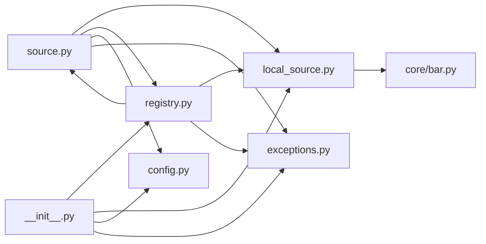

# 数据管理

<cite>
**本文引用的文件**
- [source.py](file://src/caisen/data/source.py)
- [local_source.py](file://src/caisen/data/local_source.py)
- [registry.py](file://src/caisen/data/registry.py)
- [scanner.py](file://src/caisen/data/scanner.py)
- [config.py](file://src/caisen/data/config.py)
- [exceptions.py](file://src/caisen/data/exceptions.py)
- [bar.py](file://src/caisen/core/bar.py)
- [__init__.py](file://src/caisen/data/__init__.py)
- [0002-parquet-data-storage.md](file://docs/adr/0002-parquet-data-storage.md)
- [0007-data-module-implementation.md](file://docs/adr/0007-data-module-implementation.md)
- [test_local_data_loader.py](file://tests/test_local_data_loader.py)
- [test_data_source_scanner.py](file://tests/test_data_source_scanner.py)
</cite>

## 目录
1. [简介](#简介)
2. [项目结构](#项目结构)
3. [核心组件](#核心组件)
4. [架构总览](#架构总览)
5. [详细组件分析](#详细组件分析)
6. [依赖关系分析](#依赖关系分析)
7. [性能考虑](#性能考虑)
8. [故障排查指南](#故障排查指南)
9. [结论](#结论)
10. [附录](#附录)

## 简介
本技术文档围绕 Caisen 数据管理系统，系统性阐述数据源抽象层设计、本地 Parquet 数据源实现、数据扫描与发现机制、配置系统、数据格式标准、自定义数据源扩展指南以及数据质量检查与异常处理方案。目标是帮助开发者快速理解并高效扩展数据模块，同时为运维与测试提供可操作的排障指引。

## 项目结构
数据模块位于 src/caisen/data 下，采用“协议 + 基类 + 具体实现 + 注册表 + 配置 + 异常”的分层组织方式：
- 协议与基类：定义统一接口与通用能力
- 具体实现：默认本地 Parquet 数据源
- 注册表：支持多数据源动态切换与扩展
- 配置：加载参数与校验
- 异常：统一的错误类型体系
- 扫描器：自动发现可用数据集合与时间范围

图表来源
- [source.py:1-62](file://src/caisen/data/source.py#L1-L62)
- [local_source.py:1-199](file://src/caisen/data/local_source.py#L1-L199)
- [registry.py:1-108](file://src/caisen/data/registry.py#L1-L108)
- [scanner.py:1-53](file://src/caisen/data/scanner.py#L1-L53)
- [config.py:1-51](file://src/caisen/data/config.py#L1-L51)
- [exceptions.py:1-47](file://src/caisen/data/exceptions.py#L1-L47)
- [__init__.py:1-49](file://src/caisen/data/__init__.py#L1-L49)
- [bar.py:1-38](file://src/caisen/core/bar.py#L1-L38)

章节来源
- [source.py:1-62](file://src/caisen/data/source.py#L1-L62)
- [local_source.py:1-199](file://src/caisen/data/local_source.py#L1-L199)
- [registry.py:1-108](file://src/caisen/data/registry.py#L1-L108)
- [scanner.py:1-53](file://src/caisen/data/scanner.py#L1-L53)
- [config.py:1-51](file://src/caisen/data/config.py#L1-L51)
- [exceptions.py:1-47](file://src/caisen/data/exceptions.py#L1-L47)
- [__init__.py:1-49](file://src/caisen/data/__init__.py#L1-L49)
- [bar.py:1-38](file://src/caisen/core/bar.py#L1-L38)

## 核心组件
- 数据源协议与基类
  - DataSource 协议定义了 load(config) 与 name 属性，作为插件化数据源的契约。
  - BaseDataSource 提供了抽象方法与默认 name 实现，便于继承扩展。
- 本地 Parquet 数据源 LocalDataSource
  - 按 data_dir/symbol/freq/*.parquet 读取，支持单日期与起止日期两种命名模式。
  - 将 DataFrame 转换为 Bar 列表，并进行时间过滤与排序。
- 数据源注册表 registry
  - 线程安全的全局注册表，支持注册、设置活跃数据源、获取实例与列举。
- 配置 DataConfig
  - 包含 symbol、freq、start、end、data_dir；在构造时校验 freq 是否受支持。
- 异常体系 exceptions
  - 统一继承自 DataLoadError，细分为找不到数据、数据源不可用、日期范围无效、数据校验失败等。
- 扫描器 DataSourceScanner
  - 仅基于文件名推断 symbol、freq 与整体时间范围，不读取文件内容。
- 统一入口 __init__.py
  - 暴露 load_bars(config) 便捷函数，内部委托给当前活跃数据源。

章节来源
- [source.py:10-62](file://src/caisen/data/source.py#L10-L62)
- [local_source.py:15-199](file://src/caisen/data/local_source.py#L15-L199)
- [registry.py:1-108](file://src/caisen/data/registry.py#L1-L108)
- [config.py:1-51](file://src/caisen/data/config.py#L1-L51)
- [exceptions.py:1-47](file://src/caisen/data/exceptions.py#L1-L47)
- [scanner.py:1-53](file://src/caisen/data/scanner.py#L1-L53)
- [__init__.py:1-49](file://src/caisen/data/__init__.py#L1-L49)

## 架构总览
下图展示了从高层调用到数据加载的完整流程，包括注册表选择、本地数据源加载、Parquet 文件筛选与转换。

图表来源
- [__init__.py:34-49](file://src/caisen/data/__init__.py#L34-L49)
- [registry.py:67-88](file://src/caisen/data/registry.py#L67-L88)
- [local_source.py:39-80](file://src/caisen/data/local_source.py#L39-L80)
- [bar.py:1-38](file://src/caisen/core/bar.py#L1-L38)

## 详细组件分析

### 数据源抽象层（Protocol 与 Base）
- 设计要点
  - 通过 Protocol 明确外部数据源必须实现的接口，确保插件化兼容。
  - BaseDataSource 提供默认 name 实现，减少重复代码。
- 扩展机制
  - 自定义数据源需实现 load(config) -> List[Bar] 与 name 属性。
  - 使用 register_datasource(name, cls) 注册后，可通过 set_active_datasource(name) 切换。
- 复杂度与性能
  - 协议与基类无额外运行时开销，仅用于类型约束与复用。

图表来源
- [source.py:10-62](file://src/caisen/data/source.py#L10-L62)
- [local_source.py:15-199](file://src/caisen/data/local_source.py#L15-L199)

章节来源
- [source.py:10-62](file://src/caisen/data/source.py#L10-L62)

### 本地 Parquet 数据源（LocalDataSource）
- 目录结构与文件格式
  - 目录约定：data_dir/symbol/freq/*.parquet
  - 文件命名：YYYYMMDD.parquet 或 YYYYMMDD_YYYYMMDD.parquet
  - 列要求：timestamp、open、high、low、close、volume（支持中英文列名映射）
- 读取与优化
  - 先按文件名进行粗筛，再逐文件读取并转换为 Bar，最后按时间过滤与排序。
  - 对 timestamp 做类型归一化，兼容字符串与 datetime。
- 关键方法
  - _get_files_for_range：基于文件名解析与区间重叠判断，避免不必要 I/O。
  - _dataframe_to_bars：列名映射与必填字段校验，缺失则抛出 DataValidationError。

图表来源
- [local_source.py:39-80](file://src/caisen/data/local_source.py#L39-L80)
- [local_source.py:82-137](file://src/caisen/data/local_source.py#L82-L137)
- [local_source.py:139-199](file://src/caisen/data/local_source.py#L139-L199)

章节来源
- [local_source.py:15-199](file://src/caisen/data/local_source.py#L15-L199)

### 数据扫描与发现（DataSourceScanner）
- 功能说明
  - 遍历 data_dir 下的 symbol/freq 目录，收集可用数据清单。
  - 仅基于文件名推断 date_range，不读取文件内容，适合快速元数据展示。
- 输出结构
  - 每项包含 symbol、freq、date_range（start、end）。
- 适用场景
  - 前端展示可用数据源、回测前预检、批量任务调度。

图表来源
- [scanner.py:10-53](file://src/caisen/data/scanner.py#L10-L53)

章节来源
- [scanner.py:1-53](file://src/caisen/data/scanner.py#L1-L53)

### 数据配置系统（DataConfig 与注册）
- DataConfig
  - 字段：symbol、freq、start、end、data_dir
  - 校验：freq 必须在 SUPPORTED_FREQS 中，否则抛错
  - 辅助：data_path 属性生成实际数据目录路径
- 注册表
  - register_datasource：注册自定义数据源类
  - set_active_datasource：设置全局活跃数据源
  - get_datasource/load_datasource：获取实例，未找到则抛出 DataSourceNotAvailableError
  - list_datasources/get_active_datasource：查询与状态获取
- 便捷入口
  - load_bars(config)：内部调用 load_datasource() 并执行 load(config)

图表来源
- [config.py:1-51](file://src/caisen/data/config.py#L1-L51)
- [registry.py:1-108](file://src/caisen/data/registry.py#L1-L108)
- [__init__.py:34-49](file://src/caisen/data/__init__.py#L34-L49)

章节来源
- [config.py:1-51](file://src/caisen/data/config.py#L1-L51)
- [registry.py:1-108](file://src/caisen/data/registry.py#L1-L108)
- [__init__.py:1-49](file://src/caisen/data/__init__.py#L1-L49)

### 数据格式标准（Parquet 列定义与时间戳）
- 列定义
  - 必需列：timestamp、open、high、low、close、volume
  - 可选列：freq（若缺失则使用 DataConfig.freq）
  - 列名兼容：支持英文与中文别名映射
- 时间戳处理
  - 支持 ISO 字符串与 datetime 对象，内部统一转为 Python datetime
- 存储规范参考
  - ADR-0002 明确以 Parquet 按日期分区，提升 OLAP 查询效率

章节来源
- [local_source.py:139-199](file://src/caisen/data/local_source.py#L139-L199)
- [bar.py:1-38](file://src/caisen/core/bar.py#L1-L38)
- [0002-parquet-data-storage.md:1-13](file://docs/adr/0002-parquet-data-storage.md#L1-L13)

### 自定义数据源实现指南
- 步骤
  1) 实现 DataSource 协议（至少 load(config) -> List[Bar] 与 name 属性）
  2) 使用 register_datasource("your_name", YourSource) 注册
  3) 使用 set_active_datasource("your_name") 设置为默认
  4) 调用 load_bars(config) 或直接 get_datasource("your_name").load(config)
- 远程数据接入
  - 在 load 中实现网络请求、分页拉取、断点续传与重试策略
  - 将远端数据转换为 Bar 列表，遵循时间戳与字段规范
- 实时数据流处理
  - 可在 load 中按需增量读取最新分区，或结合消息队列推送新 Bar
- 数据转换管道
  - 建议在数据源内部完成清洗、去重、对齐频率与填充缺失值
  - 遇到不一致数据应抛出 DataValidationError，由上层统一处理

章节来源
- [source.py:10-62](file://src/caisen/data/source.py#L10-L62)
- [registry.py:22-47](file://src/caisen/data/registry.py#L22-L47)
- [__init__.py:34-49](file://src/caisen/data/__init__.py#L34-L49)

### 数据质量检查与异常处理
- 质量检查
  - 列完整性：缺失必填列抛出 DataValidationError
  - 时间一致性：timestamp 类型归一化与范围过滤
  - 文件覆盖性：按文件名与时间范围双重筛选，避免遗漏
- 异常体系
  - DataLoadError：根异常
  - DataNotFoundError：未找到数据文件或路径
  - DataSourceNotAvailableError：数据源未注册或不可用
  - InvalidDateRangeError：日期范围无效
  - DataValidationError：数据格式或内容校验失败
- 建议
  - 在数据源实现中尽早校验输入与中间结果
  - 对外暴露清晰的错误信息，便于日志与告警

章节来源
- [local_source.py:139-199](file://src/caisen/data/local_source.py#L139-L199)
- [exceptions.py:1-47](file://src/caisen/data/exceptions.py#L1-L47)

## 依赖关系分析
- 模块内依赖
  - local_source 依赖 source、config、exceptions、core.bar
  - registry 依赖 source、local_source、exceptions
  - scanner 独立于数据加载逻辑，仅扫描目录与文件名
- 外部依赖
  - pandas 用于 Parquet 读写与 DataFrame 操作
- 耦合与内聚
  - 通过 Protocol 与注册表解耦调用方与具体实现
  - 异常体系集中管理错误语义，提高可维护性

图表来源
- [source.py:1-62](file://src/caisen/data/source.py#L1-L62)
- [local_source.py:1-199](file://src/caisen/data/local_source.py#L1-L199)
- [registry.py:1-108](file://src/caisen/data/registry.py#L1-L108)
- [config.py:1-51](file://src/caisen/data/config.py#L1-L51)
- [exceptions.py:1-47](file://src/caisen/data/exceptions.py#L1-L47)
- [bar.py:1-38](file://src/caisen/core/bar.py#L1-L38)
- [__init__.py:1-49](file://src/caisen/data/__init__.py#L1-L49)

章节来源
- [source.py:1-62](file://src/caisen/data/source.py#L1-L62)
- [local_source.py:1-199](file://src/caisen/data/local_source.py#L1-L199)
- [registry.py:1-108](file://src/caisen/data/registry.py#L1-L108)
- [config.py:1-51](file://src/caisen/data/config.py#L1-L51)
- [exceptions.py:1-47](file://src/caisen/data/exceptions.py#L1-L47)
- [bar.py:1-38](file://src/caisen/core/bar.py#L1-L38)
- [__init__.py:1-49](file://src/caisen/data/__init__.py#L1-L49)

## 性能考虑
- 文件筛选优先于读取：通过文件名快速裁剪候选集，降低 I/O 压力
- 列式存储优势：Parquet 压缩率高、列投影读取快，适合时序数据
- 时间过滤后置：先合并多个文件的 Bar，再进行时间过滤，保证正确性
- 可扩展优化方向
  - 并行读取：对大目录分批并发读取 parquet 文件
  - 增量加载：记录上次加载位置，仅读取新增分区
  - 内存控制：分块迭代写入 Bar 或使用生成器减少峰值内存

## 故障排查指南
- 常见问题
  - 找不到数据：确认 data_dir/symbol/freq 目录与文件名是否符合约定
  - 列缺失或类型错误：检查 Parquet 列名与 timestamp 类型
  - 数据源未注册：确认 register_datasource 与 set_active_datasource 调用顺序
- 定位手段
  - 使用 DataSourceScanner.scan 快速验证目录结构与时间范围
  - 捕获 DataNotFoundError/DataValidationError 并打印上下文参数
  - 查看单元测试用例，复现问题路径

章节来源
- [test_local_data_loader.py:1-179](file://tests/test_local_data_loader.py#L1-L179)
- [test_data_source_scanner.py:1-65](file://tests/test_data_source_scanner.py#L1-L65)

## 结论
Caisen 数据模块通过清晰的协议与基类、完善的注册表与异常体系、以及高效的本地 Parquet 实现，构建了可扩展、可观测的数据加载基础设施。配合扫描器与配置校验，既满足离线回测需求，也为后续接入远程与实时数据源预留了良好空间。

## 附录
- 相关决策记录
  - ADR-0002：历史数据以 Parquet 格式存储，按日期/品种分区
  - ADR-0007：数据模块实现方案与接口约定

章节来源
- [0002-parquet-data-storage.md:1-13](file://docs/adr/0002-parquet-data-storage.md#L1-L13)
- [0007-data-module-implementation.md:1-105](file://docs/adr/0007-data-module-implementation.md#L1-L105)