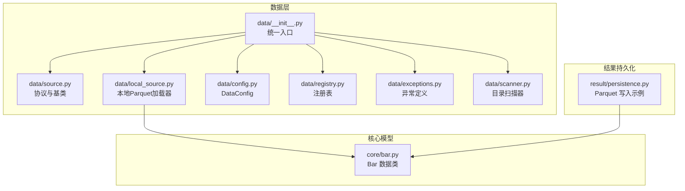
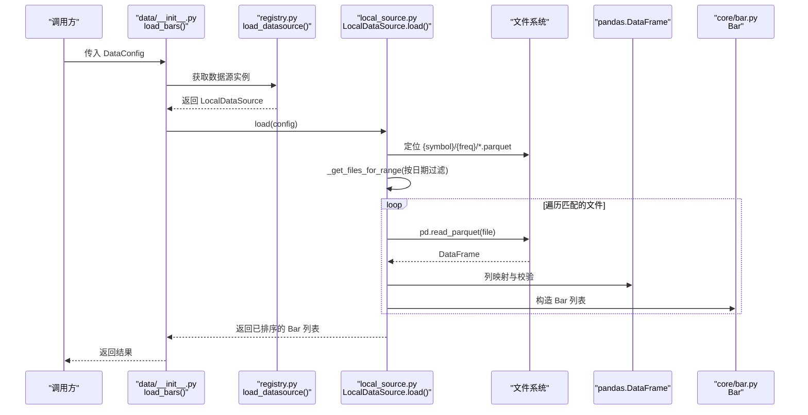
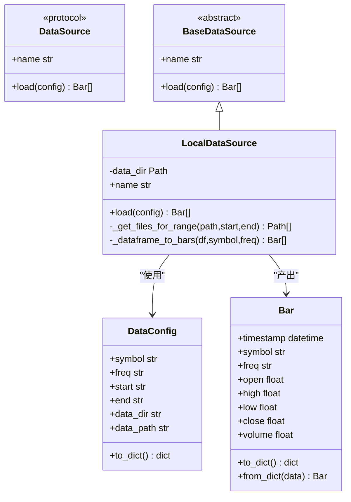
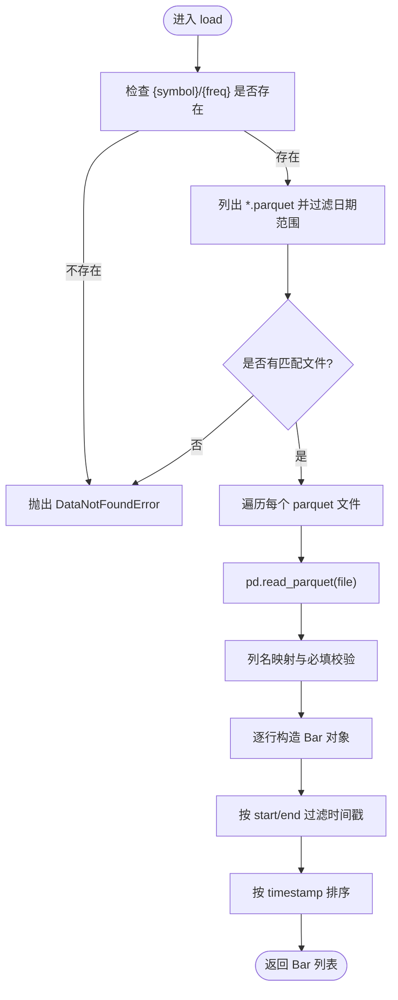
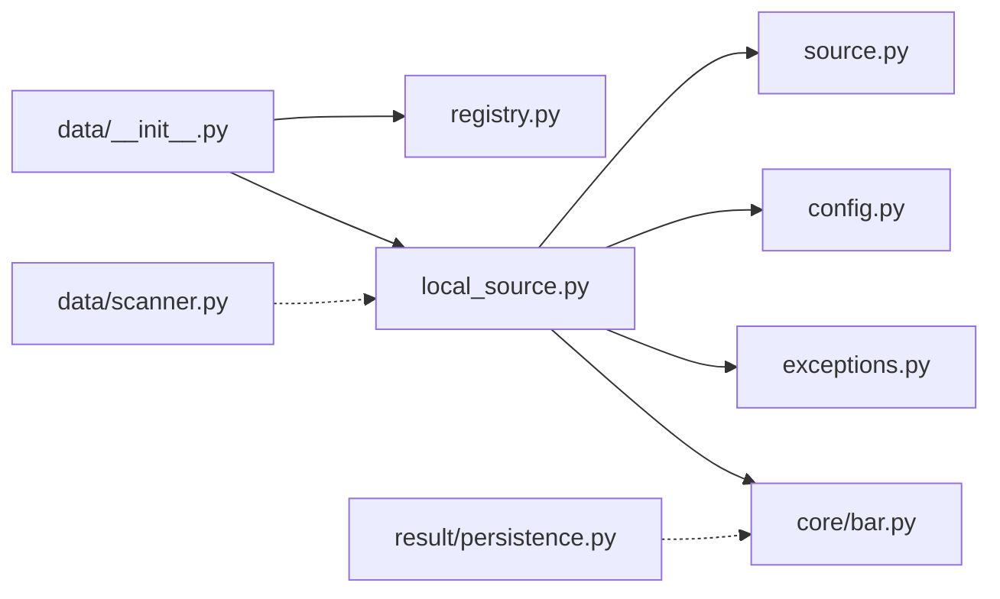

# 本地 Parquet 存储

<cite>
**本文引用的文件**   
- [0002-parquet-data-storage.md](file://docs/adr/0002-parquet-data-storage.md)
- [local_source.py](file://src/caisen/data/local_source.py)
- [config.py](file://src/caisen/data/config.py)
- [source.py](file://src/caisen/data/source.py)
- [registry.py](file://src/caisen/data/registry.py)
- [__init__.py](file://src/caisen/data/__init__.py)
- [exceptions.py](file://src/caisen/data/exceptions.py)
- [bar.py](file://src/caisen/core/bar.py)
- [scanner.py](file://src/caisen/data/scanner.py)
- [persistence.py](file://src/caisen/result/persistence.py)
- [test_local_data_loader.py](file://tests/test_local_data_loader.py)
</cite>

## 目录
1. [简介](#简介)
2. [项目结构](#项目结构)
3. [核心组件](#核心组件)
4. [架构总览](#架构总览)
5. [详细组件分析](#详细组件分析)
6. [依赖关系分析](#依赖关系分析)
7. [性能考虑](#性能考虑)
8. [故障排查指南](#故障排查指南)
9. [结论](#结论)
10. [附录](#附录)

## 简介
本技术文档围绕“本地 Parquet 数据存储”展开，面向量化回测与数据分析场景。仓库采用列式存储格式 Parquet 持久化历史行情数据（K线、分钟线），并按日期或区间进行分区组织，以提升查询效率与压缩率。本文从文件格式规范、目录结构与命名约定、元数据组织、读取优化策略、写入流程、批量处理与索引构建、格式转换与验证方法、性能调优与故障排查等方面进行全面说明，帮助读者快速理解并高效使用本地 Parquet 数据子系统。

## 项目结构
本地 Parquet 数据子系统位于 data 模块中，包含数据源协议、本地实现、配置、注册表、异常定义与扫描工具；核心 K 线数据结构位于 core.bar；结果持久化在 result.persistence 中也有 Parquet 写入示例。

图示来源
- [__init__.py:1-49](file://src/caisen/data/__init__.py#L1-L49)
- [source.py:1-62](file://src/caisen/data/source.py#L1-L62)
- [local_source.py:1-199](file://src/caisen/data/local_source.py#L1-L199)
- [config.py:1-51](file://src/caisen/data/config.py#L1-L51)
- [registry.py:1-108](file://src/caisen/data/registry.py#L1-L108)
- [exceptions.py:1-47](file://src/caisen/data/exceptions.py#L1-L47)
- [scanner.py:1-53](file://src/caisen/data/scanner.py#L1-L53)
- [bar.py:1-38](file://src/caisen/core/bar.py#L1-L38)
- [persistence.py:100-130](file://src/caisen/result/persistence.py#L100-L130)

章节来源
- [0002-parquet-data-storage.md:1-13](file://docs/adr/0002-parquet-data-storage.md#L1-L13)
- [local_source.py:1-199](file://src/caisen/data/local_source.py#L1-L199)
- [config.py:1-51](file://src/caisen/data/config.py#L1-L51)
- [source.py:1-62](file://src/caisen/data/source.py#L1-L62)
- [registry.py:1-108](file://src/caisen/data/registry.py#L1-L108)
- [__init__.py:1-49](file://src/caisen/data/__init__.py#L1-L49)
- [exceptions.py:1-47](file://src/caisen/data/exceptions.py#L1-L47)
- [scanner.py:1-53](file://src/caisen/data/scanner.py#L1-L53)
- [bar.py:1-38](file://src/caisen/core/bar.py#L1-L38)
- [persistence.py:100-130](file://src/caisen/result/persistence.py#L100-L130)

## 核心组件
- 数据源协议与基类：定义统一的 DataSource 协议与 BaseDataSource 抽象基类，约束 load(config) 接口与 name 属性。
- 本地数据源 LocalDataSource：基于本地磁盘的 Parquet 文件加载器，支持按符号与频率分区、按日期范围筛选、中英列名兼容、时间戳解析与 Bar 对象构造。
- 配置 DataConfig：封装 symbol、freq、start、end、data_dir 等参数，并提供路径计算与校验。
- 注册表 registry：提供数据源的注册、激活与获取能力，默认内置 local 数据源。
- 异常体系 exceptions：涵盖未找到数据、无效日期范围、数据校验失败等错误类型。
- 扫描器 scanner：在不读取文件内容的前提下，根据文件名推断可用数据的符号、频率与日期范围。
- 核心模型 Bar：K 线数据类，包含时间戳、标的、频率与 OHLCV 字段，并提供序列化/反序列化工具。
- 结果持久化 persistence：展示将 DataFrame 以 Parquet 格式落盘的用法（equity/trades/bars）。

章节来源
- [source.py:1-62](file://src/caisen/data/source.py#L1-L62)
- [local_source.py:1-199](file://src/caisen/data/local_source.py#L1-L199)
- [config.py:1-51](file://src/caisen/data/config.py#L1-L51)
- [registry.py:1-108](file://src/caisen/data/registry.py#L1-L108)
- [exceptions.py:1-47](file://src/caisen/data/exceptions.py#L1-L47)
- [scanner.py:1-53](file://src/caisen/data/scanner.py#L1-L53)
- [bar.py:1-38](file://src/caisen/core/bar.py#L1-L38)
- [persistence.py:100-130](file://src/caisen/result/persistence.py#L100-L130)

## 架构总览
下图展示了数据加载的整体流程：上层通过统一入口选择数据源，由注册表返回具体实现（默认 local），LocalDataSource 依据 DataConfig 定位目录与文件，过滤日期范围后逐文件读取为 DataFrame，转换为 Bar 列表并排序返回。

图示来源
- [__init__.py:34-49](file://src/caisen/data/__init__.py#L34-L49)
- [registry.py:67-88](file://src/caisen/data/registry.py#L67-L88)
- [local_source.py:39-80](file://src/caisen/data/local_source.py#L39-L80)
- [local_source.py:82-137](file://src/caisen/data/local_source.py#L82-L137)
- [local_source.py:139-199](file://src/caisen/data/local_source.py#L139-L199)
- [bar.py:1-38](file://src/caisen/core/bar.py#L1-L38)

## 详细组件分析

### 数据源协议与基类
- 协议 DataSource：声明 load(config) -> List[Bar] 与 name 属性，便于插件化扩展。
- 基类 BaseDataSource：提供抽象方法与默认 name 实现，降低重复代码。

图示来源
- [source.py:10-62](file://src/caisen/data/source.py#L10-L62)
- [local_source.py:15-199](file://src/caisen/data/local_source.py#L15-L199)
- [config.py:11-51](file://src/caisen/data/config.py#L11-L51)
- [bar.py:8-38](file://src/caisen/core/bar.py#L8-L38)

章节来源
- [source.py:1-62](file://src/caisen/data/source.py#L1-62)
- [local_source.py:15-199](file://src/caisen/data/local_source.py#L15-L199)
- [config.py:11-51](file://src/caisen/data/config.py#L11-L51)
- [bar.py:8-38](file://src/caisen/core/bar.py#L8-L38)

### 本地数据源 LocalDataSource
- 目录与文件约定
  - 目录结构：{data_dir}/{symbol}/{freq}/
  - 文件命名：支持单日期 {YYYYMMDD}.parquet 与区间 {YYYYMMDD}_{YYYYMMDD}.parquet，也兼容通用名称（如 data.parquet）
- 列定义与数据类型映射
  - 必需列：timestamp、open、high、low、close、volume
  - 可选列：freq（若缺失则使用配置中的 freq）
  - 列名兼容：同时支持英文与中文列名映射
  - 时间戳处理：优先使用 datetime 类型，否则自动解析字符串为 datetime
- 读取流程与过滤
  - 先按目录与文件名规则筛选出候选文件
  - 再对时间戳进行 start/end 二次过滤
  - 最终按 timestamp 排序返回
- 错误处理
  - 目录不存在或未找到匹配文件时抛出 DataNotFoundError
  - 缺少必要列时抛出 DataValidationError

图示来源
- [local_source.py:39-80](file://src/caisen/data/local_source.py#L39-L80)
- [local_source.py:82-137](file://src/caisen/data/local_source.py#L82-L137)
- [local_source.py:139-199](file://src/caisen/data/local_source.py#L139-L199)
- [exceptions.py:9-22](file://src/caisen/data/exceptions.py#L9-L22)
- [exceptions.py:43-47](file://src/caisen/data/exceptions.py#L43-L47)

章节来源
- [local_source.py:1-199](file://src/caisen/data/local_source.py#L1-199)
- [exceptions.py:1-47](file://src/caisen/data/exceptions.py#L1-L47)

### 配置 DataConfig
- 字段：symbol、freq、start、end、data_dir
- 校验：freq 必须在 SUPPORTED_FREQS 集合内
- 辅助：data_path 便捷属性用于拼接路径；to_dict 用于序列化

章节来源
- [config.py:1-51](file://src/caisen/data/config.py#L1-L51)

### 注册表 registry
- 功能：注册数据源、设置活跃数据源、获取数据源实例、列举已注册数据源
- 线程安全：使用锁保护全局状态
- 默认行为：未显式指定时回退到 local 数据源

章节来源
- [registry.py:1-108](file://src/caisen/data/registry.py#L1-L108)

### 统一入口 __init__.py
- 暴露 load_bars(config) 快捷函数，内部委托给注册表获取的数据源实例

章节来源
- [__init__.py:1-49](file://src/caisen/data/__init__.py#L1-L49)

### 扫描器 scanner
- 作用：在不读取文件内容的前提下，扫描 data_dir 下所有 {symbol}/{freq} 目录，并根据文件名推断 date_range
- 输出：包含 symbol、freq、date_range 的结构化信息，便于前端或上层系统展示可用数据集

章节来源
- [scanner.py:1-53](file://src/caisen/data/scanner.py#L1-L53)

### 核心模型 Bar
- 字段：timestamp、symbol、freq、open、high、low、close、volume
- 工具：to_dict/from_dict 用于 JSON 序列化与反序列化

章节来源
- [bar.py:1-38](file://src/caisen/core/bar.py#L1-L38)

### 结果持久化 persistence（Parquet 写入示例）
- 将 equity、trades、bars 等 DataFrame 以 Parquet 格式写入运行目录，便于后续分析与可视化

章节来源
- [persistence.py:103-127](file://src/caisen/result/persistence.py#L103-L127)

## 依赖关系分析
- 耦合与内聚
  - LocalDataSource 强依赖 DataConfig 与 Bar，弱依赖 pandas 与 pathlib
  - 注册表与数据源解耦良好，便于扩展新的数据源实现
- 外部依赖
  - pandas：负责 Parquet 读写与 DataFrame 操作
  - pathlib：路径与文件枚举
- 潜在循环依赖
  - 当前模块间导入清晰，未发现循环依赖迹象

图示来源
- [__init__.py:1-49](file://src/caisen/data/__init__.py#L1-L49)
- [registry.py:1-108](file://src/caisen/data/registry.py#L1-L108)
- [local_source.py:1-199](file://src/caisen/data/local_source.py#L1-L199)
- [source.py:1-62](file://src/caisen/data/source.py#L1-L62)
- [config.py:1-51](file://src/caisen/data/config.py#L1-L51)
- [exceptions.py:1-47](file://src/caisen/data/exceptions.py#L1-L47)
- [scanner.py:1-53](file://src/caisen/data/scanner.py#L1-L53)
- [bar.py:1-38](file://src/caisen/core/bar.py#L1-L38)
- [persistence.py:100-130](file://src/caisen/result/persistence.py#L100-L130)

章节来源
- [__init__.py:1-49](file://src/caisen/data/__init__.py#L1-L49)
- [registry.py:1-108](file://src/caisen/data/registry.py#L1-L108)
- [local_source.py:1-199](file://src/caisen/data/local_source.py#L1-L199)
- [source.py:1-62](file://src/caisen/data/source.py#L1-L62)
- [config.py:1-51](file://src/caisen/data/config.py#L1-L51)
- [exceptions.py:1-47](file://src/caisen/data/exceptions.py#L1-L47)
- [scanner.py:1-53](file://src/caisen/data/scanner.py#L1-L53)
- [bar.py:1-38](file://src/caisen/core/bar.py#L1-L38)
- [persistence.py:100-130](file://src/caisen/result/persistence.py#L100-L130)

## 性能考虑
- 分区读取
  - 利用目录 {symbol}/{freq} 与文件名 YYYYMMDD 或区间模式，仅加载与查询范围重叠的文件，减少 IO 与内存占用
- 列裁剪
  - 当前实现会将整表读入 DataFrame 后再构造 Bar，建议在大数据量场景下按需选择列以减少内存峰值
- 并行加载
  - 当前为顺序读取，可在不改变 API 的前提下引入多线程或多进程并发读取多个 parquet 文件，并在合并阶段做归并排序
- 时间戳过滤
  - 在 DataFrame 层面进行 start/end 过滤，适合中小规模数据；超大规模可考虑在 Parquet 层使用谓词下推（需上游写入时生成统计信息）
- 压缩与编码
  - 建议写入时使用合适的压缩算法（如 snappy/zstd）与列编码（字典编码对低基数列有效），提升压缩比与读取速度
- 批处理与索引
  - 写入端可按天或周进行批处理，避免过多小文件；必要时可为高频查询列建立外部索引（如 SQLite 或专用索引文件）

[本节为通用性能建议，不直接分析具体文件]

## 故障排查指南
- 未找到数据
  - 现象：抛出 DataNotFoundError
  - 排查：确认 {data_dir}/{symbol}/{freq} 目录存在且包含匹配的 parquet 文件；检查 start/end 是否与文件名范围重叠
- 数据校验失败
  - 现象：抛出 DataValidationError
  - 排查：确保 parquet 包含必需列（timestamp/open/high/low/close/volume），列名支持中英文映射；检查时间戳是否为可解析的 datetime 或字符串
- 无效日期范围
  - 现象：抛出 InvalidDateRangeError
  - 排查：确保 start <= end，且符合 YYYY-MM-DD 格式
- 数据源不可用
  - 现象：抛出 DataSourceNotAvailableError
  - 排查：确认已注册数据源名称正确，或通过 set_active_datasource 设置为期望实现

章节来源
- [exceptions.py:9-47](file://src/caisen/data/exceptions.py#L9-L47)
- [local_source.py:53-80](file://src/caisen/data/local_source.py#L53-L80)
- [local_source.py:139-199](file://src/caisen/data/local_source.py#L139-L199)

## 结论
本项目以 Parquet 作为本地历史行情数据的持久化格式，结合清晰的目录与命名约定、灵活的列映射与时间戳处理、以及可扩展的数据源注册机制，实现了高效、易用的本地数据读取能力。通过分区读取与日期范围过滤，系统在常见回测与分析场景中具备良好的性能表现。未来可在列裁剪、并行加载、谓词下推与索引构建等方面进行进一步优化，以满足更大规模数据的需求。

[本节为总结性内容，不直接分析具体文件]

## 附录

### 目录结构与命名约定
- 目录结构：{data_dir}/{symbol}/{freq}/
- 文件命名：
  - 单日期：{YYYYMMDD}.parquet
  - 区间：{YYYYMMDD}_{YYYYMMDD}.parquet
  - 通用：任意 *.parquet（会被纳入加载）
- 元数据组织：
  - 日期范围可通过文件名推断（scanner）
  - 其他元数据（如 symbol/freq）可从目录与配置中获得

章节来源
- [0002-parquet-data-storage.md:1-13](file://docs/adr/0002-parquet-data-storage.md#L1-L13)
- [scanner.py:1-53](file://src/caisen/data/scanner.py#L1-L53)
- [local_source.py:82-137](file://src/caisen/data/local_source.py#L82-L137)

### 数据格式与列定义
- 必需列：timestamp、open、high、low、close、volume
- 可选列：freq
- 列名兼容：支持英文与中文列名映射
- 时间戳处理：datetime 或可解析字符串

章节来源
- [local_source.py:139-199](file://src/caisen/data/local_source.py#L139-L199)

### 数据读取优化策略
- 分区读取：按目录与文件名过滤
- 列裁剪：建议在大数据场景按需选择列
- 并行加载：可引入并发读取与归并排序
- 时间戳过滤：DataFrame 层过滤，适合中小规模

章节来源
- [local_source.py:39-80](file://src/caisen/data/local_source.py#L39-L80)
- [local_source.py:82-137](file://src/caisen/data/local_source.py#L82-L137)

### 数据写入流程与批量处理
- 写入方式：使用 pandas DataFrame.to_parquet 写入
- 批量处理：按日/周聚合写入，控制文件大小与数量
- 索引构建：可结合外部索引或数据库加速查询

章节来源
- [persistence.py:103-127](file://src/caisen/result/persistence.py#L103-L127)

### 数据格式转换与验证
- 转换：Bar 对象与字典互转，便于 JSON 序列化
- 验证：加载时对列名与必填项进行校验，时间戳自动解析

章节来源
- [bar.py:20-38](file://src/caisen/core/bar.py#L20-L38)
- [local_source.py:139-199](file://src/caisen/data/local_source.py#L139-L199)

### 测试要点参考
- 文件匹配：单日期与区间文件匹配逻辑
- 无过滤：返回全部文件
- 越界过滤：排除不在范围内的文件
- 成功加载：构造 Bar 并断言字段
- 中文列名：验证列映射兼容性

章节来源
- [test_local_data_loader.py:36-179](file://tests/test_local_data_loader.py#L36-L179)