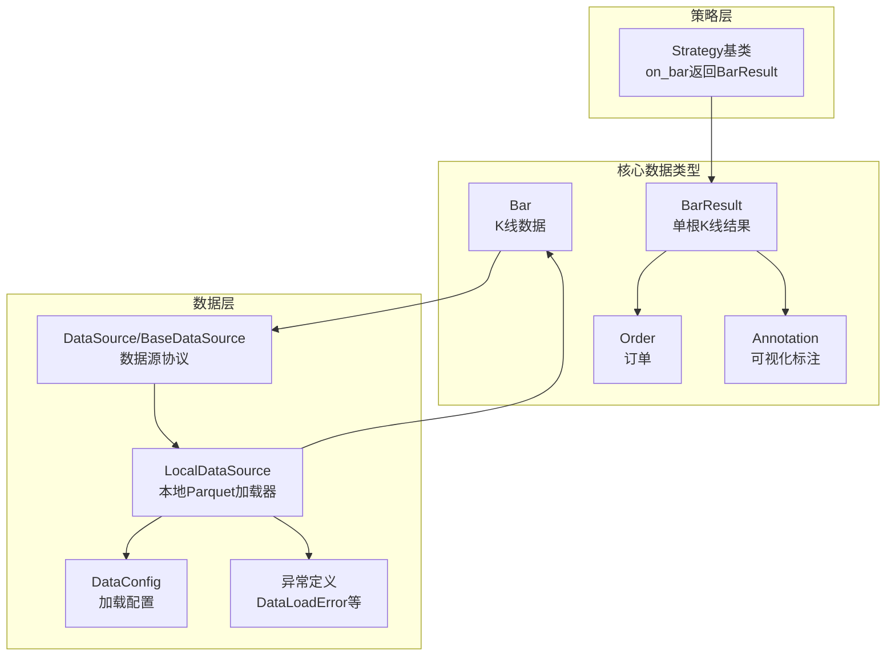
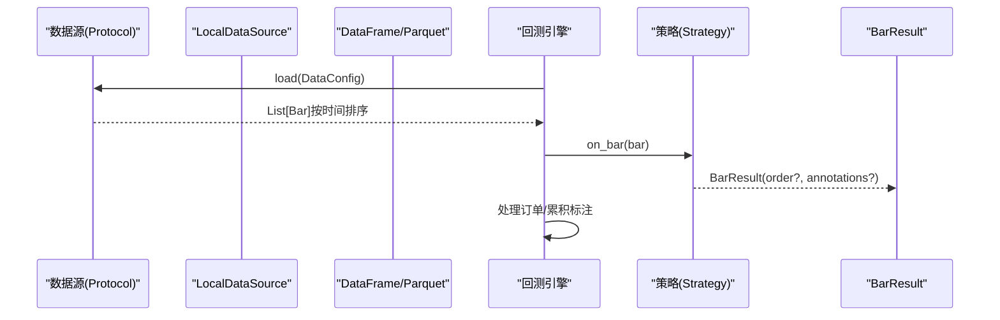
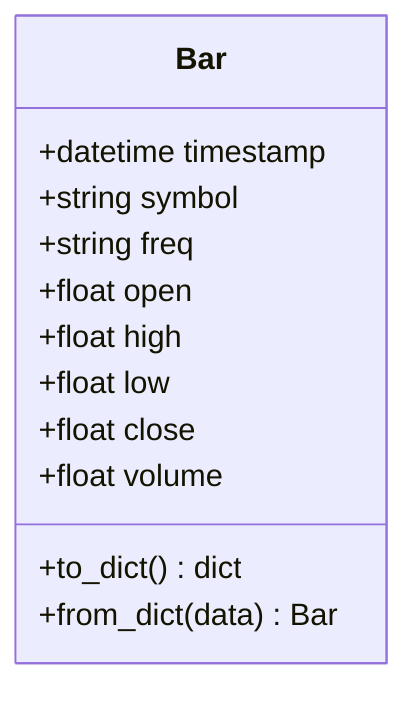
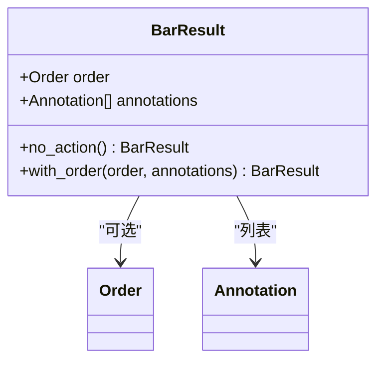
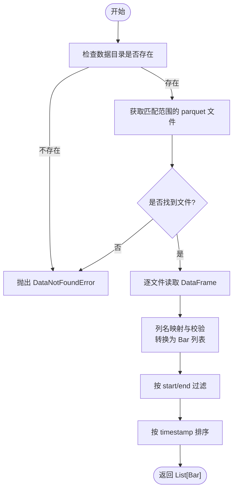
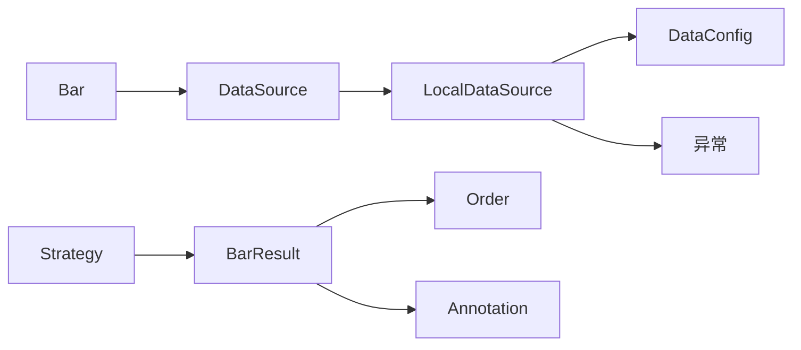

# K线数据处理

<cite>
**本文引用的文件**   
- [src/caisen/core/bar.py](file://src/caisen/core/bar.py)
- [src/caisen/core/bar_result.py](file://src/caisen/core/bar_result.py)
- [src/caisen/data/source.py](file://src/caisen/data/source.py)
- [src/caisen/data/local_source.py](file://src/caisen/data/local_source.py)
- [src/caisen/data/config.py](file://src/caisen/data/config.py)
- [src/caisen/data/exceptions.py](file://src/caisen/data/exceptions.py)
- [src/caisen/core/order.py](file://src/caisen/core/order.py)
- [src/caisen/core/annotation.py](file://src/caisen/core/annotation.py)
- [src/caisen/strategy/base.py](file://src/caisen/strategy/base.py)
- [examples/ma_cross.py](file://examples/ma_cross.py)
- [tests/test_data.py](file://tests/test_data.py)
</cite>

## 目录
1. [简介](#简介)
2. [项目结构](#项目结构)
3. [核心组件](#核心组件)
4. [架构总览](#架构总览)
5. [详细组件分析](#详细组件分析)
6. [依赖关系分析](#依赖关系分析)
7. [性能考虑](#性能考虑)
8. [故障排查指南](#故障排查指南)
9. [结论](#结论)
10. [附录：API 参考](#附录api-参考)

## 简介
本技术文档聚焦于 Caisen 量化回测系统的 K线数据处理模块，围绕 Bar（K线）与 BarResult（策略输出结果）两大核心类型展开。文档将深入解释：
- Bar 类的设计与数据结构：OHLC 价格字段、时间戳管理、成交量信息、频率标识等
- Bar 对象的创建与验证机制：数据完整性检查、格式标准化、排序与过滤
- BarResult 对象的结构化表示：订单与可视化标注的统一封装
- 时间序列处理逻辑：数据排序、缺失值处理、频率对齐思路
- 技术指标计算的数据基础：为策略开发提供统一数据接口
- 数据流处理流程图与数据结构说明
- 与数据源的集成方式：从外部数据转换为标准 Bar 对象

## 项目结构
K线数据处理相关代码主要分布在 core 与 data 两个子包中，配合 strategy 基类完成策略驱动的回测流程。

图表来源
- [src/caisen/core/bar.py:1-38](file://src/caisen/core/bar.py#L1-L38)
- [src/caisen/core/bar_result.py:1-41](file://src/caisen/core/bar_result.py#L1-L41)
- [src/caisen/data/source.py:1-62](file://src/caisen/data/source.py#L1-L62)
- [src/caisen/data/local_source.py:1-199](file://src/caisen/data/local_source.py#L1-L199)
- [src/caisen/data/config.py:1-51](file://src/caisen/data/config.py#L1-L51)
- [src/caisen/data/exceptions.py:1-47](file://src/caisen/data/exceptions.py#L1-L47)
- [src/caisen/core/order.py:1-44](file://src/caisen/core/order.py#L1-L44)
- [src/caisen/core/annotation.py:1-139](file://src/caisen/core/annotation.py#L1-L139)
- [src/caisen/strategy/base.py:1-37](file://src/caisen/strategy/base.py#L1-L37)

章节来源
- [src/caisen/core/bar.py:1-38](file://src/caisen/core/bar.py#L1-L38)
- [src/caisen/core/bar_result.py:1-41](file://src/caisen/core/bar_result.py#L1-L41)
- [src/caisen/data/source.py:1-62](file://src/caisen/data/source.py#L1-L62)
- [src/caisen/data/local_source.py:1-199](file://src/caisen/data/local_source.py#L1-L199)
- [src/caisen/data/config.py:1-51](file://src/caisen/data/config.py#L1-L51)
- [src/caisen/data/exceptions.py:1-47](file://src/caisen/data/exceptions.py#L1-L47)
- [src/caisen/core/order.py:1-44](file://src/caisen/core/order.py#L1-L44)
- [src/caisen/core/annotation.py:1-139](file://src/caisen/core/annotation.py#L1-L139)
- [src/caisen/strategy/base.py:1-37](file://src/caisen/strategy/base.py#L1-L37)

## 核心组件
本节对 Bar 与 BarResult 进行结构化解析，并给出它们在系统中的职责边界与使用约定。

- Bar（K线）
  - 字段：timestamp（datetime）、symbol（str）、freq（str，默认“1d”）、open/high/low/close/volume（float）
  - 序列化：to_dict/from_dict，支持 ISO 字符串与 datetime 互转
  - 用途：作为系统内统一的 K 线原子单元，供策略、指标、可视化共享

- BarResult（单根K线结果）
  - 字段：order（可选 Order）、annotations（List[Annotation]）
  - 工厂方法：no_action()、with_order(order, annotations=None)
  - 用途：策略 on_bar 的返回值，引擎每根 bar 解包并立即处理订单与标注

- 关联类型
  - Order：订单方向、数量或仓位比例、止盈止损等
  - Annotation：语义化标注，包含类型、时间戳与扩展数据

章节来源
- [src/caisen/core/bar.py:1-38](file://src/caisen/core/bar.py#L1-L38)
- [src/caisen/core/bar_result.py:1-41](file://src/caisen/core/bar_result.py#L1-L41)
- [src/caisen/core/order.py:1-44](file://src/caisen/core/order.py#L1-L44)
- [src/caisen/core/annotation.py:1-139](file://src/caisen/core/annotation.py#L1-L139)

## 架构总览
下图展示从数据源到策略处理的端到端数据流，以及 Bar/BarResult 在其中的角色。

图表来源
- [src/caisen/data/source.py:10-35](file://src/caisen/data/source.py#L10-L35)
- [src/caisen/data/local_source.py:39-80](file://src/caisen/data/local_source.py#L39-L80)
- [src/caisen/strategy/base.py:26-29](file://src/caisen/strategy/base.py#L26-L29)
- [src/caisen/core/bar_result.py:21-41](file://src/caisen/core/bar_result.py#L21-L41)

## 详细组件分析

### Bar 类设计与数据结构
- 设计要点
  - 使用 dataclass 简化构造与比较
  - timestamp 采用 Python datetime，便于跨平台与序列化
  - freq 用于标识周期（如 1d、5m、1h），参与后续频率对齐与筛选
  - OHLCV 均为 float，保证数值运算一致性
- 序列化与反序列化
  - to_dict：将 datetime 转为 ISO 字符串，便于存储与传输
  - from_dict：自动将 ISO 字符串还原为 datetime
- 典型用法
  - 直接构造 Bar 实例
  - 通过 DataFrame 批量转换（见 LocalDataSource）
  - 测试用例覆盖序列化/反序列化与列表排序

图表来源
- [src/caisen/core/bar.py:8-38](file://src/caisen/core/bar.py#L8-L38)

章节来源
- [src/caisen/core/bar.py:1-38](file://src/caisen/core/bar.py#L1-L38)
- [tests/test_data.py:12-34](file://tests/test_data.py#L12-L34)

### BarResult 类设计与数据结构
- 设计要点
  - 将“交易决策”和“可视化标注”统一封装，避免策略维护内部状态
  - 工厂方法 no_action()/with_order(...) 简化常见场景
- 与策略基类的契约
  - Strategy.on_bar 必须返回 BarResult
  - 引擎负责即时处理 order 与累积 annotations

图表来源
- [src/caisen/core/bar_result.py:21-41](file://src/caisen/core/bar_result.py#L21-L41)
- [src/caisen/core/order.py:16-44](file://src/caisen/core/order.py#L16-L44)
- [src/caisen/core/annotation.py:39-139](file://src/caisen/core/annotation.py#L39-L139)
- [src/caisen/strategy/base.py:26-29](file://src/caisen/strategy/base.py#L26-L29)

章节来源
- [src/caisen/core/bar_result.py:1-41](file://src/caisen/core/bar_result.py#L1-L41)
- [src/caisen/strategy/base.py:1-37](file://src/caisen/strategy/base.py#L1-L37)

### 数据源协议与本地实现
- DataSource 协议
  - load(config) -> List[Bar]：返回按时间排序的 Bar 列表
  - name：数据源名称
- BaseDataSource
  - 抽象基类，提供通用 name 属性
- LocalDataSource
  - 读取本地 parquet 文件，路径规则：{data_dir}/{symbol}/{freq}/{date}.parquet
  - 列名映射：支持中英文列名（如“日期/时间/datetime”、“开盘价/open/Open”等）
  - 范围过滤：根据 start/end 过滤 bars
  - 最终排序：按 timestamp 升序返回

图表来源
- [src/caisen/data/source.py:10-35](file://src/caisen/data/source.py#L10-L35)
- [src/caisen/data/local_source.py:39-80](file://src/caisen/data/local_source.py#L39-L80)
- [src/caisen/data/local_source.py:139-199](file://src/caisen/data/local_source.py#L139-L199)
- [src/caisen/data/exceptions.py:9-22](file://src/caisen/data/exceptions.py#L9-L22)

章节来源
- [src/caisen/data/source.py:1-62](file://src/caisen/data/source.py#L1-L62)
- [src/caisen/data/local_source.py:1-199](file://src/caisen/data/local_source.py#L1-L199)
- [src/caisen/data/exceptions.py:1-47](file://src/caisen/data/exceptions.py#L1-L47)

### 时间序列处理逻辑
- 数据排序
  - 数据源返回的 Bar 列表已按 timestamp 升序排列，确保策略侧无需重复排序
- 缺失值处理
  - 当前未内置插值或前向填充；若需补齐，可在数据预处理阶段完成
  - 建议：在写入 parquet 前进行缺失值检测与修复
- 频率对齐
  - 通过 DataConfig.freq 指定目标频率
  - 多频合并或重采样应在数据准备阶段完成，保持 Bar 列表的时间连续性
- 示例参考
  - 测试用例展示了 Bar 列表的时间顺序断言

章节来源
- [src/caisen/data/source.py:17-28](file://src/caisen/data/source.py#L17-L28)
- [src/caisen/data/local_source.py:72-80](file://src/caisen/data/local_source.py#L72-L80)
- [tests/test_data.py:57-74](file://tests/test_data.py#L57-L74)

### 技术指标计算的数据基础
- 统一数据接口
  - 策略通过 Bar 访问 OHLCV 与时间戳，形成一致的计算输入
- 常用模式
  - 滑动窗口：基于最近 N 根 Bar 计算均值、波动率等
  - 条件判断：基于高低点、收盘价相对位置、成交量变化等
- 示例参考
  - MA Cross 策略演示了如何基于 Bar.close 构建均线信号

章节来源
- [examples/ma_cross.py:23-41](file://examples/ma_cross.py#L23-L41)
- [src/caisen/core/bar.py:11-18](file://src/caisen/core/bar.py#L11-L18)

### 与数据源的集成方式
- 外部数据到标准 Bar 的转换流程
  - 读取外部数据（CSV/数据库/其他格式）
  - 标准化列名与类型（timestamp 转为 datetime，OHLCV 转为 float）
  - 生成 Bar 对象并写入 parquet（遵循目录结构）
  - 由 LocalDataSource 按需加载并按时间排序
- 列名映射
  - 支持英文与中文列名，降低接入成本
- 错误处理
  - 缺失必要列时抛出 DataValidationError
  - 无数据或范围无效时抛出相应异常

章节来源
- [src/caisen/data/local_source.py:139-199](file://src/caisen/data/local_source.py#L139-L199)
- [src/caisen/data/exceptions.py:43-47](file://src/caisen/data/exceptions.py#L43-L47)

## 依赖关系分析
- 耦合与内聚
  - Bar 与 BarResult 低耦合，分别承担“数据”和“结果”的职责
  - 数据源协议与具体实现分离，便于扩展新的数据后端
- 关键依赖链
  - LocalDataSource 依赖 Bar、DataConfig、异常类型
  - Strategy 基类依赖 BarResult，约束策略返回类型
  - 策略示例依赖 Bar、Order 完成交易逻辑

图表来源
- [src/caisen/core/bar.py:1-38](file://src/caisen/core/bar.py#L1-L38)
- [src/caisen/data/source.py:1-62](file://src/caisen/data/source.py#L1-L62)
- [src/caisen/data/local_source.py:1-199](file://src/caisen/data/local_source.py#L1-L199)
- [src/caisen/data/config.py:1-51](file://src/caisen/data/config.py#L1-L51)
- [src/caisen/data/exceptions.py:1-47](file://src/caisen/data/exceptions.py#L1-L47)
- [src/caisen/strategy/base.py:1-37](file://src/caisen/strategy/base.py#L1-L37)
- [src/caisen/core/bar_result.py:1-41](file://src/caisen/core/bar_result.py#L1-L41)
- [src/caisen/core/order.py:1-44](file://src/caisen/core/order.py#L1-L44)
- [src/caisen/core/annotation.py:1-139](file://src/caisen/core/annotation.py#L1-L139)

## 性能考虑
- 批量转换
  - 使用 DataFrame 迭代行生成 Bar 列表，适合中等规模数据；超大数据集可考虑分块处理
- 排序与过滤
  - 数据源在返回前进行排序与范围过滤，减少策略侧开销
- 内存占用
  - Bar 为轻量 dataclass，注意历史窗口过大时的内存增长，必要时限制缓存长度
- I/O 优化
  - Parquet 列式存储提升读取效率；合理划分文件粒度（按日或区间）有助于并行与增量更新

## 故障排查指南
- 常见问题
  - 找不到数据：检查 data_dir/{symbol}/{freq} 目录结构与文件名匹配规则
  - 列名不匹配：确认 parquet 包含 timestamp、open、high、low、close、volume（支持中英文别名）
  - 时间范围无效：start 不得晚于 end，且需在文件范围内
- 定位步骤
  - 打印 DataConfig 参数与 data_path
  - 查看抛出的异常类型与消息（DataNotFoundError/DataValidationError/InvalidDateRangeError）
  - 校验 parquet 列名与数据类型

章节来源
- [src/caisen/data/local_source.py:53-80](file://src/caisen/data/local_source.py#L53-L80)
- [src/caisen/data/local_source.py:175-179](file://src/caisen/data/local_source.py#L175-L179)
- [src/caisen/data/exceptions.py:9-47](file://src/caisen/data/exceptions.py#L9-L47)

## 结论
Bar 与 BarResult 构成了 K线数据处理与策略交互的核心契约。通过标准化的数据模型、明确的数据源协议与简洁的结果封装，系统实现了高内聚、低耦合的可扩展架构。建议在数据准备阶段完成缺失值处理与频率对齐，以保证策略侧获得连续、可靠的时间序列输入。

## 附录：API 参考

### Bar API
- 构造
  - 直接构造：传入 timestamp、symbol、freq、open、high、low、close、volume
- 序列化
  - to_dict：导出为字典，timestamp 以 ISO 字符串表示
  - from_dict：从字典重建 Bar，自动处理 timestamp 类型转换
- 使用示例路径
  - [构造与序列化测试:12-34](file://tests/test_data.py#L12-L34)

章节来源
- [src/caisen/core/bar.py:8-38](file://src/caisen/core/bar.py#L8-L38)
- [tests/test_data.py:12-34](file://tests/test_data.py#L12-L34)

### BarResult API
- 工厂方法
  - no_action：返回空订单与空标注的结果
  - with_order(order, annotations=None)：便捷构造带订单的结果
- 字段
  - order：可选订单
  - annotations：可视化标注列表
- 使用示例路径
  - [单元测试：默认行为与工厂方法:14-37](file://tests/test_bar_result.py#L14-L37)

章节来源
- [src/caisen/core/bar_result.py:21-41](file://src/caisen/core/bar_result.py#L21-L41)
- [tests/test_bar_result.py:14-37](file://tests/test_bar_result.py#L14-L37)

### 数据源 API
- DataSource 协议
  - load(config) -> List[Bar]：按时间排序返回 Bar 列表
  - name：数据源名称
- BaseDataSource
  - 抽象基类，提供 name 默认实现
- LocalDataSource
  - 读取 parquet，列名映射，范围过滤，最终排序
- 使用示例路径
  - [协议与基类定义:10-62](file://src/caisen/data/source.py#L10-L62)
  - [本地数据加载实现:39-80](file://src/caisen/data/local_source.py#L39-L80)

章节来源
- [src/caisen/data/source.py:10-62](file://src/caisen/data/source.py#L10-L62)
- [src/caisen/data/local_source.py:39-80](file://src/caisen/data/local_source.py#L39-L80)

### 策略基类 API
- Strategy
  - on_init(config)：回测初始化
  - on_bar(bar) -> BarResult：每根 K 线调用，返回 BarResult
  - on_session_end()：回测结束清理
  - reset()：重置策略状态
- 使用示例路径
  - [MA Cross 策略示例:23-41](file://examples/ma_cross.py#L23-L41)

章节来源
- [src/caisen/strategy/base.py:19-37](file://src/caisen/strategy/base.py#L19-L37)
- [examples/ma_cross.py:23-41](file://examples/ma_cross.py#L23-L41)