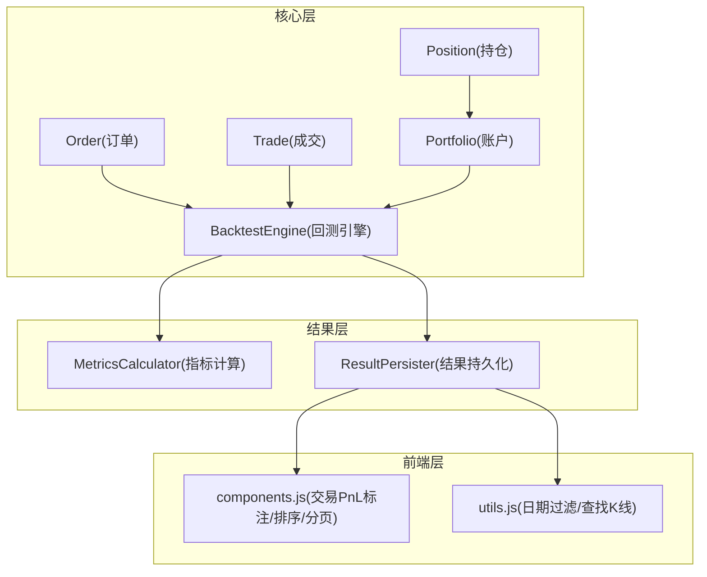
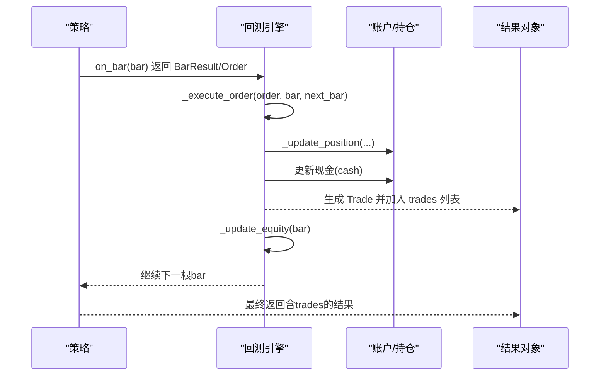
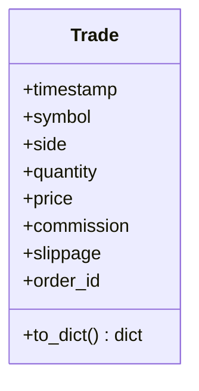
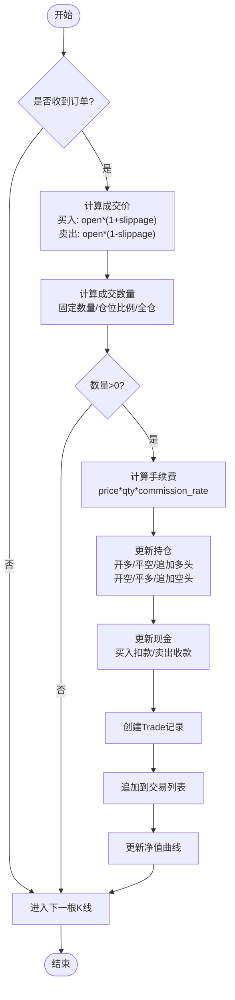
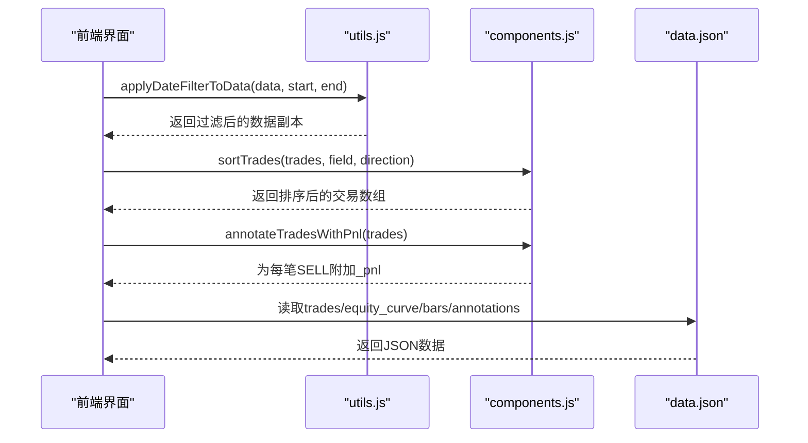
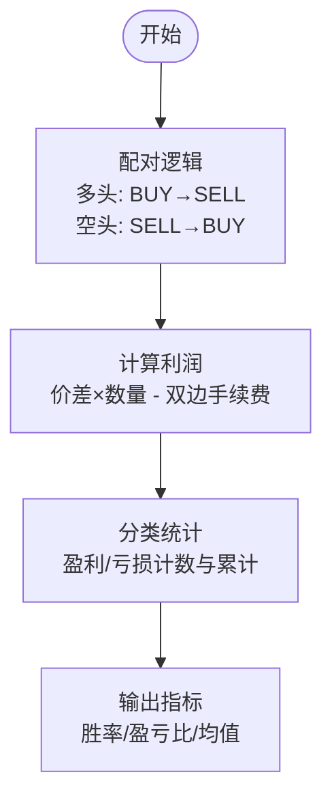
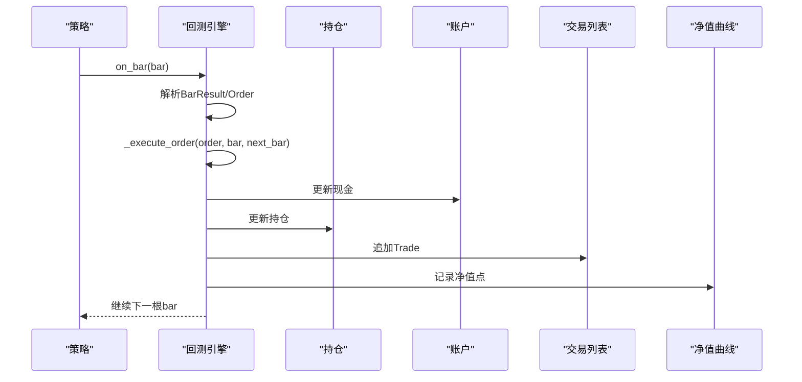
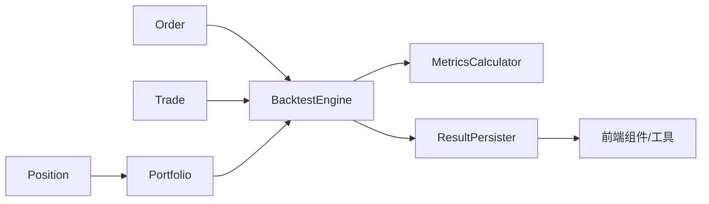

# 交易记录管理

<cite>
**本文引用的文件**
- [src/caisen/core/trade.py](file://src/caisen/core/trade.py)
- [src/caisen/core/order.py](file://src/caisen/core/order.py)
- [src/caisen/core/position.py](file://src/caisen/core/position.py)
- [src/caisen/core/portfolio.py](file://src/caisen/core/portfolio.py)
- [src/caisen/core/engine.py](file://src/caisen/core/engine.py)
- [src/caisen/result/calculator.py](file://src/caisen/result/calculator.py)
- [src/caisen/result/persistence.py](file://src/caisen/result/persistence.py)
- [src/caisen/frontend/src/js/components.js](file://src/caisen/frontend/src/js/components.js)
- [src/caisen/frontend/src/js/utils.js](file://src/caisen/frontend/src/js/utils.js)
- [tests/test_equity.py](file://tests/test_equity.py)
- [tests/test_backtest_engine.py](file://tests/test_backtest_engine.py)
</cite>

## 目录
1. [简介](#简介)
2. [项目结构](#项目结构)
3. [核心组件](#核心组件)
4. [架构总览](#架构总览)
5. [详细组件分析](#详细组件分析)
6. [依赖关系分析](#依赖关系分析)
7. [性能与复杂度](#性能与复杂度)
8. [故障排查指南](#故障排查指南)
9. [结论](#结论)
10. [附录：API 参考](#附录api-参考)

## 简介
本技术文档聚焦于 Caisen 量化回测系统的“交易记录管理”模块，围绕 Trade 类的设计、订单到成交的生成流程、交易历史管理与查询过滤、交易成本计算（手续费、滑点、净收益）、交易数据分析（胜率、盈亏分布、频率）以及结果持久化进行系统化说明。文档同时提供时序图、数据流图与类图，帮助读者从整体到细节理解系统如何产生、维护与分析交易记录。

## 项目结构
与交易记录管理相关的核心代码分布在以下位置：
- 核心数据结构与执行引擎：core 包
- 指标计算与结果持久化：result 包
- 前端可视化与筛选：frontend 包
- 测试用例：tests 包

图表来源
- [src/caisen/core/engine.py:1-210](file://src/caisen/core/engine.py#L1-L210)
- [src/caisen/result/calculator.py:1-185](file://src/caisen/result/calculator.py#L1-L185)
- [src/caisen/result/persistence.py:1-274](file://src/caisen/result/persistence.py#L1-L274)
- [src/caisen/frontend/src/js/components.js:251-332](file://src/caisen/frontend/src/js/components.js#L251-L332)
- [src/caisen/frontend/src/js/utils.js:134-185](file://src/caisen/frontend/src/js/utils.js#L134-L185)

章节来源
- [src/caisen/core/engine.py:1-210](file://src/caisen/core/engine.py#L1-L210)
- [src/caisen/result/persistence.py:1-274](file://src/caisen/result/persistence.py#L1-L274)

## 核心组件
本节对交易记录管理的核心数据结构与职责进行概览。

- Order（订单）
  - 定义交易意图，包含标的、方向、数量或仓位比例、订单类型、止盈止损等。
  - 用于策略在每根 K 线上发出交易指令。
- Trade（成交）
  - 一次实际成交的记录，包含时间、标的、方向、数量、成交价、手续费、滑点、关联订单号。
  - 由引擎在执行订单后生成并追加到交易列表。
- Position（持仓）
  - 记录某标的的持仓数量与均价，支持多空方向判断与绝对数量计算。
- Portfolio（账户）
  - 管理初始资金、现金、各标的持仓；提供按价格计算的权益与可用资金方法。
- BacktestEngine（回测引擎）
  - 驱动策略运行，处理订单执行、成交生成、持仓与现金更新、净值曲线构建，并输出包含 trades 的结果对象。

章节来源
- [src/caisen/core/order.py:1-44](file://src/caisen/core/order.py#L1-L44)
- [src/caisen/core/trade.py:1-30](file://src/caisen/core/trade.py#L1-L30)
- [src/caisen/core/position.py:1-33](file://src/caisen/core/position.py#L1-L33)
- [src/caisen/core/portfolio.py:1-46](file://src/caisen/core/portfolio.py#L1-L46)
- [src/caisen/core/engine.py:1-210](file://src/caisen/core/engine.py#L1-L210)

## 架构总览
下图展示了从订单到成交的关键调用链路与数据流转。

图表来源
- [src/caisen/core/engine.py:33-91](file://src/caisen/core/engine.py#L33-L91)
- [src/caisen/core/engine.py:93-128](file://src/caisen/core/engine.py#L93-L128)
- [src/caisen/core/engine.py:158-210](file://src/caisen/core/engine.py#L158-L210)

## 详细组件分析

### Trade 类设计与数据结构
- 字段说明
  - timestamp：成交时间
  - symbol：标的代码
  - side：买卖方向（BUY/SELL）
  - quantity：成交数量
  - price：成交价（已考虑滑点）
  - commission：手续费
  - slippage：滑点成本（成交价与基准价的差值绝对值）
  - order_id：关联订单ID
- 序列化
  - to_dict：将 Trade 序列化为字典，便于持久化与前端展示。

图表来源
- [src/caisen/core/trade.py:1-30](file://src/caisen/core/trade.py#L1-L30)

章节来源
- [src/caisen/core/trade.py:1-30](file://src/caisen/core/trade.py#L1-L30)

### 订单执行与成交生成流程
- 执行入口
  - 引擎主循环中，若策略返回订单，则调用内部执行方法生成成交。
- 成交价计算
  - 以次根 K 线的开盘价为基准，买入时乘以 (1+滑点)，卖出时乘以 (1-滑点)。
- 数量计算
  - 若指定具体数量，直接使用；否则根据可用资金与仓位比例计算可买数量；卖出时按现有持仓与比例计算平仓数量。
- 手续费计算
  - 手续费 = 成交价 × 数量 × 佣金率。
- 持仓与现金更新
  - 买入：增加多头或平空仓，扣减现金（含手续费）。
  - 卖出：减少多头或开空头，增加现金（扣除手续费）。
- 成交记录生成
  - 生成 Trade 实例，包含时间、标的、方向、数量、成交价、手续费、滑点、订单号，并追加至交易列表。

图表来源
- [src/caisen/core/engine.py:93-128](file://src/caisen/core/engine.py#L93-L128)
- [src/caisen/core/engine.py:130-157](file://src/caisen/core/engine.py#L130-L157)
- [src/caisen/core/engine.py:158-210](file://src/caisen/core/engine.py#L158-L210)

章节来源
- [src/caisen/core/engine.py:33-91](file://src/caisen/core/engine.py#L33-L91)
- [src/caisen/core/engine.py:93-128](file://src/caisen/core/engine.py#L93-L128)
- [src/caisen/core/engine.py:130-157](file://src/caisen/core/engine.py#L130-L157)
- [src/caisen/core/engine.py:158-210](file://src/caisen/core/engine.py#L158-L210)

### 交易历史管理：列表维护、查询过滤与统计分析
- 列表维护
  - 引擎持有 trades 列表，每次成交追加一条记录。
- 查询过滤
  - 前端提供按时间范围过滤的功能，对 bars、equity_curve、trades、annotations 统一应用起止时间过滤。
  - 提供按字段排序与分页渲染能力。
- 统计分析
  - 指标计算器基于 trades 配对（多头 BUY→SELL，空头 SELL→BUY），统计胜率、盈亏比、平均盈利/亏损、总交易数等。
  - 前端使用 FIFO 匹配为每笔 SELL 附加 _pnl，便于可视化展示单笔盈亏。

图表来源
- [src/caisen/frontend/src/js/utils.js:134-185](file://src/caisen/frontend/src/js/utils.js#L134-L185)
- [src/caisen/frontend/src/js/components.js:251-332](file://src/caisen/frontend/src/js/components.js#L251-L332)
- [src/caisen/result/persistence.py:136-202](file://src/caisen/result/persistence.py#L136-L202)

章节来源
- [src/caisen/frontend/src/js/utils.js:134-185](file://src/caisen/frontend/src/js/utils.js#L134-L185)
- [src/caisen/frontend/src/js/components.js:251-332](file://src/caisen/frontend/src/js/components.js#L251-L332)
- [src/caisen/result/calculator.py:124-185](file://src/caisen/result/calculator.py#L124-L185)

### 交易成本计算：手续费、滑点与净收益
- 手续费
  - 计算公式：成交价 × 数量 × 佣金率。
  - 买入时从现金中扣除，卖出时在收入中扣除。
- 滑点
  - 买入成交价 = 基准价 × (1+滑点)，卖出成交价 = 基准价 × (1-滑点)。
  - Trade.slippage 记录成交价与基准价的差值绝对值。
- 净收益（PnL）
  - 后端指标计算采用配对方式：
    - 多头：利润 = (卖价 - 买价) × 数量 - 买入手续费 - 卖出手续费
    - 空头：利润 = (买价 - 卖价) × 数量 - 买入手续费 - 卖出手续费
  - 前端 PnL 标注采用 FIFO 匹配，逐笔消耗未匹配的买入队列，按比例分摊买入手续费，再减去对应卖出手续费，得到每笔 SELL 的 _pnl。

图表来源
- [src/caisen/result/calculator.py:124-185](file://src/caisen/result/calculator.py#L124-L185)
- [src/caisen/frontend/src/js/components.js:251-288](file://src/caisen/frontend/src/js/components.js#L251-L288)

章节来源
- [src/caisen/core/engine.py:93-128](file://src/caisen/core/engine.py#L93-L128)
- [src/caisen/result/calculator.py:124-185](file://src/caisen/result/calculator.py#L124-L185)
- [src/caisen/frontend/src/js/components.js:251-288](file://src/caisen/frontend/src/js/components.js#L251-L288)
- [tests/test_equity.py:29-56](file://tests/test_equity.py#L29-L56)
- [tests/test_backtest_engine.py:202-218](file://tests/test_backtest_engine.py#L202-L218)

### 交易数据分析：胜率、盈亏分布与交易频率
- 胜率与盈亏比
  - 通过配对完成交易，统计盈利次数与亏损次数，计算胜率与盈亏比。
- 平均盈利/亏损
  - 分别汇总盈利与亏损金额，除以对应次数得到平均值。
- 总交易数
  - 统计所有成交记录条数。
- 交易频率
  - 可通过前端按时间过滤与排序，结合 bars 的时间跨度估算交易频率（例如单位时间的交易次数）。
- 盈亏分布
  - 前端可对 _pnl 进行直方图或箱线图展示，辅助观察盈亏分布特征。

章节来源
- [src/caisen/result/calculator.py:124-185](file://src/caisen/result/calculator.py#L124-L185)
- [src/caisen/frontend/src/js/components.js:251-332](file://src/caisen/frontend/src/js/components.js#L251-L332)
- [src/caisen/frontend/src/js/utils.js:134-185](file://src/caisen/frontend/src/js/utils.js#L134-L185)

### 交易生命周期时序图

图表来源
- [src/caisen/core/engine.py:33-91](file://src/caisen/core/engine.py#L33-L91)
- [src/caisen/core/engine.py:93-128](file://src/caisen/core/engine.py#L93-L128)
- [src/caisen/core/engine.py:158-210](file://src/caisen/core/engine.py#L158-L210)

## 依赖关系分析
- 核心层依赖
  - BacktestEngine 依赖 Order、Trade、Position、Portfolio 与配置对象。
- 结果层依赖
  - ResultPersister 依赖 BacktestResult（含 trades、equity_curve、bars、annotations）与 MetricsCalculator。
- 前端层依赖
  - components.js 与 utils.js 消费 data.json 中的 trades、equity_curve、bars、annotations，并提供过滤、排序与 PnL 标注。

图表来源
- [src/caisen/core/engine.py:1-210](file://src/caisen/core/engine.py#L1-L210)
- [src/caisen/result/calculator.py:1-185](file://src/caisen/result/calculator.py#L1-L185)
- [src/caisen/result/persistence.py:1-274](file://src/caisen/result/persistence.py#L1-L274)
- [src/caisen/frontend/src/js/components.js:251-332](file://src/caisen/frontend/src/js/components.js#L251-L332)
- [src/caisen/frontend/src/js/utils.js:134-185](file://src/caisen/frontend/src/js/utils.js#L134-L185)

章节来源
- [src/caisen/core/engine.py:1-210](file://src/caisen/core/engine.py#L1-L210)
- [src/caisen/result/calculator.py:1-185](file://src/caisen/result/calculator.py#L1-L185)
- [src/caisen/result/persistence.py:1-274](file://src/caisen/result/persistence.py#L1-L274)

## 性能与复杂度
- 订单执行与成交生成
  - 每根 K 线最多一次订单执行，时间复杂度 O(1)。
  - 持仓更新涉及字典查找与算术运算，O(1)。
- 交易统计
  - 指标计算遍历 trades 并按时间排序，时间复杂度 O(n log n)（排序）+ O(n)（配对统计）。
- 前端过滤与排序
  - 日期过滤对 bars、trades、equity_curve、annotations 逐一 filter，时间复杂度 O(n)。
  - 排序与分页渲染为 O(n log n) 与 O(k)（k 为当前页大小）。
- 持久化
  - Parquet 写入/读取利用列式存储，适合大规模时序数据；JSON 用于元数据与标注。

[本节为通用性能讨论，不直接分析具体文件]

## 故障排查指南
- 成交数量为 0
  - 检查可用资金与仓位比例设置，确保数量计算大于 0。
- 滑点影响异常
  - 确认滑点参数配置与买入/卖出方向是否正确应用。
- 手续费不一致
  - 核对佣金率与成交价、数量的乘积是否符合预期。
- 胜率与盈亏比为 0
  - 检查是否存在完整配对（BUY→SELL 或 SELL→BUY），未配对不会计入胜率。
- 前端 PnL 标注为空
  - 确认 trades 中存在对应的 BUY 队列且 FIFO 匹配成功。

章节来源
- [tests/test_equity.py:29-74](file://tests/test_equity.py#L29-L74)
- [tests/test_backtest_engine.py:202-218](file://tests/test_backtest_engine.py#L202-L218)
- [src/caisen/result/calculator.py:124-185](file://src/caisen/result/calculator.py#L124-L185)
- [src/caisen/frontend/src/js/components.js:251-288](file://src/caisen/frontend/src/js/components.js#L251-L288)

## 结论
Caisen 的交易记录管理模块以简洁的数据结构与清晰的执行流程为核心，实现了从订单到成交的可靠生成机制，并通过指标计算与持久化能力支撑了完整的交易历史管理与可视化分析。前端提供了灵活的过滤、排序与 PnL 标注功能，便于用户深入洞察交易表现与风险特征。

[本节为总结性内容，不直接分析具体文件]

## 附录：API 参考

### Trade 类
- 属性
  - timestamp：datetime，成交时间
  - symbol：str，标的代码
  - side：Side，买卖方向
  - quantity：float，成交数量
  - price：float，成交价
  - commission：float，手续费
  - slippage：float，滑点成本
  - order_id：str，订单ID
- 方法
  - to_dict() -> dict：序列化为字典，便于持久化与前端展示

章节来源
- [src/caisen/core/trade.py:1-30](file://src/caisen/core/trade.py#L1-L30)

### Order 类
- 属性
  - symbol：str，标的代码
  - side：Side，买卖方向
  - quantity：float，具体数量（0表示使用仓位比例或全仓）
  - position_pct：float，仓位比例（0-1），0表示全仓
  - order_type：str，订单类型（默认市价单）
  - order_id：str，订单ID
  - timestamp：Optional[datetime]，下单时间
  - stop_loss：float，止损价
  - target：float，目标价
- 方法
  - to_dict() -> dict：序列化为字典

章节来源
- [src/caisen/core/order.py:1-44](file://src/caisen/core/order.py#L1-L44)

### Position 类
- 属性
  - symbol：str，标的代码
  - quantity：float，持仓数量（正为多头，负为空头）
  - avg_cost：float，均价
- 方法
  - is_long() -> bool：是否多头
  - is_short() -> bool：是否空头
  - abs_quantity() -> float：绝对数量
  - to_dict() -> dict：序列化为字典

章节来源
- [src/caisen/core/position.py:1-33](file://src/caisen/core/position.py#L1-L33)

### Portfolio 类
- 属性
  - initial_capital：float，初始资金
  - cash：float，现金
  - positions：Dict[str, Position]，各标的持仓
- 方法
  - cost_value -> float：持仓成本估算价值
  - equity -> float：市值净值（兼容旧接口）
  - get_equity_with_prices(prices: Dict[str, float]) -> float：按指定价格计算权益
  - get_available_cash(prices: Dict[str, float]) -> float：可用资金（含空头释放资金）
  - to_dict() -> dict：序列化为字典

章节来源
- [src/caisen/core/portfolio.py:1-46](file://src/caisen/core/portfolio.py#L1-L46)

### BacktestEngine 关键方法
- run(strategy, bars, on_bar=None) -> BacktestResult：运行回测，返回包含 trades、equity_curve 等的结果
- _execute_order(order, bar, next_bar) -> Optional[Trade]：执行订单，生成成交记录
- _calculate_quantity(order, execution_price) -> float：计算实际成交数量
- _update_position(symbol, side, quantity, execution_price) -> void：更新持仓
- _update_equity(bar) -> void：更新净值曲线

章节来源
- [src/caisen/core/engine.py:33-91](file://src/caisen/core/engine.py#L33-L91)
- [src/caisen/core/engine.py:93-128](file://src/caisen/core/engine.py#L93-L128)
- [src/caisen/core/engine.py:130-157](file://src/caisen/core/engine.py#L130-L157)
- [src/caisen/core/engine.py:158-210](file://src/caisen/core/engine.py#L158-L210)

### 指标计算与持久化
- MetricsCalculator.calculate(result) -> PerformanceMetrics：计算年化收益、最大回撤、夏普比率、胜率、盈亏比、平均盈利/亏损、总交易数等
- ResultPersister.save(result, output_dir) -> str：保存 meta.json、equity.parquet、trades.parquet、annotations.json、metrics.json、bars.parquet、data.json
- ResultPersister.load(run_id, output_dir) -> Optional[dict]：加载回测结果
- ResultPersister.list_runs(output_dir) -> list：列出所有回测结果

章节来源
- [src/caisen/result/calculator.py:1-185](file://src/caisen/result/calculator.py#L1-L185)
- [src/caisen/result/persistence.py:59-133](file://src/caisen/result/persistence.py#L59-L133)
- [src/caisen/result/persistence.py:204-274](file://src/caisen/result/persistence.py#L204-L274)

### 前端交易数据处理
- applyDateFilterToData(data, startDate, endDate) -> Object：按起止时间过滤 bars、equity_curve、trades、annotations
- sortTrades(trades, field, direction) -> Array：按字段与方向排序交易
- annotateTradesWithPnl(trades) -> Array：FIFO 匹配为每笔 SELL 附加 _pnl

章节来源
- [src/caisen/frontend/src/js/utils.js:134-185](file://src/caisen/frontend/src/js/utils.js#L134-L185)
- [src/caisen/frontend/src/js/components.js:251-332](file://src/caisen/frontend/src/js/components.js#L251-L332)