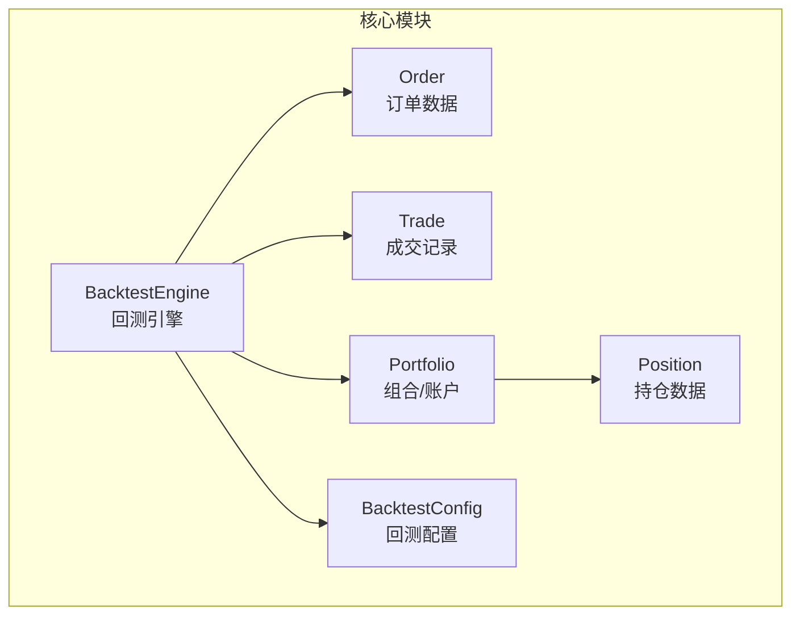
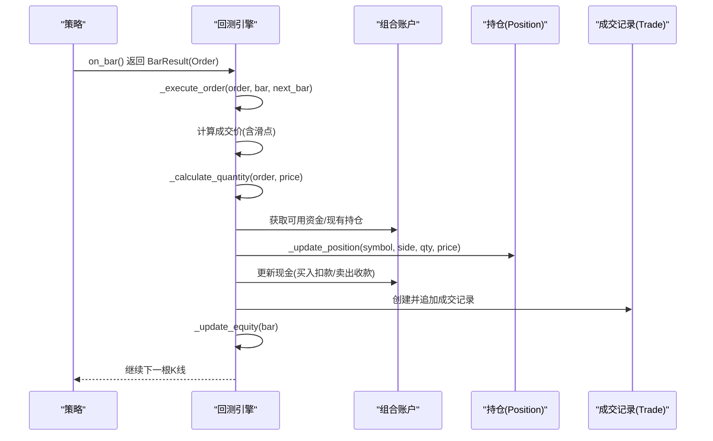
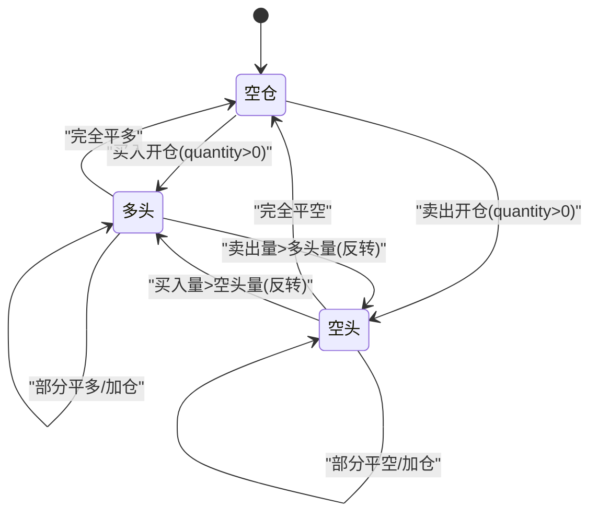
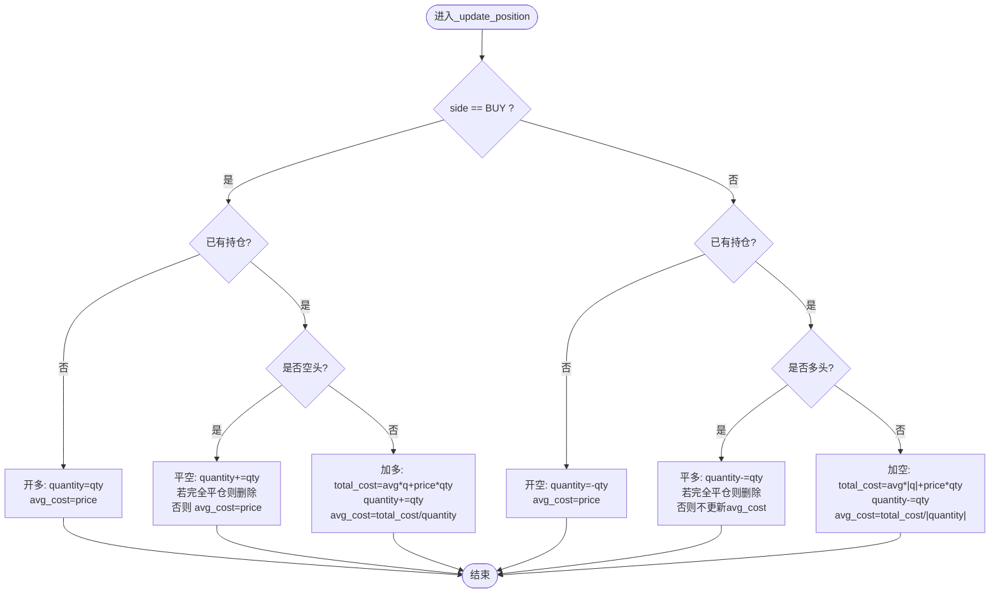
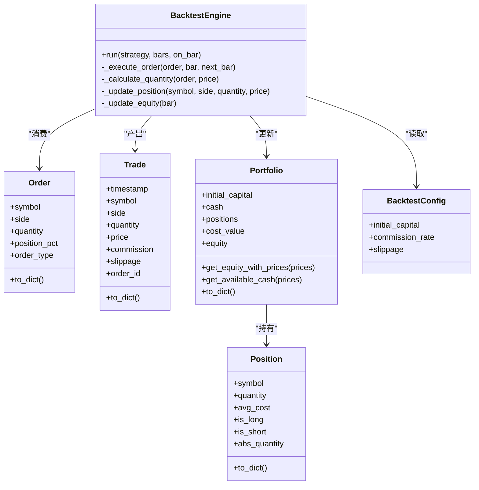

# 仓位跟踪系统

<cite>
**本文引用的文件**   
- [src/caisen/core/position.py](file://src/caisen/core/position.py)
- [src/caisen/core/order.py](file://src/caisen/core/order.py)
- [src/caisen/core/portfolio.py](file://src/caisen/core/portfolio.py)
- [src/caisen/core/trade.py](file://src/caisen/core/trade.py)
- [src/caisen/core/engine.py](file://src/caisen/core/engine.py)
- [src/caisen/core/config.py](file://src/caisen/core/config.py)
- [tests/test_position_management.py](file://tests/test_position_management.py)
- [tests/test_core_primitives.py](file://tests/test_core_primitives.py)
</cite>

## 目录
1. [简介](#简介)
2. [项目结构](#项目结构)
3. [核心组件](#核心组件)
4. [架构总览](#架构总览)
5. [详细组件分析](#详细组件分析)
6. [依赖关系分析](#依赖关系分析)
7. [性能考虑](#性能考虑)
8. [故障排查指南](#故障排查指南)
9. [结论](#结论)
10. [附录：API 参考](#附录api-参考)

## 简介
本技术文档聚焦于 Caisen 量化回测系统中的“仓位跟踪系统”，围绕 Position 数据模型与引擎中的仓位更新逻辑展开，系统性阐述多头、空头与空仓状态的表示与管理；开仓、加仓、减仓与平仓的完整流程；加权平均成本（avg_cost）的计算与更新策略；仓位状态判断属性 is_long、is_short 的实现；以及仓位数量管理与精度处理。同时提供 API 参考、状态图与时序图，并说明与订单执行系统的集成方式。

## 项目结构
与仓位跟踪直接相关的核心代码位于 core 模块，包含订单、交易记录、组合账户、持仓数据与回测引擎等。测试用例覆盖关键分支与边界条件，用于验证仓位变更与均价计算的正确性。

图表来源
- [src/caisen/core/position.py:1-33](file://src/caisen/core/position.py#L1-L33)
- [src/caisen/core/order.py:1-44](file://src/caisen/core/order.py#L1-L44)
- [src/caisen/core/trade.py:1-30](file://src/caisen/core/trade.py#L1-L30)
- [src/caisen/core/portfolio.py:1-46](file://src/caisen/core/portfolio.py#L1-L46)
- [src/caisen/core/engine.py:1-210](file://src/caisen/core/engine.py#L1-L210)
- [src/caisen/core/config.py:1-94](file://src/caisen/core/config.py#L1-L94)

章节来源
- [src/caisen/core/position.py:1-33](file://src/caisen/core/position.py#L1-L33)
- [src/caisen/core/order.py:1-44](file://src/caisen/core/order.py#L1-L44)
- [src/caisen/core/trade.py:1-30](file://src/caisen/core/trade.py#L1-L30)
- [src/caisen/core/portfolio.py:1-46](file://src/caisen/core/portfolio.py#L1-L46)
- [src/caisen/core/engine.py:1-210](file://src/caisen/core/engine.py#L1-L210)
- [src/caisen/core/config.py:1-94](file://src/caisen/core/config.py#L1-L94)

## 核心组件
- Position：以 quantity 的正负表示多头/空头，零值表示空仓；提供 is_long、is_short、abs_quantity 等便捷属性；维护 avg_cost 作为加权平均成本。
- Order：定义买卖方向、数量或仓位比例、滑点与手续费参数来源由引擎侧计算。
- Portfolio：管理现金与多标的持仓字典，提供基于当前价格或均价的权益估算与可用资金计算。
- Trade：记录每笔成交的时间、标的、方向、数量、成交价、手续费与滑点。
- BacktestEngine：负责订单执行、数量计算、持仓更新与净值曲线更新。

章节来源
- [src/caisen/core/position.py:1-33](file://src/caisen/core/position.py#L1-L33)
- [src/caisen/core/order.py:1-44](file://src/caisen/core/order.py#L1-L44)
- [src/caisen/core/portfolio.py:1-46](file://src/caisen/core/portfolio.py#L1-L46)
- [src/caisen/core/trade.py:1-30](file://src/caisen/core/trade.py#L1-L30)
- [src/caisen/core/engine.py:1-210](file://src/caisen/core/engine.py#L1-L210)

## 架构总览
仓位跟踪在回测引擎中完成闭环：策略产生订单 → 引擎计算成交价与数量 → 更新持仓与现金 → 生成成交记录 → 更新净值曲线。

图表来源
- [src/caisen/core/engine.py:33-91](file://src/caisen/core/engine.py#L33-L91)
- [src/caisen/core/engine.py:93-128](file://src/caisen/core/engine.py#L93-L128)
- [src/caisen/core/engine.py:130-157](file://src/caisen/core/engine.py#L130-L157)
- [src/caisen/core/engine.py:158-201](file://src/caisen/core/engine.py#L158-L201)
- [src/caisen/core/engine.py:202-210](file://src/caisen/core/engine.py#L202-L210)

## 详细组件分析

### Position 类设计与实现
- 字段
  - symbol：标的代码
  - quantity：持仓数量，正数为多头，负数为空头，零为空仓
  - avg_cost：加权平均成本
- 属性与方法
  - is_long：quantity > 0
  - is_short：quantity < 0
  - abs_quantity：|quantity|
  - to_dict：序列化输出

该设计通过单一数值表达方向与规模，简化了状态判断与算术运算。

章节来源
- [src/caisen/core/position.py:1-33](file://src/caisen/core/position.py#L1-L33)
- [tests/test_core_primitives.py:116-145](file://tests/test_core_primitives.py#L116-L145)

#### 状态图：仓位状态转换

图表来源
- [src/caisen/core/engine.py:158-201](file://src/caisen/core/engine.py#L158-L201)

### 仓位变更逻辑（开仓、加仓、减仓、平仓）
- 开仓
  - 买入且无持仓：新建多头，quantity=数量，avg_cost=成交价
  - 卖出且无持仓：新建空头，quantity=-数量，avg_cost=成交价
- 加仓
  - 多头加仓：total_cost = avg_cost*quantity + price*qty；quantity += qty；avg_cost = total_cost / quantity
  - 空头加仓：total_cost = avg_cost*|quantity| + price*qty；quantity -= qty；avg_cost = total_cost / |quantity|
- 减仓/部分平仓
  - 平多：quantity -= qty；若未完全平仓则不更新 avg_cost
  - 平空：quantity += qty；若未完全平仓则将 avg_cost 重置为本次成交价
- 完全平仓
  - 当 |quantity| 小于极小阈值时，从组合中删除该标的持仓

上述规则在引擎的 _update_position 中统一实现，并通过测试覆盖所有分支。

章节来源
- [src/caisen/core/engine.py:158-201](file://src/caisen/core/engine.py#L158-L201)
- [tests/test_position_management.py:30-161](file://tests/test_position_management.py#L30-L161)

#### 流程图：_update_position 决策路径

图表来源
- [src/caisen/core/engine.py:158-201](file://src/caisen/core/engine.py#L158-L201)

### 平均成本计算方法与更新策略
- 多头加仓：按成交金额加权平均更新 avg_cost
- 空头加仓：按成交金额加权平均更新 avg_cost
- 平多：不改变剩余仓位的 avg_cost（保留历史成本基准）
- 平空（部分）：将 avg_cost 重置为本次成交价（便于后续风控与盈亏评估）
- 完全平仓：移除标的，不再持有 avg_cost

该策略兼顾了会计一致性与风控可操作性，并在测试中验证了关键场景。

章节来源
- [src/caisen/core/engine.py:178-200](file://src/caisen/core/engine.py#L178-L200)
- [tests/test_position_management.py:59-91](file://tests/test_position_management.py#L59-L91)
- [tests/test_position_management.py:128-161](file://tests/test_position_management.py#L128-L161)

### 仓位状态判断（is_long、is_short、is_empty）
- is_long：quantity > 0
- is_short：quantity < 0
- is_empty：等价于 not is_long and not is_short（即 quantity == 0）

这些属性为上层风控与展示提供了简洁的状态查询接口。

章节来源
- [src/caisen/core/position.py:13-26](file://src/caisen/core/position.py#L13-L26)
- [tests/test_core_primitives.py:123-139](file://tests/test_core_primitives.py#L123-L139)

### 仓位数量管理与精度约束
- 支持小数位精度：quantity 使用浮点数，允许非整数份额
- 最小交易单位约束：当前实现未强制最小交易单位校验，如需约束可在下单前或 _calculate_quantity 中增加取整逻辑
- 完全平仓判定：使用极小阈值 1e-6 避免浮点误差导致残留微仓

建议：若市场要求最小交易单位（如 1 股/手），可在 _calculate_quantity 中对结果进行 floor/round 到最小单位的倍数。

章节来源
- [src/caisen/core/engine.py:172-174](file://src/caisen/core/engine.py#L172-L174)
- [src/caisen/core/engine.py:193-194](file://src/caisen/core/engine.py#L193-L194)

### 与订单执行系统的集成
- 订单来源：策略 on_bar 返回 BarResult(Order)，兼容旧版直接返回 Order
- 成交价计算：next_bar.open 乘以滑点因子（买入上浮、卖地下浮）
- 数量计算：支持固定数量、按仓位比例、全仓三种模式；买入考虑手续费率对可用资金的占用
- 成交记录：生成 Trade 并追加到 trades 列表
- 净值更新：根据最新收盘价与持仓计算权益曲线

章节来源
- [src/caisen/core/engine.py:33-91](file://src/caisen/core/engine.py#L33-L91)
- [src/caisen/core/engine.py:93-128](file://src/caisen/core/engine.py#L93-L128)
- [src/caisen/core/engine.py:130-157](file://src/caisen/core/engine.py#L130-L157)
- [src/caisen/core/engine.py:202-210](file://src/caisen/core/engine.py#L202-L210)

## 依赖关系分析
- BacktestEngine 依赖 Order、Trade、Portfolio、Position、BacktestConfig
- Portfolio 依赖 Position
- 测试用例覆盖 Position、Portfolio 与 Engine 的关键行为

图表来源
- [src/caisen/core/engine.py:1-210](file://src/caisen/core/engine.py#L1-L210)
- [src/caisen/core/order.py:1-44](file://src/caisen/core/order.py#L1-L44)
- [src/caisen/core/trade.py:1-30](file://src/caisen/core/trade.py#L1-L30)
- [src/caisen/core/portfolio.py:1-46](file://src/caisen/core/portfolio.py#L1-L46)
- [src/caisen/core/position.py:1-33](file://src/caisen/core/position.py#L1-L33)
- [src/caisen/core/config.py:1-94](file://src/caisen/core/config.py#L1-L94)

章节来源
- [src/caisen/core/engine.py:1-210](file://src/caisen/core/engine.py#L1-L210)
- [src/caisen/core/order.py:1-44](file://src/caisen/core/order.py#L1-L44)
- [src/caisen/core/trade.py:1-30](file://src/caisen/core/trade.py#L1-L30)
- [src/caisen/core/portfolio.py:1-46](file://src/caisen/core/portfolio.py#L1-L46)
- [src/caisen/core/position.py:1-33](file://src/caisen/core/position.py#L1-L33)
- [src/caisen/core/config.py:1-94](file://src/caisen/core/config.py#L1-L94)

## 性能考虑
- 时间复杂度：每根 K 线的订单执行与持仓更新均为 O(1)，净值更新遍历持仓集合为 O(N)，N 为标的数量
- 空间复杂度：trades 与 equity_curve 随运行时长线性增长，需注意日志落盘与内存控制
- 数值稳定性：使用 1e-6 阈值判定完全平仓，避免浮点误差导致的“幽灵仓位”
- 可扩展优化：可引入最小交易单位取整、批量净值快照、惰性写入磁盘等

[本节为通用指导，无需源码引用]

## 故障排查指南
- 症状：完全平仓后仍显示微小持仓
  - 原因：浮点误差导致 |quantity| 未归零
  - 定位：检查 _update_position 中的阈值判断
  - 修复：确保使用 1e-6 阈值并删除对应标的
- 症状：平空后 avg_cost 异常
  - 原因：部分平空应重置为成交价，而非沿用历史均价
  - 定位：确认平空分支的 avg_cost 赋值逻辑
- 症状：权益计算偏差
  - 原因：未传入最新价格或价格缺失回退到 avg_cost
  - 定位：检查 get_equity_with_prices 的入参与回退逻辑

章节来源
- [src/caisen/core/engine.py:172-174](file://src/caisen/core/engine.py#L172-L174)
- [src/caisen/core/engine.py:193-194](file://src/caisen/core/engine.py#L193-L194)
- [src/caisen/core/portfolio.py:25-31](file://src/caisen/core/portfolio.py#L25-L31)

## 结论
Caisen 的仓位跟踪系统以轻量数据模型与清晰的引擎流程为核心，实现了多头、空头与空仓的统一表示，覆盖了开仓、加仓、减仓与平仓的完整生命周期。加权平均成本的更新策略兼顾会计一致性与风控可操作性，配合完善的测试用例确保了关键分支的正确性。建议在需要时扩展最小交易单位约束与更丰富的风控回调，以满足更复杂的实战需求。

[本节为总结，无需源码引用]

## 附录：API 参考

### Position
- 属性
  - symbol：str，标的代码
  - quantity：float，正数多头、负数空头、零空仓
  - avg_cost：float，加权平均成本
  - is_long：bool，是否多头
  - is_short：bool，是否空头
  - abs_quantity：float，绝对数量
- 方法
  - to_dict()：dict，序列化为字典

示例路径
- [tests/test_core_primitives.py:123-145](file://tests/test_core_primitives.py#L123-L145)

章节来源
- [src/caisen/core/position.py:1-33](file://src/caisen/core/position.py#L1-L33)
- [tests/test_core_primitives.py:116-145](file://tests/test_core_primitives.py#L116-L145)

### Order
- 字段
  - symbol：str
  - side：BUY/SELL
  - quantity：float，>0 指定数量；=0 时使用 position_pct 或全仓
  - position_pct：float，0~1，0 表示全仓
  - order_type：str，默认市价单
  - stop_loss/target：float，止盈止损价
- 方法
  - to_dict()：dict

示例路径
- [src/caisen/core/order.py:16-44](file://src/caisen/core/order.py#L16-L44)

章节来源
- [src/caisen/core/order.py:1-44](file://src/caisen/core/order.py#L1-L44)

### Portfolio
- 属性
  - initial_capital：float
  - cash：float
  - positions：Dict[str, Position]
- 方法
  - cost_value：float，按 avg_cost 估算的成本价值
  - equity：float，向后兼容，等价于 cost_value
  - get_equity_with_prices(prices)：float，按实时价格计算权益
  - get_available_cash(prices)：float，可用资金（含空头释放）
  - to_dict()：dict

示例路径
- [tests/test_core_primitives.py:154-195](file://tests/test_core_primitives.py#L154-L195)

章节来源
- [src/caisen/core/portfolio.py:1-46](file://src/caisen/core/portfolio.py#L1-L46)
- [tests/test_core_primitives.py:154-195](file://tests/test_core_primitives.py#L154-L195)

### Trade
- 字段
  - timestamp：datetime
  - symbol：str
  - side：BUY/SELL
  - quantity：float
  - price：float
  - commission：float
  - slippage：float
  - order_id：str
- 方法
  - to_dict()：dict

示例路径
- [src/caisen/core/trade.py:8-30](file://src/caisen/core/trade.py#L8-L30)

章节来源
- [src/caisen/core/trade.py:1-30](file://src/caisen/core/trade.py#L1-L30)

### BacktestEngine（与仓位相关的方法）
- run(strategy, bars, on_bar=None)：驱动回测主循环
- _execute_order(order, bar, next_bar)：执行订单，更新持仓与现金，生成成交
- _calculate_quantity(order, execution_price)：计算实际成交数量
- _update_position(symbol, side, quantity, execution_price)：核心仓位更新逻辑
- _update_equity(bar)：更新净值曲线

示例路径
- [src/caisen/core/engine.py:33-91](file://src/caisen/core/engine.py#L33-L91)
- [src/caisen/core/engine.py:93-128](file://src/caisen/core/engine.py#L93-L128)
- [src/caisen/core/engine.py:130-157](file://src/caisen/core/engine.py#L130-L157)
- [src/caisen/core/engine.py:158-201](file://src/caisen/core/engine.py#L158-L201)
- [src/caisen/core/engine.py:202-210](file://src/caisen/core/engine.py#L202-L210)

章节来源
- [src/caisen/core/engine.py:1-210](file://src/caisen/core/engine.py#L1-L210)

### 回测配置（与仓位成本相关）
- BacktestConfig
  - initial_capital：初始资金
  - commission_rate：手续费率
  - slippage：滑点

示例路径
- [src/caisen/core/config.py:9-15](file://src/caisen/core/config.py#L9-L15)

章节来源
- [src/caisen/core/config.py:1-94](file://src/caisen/core/config.py#L1-L94)