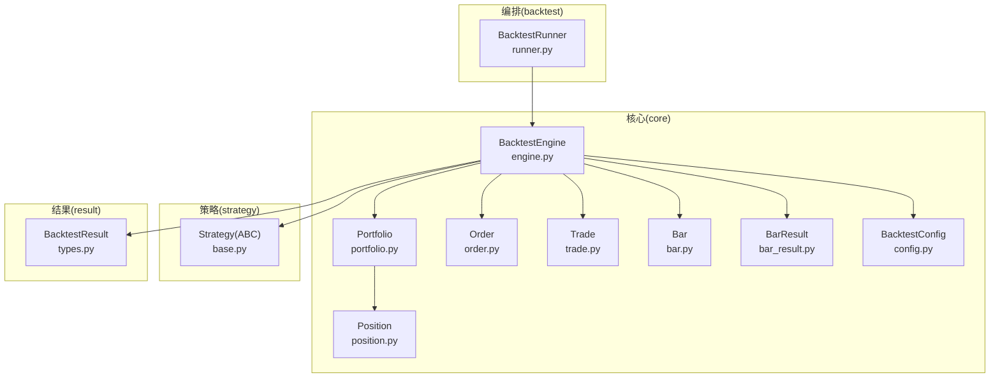
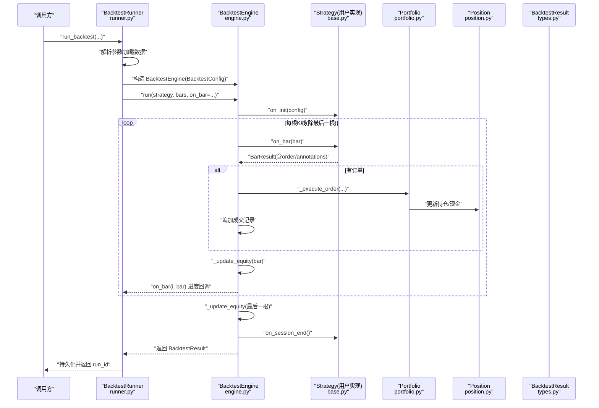
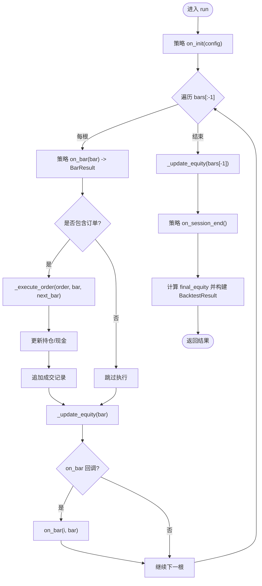
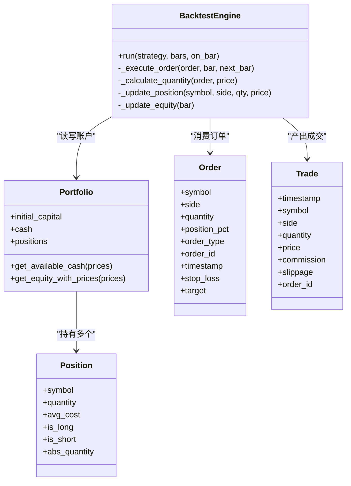
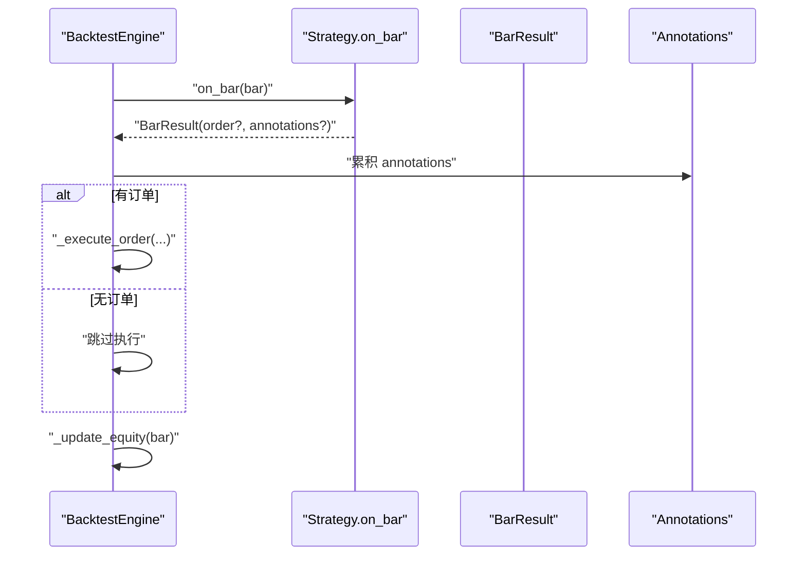
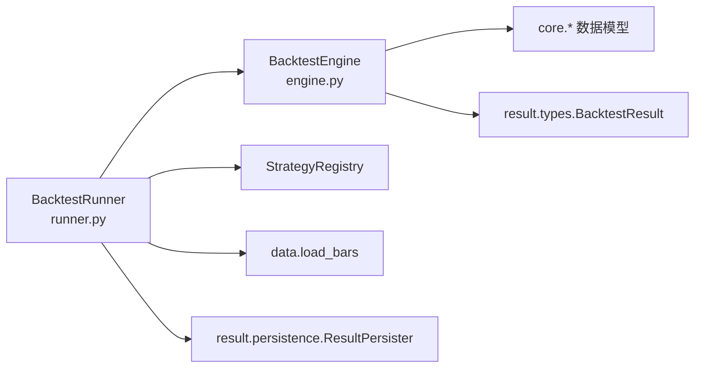

# 回测主引擎

<cite>
**本文引用的文件**   
- [engine.py](file://src/caisen/core/engine.py)
- [runner.py](file://src/caisen/backtest/runner.py)
- [bar_result.py](file://src/caisen/core/bar_result.py)
- [order.py](file://src/caisen/core/order.py)
- [portfolio.py](file://src/caisen/core/portfolio.py)
- [position.py](file://src/caisen/core/position.py)
- [trade.py](file://src/caisen/core/trade.py)
- [config.py](file://src/caisen/core/config.py)
- [bar.py](file://src/caisen/core/bar.py)
- [types.py](file://src/caisen/result/types.py)
- [base.py](file://src/caisen/strategy/base.py)
- [test_backtest_engine.py](file://tests/test_backtest_engine.py)
</cite>

## 目录
1. [简介](#简介)
2. [项目结构](#项目结构)
3. [核心组件](#核心组件)
4. [架构总览](#架构总览)
5. [详细组件分析](#详细组件分析)
6. [依赖关系分析](#依赖关系分析)
7. [性能与扩展性](#性能与扩展性)
8. [故障排查指南](#故障排查指南)
9. [结论](#结论)
10. [附录：API 参考](#附录api-参考)

## 简介
本文件面向 Caisen 量化回测系统的 BacktestEngine（回测主引擎），系统性阐述其核心架构、执行流程与事件驱动模型，重点覆盖以下方面：
- 初始化过程、主循环机制与事件驱动模型
- run() 方法的工作流程：策略初始化、K线遍历、策略决策处理、订单执行协调与净值更新
- 引擎与策略的交互模式：on_bar 回调机制与 BarResult 对象处理
- 订单生命周期管理：从策略信号到成交确认的完整链路
- 进度回调机制与异常处理策略
- 详细的 API 参考与使用示例路径
- 时序图与组件交互图，帮助开发者理解内部工作机制

## 项目结构
围绕回测主引擎的相关代码主要分布在 core 与 backtest 两个层次：
- core 层提供数据模型与核心引擎逻辑（Bar、Order、Position、Portfolio、Trade、BacktestConfig、BacktestEngine、BarResult）
- backtest 层提供高层编排器（BacktestRunner），负责参数加载、策略实例化、数据加载、运行引擎与结果持久化
- strategy 层定义策略抽象基类 Strategy，约定 on_init/on_bar/on_session_end 生命周期钩子
- result 层定义回测结果类型 BacktestResult

图表来源
- [engine.py:19-91](file://src/caisen/core/engine.py#L19-L91)
- [runner.py:26-94](file://src/caisen/backtest/runner.py#L26-L94)
- [base.py:19-37](file://src/caisen/strategy/base.py#L19-L37)
- [types.py:9-32](file://src/caisen/result/types.py#L9-L32)

章节来源
- [engine.py:19-91](file://src/caisen/core/engine.py#L19-L91)
- [runner.py:26-94](file://src/caisen/backtest/runner.py#L26-L94)
- [base.py:19-37](file://src/caisen/strategy/base.py#L19-L37)
- [types.py:9-32](file://src/caisen/result/types.py#L9-L32)

## 核心组件
- BacktestEngine：回测主引擎，负责策略生命周期调度、逐根 K 线驱动、订单执行、持仓与现金更新、净值曲线记录与结果组装。
- Portfolio/Position：账户与持仓状态容器，提供权益计算、可用资金估算等能力。
- Order/Trade：订单与成交记录，承载交易方向、数量、价格、手续费与滑点等信息。
- Bar/BarResult：K 线数据与单根 K 线策略输出封装（订单+标注）。
- BacktestConfig：回测配置（初始资金、手续费率、滑点）。
- Strategy：策略抽象基类，定义 on_init/on_bar/on_session_end 生命周期。
- BacktestResult：一次回测运行的结构化结果。

章节来源
- [engine.py:19-91](file://src/caisen/core/engine.py#L19-L91)
- [portfolio.py:7-46](file://src/caisen/core/portfolio.py#L7-L46)
- [position.py:6-33](file://src/caisen/core/position.py#L6-L33)
- [order.py:10-44](file://src/caisen/core/order.py#L10-L44)
- [trade.py:8-30](file://src/caisen/core/trade.py#L8-L30)
- [bar.py:8-38](file://src/caisen/core/bar.py#L8-L38)
- [bar_result.py:21-41](file://src/caisen/core/bar_result.py#L21-L41)
- [config.py:9-15](file://src/caisen/core/config.py#L9-L15)
- [base.py:19-37](file://src/caisen/strategy/base.py#L19-L37)
- [types.py:9-32](file://src/caisen/result/types.py#L9-L32)

## 架构总览
下图展示从上层编排器到引擎、策略、组合与结果的端到端调用链。

图表来源
- [runner.py:26-94](file://src/caisen/backtest/runner.py#L26-L94)
- [engine.py:33-91](file://src/caisen/core/engine.py#L33-L91)
- [base.py:19-37](file://src/caisen/strategy/base.py#L19-L37)
- [types.py:9-32](file://src/caisen/result/types.py#L9-L32)

## 详细组件分析

### BacktestEngine 核心流程
- 初始化：接收 BacktestConfig，创建 Portfolio（初始资金=现金），准备交易记录、净值曲线、标注列表与策略引用。
- run() 主循环：
  - 调用策略 on_init 完成初始化
  - 对 bars[:-1] 逐根遍历：
    - 调用策略 on_bar(bar)，期望返回 BarResult；兼容旧版直接返回 Order/None
    - 若存在订单，则执行成交（下一根开盘价±滑点），更新持仓与现金，记录 Trade
    - 更新净值曲线（当前 bar 收盘价）
    - 触发进度回调 on_bar(i, bar)
  - 最终再更新一次净值（bars[-1]）
  - 调用策略 on_session_end 收尾
  - 计算 final_equity 并返回 BacktestResult

图表来源
- [engine.py:33-91](file://src/caisen/core/engine.py#L33-L91)

章节来源
- [engine.py:33-91](file://src/caisen/core/engine.py#L33-L91)

### 订单执行生命周期
- 成交价确定：以下一根 bar 的 open 为基准，买入乘以 (1+slippage)，卖出乘以 (1-slippage)。
- 数量计算：
  - 若 order.quantity > 0，直接使用
  - 否则按可用资金与仓位比例计算：
    - 买入：available_cash / (price*(1+commission_rate))，再乘以 position_pct（0 表示全仓）
    - 卖出：根据现有持仓绝对数量与 position_pct（0 表示全仓）
- 手续费：price * quantity * commission_rate
- 持仓更新：
  - 多头开仓/加仓：更新平均成本
  - 空头开仓/加仓：更新平均成本
  - 平仓：数量归零时移除该标的持仓
- 现金变动：买入扣减（含手续费），卖出增加（扣除手续费）
- 成交记录：生成 Trade，记录时间戳、方向、数量、价格、手续费、滑点与订单 ID

图表来源
- [engine.py:93-210](file://src/caisen/core/engine.py#L93-L210)
- [portfolio.py:7-46](file://src/caisen/core/portfolio.py#L7-L46)
- [position.py:6-33](file://src/caisen/core/position.py#L6-L33)
- [order.py:10-44](file://src/caisen/core/order.py#L10-L44)
- [trade.py:8-30](file://src/caisen/core/trade.py#L8-L30)

章节来源
- [engine.py:93-210](file://src/caisen/core/engine.py#L93-L210)
- [portfolio.py:7-46](file://src/caisen/core/portfolio.py#L7-L46)
- [position.py:6-33](file://src/caisen/core/position.py#L6-L33)
- [order.py:10-44](file://src/caisen/core/order.py#L10-L44)
- [trade.py:8-30](file://src/caisen/core/trade.py#L8-L30)

### 策略与引擎交互（on_bar 与 BarResult）
- 策略必须实现 on_bar(bar)，返回 BarResult（或兼容旧版返回 Order/None）
- BarResult 封装：
  - order：可选订单
  - annotations：本 bar 新增的可视化标注列表
- 引擎在每根 bar 处理后：
  - 解包 BarResult，收集 annotations
  - 若有订单，立即执行并记录成交
  - 更新净值曲线
  - 触发进度回调

图表来源
- [engine.py:47-70](file://src/caisen/core/engine.py#L47-L70)
- [bar_result.py:21-41](file://src/caisen/core/bar_result.py#L21-L41)
- [base.py:26-29](file://src/caisen/strategy/base.py#L26-L29)

章节来源
- [engine.py:47-70](file://src/caisen/core/engine.py#L47-L70)
- [bar_result.py:21-41](file://src/caisen/core/bar_result.py#L21-L41)
- [base.py:26-29](file://src/caisen/strategy/base.py#L26-L29)

### 进度回调与异常处理
- 进度回调：
  - engine.run 支持 on_bar(index, bar) 回调，每根 bar 处理后触发
  - BacktestRunner 包装一层 _on_bar，每 100 根或最后一根触发外部 on_progress(count, total, date)
- 异常处理：
  - BacktestRunner 在策略不存在、数据为空、策略加载失败等场景抛出 BacktestError
  - 数据缺失时返回空列表，由 Runner 判定并抛错
  - 引擎内部未捕获异常将向上传播，建议在上层进行统一捕获与日志记录

章节来源
- [engine.py:67-70](file://src/caisen/core/engine.py#L67-L70)
- [runner.py:77-94](file://src/caisen/backtest/runner.py#L77-L94)
- [runner.py:124-143](file://src/caisen/backtest/runner.py#L124-L143)
- [runner.py:146-163](file://src/caisen/backtest/runner.py#L146-L163)

## 依赖关系分析
- 模块耦合：
  - BacktestEngine 强依赖 core 层的数据模型与组合管理
  - BacktestRunner 依赖策略注册表、数据加载与结果持久化，作为编排层与 HTTP/WebSocket 解耦
- 外部依赖：
  - YAML 解析用于加载策略参数配置
  - 数据源通过 DataConfig 与 load_bars 接口加载 K 线数据
- 潜在循环依赖：
  - 引擎延迟导入 BacktestResult 以避免循环依赖

图表来源
- [runner.py:26-94](file://src/caisen/backtest/runner.py#L26-L94)
- [engine.py:81-91](file://src/caisen/core/engine.py#L81-L91)

章节来源
- [runner.py:26-94](file://src/caisen/backtest/runner.py#L26-L94)
- [engine.py:81-91](file://src/caisen/core/engine.py#L81-L91)

## 性能与扩展性
- 时间复杂度：主循环为 O(N)，N 为 K 线数量；每根 bar 的策略决策与订单执行均为常数时间操作
- 内存占用：
  - equity_curve 与 trades 随 N 线性增长，适合离线回测
  - annotations 随策略输出增长，建议控制每根 bar 的标注数量
- 可扩展点：
  - 可替换 _execute_order 以接入更复杂的撮合逻辑（限价单、部分成交、盘口深度等）
  - 可在 _update_equity 中引入多资产定价与汇率换算
  - 可通过 on_bar 回调对接 WebSocket 实时推送进度

[本节为通用指导，不直接分析具体文件]

## 故障排查指南
- 常见错误与定位：
  - 策略未注册：检查 StrategyRegistry 是否正确登记策略类名
  - 数据为空：确认 DataConfig 的 symbol/freq/start/end 与 data_dir 配置正确
  - 策略加载失败：检查模块路径与类名匹配，以及 __init__ 签名与传入参数
  - 订单未成交：检查可用资金、仓位比例与滑点设置是否导致数量为 0
- 调试建议：
  - 在 on_bar 中打印 BarResult 的 order 与 annotations
  - 观察 equity_curve 的 cash 与 positions 变化，核对成交前后状态
  - 使用测试用例中的 DummyStrategy 快速验证引擎行为

章节来源
- [runner.py:124-143](file://src/caisen/backtest/runner.py#L124-L143)
- [runner.py:146-163](file://src/caisen/backtest/runner.py#L146-L163)
- [test_backtest_engine.py:104-186](file://tests/test_backtest_engine.py#L104-L186)

## 结论
BacktestEngine 采用清晰的事件驱动与生命周期钩子设计，将策略决策与订单执行解耦，并通过 BarResult 统一输出订单与标注信息。配合 BacktestRunner 的参数解析、数据加载与结果持久化，形成完整的回测流水线。建议在策略实现中遵循 BarResult 规范，合理设置仓位比例与风控参数，以获得稳定可靠的回测结果。

[本节为总结性内容，不直接分析具体文件]

## 附录：API 参考

### BacktestEngine
- 构造函数
  - 参数：config: BacktestConfig
  - 作用：初始化组合与回测配置
- run(strategy, bars, on_bar=None)
  - 参数：
    - strategy: 继承自 Strategy 的策略实例
    - bars: List[Bar]，按时间顺序排列的 K 线数据
    - on_bar: 可选回调，签名 on_bar(index, bar)
  - 返回值：BacktestResult
  - 行为要点：
    - 调用策略 on_init 初始化
    - 遍历 bars[:-1]，每根 bar 调用 on_bar 获取 BarResult
    - 若 BarResult.order 非空，执行成交并记录 Trade
    - 每根 bar 后更新净值曲线并触发进度回调
    - 最后更新一次净值，调用 on_session_end，返回 BacktestResult

章节来源
- [engine.py:22-91](file://src/caisen/core/engine.py#L22-L91)

### BacktestRunner
- run_backtest(...)
  - 参数：
    - strategy_name: 注册的策略类名
    - symbol/freq/start/end: 数据范围
    - params: 策略参数字典（优先级最高）
    - config_name: 配置文件名（不含 .yaml），用于加载默认参数
    - on_progress: 可选进度回调，签名 on_progress(count, total, date)
    - output_dir: 输出目录
    - bars: 注入 K 线数据（测试用）
  - 返回值：run_id 字符串
  - 行为要点：
    - 解析参数与加载数据
    - 实例化策略
    - 运行引擎并带进度回调
    - 持久化结果并返回 run_id

章节来源
- [runner.py:27-94](file://src/caisen/backtest/runner.py#L27-L94)

### 关键数据模型
- Bar：K 线数据（时间戳、品种、频率、OHLCV）
- Order：订单（方向、数量/仓位比例、类型、止盈止损等）
- Position：持仓（数量正负代表多空、均价）
- Portfolio：账户（初始资金、现金、持仓字典、权益计算）
- Trade：成交记录（时间、方向、数量、价格、手续费、滑点、订单 ID）
- BarResult：单根 K 线策略输出（order、annotations）
- BacktestConfig：回测配置（初始资金、手续费率、滑点）
- BacktestResult：回测结果（策略名、bars、trades、equity_curve、annotations、initial_capital、final_equity）

章节来源
- [bar.py:8-38](file://src/caisen/core/bar.py#L8-L38)
- [order.py:10-44](file://src/caisen/core/order.py#L10-L44)
- [position.py:6-33](file://src/caisen/core/position.py#L6-L33)
- [portfolio.py:7-46](file://src/caisen/core/portfolio.py#L7-L46)
- [trade.py:8-30](file://src/caisen/core/trade.py#L8-L30)
- [bar_result.py:21-41](file://src/caisen/core/bar_result.py#L21-L41)
- [config.py:9-15](file://src/caisen/core/config.py#L9-L15)
- [types.py:9-32](file://src/caisen/result/types.py#L9-L32)

### 使用示例（路径）
- 基础用法与断言示例：
  - [tests/test_backtest_engine.py:104-186](file://tests/test_backtest_engine.py#L104-L186)
- 策略模板与回测配置示例：
  - [examples/caisen_strategy_template.yaml:1-59](file://examples/caisen_strategy_template.yaml#L1-L59)