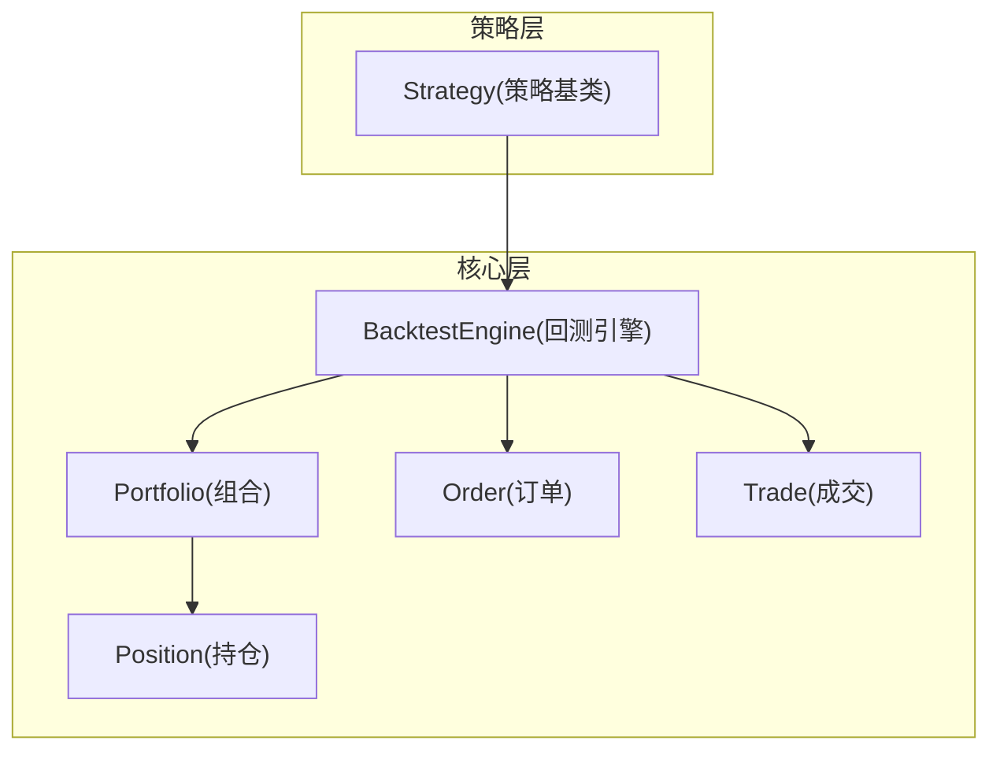
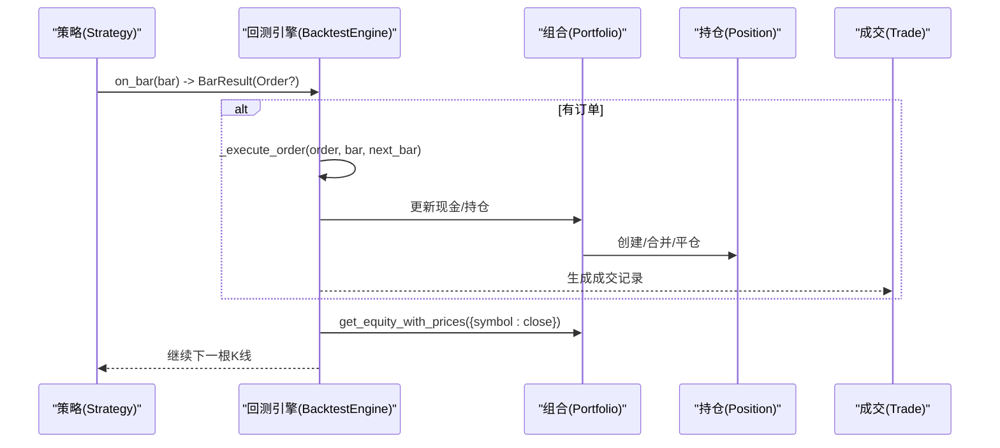
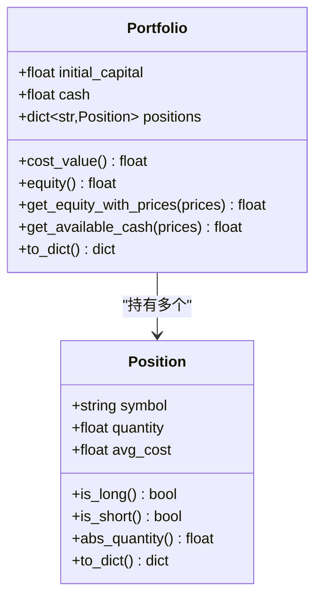
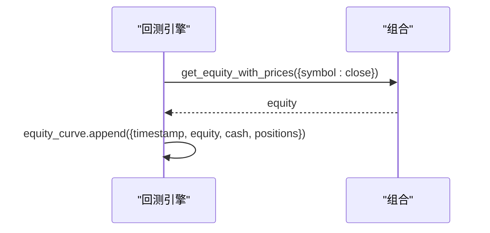
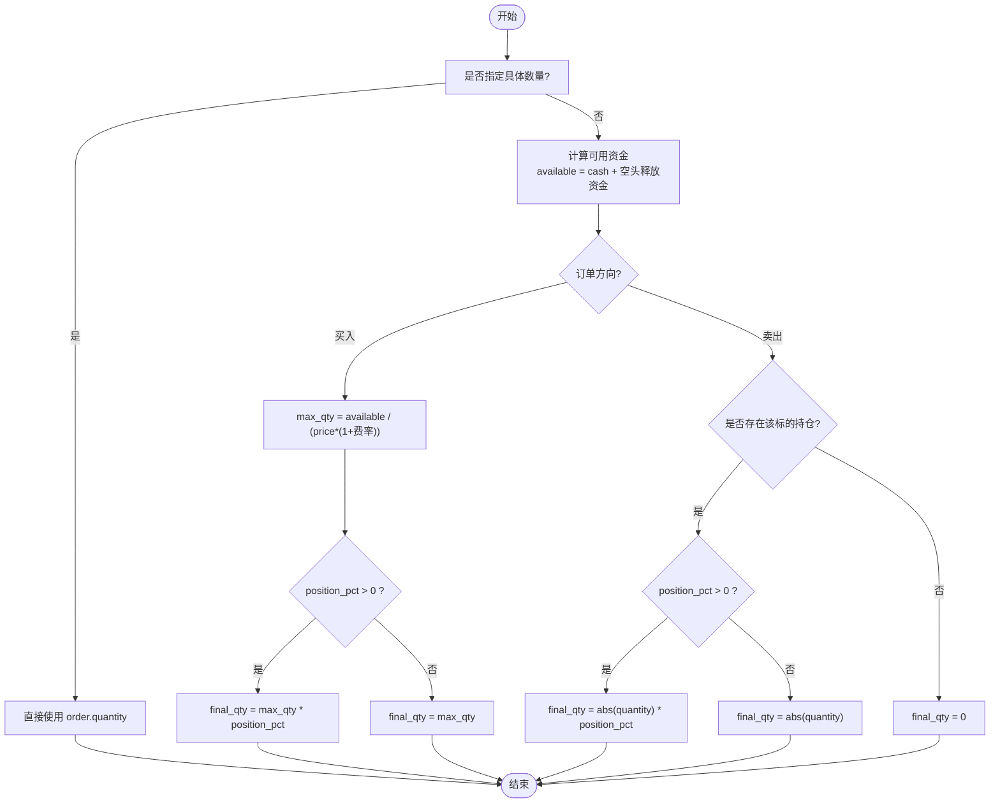
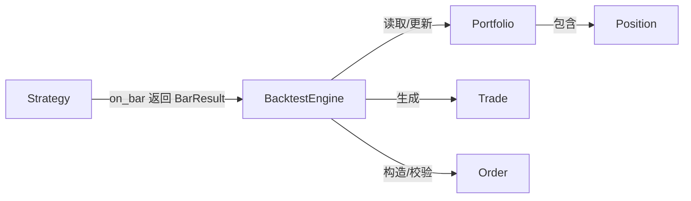
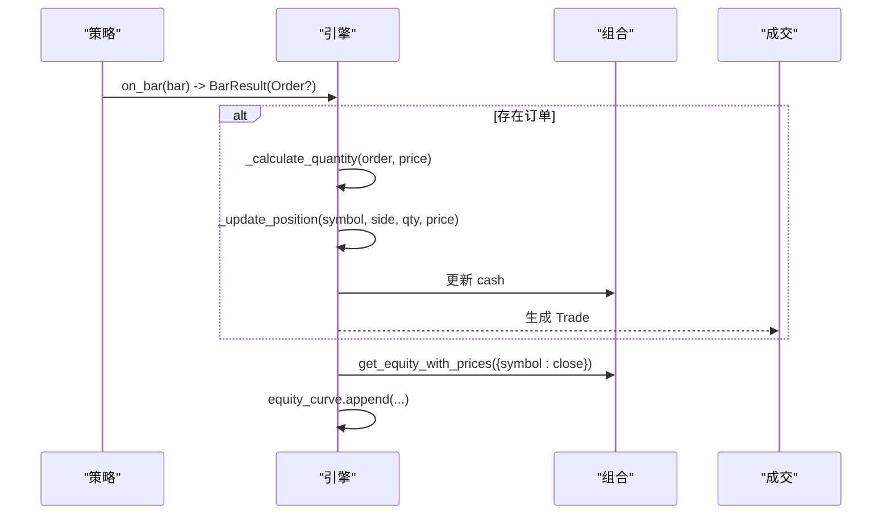

# 投资组合管理

<cite>
**本文引用的文件**   
- [portfolio.py](file://src/caisen/core/portfolio.py)
- [position.py](file://src/caisen/core/position.py)
- [order.py](file://src/caisen/core/order.py)
- [trade.py](file://src/caisen/core/trade.py)
- [engine.py](file://src/caisen/core/engine.py)
- [base.py](file://src/caisen/strategy/base.py)
- [test_portfolio_cost_value.py](file://tests/test_portfolio_cost_value.py)
- [test_order_execution.py](file://tests/test_order_execution.py)
- [test_equity.py](file://tests/test_equity.py)
- [test_equity_final.py](file://tests/test_equity_final.py)
</cite>

## 目录
1. [简介](#简介)
2. [项目结构](#项目结构)
3. [核心组件](#核心组件)
4. [架构总览](#架构总览)
5. [详细组件分析](#详细组件分析)
6. [依赖关系分析](#依赖关系分析)
7. [性能考虑](#性能考虑)
8. [故障排查指南](#故障排查指南)
9. [结论](#结论)
10. [附录：API 参考与使用示例](#附录api-参考与使用示例)

## 简介
本技术文档聚焦于 Caisen 量化回测系统的“投资组合管理”模块，围绕 Portfolio 类及其相关数据结构（Position、Order、Trade）和回测引擎 BacktestEngine 的交互展开。文档深入解释以下主题：
- 初始资金管理、现金跟踪与资产估值（成本价值 vs 市值净值）
- 持仓管理机制（多品种、多空双向、均价计算、盈亏统计）
- 净值计算方法（实时净值估算与历史净值曲线生成）
- 可用资金计算逻辑（考虑空头释放资金）
- 风险管理能力（仓位限制检查、风险指标计算与预警机制）
- 与其他组件的集成方式（策略接口、回测引擎）
- 时序图与数据结构说明
- API 参考与使用示例

## 项目结构
投资组合管理相关的核心代码位于 core 层，包含账户与持仓数据模型以及回测执行流程；策略层提供策略基类以接入引擎；测试用例覆盖关键行为与边界条件。

图表来源
- [engine.py:19-91](file://src/caisen/core/engine.py#L19-L91)
- [portfolio.py:7-46](file://src/caisen/core/portfolio.py#L7-L46)
- [position.py:6-33](file://src/caisen/core/position.py#L6-L33)
- [order.py:16-44](file://src/caisen/core/order.py#L16-L44)
- [trade.py:8-30](file://src/caisen/core/trade.py#L8-L30)
- [base.py:19-37](file://src/caisen/strategy/base.py#L19-L37)

章节来源
- [engine.py:19-91](file://src/caisen/core/engine.py#L19-L91)
- [portfolio.py:7-46](file://src/caisen/core/portfolio.py#L7-L46)
- [position.py:6-33](file://src/caisen/core/position.py#L6-L33)
- [order.py:16-44](file://src/caisen/core/order.py#L16-L44)
- [trade.py:8-30](file://src/caisen/core/trade.py#L8-L30)
- [base.py:19-37](file://src/caisen/strategy/base.py#L19-L37)

## 核心组件
- Portfolio（组合/账户）
  - 维护初始资金 initial_capital、当前现金 cash、多品种持仓 positions（按 symbol 索引）。
  - 提供成本价值 cost_value（基于持仓均价 avg_cost）、市值净值 get_equity_with_prices（基于传入价格）、可用资金 get_available_cash（含空头释放资金）。
- Position（持仓）
  - 记录 symbol、quantity（正为多头、负为空头）、avg_cost（加权均价）。
  - 提供 is_long/is_short/abs_quantity 等便捷属性。
- Order（订单）
  - 支持指定数量或按仓位比例下单，市价单默认，支持止盈止损参数。
- Trade（成交）
  - 记录成交时间、标的、方向、数量、成交价、手续费、滑点、订单号。
- BacktestEngine（回测引擎）
  - 驱动策略 on_bar 决策，执行订单、更新持仓与现金、生成净值曲线与最终净值。

章节来源
- [portfolio.py:7-46](file://src/caisen/core/portfolio.py#L7-L46)
- [position.py:6-33](file://src/caisen/core/position.py#L6-L33)
- [order.py:16-44](file://src/caisen/core/order.py#L16-L44)
- [trade.py:8-30](file://src/caisen/core/trade.py#L8-L30)
- [engine.py:19-91](file://src/caisen/core/engine.py#L19-L91)

## 架构总览
回测主循环由 BacktestEngine 驱动，策略每根 K 线返回 BarResult（可包含 Order），引擎负责订单执行、持仓与现金更新、净值记录。

图表来源
- [engine.py:33-91](file://src/caisen/core/engine.py#L33-L91)
- [engine.py:93-210](file://src/caisen/core/engine.py#L93-L210)
- [portfolio.py:25-39](file://src/caisen/core/portfolio.py#L25-L39)
- [position.py:6-33](file://src/caisen/core/position.py#L6-L33)
- [trade.py:8-30](file://src/caisen/core/trade.py#L8-L30)

## 详细组件分析

### Portfolio 类设计与实现
- 初始资金管理
  - 通过 initial_capital 初始化，cash 初始等于初始资金。
- 现金跟踪
  - 买入时扣减：成交价×数量+手续费；卖出时增加：成交价×数量-手续费。
- 资产估值
  - cost_value：现金 + Σ(quantity × avg_cost)，用于“成本视角”的账户价值。
  - get_equity_with_prices(prices)：现金 + Σ(quantity × prices[symbol] 或 fallback avg_cost))，用于“市值视角”的账户价值。
  - equity 属性向后兼容，等价于 cost_value。
- 可用资金
  - get_available_cash(prices)：现金 + 空头释放的资金（空头绝对数量 × 对应价格或均价）。
- 序列化
  - to_dict()：导出初始资金、现金与所有持仓信息。

复杂度分析
- cost_value：O(N)，N 为持仓数。
- get_equity_with_prices：O(N)。
- get_available_cash：O(N)。

错误处理与边界
- 当 prices 缺失某标的价格时，get_equity_with_prices 回退到 avg_cost，避免 KeyError。
- 空持仓时 cost_value 等于现金。

章节来源
- [portfolio.py:7-46](file://src/caisen/core/portfolio.py#L7-L46)
- [test_portfolio_cost_value.py:7-74](file://tests/test_portfolio_cost_value.py#L7-L74)

#### 类图（Portfolio 与 Position）

图表来源
- [portfolio.py:7-46](file://src/caisen/core/portfolio.py#L7-L46)
- [position.py:6-33](file://src/caisen/core/position.py#L6-L33)

### 持仓管理机制
- 多品种跟踪
  - positions 字典以 symbol 为键，支持同时持有多个标的。
- 多空双向
  - quantity > 0 表示多头，< 0 表示空头；is_long/is_short 判断方向。
- 均价计算
  - 追加多头：加权平均；平多不更新均价；开空/追加空头同理。
- 盈亏统计
  - 可通过交易记录 Trade 汇总收益；也可用 get_equity_with_prices 对比不同时刻的市值变化。

章节来源
- [engine.py:158-201](file://src/caisen/core/engine.py#L158-L201)
- [position.py:6-33](file://src/caisen/core/position.py#L6-L33)
- [trade.py:8-30](file://src/caisen/core/trade.py#L8-L30)

### 净值计算方法
- 实时净值估算
  - 每根 K 线后调用 portfolio.get_equity_with_prices({bar.symbol: bar.close}) 得到当前净值。
- 历史净值曲线
  - 每次更新将 {timestamp, equity, cash, positions} 写入 equity_curve。
- 最终净值
  - run 结束时使用最后一条 Bar 的价格计算 final_equity，并与 equity_curve 最后一点保持一致。

章节来源
- [engine.py:202-210](file://src/caisen/core/engine.py#L202-L210)
- [engine.py:78-91](file://src/caisen/core/engine.py#L78-L91)
- [test_equity_final.py:30-105](file://tests/test_equity_final.py#L30-L105)

#### 序列图（净值更新流程）

图表来源
- [engine.py:202-210](file://src/caisen/core/engine.py#L202-L210)
- [portfolio.py:25-31](file://src/caisen/core/portfolio.py#L25-L31)

### 可用资金计算逻辑
- 基础逻辑
  - 可用资金 = 现金 + 空头释放的资金（空头绝对数量 × 对应价格或均价）。
- 全仓与比例下单
  - 当 order.quantity=0 且 position_pct=0 时视为全仓；position_pct>0 按比例下单。
- 买入数量上限
  - max_quantity = available / (price × (1 + commission_rate))，再乘以 position_pct 或取满。

章节来源
- [portfolio.py:33-39](file://src/caisen/core/portfolio.py#L33-L39)
- [engine.py:130-156](file://src/caisen/core/engine.py#L130-L156)
- [test_order_execution.py:59-83](file://tests/test_order_execution.py#L59-L83)

#### 流程图（可用资金与数量计算）

图表来源
- [engine.py:130-156](file://src/caisen/core/engine.py#L130-L156)
- [portfolio.py:33-39](file://src/caisen/core/portfolio.py#L33-L39)

### 风险管理功能
- 仓位限制检查
  - 当前实现未内置全局仓位上限约束；可在策略层结合 get_available_cash 与 position_pct 控制风险暴露。
- 风险指标计算
  - 通过净值曲线 equity_curve 与交易记录 trades 可计算总收益、最大回撤、夏普比率等（由结果计算模块完成）。
- 预警机制
  - 策略算法层提供假突破预警器（FakeBreakoutWarning），在持仓期间评估风险等级并给出减仓/清仓建议，可与组合风控联动。

章节来源
- [engine.py:202-210](file://src/caisen/core/engine.py#L202-L210)
- [test_equity.py:29-56](file://tests/test_equity.py#L29-L56)
- [test_equity_final.py:81-105](file://tests/test_equity_final.py#L81-L105)

## 依赖关系分析
- 低耦合的数据模型
  - Portfolio、Position、Order、Trade 均为轻量 dataclass，职责单一，便于扩展与测试。
- 引擎与组合的强关联
  - BacktestEngine 直接操作 Portfolio 的 cash 与 positions，并在执行订单时更新持仓均价与现金。
- 策略与引擎的解耦
  - Strategy 仅定义 on_init/on_bar/on_session_end 契约，通过 BarResult 传递订单与标注，避免紧耦合。

图表来源
- [base.py:19-37](file://src/caisen/strategy/base.py#L19-L37)
- [engine.py:19-91](file://src/caisen/core/engine.py#L19-L91)
- [portfolio.py:7-46](file://src/caisen/core/portfolio.py#L7-L46)
- [position.py:6-33](file://src/caisen/core/position.py#L6-L33)
- [order.py:16-44](file://src/caisen/core/order.py#L16-L44)
- [trade.py:8-30](file://src/caisen/core/trade.py#L8-L30)

章节来源
- [engine.py:19-91](file://src/caisen/core/engine.py#L19-L91)
- [base.py:19-37](file://src/caisen/strategy/base.py#L19-L37)

## 性能考虑
- 净值与可用资金计算为 O(N)，N 为持仓数，通常较小，开销可忽略。
- 若需高频更新或大规模多标的组合，可考虑：
  - 缓存最近一次价格映射，减少重复查找。
  - 对持仓聚合指标（如总持仓市值）进行增量更新。
- 手续费与滑点已在成交阶段一次性计入，避免重复计算。

[本节为通用指导，无需源码引用]

## 故障排查指南
- 净值不一致
  - 确认 final_equity 与 equity_curve 最后一点一致；检查最后一条 Bar 的价格是否正确传入。
- 可用资金异常
  - 检查空头持仓的释放资金是否被正确计入；确认价格映射中是否包含空头标的。
- 手续费与滑点偏差
  - 核对 commission_rate 与 slippage 配置；确认成交价是否已按滑点调整。
- 全仓/比例下单不符合预期
  - 检查 order.quantity 与 position_pct 的组合；确认可用资金计算是否考虑了手续费率。

章节来源
- [test_equity_final.py:30-78](file://tests/test_equity_final.py#L30-L78)
- [test_order_execution.py:18-56](file://tests/test_order_execution.py#L18-L56)
- [test_equity.py:29-56](file://tests/test_equity.py#L29-L56)

## 结论
Portfolio 模块以简洁的数据结构与清晰的职责划分，提供了完整的账户与持仓管理能力。配合 BacktestEngine 的执行流程，实现了从订单到成交、从持仓到净值的闭环。通过成本价值与市值净值的双重视角，系统既能反映真实成本，也能衡量市场波动带来的损益。策略层通过标准化接口与引擎协作，便于扩展风控与预警机制。

[本节为总结性内容，无需源码引用]

## 附录：API 参考与使用示例

### Portfolio 主要方法与属性
- 属性
  - initial_capital: 初始资金
  - cash: 当前现金
  - positions: 多品种持仓字典（symbol -> Position）
- 方法
  - cost_value: 成本视角的账户价值
  - equity: 向后兼容，等价于 cost_value
  - get_equity_with_prices(prices): 市值视角的账户价值
  - get_available_cash(prices): 可用资金（含空头释放资金）
  - to_dict(): 序列化组合状态

使用示例（路径）
- [portfolio.py:7-46](file://src/caisen/core/portfolio.py#L7-L46)
- [test_portfolio_cost_value.py:7-74](file://tests/test_portfolio_cost_value.py#L7-L74)

### Position 主要属性与方法
- 属性
  - symbol: 标的代码
  - quantity: 数量（正为多头，负为空头）
  - avg_cost: 加权均价
  - is_long/is_short/abs_quantity: 方向与绝对数量
- 方法
  - to_dict(): 序列化持仓信息

使用示例（路径）
- [position.py:6-33](file://src/caisen/core/position.py#L6-L33)

### Order 主要字段
- symbol/side/quantity/position_pct/order_type/order_id/timestamp/stop_loss/target
- 下单模式
  - quantity > 0：指定数量
  - quantity = 0 且 position_pct > 0：按仓位比例
  - quantity = 0 且 position_pct = 0：全仓

使用示例（路径）
- [order.py:16-44](file://src/caisen/core/order.py#L16-L44)
- [test_order_execution.py:12-24](file://tests/test_order_execution.py#L12-L24)

### Trade 主要字段
- timestamp/symbol/side/quantity/price/commission/slippage/order_id

使用示例（路径）
- [trade.py:8-30](file://src/caisen/core/trade.py#L8-L30)

### 与策略的集成
- 策略基类
  - on_init(config): 初始化
  - on_bar(bar): 返回 BarResult（可包含 Order）
  - on_session_end(): 会话结束清理
- 引擎交互
  - 引擎驱动策略 on_bar，执行订单，更新组合与净值，生成结果。

使用示例（路径）
- [base.py:19-37](file://src/caisen/strategy/base.py#L19-L37)
- [engine.py:33-91](file://src/caisen/core/engine.py#L33-L91)

### 数据结构说明
- Portfolio.to_dict()
  - 包含 initial_capital、cash、positions（每个 Position.to_dict()）
- Position.to_dict()
  - 包含 symbol、quantity、avg_cost
- Order.to_dict()
  - 包含 order_id、symbol、side、quantity、order_type、timestamp
- Trade.to_dict()
  - 包含 timestamp、symbol、side、quantity、price、commission、slippage、order_id

使用示例（路径）
- [portfolio.py:41-46](file://src/caisen/core/portfolio.py#L41-L46)
- [position.py:28-33](file://src/caisen/core/position.py#L28-L33)
- [order.py:36-44](file://src/caisen/core/order.py#L36-L44)
- [trade.py:20-30](file://src/caisen/core/trade.py#L20-L30)

### 状态变化时序图（端到端）

图表来源
- [engine.py:93-210](file://src/caisen/core/engine.py#L93-L210)
- [portfolio.py:25-39](file://src/caisen/core/portfolio.py#L25-L39)
- [trade.py:8-30](file://src/caisen/core/trade.py#L8-L30)