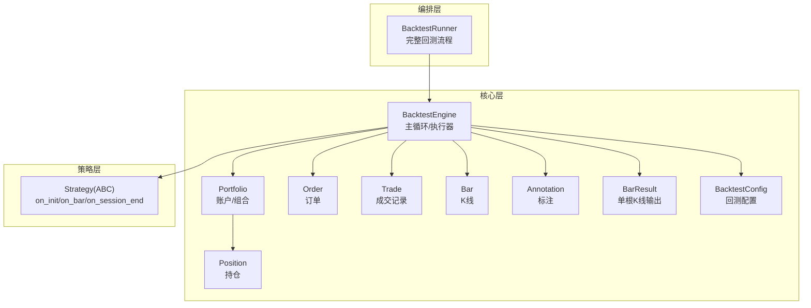
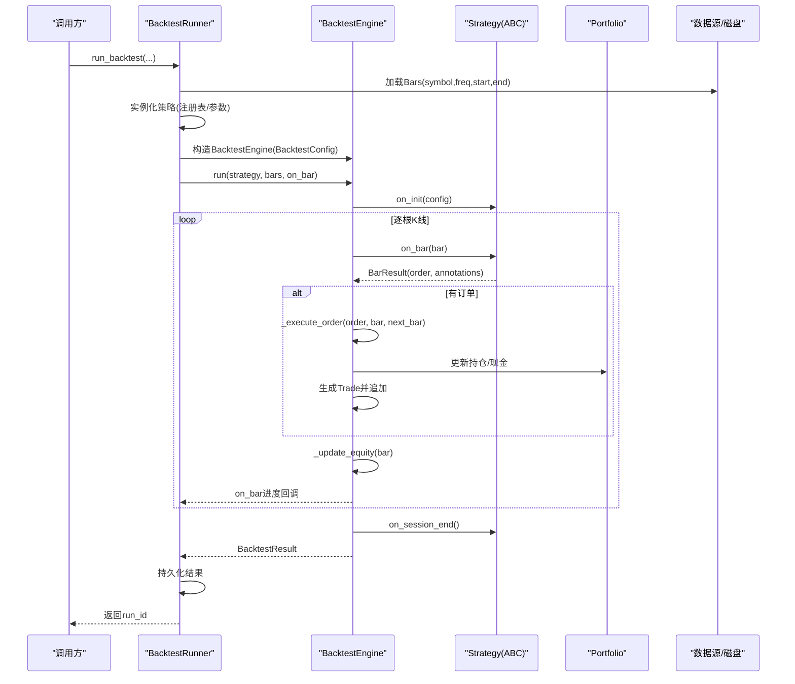
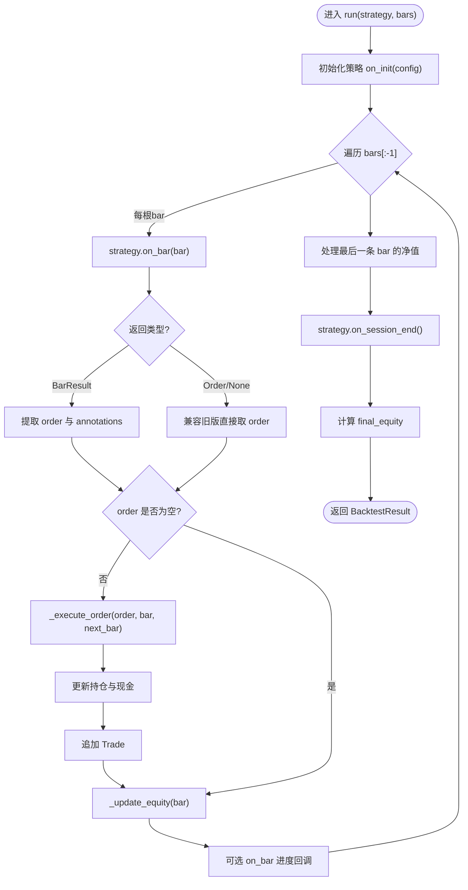
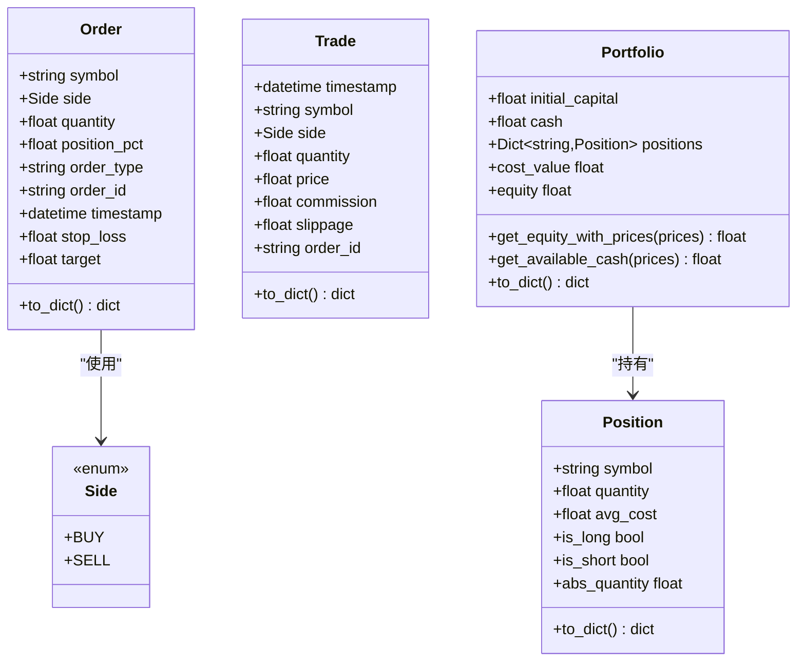
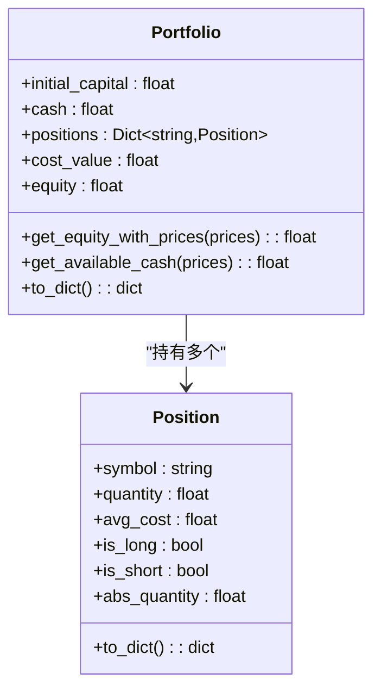
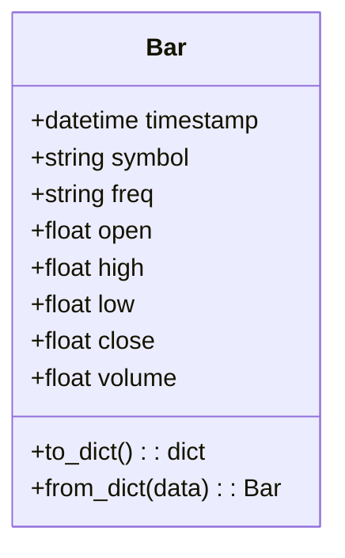
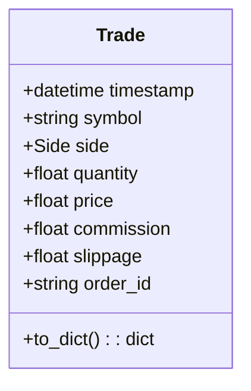
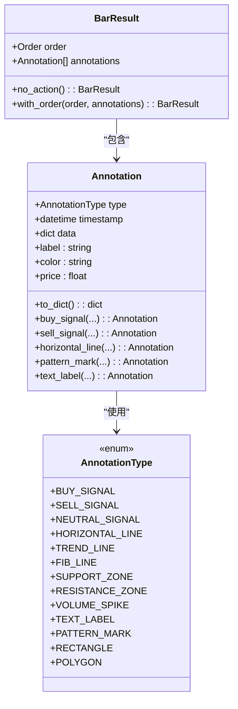
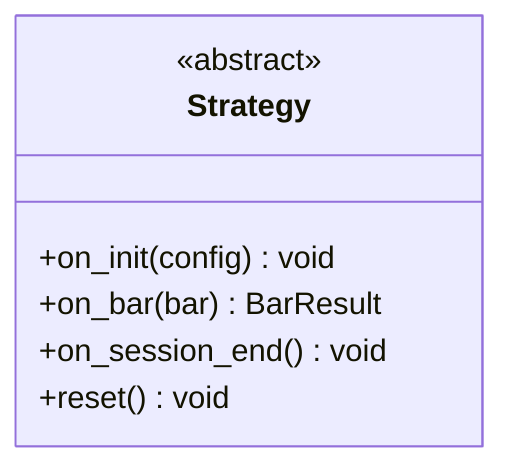
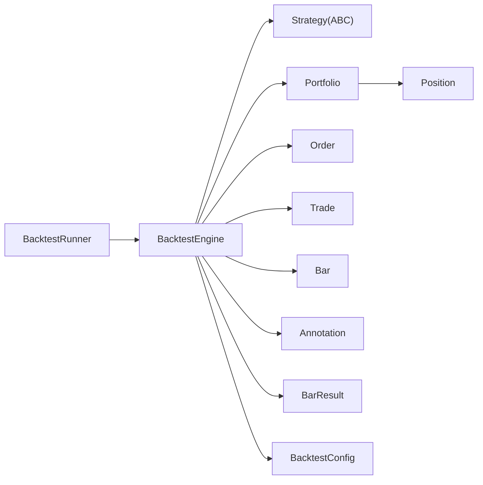

# 核心引擎

<cite>
**本文引用的文件**
- [engine.py](file://src/caisen/core/engine.py)
- [order.py](file://src/caisen/core/order.py)
- [portfolio.py](file://src/caisen/core/portfolio.py)
- [position.py](file://src/caisen/core/position.py)
- [bar.py](file://src/caisen/core/bar.py)
- [trade.py](file://src/caisen/core/trade.py)
- [config.py](file://src/caisen/core/config.py)
- [bar_result.py](file://src/caisen/core/bar_result.py)
- [annotation.py](file://src/caisen/core/annotation.py)
- [base.py](file://src/caisen/strategy/base.py)
- [runner.py](file://src/caisen/backtest/runner.py)
- [test_backtest_engine.py](file://tests/test_backtest_engine.py)
</cite>

## 目录
1. [简介](#简介)
2. [项目结构](#项目结构)
3. [核心组件](#核心组件)
4. [架构总览](#架构总览)
5. [详细组件分析](#详细组件分析)
6. [依赖关系分析](#依赖关系分析)
7. [性能考量](#性能考量)
8. [故障排查指南](#故障排查指南)
9. [结论](#结论)
10. [附录：API 参考与使用示例](#附录api-参考与使用示例)

## 简介
本文件面向 Caisen 量化回测系统的“核心引擎”模块，系统性阐述 BacktestEngine 的设计与执行流程、事件驱动模型与状态管理；深入解析订单执行系统（Order 生命周期、成交确认机制）、投资组合管理（Portfolio 资产跟踪、仓位计算与风险管理）、K 线数据处理（Bar 数据结构与时间序列处理）以及交易记录系统（Trade 生成、存储与分析）。文档同时提供核心组件交互图与时序图，并给出 API 参考与使用示例，帮助开发者快速理解引擎内部工作机制。

## 项目结构
核心引擎位于 src/caisen/core 下，围绕 Bar、Order、Position、Portfolio、Trade、Annotation、BarResult 等数据对象，由 BacktestEngine 统一编排策略决策与订单执行，并由 BacktestRunner 封装端到端回测流程（加载数据、实例化策略、运行引擎、持久化结果）。

图表来源
- [engine.py:19-91](file://src/caisen/core/engine.py#L19-L91)
- [portfolio.py:7-46](file://src/caisen/core/portfolio.py#L7-L46)
- [position.py:6-33](file://src/caisen/core/position.py#L6-L33)
- [order.py:9-43](file://src/caisen/core/order.py#L9-L43)
- [trade.py:8-30](file://src/caisen/core/trade.py#L8-L30)
- [bar.py:8-38](file://src/caisen/core/bar.py#L8-L38)
- [annotation.py:13-139](file://src/caisen/core/annotation.py#L13-L139)
- [bar_result.py:21-41](file://src/caisen/core/bar_result.py#L21-L41)
- [config.py:9-15](file://src/caisen/core/config.py#L9-L15)
- [base.py:19-37](file://src/caisen/strategy/base.py#L19-L37)
- [runner.py:26-94](file://src/caisen/backtest/runner.py#L26-L94)

章节来源
- [engine.py:19-91](file://src/caisen/core/engine.py#L19-L91)
- [runner.py:26-94](file://src/caisen/backtest/runner.py#L26-L94)

## 核心组件
- BacktestEngine：回测主循环，负责策略调用、订单执行、净值更新与结果聚合。
- Order/Side：订单方向与参数（数量或仓位比例），支持止盈止损字段预留。
- Position：多头/空头持仓，维护数量与均价，提供方向判断与绝对数量。
- Portfolio：账户现金、成本价值与按市价权益计算，支持可用资金估算（含空头释放）。
- Bar：标准 OHLCV K 线数据，支持序列化/反序列化。
- Trade：成交记录，包含成交价、手续费、滑点、订单号等。
- Annotation/BarResult：策略可视化标注与单根 K 线输出封装。
- BacktestConfig：回测参数（初始资金、手续费率、滑点）。
- Strategy(ABC)：策略基类，定义 on_init/on_bar/on_session_end 回调。
- BacktestRunner：端到端编排（加载数据→实例化策略→运行引擎→持久化）。

章节来源
- [engine.py:19-91](file://src/caisen/core/engine.py#L19-L91)
- [order.py:9-43](file://src/caisen/core/order.py#L9-L43)
- [position.py:6-33](file://src/caisen/core/position.py#L6-L33)
- [portfolio.py:7-46](file://src/caisen/core/portfolio.py#L7-L46)
- [bar.py:8-38](file://src/caisen/core/bar.py#L8-L38)
- [trade.py:8-30](file://src/caisen/core/trade.py#L8-L30)
- [annotation.py:13-139](file://src/caisen/core/annotation.py#L13-L139)
- [bar_result.py:21-41](file://src/caisen/core/bar_result.py#L21-L41)
- [config.py:9-15](file://src/caisen/core/config.py#L9-L15)
- [base.py:19-37](file://src/caisen/strategy/base.py#L19-L37)
- [runner.py:26-94](file://src/caisen/backtest/runner.py#L26-L94)

## 架构总览
下图展示从 Runner 到 Engine 的端到端流程，以及 Engine 内部的策略调用、订单执行与净值更新闭环。

图表来源
- [runner.py:26-94](file://src/caisen/backtest/runner.py#L26-L94)
- [engine.py:33-91](file://src/caisen/core/engine.py#L33-L91)
- [base.py:19-37](file://src/caisen/strategy/base.py#L19-L37)
- [portfolio.py:7-46](file://src/caisen/core/portfolio.py#L7-L46)

## 详细组件分析

### BacktestEngine：主循环与事件驱动
- 初始化：持有 BacktestConfig、Portfolio、Trades、EquityCurve、Annotations 与策略引用。
- 主循环：遍历 bars[:-1]，每根 bar 调用 strategy.on_bar(bar)，兼容旧版返回 Order/None 与新式 BarResult。
- 订单执行：若存在 order，则调用 _execute_order(order, bar, next_bar) 完成成交价计算、数量计算、手续费、持仓与现金更新，并生成 Trade。
- 净值更新：每根 bar 后调用 _update_equity(bar) 记录 equity/cash/positions。
- 结束阶段：调用 strategy.on_session_end()，并以最后一根 bar 的价格计算 final_equity，返回 BacktestResult。

图表来源
- [engine.py:33-91](file://src/caisen/core/engine.py#L33-L91)
- [engine.py:93-128](file://src/caisen/core/engine.py#L93-L128)
- [engine.py:130-156](file://src/caisen/core/engine.py#L130-L156)
- [engine.py:158-200](file://src/caisen/core/engine.py#L158-L200)
- [engine.py:201-209](file://src/caisen/core/engine.py#L201-L209)

章节来源
- [engine.py:33-91](file://src/caisen/core/engine.py#L33-L91)
- [engine.py:93-128](file://src/caisen/core/engine.py#L93-L128)
- [engine.py:130-156](file://src/caisen/core/engine.py#L130-L156)
- [engine.py:158-200](file://src/caisen/core/engine.py#L158-L200)
- [engine.py:201-209](file://src/caisen/core/engine.py#L201-L209)

### 订单执行系统：Order 生命周期与成交确认
- 订单创建：策略在 on_bar 中返回 BarResult.order（或兼容旧版直接返回 Order）。
- 成交价计算：以 next_bar.open 为基准，买入乘以 (1+slippage)，卖出乘以 (1-slippage)。
- 数量计算：
  - 指定 quantity > 0：直接使用。
  - quantity = 0 且 position_pct > 0：按可买资金与仓位比例计算。
  - quantity = 0 且 position_pct = 0：全仓（买入按可用资金上限，卖出按现有持仓）。
- 手续费：price * quantity * commission_rate。
- 成交确认：生成 Trade 并追加至 trades 列表，同时更新 Portfolio 的 positions 与 cash。

图表来源
- [order.py:9-43](file://src/caisen/core/order.py#L9-L43)
- [trade.py:8-30](file://src/caisen/core/trade.py#L8-L30)
- [portfolio.py:7-46](file://src/caisen/core/portfolio.py#L7-L46)
- [position.py:6-33](file://src/caisen/core/position.py#L6-L33)

章节来源
- [engine.py:93-128](file://src/caisen/core/engine.py#L93-L128)
- [engine.py:130-156](file://src/caisen/core/engine.py#L130-L156)
- [engine.py:158-200](file://src/caisen/core/engine.py#L158-L200)
- [order.py:9-43](file://src/caisen/core/order.py#L9-L43)
- [trade.py:8-30](file://src/caisen/core/trade.py#L8-L30)
- [portfolio.py:7-46](file://src/caisen/core/portfolio.py#L7-L46)
- [position.py:6-33](file://src/caisen/core/position.py#L6-L33)

### 投资组合管理：Portfolio 资产跟踪与风险管理
- 成本价值：cash + sum(quantity * avg_cost)。
- 市值权益：cash + sum(quantity * prices[symbol])，用于按实时价格评估。
- 可用资金：cash + 空头释放的资金（空头仓位按当前价格折算）。
- 风险相关：通过 get_available_cash 与仓位比例下单实现基础风控约束。

图表来源
- [portfolio.py:7-46](file://src/caisen/core/portfolio.py#L7-L46)
- [position.py:6-33](file://src/caisen/core/position.py#L6-L33)

章节来源
- [portfolio.py:7-46](file://src/caisen/core/portfolio.py#L7-L46)
- [position.py:6-33](file://src/caisen/core/position.py#L6-L33)

### K 线数据处理：Bar 数据结构与时间序列
- Bar 字段：timestamp、symbol、freq、open/high/low/close/volume。
- 序列化：to_dict/from_dict 支持 JSON 持久化与恢复。
- 时间序列：Engine 主循环按 bars 顺序推进，next_bar 作为成交基准，确保“信号在本 bar 产生，成交在下根 bar 开盘”。

图表来源
- [bar.py:8-38](file://src/caisen/core/bar.py#L8-L38)

章节来源
- [bar.py:8-38](file://src/caisen/core/bar.py#L8-L38)
- [engine.py:33-91](file://src/caisen/core/engine.py#L33-L91)

### 交易记录系统：Trade 生成、存储与分析
- 生成时机：_execute_order 成功执行后创建 Trade，包含成交价、手续费、滑点、订单号等。
- 存储位置：Engine.trades 列表，最终随 BacktestResult 返回。
- 分析用途：可用于统计胜率、盈亏比、回撤、收益分布等（由上层 result 模块进一步计算）。

图表来源
- [trade.py:8-30](file://src/caisen/core/trade.py#L8-L30)

章节来源
- [engine.py:93-128](file://src/caisen/core/engine.py#L93-L128)
- [trade.py:8-30](file://src/caisen/core/trade.py#L8-L30)

### 可视化标注与单根K线输出：Annotation 与 BarResult
- BarResult：封装单根 K 线的 order 与 annotations，避免策略自行维护全局标注列表。
- Annotation：统一的可视化标注契约，支持多种类型（买卖信号、水平线、形态标记、文本标签等），并提供便捷工厂方法。

图表来源
- [bar_result.py:21-41](file://src/caisen/core/bar_result.py#L21-L41)
- [annotation.py:13-139](file://src/caisen/core/annotation.py#L13-L139)

章节来源
- [bar_result.py:21-41](file://src/caisen/core/bar_result.py#L21-L41)
- [annotation.py:13-139](file://src/caisen/core/annotation.py#L13-L139)

### 策略接口：Strategy(ABC)
- on_init(config)：回测开始前初始化。
- on_bar(bar) -> BarResult：每根 K 线决策，返回订单与标注。
- on_session_end()：回测结束后清理。
- reset()：重置策略状态。

图表来源
- [base.py:19-37](file://src/caisen/strategy/base.py#L19-L37)

章节来源
- [base.py:19-37](file://src/caisen/strategy/base.py#L19-L37)

## 依赖关系分析
- 低耦合高内聚：Engine 仅依赖抽象的 Strategy 接口与核心数据对象；Portfolio/Position 独立维护账户与持仓逻辑。
- 外部依赖：BacktestRunner 依赖策略注册表与数据加载模块；Engine 内部延迟导入 BacktestResult 以避免循环依赖。
- 可能的循环依赖规避：Engine 对 BacktestResult 的导入放在函数体内。

图表来源
- [runner.py:26-94](file://src/caisen/backtest/runner.py#L26-L94)
- [engine.py:19-91](file://src/caisen/core/engine.py#L19-L91)
- [portfolio.py:7-46](file://src/caisen/core/portfolio.py#L7-L46)
- [position.py:6-33](file://src/caisen/core/position.py#L6-L33)

章节来源
- [runner.py:26-94](file://src/caisen/backtest/runner.py#L26-L94)
- [engine.py:19-91](file://src/caisen/core/engine.py#L19-L91)

## 性能考量
- 主循环复杂度：O(N) 遍历 bars，每根 bar 的策略决策与订单执行为常数时间操作（假设字典访问 O(1)）。
- 内存占用：trades/equity_curve/annotations 线性增长，建议在大样本回测时关注内存峰值。
- 滑点与手续费：均为简单算术运算，开销极低。
- I/O 与持久化：由 Runner 层负责，Engine 不直接涉及磁盘读写，利于解耦与测试。

[本节为通用性能讨论，无需特定文件来源]

## 故障排查指南
- 数据为空：当 Bars 为空时，Runner 抛出明确错误，需检查数据路径与日期范围。
- 策略不存在/未注册：Runner 会提示策略名与模块映射问题，确认注册表与模块路径。
- 订单数量为 0：可能因可用资金不足或仓位比例导致，检查 Portfolio.get_available_cash 与 position_pct 设置。
- 净值异常：核对 _update_equity 使用的价格与 positions 快照是否一致。
- 兼容性：若策略仍返回 Order/None，Engine 已兼容处理，但建议迁移至 BarResult。

章节来源
- [runner.py:74-79](file://src/caisen/backtest/runner.py#L74-L79)
- [runner.py:124-153](file://src/caisen/backtest/runner.py#L124-L153)
- [engine.py:33-91](file://src/caisen/core/engine.py#L33-L91)
- [engine.py:130-156](file://src/caisen/core/engine.py#L130-L156)

## 结论
Caisen 核心引擎以简洁清晰的事件驱动模型组织回测流程：策略在每根 K 线产出 BarResult，引擎据此执行订单、更新组合与净值，并最终汇总为 BacktestResult。该设计将策略、执行、组合与数据解耦，便于扩展与测试。通过合理的仓位管理与风险控制接口，开发者可在保持高性能的同时实现稳健的回测体验。

[本节为总结性内容，无需特定文件来源]

## 附录：API 参考与使用示例

### 关键 API 速览
- BacktestEngine.run(strategy, bars, on_bar=None)
  - 作用：运行回测主循环，返回 BacktestResult。
  - 输入：策略实例、K 线列表、可选进度回调。
  - 输出：包含 bars、trades、equity_curve、annotations、final_equity 的结果对象。
- BacktestConfig(initial_capital=100000, commission_rate=0.0003, slippage=0.001)
  - 作用：回测参数配置。
- Strategy(ABC)
  - on_init(config)：初始化。
  - on_bar(bar) -> BarResult：每根 K 线决策。
  - on_session_end()：收尾。
- Order(symbol, side, quantity=0, position_pct=0, order_type="MARKET", ...)
  - 作用：下单指令，支持数量或仓位比例。
- Portfolio
  - cost_value/equity：成本/市值权益。
  - get_equity_with_prices(prices)：按指定价格计算权益。
  - get_available_cash(prices)：可用资金（含空头释放）。
- Bar(timestamp, symbol, freq, open, high, low, close, volume)
  - 作用：标准 K 线数据。
- Trade(timestamp, symbol, side, quantity, price, commission, slippage, order_id)
  - 作用：成交记录。
- BarResult(order=None, annotations=[])
  - 作用：单根 K 线输出封装。
- Annotation(type, timestamp, data)
  - 作用：可视化标注，提供多种工厂方法。

章节来源
- [engine.py:33-91](file://src/caisen/core/engine.py#L33-L91)
- [config.py:9-15](file://src/caisen/core/config.py#L9-L15)
- [base.py:19-37](file://src/caisen/strategy/base.py#L19-L37)
- [order.py:9-43](file://src/caisen/core/order.py#L9-L43)
- [portfolio.py:7-46](file://src/caisen/core/portfolio.py#L7-L46)
- [bar.py:8-38](file://src/caisen/core/bar.py#L8-L38)
- [trade.py:8-30](file://src/caisen/core/trade.py#L8-L30)
- [bar_result.py:21-41](file://src/caisen/core/bar_result.py#L21-L41)
- [annotation.py:13-139](file://src/caisen/core/annotation.py#L13-L139)

### 使用示例（基于测试用例）
- 每日买入 1 股的策略示例：见测试中的 DummyStrategy，演示如何在 on_bar 中返回 BarResult 并附带 Order。
- 首日买入并持有的策略示例：见 AlwaysHoldStrategy，演示一次性建仓后的净值变化。
- 集成测试验证：
  - 引擎初始化与初始资金设置。
  - 所有 K 线被处理、交易记录生成、净值曲线长度与结构校验。
  - 滑点生效与盈利场景下的净值增长。

章节来源
- [test_backtest_engine.py:12-57](file://tests/test_backtest_engine.py#L12-L57)
- [test_backtest_engine.py:83-102](file://tests/test_backtest_engine.py#L83-L102)
- [test_backtest_engine.py:107-154](file://tests/test_backtest_engine.py#L107-L154)
- [test_backtest_engine.py:155-186](file://tests/test_backtest_engine.py#L155-L186)
- [test_backtest_engine.py:188-218](file://tests/test_backtest_engine.py#L188-L218)
- [test_backtest_engine.py:221-245](file://tests/test_backtest_engine.py#L221-L245)