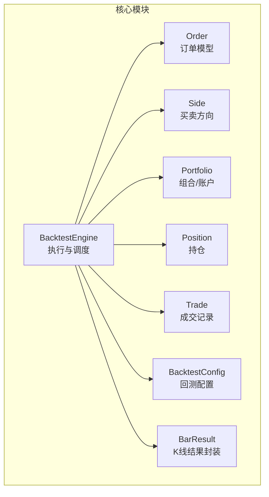
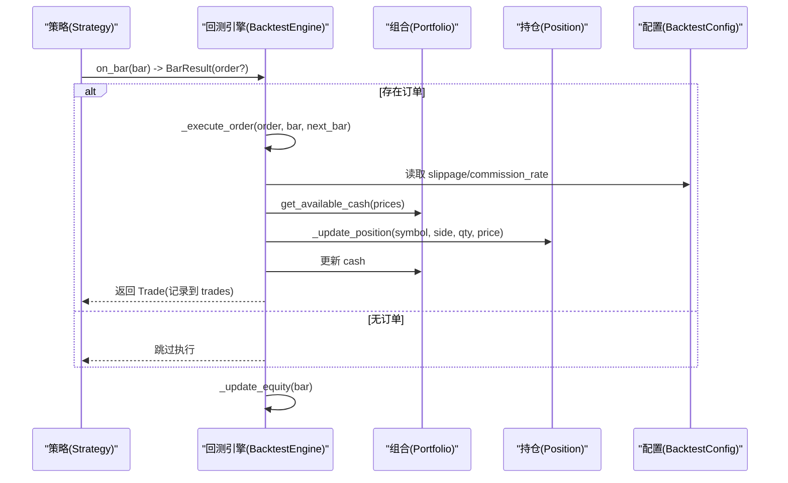
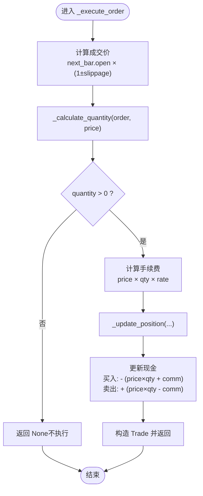
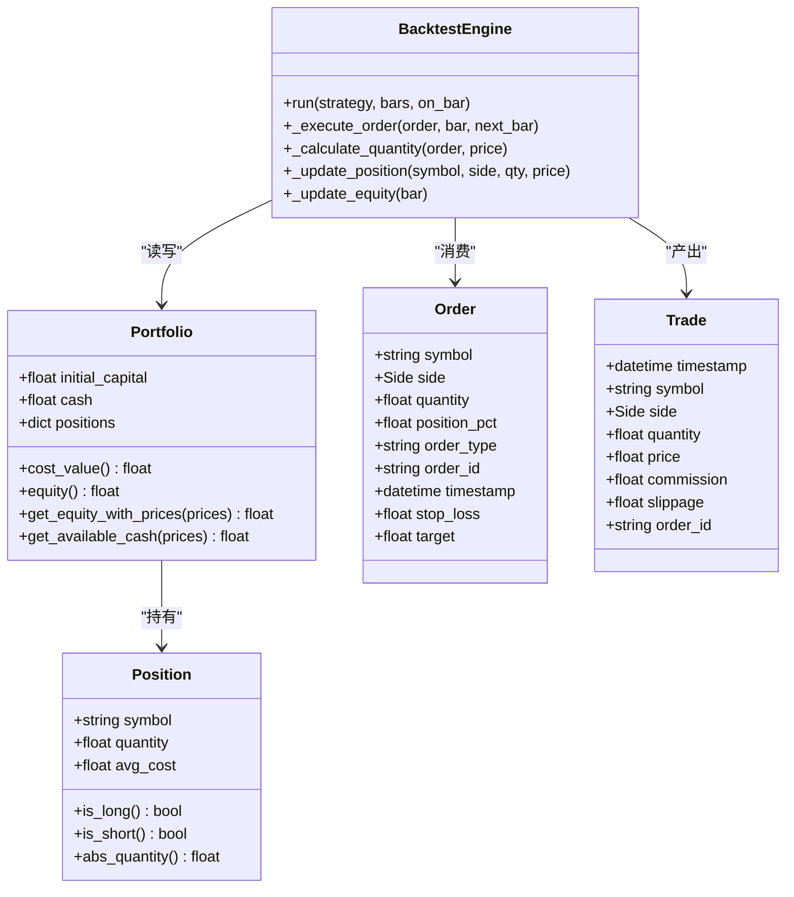
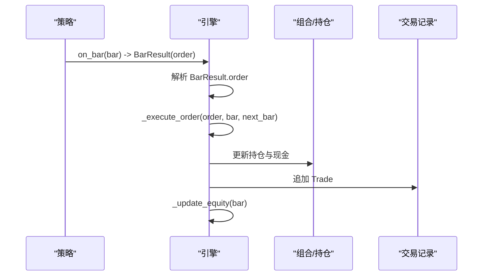
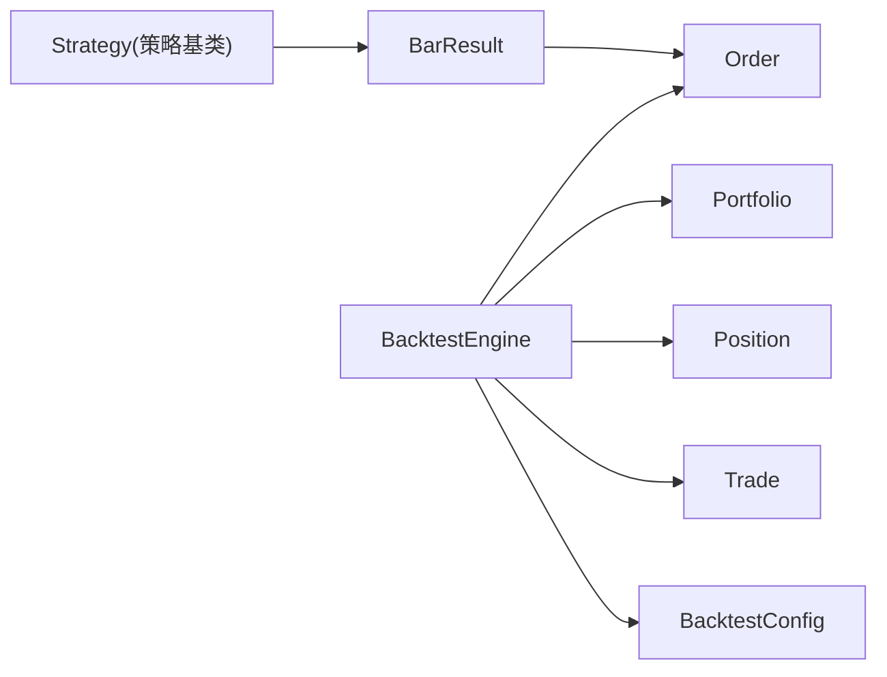

# 订单执行系统

<cite>
**本文引用的文件**   
- [engine.py](file://src/caisen/core/engine.py)
- [order.py](file://src/caisen/core/order.py)
- [portfolio.py](file://src/caisen/core/portfolio.py)
- [position.py](file://src/caisen/core/position.py)
- [trade.py](file://src/caisen/core/trade.py)
- [config.py](file://src/caisen/core/config.py)
- [bar_result.py](file://src/caisen/core/bar_result.py)
- [base.py](file://src/caisen/strategy/base.py)
- [test_order_execution.py](file://tests/test_order_execution.py)
- [test_backtest_engine.py](file://tests/test_backtest_engine.py)
- [test_equity.py](file://tests/test_equity.py)
</cite>

## 目录
1. [简介](#简介)
2. [项目结构](#项目结构)
3. [核心组件](#核心组件)
4. [架构总览](#架构总览)
5. [详细组件分析](#详细组件分析)
6. [依赖关系分析](#依赖关系分析)
7. [性能考虑](#性能考虑)
8. [故障排查指南](#故障排查指南)
9. [结论](#结论)
10. [附录：API 参考](#附录api-参考)

## 简介
本技术文档聚焦于 Caisen 量化回测系统的“订单执行系统”，围绕 Order 对象的数据模型、订单执行算法（成交价计算、滑点处理、手续费扣除与数量验证）、订单匹配机制（市价单策略）、仓位影响分析与投资组合状态更新，以及订单生命周期管理进行系统化说明。同时提供面向使用者的 API 参考与常见问题排查建议，帮助读者快速理解并正确使用该模块。

## 项目结构
订单执行系统位于 core 层，核心由以下类组成：
- BacktestEngine：回测引擎，负责驱动策略、执行订单、更新持仓与净值
- Order/Side：订单数据模型与方向枚举
- Portfolio/Position：组合与持仓数据模型
- Trade：成交记录
- BarResult：策略每根 K 线的输出封装（包含可选订单）
- BacktestConfig：回测配置（初始资金、手续费率、滑点）

图表来源
- [engine.py:19-92](file://src/caisen/core/engine.py#L19-L92)
- [order.py:10-44](file://src/caisen/core/order.py#L10-L44)
- [portfolio.py:7-46](file://src/caisen/core/portfolio.py#L7-L46)
- [position.py:6-33](file://src/caisen/core/position.py#L6-L33)
- [trade.py:8-30](file://src/caisen/core/trade.py#L8-L30)
- [config.py:9-15](file://src/caisen/core/config.py#L9-L15)
- [bar_result.py:21-41](file://src/caisen/core/bar_result.py#L21-L41)

章节来源
- [engine.py:19-92](file://src/caisen/core/engine.py#L19-L92)
- [order.py:10-44](file://src/caisen/core/order.py#L10-L44)
- [portfolio.py:7-46](file://src/caisen/core/portfolio.py#L7-L46)
- [position.py:6-33](file://src/caisen/core/position.py#L6-L33)
- [trade.py:8-30](file://src/caisen/core/trade.py#L8-L30)
- [config.py:9-15](file://src/caisen/core/config.py#L9-L15)
- [bar_result.py:21-41](file://src/caisen/core/bar_result.py#L21-L41)

## 核心组件
- Order 与 Side
  - Side 表示买卖方向（买入/卖出）
  - Order 支持两种下单方式：指定具体数量或按仓位比例/全仓；支持止盈止损字段（当前执行逻辑未使用）
- Portfolio 与 Position
  - Portfolio 维护现金、初始资金与多标的持仓字典；提供成本价值、权益估算与可用资金计算
  - Position 维护标的的净头寸（正为多头、负为空头）与均价
- Trade
  - 记录每次成交的时间戳、标的、方向、数量、成交价、手续费、滑点与关联订单 ID
- BacktestEngine
  - 驱动策略 on_bar 决策，解析 BarResult，调用 _execute_order 执行订单，更新持仓与现金，生成净值曲线
- BacktestConfig
  - 控制手续费率与滑点等执行参数

章节来源
- [order.py:10-44](file://src/caisen/core/order.py#L10-L44)
- [portfolio.py:7-46](file://src/caisen/core/portfolio.py#L7-L46)
- [position.py:6-33](file://src/caisen/core/position.py#L6-L33)
- [trade.py:8-30](file://src/caisen/core/trade.py#L8-L30)
- [engine.py:19-92](file://src/caisen/core/engine.py#L19-L92)
- [config.py:9-15](file://src/caisen/core/config.py#L9-L15)

## 架构总览
订单执行在回测主循环中发生：策略返回 BarResult，引擎解包订单后执行，随后更新持仓与现金，并记录净值。

图表来源
- [engine.py:33-92](file://src/caisen/core/engine.py#L33-L92)
- [engine.py:93-128](file://src/caisen/core/engine.py#L93-L128)
- [engine.py:130-156](file://src/caisen/core/engine.py#L130-L156)
- [engine.py:158-201](file://src/caisen/core/engine.py#L158-L201)
- [engine.py:202-210](file://src/caisen/core/engine.py#L202-L210)
- [config.py:9-15](file://src/caisen/core/config.py#L9-L15)

## 详细组件分析

### Order 数据模型与数量/价格设定
- 订单类型
  - 当前实现仅支持“市价单”语义（order_type 默认值为“MARKET”），成交价基于下一根 K 线开盘价计算
- 买卖方向
  - Side.BUY / Side.SELL
- 数量计算规则
  - quantity > 0：按指定数量下单
  - quantity = 0 且 position_pct > 0：按仓位比例下单
  - quantity = 0 且 position_pct = 0：全仓（买入时按可用资金最大化，卖出时按现有持仓绝对值）
- 价格设定
  - 成交价 = next_bar.open × (1 ± slippage)，买入加滑点，卖出席减滑点
- 止盈止损
  - 字段 stop_loss/target 已预留，但当前执行逻辑未参与定价与触发

章节来源
- [order.py:16-44](file://src/caisen/core/order.py#L16-L44)
- [engine.py:93-101](file://src/caisen/core/engine.py#L93-L101)
- [engine.py:130-156](file://src/caisen/core/engine.py#L130-L156)

### 订单执行算法：_execute_order
- 成交价计算
  - 以 next_bar.open 为基础，根据方向应用滑点
- 数量验证
  - 通过 _calculate_quantity 计算实际数量；若数量 ≤ 0，则直接放弃执行
- 手续费扣除
  - commission = execution_price × quantity × commission_rate
- 持仓与现金更新
  - 先更新持仓（开仓/平仓/加仓），再更新现金（买入扣款含手续费，卖出收款扣手续费）
- 成交记录
  - 构造 Trade，记录成交价、手续费、滑点与订单 ID

图表来源
- [engine.py:93-128](file://src/caisen/core/engine.py#L93-L128)
- [engine.py:130-156](file://src/caisen/core/engine.py#L130-L156)
- [engine.py:158-201](file://src/caisen/core/engine.py#L158-L201)

章节来源
- [engine.py:93-128](file://src/caisen/core/engine.py#L93-L128)
- [engine.py:130-156](file://src/caisen/core/engine.py#L130-L156)
- [engine.py:158-201](file://src/caisen/core/engine.py#L158-L201)

### 订单匹配机制（限价单与市价单）
- 市价单
  - 当前实现采用“下一根 K 线开盘价 + 滑点”作为成交价，体现市价单的执行语义
- 限价单
  - 当前代码未实现限价条件判断与等待成交逻辑；如需扩展，可在 _execute_order 前增加限价检查分支

章节来源
- [engine.py:93-101](file://src/caisen/core/engine.py#L93-L101)

### 仓位影响分析（对投资组合状态的改变）
- 买入路径
  - 无持仓：创建多头持仓，avg_cost 设为成交价
  - 已有空头：平空仓（quantity += qty），若接近零则移除持仓；否则重置 avg_cost
  - 已有多头：追加多头，加权平均成本更新
- 卖出路径
  - 无持仓：创建空头持仓，quantity 为负
  - 已有多头：平多仓（quantity -= qty），接近零则移除持仓
  - 已有空头：追加空头，按绝对值加权平均成本更新
- 现金变动
  - 买入：现金减少（成交价×数量 + 手续费）
  - 卖出：现金增加（成交价×数量 - 手续费）
- 净值计算
  - 使用 portfolio.get_equity_with_prices 结合最新收盘价更新 equity_curve

图表来源
- [portfolio.py:7-46](file://src/caisen/core/portfolio.py#L7-L46)
- [position.py:6-33](file://src/caisen/core/position.py#L6-L33)
- [order.py:16-44](file://src/caisen/core/order.py#L16-L44)
- [trade.py:8-30](file://src/caisen/core/trade.py#L8-L30)
- [engine.py:19-92](file://src/caisen/core/engine.py#L19-L92)

章节来源
- [engine.py:158-201](file://src/caisen/core/engine.py#L158-L201)
- [portfolio.py:14-39](file://src/caisen/core/portfolio.py#L14-L39)
- [position.py:13-26](file://src/caisen/core/position.py#L13-L26)

### 订单生命周期管理（从创建到确认）
- 创建
  - 策略在 on_bar 中返回 BarResult，其中可携带 Order
- 验证
  - 引擎解包 BarResult，若存在订单则进入执行流程
- 执行
  - 计算成交价与数量，校验数量有效性，计算手续费，更新持仓与现金
- 确认
  - 生成 Trade 记录，加入 trades 列表；同时更新净值曲线

图表来源
- [engine.py:33-92](file://src/caisen/core/engine.py#L33-L92)
- [engine.py:93-128](file://src/caisen/core/engine.py#L93-L128)
- [engine.py:202-210](file://src/caisen/core/engine.py#L202-L210)

章节来源
- [engine.py:33-92](file://src/caisen/core/engine.py#L33-L92)
- [engine.py:93-128](file://src/caisen/core/engine.py#L93-L128)
- [engine.py:202-210](file://src/caisen/core/engine.py#L202-L210)

## 依赖关系分析
- 内部依赖
  - BacktestEngine 依赖 Order、Side、Portfolio、Position、Trade、BacktestConfig、BarResult
- 外部依赖
  - 策略基类 Strategy 定义 on_bar 契约，返回 BarResult
- 耦合与内聚
  - 执行逻辑集中在 engine.py，数据模型独立清晰，职责边界明确
- 潜在风险
  - 未实现限价单与风控前置校验（如资金不足拦截），需在上层策略或引擎扩展

图表来源
- [base.py:19-37](file://src/caisen/strategy/base.py#L19-L37)
- [bar_result.py:21-41](file://src/caisen/core/bar_result.py#L21-L41)
- [engine.py:19-92](file://src/caisen/core/engine.py#L19-L92)

章节来源
- [base.py:19-37](file://src/caisen/strategy/base.py#L19-L37)
- [engine.py:19-92](file://src/caisen/core/engine.py#L19-L92)

## 性能考虑
- 时间复杂度
  - 每根 K 线执行一次订单处理，数量计算与持仓更新均为 O(1)
- 空间复杂度
  - trades 与 equity_curve 随 K 线线性增长
- 优化建议
  - 批量净值计算可复用价格映射
  - 高频场景下可对持仓字典访问进行缓存优化

[本节为通用指导，无需源码引用]

## 故障排查指南
- 常见异常与处理
  - 数量为零或负数：_calculate_quantity 返回非正数时，_execute_order 直接返回 None，不会创建成交
  - 资金不足：当前实现未做前置资金校验，可能在极端情况下导致现金为负；建议在策略侧或引擎扩展中进行资金检查
  - 滑点与手续费导致成本上升：可通过调整 BacktestConfig.slippage 与 commission_rate 评估影响
- 定位方法
  - 检查 trades 列表中的 price、commission、slippage 字段是否符合预期
  - 核对 equity_curve 中 cash 与 positions 的变化是否合理
  - 使用测试用例复现问题，对比断言行为

章节来源
- [engine.py:130-156](file://src/caisen/core/engine.py#L130-L156)
- [engine.py:93-128](file://src/caisen/core/engine.py#L93-L128)
- [test_order_execution.py:18-83](file://tests/test_order_execution.py#L18-L83)
- [test_backtest_engine.py:202-218](file://tests/test_backtest_engine.py#L202-L218)
- [test_equity.py:36-74](file://tests/test_equity.py#L36-L74)

## 结论
Caisen 的订单执行系统以简洁清晰的模型与流程实现了市价单的基准执行逻辑：基于下一根 K 线开盘价与滑点确定成交价，按数量/仓位比例/全仓三种模式计算成交量，并在成交后同步更新持仓与现金，最终形成完整的交易与净值记录。对于更复杂的限价单与风控前置校验，可在现有框架上平滑扩展。

[本节为总结性内容，无需源码引用]

## 附录：API 参考

- Order（订单）
  - 属性
    - symbol: str — 标的代码
    - side: Side — 买卖方向（BUY/SELL）
    - quantity: float — 指定数量（>0 生效；=0 时使用 position_pct 或全仓）
    - position_pct: float — 仓位比例（0~1），=0 表示全仓
    - order_type: str — 订单类型（当前默认“MARKET”）
    - order_id: str — 自动生成的唯一订单 ID
    - timestamp: datetime — 订单时间戳
    - stop_loss: float — 止损价（预留）
    - target: float — 目标价（预留）
  - 方法
    - to_dict(): dict — 序列化为字典

- Side（方向）
  - BUY / SELL

- Portfolio（组合）
  - 属性
    - initial_capital: float — 初始资金
    - cash: float — 当前现金
    - positions: Dict[str, Position] — 标的持仓
  - 方法
    - cost_value() -> float — 成本价值估算
    - equity() -> float — 市值净值（兼容接口）
    - get_equity_with_prices(prices: Dict[str, float]) -> float — 用给定价格计算权益
    - get_available_cash(prices: Dict[str, float]) -> float — 可用资金（含空头释放）
    - to_dict() -> dict — 序列化

- Position（持仓）
  - 属性
    - symbol: str
    - quantity: float — 正为多头，负为空头
    - avg_cost: float — 均价
  - 方法
    - is_long() -> bool
    - is_short() -> bool
    - abs_quantity() -> float
    - to_dict() -> dict

- Trade（成交）
  - 属性
    - timestamp: datetime
    - symbol: str
    - side: Side
    - quantity: float
    - price: float
    - commission: float
    - slippage: float
    - order_id: str
  - 方法
    - to_dict() -> dict

- BacktestEngine（回测引擎）
  - 关键方法
    - run(strategy, bars, on_bar=None) -> BacktestResult
    - _execute_order(order, bar, next_bar) -> Optional[Trade]
    - _calculate_quantity(order, execution_price) -> float
    - _update_position(symbol, side, quantity, execution_price) -> void
    - _update_equity(bar) -> void

- BacktestConfig（回测配置）
  - 属性
    - initial_capital: float
    - commission_rate: float
    - slippage: float

- BarResult（K 线结果）
  - 属性
    - order: Optional[Order]
    - annotations: List[Annotation]
  - 便捷构造
    - no_action() -> BarResult
    - with_order(order, annotations=None) -> BarResult

章节来源
- [order.py:16-44](file://src/caisen/core/order.py#L16-L44)
- [portfolio.py:7-46](file://src/caisen/core/portfolio.py#L7-L46)
- [position.py:6-33](file://src/caisen/core/position.py#L6-L33)
- [trade.py:8-30](file://src/caisen/core/trade.py#L8-L30)
- [engine.py:19-92](file://src/caisen/core/engine.py#L19-L92)
- [engine.py:93-128](file://src/caisen/core/engine.py#L93-L128)
- [engine.py:130-156](file://src/caisen/core/engine.py#L130-L156)
- [engine.py:158-201](file://src/caisen/core/engine.py#L158-L201)
- [engine.py:202-210](file://src/caisen/core/engine.py#L202-L210)
- [config.py:9-15](file://src/caisen/core/config.py#L9-L15)
- [bar_result.py:21-41](file://src/caisen/core/bar_result.py#L21-L41)