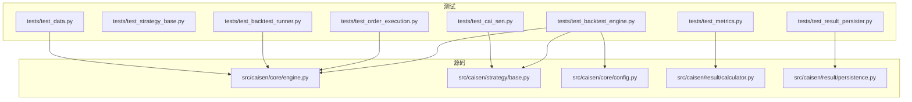
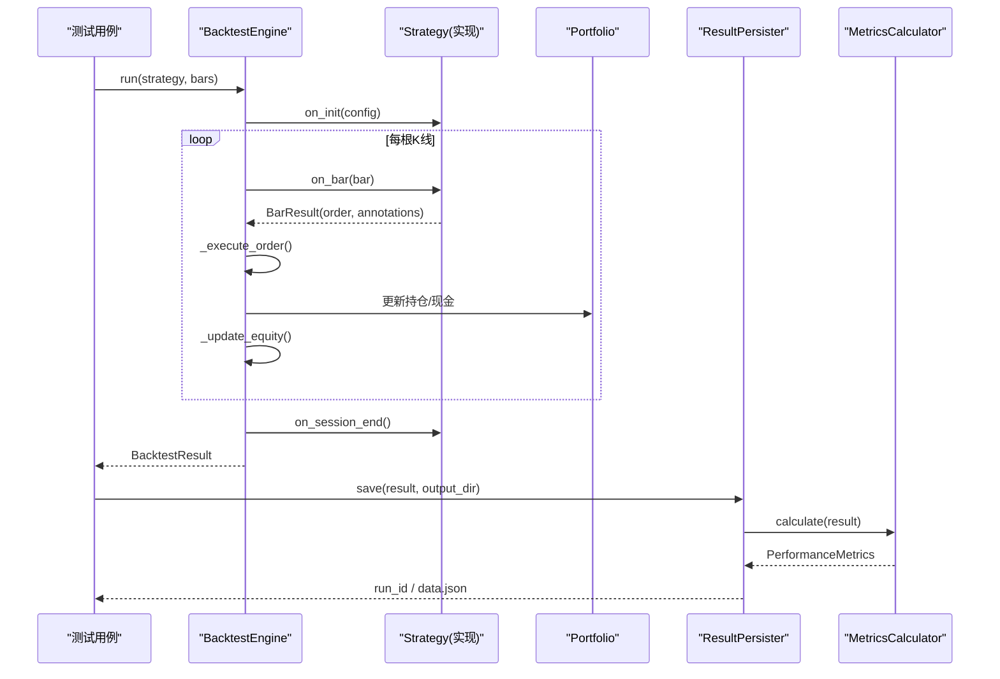
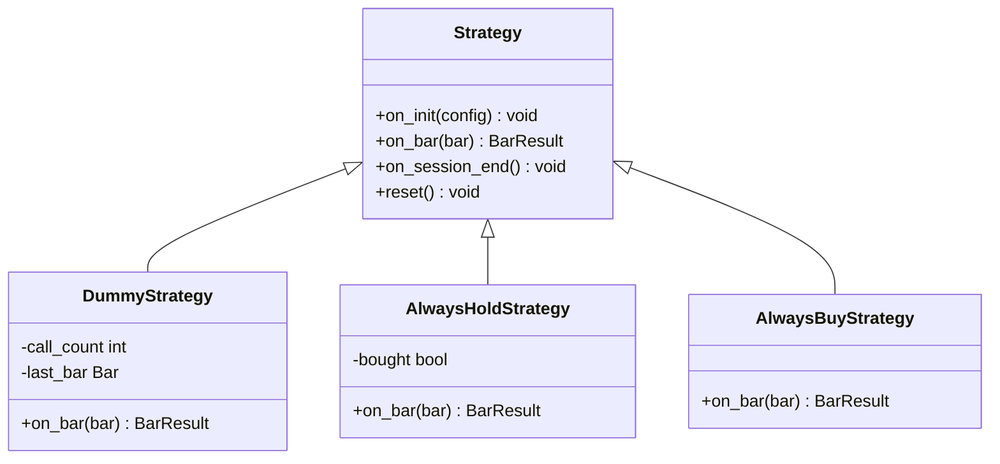
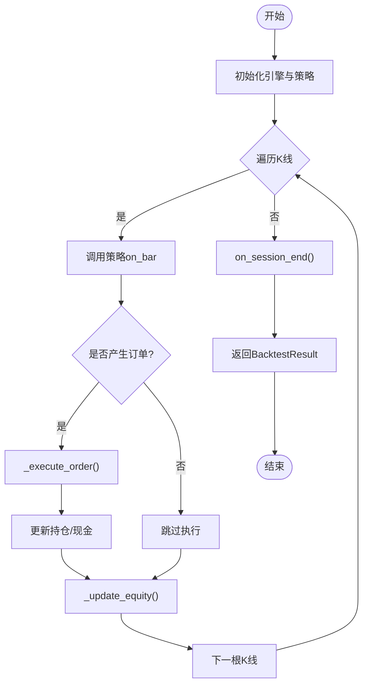
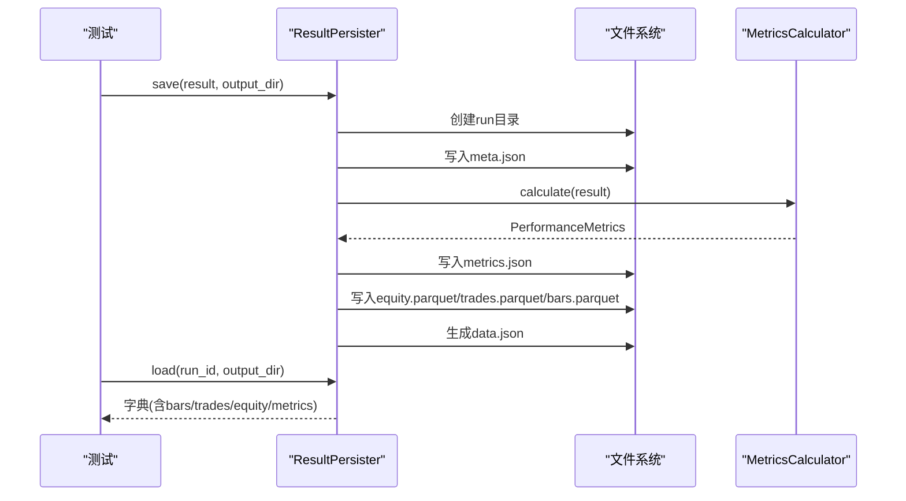
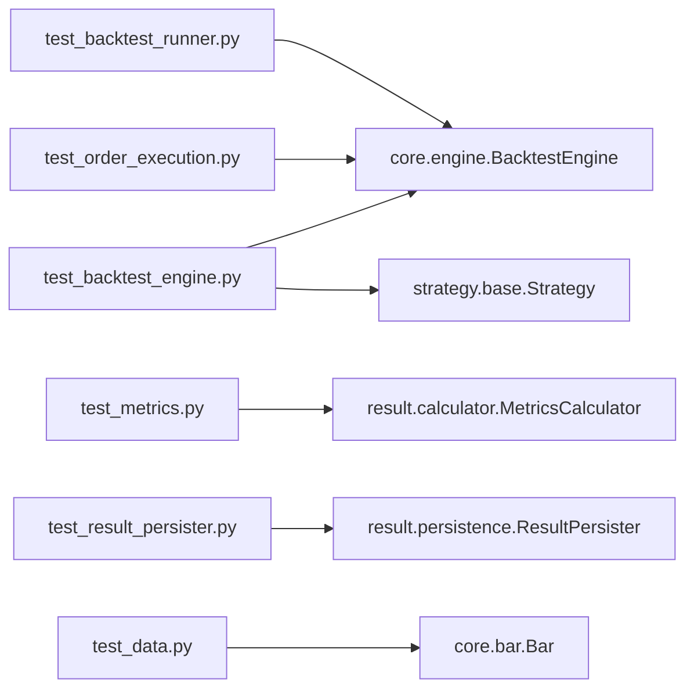

# Python 测试框架

<cite>
**本文引用的文件**   
- [pyproject.toml](file://pyproject.toml)
- [test_backtest_engine.py](file://tests/test_backtest_engine.py)
- [test_strategy_base.py](file://tests/test_strategy_base.py)
- [test_data.py](file://tests/test_data.py)
- [test_cai_sen.py](file://tests/test_cai_sen.py)
- [test_order_execution.py](file://tests/test_order_execution.py)
- [test_metrics.py](file://tests/test_metrics.py)
- [test_result_persister.py](file://tests/test_result_persister.py)
- [test_backtest_runner.py](file://tests/test_backtest_runner.py)
- [engine.py](file://src/caisen/core/engine.py)
- [base.py](file://src/caisen/strategy/base.py)
- [config.py](file://src/caisen/core/config.py)
- [calculator.py](file://src/caisen/result/calculator.py)
- [persistence.py](file://src/caisen/result/persistence.py)
</cite>

## 目录
1. [简介](#简介)
2. [项目结构](#项目结构)
3. [核心组件](#核心组件)
4. [架构总览](#架构总览)
5. [详细组件分析](#详细组件分析)
6. [依赖关系分析](#依赖关系分析)
7. [性能与可维护性建议](#性能与可维护性建议)
8. [故障排查指南](#故障排查指南)
9. [结论](#结论)
10. [附录](#附录)

## 简介
本文件面向量化回测系统的 Python 测试框架，围绕 pytest 在项目中的配置与使用展开，系统阐述：
- 测试文件组织、测试类设计与方法命名约定
- 夹具（fixtures）在配置、样本数据与模拟对象中的应用
- 策略测试最佳实践（DummyStrategy、生命周期方法、订单执行验证）
- 回测引擎测试（初始化、运行流程、结果验证）
- 数据处理测试（数据源、格式校验、异常处理）
- 断言库使用指南（数值比较、集合操作、自定义断言）
- 覆盖率统计与报告生成配置

## 项目结构
仓库采用“源码 + 测试”分离的组织方式：
- 源码位于 src/caisen，按模块划分 core、strategy、result、data 等
- 测试位于 tests，以功能域为维度组织，如 test_backtest_engine.py、test_strategy_base.py、test_result_persister.py 等
- 构建与工具配置集中在 pyproject.toml，包含可选开发依赖 pytest、pytest-cov 等

图表来源
- [test_backtest_engine.py:1-245](file://tests/test_backtest_engine.py#L1-L245)
- [test_strategy_base.py:1-266](file://tests/test_strategy_base.py#L1-L266)
- [test_data.py:1-74](file://tests/test_data.py#L1-L74)
- [test_cai_sen.py:1-225](file://tests/test_cai_sen.py#L1-L225)
- [test_order_execution.py:1-83](file://tests/test_order_execution.py#L1-L83)
- [test_metrics.py:1-170](file://tests/test_metrics.py#L1-L170)
- [test_result_persister.py:1-326](file://tests/test_result_persister.py#L1-L326)
- [test_backtest_runner.py:1-116](file://tests/test_backtest_runner.py#L1-L116)
- [engine.py:1-210](file://src/caisen/core/engine.py#L1-L210)
- [base.py:1-37](file://src/caisen/strategy/base.py#L1-L37)
- [config.py:1-94](file://src/caisen/core/config.py#L1-L94)
- [calculator.py:1-185](file://src/caisen/result/calculator.py#L1-L185)
- [persistence.py:1-274](file://src/caisen/result/persistence.py#L1-L274)

章节来源
- [pyproject.toml:24-30](file://pyproject.toml#L24-L30)

## 核心组件
- 回测引擎 BacktestEngine：负责策略生命周期调度、订单执行、净值更新与结果封装
- 策略基类 Strategy：定义 on_init/on_bar/on_session_end/reset 等生命周期接口
- 配置 BacktestConfig：初始资金、手续费率、滑点等回测参数
- 指标计算 MetricsCalculator：从 BacktestResult 计算年化收益、最大回撤、夏普比率、胜率、盈亏比等
- 结果持久化 ResultPersister：保存 meta/metrics/bars/trades/equity/data.json 等，并支持加载与可视化数据导出
- 测试夹具 fixtures：在测试中提供配置、样本 K 线、临时输出目录等共享资源

章节来源
- [engine.py:19-91](file://src/caisen/core/engine.py#L19-L91)
- [base.py:19-37](file://src/caisen/strategy/base.py#L19-L37)
- [config.py:9-15](file://src/caisen/core/config.py#L9-L15)
- [calculator.py:34-79](file://src/caisen/result/calculator.py#L34-L79)
- [persistence.py:59-133](file://src/caisen/result/persistence.py#L59-L133)

## 架构总览
下图展示测试到核心组件的调用关系与数据流。

图表来源
- [engine.py:33-91](file://src/caisen/core/engine.py#L33-L91)
- [persistence.py:59-133](file://src/caisen/result/persistence.py#L59-L133)
- [calculator.py:45-79](file://src/caisen/result/calculator.py#L45-L79)

## 详细组件分析

### 测试组织与命名约定
- 测试文件以功能域命名，如 test_backtest_engine.py、test_result_persister.py、test_metrics.py 等
- 测试类以 Test 开头，描述被测主题；测试方法以 test_ 开头，语义清晰表达预期行为
- 对复杂主题拆分为多个测试类与方法，保证单一职责与可读性

章节来源
- [test_backtest_engine.py:83-186](file://tests/test_backtest_engine.py#L83-L186)
- [test_result_persister.py:77-193](file://tests/test_result_persister.py#L77-L193)
- [test_metrics.py:33-147](file://tests/test_metrics.py#L33-L147)

### 夹具（fixtures）使用指南
- 配置夹具：通过 @pytest.fixture 提供 BacktestConfig 实例，避免重复构造
- 样本数据夹具：集中生成 Bar 列表，供多测试复用
- 临时目录夹具：结合 tmp_path 或手动创建/清理，确保隔离与幂等
- 组合夹具：sample_result 由 sample_bars 派生，体现夹具间的依赖关系

章节来源
- [test_backtest_engine.py:60-80](file://tests/test_backtest_engine.py#L60-L80)
- [test_result_persister.py:18-74](file://tests/test_result_persister.py#L18-L74)

### 策略测试最佳实践
- DummyStrategy 示例：最小化实现 on_bar，便于验证引擎流程与订单执行
- 生命周期方法测试：覆盖 on_init/on_bar/on_session_end/reset 的调用与返回类型
- 订单执行验证：通过 AlwaysHoldStrategy/AlwaysBuyStrategy 等简单策略，验证买入/卖出、滑点、仓位变化
- 形态检测器测试：针对 CaiSenStrategy 启用特定模式，验证信号触发与止损逻辑

图表来源
- [base.py:19-37](file://src/caisen/strategy/base.py#L19-L37)
- [test_strategy_base.py:10-79](file://tests/test_strategy_base.py#L10-L79)
- [test_backtest_engine.py:12-57](file://tests/test_backtest_engine.py#L12-L57)
- [test_order_execution.py:12-16](file://tests/test_order_execution.py#L12-L16)

章节来源
- [test_strategy_base.py:23-79](file://tests/test_strategy_base.py#L23-L79)
- [test_backtest_engine.py:12-57](file://tests/test_backtest_engine.py#L12-L57)
- [test_order_execution.py:12-83](file://tests/test_order_execution.py#L12-L83)
- [test_cai_sen.py:25-196](file://tests/test_cai_sen.py#L25-L196)

### 回测引擎测试
- 初始化测试：验证配置注入、初始资金、空交易与净值曲线状态
- 运行流程测试：run() 返回 BacktestResult，遍历所有 K 线，收集标注，生成净值曲线
- 结果验证：订单成交、滑点生效、持仓增加、最终权益大于初始资金等

图表来源
- [engine.py:33-91](file://src/caisen/core/engine.py#L33-L91)
- [engine.py:93-128](file://src/caisen/core/engine.py#L93-L128)
- [engine.py:202-210](file://src/caisen/core/engine.py#L202-L210)

章节来源
- [test_backtest_engine.py:83-186](file://tests/test_backtest_engine.py#L83-L186)
- [test_backtest_engine.py:188-245](file://tests/test_backtest_engine.py#L188-L245)

### 数据处理测试
- Bar 序列化/反序列化：to_dict/from_dict 一致性校验
- Parquet 读写：批量写入与读取，字段完整性检查
- 时间顺序与数量：确保时间戳递增与长度正确

章节来源
- [test_data.py:12-74](file://tests/test_data.py#L12-L74)

### 指标计算与结果持久化测试
- 指标计算：无交易、仅盈利、仅亏损、混合交易场景下的 win_rate、profit_factor、avg_win/loss 等
- 结果持久化：run_id 生成规则、meta/data/metrics/bars/trades/equity 文件生成与加载、可视化 data.json 字段完整性

图表来源
- [persistence.py:59-133](file://src/caisen/result/persistence.py#L59-L133)
- [persistence.py:204-245](file://src/caisen/result/persistence.py#L204-L245)
- [calculator.py:45-79](file://src/caisen/result/calculator.py#L45-L79)

章节来源
- [test_metrics.py:33-170](file://tests/test_metrics.py#L33-L170)
- [test_result_persister.py:77-326](file://tests/test_result_persister.py#L77-L326)

### 进度回调与端到端回测
- 进度回调：每 100 根 K 线触发一次，验证 processed/total/current_date 参数
- 端到端：传入 mock bars，验证返回 run_id 与目录存在性
- 异常路径：空数据与未知策略名抛出明确错误

章节来源
- [test_backtest_runner.py:31-116](file://tests/test_backtest_runner.py#L31-L116)

## 依赖关系分析
- 测试对源码的依赖集中于 engine、strategy、result、config 等模块
- 指标计算与持久化解耦，便于独立测试与替换
- 测试夹具减少耦合，提升复用性与稳定性

图表来源
- [test_backtest_engine.py:1-245](file://tests/test_backtest_engine.py#L1-L245)
- [test_order_execution.py:1-83](file://tests/test_order_execution.py#L1-L83)
- [test_metrics.py:1-170](file://tests/test_metrics.py#L1-L170)
- [test_result_persister.py:1-326](file://tests/test_result_persister.py#L1-L326)
- [test_backtest_runner.py:1-116](file://tests/test_backtest_runner.py#L1-L116)
- [test_data.py:1-74](file://tests/test_data.py#L1-L74)

章节来源
- [pyproject.toml:24-30](file://pyproject.toml#L24-L30)

## 性能与可维护性建议
- 使用夹具集中管理大数据集与临时目录，降低 IO 开销与副作用
- 将指标计算与持久化逻辑保持纯函数风格，便于单元测试与并行执行
- 对长耗时回测使用小样本数据与 mock，必要时拆分慢测试
- 利用 pytest 的标记与选择器控制测试粒度与范围

[本节为通用建议，不直接分析具体文件]

## 故障排查指南
- 回测结果为空或指标异常：检查 Bars 是否为空、交易配对是否正确、净值曲线是否完整
- 订单未成交或价格异常：确认滑点与手续费设置、成交价计算逻辑与 next_bar.open 的使用
- 持久化失败：确认 run_id 唯一性、目录权限、Parquet 列类型转换与 JSON 序列化
- 进度回调未触发：核对回调阈值与总条数，确保最后一根 K 线也触发

章节来源
- [engine.py:93-128](file://src/caisen/core/engine.py#L93-L128)
- [persistence.py:17-39](file://src/caisen/result/persistence.py#L17-L39)
- [calculator.py:124-185](file://src/caisen/result/calculator.py#L124-L185)

## 结论
本项目测试体系围绕 pytest 构建，覆盖了策略、引擎、指标与持久化的关键路径。通过清晰的测试组织、合理的夹具设计以及详尽的断言，保证了代码质量与可维护性。建议在后续迭代中持续完善边界条件与异常路径测试，并结合覆盖率统计形成闭环反馈。

[本节为总结性内容，不直接分析具体文件]

## 附录

### pytest 与覆盖率配置
- 开发依赖：在 pyproject.toml 的 optional-dependencies.dev 中包含 pytest 与 pytest-cov
- 运行命令（示例）：
  - 运行全部测试：pytest
  - 生成覆盖率报告：pytest --cov=src/caisen --cov-report=term-missing
- 前端 JS 测试目录配置：tool.vitest.testDirectory = "tests/js"（与本 Python 测试无关）

章节来源
- [pyproject.toml:24-30](file://pyproject.toml#L24-L30)
- [pyproject.toml:51-52](file://pyproject.toml#L51-L52)

### 断言库使用指南
- 数值比较：使用 assert a == b、assert a > b、浮点误差允许时使用近似比较
- 集合操作：使用 in/not in、len 检查、all()/any() 进行批量断言
- 自定义断言：封装业务相关的前置校验与后置断言，提高可读性与复用性

[本节为通用指导，不直接分析具体文件]