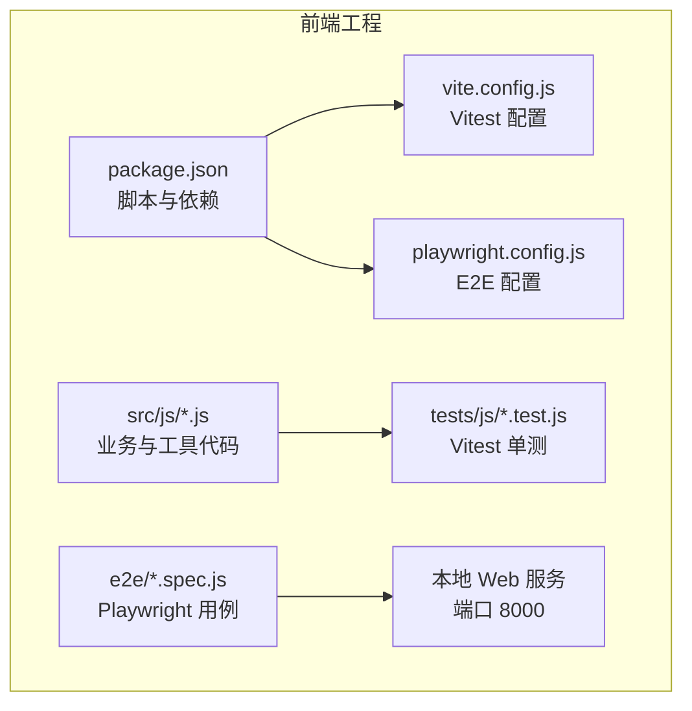
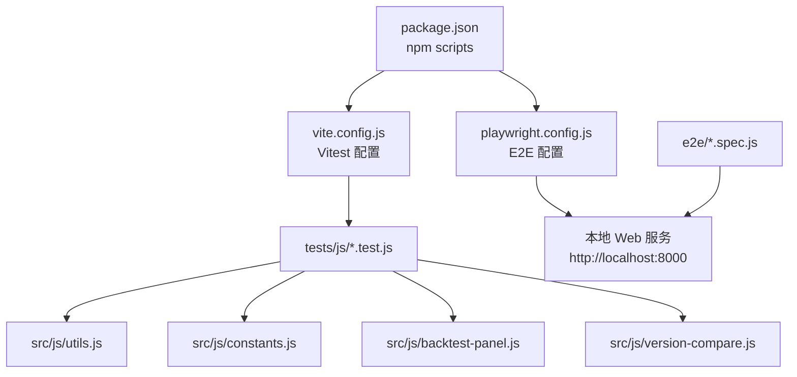
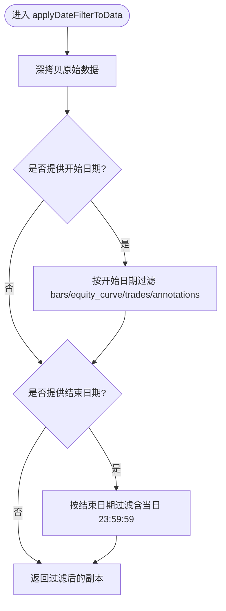
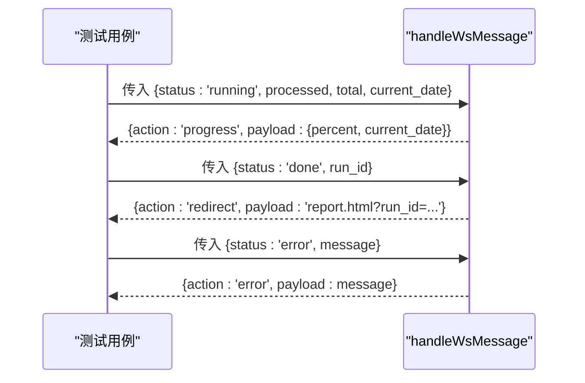
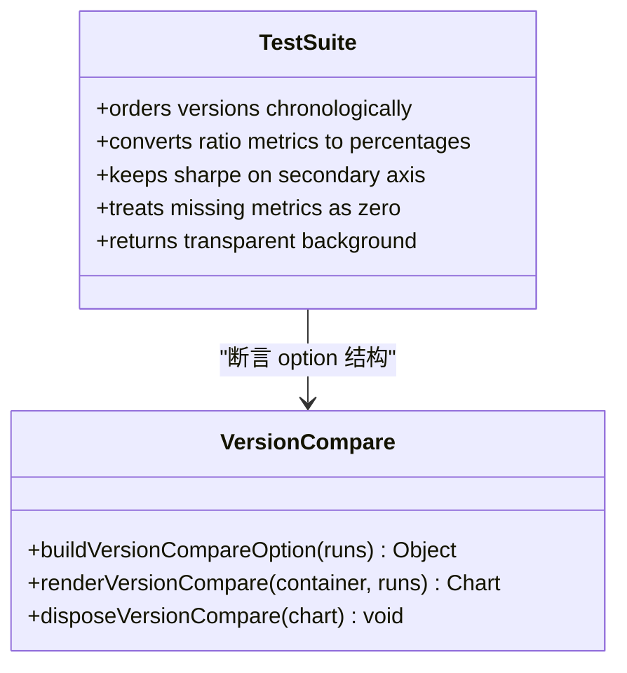
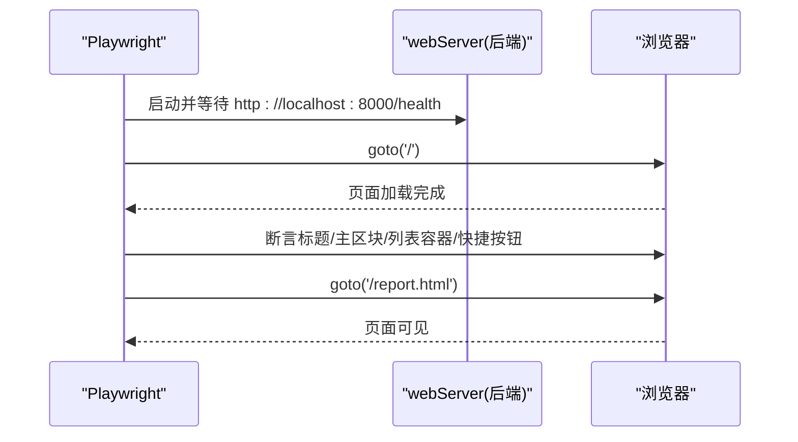
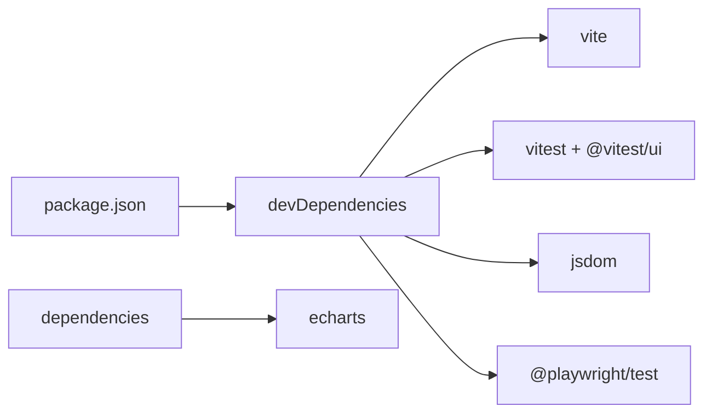

# 前端测试

<cite>
**本文引用的文件**
- [package.json](file://src/caisen/frontend/package.json)
- [vite.config.js](file://src/caisen/frontend/vite.config.js)
- [playwright.config.js](file://src/caisen/frontend/playwright.config.js)
- [utils.test.js](file://src/caisen/frontend/tests/js/utils.test.js)
- [constants.test.js](file://src/caisen/frontend/tests/js/constants.test.js)
- [backtest-panel.test.js](file://src/caisen/frontend/tests/js/backtest-panel.test.js)
- [version-compare.test.js](file://src/caisen/frontend/tests/js/version-compare.test.js)
- [index.spec.js](file://src/caisen/frontend/e2e/index.spec.js)
- [report.spec.js](file://src/caisen/frontend/e2e/report.spec.js)
- [utils.js](file://src/caisen/frontend/src/js/utils.js)
- [constants.js](file://src/caisen/frontend/src/js/constants.js)
- [backtest-panel.js](file://src/caisen/frontend/src/js/backtest-panel.js)
- [version-compare.js](file://src/caisen/frontend/src/js/version-compare.js)
</cite>

## 目录
1. [简介](#简介)
2. [项目结构](#项目结构)
3. [核心组件](#核心组件)
4. [架构总览](#架构总览)
5. [详细组件分析](#详细组件分析)
6. [依赖分析](#依赖分析)
7. [性能考虑](#性能考虑)
8. [故障排查指南](#故障排查指南)
9. [结论](#结论)
10. [附录](#附录)

## 简介
本指南面向前端测试，覆盖单元测试、端到端测试与组件/图表渲染测试策略，结合仓库中已有的 Vitest 与 Playwright 配置和用例，系统阐述：
- 测试环境设置（Vitest + jsdom）
- 模块导入与异步处理
- JavaScript 工具函数测试方法（输入输出验证、边界条件、错误场景）
- Playwright 端到端测试（浏览器自动化、页面交互、用户流程）
- 前端组件与图表渲染测试策略（含响应式布局验证）
- 测试数据准备与管理（模拟 API、静态数据、动态生成）
- 性能测试方法（加载时间、内存使用、渲染性能）
- 持续集成中的前端测试配置与执行

## 项目结构
前端位于 src/caisen/frontend，包含：
- 源码：src/js（工具函数、常量、面板逻辑、版本对比图表等）
- 单元测试：tests/js（Vitest 用例）
- 端到端测试：e2e（Playwright 用例）
- 构建与测试配置：vite.config.js、playwright.config.js、package.json

图示来源
- [package.json:1-26](file://src/caisen/frontend/package.json#L1-L26)
- [vite.config.js:1-43](file://src/caisen/frontend/vite.config.js#L1-L43)
- [playwright.config.js:1-30](file://src/caisen/frontend/playwright.config.js#L1-L30)

章节来源
- [package.json:1-26](file://src/caisen/frontend/package.json#L1-L26)
- [vite.config.js:1-43](file://src/caisen/frontend/vite.config.js#L1-L43)
- [playwright.config.js:1-30](file://src/caisen/frontend/playwright.config.js#L1-L30)

## 核心组件
- 测试框架与运行器
  - Vitest：启用全局 API、jsdom 环境、匹配 tests/js/**/*.test.js
  - Playwright：并行执行、重试、HTML 报告、自动启动后端服务
- 关键脚本
  - npm test / npm run test:ui：运行或 UI 模式运行单测
  - npm run test:e2e / npm run test:e2e:ui：运行或 UI 模式运行 E2E

章节来源
- [vite.config.js:36-40](file://src/caisen/frontend/vite.config.js#L36-L40)
- [playwright.config.js:1-30](file://src/caisen/frontend/playwright.config.js#L1-L30)
- [package.json:6-14](file://src/caisen/frontend/package.json#L6-L14)

## 架构总览
下图展示从“运行测试”到“被测代码”的调用关系，以及 E2E 对本地服务的依赖。

图示来源
- [package.json:6-14](file://src/caisen/frontend/package.json#L6-L14)
- [vite.config.js:36-40](file://src/caisen/frontend/vite.config.js#L36-L40)
- [playwright.config.js:24-28](file://src/caisen/frontend/playwright.config.js#L24-L28)
- [index.spec.js:1-22](file://src/caisen/frontend/e2e/index.spec.js#L1-L22)
- [report.spec.js:1-9](file://src/caisen/frontend/e2e/report.spec.js#L1-L9)

## 详细组件分析

### Vitest 单元测试：环境与配置
- 全局 API：通过 globals: true 提供 describe/it/expect
- 环境：environment: 'jsdom'，提供 DOM 能力（如需）
- 匹配规则：include: ['tests/js/**/*.test.js']
- 开发体验：支持 --ui 可视化运行

章节来源
- [vite.config.js:36-40](file://src/caisen/frontend/vite.config.js#L36-L40)

### 工具函数测试（utils.js）
- 覆盖范围
  - 格式化：百分比、货币、比率、无穷大、空值
  - 时间戳格式化
  - 年化收益计算（边界：空数据、不足两条）
  - 数值校验：有限数、坐标点有效性
  - 标注过滤：markPoints/markLines 合法性
  - 颜色常量存在性
  - 按时间戳查找 K 线
  - 日期区间过滤（bars/equity_curve/trades/annotations）
- 设计要点
  - 纯函数优先，便于断言
  - 边界与异常路径全覆盖（null/undefined/NaN/Infinity）
  - 使用确定性输入构造断言

图示来源
- [utils.js:164-185](file://src/caisen/frontend/src/js/utils.js#L164-L185)

章节来源
- [utils.test.js:1-154](file://src/caisen/frontend/tests/js/utils.test.js#L1-L154)
- [utils.js:1-185](file://src/caisen/frontend/src/js/utils.js#L1-L185)

### 常量与显示名测试（constants.js）
- 覆盖范围
  - 策略显示名映射与回退行为
  - 图表主题色、布局常量、标注类型注册表
  - 调试开关与日志方法存在性与可调用性
- 设计要点
  - 对外暴露的常量与函数需具备稳定的契约
  - 未知策略名应回退为原值，空输入返回空串

章节来源
- [constants.test.js:1-71](file://src/caisen/frontend/tests/js/constants.test.js#L1-L71)
- [constants.js:1-109](file://src/caisen/frontend/src/js/constants.js#L1-L109)

### 回测面板逻辑测试（backtest-panel.js）
- 覆盖范围
  - WebSocket URL 构造（run_id 与查询参数）
  - 表单渲染（float/bool/select 字段）
  - 请求体构造（必填字段与默认 params）
  - WebSocket 消息分发（progress/done/error）
- 设计要点
  - 将副作用与纯函数解耦：handleWsMessage 仅返回动作描述，便于断言
  - buildRunRequest 保证缺省字段安全

图示来源
- [backtest-panel.js:44-69](file://src/caisen/frontend/src/js/backtest-panel.js#L44-L69)
- [backtest-panel.test.js:90-110](file://src/caisen/frontend/tests/js/backtest-panel.test.js#L90-L110)

章节来源
- [backtest-panel.test.js:1-111](file://src/caisen/frontend/tests/js/backtest-panel.test.js#L1-L111)
- [backtest-panel.js:18-69](file://src/caisen/frontend/src/js/backtest-panel.js#L18-L69)

### 版本对比图表测试（version-compare.js）
- 覆盖范围
  - 按 created_at 排序并生成 v0/v1/v2 轴标签
  - 指标转换：收益率/回撤/胜率转为百分比；夏普比率保持比率并走右轴
  - 缺失指标以 0 填充不抛错
  - 背景透明适配玻璃面板
- 设计要点
  - 将 ECharts option 构造与渲染分离，便于无 DOM 断言
  - 双轴语义清晰：左轴百分比，右轴比率

图示来源
- [version-compare.js:51-148](file://src/caisen/frontend/src/js/version-compare.js#L51-L148)
- [version-compare.test.js:1-61](file://src/caisen/frontend/tests/js/version-compare.test.js#L1-L61)

章节来源
- [version-compare.test.js:1-61](file://src/caisen/frontend/tests/js/version-compare.test.js#L1-L61)
- [version-compare.js:1-192](file://src/caisen/frontend/src/js/version-compare.js#L1-L192)

### Playwright 端到端测试
- 配置要点
  - 测试目录：./e2e
  - 并行执行与 CI 重试
  - HTML 报告
  - baseURL: http://localhost:8000
  - webServer：自动启动后端服务并等待健康检查
- 用例覆盖
  - 首页标题与主区块
  - 列表加载状态选择器
  - 快捷操作区域可见性
  - 报告页基础可见性

图示来源
- [playwright.config.js:1-30](file://src/caisen/frontend/playwright.config.js#L1-L30)
- [index.spec.js:1-22](file://src/caisen/frontend/e2e/index.spec.js#L1-L22)
- [report.spec.js:1-9](file://src/caisen/frontend/e2e/report.spec.js#L1-L9)

章节来源
- [playwright.config.js:1-30](file://src/caisen/frontend/playwright.config.js#L1-L30)
- [index.spec.js:1-22](file://src/caisen/frontend/e2e/index.spec.js#L1-L22)
- [report.spec.js:1-9](file://src/caisen/frontend/e2e/report.spec.js#L1-L9)

### 前端组件与图表渲染测试策略
- 图表渲染
  - 将 ECharts option 构造与渲染分离，单测只断言 option 结构与数据转换
  - 在 E2E 中验证图表容器存在且可渲染（如通过截图或元素可见性）
- 用户交互
  - 通过 Playwright 模拟点击、输入、等待网络响应后断言 UI 变化
- 响应式布局
  - 在不同视口下断言关键布局元素可见性与位置
  - 监听 resize 事件确保图表实例正确调整尺寸（可在 E2E 中触发窗口大小变化）

[本节为通用策略说明，无需具体文件引用]

### 测试数据准备与管理
- 静态数据
  - 在单测中以字面量构造最小数据集（如 equity_curve、bars、trades、annotations）
- 动态数据
  - 基于种子或随机生成器创建边界数据（如 Infinity、NaN、空数组）
- 模拟 API 响应
  - 在 E2E 中可通过拦截或 Mock 后端接口，或在本地启动真实服务并使用 playwright.config.js 的 webServer 管理生命周期
  - 在单测中避免真实网络请求，直接断言纯函数返回值

[本节为通用策略说明，无需具体文件引用]

### 性能测试方法
- 加载时间
  - 使用 Playwright 的 page.goto 与 navigation timing 估算首屏加载耗时
- 内存使用监控
  - 在 E2E 中通过浏览器 DevTools Protocol 或进程级指标采集内存峰值
- 渲染性能评估
  - 针对图表渲染，记录 setOption 前后帧率或使用 Performance API 采样
  - 在 E2E 中通过多次重复操作观察卡顿与资源占用趋势

[本节为通用策略说明，无需具体文件引用]

## 依赖分析
- 运行时依赖
  - echarts：图表渲染库
- 开发依赖
  - vitest、@vitest/ui、jsdom：单元测试与 DOM 环境
  - @playwright/test：端到端测试
  - vite：开发与构建

图示来源
- [package.json:15-24](file://src/caisen/frontend/package.json#L15-L24)

章节来源
- [package.json:1-26](file://src/caisen/frontend/package.json#L1-L26)

## 性能考虑
- 单测
  - 控制 jsdom 文档复杂度，避免不必要的 DOM 树
  - 使用最小数据集与并行执行提升速度
- E2E
  - 合理设置 retries 与 workers，CI 环境限制并发
  - 复用本地服务器减少启动开销
- 图表
  - 按需更新 option，避免全量重绘
  - 大数据集采用抽样或分页渲染

[本节为通用建议，无需具体文件引用]

## 故障排查指南
- 常见错误定位
  - WebSocket 连接失败：检查 ws/wss 协议与路径构造
  - 后端未就绪：确认 webServer 健康检查地址可达
  - 图表未渲染：确认 window.echarts 可用与容器尺寸非零
- 诊断手段
  - 使用 Playwright trace（on-first-retry）回放
  - 在单测中打印中间结果，逐步缩小问题范围
  - 利用 Vite dev server 代理与本地端口一致性

章节来源
- [playwright.config.js:10-13](file://src/caisen/frontend/playwright.config.js#L10-L13)
- [backtest-panel.js:248-293](file://src/caisen/frontend/src/js/backtest-panel.js#L248-L293)

## 结论
本项目已建立较为完善的前端测试体系：
- 单元测试聚焦纯函数与数据结构转换，覆盖边界与异常路径
- E2E 通过 Playwright 自动化验证关键用户流程
- 图表渲染通过“option 构造 + 渲染分离”的策略兼顾可测性与可维护性
建议在后续迭代中补充更多交互与响应式场景的用例，并在 CI 中固化性能基线。

## 附录
- 常用命令
  - 运行单测：npm test
  - 单测 UI：npm run test:ui
  - 运行 E2E：npm run test:e2e
  - E2E UI：npm run test:e2e:ui
- 环境变量与代理
  - VITE_API_PROXY：Vite 开发代理目标地址
  - CI 相关：retries/workers/forbidOnly 由 playwright.config.js 读取

章节来源
- [package.json:6-14](file://src/caisen/frontend/package.json#L6-L14)
- [vite.config.js:4-7](file://src/caisen/frontend/vite.config.js#L4-L7)
- [playwright.config.js:6-9](file://src/caisen/frontend/playwright.config.js#L6-L9)