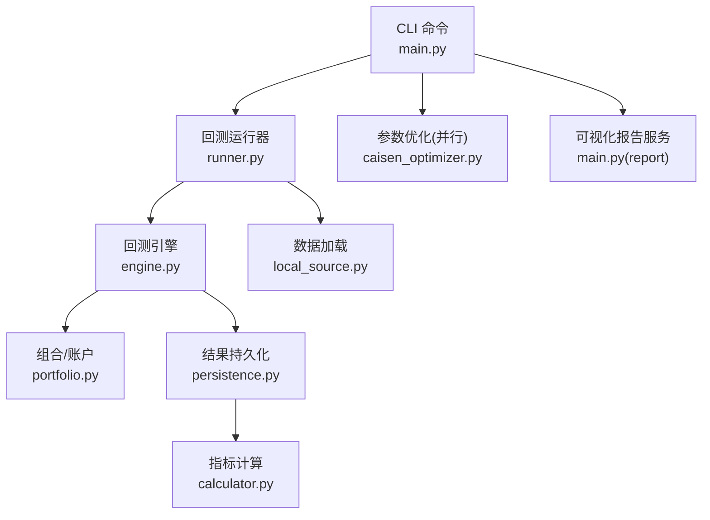
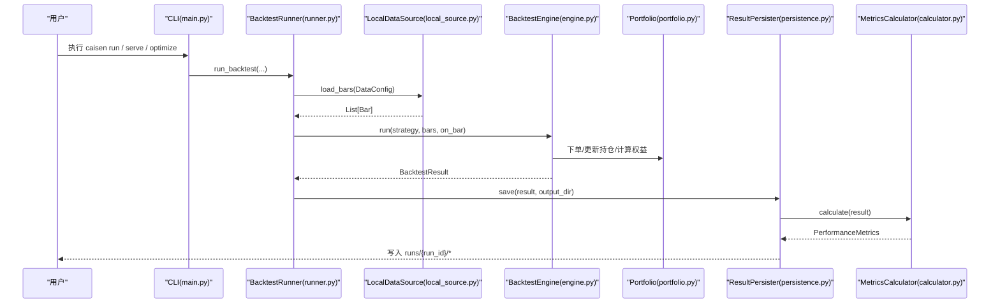
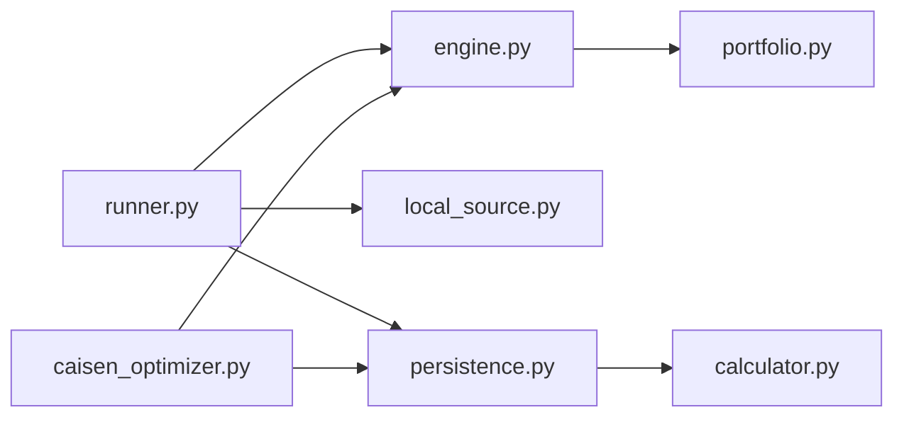

# 性能测试

<cite>
**本文引用的文件**
- [README.md](file://README.md)
- [pyproject.toml](file://pyproject.toml)
- [src/caisen/backtest/runner.py](file://src/caisen/backtest/runner.py)
- [src/caisen/core/engine.py](file://src/caisen/core/engine.py)
- [src/caisen/result/calculator.py](file://src/caisen/result/calculator.py)
- [src/caisen/result/persistence.py](file://src/caisen/result/persistence.py)
- [src/caisen/data/local_source.py](file://src/caisen/data/local_source.py)
- [src/caisen/core/portfolio.py](file://src/caisen/core/portfolio.py)
- [src/caisen/cli/main.py](file://src/caisen/cli/main.py)
- [src/caisen/strategy/algorithm/caisen_optimizer.py](file://src/caisen/strategy/algorithm/caisen_optimizer.py)
- [scripts/batch_backtest.py](file://scripts/batch_backtest.py)
- [tests/test_backtest_engine.py](file://tests/test_backtest_engine.py)
- [tests/test_metrics.py](file://tests/test_metrics.py)
</cite>

## 目录
1. [简介](#简介)
2. [项目结构](#项目结构)
3. [核心组件](#核心组件)
4. [架构总览](#架构总览)
5. [详细组件分析](#详细组件分析)
6. [依赖分析](#依赖分析)
7. [性能考虑](#性能考虑)
8. [故障排查指南](#故障排查指南)
9. [结论](#结论)
10. [附录](#附录)

## 简介
本指南面向量化回测系统的性能测试，覆盖基准测试设计、压力测试实现、内存泄漏检测、瓶颈识别、回归测试配置与优化建议，并给出报告生成与分析方法。文档结合仓库中的回测引擎、数据加载、结果持久化与指标计算等关键模块，提供可落地的实践方案与可视化图示。

## 项目结构
围绕性能测试相关的关键路径：
- 回测执行入口与流程编排：BacktestRunner
- 回测引擎主循环与订单执行：BacktestEngine
- 绩效指标计算：MetricsCalculator
- 结果持久化与可视化数据生成：ResultPersister
- 本地数据加载（Parquet）：LocalDataSource
- 组合与资金计算：Portfolio
- CLI 服务与并行优化：CLI main、caisen_optimizer
- 脚本示例（批量 LLM 信号 + 简单回测）：batch_backtest.py
- 单元测试（引擎与指标）：test_backtest_engine.py、test_metrics.py

图表来源
- [src/caisen/cli/main.py:240-371](file://src/caisen/cli/main.py#L240-L371)
- [src/caisen/backtest/runner.py:1-163](file://src/caisen/backtest/runner.py#L1-L163)
- [src/caisen/core/engine.py:1-210](file://src/caisen/core/engine.py#L1-L210)
- [src/caisen/data/local_source.py:1-199](file://src/caisen/data/local_source.py#L1-L199)
- [src/caisen/core/portfolio.py:1-46](file://src/caisen/core/portfolio.py#L1-L46)
- [src/caisen/result/persistence.py:1-274](file://src/caisen/result/persistence.py#L1-L274)
- [src/caisen/result/calculator.py:1-185](file://src/caisen/result/calculator.py#L1-L185)
- [src/caisen/strategy/algorithm/caisen_optimizer.py:1-234](file://src/caisen/strategy/algorithm/caisen_optimizer.py#L1-L234)

章节来源
- [README.md:1-396](file://README.md#L1-L396)
- [pyproject.toml:1-59](file://pyproject.toml#L1-L59)

## 核心组件
- 回测运行器 BacktestRunner：封装“加载数据 → 实例化策略 → 运行引擎 → 持久化结果”的完整流程，支持进度回调与输出目录配置。
- 回测引擎 BacktestEngine：驱动逐根 K 线处理，执行订单、更新持仓与净值曲线，收集标注，返回统一结果对象。
- 指标计算器 MetricsCalculator：计算年化收益、最大回撤、夏普比率、胜率、盈亏比等指标。
- 结果持久化 ResultPersister：保存 meta、equity/trades/bars 的 Parquet 文件与 metrics.json、data.json 等前端可视化数据。
- 本地数据源 LocalDataSource：从按日期分片的 Parquet 文件读取 OHLCV，并按时间范围过滤排序。
- 组合 Portfolio：维护现金、持仓与权益计算。
- CLI 与优化：提供可视化服务启动与网格搜索优化（多线程）。

章节来源
- [src/caisen/backtest/runner.py:1-163](file://src/caisen/backtest/runner.py#L1-L163)
- [src/caisen/core/engine.py:1-210](file://src/caisen/core/engine.py#L1-L210)
- [src/caisen/result/calculator.py:1-185](file://src/caisen/result/calculator.py#L1-L185)
- [src/caisen/result/persistence.py:1-274](file://src/caisen/result/persistence.py#L1-L274)
- [src/caisen/data/local_source.py:1-199](file://src/caisen/data/local_source.py#L1-L199)
- [src/caisen/core/portfolio.py:1-46](file://src/caisen/core/portfolio.py#L1-L46)
- [src/caisen/cli/main.py:240-371](file://src/caisen/cli/main.py#L240-L371)
- [src/caisen/strategy/algorithm/caisen_optimizer.py:1-234](file://src/caisen/strategy/algorithm/caisen_optimizer.py#L1-L234)

## 架构总览
下图展示一次回测从 CLI 到结果输出的端到端调用链，以及指标计算与持久化的关系。

图表来源
- [src/caisen/cli/main.py:240-371](file://src/caisen/cli/main.py#L240-L371)
- [src/caisen/backtest/runner.py:1-163](file://src/caisen/backtest/runner.py#L1-L163)
- [src/caisen/data/local_source.py:1-199](file://src/caisen/data/local_source.py#L1-L199)
- [src/caisen/core/engine.py:1-210](file://src/caisen/core/engine.py#L1-L210)
- [src/caisen/core/portfolio.py:1-46](file://src/caisen/core/portfolio.py#L1-L46)
- [src/caisen/result/persistence.py:1-274](file://src/caisen/result/persistence.py#L1-L274)
- [src/caisen/result/calculator.py:1-185](file://src/caisen/result/calculator.py#L1-L185)

## 详细组件分析

### 基准测试设计与实施
- 目标
  - 建立稳定的性能基线：吞吐（bars/s）、延迟（每根 bar 处理耗时）、资源占用（CPU/内存/IO）。
  - 验证指标计算的稳定性与正确性。
- 指标定义
  - 吞吐：单位时间内处理的 K 线条数。
  - 延迟：单根 bar 的平均/分位处理时间。
  - 资源：峰值 CPU、平均内存、磁盘 IO 带宽。
  - 指标质量：年化收益、最大回撤、夏普比率、胜率、盈亏比等。
- 场景设计
  - 小样本快速校验：使用内置模拟数据或短周期分钟级数据。
  - 中规模基准：日线级别多品种、多年跨度。
  - 大规模基准：高频分钟级长序列，评估 I/O 与内存压力。
- 实施要点
  - 使用 BacktestRunner.run_backtest 作为统一入口，便于注入 bars 与进度回调。
  - 通过 BacktestEngine.run 的主循环统计 per-bar 耗时；在 on_bar 回调中记录时间戳。
  - 使用 ResultPersister.save 持久化结果，并用 MetricsCalculator 计算指标用于回归对比。
- 参考路径
  - 回测入口与流程：[src/caisen/backtest/runner.py:26-94](file://src/caisen/backtest/runner.py#L26-L94)
  - 引擎主循环与进度回调：[src/caisen/core/engine.py:33-91](file://src/caisen/core/engine.py#L33-L91)
  - 指标计算入口：[src/caisen/result/calculator.py:34-79](file://src/caisen/result/calculator.py#L34-L79)
  - 结果持久化与 data.json 生成：[src/caisen/result/persistence.py:62-133](file://src/caisen/result/persistence.py#L62-L133)

章节来源
- [src/caisen/backtest/runner.py:26-94](file://src/caisen/backtest/runner.py#L26-L94)
- [src/caisen/core/engine.py:33-91](file://src/caisen/core/engine.py#L33-L91)
- [src/caisen/result/calculator.py:34-79](file://src/caisen/result/calculator.py#L34-L79)
- [src/caisen/result/persistence.py:62-133](file://src/caisen/result/persistence.py#L62-L133)

### 压力测试实现
- 大数据集回测
  - 使用 LocalDataSource 按日期范围加载多个 parquet 文件，合并后按时间排序，适合大区间回测。
  - 关注 I/O 吞吐与内存峰值，必要时分批加载或流式处理。
- 并发请求处理
  - CLI 的 report 命令同时启动后端 API 与前端开发服务器，可用于并发访问可视化服务的压测。
  - 优化模块 grid_search 使用 ThreadPoolExecutor 并行执行多组参数的回测，适合高并发压力场景。
- 资源消耗监控
  - 建议在压测时采集进程级 CPU、内存、I/O 指标（如系统工具），并结合 data.json 与 metrics.json 进行关联分析。
- 参考路径
  - 本地数据加载与范围筛选：[src/caisen/data/local_source.py:39-80](file://src/caisen/data/local_source.py#L39-L80)
  - 可视化服务并发启动：[src/caisen/cli/main.py:240-295](file://src/caisen/cli/main.py#L240-L295)
  - 并行优化（线程池）：[src/caisen/strategy/algorithm/caisen_optimizer.py:225-234](file://src/caisen/strategy/algorithm/caisen_optimizer.py#L225-L234)

章节来源
- [src/caisen/data/local_source.py:39-80](file://src/caisen/data/local_source.py#L39-L80)
- [src/caisen/cli/main.py:240-295](file://src/caisen/cli/main.py#L240-L295)
- [src/caisen/strategy/algorithm/caisen_optimizer.py:225-234](file://src/caisen/strategy/algorithm/caisen_optimizer.py#L225-L234)

### 内存泄漏检测
- 方法
  - 内存快照分析：在长时间回测前后分别导出堆快照，对比对象增长趋势。
  - 垃圾回收监控：观察 GC 次数与暂停时间，定位频繁分配热点。
  - 内存使用趋势跟踪：绘制进程 RSS/VSZ 随时间的变化曲线，识别异常上升。
- 结合代码的建议
  - 避免在 on_bar 中创建不必要的中间对象，减少临时列表与字符串拼接。
  - 对 Bars 列表与 equity_curve 等大对象进行复用或增量写入，降低峰值内存。
  - 注意持久化阶段 DataFrame 转换与序列化时的内存占用。
- 参考路径
  - 引擎内 equity_curve 累积与最终结果构建：[src/caisen/core/engine.py:202-210](file://src/caisen/core/engine.py#L202-L210)
  - 持久化阶段 DataFrame 转换与 JSON 序列化：[src/caisen/result/persistence.py:97-133](file://src/caisen/result/persistence.py#L97-L133)

章节来源
- [src/caisen/core/engine.py:202-210](file://src/caisen/core/engine.py#L202-L210)
- [src/caisen/result/persistence.py:97-133](file://src/caisen/result/persistence.py#L97-L133)

### 性能瓶颈识别技术
- CPU 使用率分析
  - 聚焦引擎主循环与策略 on_bar 逻辑，识别热点函数与分支判断开销。
- I/O 性能监控
  - 关注 parquet 读取与多次 to_parquet/to_dict 转换的耗时，评估是否可批量化或流式写入。
- 网络延迟测量
  - 若集成 LLM 或远程数据源，需测量请求往返时间与重试开销；可在 batch_backtest 脚本中扩展计时。
- 参考路径
  - 引擎主循环与订单执行：[src/caisen/core/engine.py:33-128](file://src/caisen/core/engine.py#L33-L128)
  - 本地数据加载与列映射：[src/caisen/data/local_source.py:139-199](file://src/caisen/data/local_source.py#L139-L199)
  - 批量 LLM 信号与简单回测脚本（可扩展计时）：[scripts/batch_backtest.py:1-200](file://scripts/batch_backtest.py#L1-L200)

章节来源
- [src/caisen/core/engine.py:33-128](file://src/caisen/core/engine.py#L33-L128)
- [src/caisen/data/local_source.py:139-199](file://src/caisen/data/local_source.py#L139-L199)
- [scripts/batch_backtest.py:1-200](file://scripts/batch_backtest.py#L1-L200)

### 性能回归测试配置
- 基线性能建立
  - 选择代表性数据集与策略，固定随机种子与硬件环境，记录吞吐、延迟与资源指标，形成基线。
- 阈值设定
  - 为关键指标设置允许波动范围（如吞吐下降超过 5%、最大回撤偏差超过阈值），触发告警。
- 自动告警机制
  - 将指标写入 runs/{run_id}/metrics.json 与 data.json，CI 中比较新旧结果，差异超阈则失败并通知。
- 参考路径
  - 指标计算与持久化：[src/caisen/result/calculator.py:34-79](file://src/caisen/result/calculator.py#L34-L79)
  - 结果保存与 data.json 生成：[src/caisen/result/persistence.py:118-133](file://src/caisen/result/persistence.py#L118-L133)
  - 单元测试覆盖引擎与指标行为：[tests/test_backtest_engine.py:1-245](file://tests/test_backtest_engine.py#L1-L245)、[tests/test_metrics.py:1-170](file://tests/test_metrics.py#L1-L170)

章节来源
- [src/caisen/result/calculator.py:34-79](file://src/caisen/result/calculator.py#L34-L79)
- [src/caisen/result/persistence.py:118-133](file://src/caisen/result/persistence.py#L118-L133)
- [tests/test_backtest_engine.py:1-245](file://tests/test_backtest_engine.py#L1-L245)
- [tests/test_metrics.py:1-170](file://tests/test_metrics.py#L1-L170)

### 性能优化建议
- 算法优化
  - 减少 on_bar 中的重复计算与条件分支，尽量向量化或缓存中间结果。
- 数据结构选择
  - 使用高效的数据容器（如数组/队列）替代频繁 append/pop 的列表操作。
- 缓存策略应用
  - 对 LLM 策略启用离线预计算与缓存回放，避免重复推理；对常用指标或形态检测结果做缓存。
- 参考路径
  - 组合权益与可用资金计算：[src/caisen/core/portfolio.py:25-39](file://src/caisen/core/portfolio.py#L25-L39)
  - 指标计算（Pandas/NumPy 向量化）：[src/caisen/result/calculator.py:101-122](file://src/caisen/result/calculator.py#L101-L122)
  - 并行优化（线程池）：[src/caisen/strategy/algorithm/caisen_optimizer.py:225-234](file://src/caisen/strategy/algorithm/caisen_optimizer.py#L225-L234)

章节来源
- [src/caisen/core/portfolio.py:25-39](file://src/caisen/core/portfolio.py#L25-L39)
- [src/caisen/result/calculator.py:101-122](file://src/caisen/result/calculator.py#L101-L122)
- [src/caisen/strategy/algorithm/caisen_optimizer.py:225-234](file://src/caisen/strategy/algorithm/caisen_optimizer.py#L225-L234)

### 性能测试报告生成与分析
- 报告内容
  - 基线与当前运行的吞吐、延迟、资源占用对比；指标差异（年化收益、最大回撤、夏普比率、胜率、盈亏比）。
  - 关键路径耗时分布（on_bar、订单执行、持久化、指标计算）。
- 生成方式
  - 利用 ResultPersister.save 生成的 data.json 与 metrics.json，结合外部工具（如 Pandas/NumPy）汇总统计。
  - 可视化服务可通过 CLI 的 report 命令启动，便于人工复核与交互式分析。
- 参考路径
  - 指标计算与保存：[src/caisen/result/calculator.py:34-79](file://src/caisen/result/calculator.py#L34-L79)、[src/caisen/result/persistence.py:118-133](file://src/caisen/result/persistence.py#L118-L133)
  - 可视化服务启动：[src/caisen/cli/main.py:240-295](file://src/caisen/cli/main.py#L240-L295)

章节来源
- [src/caisen/result/calculator.py:34-79](file://src/caisen/result/calculator.py#L34-L79)
- [src/caisen/result/persistence.py:118-133](file://src/caisen/result/persistence.py#L118-L133)
- [src/caisen/cli/main.py:240-295](file://src/caisen/cli/main.py#L240-L295)

## 依赖分析
- 外部依赖
  - pandas、pyarrow：用于 Parquet 读写与数据分析。
  - click、fastapi、uvicorn、websockets：CLI 与 Web 服务。
  - pyyaml：配置文件解析。
- 内部依赖
  - runner 依赖 engine、data、result、strategy 注册表。
  - engine 依赖 portfolio、order、trade、annotation 等核心类型。
  - persistence 依赖 calculator 与 types。
  - optimizer 依赖 engine 与 result 模块，并使用线程池并行。

图表来源
- [src/caisen/backtest/runner.py:1-163](file://src/caisen/backtest/runner.py#L1-L163)
- [src/caisen/core/engine.py:1-210](file://src/caisen/core/engine.py#L1-L210)
- [src/caisen/data/local_source.py:1-199](file://src/caisen/data/local_source.py#L1-L199)
- [src/caisen/result/persistence.py:1-274](file://src/caisen/result/persistence.py#L1-L274)
- [src/caisen/core/portfolio.py:1-46](file://src/caisen/core/portfolio.py#L1-L46)
- [src/caisen/result/calculator.py:1-185](file://src/caisen/result/calculator.py#L1-L185)
- [src/caisen/strategy/algorithm/caisen_optimizer.py:1-234](file://src/caisen/strategy/algorithm/caisen_optimizer.py#L1-L234)

章节来源
- [pyproject.toml:1-59](file://pyproject.toml#L1-L59)

## 性能考虑
- 数据 I/O
  - 合理划分 parquet 文件粒度，避免单次读取过大文件导致内存峰值过高。
  - 对频繁 to_dict 与 to_parquet 的场景，考虑批处理与增量写入。
- 计算密集
  - 优先使用向量化计算（Pandas/NumPy），减少 Python 层循环。
  - 对复杂策略逻辑，考虑提前计算与缓存。
- 并发与并行
  - 使用线程池并行执行独立任务（如网格搜索），但需注意共享状态与锁的使用。
- 资源监控
  - 在 CI 中集成资源采集，确保回归测试包含性能维度。

## 故障排查指南
- 常见问题
  - 数据为空：当指定时间段无数据时，Runner 会抛出错误提示。
  - 策略未注册：策略名称未在注册表中找到时会报错。
  - 指标计算异常：如无交易或净值曲线不足，指标可能返回默认值。
- 定位方法
  - 检查 runs/{run_id}/meta.json 与 metrics.json，确认数据与指标完整性。
  - 查看 data.json 的结构与字段，确保前端可视化数据一致。
  - 使用单元测试复现问题，逐步缩小范围。
- 参考路径
  - 空数据与策略加载错误处理：[src/caisen/backtest/runner.py:70-143](file://src/caisen/backtest/runner.py#L70-L143)
  - 指标边界情况处理：[src/caisen/result/calculator.py:81-122](file://src/caisen/result/calculator.py#L81-L122)
  - 引擎与指标单元测试：[tests/test_backtest_engine.py:1-245](file://tests/test_backtest_engine.py#L1-L245)、[tests/test_metrics.py:1-170](file://tests/test_metrics.py#L1-L170)

章节来源
- [src/caisen/backtest/runner.py:70-143](file://src/caisen/backtest/runner.py#L70-L143)
- [src/caisen/result/calculator.py:81-122](file://src/caisen/result/calculator.py#L81-L122)
- [tests/test_backtest_engine.py:1-245](file://tests/test_backtest_engine.py#L1-L245)
- [tests/test_metrics.py:1-170](file://tests/test_metrics.py#L1-L170)

## 结论
通过统一的回测入口、清晰的引擎主循环、完善的指标计算与持久化机制，本项目具备良好的性能测试基础。建议以基准测试建立基线，结合压力测试与回归测试持续监控性能变化；在瓶颈识别与优化方面，重点关注 I/O 与计算热点，并引入缓存与并行策略提升整体效率。

## 附录
- 快速开始与 CLI 说明参见 README。
- 依赖安装与可选开发依赖见 pyproject.toml。

章节来源
- [README.md:1-396](file://README.md#L1-L396)
- [pyproject.toml:1-59](file://pyproject.toml#L1-L59)