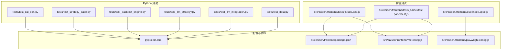
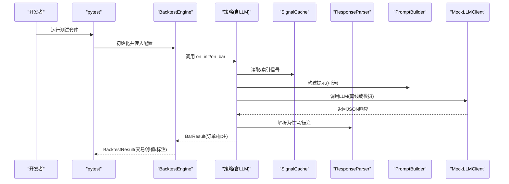
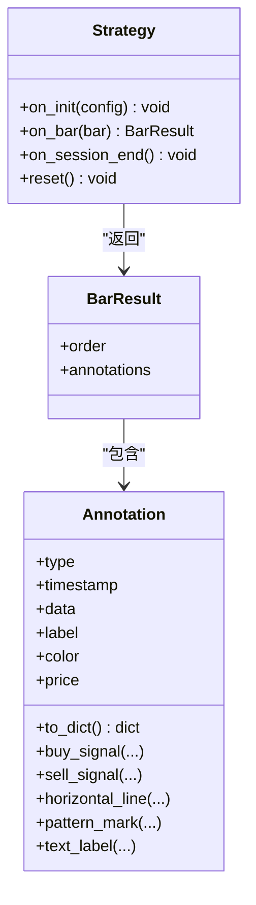
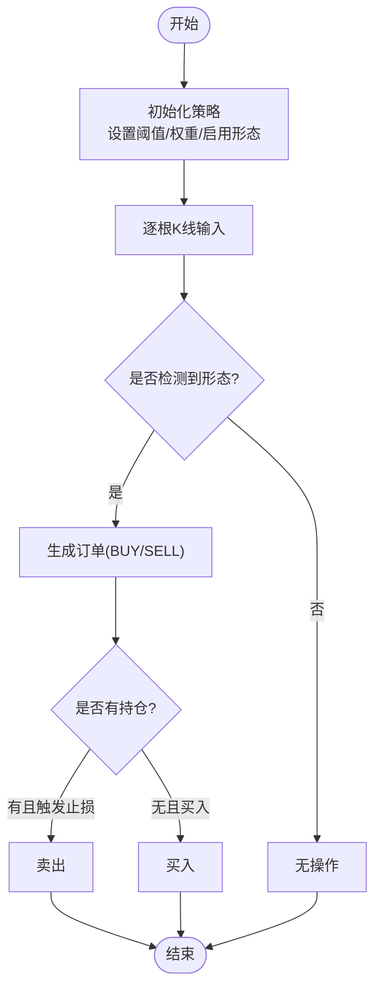
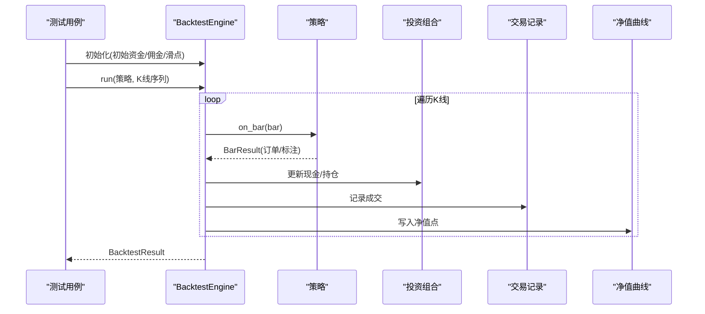
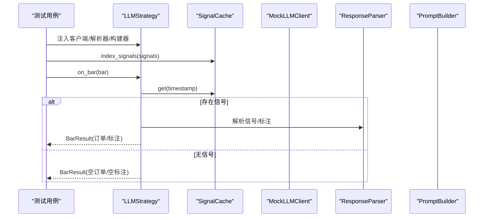
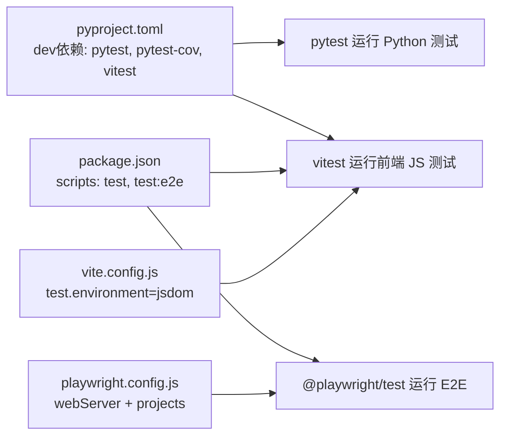

# 测试指南

<cite>
**本文引用的文件**   
- [pyproject.toml](file://pyproject.toml)
- [package.json](file://src/caisen/frontend/package.json)
- [vite.config.js](file://src/caisen/frontend/vite.config.js)
- [playwright.config.js](file://src/caisen/frontend/playwright.config.js)
- [test_cai_sen.py](file://tests/test_cai_sen.py)
- [test_strategy_base.py](file://tests/test_strategy_base.py)
- [test_backtest_engine.py](file://tests/test_backtest_engine.py)
- [test_llm_strategy.py](file://tests/test_llm_strategy.py)
- [test_llm_integration.py](file://tests/test_llm_integration.py)
- [test_data.py](file://tests/test_data.py)
- [utils.test.js](file://src/caisen/frontend/tests/js/utils.test.js)
- [backtest-panel.test.js](file://src/caisen/frontend/tests/js/backtest-panel.test.js)
- [index.spec.js](file://src/caisen/frontend/e2e/index.spec.js)
</cite>

## 目录
1. [引言](#引言)
2. [项目结构](#项目结构)
3. [核心组件](#核心组件)
4. [架构总览](#架构总览)
5. [详细组件分析](#详细组件分析)
6. [依赖分析](#依赖分析)
7. [性能考虑](#性能考虑)
8. [故障排查指南](#故障排查指南)
9. [结论](#结论)
10. [附录](#附录)

## 引言
本指南面向 Caisen 项目的测试体系，覆盖单元测试、集成测试与端到端测试的分层策略；详细说明 Python 侧基于 pytest 的策略测试、引擎测试与数据处理测试方法；阐述前端基于 Vitest 的单元测试与基于 Playwright 的端到端测试配置与使用；解释测试数据管理（模拟数据生成、夹具与环境隔离）；给出性能测试方法（基准、压力、内存泄漏检测）；提供覆盖率要求与持续集成建议；总结最佳实践与常见场景示例。

## 项目结构
Caisen 采用前后端分离与分层测试组织：
- Python 测试位于 tests/，按模块与功能划分，涵盖策略、回测引擎、LLM 策略、数据加载等。
- 前端测试位于 src/caisen/frontend/tests/js（Vitest）与 src/caisen/frontend/e2e（Playwright）。
- 构建与测试工具链通过 pyproject.toml 与前端 package.json、vite.config.js、playwright.config.js 统一配置。

图表来源
- [pyproject.toml:1-59](file://pyproject.toml#L1-L59)
- [package.json:1-26](file://src/caisen/frontend/package.json#L1-L26)
- [vite.config.js:1-43](file://src/caisen/frontend/vite.config.js#L1-L43)
- [playwright.config.js:1-30](file://src/caisen/frontend/playwright.config.js#L1-L30)

章节来源
- [pyproject.toml:1-59](file://pyproject.toml#L1-L59)
- [package.json:1-26](file://src/caisen/frontend/package.json#L1-L26)
- [vite.config.js:1-43](file://src/caisen/frontend/vite.config.js#L1-L43)
- [playwright.config.js:1-30](file://src/caisen/frontend/playwright.config.js#L1-L30)

## 核心组件
- 策略基类与标注体系：Strategy、Annotation、BarResult 等构成策略与可视化标注的基础接口，测试覆盖初始化、抽象约束、序列化与工厂方法。
- 回测引擎：BacktestEngine 负责驱动策略逐 K 线运行、订单执行、净值曲线与交易记录生成，测试覆盖初始化、运行流程、滑点与佣金、净值计算等。
- LLM 策略：LLMStrategy 结合 PromptBuilder、ResponseParser 与 SignalCache，实现离线预计算信号并在 on_bar 阶段回放，测试覆盖信号缓存、订单生成、标注分发与端到端流程。
- 数据处理：Bar 序列化/反序列化、Parquet 读写、批量构造与时间顺序校验，确保数据链路稳定。
- 前端工具函数与面板逻辑：Vitest 覆盖数值格式化、坐标校验、日期过滤、WebSocket URL 构造、参数表单渲染、消息处理等。
- 端到端页面：Playwright 验证首页标题、区域可见性与运行列表加载。

章节来源
- [test_strategy_base.py:1-266](file://tests/test_strategy_base.py#L1-L266)
- [test_backtest_engine.py:1-245](file://tests/test_backtest_engine.py#L1-L245)
- [test_llm_strategy.py:1-301](file://tests/test_llm_strategy.py#L1-L301)
- [test_llm_integration.py:1-240](file://tests/test_llm_integration.py#L1-L240)
- [test_data.py:1-74](file://tests/test_data.py#L1-L74)
- [utils.test.js:1-154](file://src/caisen/frontend/tests/js/utils.test.js#L1-L154)
- [backtest-panel.test.js:1-111](file://src/caisen/frontend/tests/js/backtest-panel.test.js#L1-L111)
- [index.spec.js:1-22](file://src/caisen/frontend/e2e/index.spec.js#L1-L22)

## 架构总览
测试分层与交互关系如下：
- 单元测试：聚焦最小可测单元（策略基类、工具函数、数据结构），快速反馈。
- 集成测试：组合多个子系统（LLM 策略 + 缓存 + 解析器；回测引擎 + 策略 + 订单执行），验证协作正确性。
- 端到端测试：启动 Web 服务并访问页面，验证用户可见行为与关键 UI 元素。

图表来源
- [test_backtest_engine.py:1-245](file://tests/test_backtest_engine.py#L1-L245)
- [test_llm_strategy.py:1-301](file://tests/test_llm_strategy.py#L1-L301)
- [test_llm_integration.py:1-240](file://tests/test_llm_integration.py#L1-L240)

## 详细组件分析

### 策略基类与标注体系测试
- 目标：验证 Strategy 抽象约束、生命周期回调、BarResult 返回规范；Annotation 属性、默认值、序列化与工厂方法。
- 关键点：
  - 直接实例化 Strategy 应抛出异常，强制子类实现 on_bar。
  - on_init/on_session_end/reset 需安全可调用。
  - Annotation 的 label/color/price 默认值与 to_dict 序列化（包括 datetime 转 ISO）。
  - 工厂方法 buy_signal/sell_signal/horizontal_line/pattern_mark/text_label 的行为一致性。

图表来源
- [test_strategy_base.py:1-266](file://tests/test_strategy_base.py#L1-L266)

章节来源
- [test_strategy_base.py:1-266](file://tests/test_strategy_base.py#L1-L266)

### 蔡森策略与形态检测器测试
- 目标：验证 CaiSenStrategy 初始化、从配置创建、启用特定形态、无持仓不卖、W底/M头检测、止损与仓位管理、多形态同时启用、十二形态全部注册。
- 关键点：
  - enabled_patterns 控制检测器集合。
  - 纯函数式 detect(bars) 用于形态检测器独立验证。
  - 止损因子触发卖出、重复买入保护。

图表来源
- [test_cai_sen.py:1-225](file://tests/test_cai_sen.py#L1-L225)

章节来源
- [test_cai_sen.py:1-225](file://tests/test_cai_sen.py#L1-L225)

### 回测引擎集成测试
- 目标：验证引擎初始化、run 流程、订单执行、滑点与佣金、净值曲线生成与字段完整性、标注收集。
- 关键点：
  - AlwaysHoldStrategy 演示“首日买入后持有”的典型路径。
  - DummyStrategy 演示每根K线下单的路径。
  - 滑点生效验证：成交价相对开盘价偏移。
  - 净值曲线长度与 bars 一致，且包含必要字段。

图表来源
- [test_backtest_engine.py:1-245](file://tests/test_backtest_engine.py#L1-L245)

章节来源
- [test_backtest_engine.py:1-245](file://tests/test_backtest_engine.py#L1-L245)

### LLM 策略与缓存集成测试
- 目标：验证 SignalCache 的时间戳索引、默认 hold 行为；LLMStrategy.on_bar 根据信号与持仓状态生成 BUY/SELL/None；首次 on_bar 发出标注；analyze 组合组件。
- 关键点：
  - MockLLMClient 返回 JSON，避免外部依赖。
  - 无持仓时 sell 信号不产生订单。
  - 标注仅第一次 on_bar 发出，后续为空。

图表来源
- [test_llm_strategy.py:1-301](file://tests/test_llm_strategy.py#L1-L301)
- [test_llm_integration.py:1-240](file://tests/test_llm_integration.py#L1-L240)

章节来源
- [test_llm_strategy.py:1-301](file://tests/test_llm_strategy.py#L1-L301)
- [test_llm_integration.py:1-240](file://tests/test_llm_integration.py#L1-L240)

### 数据处理测试
- 目标：验证 Bar 序列化/反序列化、Parquet 保存与加载、批量构造与时间顺序。
- 关键点：
  - to_dict/from_dict 保持字段一致。
  - Parquet 列类型与符号值校验。
  - 时间递增断言保证时序正确。

章节来源
- [test_data.py:1-74](file://tests/test_data.py#L1-L74)

### 前端单元测试（Vitest）
- 目标：覆盖工具函数（数值/时间格式化、无穷与 NaN 处理）、坐标有效性校验、标记点/线过滤、日期范围过滤、WebSocket URL 构造、参数表单渲染、WS 消息处理。
- 关键点：
  - formatValue 对 percent/currency/ratio 及边界值的处理。
  - isValidCoordPoint/isValidCoord 对非法输入的拒绝。
  - applyDateFilterToData 对 bars/trades/annotations 的同步过滤。
  - buildWsUrl/buildRunRequest/handleWsMessage 的前端工作流。

章节来源
- [utils.test.js:1-154](file://src/caisen/frontend/tests/js/utils.test.js#L1-L154)
- [backtest-panel.test.js:1-111](file://src/caisen/frontend/tests/js/backtest-panel.test.js#L1-L111)

### 端到端测试（Playwright）
- 目标：验证首页标题、主区域文本、运行列表加载与快捷操作按钮可见性。
- 关键点：
  - baseURL 指向本地开发服务器。
  - webServer 自动启动后端服务并等待健康检查。
  - 在 CI 环境重试与并行策略调整。

章节来源
- [index.spec.js:1-22](file://src/caisen/frontend/e2e/index.spec.js#L1-L22)
- [playwright.config.js:1-30](file://src/caisen/frontend/playwright.config.js#L1-L30)

## 依赖分析
- Python 测试依赖 pytest 与 pytest-cov（覆盖率），前端测试依赖 vitest 与 playwright。
- 前端测试环境使用 jsdom，Vitest 全局 API 开启，测试目录为 tests/js。
- Playwright 配置多浏览器项目（chromium/firefox），CI 下限制并发与重试。

图表来源
- [pyproject.toml:1-59](file://pyproject.toml#L1-L59)
- [package.json:1-26](file://src/caisen/frontend/package.json#L1-L26)
- [vite.config.js:1-43](file://src/caisen/frontend/vite.config.js#L1-L43)
- [playwright.config.js:1-30](file://src/caisen/frontend/playwright.config.js#L1-L30)

章节来源
- [pyproject.toml:1-59](file://pyproject.toml#L1-L59)
- [package.json:1-26](file://src/caisen/frontend/package.json#L1-L26)
- [vite.config.js:1-43](file://src/caisen/frontend/vite.config.js#L1-L43)
- [playwright.config.js:1-30](file://src/caisen/frontend/playwright.config.js#L1-L30)

## 性能考虑
- 基准测试（Python）：
  - 使用 pytest-benchmark 或 timeit 对热点函数（如 Bar 序列化、Parquet I/O、策略 on_bar 循环）进行耗时测量。
  - 建议在 CI 中定期运行并对比回归。
- 压力测试（Python）：
  - 构造大规模 K 线序列（例如数万根），评估回测引擎吞吐与内存占用。
  - 关注订单执行与净值计算的瓶颈。
- 内存泄漏检测（Python）：
  - 使用 tracemalloc 或 memory_profiler 监控长时间运行回测过程中的内存增长。
  - 针对缓存（SignalCache）与大数据集进行泄漏定位。
- 前端性能：
  - 使用浏览器性能面板与 Lighthouse 评估渲染与交互性能。
  - 对大数据量图表渲染进行虚拟滚动与增量更新优化。

[本节为通用指导，无需源码引用]

## 故障排查指南
- 策略基类未实现 on_bar：
  - 现象：实例化抛出 TypeError。
  - 排查：确认继承自 Strategy 的子类实现了 on_bar。
- 订单未按预期生成：
  - 现象：on_bar 返回 None 或未触发止损。
  - 排查：检查持仓状态、止损因子与信号来源。
- LLM 信号缺失或格式错误：
  - 现象：on_bar 始终返回 hold。
  - 排查：确认 SignalCache 已索引信号；MockLLMClient 返回 JSON 结构与 timestamp 匹配。
- 标注未在页面显示：
  - 现象：BarResult.annotations 为空。
  - 排查：确认首次 on_bar 是否发出标注；前端是否正确解析与渲染。
- 前端 WebSocket URL 构造错误：
  - 现象：连接失败或进度无法更新。
  - 排查：检查 buildWsUrl 参数与后端路由。
- Playwright 启动失败：
  - 现象：webServer 无法就绪。
  - 排查：确认端口占用与健康检查路径；CI 环境下重试与 worker 数配置。

章节来源
- [test_strategy_base.py:1-266](file://tests/test_strategy_base.py#L1-L266)
- [test_backtest_engine.py:1-245](file://tests/test_backtest_engine.py#L1-L245)
- [test_llm_strategy.py:1-301](file://tests/test_llm_strategy.py#L1-L301)
- [test_llm_integration.py:1-240](file://tests/test_llm_integration.py#L1-L240)
- [backtest-panel.test.js:1-111](file://src/caisen/frontend/tests/js/backtest-panel.test.js#L1-L111)
- [playwright.config.js:1-30](file://src/caisen/frontend/playwright.config.js#L1-L30)

## 结论
Caisen 的测试体系以 pytest 为核心，配合 Vitest 与 Playwright 形成完整的分层测试闭环。策略与引擎测试覆盖关键业务逻辑，LLM 策略通过缓存与解析器解耦外部依赖，前端测试保障工具函数与交互流程的正确性。建议在 CI 中引入覆盖率门禁与性能回归，持续完善边界与异常场景覆盖，提升系统稳定性与可维护性。

[本节为总结，无需源码引用]

## 附录

### 测试运行命令
- Python 测试（pytest）：
  - 运行全部测试：pytest
  - 生成覆盖率报告：pytest --cov=src/caisen --cov-report=html
- 前端单元测试（Vitest）：
  - 进入前端目录：cd src/caisen/frontend
  - 运行测试：npm test
  - 打开 UI：npm run test:ui
- 前端端到端（Playwright）：
  - 运行测试：npm run test:e2e
  - 打开 UI：npm run test:e2e:ui

章节来源
- [pyproject.toml:1-59](file://pyproject.toml#L1-L59)
- [package.json:1-26](file://src/caisen/frontend/package.json#L1-L26)
- [vite.config.js:1-43](file://src/caisen/frontend/vite.config.js#L1-L43)
- [playwright.config.js:1-30](file://src/caisen/frontend/playwright.config.js#L1-L30)

### 测试数据管理与环境隔离
- 模拟数据生成：
  - 使用固定时间起点与步长构造 Bar 序列，便于复现。
  - 针对形态检测准备典型价格路径（如 W 底、M 头）。
- 测试夹具（pytest fixture）：
  - 将常用配置（初始资金、佣金、滑点）与样本 K 线封装为 fixture，减少重复代码。
- 环境隔离：
  - 使用临时目录进行 Parquet 读写，避免污染文件系统。
  - 前端测试使用 jsdom 模拟 DOM 与事件，避免真实浏览器依赖。
  - Playwright 通过 webServer 自动启动后端，避免手动管理进程。

章节来源
- [test_backtest_engine.py:1-245](file://tests/test_backtest_engine.py#L1-L245)
- [test_data.py:1-74](file://tests/test_data.py#L1-L74)
- [vite.config.js:1-43](file://src/caisen/frontend/vite.config.js#L1-L43)
- [playwright.config.js:1-30](file://src/caisen/frontend/playwright.config.js#L1-L30)

### 覆盖率要求与持续集成建议
- 覆盖率门槛：
  - 建议整体覆盖率不低于 80%，核心模块（策略、引擎、数据）不低于 90%。
- CI 配置要点：
  - 安装 dev 依赖：pip install ".[dev]"
  - 运行 Python 测试与覆盖率：pytest --cov=src/caisen --cov-report=xml
  - 运行前端单元测试：cd src/caisen/frontend && npm test
  - 运行 E2E：cd src/caisen/frontend && npm run test:e2e
  - 上传覆盖率报告至平台（如 Codecov/GitHub Actions）。

章节来源
- [pyproject.toml:1-59](file://pyproject.toml#L1-L59)

### 最佳实践
- 命名约定：
  - Python：test_*.py 与 Test* 类；方法名以 test_ 开头，语义清晰。
  - 前端：*.test.js，describe/it 描述行为。
- 断言风格：
  - 明确断言返回值、状态与副作用；对浮点数比较允许误差。
- 调试技巧：
  - pytest：-s 打印输出，--tb=short 简化堆栈，--maxfail=1 快速失败。
  - Vitest：--watch 模式迭代调试，--coverage 查看行覆盖。
  - Playwright：--headed 可视化运行，trace 捕获回放。
- 常见场景示例：
  - 策略逻辑验证：构造典型行情，断言信号与订单。
  - 边界条件：空数据、单根 K 线、极端价格波动。
  - 异常场景：无信号、无持仓卖单、网络超时（Mock 异常）。

章节来源
- [test_cai_sen.py:1-225](file://tests/test_cai_sen.py#L1-L225)
- [test_backtest_engine.py:1-245](file://tests/test_backtest_engine.py#L1-L245)
- [test_llm_strategy.py:1-301](file://tests/test_llm_strategy.py#L1-L301)
- [utils.test.js:1-154](file://src/caisen/frontend/tests/js/utils.test.js#L1-L154)
- [backtest-panel.test.js:1-111](file://src/caisen/frontend/tests/js/backtest-panel.test.js#L1-L111)