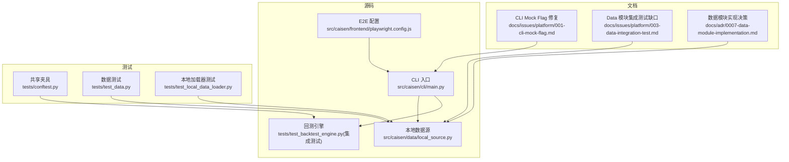
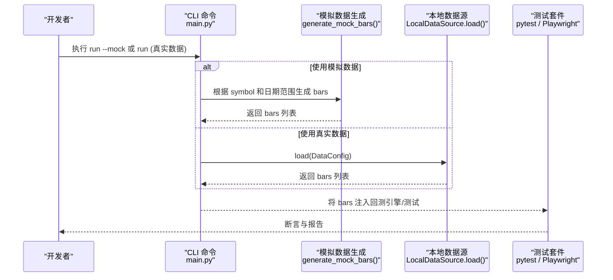
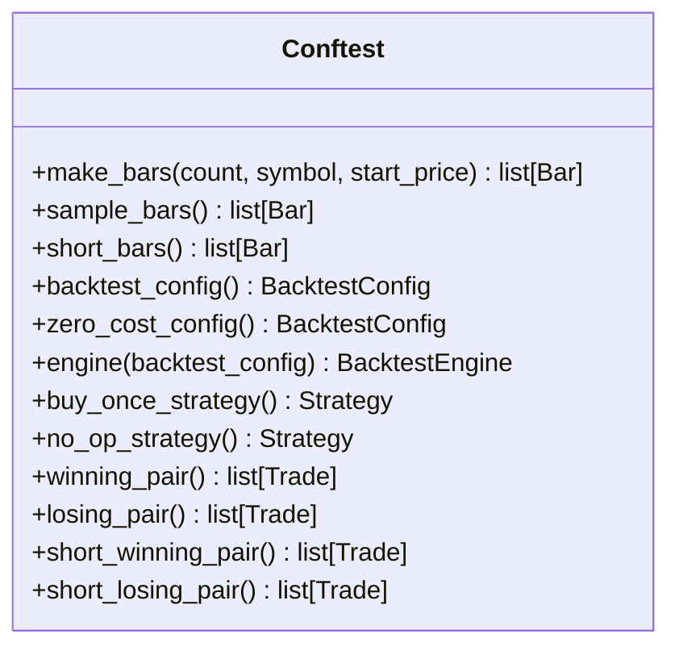
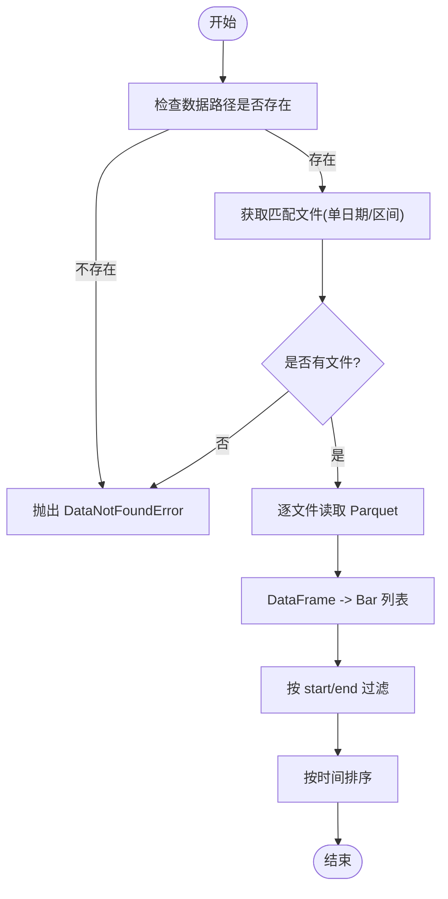
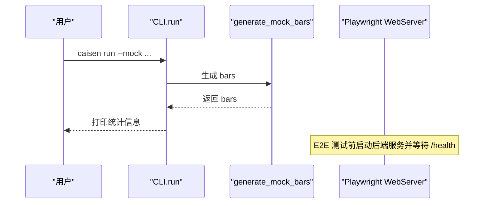
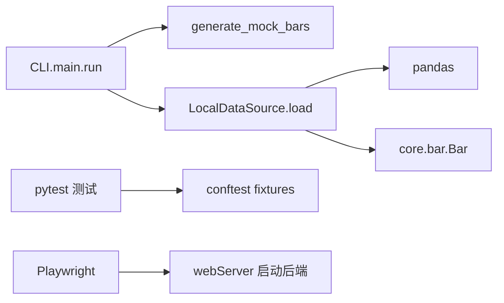

# 测试数据管理

<cite>
**本文引用的文件**   
- [README.md](file://README.md)
- [conftest.py](file://tests/conftest.py)
- [test_data.py](file://tests/test_data.py)
- [local_source.py](file://src/caisen/data/local_source.py)
- [main.py](file://src/caisen/cli/main.py)
- [playwright.config.js](file://src/caisen/frontend/playwright.config.js)
- [001-cli-mock-flag.md](file://docs/issues/platform/001-cli-mock-flag.md)
- [003-data-integration-test.md](file://docs/issues/platform/003-data-integration-test.md)
- [0007-data-module-implementation.md](file://docs/adr/0007-data-module-implementation.md)
- [test_backtest_engine.py](file://tests/test_backtest_engine.py)
- [test_local_data_loader.py](file://tests/test_local_data_loader.py)
</cite>

## 目录
1. [引言](#引言)
2. [项目结构](#项目结构)
3. [核心组件](#核心组件)
4. [架构总览](#架构总览)
5. [详细组件分析](#详细组件分析)
6. [依赖关系分析](#依赖关系分析)
7. [性能考量](#性能考量)
8. [故障排查指南](#故障排查指南)
9. [结论](#结论)
10. [附录](#附录)

## 引言
本指南围绕量化回测系统的“测试数据管理”展开，覆盖以下主题：
- 设计原则：数据代表性、数据量控制、版本管理
- 模拟数据生成：随机数据、历史回放、边界条件构造
- 测试夹具（Fixture）管理：初始化、清理、共享
- 环境隔离：数据库、文件系统、网络服务
- 数据验证：完整性、格式、业务规则
- 维护方法：更新策略、版本控制、迁移脚本
- 安全考虑：敏感数据脱敏、访问控制、审计

## 项目结构
仓库采用分层组织方式：
- src/caisen：核心代码（CLI、引擎、数据加载、策略、结果持久化、前端等）
- tests：Python 与前端测试用例
- docs：ADR 与问题记录
- examples：示例策略与脚本
- runs：回测输出产物

图表来源
- [main.py:1-371](file://src/caisen/cli/main.py#L1-L371)
- [local_source.py:1-199](file://src/caisen/data/local_source.py#L1-L199)
- [playwright.config.js:1-29](file://src/caisen/frontend/playwright.config.js#L1-L29)
- [conftest.py:1-233](file://tests/conftest.py#L1-L233)
- [test_data.py:1-74](file://tests/test_data.py#L1-L74)
- [test_local_data_loader.py:1-179](file://tests/test_local_data_loader.py#L1-L179)
- [001-cli-mock-flag.md:1-20](file://docs/issues/platform/001-cli-mock-flag.md#L1-L20)
- [003-data-integration-test.md:1-22](file://docs/issues/platform/003-data-integration-test.md#L1-L22)
- [0007-data-module-implementation.md:73-105](file://docs/adr/0007-data-module-implementation.md#L73-L105)

章节来源
- [README.md:1-396](file://README.md#L1-L396)

## 核心组件
- 共享夹具（tests/conftest.py）
  - 提供确定性 K 线生成、默认回测配置、简单策略与交易配对等，便于快速构造稳定可复现的测试场景。
- 本地数据源（src/caisen/data/local_source.py）
  - 从 Parquet 文件读取 OHLCV 数据，支持单日期与区间命名模式，校验列名并转换为 Bar 对象。
- CLI 与模拟数据（src/caisen/cli/main.py）
  - 提供 --mock 标志，按日期范围生成随机 K 线，用于无外部数据的快速验证。
- 前端 E2E 配置（src/caisen/frontend/playwright.config.js）
  - 启动后端服务并等待健康检查，确保端到端测试在隔离环境中运行。

章节来源
- [conftest.py:1-233](file://tests/conftest.py#L1-L233)
- [local_source.py:1-199](file://src/caisen/data/local_source.py#L1-L199)
- [main.py:1-371](file://src/caisen/cli/main.py#L1-L371)
- [playwright.config.js:1-29](file://src/caisen/frontend/playwright.config.js#L1-L29)

## 架构总览
下图展示“测试数据”在系统内的关键路径：CLI 选择模拟或真实数据；本地数据源负责读取与校验；测试夹具为单元测试提供确定性输入；E2E 通过独立进程启动服务进行隔离验证。

图表来源
- [main.py:35-61](file://src/caisen/cli/main.py#L35-L61)
- [main.py:149-176](file://src/caisen/cli/main.py#L149-L176)
- [local_source.py:39-80](file://src/caisen/data/local_source.py#L39-L80)

## 详细组件分析

### 测试夹具管理与数据共享（tests/conftest.py）
- 数据代表性
  - make_bars 生成递增型确定性 K 线，避免随机性导致的不稳定断言。
  - 提供 short_bars 用于快速回归测试。
- 数据量控制
  - 通过 count 参数灵活控制样本规模，兼顾速度与覆盖面。
- 数据版本管理
  - 固定起始时间与价格序列，保证跨版本可复现。
- 初始化与清理
  - 以 pytest fixture 形式声明，按需实例化，生命周期由框架管理。
- 共享机制
  - 所有测试可直接引用 sample_bars、engine、buy_once_strategy 等，减少重复代码。

图表来源
- [conftest.py:19-37](file://tests/conftest.py#L19-L37)
- [conftest.py:40-73](file://tests/conftest.py#L40-L73)
- [conftest.py:80-83](file://tests/conftest.py#L80-L83)
- [conftest.py:90-172](file://tests/conftest.py#L90-L172)
- [conftest.py:179-232](file://tests/conftest.py#L179-L232)

章节来源
- [conftest.py:1-233](file://tests/conftest.py#L1-L233)

### 本地数据源与数据验证（src/caisen/data/local_source.py）
- 数据代表性
  - 支持单日期与区间两种命名模式，兼容不同数据集组织方式。
- 数据量控制
  - 通过 start/end 过滤，仅加载所需时间窗口，降低 I/O 压力。
- 数据版本管理
  - 文件名即版本标识，便于回溯与对比。
- 数据验证
  - 列名映射支持中英文混写，缺失必填列抛出明确异常。
  - 时间戳自动转换，保障类型一致性。
- 错误处理
  - 未找到文件或路径不存在时抛出 DataNotFoundError，便于上层统一处理。

图表来源
- [local_source.py:39-80](file://src/caisen/data/local_source.py#L39-L80)
- [local_source.py:82-137](file://src/caisen/data/local_source.py#L82-L137)
- [local_source.py:139-199](file://src/caisen/data/local_source.py#L139-L199)

章节来源
- [local_source.py:1-199](file://src/caisen/data/local_source.py#L1-L199)

### CLI 模拟数据与端到端隔离（src/caisen/cli/main.py, playwright.config.js）
- 模拟数据生成
  - generate_mock_bars 基于随机波动生成连续价格序列，满足快速验证需求。
- 数据量控制
  - 根据 start/end 计算天数，生成对应数量的 bars。
- 环境隔离
  - Playwright 配置中启动独立后端服务并通过健康检查就绪，避免端口冲突与状态污染。

图表来源
- [main.py:35-61](file://src/caisen/cli/main.py#L35-L61)
- [main.py:149-176](file://src/caisen/cli/main.py#L149-L176)
- [playwright.config.js:24-28](file://src/caisen/frontend/playwright.config.js#L24-L28)

章节来源
- [main.py:1-371](file://src/caisen/cli/main.py#L1-L371)
- [playwright.config.js:1-29](file://src/caisen/frontend/playwright.config.js#L1-L29)

### 数据序列化与持久化（tests/test_data.py）
- 数据完整性检查
  - to_dict/from_dict 往返一致，字段值正确保留。
- 格式验证
  - Parquet 写入后读取，确认列与行数符合预期。
- 业务规则验证
  - 时间顺序严格递增，保证回测时序正确。

章节来源
- [test_data.py:1-74](file://tests/test_data.py#L1-L74)

### 本地加载器行为验证（tests/test_local_data_loader.py）
- 文件匹配逻辑
  - 单日期与区间文件均能正确筛选。
- 日期过滤
  - 指定 start/end 后仅返回目标窗口内数据。
- 中文列名支持
  - 中文列名映射到标准字段，成功构造 Bar。

章节来源
- [test_local_data_loader.py:1-179](file://tests/test_local_data_loader.py#L1-L179)

### 回测引擎集成验证（tests/test_backtest_engine.py）
- 订单执行与滑点
  - 买入成交价受滑点影响，体现成本模型。
- 净值曲线
  - 长度与 bars 一致，包含必要字段。
- 标注收集
  - 从 BarResult 聚合策略标注，支撑可视化。

章节来源
- [test_backtest_engine.py:1-245](file://tests/test_backtest_engine.py#L1-L245)

## 依赖关系分析
- CLI 依赖数据源与结果持久化，并在 --mock 分支下直接生成数据。
- 本地数据源依赖 pandas 与 Bar 模型，向上层暴露统一的 load 接口。
- 测试夹具为多类测试提供共享数据与策略，降低耦合度。
- E2E 配置通过 webServer 启动后端，形成进程级隔离。

图表来源
- [main.py:149-176](file://src/caisen/cli/main.py#L149-L176)
- [local_source.py:39-80](file://src/caisen/data/local_source.py#L39-L80)
- [conftest.py:19-37](file://tests/conftest.py#L19-L37)
- [playwright.config.js:24-28](file://src/caisen/frontend/playwright.config.js#L24-L28)

章节来源
- [main.py:1-371](file://src/caisen/cli/main.py#L1-L371)
- [local_source.py:1-199](file://src/caisen/data/local_source.py#L1-L199)
- [conftest.py:1-233](file://tests/conftest.py#L1-L233)
- [playwright.config.js:1-29](file://src/caisen/frontend/playwright.config.js#L1-L29)

## 性能考量
- 数据量控制
  - 使用短序列（如 short_bars）加速回归；对大数据集通过 start/end 裁剪窗口。
- I/O 优化
  - 优先使用区间文件减少文件数量；批量读取后一次性转换为 Bar。
- 内存占用
  - 避免在循环中频繁创建大对象；利用 DataFrame 向量化操作后再转对象。
- 并行与隔离
  - E2E 使用独立进程与端口，避免资源竞争；CI 环境下限制并发与重试次数。

## 故障排查指南
- 缺少数据文件
  - 现象：CLI 提示未找到数据并建议 --mock。
  - 处理：确认 data_dir/symbol/freq 路径与文件名模式；或使用 --mock 快速验证。
- 列名不匹配
  - 现象：抛出数据验证异常，提示缺失必填列。
  - 处理：检查列名映射表，确保包含 timestamp/open/high/low/close/volume 任一别名。
- 日期范围不重叠
  - 现象：返回空列表或抛出未找到异常。
  - 处理：核对 start/end 与文件名中的日期区间是否相交。
- E2E 服务不可用
  - 现象：浏览器无法连接或健康检查失败。
  - 处理：检查端口占用；确认 webServer 启动命令与健康 URL 配置。

章节来源
- [001-cli-mock-flag.md:1-20](file://docs/issues/platform/001-cli-mock-flag.md#L1-L20)
- [003-data-integration-test.md:1-22](file://docs/issues/platform/003-data-integration-test.md#L1-L22)
- [0007-data-module-implementation.md:73-105](file://docs/adr/0007-data-module-implementation.md#L73-L105)

## 结论
本项目在测试数据管理方面形成了清晰的分层与约定：
- 通过共享夹具提供稳定、可控、可复用的测试数据
- 本地数据源统一了数据读取与校验流程，支持多种命名与列名风格
- CLI 的 --mock 能力与 E2E 的进程隔离共同保障了开发与验证效率
- 结合文档化的问题与决策，持续完善数据模块的健壮性与可维护性

## 附录

### 设计原则清单
- 数据代表性
  - 覆盖趋势、震荡、跳空、低流动性等典型场景
  - 使用短序列与长序列组合，平衡速度与覆盖度
- 数据量控制
  - 通过 start/end 裁剪窗口；按频率与标的拆分存储
- 数据版本管理
  - 文件名即版本；变更需配套迁移脚本与回归用例

### 模拟数据生成方法
- 随机数据生成
  - 基于随机波动生成连续价格序列，适合冒烟与集成测试
- 历史数据回放
  - 使用真实 Parquet 文件，保持市场特征与极端行情
- 边界条件构造
  - 零成交量、极小价差、跳空缺口、超长横盘等

### 测试夹具管理要点
- 初始化
  - 使用 fixture 集中定义，避免分散构造
- 清理策略
  - 临时目录在测试结束后自动清理
- 数据共享
  - 通过 conftest 全局共享，减少重复代码

### 环境隔离策略
- 数据库隔离
  - 当前以文件为主，必要时使用临时目录与只读挂载
- 文件系统隔离
  - 每个测试使用独立临时目录，避免相互影响
- 网络服务模拟
  - E2E 通过 webServer 启动后端，配合健康检查确保就绪

### 数据验证规范
- 完整性检查
  - 必填字段非空、数值范围合理、时间单调递增
- 格式验证
  - 列名映射、时间戳类型、数值精度
- 业务规则验证
  - 订单执行、滑点与手续费、净值曲线一致性

### 维护方法与迁移
- 数据更新策略
  - 增量更新与全量快照并存；按日/周归档
- 版本控制
  - 文件名与元数据双轨管理；变更记录纳入版本库
- 迁移脚本
  - 提供列名对齐、时间戳标准化、分区重排等工具

### 安全考虑
- 敏感数据脱敏
  - 测试数据不包含真实账户与密钥；如需使用，应脱敏或替换为占位符
- 访问控制
  - 测试数据目录最小权限；CI 环境只读挂载
- 安全审计
  - 记录数据导入与导出日志；定期审查异常访问