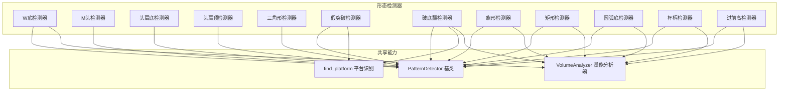
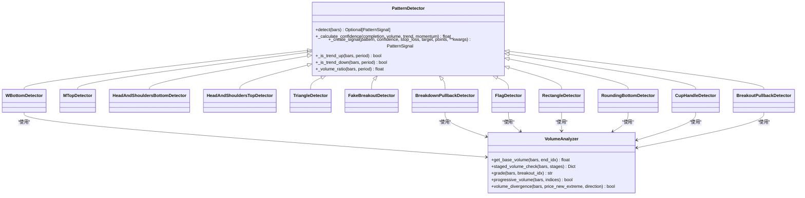
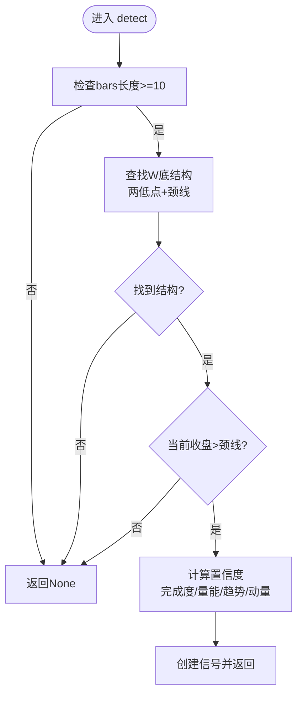
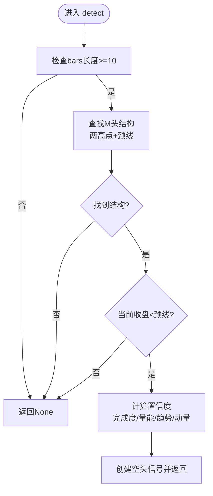
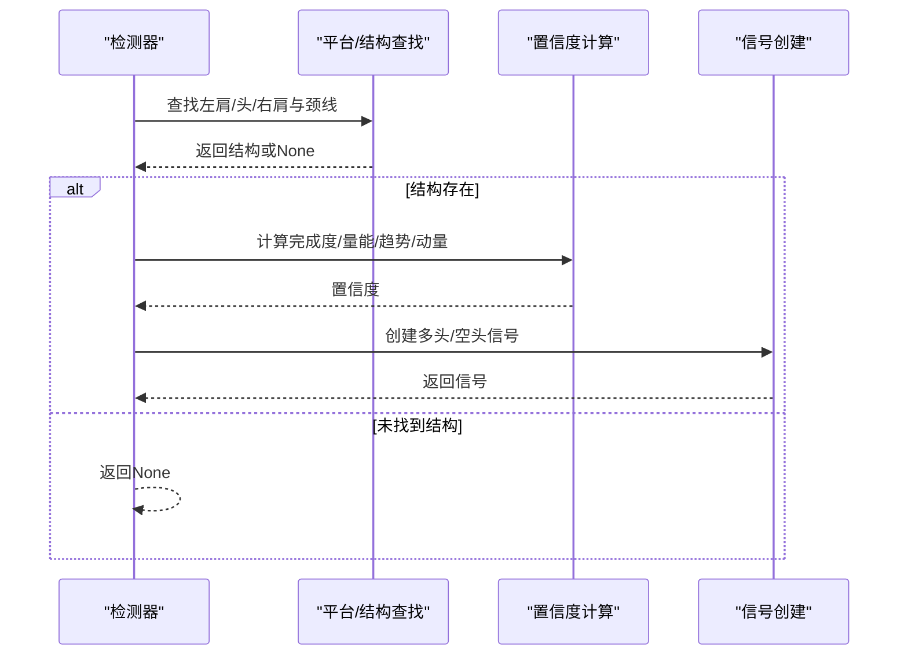
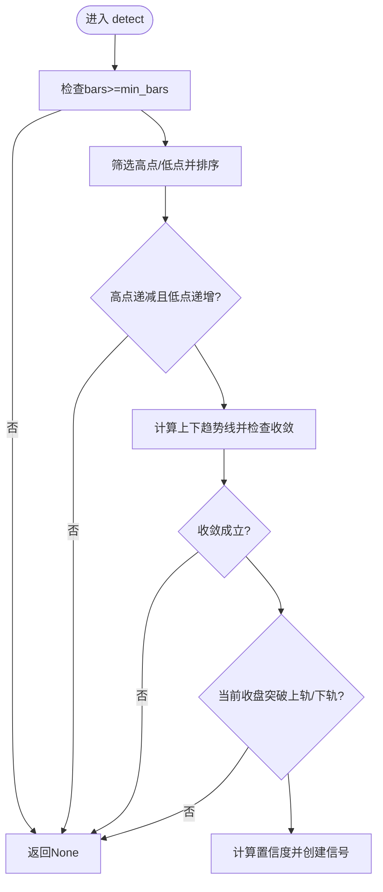
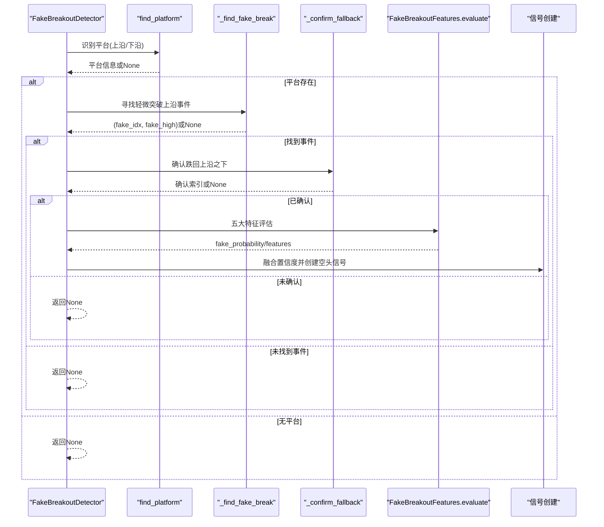
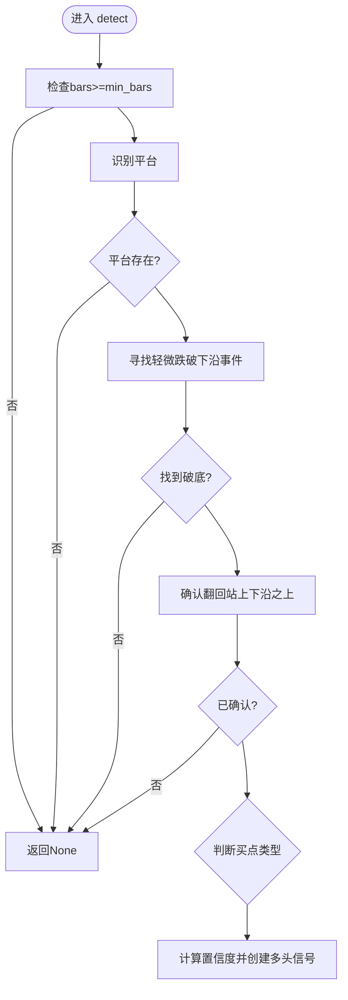
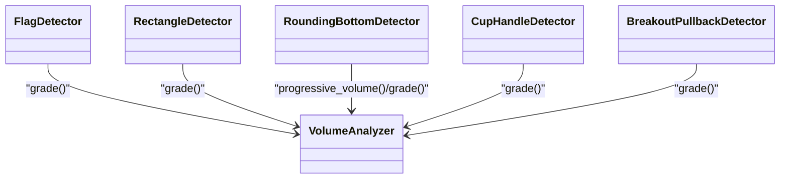
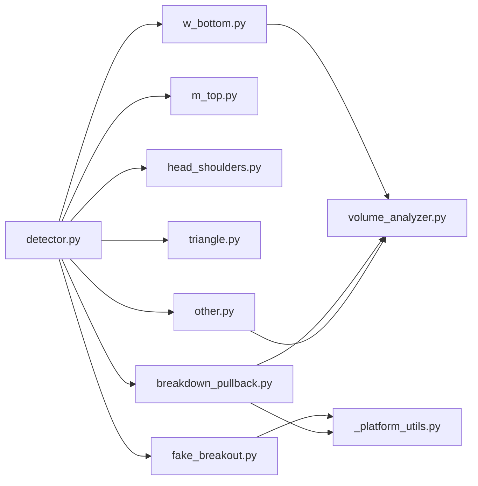

# 内置形态实现

<cite>
**本文引用的文件**   
- [detector.py](file://src/caisen/strategy/algorithm/detector.py)
- [w_bottom.py](file://src/caisen/strategy/algorithm/patterns/w_bottom.py)
- [m_top.py](file://src/caisen/strategy/algorithm/patterns/m_top.py)
- [head_shoulders.py](file://src/caisen/strategy/algorithm/patterns/head_shoulders.py)
- [triangle.py](file://src/caisen/strategy/algorithm/patterns/triangle.py)
- [fake_breakout.py](file://src/caisen/strategy/algorithm/patterns/fake_breakout.py)
- [breakdown_pullback.py](file://src/caisen/strategy/algorithm/patterns/breakdown_pullback.py)
- [_platform_utils.py](file://src/caisen/strategy/algorithm/patterns/_platform_utils.py)
- [other.py](file://src/caisen/strategy/algorithm/patterns/other.py)
- [volume_analyzer.py](file://src/caisen/strategy/algorithm/caisen_components/volume_analyzer.py)
</cite>

## 目录
1. [引言](#引言)
2. [项目结构](#项目结构)
3. [核心组件](#核心组件)
4. [架构总览](#架构总览)
5. [详细组件分析](#详细组件分析)
6. [依赖关系分析](#依赖关系分析)
7. [性能与优化](#性能与优化)
8. [故障排查指南](#故障排查指南)
9. [结论](#结论)
10. [附录：参数配置与回测示例](#附录参数配置与回测示例)

## 引言
本技术文档聚焦于“内置形态检测器”的实现，覆盖12种经典技术形态的识别算法、关键特征、置信度计算、参数配置与调优建议、组合策略与信号聚合机制、性能优化技巧与边界处理，并提供验证工具与回测示例指引。所有实现遵循纯函数接口设计，便于测试与回测。

## 项目结构
形态检测模块位于 strategy/algorithm/patterns 下，采用“基类 + 具体检测器”的分层组织方式；平台识别与量能分析作为共享能力被多个检测器复用。

图表来源
- [detector.py:1-244](file://src/caisen/strategy/algorithm/detector.py#L1-L244)
- [w_bottom.py:1-285](file://src/caisen/strategy/algorithm/patterns/w_bottom.py#L1-L285)
- [m_top.py:1-227](file://src/caisen/strategy/algorithm/patterns/m_top.py#L1-L227)
- [head_shoulders.py:1-323](file://src/caisen/strategy/algorithm/patterns/head_shoulders.py#L1-L323)
- [triangle.py:1-239](file://src/caisen/strategy/algorithm/patterns/triangle.py#L1-L239)
- [fake_breakout.py:1-511](file://src/caisen/strategy/algorithm/patterns/fake_breakout.py#L1-L511)
- [breakdown_pullback.py:1-259](file://src/caisen/strategy/algorithm/patterns/breakdown_pullback.py#L1-L259)
- [_platform_utils.py:1-74](file://src/caisen/strategy/algorithm/patterns/_platform_utils.py#L1-L74)
- [other.py:1-576](file://src/caisen/strategy/algorithm/patterns/other.py#L1-L576)
- [volume_analyzer.py:1-287](file://src/caisen/strategy/algorithm/caisen_components/volume_analyzer.py#L1-L287)

章节来源
- [detector.py:1-244](file://src/caisen/strategy/algorithm/detector.py#L1-L244)
- [volume_analyzer.py:1-287](file://src/caisen/strategy/algorithm/caisen_components/volume_analyzer.py#L1-L287)
- [_platform_utils.py:1-74](file://src/caisen/strategy/algorithm/patterns/_platform_utils.py#L1-L74)

## 核心组件
- 形态信号与置信度模型
  - PatternSignal：封装形态名称、置信度、止损/目标价、关键点与附加数据。
  - ConfidenceFactors：完成度、成交量、趋势共振、动量四因子加权求和得到综合置信度。
- 检测器基类 PatternDetector
  - 纯函数接口 detect(bars)，无内部状态，便于并行与回测。
  - 提供通用方法：趋势判断、量比计算、置信度合成、信号创建等。
- 量能分析器 VolumeAnalyzer
  - 分阶段量能评估（形成期缩量、突破放量、确认期持续或回踩缩量）。
  - 提供基础均量、阶段检查、等级划分、背离与递增检查等工具。
- 平台识别 find_platform
  - 在回看窗口内寻找振幅小且长度足够的整理区间，返回上下沿与起止索引。

章节来源
- [detector.py:18-180](file://src/caisen/strategy/algorithm/detector.py#L18-L180)
- [detector.py:125-244](file://src/caisen/strategy/algorithm/detector.py#L125-L244)
- [volume_analyzer.py:15-126](file://src/caisen/strategy/algorithm/caisen_components/volume_analyzer.py#L15-L126)
- [volume_analyzer.py:127-287](file://src/caisen/strategy/algorithm/caisen_components/volume_analyzer.py#L127-L287)
- [_platform_utils.py:12-74](file://src/caisen/strategy/algorithm/patterns/_platform_utils.py#L12-L74)

## 架构总览
下图展示检测器与共享能力的交互关系及数据流。

图表来源
- [detector.py:80-180](file://src/caisen/strategy/algorithm/detector.py#L80-L180)
- [w_bottom.py:11-48](file://src/caisen/strategy/algorithm/patterns/w_bottom.py#L11-L48)
- [m_top.py:11-48](file://src/caisen/strategy/algorithm/patterns/m_top.py#L11-L48)
- [head_shoulders.py:11-42](file://src/caisen/strategy/algorithm/patterns/head_shoulders.py#L11-L42)
- [triangle.py:11-38](file://src/caisen/strategy/algorithm/patterns/triangle.py#L11-L38)
- [fake_breakout.py:299-330](file://src/caisen/strategy/algorithm/patterns/fake_breakout.py#L299-L330)
- [breakdown_pullback.py:17-46](file://src/caisen/strategy/algorithm/patterns/breakdown_pullback.py#L17-L46)
- [other.py:11-31](file://src/caisen/strategy/algorithm/patterns/other.py#L11-L31)
- [volume_analyzer.py:15-33](file://src/caisen/strategy/algorithm/caisen_components/volume_analyzer.py#L15-L33)

## 详细组件分析

### W底检测器（WBottomDetector）
- 识别规则
  - 最近10根K线中找两个相近低点（±容差），其间高点为颈线；当前收盘价突破颈线即确认。
- 关键特征
  - 完成度：两低点对称性；成交量三阶段评分（形成期缩量、突破期放量、确认期）；趋势共振；突破力度。
- 置信度计算
  - completion = 1 - min(1, 两低点价差/容差)
  - volume：调用 staged_volume_check 对三阶段进行评分
  - trend：上升趋势加分
  - momentum：突破幅度归一化
- 参数与调优
  - tolerance：双底容差，越小越严格
  - min_neckline_height：颈线最小高度，过滤弱形态
  - stop_loss_factor/min_profit_pct：风控与目标
- 边界情况
  - bars不足10根直接返回None；两低点之间无K线则跳过。

图表来源
- [w_bottom.py:49-80](file://src/caisen/strategy/algorithm/patterns/w_bottom.py#L49-L80)
- [w_bottom.py:82-133](file://src/caisen/strategy/algorithm/patterns/w_bottom.py#L82-L133)
- [w_bottom.py:191-241](file://src/caisen/strategy/algorithm/patterns/w_bottom.py#L191-L241)
- [w_bottom.py:243-285](file://src/caisen/strategy/algorithm/patterns/w_bottom.py#L243-L285)

章节来源
- [w_bottom.py:1-285](file://src/caisen/strategy/algorithm/patterns/w_bottom.py#L1-L285)

### M头检测器（MTopDetector）
- 识别规则
  - 最近10根K线中找两个相近高点（±容差），其间低点为颈线；当前收盘价跌破颈线即确认。
- 关键特征
  - 完成度：两高点对称性；成交量放大；下降趋势共振；跌破力度。
- 置信度计算
  - completion = 1 - min(1, 两高点价差/容差)
  - volume：量比映射到0~1
  - trend：下降趋势加分
  - momentum：跌破幅度归一化
- 参数与调优
  - tolerance：双顶容差
  - min_neckline_depth：颈线最小深度
  - stop_loss_factor：止损高于最高点
  - min_profit_pct：最小盈利目标
- 边界情况
  - bars不足10根直接返回None；两高点之间无K线则跳过。

图表来源
- [m_top.py:49-78](file://src/caisen/strategy/algorithm/patterns/m_top.py#L49-L78)
- [m_top.py:80-126](file://src/caisen/strategy/algorithm/patterns/m_top.py#L80-L126)
- [m_top.py:179-226](file://src/caisen/strategy/algorithm/patterns/m_top.py#L179-L226)

章节来源
- [m_top.py:1-227](file://src/caisen/strategy/algorithm/patterns/m_top.py#L1-L227)

### 头肩顶/底检测器（HeadAndShouldersTopDetector / HeadAndShouldersBottomDetector）
- 识别规则
  - 头肩底：中间最低点为头，左右肩高度相近；突破颈线确认。
  - 头肩顶：中间最高点为头，左右肩高度相近；跌破颈线确认。
- 关键特征
  - 完成度：两肩对称性；成交量；趋势共振；突破/跌破力度。
- 置信度计算
  - completion：两肩价差/容差映射
  - volume：量比映射
  - trend：与方向一致的趋势加分
  - momentum：突破/跌破幅度归一化
- 参数与调优
  - shoulder_tolerance：两肩容差
  - shoulder_height_min/max：肩部相对头部的高度范围
  - stop_loss_factor/min_profit_pct：风控与目标
- 边界情况
  - bars不足12根直接返回None；中间区域为空则跳过。

图表来源
- [head_shoulders.py:43-91](file://src/caisen/strategy/algorithm/patterns/head_shoulders.py#L43-L91)
- [head_shoulders.py:137-170](file://src/caisen/strategy/algorithm/patterns/head_shoulders.py#L137-L170)
- [head_shoulders.py:199-247](file://src/caisen/strategy/algorithm/patterns/head_shoulders.py#L199-L247)
- [head_shoulders.py:293-322](file://src/caisen/strategy/algorithm/patterns/head_shoulders.py#L293-L322)

章节来源
- [head_shoulders.py:1-323](file://src/caisen/strategy/algorithm/patterns/head_shoulders.py#L1-L323)

### 三角形检测器（TriangleDetector）
- 识别规则
  - 至少3个递减高点与3个递增低点，两趋势线收敛；向上突破上轨做多，向下跌破下轨做空。
- 关键特征
  - 完成度：振幅收窄程度；成交量；趋势共振；突破力度。
- 置信度计算
  - completion：振幅/均价映射
  - volume：量比映射
  - trend：与突破方向一致的趋势加分
  - momentum：突破幅度归一化
- 参数与调优
  - min_bars/min_highs/min_lows：形态最小样本要求
  - stop_loss_factor/min_profit_pct：风控与目标
- 边界情况
  - 高点/低点数量不足或单调性不满足时跳过；斜率条件不满足则跳过。

图表来源
- [triangle.py:39-72](file://src/caisen/strategy/algorithm/patterns/triangle.py#L39-L72)
- [triangle.py:74-143](file://src/caisen/strategy/algorithm/patterns/triangle.py#L74-L143)
- [triangle.py:195-238](file://src/caisen/strategy/algorithm/patterns/triangle.py#L195-L238)

章节来源
- [triangle.py:1-239](file://src/caisen/strategy/algorithm/patterns/triangle.py#L1-L239)

### 假突破检测器（FakeBreakoutDetector）
- 识别规则
  - 识别整理平台；在平台结束后寻找轻微突破上沿的事件；随后快速跌回上沿之下；结合五大特征深度评估。
- 五大特征
  - 突破量能不足、快速回返颈线、回到形态内部、跳空缺口未填补、量价背离。
- 置信度计算
  - 四因子（完成度、量能、趋势、动量）+ 五大特征加权概率加成。
- 参数与调优
  - lookback_period/max_amplitude/min_platform_bars：平台识别
  - max_fallback_bars/fake_tolerance：假突破判定窗口与容忍度
  - stop_loss_factor/min_profit_pct：风控与目标
- 边界情况
  - 平台不存在、假突破事件缺失、未在窗口内跌回则跳过。

图表来源
- [fake_breakout.py:331-424](file://src/caisen/strategy/algorithm/patterns/fake_breakout.py#L331-L424)
- [fake_breakout.py:426-470](file://src/caisen/strategy/algorithm/patterns/fake_breakout.py#L426-L470)
- [fake_breakout.py:18-296](file://src/caisen/strategy/algorithm/patterns/fake_breakout.py#L18-L296)
- [_platform_utils.py:12-74](file://src/caisen/strategy/algorithm/patterns/_platform_utils.py#L12-L74)

章节来源
- [fake_breakout.py:1-511](file://src/caisen/strategy/algorithm/patterns/fake_breakout.py#L1-L511)
- [_platform_utils.py:1-74](file://src/caisen/strategy/algorithm/patterns/_platform_utils.py#L1-L74)

### 破底翻检测器（BreakdownPullbackDetector）
- 识别规则
  - 识别整理平台；在平台结束后寻找轻微跌破下沿的事件；随后快速站回下沿之上；区分第一买点（站回颈线）与第二买点（突破平台上沿）。
- 关键特征
  - 完成度：破底深度浅、翻回快；分阶段量能（拉回缩量、突破放量）；前期下跌趋势共振；翻回力度。
- 置信度计算
  - 四因子加权；第二买点完成度额外加分。
- 参数与调优
  - lookback_period/max_amplitude/min_platform_bars：平台识别
  - max_pullback_bars/breakdown_tolerance：破底翻判定窗口与容忍度
  - stop_loss_factor/min_profit_pct：风控与目标
- 边界情况
  - 平台不存在、破底事件缺失、未在窗口内翻回则跳过。

图表来源
- [breakdown_pullback.py:47-128](file://src/caisen/strategy/algorithm/patterns/breakdown_pullback.py#L47-L128)
- [breakdown_pullback.py:130-175](file://src/caisen/strategy/algorithm/patterns/breakdown_pullback.py#L130-L175)
- [breakdown_pullback.py:177-259](file://src/caisen/strategy/algorithm/patterns/breakdown_pullback.py#L177-L259)
- [_platform_utils.py:12-74](file://src/caisen/strategy/algorithm/patterns/_platform_utils.py#L12-L74)

章节来源
- [breakdown_pullback.py:1-259](file://src/caisen/strategy/algorithm/patterns/breakdown_pullback.py#L1-L259)
- [_platform_utils.py:1-74](file://src/caisen/strategy/algorithm/patterns/_platform_utils.py#L1-L74)

### 其他形态检测器（Flag/Rectangle/RoundingBottom/CupHandle/BreakoutPullback）
- 旗形（FlagDetector）
  - 识别近期大幅波动（旗杆）后窄幅整理（旗面），突破旗面上沿做多、跌破下沿做空。
  - 量能等级影响置信度。
- 矩形（RectangleDetector）
  - 水平区间内波动，突破上沿做多、跌破下沿做空；振幅阈值过滤非矩形。
- 圆弧底（RoundingBottomDetector）
  - 缓慢筑底后上涨，突破左侧高点颈线做多；后半段量能递增增强信号。
- 杯柄（CupHandleDetector）
  - 杯身圆弧形上涨，柄部短暂回调，突破柄部高点做多；量能等级影响置信度。
- 过前高（BreakoutPullbackDetector in other.py）
  - 突破历史高点后回调再涨；量能等级影响置信度。

图表来源
- [other.py:11-179](file://src/caisen/strategy/algorithm/patterns/other.py#L11-L179)
- [other.py:182-291](file://src/caisen/strategy/algorithm/patterns/other.py#L182-L291)
- [other.py:293-401](file://src/caisen/strategy/algorithm/patterns/other.py#L293-L401)
- [other.py:403-507](file://src/caisen/strategy/algorithm/patterns/other.py#L403-L507)
- [other.py:509-576](file://src/caisen/strategy/algorithm/patterns/other.py#L509-L576)
- [volume_analyzer.py:127-156](file://src/caisen/strategy/algorithm/caisen_components/volume_analyzer.py#L127-L156)
- [volume_analyzer.py:197-224](file://src/caisen/strategy/algorithm/caisen_components/volume_analyzer.py#L197-L224)

章节来源
- [other.py:1-576](file://src/caisen/strategy/algorithm/patterns/other.py#L1-L576)
- [volume_analyzer.py:127-224](file://src/caisen/strategy/algorithm/caisen_components/volume_analyzer.py#L127-L224)

## 依赖关系分析
- 耦合与内聚
  - 各检测器仅依赖基类提供的通用方法与共享能力（量能分析、平台识别），内聚良好。
- 外部依赖
  - VolumeAnalyzer 提供量化化的量能评估；find_platform 提供平台识别。
- 潜在循环依赖
  - 通过模块分层避免循环：patterns 依赖 caisen_components 与 _platform_utils，后者不反向依赖 patterns。

图表来源
- [detector.py:80-180](file://src/caisen/strategy/algorithm/detector.py#L80-L180)
- [w_bottom.py:11-48](file://src/caisen/strategy/algorithm/patterns/w_bottom.py#L11-L48)
- [m_top.py:11-48](file://src/caisen/strategy/algorithm/patterns/m_top.py#L11-L48)
- [head_shoulders.py:11-42](file://src/caisen/strategy/algorithm/patterns/head_shoulders.py#L11-L42)
- [triangle.py:11-38](file://src/caisen/strategy/algorithm/patterns/triangle.py#L11-L38)
- [fake_breakout.py:299-330](file://src/caisen/strategy/algorithm/patterns/fake_breakout.py#L299-L330)
- [breakdown_pullback.py:17-46](file://src/caisen/strategy/algorithm/patterns/breakdown_pullback.py#L17-L46)
- [other.py:11-31](file://src/caisen/strategy/algorithm/patterns/other.py#L11-L31)
- [_platform_utils.py:12-74](file://src/caisen/strategy/algorithm/patterns/_platform_utils.py#L12-L74)
- [volume_analyzer.py:15-33](file://src/caisen/strategy/algorithm/caisen_components/volume_analyzer.py#L15-L33)

章节来源
- [detector.py:80-180](file://src/caisen/strategy/algorithm/detector.py#L80-L180)
- [volume_analyzer.py:15-33](file://src/caisen/strategy/algorithm/caisen_components/volume_analyzer.py#L15-L33)
- [_platform_utils.py:12-74](file://src/caisen/strategy/algorithm/patterns/_platform_utils.py#L12-L74)

## 性能与优化
- 时间复杂度
  - 多数检测器在固定窗口（如10~30根）内扫描，近似O(n)线性；平台识别使用滑动窗口，最坏O(n^2)但受限于lookback_period。
- 空间复杂度
  - 主要存储最近K线切片与少量中间变量，内存占用低。
- 优化建议
  - 预取最近N根K线，避免重复切片；
  - 对平台识别可引入更高效的区间选择策略（如单调栈）；
  - 将量能计算缓存至最近窗口，减少重复平均计算；
  - 对高频场景，优先运行轻量级检测器（如矩形、旗形），复杂形态（头肩、三角）按需触发。

## 故障排查指南
- 常见问题
  - K线数量不足：检测器直接返回None，需确保输入bars长度满足最小要求。
  - 平台识别失败：振幅过大或长度不足导致找不到平台，调整max_amplitude与min_platform_bars。
  - 量能异常：若基础均量为0或数据缺失，量能分析会降级为默认评分，检查数据源质量。
  - 假突破未确认：需在max_fallback_bars窗口内跌回上沿之下，否则不会生成信号。
- 定位步骤
  - 打印检测器返回的points与data字段，核对关键点与辅助信息；
  - 检查confidence_factors各维度得分，定位薄弱环节（如量能不足或趋势不共振）；
  - 逐步放宽参数（如容差、容忍度）观察信号变化，验证逻辑合理性。

章节来源
- [detector.py:182-244](file://src/caisen/strategy/algorithm/detector.py#L182-L244)
- [volume_analyzer.py:34-54](file://src/caisen/strategy/algorithm/caisen_components/volume_analyzer.py#L34-L54)
- [fake_breakout.py:426-470](file://src/caisen/strategy/algorithm/patterns/fake_breakout.py#L426-L470)
- [breakdown_pullback.py:130-175](file://src/caisen/strategy/algorithm/patterns/breakdown_pullback.py#L130-L175)

## 结论
内置形态检测器以纯函数接口为核心，围绕“完成度、量能、趋势、动量”四因子构建置信度体系，并通过量能分析与平台识别提升信号稳健性。各形态参数可调、边界清晰，适合在回测与实盘中组合使用。

## 附录：参数配置与回测示例
- 参数配置要点
  - 通用：stop_loss_factor、min_profit_pct控制风控与目标；
  - 形态特定：tolerance、min_neckline_height/depth、shoulder_tolerance/height_range、min_bars/min_highs/min_lows、lookback_period/max_amplitude/min_platform_bars、max_fallback_bars/max_pullback_bars、fake_tolerance/breakdown_tolerance；
  - 量能：base_period、breakout_multiplier。
- 组合策略与信号聚合
  - 多检测器并行扫描同一bars序列，汇总所有有效信号；
  - 按confidence降序输出，并结合方向（long/short）与止损/目标进行仓位管理；
  - 可对同标的不同形态信号进行去重与冲突消解（例如同时出现长多与短空的信号，依据置信度与趋势共振取舍）。
- 验证工具与回测示例
  - 使用 detector.detect(bars) 获取信号，校验points与data字段；
  - 在回测引擎中遍历bars，累积信号并执行交易逻辑，统计胜率、盈亏比与回撤；
  - 针对平台型形态（假突破、破底翻），重点验证平台识别与确认窗口的稳定性。

章节来源
- [detector.py:18-180](file://src/caisen/strategy/algorithm/detector.py#L18-L180)
- [volume_analyzer.py:24-33](file://src/caisen/strategy/algorithm/caisen_components/volume_analyzer.py#L24-L33)
- [w_bottom.py:28-48](file://src/caisen/strategy/algorithm/patterns/w_bottom.py#L28-L48)
- [m_top.py:28-48](file://src/caisen/strategy/algorithm/patterns/m_top.py#L28-L48)
- [head_shoulders.py:28-42](file://src/caisen/strategy/algorithm/patterns/head_shoulders.py#L28-L42)
- [triangle.py:24-38](file://src/caisen/strategy/algorithm/patterns/triangle.py#L24-L38)
- [fake_breakout.py:309-330](file://src/caisen/strategy/algorithm/patterns/fake_breakout.py#L309-L330)
- [breakdown_pullback.py:26-46](file://src/caisen/strategy/algorithm/patterns/breakdown_pullback.py#L26-L46)
- [other.py:19-31](file://src/caisen/strategy/algorithm/patterns/other.py#L19-L31)