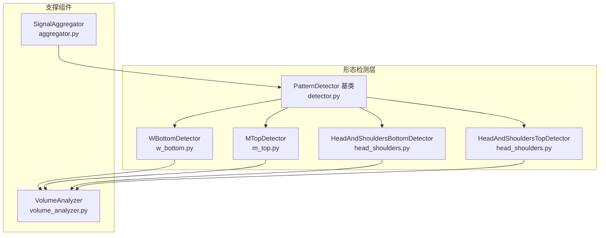
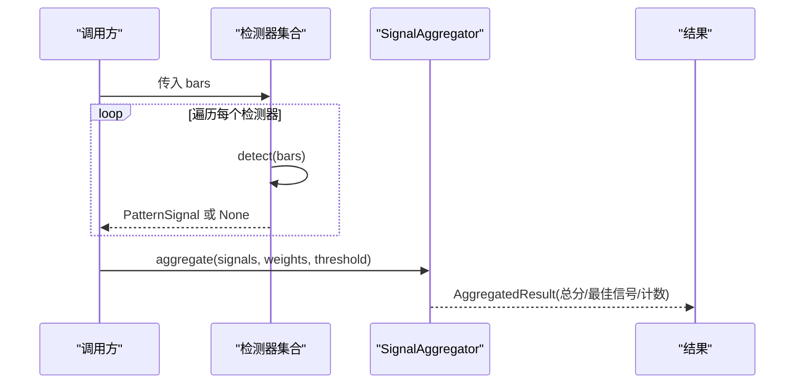
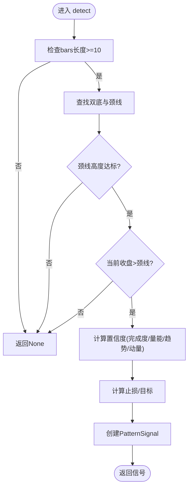
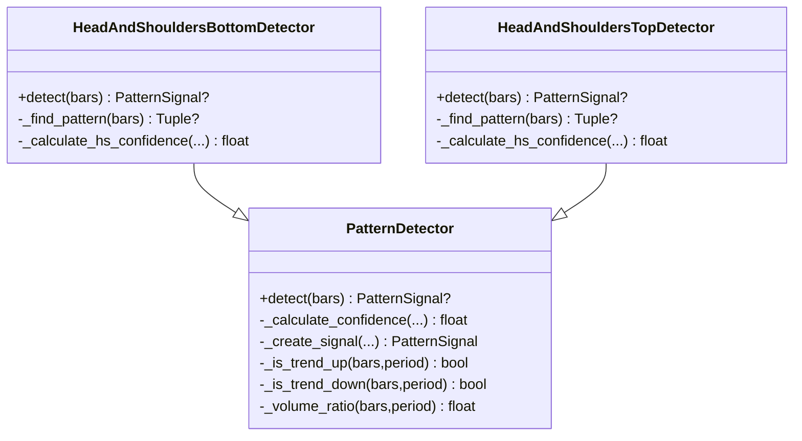
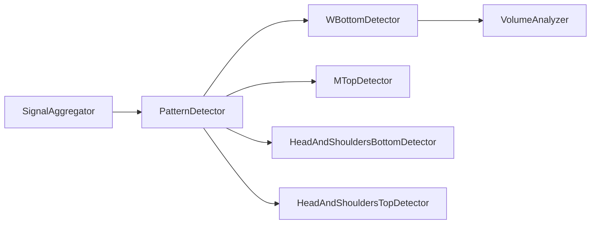
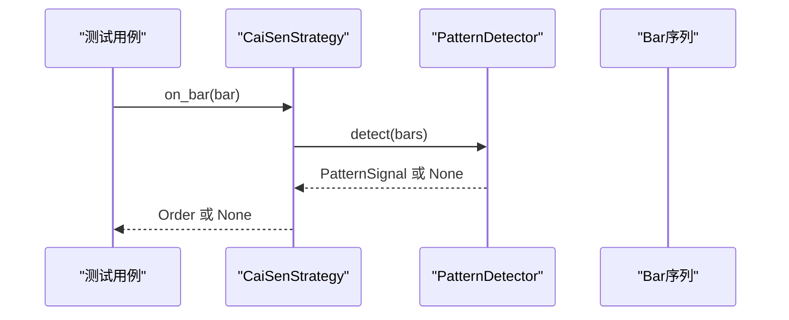

# 反转形态检测器

<cite>
**本文引用的文件**
- [src/caisen/strategy/algorithm/detector.py](file://src/caisen/strategy/algorithm/detector.py)
- [src/caisen/strategy/algorithm/patterns/w_bottom.py](file://src/caisen/strategy/algorithm/patterns/w_bottom.py)
- [src/caisen/strategy/algorithm/patterns/m_top.py](file://src/caisen/strategy/algorithm/patterns/m_top.py)
- [src/caisen/strategy/algorithm/patterns/head_shoulders.py](file://src/caisen/strategy/algorithm/patterns/head_shoulders.py)
- [src/caisen/strategy/algorithm/caisen_components/volume_analyzer.py](file://src/caisen/strategy/algorithm/caisen_components/volume_analyzer.py)
- [src/caisen/strategy/algorithm/caisen_components/aggregator.py](file://src/caisen/strategy/algorithm/caisen_components/aggregator.py)
- [src/caisen/strategy/algorithm/patterns/__init__.py](file://src/caisen/strategy/algorithm/patterns/__init__.py)
- [tests/test_cai_sen.py](file://tests/test_cai_sen.py)
- [tests/test_breakdown_pullback.py](file://tests/test_breakdown_pullback.py)
- [README.md](file://README.md)
</cite>

## 目录
1. [简介](#简介)
2. [项目结构](#项目结构)
3. [核心组件](#核心组件)
4. [架构总览](#架构总览)
5. [详细组件分析](#详细组件分析)
6. [依赖关系分析](#依赖关系分析)
7. [性能与复杂度](#性能与复杂度)
8. [参数调优与置信度模型](#参数调优与置信度模型)
9. [验证工具与回测示例](#验证工具与回测示例)
10. [常见问题与陷阱](#常见问题与陷阱)
11. [结论](#结论)

## 简介
本技术文档聚焦于“反转形态检测器”，系统性地解析 W底、M头、头肩顶/底等经典反转形态的识别算法实现，包括：
- 关键特征点识别规则（低点/高点、颈线）
- 突破/跌破确认条件
- 置信度评分机制（四因子加权）
- 参数调优策略
- 形态验证工具与回测示例
- 最佳实践与常见陷阱处理

该模块采用纯函数接口设计，检测器无内部状态，便于并行测试与回测。

## 项目结构
与反转形态相关的代码主要位于 strategy/algorithm 子包下：
- detector.py：定义 PatternDetector 基类、PatternSignal 信号结构与置信度计算框架
- patterns/*：各形态检测器实现（W底、M头、头肩顶/底等）
- caisen_components/volume_analyzer.py：分阶段量能评估
- caisen_components/aggregator.py：多检测器信号聚合与综合评分

图表来源
- [src/caisen/strategy/algorithm/detector.py:80-180](file://src/caisen/strategy/algorithm/detector.py#L80-L180)
- [src/caisen/strategy/algorithm/patterns/w_bottom.py:11-80](file://src/caisen/strategy/algorithm/patterns/w_bottom.py#L11-L80)
- [src/caisen/strategy/algorithm/patterns/m_top.py:11-78](file://src/caisen/strategy/algorithm/patterns/m_top.py#L11-L78)
- [src/caisen/strategy/algorithm/patterns/head_shoulders.py:11-92](file://src/caisen/strategy/algorithm/patterns/head_shoulders.py#L11-L92)
- [src/caisen/strategy/algorithm/patterns/head_shoulders.py:173-247](file://src/caisen/strategy/algorithm/patterns/head_shoulders.py#L173-L247)
- [src/caisen/strategy/algorithm/caisen_components/volume_analyzer.py:15-126](file://src/caisen/strategy/algorithm/caisen_components/volume_analyzer.py#L15-L126)
- [src/caisen/strategy/algorithm/caisen_components/aggregator.py:42-136](file://src/caisen/strategy/algorithm/caisen_components/aggregator.py#L42-L136)

章节来源
- [src/caisen/strategy/algorithm/patterns/__init__.py:1-27](file://src/caisen/strategy/algorithm/patterns/__init__.py#L1-L27)
- [README.md:1-120](file://README.md#L1-L120)

## 核心组件
- PatternDetector 基类
  - 提供 detect(bars) 纯函数接口
  - 内置趋势判断、量比计算、置信度加权求和、信号创建等通用方法
- PatternSignal 数据类
  - 包含 pattern、confidence、stop_loss、target、points、data 等字段
  - is_valid 属性用于快速校验信号有效性
- ConfidenceFactors 数据类
  - completion、volume、trend、momentum 四因子
  - weighted_sum 支持可配置权重
- VolumeAnalyzer
  - 分阶段量能检查（形成期缩量、突破期放量、确认期递增/持续）
  - 量价背离检测、关键点量能递增检查
- SignalAggregator
  - 对多个检测器输出进行过滤、加权、选择最佳信号

章节来源
- [src/caisen/strategy/algorithm/detector.py:18-78](file://src/caisen/strategy/algorithm/detector.py#L18-L78)
- [src/caisen/strategy/algorithm/detector.py:80-180](file://src/caisen/strategy/algorithm/detector.py#L80-L180)
- [src/caisen/strategy/algorithm/caisen_components/volume_analyzer.py:15-126](file://src/caisen/strategy/algorithm/caisen_components/volume_analyzer.py#L15-L126)
- [src/caisen/strategy/algorithm/caisen_components/aggregator.py:42-136](file://src/caisen/strategy/algorithm/caisen_components/aggregator.py#L42-L136)

## 架构总览
整体流程：
- 输入：K线序列 bars
- 检测：各形态检测器独立运行 detect(bars)，返回 PatternSignal 或 None
- 聚合：SignalAggregator 汇总有效信号，按权重计算总分并选出最佳信号
- 输出：交易决策所需的关键信息（方向、止损、目标、置信度、关键点）

图表来源
- [src/caisen/strategy/algorithm/caisen_components/aggregator.py:59-136](file://src/caisen/strategy/algorithm/caisen_components/aggregator.py#L59-L136)
- [src/caisen/strategy/algorithm/detector.py:112-123](file://src/caisen/strategy/algorithm/detector.py#L112-L123)

## 详细组件分析

### W底检测器（WBottomDetector）
- 关键特征点识别
  - 在近期窗口内寻找两个相近低点（容差 tolerance），两低点之间的高点作为颈线
  - 颈线高度需满足最小要求（min_neckline_height）
- 突破确认条件
  - 当前收盘价高于颈线即视为突破
- 置信度评分
  - 完成度：两低点越接近越好
  - 成交量：三阶段量能评分（形成期缩量、突破期放量、确认期）
  - 趋势：上升趋势增强信号
  - 动量：突破力度（相对颈线的涨幅）
- 止损与目标
  - 止损 = min(左底,右底) × stop_loss_factor
  - 目标 = max(颈线 + 振幅, 当前收盘 × (1+min_profit_pct))

图表来源
- [src/caisen/strategy/algorithm/patterns/w_bottom.py:49-80](file://src/caisen/strategy/algorithm/patterns/w_bottom.py#L49-L80)
- [src/caisen/strategy/algorithm/patterns/w_bottom.py:82-133](file://src/caisen/strategy/algorithm/patterns/w_bottom.py#L82-L133)
- [src/caisen/strategy/algorithm/patterns/w_bottom.py:135-189](file://src/caisen/strategy/algorithm/patterns/w_bottom.py#L135-L189)
- [src/caisen/strategy/algorithm/patterns/w_bottom.py:191-284](file://src/caisen/strategy/algorithm/patterns/w_bottom.py#L191-L284)

章节来源
- [src/caisen/strategy/algorithm/patterns/w_bottom.py:11-284](file://src/caisen/strategy/algorithm/patterns/w_bottom.py#L11-L284)

### M头检测器（MTopDetector）
- 关键特征点识别
  - 在近期窗口内寻找两个相近高点（容差 tolerance），两高点之间的低点作为颈线
  - 颈线深度需满足最小要求（min_neckline_depth）
- 跌破确认条件
  - 当前收盘价低于颈线即视为跌破
- 置信度评分
  - 完成度：两高点越接近越好
  - 成交量：跌破时放量增加置信度
  - 趋势：下降趋势增强信号
  - 动量：跌破力度（相对颈线的跌幅）
- 止损与目标
  - 止损 = max(左顶,右顶) × stop_loss_factor
  - 目标 = 颈线 - 振幅

图表来源
- [src/caisen/strategy/algorithm/patterns/m_top.py:49-78](file://src/caisen/strategy/algorithm/patterns/m_top.py#L49-L78)
- [src/caisen/strategy/algorithm/patterns/m_top.py:80-126](file://src/caisen/strategy/algorithm/patterns/m_top.py#L80-L126)
- [src/caisen/strategy/algorithm/patterns/m_top.py:128-177](file://src/caisen/strategy/algorithm/patterns/m_top.py#L128-L177)
- [src/caisen/strategy/algorithm/patterns/m_top.py:179-226](file://src/caisen/strategy/algorithm/patterns/m_top.py#L179-L226)

章节来源
- [src/caisen/strategy/algorithm/patterns/m_top.py:11-226](file://src/caisen/strategy/algorithm/patterns/m_top.py#L11-L226)

### 头肩顶/底检测器（HeadAndShouldersTop/BottomDetector）
- 关键特征点识别
  - 头部为中间区域的极值（底部为最低点，顶部为最高点）
  - 左右肩高度相近（容差 shoulder_tolerance），且满足肩部高度范围约束
  - 颈线由左右肩之间的高点（头肩底）或低点（头肩顶）确定
- 突破/跌破确认条件
  - 头肩底：当前收盘 > 颈线
  - 头肩顶：当前收盘 < 颈线
- 置信度评分
  - 完成度：左右肩对称性
  - 成交量：突破/跌破时的放量程度
  - 趋势：与预期方向一致的趋势增强信号
  - 动量：突破/跌破的力度
- 止损与目标
  - 头肩底：止损 = head.low × stop_loss_factor；目标 = neckline + 振幅（或基于最小盈利百分比）
  - 头肩顶：止损 = head.high × stop_loss_factor；目标 = neckline - 振幅

图表来源
- [src/caisen/strategy/algorithm/patterns/head_shoulders.py:11-92](file://src/caisen/strategy/algorithm/patterns/head_shoulders.py#L11-L92)
- [src/caisen/strategy/algorithm/patterns/head_shoulders.py:173-247](file://src/caisen/strategy/algorithm/patterns/head_shoulders.py#L173-L247)
- [src/caisen/strategy/algorithm/detector.py:80-180](file://src/caisen/strategy/algorithm/detector.py#L80-L180)

章节来源
- [src/caisen/strategy/algorithm/patterns/head_shoulders.py:11-323](file://src/caisen/strategy/algorithm/patterns/head_shoulders.py#L11-L323)

### 量能分析器（VolumeAnalyzer）
- 分阶段量能检查
  - formation（形成期）：应缩量
  - breakout（突破期）：应放量（≥breakout_multiplier倍基础均量）
  - confirm（确认期）：持续放量或递增
- 等级评估
  - grade：根据突破时量能与基础均量的比值分为 weak/normal/strong
- 量价背离
  - volume_divergence：价格创新高但量能未跟上（顶背离），或价格创新低但量能未跟上（底背离）
- 关键点量能递增
  - progressive_volume：检查若干关键点的量能是否逐步增大

章节来源
- [src/caisen/strategy/algorithm/caisen_components/volume_analyzer.py:15-126](file://src/caisen/strategy/algorithm/caisen_components/volume_analyzer.py#L15-L126)
- [src/caisen/strategy/algorithm/caisen_components/volume_analyzer.py:127-224](file://src/caisen/strategy/algorithm/caisen_components/volume_analyzer.py#L127-L224)
- [src/caisen/strategy/algorithm/caisen_components/volume_analyzer.py:225-287](file://src/caisen/strategy/algorithm/caisen_components/volume_analyzer.py#L225-L287)

### 信号聚合器（SignalAggregator）
- 过滤无效信号与低于阈值的信号
- 按 pattern 名称应用权重，计算加权总分
- 选择置信度最高的信号作为最佳信号
- 提供便捷方法 aggregate_with_detection 一步完成检测+聚合

章节来源
- [src/caisen/strategy/algorithm/caisen_components/aggregator.py:42-136](file://src/caisen/strategy/algorithm/caisen_components/aggregator.py#L42-L136)

## 依赖关系分析
- 检测器均继承自 PatternDetector，复用趋势判断、量比计算、置信度加权等方法
- W底使用 VolumeAnalyzer 进行三阶段量能评分；其他检测器也可通过基类的 _volume_ratio 进行简单量比评估
- 聚合器不依赖具体形态，仅依赖 PatternSignal 与权重配置

图表来源
- [src/caisen/strategy/algorithm/detector.py:80-180](file://src/caisen/strategy/algorithm/detector.py#L80-L180)
- [src/caisen/strategy/algorithm/patterns/w_bottom.py:11-80](file://src/caisen/strategy/algorithm/patterns/w_bottom.py#L11-L80)
- [src/caisen/strategy/algorithm/patterns/m_top.py:11-78](file://src/caisen/strategy/algorithm/patterns/m_top.py#L11-L78)
- [src/caisen/strategy/algorithm/patterns/head_shoulders.py:11-92](file://src/caisen/strategy/algorithm/patterns/head_shoulders.py#L11-L92)
- [src/caisen/strategy/algorithm/caisen_components/aggregator.py:42-136](file://src/caisen/strategy/algorithm/caisen_components/aggregator.py#L42-L136)

章节来源
- [src/caisen/strategy/algorithm/patterns/__init__.py:1-27](file://src/caisen/strategy/algorithm/patterns/__init__.py#L1-L27)

## 性能与复杂度
- 时间复杂度
  - 各检测器在固定窗口（如最近10~12根K线）内进行扫描，属于 O(n) 线性扫描（n为窗口大小，常数级）
  - 置信度计算涉及趋势判断与量比计算，均为 O(k)（k为周期，如20）
- 空间复杂度
  - 仅维护少量局部变量与切片，O(1) 额外空间
- 优化建议
  - 对于高频场景，可缓存最近周期的均值与极值，避免重复计算
  - 将 VolumeAnalyzer 的阶段划分与指标预计算纳入流水线，减少重复遍历

[本节为通用性能讨论，无需特定文件引用]

## 参数调优与置信度模型
- 四因子置信度模型
  - completion（完成度）权重默认 0.4
  - volume（成交量）权重默认 0.3
  - trend（趋势共振）权重默认 0.2
  - momentum（动量）权重默认 0.1
  - 可通过配置覆盖默认权重
- 形态参数调优要点
  - W底/M头：tolerance（双底/双顶容差）、min_neckline_height/min_neckline_depth（颈线高度/深度）、stop_loss_factor、min_profit_pct
  - 头肩顶/底：shoulder_tolerance（两肩容差）、shoulder_height_min/max（肩部高度范围）、stop_loss_factor、min_profit_pct
  - 量能阈值：base_period、breakout_multiplier（影响放量判定）
- 调优策略
  - 以历史回测统计不同参数组合下的胜率、盈亏比、最大回撤
  - 优先调整完成度与量能阈值，再微调趋势与动量权重
  - 结合市场波动率动态调整容差与最小盈利目标

章节来源
- [src/caisen/strategy/algorithm/detector.py:45-78](file://src/caisen/strategy/algorithm/detector.py#L45-L78)
- [src/caisen/strategy/algorithm/caisen_components/volume_analyzer.py:24-33](file://src/caisen/strategy/algorithm/caisen_components/volume_analyzer.py#L24-L33)
- [src/caisen/strategy/algorithm/patterns/w_bottom.py:28-47](file://src/caisen/strategy/algorithm/patterns/w_bottom.py#L28-L47)
- [src/caisen/strategy/algorithm/patterns/m_top.py:28-47](file://src/caisen/strategy/algorithm/patterns/m_top.py#L28-L47)
- [src/caisen/strategy/algorithm/patterns/head_shoulders.py:28-41](file://src/caisen/strategy/algorithm/patterns/head_shoulders.py#L28-L41)
- [src/caisen/strategy/algorithm/patterns/head_shoulders.py:184-197](file://src/caisen/strategy/algorithm/patterns/head_shoulders.py#L184-L197)

## 验证工具与回测示例
- 单元测试
  - test_cai_sen.py：演示 CaiSenStrategy 启用特定形态、构建典型形态K线序列、触发买入/卖出信号、止损逻辑等
  - test_breakdown_pullback.py：针对破底翻形态的多场景验证（平台整理、跌破未翻回、第一买点、第二买点、置信度范围、止损与目标计算）
- 回测入口
  - README.md：提供 CLI 命令与示例，支持模拟数据与真实数据回测，查看结果与可视化服务启动方式

图表来源
- [tests/test_cai_sen.py:63-119](file://tests/test_cai_sen.py#L63-L119)
- [tests/test_breakdown_pullback.py:73-131](file://tests/test_breakdown_pullback.py#L73-L131)
- [README.md:50-118](file://README.md#L50-L118)

章节来源
- [tests/test_cai_sen.py:1-200](file://tests/test_cai_sen.py#L1-L200)
- [tests/test_breakdown_pullback.py:1-131](file://tests/test_breakdown_pullback.py#L1-L131)
- [README.md:1-120](file://README.md#L1-L120)

## 常见问题与陷阱
- 假突破/假跌破
  - 现象：短暂突破颈线后迅速回落
  - 处理：提高突破力度阈值（momentum）、引入确认期量能要求、设置最小盈利目标
- 颈线质量不足
  - 现象：两低点/高点过于接近导致颈线不明显
  - 处理：增大 min_neckline_height/min_neckline_depth 或放宽容差 tolerance
- 量能不足
  - 现象：突破时无明显放量
  - 处理：提升 breakout_multiplier、在确认期要求量能递增或持续放量
- 趋势逆反
  - 现象：信号方向与更大级别趋势相反
  - 处理：提高 trend 权重或降低信号置信度，避免逆势交易
- 参数过拟合
  - 现象：在历史数据表现良好，实盘失效
  - 处理：跨品种/跨时段稳健性检验，限制参数搜索空间，优先使用更稳健的阈值

[本节为通用问题与建议，无需特定文件引用]

## 结论
本反转形态检测器以纯函数接口为核心，围绕 W底、M头、头肩顶/底三大经典反转形态实现了高可解释性与可扩展性的识别算法。通过四因子置信度模型与分阶段量能评估，系统在信号质量与误报控制之间取得平衡。配合完善的单元测试与回测工具链，用户可高效进行参数调优与策略验证。建议在实战中结合趋势共振与量能确认，谨慎处理假突破与参数过拟合风险。