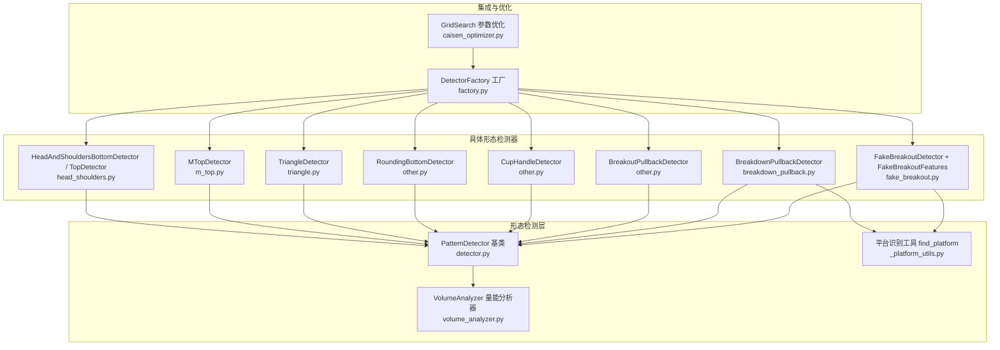
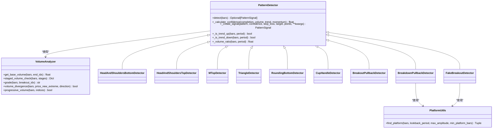
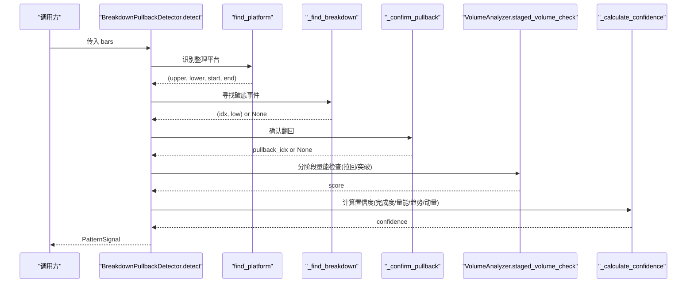
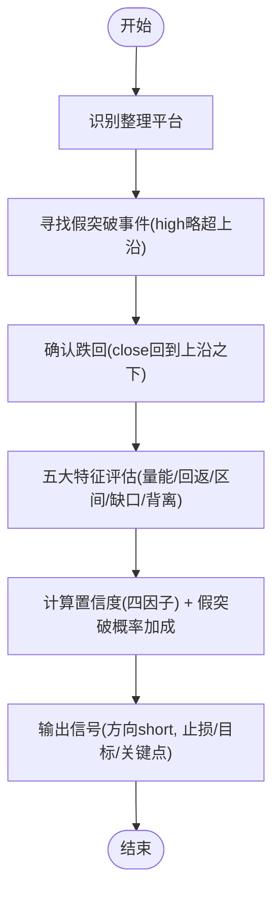
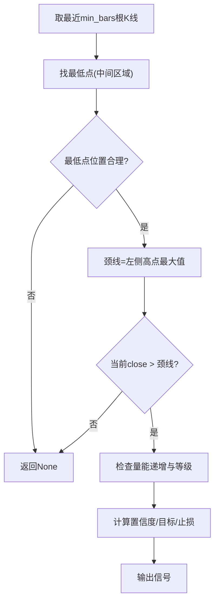
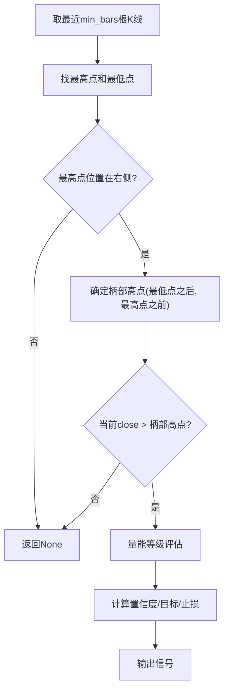
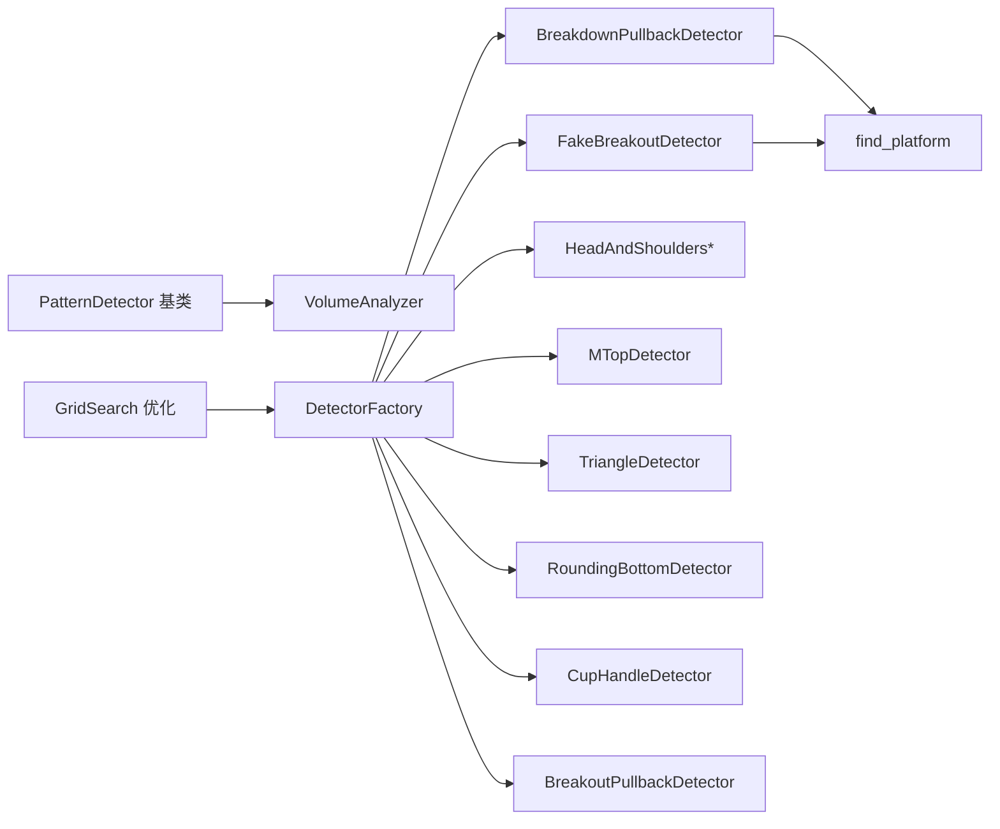

# 复杂形态检测器

<cite>
**本文引用的文件**   
- [detector.py](file://src/caisen/strategy/algorithm/detector.py)
- [volume_analyzer.py](file://src/caisen/strategy/algorithm/caisen_components/volume_analyzer.py)
- [_platform_utils.py](file://src/caisen/strategy/algorithm/patterns/_platform_utils.py)
- [breakdown_pullback.py](file://src/caisen/strategy/algorithm/patterns/breakdown_pullback.py)
- [fake_breakout.py](file://src/caisen/strategy/algorithm/patterns/fake_breakout.py)
- [head_shoulders.py](file://src/caisen/strategy/algorithm/patterns/head_shoulders.py)
- [m_top.py](file://src/caisen/strategy/algorithm/patterns/m_top.py)
- [triangle.py](file://src/caisen/strategy/algorithm/patterns/triangle.py)
- [other.py](file://src/caisen/strategy/algorithm/patterns/other.py)
- [factory.py](file://src/caisen/strategy/algorithm/caisen_components/factory.py)
- [caisen_optimizer.py](file://src/caisen/strategy/algorithm/caisen_optimizer.py)
</cite>

## 目录
1. [简介](#简介)
2. [项目结构](#项目结构)
3. [核心组件](#核心组件)
4. [架构总览](#架构总览)
5. [详细组件分析](#详细组件分析)
6. [依赖关系分析](#依赖关系分析)
7. [性能与复杂度](#性能与复杂度)
8. [参数优化与误报控制](#参数优化与误报控制)
9. [验证框架与测试工具](#验证框架与测试工具)
10. [故障排查指南](#故障排查指南)
11. [结论](#结论)

## 简介
本技术文档聚焦于“复杂形态检测器”，系统阐述杯柄形态、圆弧底、破底翻（突破回踩）、假突破等复杂形态的识别算法，覆盖多阶段形态构建逻辑、时间窗口约束、成交量配合分析、置信度计算、参数优化方法与误报率控制策略，并提供形态验证框架与性能测试工具的使用指南。

## 项目结构
复杂形态检测相关代码主要位于 strategy/algorithm 目录下：
- detector.py：定义纯函数式检测器基类、信号与置信度因子数据结构，提供通用趋势与量能辅助方法
- caisen_components/volume_analyzer.py：分阶段量能评估器，支持缩量/放量/递增等多阶段校验
- patterns/_platform_utils.py：整理平台识别工具（用于破底翻、假突破）
- patterns/*：各类形态检测器实现（头肩顶/底、M头、三角、旗形、矩形、圆弧底、杯柄、过前高、破底翻、假突破）
- caisen_components/factory.py：检测器工厂，按配置创建具体检测器实例
- caisen_optimizer.py：网格搜索参数优化工具，输出最优参数组合与配置文件

图表来源
- [detector.py:80-180](file://src/caisen/strategy/algorithm/detector.py#L80-L180)
- [volume_analyzer.py:15-126](file://src/caisen/strategy/algorithm/caisen_components/volume_analyzer.py#L15-L126)
- [_platform_utils.py:12-74](file://src/caisen/strategy/algorithm/patterns/_platform_utils.py#L12-L74)
- [head_shoulders.py:11-170](file://src/caisen/strategy/algorithm/patterns/head_shoulders.py#L11-L170)
- [m_top.py:11-127](file://src/caisen/strategy/algorithm/patterns/m_top.py#L11-L127)
- [triangle.py:11-143](file://src/caisen/strategy/algorithm/patterns/triangle.py#L11-L143)
- [other.py:293-576](file://src/caisen/strategy/algorithm/patterns/other.py#L293-L576)
- [breakdown_pullback.py:17-129](file://src/caisen/strategy/algorithm/patterns/breakdown_pullback.py#L17-L129)
- [fake_breakout.py:18-511](file://src/caisen/strategy/algorithm/patterns/fake_breakout.py#L18-L511)
- [factory.py:1-226](file://src/caisen/strategy/algorithm/caisen_components/factory.py#L1-L226)
- [caisen_optimizer.py:1-360](file://src/caisen/strategy/algorithm/caisen_optimizer.py#L1-L360)

章节来源
- [detector.py:80-180](file://src/caisen/strategy/algorithm/detector.py#L80-L180)
- [volume_analyzer.py:15-126](file://src/caisen/strategy/algorithm/caisen_components/volume_analyzer.py#L15-L126)
- [_platform_utils.py:12-74](file://src/caisen/strategy/algorithm/patterns/_platform_utils.py#L12-L74)
- [factory.py:1-226](file://src/caisen/strategy/algorithm/caisen_components/factory.py#L1-L226)
- [caisen_optimizer.py:1-360](file://src/caisen/strategy/algorithm/caisen_optimizer.py#L1-L360)

## 核心组件
- 形态检测器基类 PatternDetector
  - 纯函数接口 detect(bars)，无内部状态，便于并行与回测
  - 内置置信度加权求和、止损/目标价生成、近期K线切片、趋势判断、量比计算等通用能力
- 量能分析器 VolumeAnalyzer
  - 基础均量计算、分阶段量能检查（缩量/放量/递增）、突破量能等级评估、量价背离检测、关键点量能递增校验
- 平台识别工具 find_platform
  - 在回看窗口内寻找振幅小且长度足够的整理区间，返回上沿/下沿及起止索引
- 具体形态检测器
  - 头肩顶/底、M头、对称三角、旗形、矩形、圆弧底、杯柄、过前高、破底翻、假突破等

章节来源
- [detector.py:80-180](file://src/caisen/strategy/algorithm/detector.py#L80-L180)
- [volume_analyzer.py:15-126](file://src/caisen/strategy/algorithm/caisen_components/volume_analyzer.py#L15-L126)
- [_platform_utils.py:12-74](file://src/caisen/strategy/algorithm/patterns/_platform_utils.py#L12-L74)

## 架构总览
整体采用“基类+专用检测器”的分层设计：
- 基类提供统一信号结构与置信度计算框架
- 各形态检测器专注形态识别与关键价位计算
- 量能分析器作为独立模块被多个检测器复用
- 平台识别工具为需要整理区间的形态提供共享能力
- 工厂负责按配置组装检测器集合
- 优化工具通过网格搜索遍历参数组合并输出最佳实践

图表来源
- [detector.py:80-180](file://src/caisen/strategy/algorithm/detector.py#L80-L180)
- [volume_analyzer.py:15-126](file://src/caisen/strategy/algorithm/caisen_components/volume_analyzer.py#L15-L126)
- [_platform_utils.py:12-74](file://src/caisen/strategy/algorithm/patterns/_platform_utils.py#L12-L74)
- [head_shoulders.py:11-170](file://src/caisen/strategy/algorithm/patterns/head_shoulders.py#L11-L170)
- [m_top.py:11-127](file://src/caisen/strategy/algorithm/patterns/m_top.py#L11-L127)
- [triangle.py:11-143](file://src/caisen/strategy/algorithm/patterns/triangle.py#L11-L143)
- [other.py:293-576](file://src/caisen/strategy/algorithm/patterns/other.py#L293-L576)
- [breakdown_pullback.py:17-129](file://src/caisen/strategy/algorithm/patterns/breakdown_pullback.py#L17-L129)
- [fake_breakout.py:18-511](file://src/caisen/strategy/algorithm/patterns/fake_breakout.py#L18-L511)

## 详细组件分析

### 破底翻（突破回踩）检测器 BreakdownPullbackDetector
- 多阶段构建逻辑
  - 平台识别：在回看窗口内寻找振幅受限的整理区间
  - 破底事件：平台结束后出现 low 跌破下沿，但跌幅不超过容忍阈值
  - 翻回确认：破底后若干根K线内 close 回到下沿之上
  - 买点类型：站回颈线（第一买点）或突破平台上沿（第二买点）
- 时间窗口约束
  - lookback_period 控制平台识别窗口
  - max_pullback_bars 限制翻回确认的时间窗
  - breakdown_tolerance 控制破底深度容忍度
- 成交量配合
  - 拉回阶段应缩量（卖压枯竭）
  - 突破阶段应放量（>=1.5倍均量）
  - 使用 staged_volume_check 进行分阶段评分
- 置信度四因子
  - completion：破底越浅、翻回越快完成度越高
  - volume：分阶段量能评分
  - trend：前期下跌趋势共振更强
  - momentum：翻回力度

图表来源
- [breakdown_pullback.py:47-129](file://src/caisen/strategy/algorithm/patterns/breakdown_pullback.py#L47-L129)
- [_platform_utils.py:12-74](file://src/caisen/strategy/algorithm/patterns/_platform_utils.py#L12-L74)
- [volume_analyzer.py:55-126](file://src/caisen/strategy/algorithm/caisen_components/volume_analyzer.py#L55-L126)
- [detector.py:125-180](file://src/caisen/strategy/algorithm/detector.py#L125-L180)

章节来源
- [breakdown_pullback.py:17-259](file://src/caisen/strategy/algorithm/patterns/breakdown_pullback.py#L17-L259)
- [_platform_utils.py:12-74](file://src/caisen/strategy/algorithm/patterns/_platform_utils.py#L12-L74)
- [volume_analyzer.py:55-126](file://src/caisen/strategy/algorithm/caisen_components/volume_analyzer.py#L55-L126)
- [detector.py:125-180](file://src/caisen/strategy/algorithm/detector.py#L125-L180)

### 假突破检测器 FakeBreakoutDetector 与五大特征评估
- 基本流程
  - 平台识别 → 假突破事件（high 略超上沿，幅度受容差限制）→ 跌回确认（close 回到上沿之下）
  - 结合当前价格位置区分信号强度（跌回平台内 vs 跌破平台下沿）
- 五大特征评估 FakeBreakoutFeatures
  - 突破量能不足：突破量低于阈值倍均量
  - 快速回返颈线：突破后若干根K线内回到颈线附近
  - 回到形态内部：价格重新进入整理区间
  - 跳空缺口无法弥补：向上跳空未有效填补缺口
  - 量价背离：价格接近新高但成交量未创新高
  - 加权综合得到“假突破概率”，对置信度进行加成
- 置信度四因子
  - completion：假突破幅度越浅越好
  - volume：诱多出货常伴随放量
  - trend：上涨趋势末期共振更强
  - momentum：跌回力度

图表来源
- [fake_breakout.py:299-424](file://src/caisen/strategy/algorithm/patterns/fake_breakout.py#L299-L424)
- [fake_breakout.py:18-297](file://src/caisen/strategy/algorithm/patterns/fake_breakout.py#L18-L297)
- [_platform_utils.py:12-74](file://src/caisen/strategy/algorithm/patterns/_platform_utils.py#L12-L74)
- [detector.py:125-180](file://src/caisen/strategy/algorithm/detector.py#L125-L180)

章节来源
- [fake_breakout.py:18-511](file://src/caisen/strategy/algorithm/patterns/fake_breakout.py#L18-L511)
- [_platform_utils.py:12-74](file://src/caisen/strategy/algorithm/patterns/_platform_utils.py#L12-L74)
- [detector.py:125-180](file://src/caisen/strategy/algorithm/detector.py#L125-L180)

### 圆弧底检测器 RoundingBottomDetector
- 形态识别
  - 在最近窗口内寻找最低点（应在中间区域），以左侧高点作为颈线
  - 当 close 突破颈线时触发买入信号
- 成交量配合
  - 后半段量能递增（progressive_volume）加分
  - 突破当日量能等级 strong 进一步加分
- 置信度与风控
  - 根据是否满足量能递增与等级设定不同置信度
  - 目标 = 颈线 + 振幅；止损 = 圆弧低点 × 止损系数

图表来源
- [other.py:293-401](file://src/caisen/strategy/algorithm/patterns/other.py#L293-L401)
- [volume_analyzer.py:197-224](file://src/caisen/strategy/algorithm/caisen_components/volume_analyzer.py#L197-L224)

章节来源
- [other.py:293-401](file://src/caisen/strategy/algorithm/patterns/other.py#L293-L401)
- [volume_analyzer.py:197-224](file://src/caisen/strategy/algorithm/caisen_components/volume_analyzer.py#L197-L224)

### 杯柄形态检测器 CupHandleDetector
- 形态识别
  - 在窗口内寻找杯身与柄部结构：最高点应在右侧，最低点在之前，柄部高点介于两者之间
  - 当 close 突破柄部高点时触发买入信号
- 成交量配合
  - 突破当日量能等级 strong/normal/weak 对应不同置信度
- 风控
  - 目标 = 当前价 + 杯身高差；止损 = 杯底 × 止损系数

图表来源
- [other.py:403-507](file://src/caisen/strategy/algorithm/patterns/other.py#L403-L507)

章节来源
- [other.py:403-507](file://src/caisen/strategy/algorithm/patterns/other.py#L403-L507)

### 头肩顶/底检测器 HeadAndShoulders*Detector
- 头肩底
  - 头部为中间区域最低点，左右肩高度相近（容差），颈线为两肩间高点最大值
  - close 突破颈线时触发买入信号
- 头肩顶
  - 头部为中间区域最高点，左右肩高度相近，颈线为两肩间低点最小值
  - close 跌破颈线时触发卖出信号
- 置信度四因子
  - completion：两肩对称性
  - volume：突破/跌破时的量比
  - trend：与趋势共振（多头/空头）
  - momentum：突破/跌破力度

章节来源
- [head_shoulders.py:11-170](file://src/caisen/strategy/algorithm/patterns/head_shoulders.py#L11-L170)
- [head_shoulders.py:173-323](file://src/caisen/strategy/algorithm/patterns/head_shoulders.py#L173-L323)

### M头检测器 MTopDetector
- 双顶识别：两个相近高点（容差），中间存在明显颈线（低点）
- 跌破颈线触发卖出信号
- 置信度四因子：完成度（双顶对称）、量能、趋势、动量

章节来源
- [m_top.py:11-127](file://src/caisen/strategy/algorithm/patterns/m_top.py#L11-L127)
- [m_top.py:179-227](file://src/caisen/strategy/algorithm/patterns/m_top.py#L179-L227)

### 对称三角形检测器 TriangleDetector
- 至少3个递减高点与3个递增低点，形成收敛的两条趋势线
- 向上突破上轨或向下跌破下轨触发信号
- 置信度四因子：收敛紧密程度、量能、趋势、动量

章节来源
- [triangle.py:11-143](file://src/caisen/strategy/algorithm/patterns/triangle.py#L11-L143)
- [triangle.py:195-239](file://src/caisen/strategy/algorithm/patterns/triangle.py#L195-L239)

### 其他形态（旗形、矩形、过前高）
- 旗形：识别旗杆与旗面，突破方向延续原趋势
- 矩形：水平区间整理，突破上下沿触发信号
- 过前高：突破历史高点后回调再涨（简化实现）

章节来源
- [other.py:11-180](file://src/caisen/strategy/algorithm/patterns/other.py#L11-L180)
- [other.py:182-291](file://src/caisen/strategy/algorithm/patterns/other.py#L182-L291)
- [other.py:509-576](file://src/caisen/strategy/algorithm/patterns/other.py#L509-L576)

## 依赖关系分析
- 检测器与量能分析器耦合松，通过构造函数注入 VolumeAnalyzer
- 平台识别工具被破底翻与假突破共用，降低重复实现
- 工厂集中管理检测器映射与默认参数，便于扩展新形态
- 优化工具通过网格搜索组合参数，驱动回测引擎与指标计算器

图表来源
- [detector.py:80-180](file://src/caisen/strategy/algorithm/detector.py#L80-L180)
- [volume_analyzer.py:15-126](file://src/caisen/strategy/algorithm/caisen_components/volume_analyzer.py#L15-L126)
- [_platform_utils.py:12-74](file://src/caisen/strategy/algorithm/patterns/_platform_utils.py#L12-L74)
- [factory.py:1-226](file://src/caisen/strategy/algorithm/caisen_components/factory.py#L1-L226)
- [caisen_optimizer.py:1-360](file://src/caisen/strategy/algorithm/caisen_optimizer.py#L1-L360)

章节来源
- [factory.py:1-226](file://src/caisen/strategy/algorithm/caisen_components/factory.py#L1-L226)
- [caisen_optimizer.py:1-360](file://src/caisen/strategy/algorithm/caisen_optimizer.py#L1-L360)

## 性能与复杂度
- 平台识别 find_platform
  - 滑动窗口双重循环扫描，时间复杂度近似 O(W^2)，W 为窗口长度
  - 可通过限制最大振幅提前 break 减少无效区间
- 分阶段量能检查 staged_volume_check
  - 线性遍历阶段列表，每阶段计算平均量与比值，总体 O(S)
- 假突破五大特征评估
  - 每个特征在有限窗口内扫描，常数级或线性复杂度，总体 O(K)
- 建议优化
  - 对长周期数据可缓存均线与极值，避免重复计算
  - 将平台识别改为增量维护（单调队列/滑动窗口统计）以降低二次复杂度

[本节为一般性指导，不直接分析具体文件]

## 参数优化与误报控制
- 参数优化
  - 网格搜索遍历止损系数、最小盈利目标、移动止损比例、平台最少K线数、量能阈值、形态开关组合
  - 综合评分权重偏向年化收益、低回撤、高夏普与高胜率
  - 输出 Top N 结果与自动生成配置文件
- 误报率控制策略
  - 时间窗口约束：lookback_period、max_pullback_bars/max_fallback_bars 控制形态确认时效
  - 幅度容差：breakdown_tolerance/fake_tolerance 控制破底/假突破的深度容忍度
  - 量能门槛：breakout_multiplier、volume_threshold 确保突破有效性
  - 趋势共振：仅在与趋势一致时提高置信度
  - 五特征加权：假突破场景引入量化特征评分，过滤弱信号

章节来源
- [caisen_optimizer.py:59-152](file://src/caisen/strategy/algorithm/caisen_optimizer.py#L59-L152)
- [caisen_optimizer.py:190-305](file://src/caisen/strategy/algorithm/caisen_optimizer.py#L190-L305)
- [caisen_optimizer.py:308-360](file://src/caisen/strategy/algorithm/caisen_optimizer.py#L308-L360)
- [breakdown_pullback.py:26-46](file://src/caisen/strategy/algorithm/patterns/breakdown_pullback.py#L26-L46)
- [fake_breakout.py:309-329](file://src/caisen/strategy/algorithm/patterns/fake_breakout.py#L309-L329)
- [volume_analyzer.py:24-33](file://src/caisen/strategy/algorithm/caisen_components/volume_analyzer.py#L24-L33)

## 验证框架与测试工具
- 验证框架
  - 使用 DetectorFactory 按配置批量创建检测器，统一调用 detect(bars) 获取信号
  - 利用 PatternSignal.points 与 data 字段进行可视化标注与调试信息输出
- 性能测试工具
  - GridSearch 提供并行回测与结果汇总，适合在不同品种/周期上进行压力测试
  - 通过 top_n 筛选最优参数组合，导出 JSON 与 YAML 配置文件供后续运行
- 使用建议
  - 先在小样本数据上验证形态识别稳定性
  - 逐步扩大样本与时间跨度，观察参数鲁棒性与过拟合风险
  - 结合前端可视化（annotations）人工复核典型信号

章节来源
- [factory.py:1-226](file://src/caisen/strategy/algorithm/caisen_components/factory.py#L1-L226)
- [caisen_optimizer.py:190-305](file://src/caisen/strategy/algorithm/caisen_optimizer.py#L190-L305)

## 故障排查指南
- 常见问题
  - 平台识别失败：窗口长度不足或振幅过大，调整 lookback_period 与 max_amplitude
  - 假突破/破底翻未触发：容差过小或时间窗太短，放宽 fake_tolerance/breakdown_tolerance 与 max_*_bars
  - 量能评分偏低：基础均量窗口不足或突破量不够，增大 base_period 或降低 breakout_multiplier
  - 置信度过低：趋势不一致或动量不足，调整趋势判断周期或动量阈值
- 定位方法
  - 打印 PatternSignal.data 中的额外字段（如 neckline、amplitude、fake_probability）
  - 使用 VolumeAnalyzer.grade 与 staged_volume_check 详情诊断量能问题
  - 借助 find_platform 返回值核对平台上下沿与起止索引

章节来源
- [detector.py:125-180](file://src/caisen/strategy/algorithm/detector.py#L125-L180)
- [volume_analyzer.py:55-126](file://src/caisen/strategy/algorithm/caisen_components/volume_analyzer.py#L55-L126)
- [_platform_utils.py:12-74](file://src/caisen/strategy/algorithm/patterns/_platform_utils.py#L12-L74)

## 结论
本复杂形态检测器以纯函数式检测器基类为核心，结合分阶段量能分析与平台识别工具，实现了杯柄、圆弧底、破底翻、假突破等多种复杂形态的高精度识别。通过四因子置信度模型与五特征假突破评估，系统在提升信号质量的同时有效控制误报率。网格搜索优化工具为参数调优提供了系统化路径，配合可视化标注与回测引擎，形成完整的形态验证与性能评估闭环。