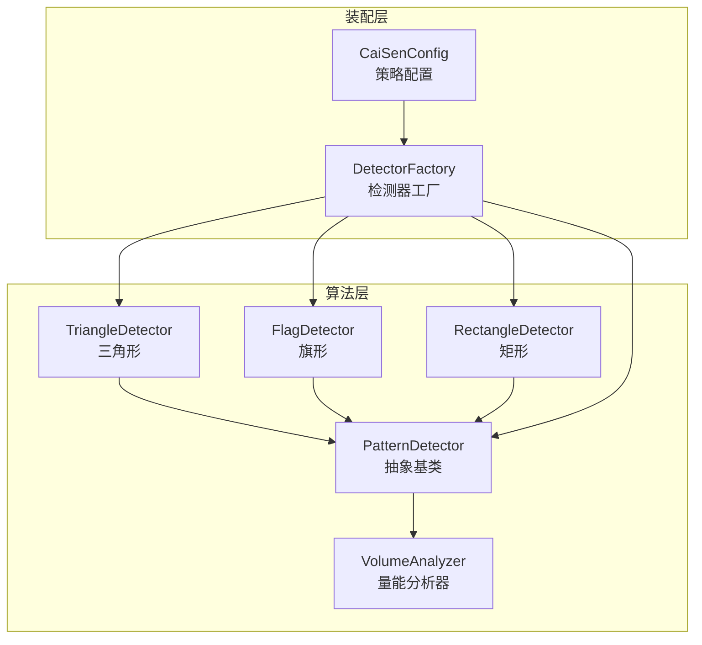
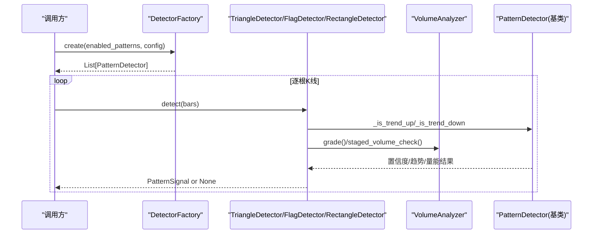
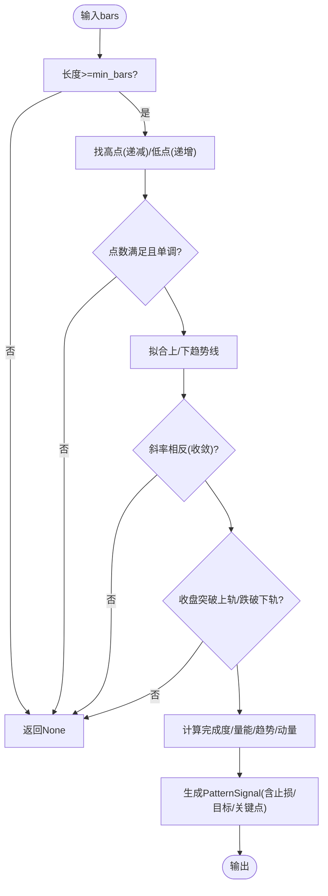
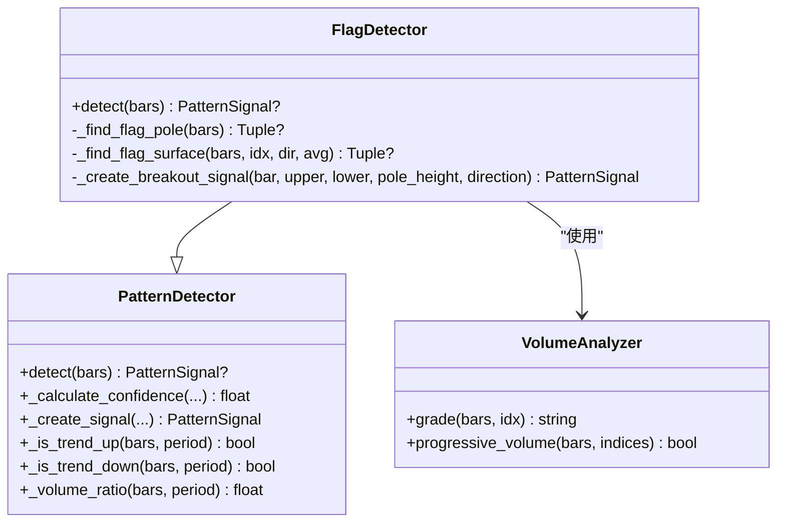
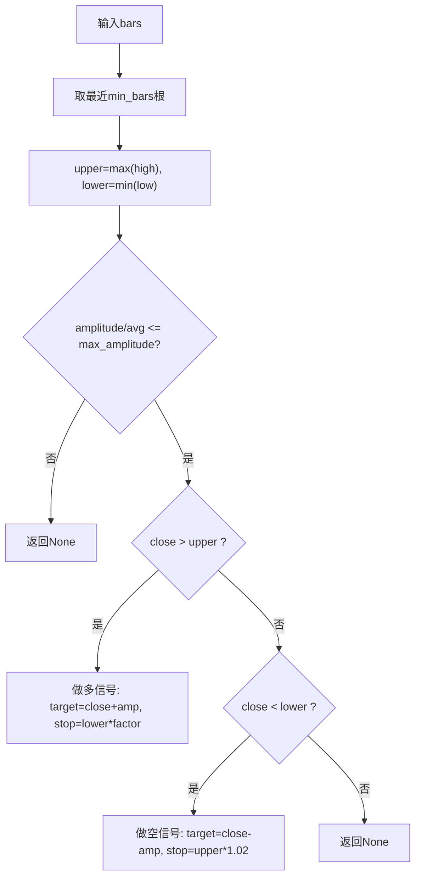
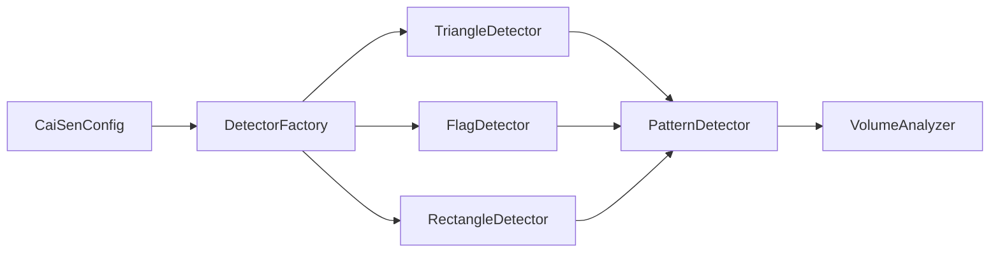
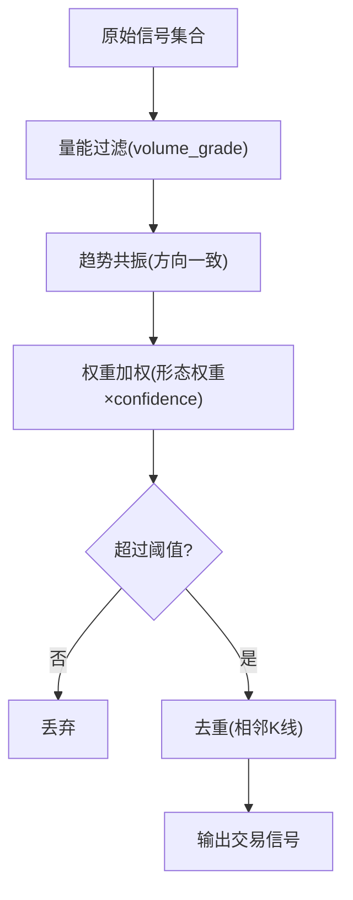

# 延续形态检测器

<cite>
**本文引用的文件**   
- [detector.py](file://src/caisen/strategy/algorithm/detector.py)
- [triangle.py](file://src/caisen/strategy/algorithm/patterns/triangle.py)
- [other.py](file://src/caisen/strategy/algorithm/patterns/other.py)
- [factory.py](file://src/caisen/strategy/algorithm/caisen_components/factory.py)
- [volume_analyzer.py](file://src/caisen/strategy/algorithm/caisen_components/volume_analyzer.py)
- [caisen_config.py](file://src/caisen/strategy/algorithm/caisen_config.py)
- [test_breakdown_pullback.py](file://tests/test_breakdown_pullback.py)
</cite>

## 目录
1. [简介](#简介)
2. [项目结构](#项目结构)
3. [核心组件](#核心组件)
4. [架构总览](#架构总览)
5. [详细组件分析](#详细组件分析)
6. [依赖关系分析](#依赖关系分析)
7. [性能与复杂度](#性能与复杂度)
8. [参数配置与环境适配](#参数配置与环境适配)
9. [组合策略与信号过滤](#组合策略与信号过滤)
10. [故障排查指南](#故障排查指南)
11. [结论](#结论)

## 简介
本技术文档聚焦于“延续形态检测器”，覆盖三角形、旗形和矩形等典型整理形态的检测算法。文档将系统阐述：
- 趋势延续的识别逻辑（如何判定趋势方向、整理区间与突破）
- 边界线绘制方法（上/下轨或水平区间的计算）
- 突破方向判断（向上突破买入、向下跌破卖出）
- 不同形态的参数配置与适用市场环境
- 形态组合使用策略与信号过滤机制的实现指南

## 项目结构
延续形态检测相关代码位于策略算法模块中，采用“纯函数接口 + 可插拔检测器”的设计：
- 基类与通用工具：提供统一的检测接口、置信度计算、趋势与量能辅助方法
- 具体形态检测器：三角形、旗形、矩形等实现
- 工厂与配置：按名称创建检测器实例并合并默认与用户配置
- 量能分析器：基于蔡森理论的分阶段量能评估，用于信号质量增强

图表来源
- [detector.py:80-150](file://src/caisen/strategy/algorithm/detector.py#L80-L150)
- [triangle.py:11-73](file://src/caisen/strategy/algorithm/patterns/triangle.py#L11-L73)
- [other.py:11-75](file://src/caisen/strategy/algorithm/patterns/other.py#L11-L75)
- [other.py:182-260](file://src/caisen/strategy/algorithm/patterns/other.py#L182-L260)
- [factory.py:54-111](file://src/caisen/strategy/algorithm/caisen_components/factory.py#L54-L111)
- [caisen_config.py:11-68](file://src/caisen/strategy/algorithm/caisen_config.py#L11-L68)

章节来源
- [detector.py:80-150](file://src/caisen/strategy/algorithm/detector.py#L80-L150)
- [factory.py:54-111](file://src/caisen/strategy/algorithm/caisen_components/factory.py#L54-L111)
- [caisen_config.py:11-68](file://src/caisen/strategy/algorithm/caisen_config.py#L11-L68)

## 核心组件
- 统一检测接口与信号模型
  - PatternDetector：定义 detect(bars) 纯函数式接口，内置置信度加权、趋势判断、量能倍数等工具方法
  - PatternSignal：封装形态名称、置信度、止损价、目标价、关键点及扩展数据
- 量能分析器
  - VolumeAnalyzer：提供基础均量、分阶段量能检查、突破量能等级、量价背离与递增检查等能力
- 具体形态检测器
  - TriangleDetector：对称三角形收敛+突破
  - FlagDetector：旗杆+旗面整理后延续原趋势
  - RectangleDetector：水平区间整理后双向突破

章节来源
- [detector.py:18-78](file://src/caisen/strategy/algorithm/detector.py#L18-L78)
- [detector.py:125-150](file://src/caisen/strategy/algorithm/detector.py#L125-L150)
- [volume_analyzer.py:15-54](file://src/caisen/strategy/algorithm/caisen_components/volume_analyzer.py#L15-L54)
- [volume_analyzer.py:127-156](file://src/caisen/strategy/algorithm/caisen_components/volume_analyzer.py#L127-L156)
- [triangle.py:11-73](file://src/caisen/strategy/algorithm/patterns/triangle.py#L11-L73)
- [other.py:11-75](file://src/caisen/strategy/algorithm/patterns/other.py#L11-L75)
- [other.py:182-260](file://src/caisen/strategy/algorithm/patterns/other.py#L182-L260)

## 架构总览
延续形态检测器的调用流程如下：
- 上层通过 DetectorFactory 根据启用列表与配置创建检测器实例
- 每个检测器在每根K线上接收 bars 列表，执行 detect() 返回信号或 None
- 信号包含置信度、止损和目标价，供策略层进行下单与风控

图表来源
- [factory.py:81-111](file://src/caisen/strategy/algorithm/caisen_components/factory.py#L81-L111)
- [detector.py:194-243](file://src/caisen/strategy/algorithm/detector.py#L194-L243)
- [volume_analyzer.py:127-156](file://src/caisen/strategy/algorithm/caisen_components/volume_analyzer.py#L127-L156)

## 详细组件分析

### 三角形检测器（TriangleDetector）
- 识别逻辑
  - 寻找最近若干根K线中的高点序列（递减）与低点序列（递增），要求至少各3个
  - 用首尾两点拟合上/下趋势线，要求两线斜率相反（收敛）
  - 当收盘价突破上轨产生多头信号，跌破下轨产生空头信号
- 边界线绘制
  - 上轨：由两个最高点的线性方程得到；下轨：由两个最低点的线性方程得到
  - 当前索引处的趋势线价格用于突破判断
- 突破方向与目标/止损
  - 多头：目标=现价+振幅（上下轨差值），止损=下轨×止损系数
  - 空头：目标=现价-振幅，止损=上轨×1.02
- 置信度计算
  - 完成度：振幅相对均价越小，完成度越高
  - 量能：近期成交量放大倍数映射为0~1
  - 趋势：结合短期趋势方向给予权重
  - 动量：突破幅度归一化到0~1
  - 最终加权求和并裁剪至[0,1]

图表来源
- [triangle.py:39-73](file://src/caisen/strategy/algorithm/patterns/triangle.py#L39-L73)
- [triangle.py:74-143](file://src/caisen/strategy/algorithm/patterns/triangle.py#L74-L143)
- [triangle.py:145-193](file://src/caisen/strategy/algorithm/patterns/triangle.py#L145-L193)
- [triangle.py:195-238](file://src/caisen/strategy/algorithm/patterns/triangle.py#L195-L238)

章节来源
- [triangle.py:11-73](file://src/caisen/strategy/algorithm/patterns/triangle.py#L11-L73)
- [triangle.py:74-143](file://src/caisen/strategy/algorithm/patterns/triangle.py#L74-L143)
- [triangle.py:145-193](file://src/caisen/strategy/algorithm/patterns/triangle.py#L145-L193)
- [triangle.py:195-238](file://src/caisen/strategy/algorithm/patterns/triangle.py#L195-L238)

### 旗形检测器（FlagDetector）
- 识别逻辑
  - 先定位“旗杆”：最近一段显著涨跌（振幅相对均价≥阈值）
  - 再定位“旗面”：旗杆后的窄幅整理区间（宽度远小于旗杆）
  - 若原趋势向上且突破上轨，做多；原趋势向下且跌破下轨，做空
- 边界线绘制
  - 简单取整理区间的高点作为上轨、低点作为下轨
- 目标/止损
  - 目标=现价±旗杆高度；止损=另一侧轨道×系数
- 置信度
  - 主要依据量能等级（强/正常/弱）直接赋分

图表来源
- [other.py:11-75](file://src/caisen/strategy/algorithm/patterns/other.py#L11-L75)
- [other.py:76-139](file://src/caisen/strategy/algorithm/patterns/other.py#L76-L139)
- [other.py:140-179](file://src/caisen/strategy/algorithm/patterns/other.py#L140-L179)
- [detector.py:80-150](file://src/caisen/strategy/algorithm/detector.py#L80-L150)
- [volume_analyzer.py:127-156](file://src/caisen/strategy/algorithm/caisen_components/volume_analyzer.py#L127-L156)

章节来源
- [other.py:11-75](file://src/caisen/strategy/algorithm/patterns/other.py#L11-L75)
- [other.py:76-139](file://src/caisen/strategy/algorithm/patterns/other.py#L76-L139)
- [other.py:140-179](file://src/caisen/strategy/algorithm/patterns/other.py#L140-L179)

### 矩形检测器（RectangleDetector）
- 识别逻辑
  - 在最近N根K线内，计算最高价与最低价形成水平通道
  - 通道振幅相对均价需小于阈值，视为有效矩形
  - 收盘价突破上沿做多，跌破下沿做空
- 边界线绘制
  - 上轨=区间最高价，下轨=区间最低价
- 目标/止损
  - 目标=现价±振幅；止损=另一侧轨道×系数
- 置信度
  - 完成度：振幅越小越接近完成
  - 量能：突破时放量提升置信度
  - 趋势：与突破方向一致的趋势加分

图表来源
- [other.py:182-260](file://src/caisen/strategy/algorithm/patterns/other.py#L182-L260)
- [other.py:262-290](file://src/caisen/strategy/algorithm/patterns/other.py#L262-L290)

章节来源
- [other.py:182-260](file://src/caisen/strategy/algorithm/patterns/other.py#L182-L260)
- [other.py:262-290](file://src/caisen/strategy/algorithm/patterns/other.py#L262-L290)

## 依赖关系分析
- 耦合与内聚
  - 各形态检测器仅依赖基类提供的通用方法与量能分析器，职责单一、内聚度高
  - 工厂负责按名称解析并注入参数，降低外部装配复杂度
- 外部依赖
  - 量能分析器独立于形态逻辑，可复用
  - 配置对象集中管理开关与权重，便于回测与实盘切换

图表来源
- [factory.py:54-111](file://src/caisen/strategy/algorithm/caisen_components/factory.py#L54-L111)
- [caisen_config.py:11-68](file://src/caisen/strategy/algorithm/caisen_config.py#L11-L68)
- [detector.py:80-150](file://src/caisen/strategy/algorithm/detector.py#L80-L150)

章节来源
- [factory.py:54-111](file://src/caisen/strategy/algorithm/caisen_components/factory.py#L54-L111)
- [caisen_config.py:11-68](file://src/caisen/strategy/algorithm/caisen_config.py#L11-L68)

## 性能与复杂度
- 时间复杂度
  - 三角形：排序高/低点 O(k log k)，k为窗口大小；趋势线拟合O(1)；总体O(k log k)
  - 旗形：扫描窗口O(k)，常数级比较
  - 矩形：一次遍历求极值O(k)
- 空间复杂度
  - 均为O(k)存储局部窗口与中间结果
- 优化建议
  - 对高频场景可采用滑动窗口增量更新（如维护最大/最小值的堆）
  - 趋势判断周期可调，避免过大窗口导致延迟

[本节为通用指导，不直接分析具体文件]

## 参数配置与环境适配
- 全局与形态开关
  - CaiSenConfig 提供形态开关（如 triangle_enabled、flag_enabled、rectangle_enabled）与权重 pattern_weights
- 检测器默认参数
  - 工厂内置 DEFAULT_DETECTOR_CONFIG，包含 min_bars、max_bars、max_amplitude、stop_loss_factor、min_profit_pct 等
- 推荐环境适配
  - 震荡市：提高 max_amplitude 容忍度，放宽 min_bars，减少假突破
  - 趋势市：缩短 min_bars，强调量能确认，提高 stop_loss_factor 收紧止损
  - 低流动性：提高量能阈值，过滤弱信号

章节来源
- [caisen_config.py:43-68](file://src/caisen/strategy/algorithm/caisen_config.py#L43-L68)
- [factory.py:38-51](file://src/caisen/strategy/algorithm/caisen_components/factory.py#L38-L51)
- [factory.py:174-195](file://src/caisen/strategy/algorithm/caisen_components/factory.py#L174-L195)

## 组合策略与信号过滤
- 多形态并行检测
  - 通过 DetectorFactory.create 同时启用三角形、旗形、矩形等检测器，统一轮询 bars
- 信号融合与优先级
  - 使用 CaiSenConfig.pattern_weights 对不同形态赋予权重，结合各自 confidence 做加权评分
  - 可按权重排序选择最优信号，或在同方向叠加仓位
- 过滤机制
  - 量能过滤：仅接受 volume_grade 为 normal/strong 的信号
  - 趋势共振：仅在趋势方向与突破方向一致时保留信号
  - 置信度阈值：confidence 低于阈值则丢弃
  - 重复信号抑制：同一形态在相邻K线去重
- 示例参考
  - 测试用例展示了平台+跌破+翻回的完整流程与买点编号，可作为组合策略验证模板

[此图为概念性流程，不直接映射具体源码]

章节来源
- [test_breakdown_pullback.py:73-102](file://tests/test_breakdown_pullback.py#L73-L102)
- [caisen_config.py:55-68](file://src/caisen/strategy/algorithm/caisen_config.py#L55-L68)

## 故障排查指南
- 常见问题
  - 无信号：检查 bars 长度是否满足 min_bars；确认通道/收敛条件是否成立
  - 假突破频繁：调大 max_amplitude 或提高量能阈值；引入趋势共振过滤
  - 止损过紧：调整 stop_loss_factor；在趋势明确时可适当放宽
- 调试要点
  - 打印关键变量：upper/lower、trendline 当前值、breakout_pct、volume_ratio
  - 分段验证：先验证形态识别（是否找到高/低点或平台），再验证突破判断
  - 复现实例：参考单元测试构造平台与跌破/翻回序列，逐步逼近真实行情

章节来源
- [test_breakdown_pullback.py:36-71](file://tests/test_breakdown_pullback.py#L36-L71)
- [test_breakdown_pullback.py:73-102](file://tests/test_breakdown_pullback.py#L73-L102)

## 结论
延续形态检测器以统一接口与轻量实现为核心，结合量能分析与趋势共振，提供了三角形、旗形、矩形三类经典整理形态的稳健检测方案。通过工厂装配与配置驱动，可在不同市场环境中灵活调整参数与过滤规则，配合多形态组合与信号融合，进一步提升实战胜率与风险控制能力。