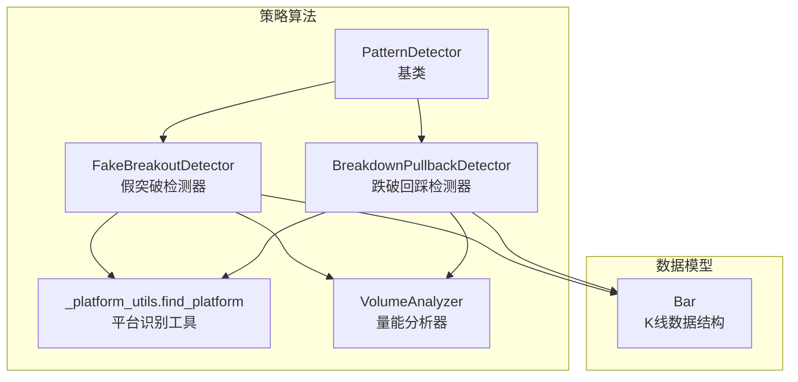
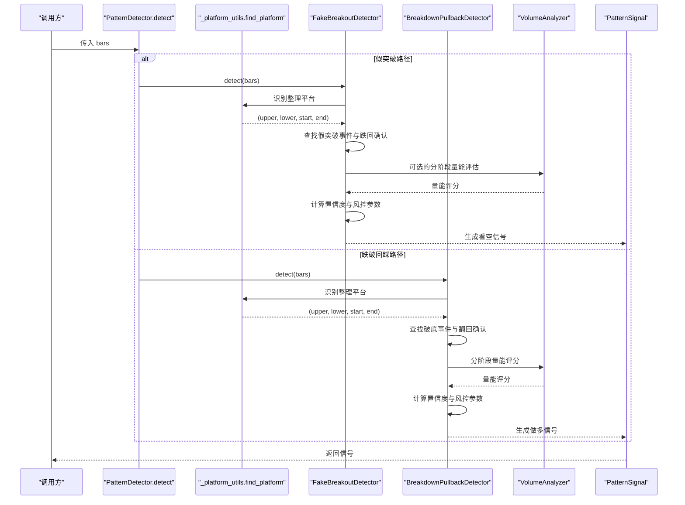
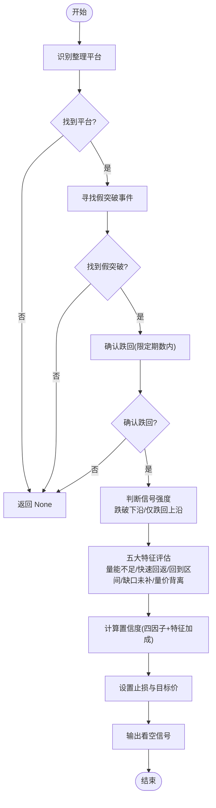
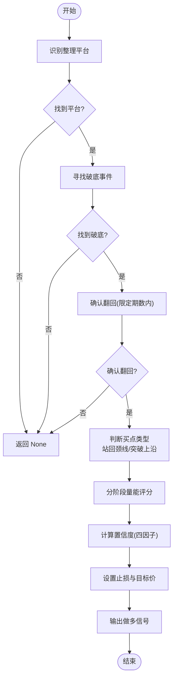
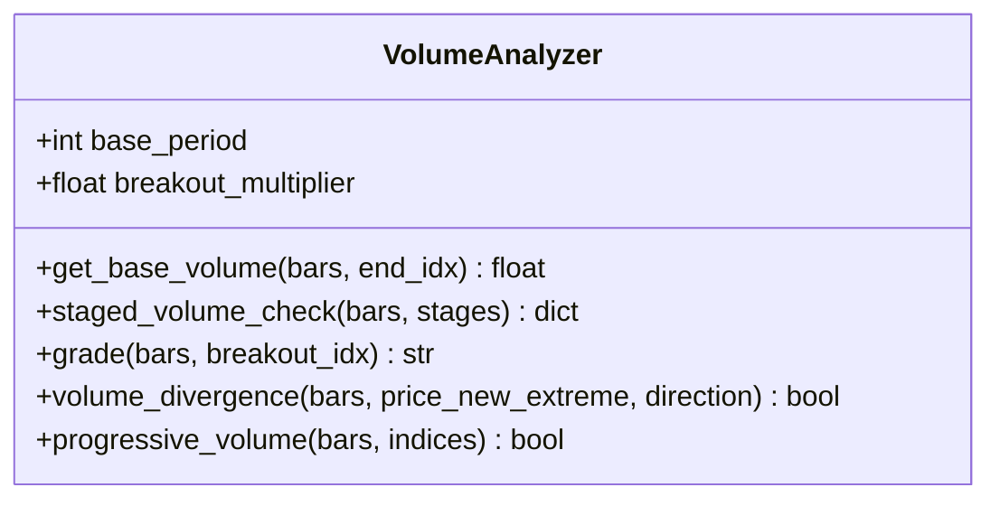
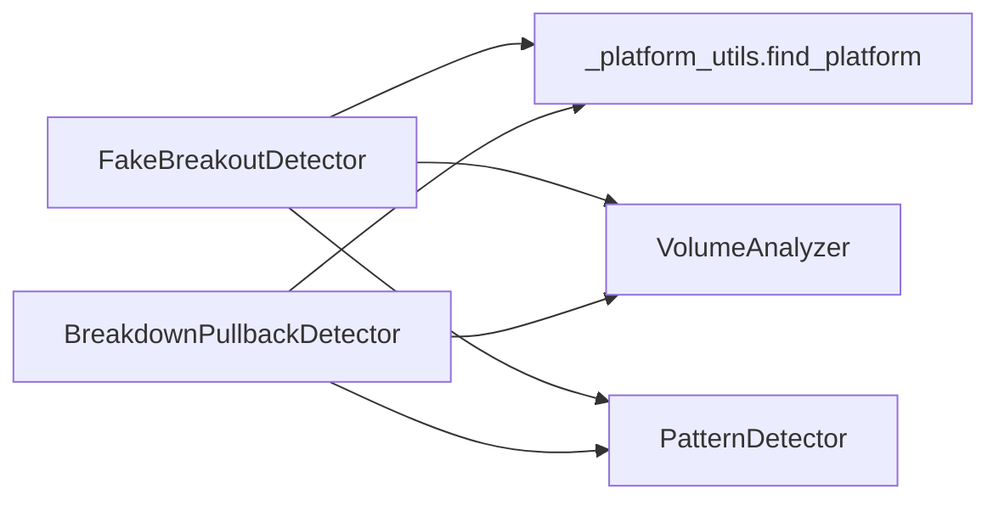

# 突破形态检测器

<cite>
**本文引用的文件**   
- [fake_breakout.py](file://src/caisen/strategy/algorithm/patterns/fake_breakout.py)
- [breakdown_pullback.py](file://src/caisen/strategy/algorithm/patterns/breakdown_pullback.py)
- [detector.py](file://src/caisen/strategy/algorithm/detector.py)
- [volume_analyzer.py](file://src/caisen/strategy/algorithm/caisen_components/volume_analyzer.py)
- [_platform_utils.py](file://src/caisen/strategy/algorithm/patterns/_platform_utils.py)
- [bar.py](file://src/caisen/core/bar.py)
- [test_fake_breakout.py](file://tests/test_fake_breakout.py)
- [test_breakdown_pullback.py](file://tests/test_breakdown_pullback.py)
</cite>

## 目录
1. [简介](#简介)
2. [项目结构](#项目结构)
3. [核心组件](#核心组件)
4. [架构总览](#架构总览)
5. [详细组件分析](#详细组件分析)
6. [依赖关系分析](#依赖关系分析)
7. [性能与复杂度](#性能与复杂度)
8. [实战应用与案例](#实战应用与案例)
9. [故障排查指南](#故障排查指南)
10. [结论](#结论)

## 简介
本技术文档聚焦于“突破形态检测器”，围绕两类关键形态：
- 假突破（顶部或中继陷阱）：价格短暂突破整理平台上沿后迅速跌回，形成看空信号。
- 跌破回踩（破底翻）：价格跌破平台下沿后快速拉回并站回平台内部，形成底部反转做多信号。

文档将系统阐述：
- 真假突破的区分标准
- 成交量验证与量价背离识别
- 价格行为分析与置信度计算
- 风险管理策略与止损设置方法
- 突破质量评估指标与实战应用要点

## 项目结构
与突破形态检测相关的核心代码位于策略算法模块中，采用“纯函数接口”的检测器设计，便于回测与测试。

图表来源
- [detector.py:80-180](file://src/caisen/strategy/algorithm/detector.py#L80-L180)
- [fake_breakout.py:299-424](file://src/caisen/strategy/algorithm/patterns/fake_breakout.py#L299-L424)
- [breakdown_pullback.py:17-128](file://src/caisen/strategy/algorithm/patterns/breakdown_pullback.py#L17-L128)
- [_platform_utils.py:12-74](file://src/caisen/strategy/algorithm/patterns/_platform_utils.py#L12-L74)
- [volume_analyzer.py:15-126](file://src/caisen/strategy/algorithm/caisen_components/volume_analyzer.py#L15-L126)
- [bar.py:8-38](file://src/caisen/core/bar.py#L8-L38)

章节来源
- [detector.py:80-180](file://src/caisen/strategy/algorithm/detector.py#L80-L180)
- [fake_breakout.py:299-424](file://src/caisen/strategy/algorithm/patterns/fake_breakout.py#L299-L424)
- [breakdown_pullback.py:17-128](file://src/caisen/strategy/algorithm/patterns/breakdown_pullback.py#L17-L128)
- [_platform_utils.py:12-74](file://src/caisen/strategy/algorithm/patterns/_platform_utils.py#L12-L74)
- [volume_analyzer.py:15-126](file://src/caisen/strategy/algorithm/caisen_components/volume_analyzer.py#L15-L126)
- [bar.py:8-38](file://src/caisen/core/bar.py#L8-L38)

## 核心组件
- 形态检测器基类 PatternDetector
  - 提供统一的 detect(bars) 纯函数接口、置信度加权计算、趋势判断、成交量放大倍数等通用能力。
- 假突破检测器 FakeBreakoutDetector
  - 基于平台识别 + 假突破事件确认 + 五大特征评分（量能不足、快速回返、回到区间、缺口未补、量价背离），输出看空信号及风控参数。
- 跌破回踩检测器 BreakdownPullbackDetector
  - 基于平台识别 + 破底事件确认 + 翻回确认，支持第一买点（站回颈线）和第二买点（突破上沿），输出做多信号及风控参数。
- 量能分析器 VolumeAnalyzer
  - 分阶段量能评估（缩量/放量/递增）、突破等级划分、量价背离检测、关键点量能递增检查。
- 平台识别工具 find_platform
  - 在回看窗口内寻找振幅最小且长度满足要求的整理平台，返回上下沿与起止索引。
- Bar 数据结构
  - K线数据载体，包含时间戳、标的、频率、OHLCV。

章节来源
- [detector.py:80-180](file://src/caisen/strategy/algorithm/detector.py#L80-L180)
- [fake_breakout.py:18-296](file://src/caisen/strategy/algorithm/patterns/fake_breakout.py#L18-L296)
- [breakdown_pullback.py:17-128](file://src/caisen/strategy/algorithm/patterns/breakdown_pullback.py#L17-L128)
- [volume_analyzer.py:15-126](file://src/caisen/strategy/algorithm/caisen_components/volume_analyzer.py#L15-L126)
- [_platform_utils.py:12-74](file://src/caisen/strategy/algorithm/patterns/_platform_utils.py#L12-L74)
- [bar.py:8-38](file://src/caisen/core/bar.py#L8-L38)

## 架构总览
下图展示从输入K线到输出信号的端到端流程，以及各组件之间的调用关系。

图表来源
- [detector.py:112-180](file://src/caisen/strategy/algorithm/detector.py#L112-L180)
- [fake_breakout.py:331-424](file://src/caisen/strategy/algorithm/patterns/fake_breakout.py#L331-L424)
- [breakdown_pullback.py:47-128](file://src/caisen/strategy/algorithm/patterns/breakdown_pullback.py#L47-L128)
- [_platform_utils.py:12-74](file://src/caisen/strategy/algorithm/patterns/_platform_utils.py#L12-L74)
- [volume_analyzer.py:55-126](file://src/caisen/strategy/algorithm/caisen_components/volume_analyzer.py#L55-L126)

## 详细组件分析

### 假突破检测器（FakeBreakoutDetector）
- 检测流程
  - 识别整理平台（上沿/下沿）。
  - 在平台结束后寻找假突破事件：K线最高价突破上沿但幅度不超过容忍阈值。
  - 确认跌回：在限定根数内收盘价回到上沿之下。
  - 根据当前收盘位置判断信号强度：跌破下沿为更强看空信号。
  - 使用五大特征进行深度评估，融合得到最终置信度。
- 五大特征与评分
  - 量能不足：突破时成交量低于均量的指定倍数阈值，量越小评分越高。
  - 快速回返颈线：突破后在限定根数内回到颈线附近，越快评分越高。
  - 回到形态内部：价格重新进入整理区间，越靠近下沿越危险。
  - 跳空缺口无法弥补：突破存在向上跳空但未有效填补，缺口越大评分越高。
  - 量价背离：价格接近前高但成交量未创新高，背离越严重评分越高。
- 置信度与风控
  - 四因子加权：完成度、量能、趋势共振、动量。
  - 止损：假突破最高点乘以止损系数；目标价依据信号强度设定（跌破下沿则按平台振幅向下测算）。
- 适用场景
  - 顶部或中继陷阱，用于做空或减仓。

图表来源
- [fake_breakout.py:331-424](file://src/caisen/strategy/algorithm/patterns/fake_breakout.py#L331-L424)
- [fake_breakout.py:18-296](file://src/caisen/strategy/algorithm/patterns/fake_breakout.py#L18-L296)
- [_platform_utils.py:12-74](file://src/caisen/strategy/algorithm/patterns/_platform_utils.py#L12-L74)

章节来源
- [fake_breakout.py:18-296](file://src/caisen/strategy/algorithm/patterns/fake_breakout.py#L18-L296)
- [fake_breakout.py:299-511](file://src/caisen/strategy/algorithm/patterns/fake_breakout.py#L299-L511)
- [_platform_utils.py:12-74](file://src/caisen/strategy/algorithm/patterns/_platform_utils.py#L12-L74)

### 跌破回踩检测器（BreakdownPullbackDetector）
- 检测流程
  - 识别整理平台（上沿/下沿）。
  - 在平台结束后寻找破底事件：K线最低价跌破下沿但跌幅不超过容忍阈值。
  - 确认翻回：在限定根数内收盘价站回下沿之上。
  - 买点类型：第一买点（站回颈线）、第二买点（突破平台上沿）。
  - 分阶段量能评分：破底可放量、拉回应缩量、突破需放量。
  - 置信度与风控：四因子加权；止损设于破底低点下方；目标价依据买点类型设定。
- 适用场景
  - 底部反转做多，常见于震荡市后的启动点。

图表来源
- [breakdown_pullback.py:47-128](file://src/caisen/strategy/algorithm/patterns/breakdown_pullback.py#L47-L128)
- [breakdown_pullback.py:177-259](file://src/caisen/strategy/algorithm/patterns/breakdown_pullback.py#L177-L259)
- [_platform_utils.py:12-74](file://src/caisen/strategy/algorithm/patterns/_platform_utils.py#L12-L74)

章节来源
- [breakdown_pullback.py:17-128](file://src/caisen/strategy/algorithm/patterns/breakdown_pullback.py#L17-L128)
- [breakdown_pullback.py:177-259](file://src/caisen/strategy/algorithm/patterns/breakdown_pullback.py#L177-L259)
- [_platform_utils.py:12-74](file://src/caisen/strategy/algorithm/patterns/_platform_utils.py#L12-L74)

### 量能分析器（VolumeAnalyzer）
- 功能要点
  - 基础均量计算：以阶段起始点之前的固定周期为基准。
  - 分阶段量能检查：支持“缩量/放量/递增”三种预期，返回通过状态与综合得分。
  - 突破等级划分：弱/正常/强，基于突破量相对基础均量的倍数。
  - 量价背离检测：比较前后半段的最大成交量，结合价格是否创极值。
  - 关键点量能递增：检查多个关键点的成交量是否逐步增大。
- 应用场景
  - 假突破的五特征之一（量价背离）与整体量能评估。
  - 跌破回踩的分阶段量能评分（破底放量、拉回缩量、突破放量）。

图表来源
- [volume_analyzer.py:15-126](file://src/caisen/strategy/algorithm/caisen_components/volume_analyzer.py#L15-L126)
- [volume_analyzer.py:127-224](file://src/caisen/strategy/algorithm/caisen_components/volume_analyzer.py#L127-L224)

章节来源
- [volume_analyzer.py:15-126](file://src/caisen/strategy/algorithm/caisen_components/volume_analyzer.py#L15-L126)
- [volume_analyzer.py:127-224](file://src/caisen/strategy/algorithm/caisen_components/volume_analyzer.py#L127-L224)

### 平台识别工具（find_platform）
- 算法思路
  - 在回看窗口内进行滑动窗口扫描，寻找振幅最小且长度满足最低K线数的连续区间。
  - 评分函数综合考虑区间长度与振幅，选择最优平台。
- 输出
  - 平台上下沿价格与起止索引，供后续突破/跌破检测使用。

章节来源
- [_platform_utils.py:12-74](file://src/caisen/strategy/algorithm/patterns/_platform_utils.py#L12-L74)

### 数据模型（Bar）
- 字段说明
  - timestamp、symbol、freq、open、high、low、close、volume。
- 用途
  - 作为所有检测器的输入数据载体，贯穿整个检测流程。

章节来源
- [bar.py:8-38](file://src/caisen/core/bar.py#L8-L38)

## 依赖关系分析
- 组件耦合
  - FakeBreakoutDetector 与 BreakdownPullbackDetector 均依赖 _platform_utils.find_platform 与 VolumeAnalyzer。
  - 两者共享 PatternDetector 基类的通用能力（置信度加权、趋势判断、成交量放大倍数）。
- 外部依赖
  - 无第三方库直接依赖，主要依赖 Python 标准库与数据模型 Bar。
- 潜在循环依赖
  - 未发现循环导入；检测器与工具函数之间为单向依赖。

图表来源
- [fake_breakout.py:299-424](file://src/caisen/strategy/algorithm/patterns/fake_breakout.py#L299-L424)
- [breakdown_pullback.py:17-128](file://src/caisen/strategy/algorithm/patterns/breakdown_pullback.py#L17-L128)
- [_platform_utils.py:12-74](file://src/caisen/strategy/algorithm/patterns/_platform_utils.py#L12-L74)
- [volume_analyzer.py:15-126](file://src/caisen/strategy/algorithm/caisen_components/volume_analyzer.py#L15-L126)
- [detector.py:80-180](file://src/caisen/strategy/algorithm/detector.py#L80-L180)

章节来源
- [fake_breakout.py:299-424](file://src/caisen/strategy/algorithm/patterns/fake_breakout.py#L299-L424)
- [breakdown_pullback.py:17-128](file://src/caisen/strategy/algorithm/patterns/breakdown_pullback.py#L17-L128)
- [_platform_utils.py:12-74](file://src/caisen/strategy/algorithm/patterns/_platform_utils.py#L12-L74)
- [volume_analyzer.py:15-126](file://src/caisen/strategy/algorithm/caisen_components/volume_analyzer.py#L15-L126)
- [detector.py:80-180](file://src/caisen/strategy/algorithm/detector.py#L80-L180)

## 性能与复杂度
- 平台识别
  - 滑动窗口双重循环，时间复杂度近似 O(W^2)，W 为回看窗口长度。可通过限制最大振幅提前终止扩大窗口来优化。
- 假突破检测
  - 线性扫描平台结束后至当前的K线，时间复杂度 O(N)。
- 跌破回踩检测
  - 线性扫描平台结束后至当前的K线，时间复杂度 O(N)。
- 量能分析
  - 分阶段检查与基础均量计算均为线性或常数级操作，总体复杂度 O(N)。
- 内存占用
  - 主要存储 Bars 列表与中间结果，空间复杂度 O(N)。

[本节为一般性指导，不直接分析具体文件]

## 实战应用与案例
- 真假突破区分标准
  - 假突破：突破幅度较小且在限定根数内跌回上沿之下；若突破幅度过大则视为真突破，不触发假突破信号。
  - 跌破回踩：跌破下沿幅度在容忍范围内，并在限定根数内站回下沿之上。
- 成交量验证
  - 假突破：量能不足、量价背离、缺口未补等特征提升假突破概率。
  - 跌破回踩：分阶段量能要求（破底放量、拉回缩量、突破放量）提升信号质量。
- 价格行为分析
  - 关注快速回返、回到区间内部、跳空缺口未补等行为特征。
- 风险管理
  - 假突破：止损设于假突破高点上方；目标价依据信号强度（跌破下沿则按平台振幅向下测算）。
  - 跌破回踩：止损设于破底低点下方；目标价依据买点类型（站回颈线目标为上沿，突破上沿目标为振幅向上测算）。
- 突破质量评估指标
  - 置信度（四因子加权）与五大特征评分（假突破）；分阶段量能评分（跌破回踩）。
- 实战案例参考
  - 单元测试覆盖了典型场景：不足K线、无明显平台、真突破不触发、浅刺破回落、跌破下沿更强信号、站回颈线与突破上沿买点、止损与目标价合理性等。

章节来源
- [test_fake_breakout.py:36-114](file://tests/test_fake_breakout.py#L36-L114)
- [test_breakdown_pullback.py:36-131](file://tests/test_breakdown_pullback.py#L36-L131)

## 故障排查指南
- 常见问题
  - 数据不足：当 bars 数量小于 min_bars 时，检测器返回 None。
  - 平台识别失败：振幅过大或长度不足导致找不到平台，返回 None。
  - 假突破未确认：假突破后未在限定根数内跌回上沿之下，返回 None。
  - 跌破回踩未确认：破底后未在限定根数内站回下沿之上，返回 None。
  - 量能异常：基础均量为零或历史均量为零时，相关比值计算会回退默认值。
- 调试建议
  - 打印平台上下沿与起止索引，确认平台识别是否正确。
  - 检查假突破/破底的幅度是否在容忍范围内。
  - 查看分阶段量能评分细节，确认是否符合预期。
  - 调整参数：lookback_period、max_amplitude、min_platform_bars、fake_tolerance、breakdown_tolerance、max_fallback_bars/max_pullback_bars 等。

章节来源
- [fake_breakout.py:331-424](file://src/caisen/strategy/algorithm/patterns/fake_breakout.py#L331-L424)
- [breakdown_pullback.py:47-128](file://src/caisen/strategy/algorithm/patterns/breakdown_pullback.py#L47-L128)
- [_platform_utils.py:12-74](file://src/caisen/strategy/algorithm/patterns/_platform_utils.py#L12-L74)
- [volume_analyzer.py:55-126](file://src/caisen/strategy/algorithm/caisen_components/volume_analyzer.py#L55-L126)

## 结论
本突破形态检测器以平台识别为基础，结合价格行为与成交量验证，对假突破与跌破回踩两类形态进行系统化检测。通过五特征评估与分阶段量能评分，辅以四因子置信度加权，形成稳健的信号输出与风控参数。单元测试覆盖关键场景，确保逻辑正确性与鲁棒性。实际应用中，建议结合市场环境与参数调优，以提升信号质量与交易胜率。