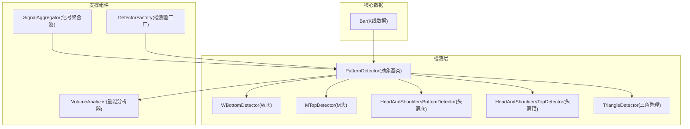
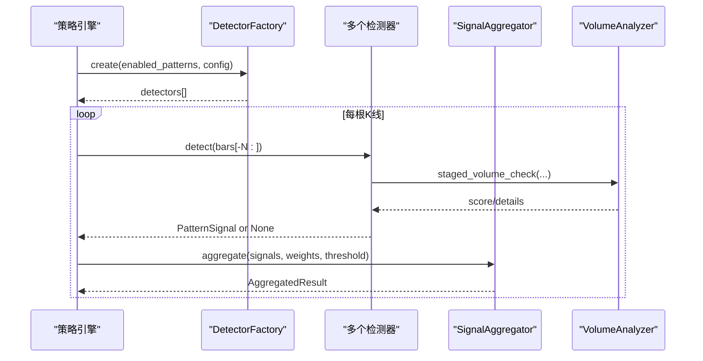
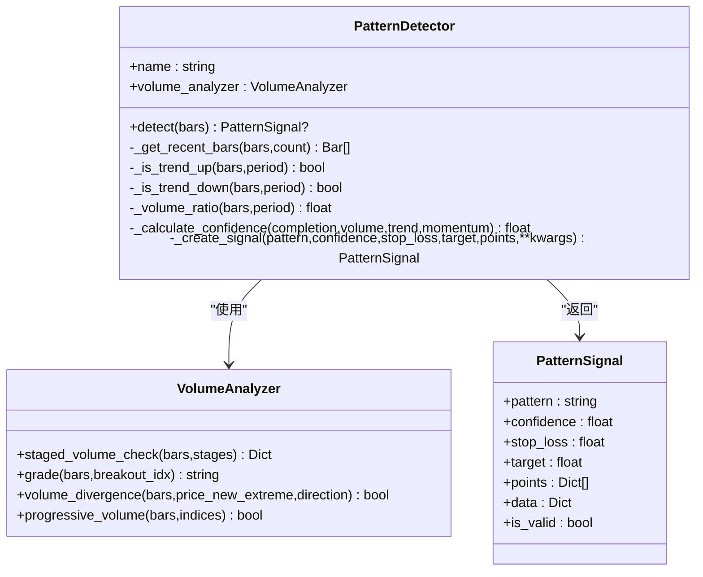
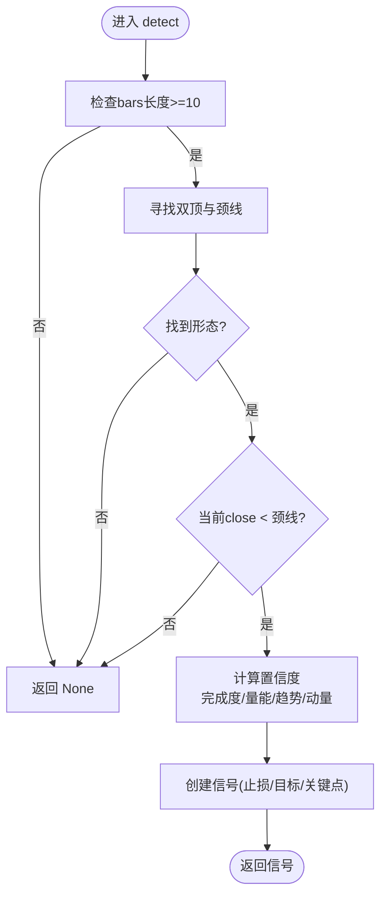
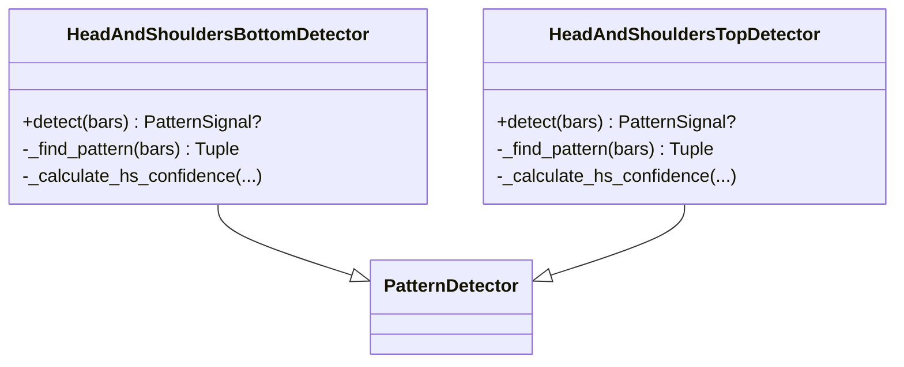
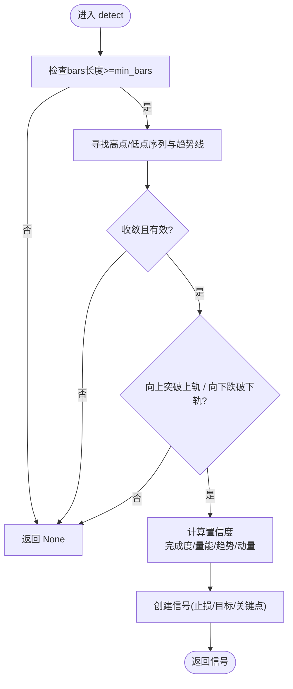
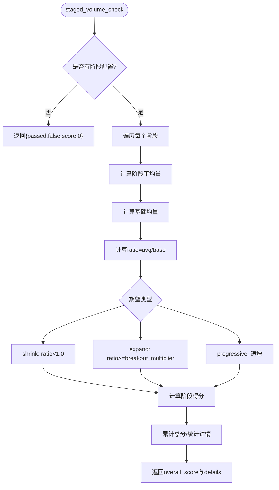
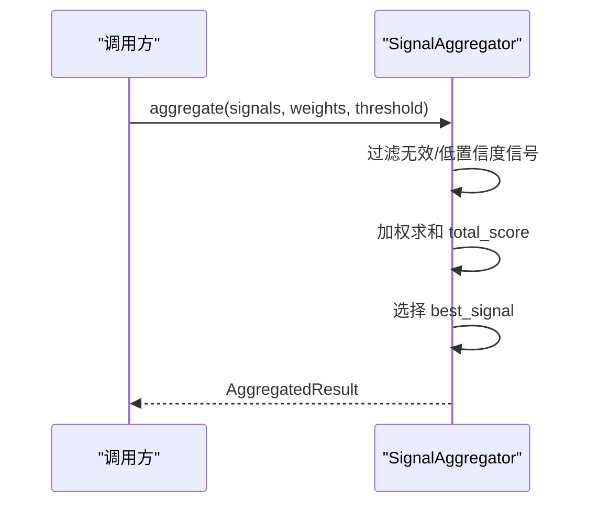
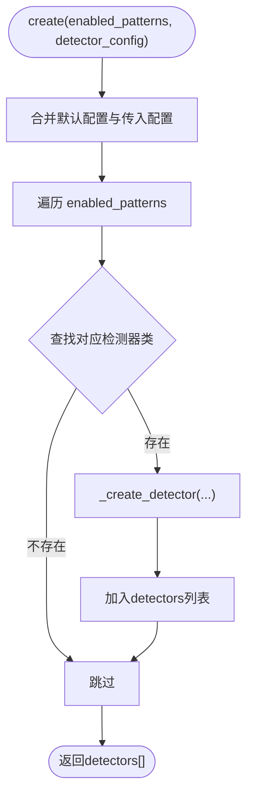
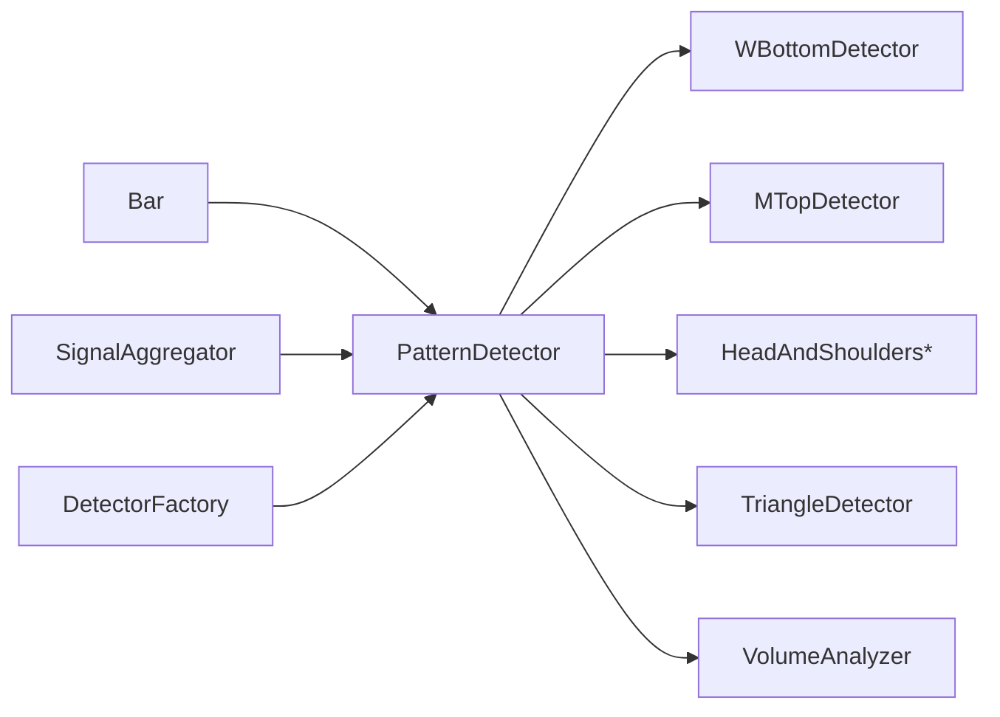

# 形态检测器架构

<cite>
**本文引用的文件**   
- [detector.py](file://src/caisen/strategy/algorithm/detector.py)
- [w_bottom.py](file://src/caisen/strategy/algorithm/patterns/w_bottom.py)
- [m_top.py](file://src/caisen/strategy/algorithm/patterns/m_top.py)
- [head_shoulders.py](file://src/caisen/strategy/algorithm/patterns/head_shoulders.py)
- [triangle.py](file://src/caisen/strategy/algorithm/patterns/triangle.py)
- [volume_analyzer.py](file://src/caisen/strategy/algorithm/caisen_components/volume_analyzer.py)
- [aggregator.py](file://src/caisen/strategy/algorithm/caisen_components/aggregator.py)
- [factory.py](file://src/caisen/strategy/algorithm/caisen_components/factory.py)
- [bar.py](file://src/caisen/core/bar.py)
- [test_cai_sen.py](file://tests/test_cai_sen.py)
</cite>

## 目录
1. [简介](#简介)
2. [项目结构](#项目结构)
3. [核心组件](#核心组件)
4. [架构总览](#架构总览)
5. [详细组件分析](#详细组件分析)
6. [依赖关系分析](#依赖关系分析)
7. [性能考虑](#性能考虑)
8. [故障排查指南](#故障排查指南)
9. [结论](#结论)
10. [附录：自定义检测器开发指南](#附录自定义检测器开发指南)

## 简介
本技术文档围绕“形态检测器”的架构与实现进行深入解析，重点包括：
- PatternDetector 抽象基类的设计与扩展机制
- 检测器的生命周期管理（初始化、检测、清理）
- 信号生成接口与参数配置系统
- 经典形态（W底、M头、头肩顶/底等）的实现要点
- 检测器协作模式与信号聚合机制
- 性能优化技巧（滑动窗口、缓存策略）
- 测试框架与调试工具使用方法

## 项目结构
形态检测器位于算法模块中，采用“纯函数接口 + 无状态检测器”的设计。核心目录与职责如下：
- 抽象基类与数据模型：定义统一检测接口、信号结构与置信度因子
- 具体形态检测器：分别实现 W底、M头、头肩顶/底、三角整理等
- 量能分析器：提供分阶段量能评估与量价背离检测
- 信号聚合器：对多检测器输出进行加权汇总与最佳信号选择
- 工厂：按配置动态创建检测器实例
- K线数据模型：统一的 Bar 数据结构

图表来源
- [detector.py:80-244](file://src/caisen/strategy/algorithm/detector.py#L80-L244)
- [w_bottom.py:11-285](file://src/caisen/strategy/algorithm/patterns/w_bottom.py#L11-L285)
- [m_top.py:11-227](file://src/caisen/strategy/algorithm/patterns/m_top.py#L11-L227)
- [head_shoulders.py:11-323](file://src/caisen/strategy/algorithm/patterns/head_shoulders.py#L11-L323)
- [triangle.py:11-239](file://src/caisen/strategy/algorithm/patterns/triangle.py#L11-L239)
- [volume_analyzer.py:15-287](file://src/caisen/strategy/algorithm/caisen_components/volume_analyzer.py#L15-L287)
- [aggregator.py:42-177](file://src/caisen/strategy/algorithm/caisen_components/aggregator.py#L42-L177)
- [factory.py:54-237](file://src/caisen/strategy/algorithm/caisen_components/factory.py#L54-L237)
- [bar.py:8-38](file://src/caisen/core/bar.py#L8-L38)

章节来源
- [detector.py:1-244](file://src/caisen/strategy/algorithm/detector.py#L1-L244)
- [bar.py:1-38](file://src/caisen/core/bar.py#L1-L38)

## 核心组件
- 抽象基类 PatternDetector
  - 纯函数接口：detect(bars) 接收完整 K 线列表并返回信号或 None
  - 内置通用能力：趋势判断、成交量放大倍数计算、置信度加权求和、信号构造
  - 可选 VolumeAnalyzer 用于更精细的量能评分
- 信号与置信度
  - PatternSignal：包含形态名称、置信度、止损/目标价、关键点与附加数据
  - ConfidenceFactors：完成度、成交量、趋势共振、动量四因子加权
- 量能分析器 VolumeAnalyzer
  - 分阶段量能检查（形成期缩量、突破期放量、确认期持续/回踩）
  - 量级评级（弱/正常/强）、量价背离检测、递增量能校验
- 信号聚合器 SignalAggregator
  - 过滤无效信号、阈值过滤、权重加权、选择最佳信号
  - 提供一步式 detect+aggregate 便捷方法
- 检测器工厂 DetectorFactory
  - 根据启用形态与配置合并默认值，动态创建检测器实例

章节来源
- [detector.py:18-244](file://src/caisen/strategy/algorithm/detector.py#L18-L244)
- [volume_analyzer.py:15-287](file://src/caisen/strategy/algorithm/caisen_components/volume_analyzer.py#L15-L287)
- [aggregator.py:16-177](file://src/caisen/strategy/algorithm/caisen_components/aggregator.py#L16-L177)
- [factory.py:22-237](file://src/caisen/strategy/algorithm/caisen_components/factory.py#L22-L237)

## 架构总览
整体流程：工厂按配置创建检测器；每条新 K 线到来时，各检测器基于最近窗口 bars 独立运行；聚合器汇总信号并输出综合评分与最佳信号。

图表来源
- [factory.py:81-111](file://src/caisen/strategy/algorithm/caisen_components/factory.py#L81-L111)
- [detector.py:112-123](file://src/caisen/strategy/algorithm/detector.py#L112-L123)
- [volume_analyzer.py:55-125](file://src/caisen/strategy/algorithm/caisen_components/volume_analyzer.py#L55-L125)
- [aggregator.py:59-136](file://src/caisen/strategy/algorithm/caisen_components/aggregator.py#L59-L136)

## 详细组件分析

### 抽象基类 PatternDetector 设计
- 纯函数接口
  - detect(bars) 无内部状态，可重复调用，便于并行与回测
- 通用工具方法
  - _get_recent_bars：滑动窗口取最近 N 根
  - _is_trend_up/_is_trend_down：简单趋势判断
  - _volume_ratio：近期均量与历史均量比值
  - _calculate_confidence：四因子加权求和
  - _create_signal：标准化信号对象
- 扩展点
  - 子类仅需实现 detect()，复用基类工具与置信度计算

图表来源
- [detector.py:80-244](file://src/caisen/strategy/algorithm/detector.py#L80-L244)
- [volume_analyzer.py:15-287](file://src/caisen/strategy/algorithm/caisen_components/volume_analyzer.py#L15-L287)
- [detector.py:18-43](file://src/caisen/strategy/algorithm/detector.py#L18-L43)

章节来源
- [detector.py:80-244](file://src/caisen/strategy/algorithm/detector.py#L80-L244)

### W底检测器（WBottomDetector）
- 形态条件
  - 两个相近低点（±容差），中间存在颈线高点
  - 价格突破颈线后确认
- 置信度因素
  - 完成度：两底对称性
  - 量能：三阶段量能评分（形成期缩量、突破期放量、确认期）
  - 趋势：上升趋势增强
  - 动量：突破力度
- 风控参数
  - 止损：最低点 × 系数
  - 目标：振幅或最小盈利百分比

图表来源
- [w_bottom.py:49-80](file://src/caisen/strategy/algorithm/patterns/w_bottom.py#L49-L80)
- [w_bottom.py:82-133](file://src/caisen/strategy/algorithm/patterns/w_bottom.py#L82-L133)
- [w_bottom.py:135-189](file://src/caisen/strategy/algorithm/patterns/w_bottom.py#L135-L189)
- [w_bottom.py:191-285](file://src/caisen/strategy/algorithm/patterns/w_bottom.py#L191-L285)

章节来源
- [w_bottom.py:11-285](file://src/caisen/strategy/algorithm/patterns/w_bottom.py#L11-L285)

### M头检测器（MTopDetector）
- 形态条件
  - 两个相近高点（±容差），中间存在颈线低点
  - 价格跌破颈线后确认
- 置信度因素
  - 完成度：两顶对称性
  - 量能：跌破放量提升置信度
  - 趋势：下降趋势增强
  - 动量：跌破力度
- 风控参数
  - 止损：最高点 × 系数
  - 目标：振幅向下投影或最小盈利百分比

图表来源
- [m_top.py:49-78](file://src/caisen/strategy/algorithm/patterns/m_top.py#L49-L78)
- [m_top.py:80-126](file://src/caisen/strategy/algorithm/patterns/m_top.py#L80-L126)
- [m_top.py:128-177](file://src/caisen/strategy/algorithm/patterns/m_top.py#L128-L177)
- [m_top.py:179-227](file://src/caisen/strategy/algorithm/patterns/m_top.py#L179-L227)

章节来源
- [m_top.py:11-227](file://src/caisen/strategy/algorithm/patterns/m_top.py#L11-L227)

### 头肩顶/底检测器（HeadAndShoulders*）
- 头肩底
  - 左肩、头部（最低点）、右肩，颈线为肩部之间的高点
  - 突破颈线确认，方向做多
- 头肩顶
  - 左肩、头部（最高点）、右肩，颈线为肩部之间的低点
  - 跌破颈线确认，方向做空
- 置信度因素
  - 完成度：两肩对称性
  - 量能：突破/跌破放量
  - 趋势：与方向一致的趋势增强
  - 动量：突破/跌破力度

图表来源
- [head_shoulders.py:11-171](file://src/caisen/strategy/algorithm/patterns/head_shoulders.py#L11-L171)
- [head_shoulders.py:173-323](file://src/caisen/strategy/algorithm/patterns/head_shoulders.py#L173-L323)
- [detector.py:80-244](file://src/caisen/strategy/algorithm/detector.py#L80-L244)

章节来源
- [head_shoulders.py:11-323](file://src/caisen/strategy/algorithm/patterns/head_shoulders.py#L11-L323)

### 三角整理检测器（TriangleDetector）
- 形态条件
  - 至少3个高点呈下降趋势，至少3个低点呈上升趋势
  - 上下趋势线收敛
- 突破方向
  - 向上突破上轨 → 做多
  - 向下跌破下轨 → 做空
- 置信度因素
  - 完成度：收敛紧密程度
  - 量能：突破放量
  - 趋势：与突破方向一致
  - 动量：突破力度

图表来源
- [triangle.py:39-72](file://src/caisen/strategy/algorithm/patterns/triangle.py#L39-L72)
- [triangle.py:74-143](file://src/caisen/strategy/algorithm/patterns/triangle.py#L74-L143)
- [triangle.py:145-239](file://src/caisen/strategy/algorithm/patterns/triangle.py#L145-L239)

章节来源
- [triangle.py:11-239](file://src/caisen/strategy/algorithm/patterns/triangle.py#L11-L239)

### 量能分析器（VolumeAnalyzer）
- 分阶段量能检查
  - 输入阶段配置（起止索引与期望类型：shrink/expand/progressive）
  - 输出通过情况、得分与详情（平均量、相对基础量的比值）
- 量级评级
  - weak/normal/strong 三级
- 量价背离
  - 顶背离/底背离检测
- 递增量能
  - 关键点的量能是否逐步增大

图表来源
- [volume_analyzer.py:55-125](file://src/caisen/strategy/algorithm/caisen_components/volume_analyzer.py#L55-L125)
- [volume_analyzer.py:225-287](file://src/caisen/strategy/algorithm/caisen_components/volume_analyzer.py#L225-L287)

章节来源
- [volume_analyzer.py:15-287](file://src/caisen/strategy/algorithm/caisen_components/volume_analyzer.py#L15-L287)

### 信号聚合器（SignalAggregator）
- 功能
  - 过滤无效信号与低于阈值的信号
  - 按权重加权求和，选择最佳信号
  - 提供一步式 aggregate_with_detection
- 输出
  - 综合评分、最佳信号、全部有效信号、信号数量

图表来源
- [aggregator.py:59-136](file://src/caisen/strategy/algorithm/caisen_components/aggregator.py#L59-L136)

章节来源
- [aggregator.py:16-177](file://src/caisen/strategy/algorithm/caisen_components/aggregator.py#L16-L177)

### 检测器工厂（DetectorFactory）
- 功能
  - 维护 DETECTOR_CLASSES 映射与 DEFAULT_DETECTOR_CONFIG 默认配置
  - 合并用户配置与默认配置，按形态名称创建对应检测器实例
- 优势
  - 集中化配置管理，支持灵活启用/禁用形态

图表来源
- [factory.py:81-111](file://src/caisen/strategy/algorithm/caisen_components/factory.py#L81-L111)
- [factory.py:113-137](file://src/caisen/strategy/algorithm/caisen_components/factory.py#L113-L137)
- [factory.py:139-237](file://src/caisen/strategy/algorithm/caisen_components/factory.py#L139-L237)

章节来源
- [factory.py:22-237](file://src/caisen/strategy/algorithm/caisen_components/factory.py#L22-L237)

## 依赖关系分析
- 耦合与内聚
  - 检测器仅依赖基类与 VolumeAnalyzer，内聚度高、耦合度低
  - 聚合器与工厂作为编排层，不侵入检测器逻辑
- 外部依赖
  - Bar 作为唯一数据载体，保证跨模块一致性
- 循环依赖
  - 通过 TYPE_CHECKING 避免运行时导入循环

图表来源
- [bar.py:8-38](file://src/caisen/core/bar.py#L8-L38)
- [detector.py:80-244](file://src/caisen/strategy/algorithm/detector.py#L80-L244)
- [w_bottom.py:11-285](file://src/caisen/strategy/algorithm/patterns/w_bottom.py#L11-L285)
- [m_top.py:11-227](file://src/caisen/strategy/algorithm/patterns/m_top.py#L11-L227)
- [head_shoulders.py:11-323](file://src/caisen/strategy/algorithm/patterns/head_shoulders.py#L11-L323)
- [triangle.py:11-239](file://src/caisen/strategy/algorithm/patterns/triangle.py#L11-L239)
- [volume_analyzer.py:15-287](file://src/caisen/strategy/algorithm/caisen_components/volume_analyzer.py#L15-L287)
- [aggregator.py:42-177](file://src/caisen/strategy/algorithm/caisen_components/aggregator.py#L42-L177)
- [factory.py:54-237](file://src/caisen/strategy/algorithm/caisen_components/factory.py#L54-L237)

章节来源
- [detector.py:80-244](file://src/caisen/strategy/algorithm/detector.py#L80-L244)
- [factory.py:54-237](file://src/caisen/strategy/algorithm/caisen_components/factory.py#L54-L237)

## 性能考虑
- 滑动窗口处理
  - 使用 _get_recent_bars 限制 bars 范围，降低 O(n) 扫描成本
  - 建议将窗口大小与形态所需最小 bars 对齐，避免多余计算
- 缓存策略
  - 对频繁计算的指标（如均线、波动率、量比）引入 LRU 缓存，键为 (symbol,freq,window_size,end_idx)
  - 在 VolumeAnalyzer 中缓存 base_period 均量，避免重复切片求和
- 批量检测
  - 使用 aggregate_with_detection 一次性执行多检测器，减少 Python 层循环开销
- 内存与对象复用
  - 复用 Bar 对象与 points 列表，减少临时对象分配
- 并行化
  - 由于 detect 为纯函数，可对不同标的或时间片段并行执行

[本节为通用性能建议，无需特定文件引用]

## 故障排查指南
- 常见问题
  - 未检测到信号：检查 bars 长度是否满足最小要求；确认形态参数（容差、最小高度/深度）是否过严
  - 置信度过低：调整阈值 threshold；检查量能阶段配置与 breakout_multiplier
  - 止损/目标不合理：核对 stop_loss_factor 与 min_profit_pct 设置
- 调试建议
  - 打印 PatternSignal.points 与 data 字段，定位形态关键点
  - 使用 SignalAggregator.aggregate_with_detection 获取所有中间信号，对比权重与阈值影响
  - 使用 VolumeAnalyzer.grade 与 volume_divergence 辅助诊断量价关系

章节来源
- [detector.py:151-180](file://src/caisen/strategy/algorithm/detector.py#L151-L180)
- [aggregator.py:59-136](file://src/caisen/strategy/algorithm/caisen_components/aggregator.py#L59-L136)
- [volume_analyzer.py:127-196](file://src/caisen/strategy/algorithm/caisen_components/volume_analyzer.py#L127-L196)

## 结论
本架构以“纯函数接口 + 无状态检测器”为核心，结合量能分析与信号聚合，实现了高内聚、低耦合的形态检测体系。通过工厂与配置系统，可灵活启用/禁用形态并调参；通过滑动窗口与缓存策略，可在大规模回测中保持良好性能。

[本节为总结性内容，无需特定文件引用]

## 附录：自定义检测器开发指南
- 步骤
  1. 新建检测器类继承 PatternDetector，实现 detect(bars)
  2. 复用基类工具：_is_trend_up/_is_trend_down、_volume_ratio、_calculate_confidence、_create_signal
  3. 如需精细量能评估，使用 VolumeAnalyzer.staged_volume_check 并传入阶段配置
  4. 在 DetectorFactory.DETECTOR_CLASSES 中添加映射，并在 DEFAULT_DETECTOR_CONFIG 中补充默认参数
  5. 编写单元测试，验证 detect 在不同行情下的行为
- 示例参考路径
  - W底：[w_bottom.py:11-285](file://src/caisen/strategy/algorithm/patterns/w_bottom.py#L11-L285)
  - M头：[m_top.py:11-227](file://src/caisen/strategy/algorithm/patterns/m_top.py#L11-L227)
  - 头肩顶/底：[head_shoulders.py:11-323](file://src/caisen/strategy/algorithm/patterns/head_shoulders.py#L11-L323)
  - 三角整理：[triangle.py:11-239](file://src/caisen/strategy/algorithm/patterns/triangle.py#L11-L239)
  - 工厂与默认配置：[factory.py:22-237](file://src/caisen/strategy/algorithm/caisen_components/factory.py#L22-L237)
- 测试与调试
  - 使用 tests/test_cai_sen.py 中的用例风格构造 Bar 序列，验证 detect 返回值与信号有效性
  - 借助 SignalAggregator 与 VolumeAnalyzer 的诊断方法定位问题

章节来源
- [w_bottom.py:11-285](file://src/caisen/strategy/algorithm/patterns/w_bottom.py#L11-L285)
- [m_top.py:11-227](file://src/caisen/strategy/algorithm/patterns/m_top.py#L11-L227)
- [head_shoulders.py:11-323](file://src/caisen/strategy/algorithm/patterns/head_shoulders.py#L11-L323)
- [triangle.py:11-239](file://src/caisen/strategy/algorithm/patterns/triangle.py#L11-L239)
- [factory.py:22-237](file://src/caisen/strategy/algorithm/caisen_components/factory.py#L22-L237)
- [test_cai_sen.py:1-200](file://tests/test_cai_sen.py#L1-L200)