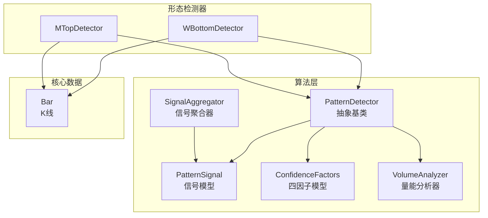
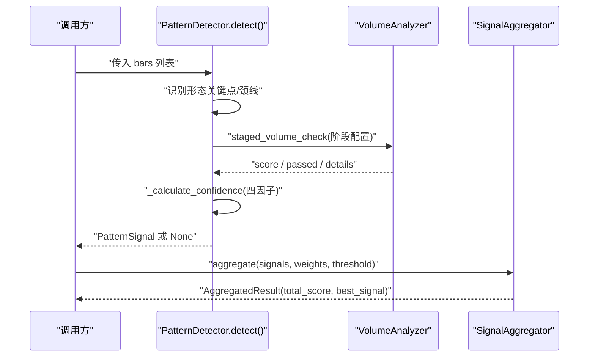
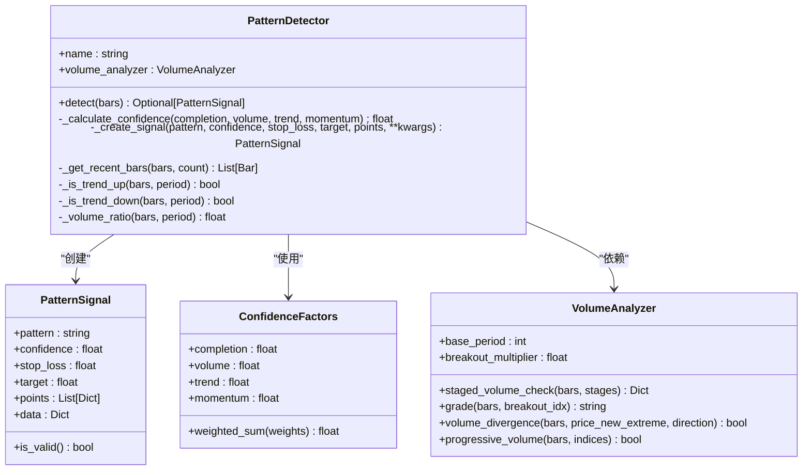
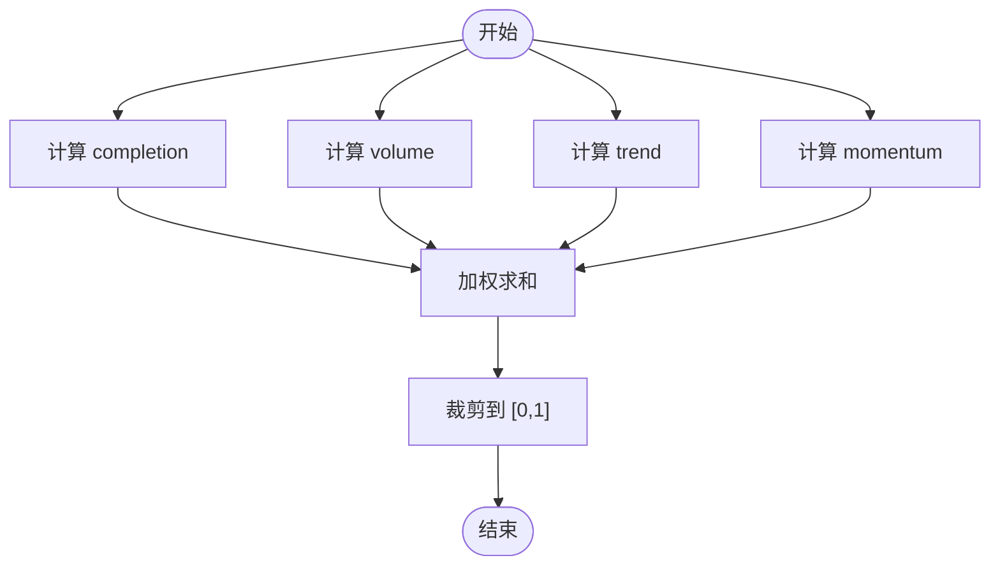
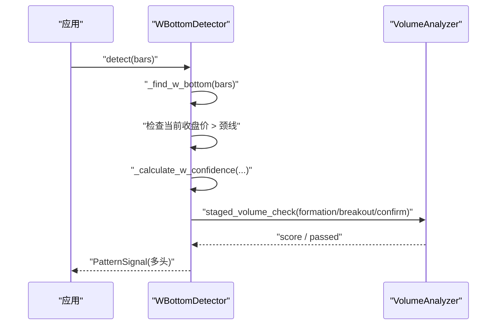
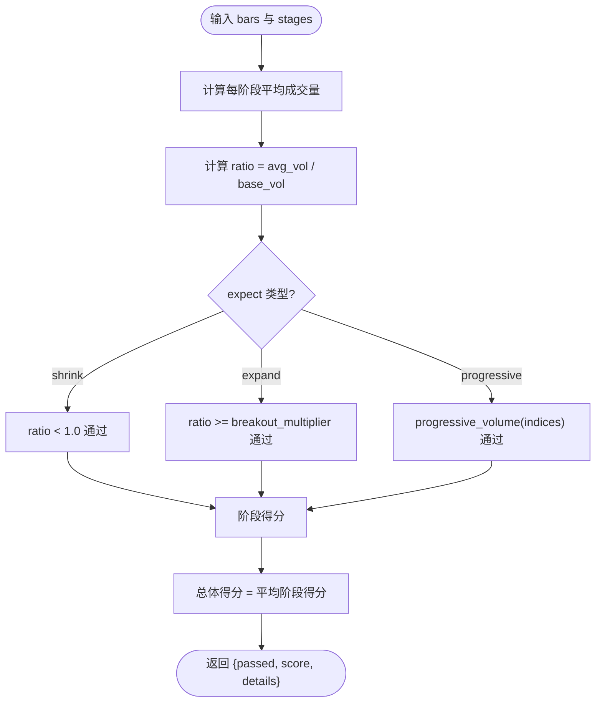
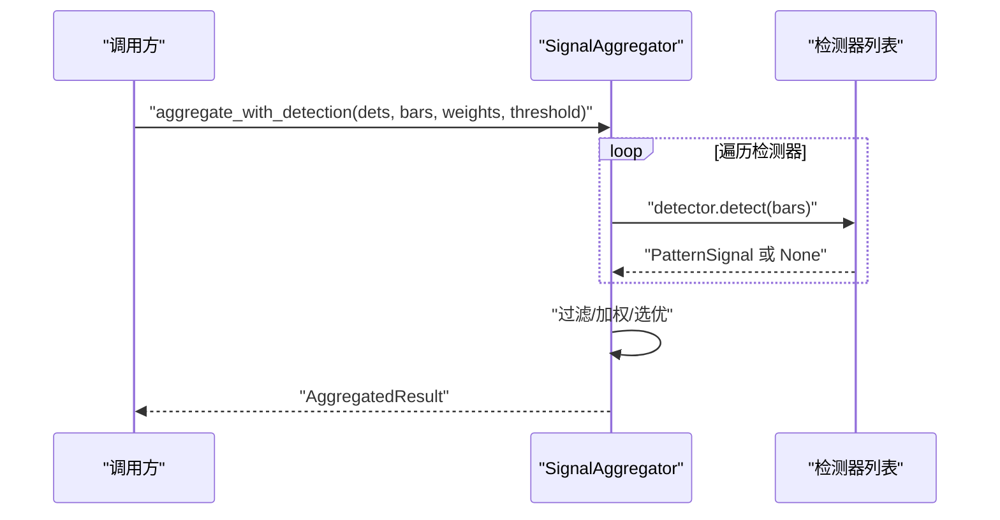
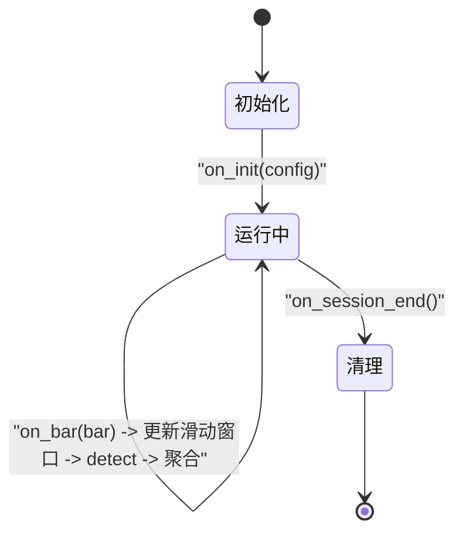
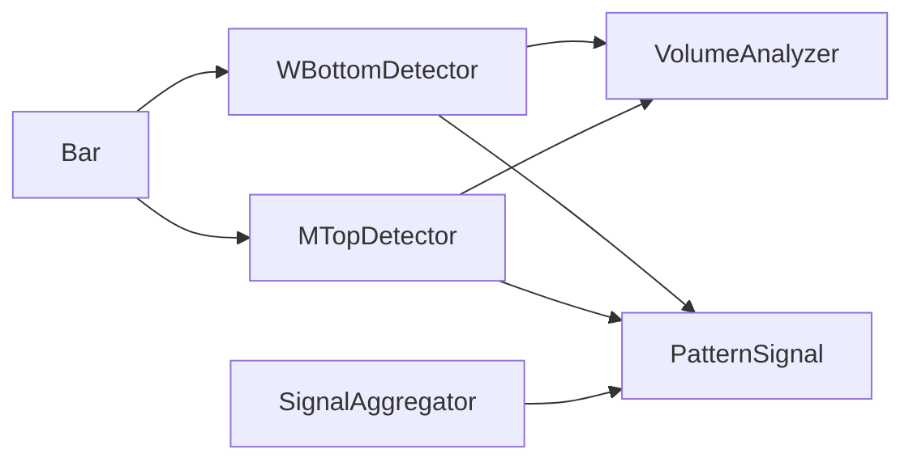

# 检测器基础架构

<cite>
**本文引用的文件**
- [detector.py](file://src/caisen/strategy/algorithm/detector.py)
- [w_bottom.py](file://src/caisen/strategy/algorithm/patterns/w_bottom.py)
- [m_top.py](file://src/caisen/strategy/algorithm/patterns/m_top.py)
- [volume_analyzer.py](file://src/caisen/strategy/algorithm/caisen_components/volume_analyzer.py)
- [aggregator.py](file://src/caisen/strategy/algorithm/caisen_components/aggregator.py)
- [bar.py](file://src/caisen/core/bar.py)
- [base.py](file://src/caisen/strategy/base.py)
- [0017-confidence-factors-model.md](file://docs/adr/0017-confidence-factors-model.md)
- [test_breakdown_pullback.py](file://tests/test_breakdown_pullback.py)
- [test_fake_breakout.py](file://tests/test_fake_breakout.py)
</cite>

## 目录
1. [引言](#引言)
2. [项目结构](#项目结构)
3. [核心组件](#核心组件)
4. [架构总览](#架构总览)
5. [详细组件分析](#详细组件分析)
6. [依赖关系分析](#依赖关系分析)
7. [性能考虑](#性能考虑)
8. [故障排查指南](#故障排查指南)
9. [结论](#结论)
10. [附录](#附录)

## 引言
本技术文档围绕形态检测器基础架构展开，重点阐述 PatternDetector 抽象基类的设计理念与纯函数接口模式，详解 PatternSignal 与 ConfidenceFactors 数据模型的结构与用途，说明检测器的生命周期管理（初始化、检测、清理），解释置信度计算机制与多维度因子分析，并提供检测器扩展指南、性能优化技巧（滑动窗口与缓存策略）、以及测试框架与调试工具的使用方法。

## 项目结构
检测器相关代码主要位于 strategy.algorithm 子包中：
- detector.py：定义抽象基类 PatternDetector、信号模型 PatternSignal、置信度因子 ConfidenceFactors
- patterns/*：具体形态检测器实现（如 WBottomDetector、MTopDetector）
- caisen_components/*：通用能力组件（VolumeAnalyzer、SignalAggregator）
- core.bar：K线数据结构 Bar
- strategy.base：策略基类 Strategy（用于回测生命周期）

图表来源
- [detector.py:80-181](file://src/caisen/strategy/algorithm/detector.py#L80-L181)
- [w_bottom.py:11-48](file://src/caisen/strategy/algorithm/patterns/w_bottom.py#L11-L48)
- [m_top.py:11-48](file://src/caisen/strategy/algorithm/patterns/m_top.py#L11-L48)
- [volume_analyzer.py:15-33](file://src/caisen/strategy/algorithm/caisen_components/volume_analyzer.py#L15-L33)
- [aggregator.py:42-110](file://src/caisen/strategy/algorithm/caisen_components/aggregator.py#L42-L110)
- [bar.py:8-38](file://src/caisen/core/bar.py#L8-L38)

章节来源
- [detector.py:1-244](file://src/caisen/strategy/algorithm/detector.py#L1-L244)
- [w_bottom.py:1-285](file://src/caisen/strategy/algorithm/patterns/w_bottom.py#L1-L285)
- [m_top.py:1-227](file://src/caisen/strategy/algorithm/patterns/m_top.py#L1-L227)
- [volume_analyzer.py:1-287](file://src/caisen/strategy/algorithm/caisen_components/volume_analyzer.py#L1-L287)
- [aggregator.py:1-177](file://src/caisen/strategy/algorithm/caisen_components/aggregator.py#L1-L177)
- [bar.py:1-38](file://src/caisen/core/bar.py#L1-L38)

## 核心组件
- PatternDetector 抽象基类
  - 纯函数接口：detect(bars) 接收完整 K 线列表，返回 PatternSignal 或 None；无内部状态、无副作用，便于并行与回测
  - 提供通用辅助方法：趋势判断、量比计算、最近 N 根 K 线获取、置信度加权求和封装、信号构造
- PatternSignal 信号模型
  - 包含形态名称、置信度、止损价、目标价、关键点 points、额外 data
  - is_valid 属性用于快速判定信号有效性（置信度>0且止损>0）
- ConfidenceFactors 四因子模型
  - completion（完成度）、volume（成交量）、trend（趋势共振）、momentum（动量）
  - weighted_sum 支持自定义权重，默认权重由 ADR 文档确定
- VolumeAnalyzer 量能分析器
  - 分阶段量能评估（形成期缩量、突破期放量、确认期持续或回踩缩量）
  - 提供 staged_volume_check、grade、volume_divergence、progressive_volume 等工具
- SignalAggregator 信号聚合器
  - 对多个检测器输出进行过滤、加权评分、选择最佳信号
  - 提供 aggregate_with_detection 便捷入口

章节来源
- [detector.py:18-181](file://src/caisen/strategy/algorithm/detector.py#L18-L181)
- [detector.py:125-193](file://src/caisen/strategy/algorithm/detector.py#L125-L193)
- [detector.py:194-244](file://src/caisen/strategy/algorithm/detector.py#L194-L244)
- [volume_analyzer.py:15-126](file://src/caisen/strategy/algorithm/caisen_components/volume_analyzer.py#L15-L126)
- [aggregator.py:16-110](file://src/caisen/strategy/algorithm/caisen_components/aggregator.py#L16-L110)
- [0017-confidence-factors-model.md:1-48](file://docs/adr/0017-confidence-factors-model.md#L1-L48)

## 架构总览
下图展示从输入 K 线到最终信号的端到端流程，包括检测、置信度计算、量能验证与聚合。

图表来源
- [detector.py:112-181](file://src/caisen/strategy/algorithm/detector.py#L112-L181)
- [volume_analyzer.py:55-126](file://src/caisen/strategy/algorithm/caisen_components/volume_analyzer.py#L55-L126)
- [aggregator.py:59-110](file://src/caisen/strategy/algorithm/caisen_components/aggregator.py#L59-L110)

## 详细组件分析

### PatternDetector 抽象基类与纯函数接口
- 设计理念
  - 只负责“看”，不做交易决策；将检测与执行解耦
  - 纯函数接口：相同输入产生相同输出，无内部状态，可重复调用与并行化
- 关键接口
  - detect(bars): 必须实现，返回 PatternSignal 或 None
  - _calculate_confidence(completion, volume, trend, momentum): 基于 ConfidenceFactors 的加权求和
  - _create_signal(pattern, confidence, stop_loss, target, points, **kwargs): 统一构造信号对象
  - 辅助方法：_get_recent_bars、_is_trend_up/down、_volume_ratio
- 生命周期管理
  - 初始化 __init__：仅保存参数与创建 VolumeAnalyzer 实例，不持有与 bars 相关的可变状态
  - 检测 detect：纯函数，无副作用
  - 清理 on_session_end/reset：检测器本身无需清理；若需外部资源释放，可在上层策略中处理

图表来源
- [detector.py:80-181](file://src/caisen/strategy/algorithm/detector.py#L80-L181)
- [detector.py:18-78](file://src/caisen/strategy/algorithm/detector.py#L18-L78)
- [volume_analyzer.py:15-126](file://src/caisen/strategy/algorithm/caisen_components/volume_analyzer.py#L15-L126)

章节来源
- [detector.py:80-181](file://src/caisen/strategy/algorithm/detector.py#L80-L181)
- [detector.py:18-78](file://src/caisen/strategy/algorithm/detector.py#L18-L78)
- [detector.py:194-244](file://src/caisen/strategy/algorithm/detector.py#L194-L244)

### 置信度计算机制与多维度因子分析
- 四因子模型
  - completion：形态结构完整性（例如双底对称性）
  - volume：关键位置是否放量确认（结合 VolumeAnalyzer 分阶段评估）
  - trend：信号方向是否与更大级别趋势一致
  - momentum：价格动量是否支持信号方向
- 权重策略
  - 默认权重：completion=0.4、volume=0.3、trend=0.2、momentum=0.1
  - 可通过配置文件调整（见 ADR 文档）
- 计算流程
  - 各因子归一化至 [0,1]
  - 加权求和后裁剪到 [0,1]

图表来源
- [detector.py:125-150](file://src/caisen/strategy/algorithm/detector.py#L125-L150)
- [0017-confidence-factors-model.md:1-48](file://docs/adr/0017-confidence-factors-model.md#L1-L48)

章节来源
- [detector.py:125-150](file://src/caisen/strategy/algorithm/detector.py#L125-L150)
- [0017-confidence-factors-model.md:1-48](file://docs/adr/0017-confidence-factors-model.md#L1-L48)

### 典型形态检测器：WBottomDetector 与 MTopDetector
- WBottomDetector（W底）
  - 条件：两个相近低点、中间高点为颈线、价格突破颈线确认
  - 置信度：完成度（双底对称）、三阶段量能、趋势共振、突破力度
  - 输出：多头信号，含止损与目标价
- MTopDetector（M头/双顶）
  - 条件：两个相近高点、中间低点为颈线、价格跌破颈线确认
  - 置信度：完成度（双顶对称）、量能、下降趋势共振、跌破力度
  - 输出：空头信号，含止损与目标价

图表来源
- [w_bottom.py:49-81](file://src/caisen/strategy/algorithm/patterns/w_bottom.py#L49-L81)
- [w_bottom.py:191-241](file://src/caisen/strategy/algorithm/patterns/w_bottom.py#L191-L241)
- [w_bottom.py:243-285](file://src/caisen/strategy/algorithm/patterns/w_bottom.py#L243-L285)
- [volume_analyzer.py:55-126](file://src/caisen/strategy/algorithm/caisen_components/volume_analyzer.py#L55-L126)

章节来源
- [w_bottom.py:1-285](file://src/caisen/strategy/algorithm/patterns/w_bottom.py#L1-L285)
- [m_top.py:1-227](file://src/caisen/strategy/algorithm/patterns/m_top.py#L1-L227)

### 量能分析器 VolumeAnalyzer
- 分阶段评估
  - formation（形成期）：期望缩量
  - breakout（突破期）：期望放量（>=阈值倍数）
  - confirm（确认期）：持续放量或缩量回踩
- 工具方法
  - get_base_volume：计算基础均量
  - staged_volume_check：批量阶段评估并返回 score/passed/details
  - grade：按突破时量级分级（weak/normal/strong）
  - volume_divergence：量价背离检测
  - progressive_volume：多点量能递增检查

图表来源
- [volume_analyzer.py:55-126](file://src/caisen/strategy/algorithm/caisen_components/volume_analyzer.py#L55-L126)
- [volume_analyzer.py:225-287](file://src/caisen/strategy/algorithm/caisen_components/volume_analyzer.py#L225-L287)

章节来源
- [volume_analyzer.py:1-287](file://src/caisen/strategy/algorithm/caisen_components/volume_analyzer.py#L1-L287)

### 信号聚合器 SignalAggregator
- 功能
  - 过滤无效信号（None 或低于阈值）
  - 按 pattern 权重加权求和得到 total_score
  - 选择置信度最高的 best_signal
- 便捷入口
  - aggregate_with_detection：一步完成多检测器 detect 与聚合

图表来源
- [aggregator.py:112-136](file://src/caisen/strategy/algorithm/caisen_components/aggregator.py#L112-L136)
- [aggregator.py:59-110](file://src/caisen/strategy/algorithm/caisen_components/aggregator.py#L59-L110)

章节来源
- [aggregator.py:1-177](file://src/caisen/strategy/algorithm/caisen_components/aggregator.py#L1-L177)

### 检测器生命周期管理与策略集成
- 检测器生命周期
  - 初始化：仅保存参数与构建 VolumeAnalyzer
  - 检测：纯函数 detect(bars)，无状态、可重复调用
  - 清理：检测器自身无需清理；如需释放外部资源，应在上层策略中处理
- 策略集成
  - Strategy 基类提供 on_init、on_bar、on_session_end、reset 钩子
  - 在 on_init 中初始化检测器集合与聚合器
  - 在 on_bar 中维护滑动窗口 bars，调用检测器 detect 并聚合结果
  - 在 on_session_end 中进行清理（如关闭文件句柄、清空缓存）

图表来源
- [base.py:19-37](file://src/caisen/strategy/base.py#L19-L37)

章节来源
- [base.py:19-37](file://src/caisen/strategy/base.py#L19-L37)

## 依赖关系分析
- 直接依赖
  - 检测器依赖 Bar 数据与 VolumeAnalyzer
  - 检测器通过 ConfidenceFactors 计算综合置信度
  - 聚合器依赖 PatternSignal 与权重配置
- 耦合与内聚
  - 检测器与策略解耦：检测器只做形态识别，策略负责订单与风控
  - 量能分析与形态检测分离，提升复用性与可测试性
- 外部依赖
  - 无第三方运行时依赖，仅标准库与本地模块

图表来源
- [bar.py:8-38](file://src/caisen/core/bar.py#L8-L38)
- [w_bottom.py:11-48](file://src/caisen/strategy/algorithm/patterns/w_bottom.py#L11-L48)
- [m_top.py:11-48](file://src/caisen/strategy/algorithm/patterns/m_top.py#L11-L48)
- [volume_analyzer.py:15-33](file://src/caisen/strategy/algorithm/caisen_components/volume_analyzer.py#L15-L33)
- [aggregator.py:42-110](file://src/caisen/strategy/algorithm/caisen_components/aggregator.py#L42-L110)

章节来源
- [bar.py:1-38](file://src/caisen/core/bar.py#L1-L38)
- [w_bottom.py:1-285](file://src/caisen/strategy/algorithm/patterns/w_bottom.py#L1-L285)
- [m_top.py:1-227](file://src/caisen/strategy/algorithm/patterns/m_top.py#L1-L227)
- [volume_analyzer.py:1-287](file://src/caisen/strategy/algorithm/caisen_components/volume_analyzer.py#L1-L287)
- [aggregator.py:1-177](file://src/caisen/strategy/algorithm/caisen_components/aggregator.py#L1-L177)

## 性能考虑
- 滑动窗口处理
  - 在策略 on_bar 中维护固定长度的 bars 窗口，避免每次全量扫描
  - 使用 _get_recent_bars 快速获取最近 N 根 K 线，降低时间复杂度
- 缓存策略
  - 对 VolumeAnalyzer 的基础均量、阶段得分等进行缓存，避免重复计算
  - 对置信度因子（如趋势判断）做短期缓存，减少重复趋势计算
- 批量检测与并行
  - 利用纯函数特性，对多标的或多时间周期并行调用 detect
  - 使用 aggregate_with_detection 一次性完成检测与聚合，减少外部循环开销
- 内存与对象分配
  - 重用 Bar 与 PatternSignal 对象，减少频繁分配
  - 控制 points 与 data 字段大小，避免不必要的序列化开销

[本节为通用指导，不涉及具体文件分析]

## 故障排查指南
- 常见问题
  - 不足 min_bars 根 K 线：检测器返回 None，需确保输入长度满足要求
  - 无明显整理平台：形态识别失败，检查 max_amplitude 与 lookback_period 参数
  - 假突破误判：调整 fake_tolerance 与 max_fallback_bars，结合量能等级 grade 进行二次过滤
  - 置信度过低：检查四因子权重与阈值，必要时调高 threshold 过滤低质量信号
- 定位手段
  - 打印 staged_volume_check 的 details，观察各阶段 ratio_to_base 与 passed 情况
  - 对比 signal.points 与原始 bars，确认关键点识别是否正确
  - 使用 select_best_signal 与 calculate_weighted_score 验证聚合逻辑
- 参考测试用例
  - BreakdownPullbackDetector 行为断言（买点、止损/目标、置信度范围）
  - FakeBreakoutDetector 行为断言（假突破强度、方向 short）

章节来源
- [test_breakdown_pullback.py:1-131](file://tests/test_breakdown_pullback.py#L1-L131)
- [test_fake_breakout.py:1-114](file://tests/test_fake_breakout.py#L1-L114)
- [aggregator.py:139-177](file://src/caisen/strategy/algorithm/caisen_components/aggregator.py#L139-L177)

## 结论
本架构以纯函数接口为核心，将形态识别、量能评估与信号聚合解耦，提升了可测试性与可扩展性。四因子置信度模型在多维度上评估信号质量，配合滑动窗口与缓存策略，兼顾性能与准确性。通过清晰的检测器生命周期与策略集成点，开发者可以快速扩展新的形态检测器并融入现有回测体系。

## 附录
- 扩展自定义检测器步骤
  - 继承 PatternDetector，实现 detect(bars)
  - 使用 _calculate_confidence 与 _create_signal 生成标准化信号
  - 根据需要组合 VolumeAnalyzer 的阶段评估与趋势/动量因子
  - 编写单元测试覆盖边界条件与置信度范围
- 最佳实践
  - 保持 detect 纯函数特性，避免内部可变状态
  - 合理设置容差与阈值，避免过拟合历史数据
  - 使用聚合器进行多信号融合，提高鲁棒性
  - 在策略层维护滑动窗口与缓存，提升整体性能

[本节为概念性内容，不涉及具体文件分析]