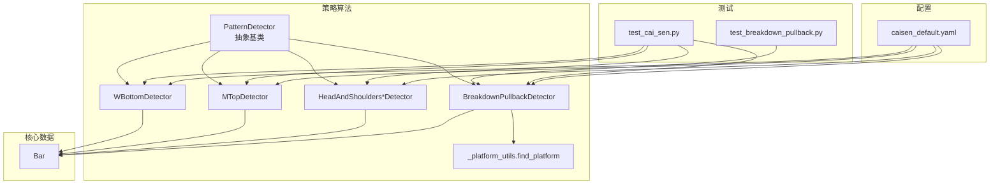
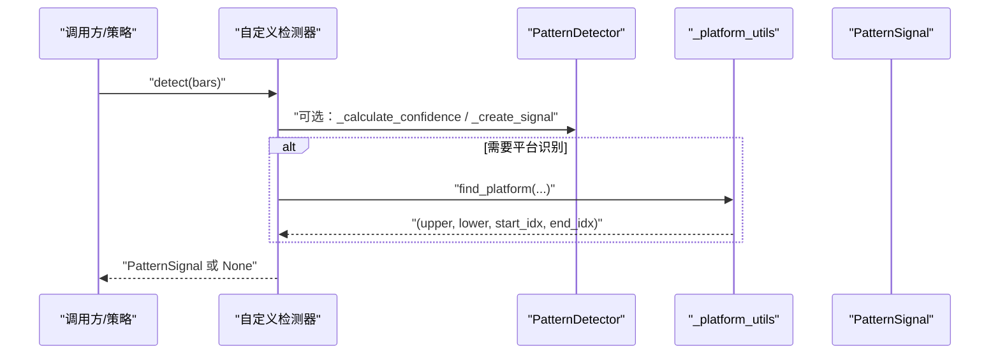
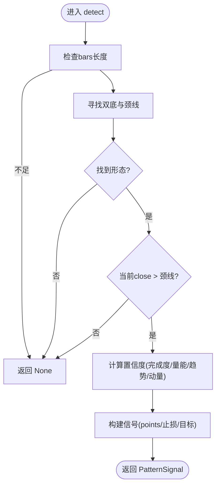
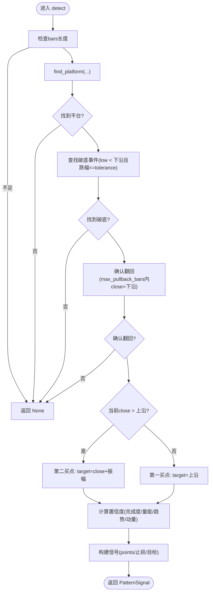
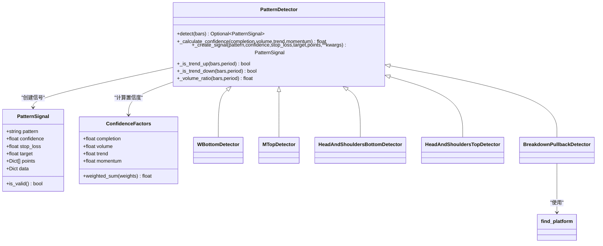

# 自定义检测器开发

<cite>
**本文引用的文件**   
- [detector.py](file://src/caisen/strategy/algorithm/detector.py)
- [w_bottom.py](file://src/caisen/strategy/algorithm/patterns/w_bottom.py)
- [m_top.py](file://src/caisen/strategy/algorithm/patterns/m_top.py)
- [head_shoulders.py](file://src/caisen/strategy/algorithm/patterns/head_shoulders.py)
- [breakdown_pullback.py](file://src/caisen/strategy/algorithm/patterns/breakdown_pullback.py)
- [_platform_utils.py](file://src/caisen/strategy/algorithm/patterns/_platform_utils.py)
- [__init__.py](file://src/caisen/strategy/algorithm/patterns/__init__.py)
- [bar.py](file://src/caisen/core/bar.py)
- [test_breakdown_pullback.py](file://tests/test_breakdown_pullback.py)
- [test_cai_sen.py](file://tests/test_cai_sen.py)
- [caisen_default.yaml](file://configs/strategies/caisen_default.yaml)
</cite>

## 目录
1. [简介](#简介)
2. [项目结构](#项目结构)
3. [核心组件](#核心组件)
4. [架构总览](#架构总览)
5. [详细组件分析](#详细组件分析)
6. [依赖关系分析](#依赖关系分析)
7. [性能与优化](#性能与优化)
8. [测试与调试指南](#测试与调试指南)
9. [结论](#结论)
10. [附录](#附录)

## 简介
本指南面向希望扩展形态检测能力的开发者，系统讲解如何基于 PatternDetector 基类实现自定义形态检测器。内容涵盖：
- detect 方法的接口约定、输入输出规范与返回值格式
- 从简单到复杂的完整示例（W底、M头、头肩顶/底、破底翻）
- 检测器注册机制与配置系统集成方式
- 性能优化技巧（向量化计算、内存管理）
- 单元测试编写与调试可视化验证方法

## 项目结构
本项目将形态检测器集中于 strategy/algorithm/patterns 模块，统一继承自 detector.PatternDetector，并通过 __init__.py 集中导出。K线数据模型位于 core.bar.Bar。

图表来源
- [detector.py:80-123](file://src/caisen/strategy/algorithm/detector.py#L80-L123)
- [w_bottom.py:11-80](file://src/caisen/strategy/algorithm/patterns/w_bottom.py#L11-L80)
- [m_top.py:11-78](file://src/caisen/strategy/algorithm/patterns/m_top.py#L11-L78)
- [head_shoulders.py:11-91](file://src/caisen/strategy/algorithm/patterns/head_shoulders.py#L11-L91)
- [breakdown_pullback.py:17-128](file://src/caisen/strategy/algorithm/patterns/breakdown_pullback.py#L17-L128)
- [_platform_utils.py:12-73](file://src/caisen/strategy/algorithm/patterns/_platform_utils.py#L12-L73)
- [bar.py:8-38](file://src/caisen/core/bar.py#L8-L38)
- [test_breakdown_pullback.py:33-131](file://tests/test_breakdown_pullback.py#L33-L131)
- [test_cai_sen.py:25-196](file://tests/test_cai_sen.py#L25-L196)
- [caisen_default.yaml:1-50](file://configs/strategies/caisen_default.yaml#L1-L50)

章节来源
- [detector.py:80-123](file://src/caisen/strategy/algorithm/detector.py#L80-L123)
- [__init__.py:1-27](file://src/caisen/strategy/algorithm/patterns/__init__.py#L1-L27)
- [bar.py:8-38](file://src/caisen/core/bar.py#L8-L38)

## 核心组件
- PatternDetector 抽象基类
  - 提供纯函数式 detect(bars) 接口，无内部状态，便于并行与回测
  - 内置置信度计算工具 _calculate_confidence、信号构造 _create_signal、趋势与量比辅助方法
- PatternSignal 信号数据结构
  - 包含 pattern、confidence、stop_loss、target、points、data 等字段
  - is_valid 属性用于快速判断信号有效性
- ConfidenceFactors 置信度因子
  - completion/volume/trend/momentum 四因子加权求和，默认权重可配置
- Bar K线数据模型
  - timestamp/symbol/freq/open/high/low/close/volume 标准字段

章节来源
- [detector.py:18-78](file://src/caisen/strategy/algorithm/detector.py#L18-L78)
- [detector.py:80-123](file://src/caisen/strategy/algorithm/detector.py#L80-L123)
- [detector.py:125-180](file://src/caisen/strategy/algorithm/detector.py#L125-L180)
- [bar.py:8-38](file://src/caisen/core/bar.py#L8-L38)

## 架构总览
下图展示检测器调用流程：策略或上层编排传入 bars，各检测器独立运行 detect，返回 PatternSignal；平台识别工具被复杂形态复用。

图表来源
- [detector.py:112-123](file://src/caisen/strategy/algorithm/detector.py#L112-L123)
- [detector.py:125-180](file://src/caisen/strategy/algorithm/detector.py#L125-L180)
- [_platform_utils.py:12-73](file://src/caisen/strategy/algorithm/patterns/_platform_utils.py#L12-L73)

## 详细组件分析

### 基类与信号契约
- 接口要求
  - detect(bars: List[Bar]) -> Optional[PatternSignal]
  - 输入为完整 K 线列表，至少满足最小窗口长度
  - 输出为信号或 None；信号必须包含有效止损价与置信度
- 置信度与信号构造
  - 使用 _calculate_confidence 聚合四因子
  - 使用 _create_signal 生成标准化信号对象
- 常用辅助
  - _is_trend_up/_is_trend_down 趋势判断
  - _volume_ratio 量比估算
  - _get_recent_bars 窗口切片

章节来源
- [detector.py:112-123](file://src/caisen/strategy/algorithm/detector.py#L112-L123)
- [detector.py:125-180](file://src/caisen/strategy/algorithm/detector.py#L125-L180)
- [detector.py:194-243](file://src/caisen/strategy/algorithm/detector.py#L194-L243)

### W底检测器（简单形态）
- 形态条件
  - 双底容差、颈线高度阈值、突破确认
- 置信度构成
  - 完成度（两底对称性）、成交量（三阶段量能）、趋势共振、动量（突破力度）
- 关键点与风控
  - points 标注左底、右底、颈线突破位置
  - stop_loss 基于最低点系数，target 基于振幅或最小盈利目标

图表来源
- [w_bottom.py:49-80](file://src/caisen/strategy/algorithm/patterns/w_bottom.py#L49-L80)
- [w_bottom.py:191-241](file://src/caisen/strategy/algorithm/patterns/w_bottom.py#L191-L241)
- [w_bottom.py:135-189](file://src/caisen/strategy/algorithm/patterns/w_bottom.py#L135-L189)

章节来源
- [w_bottom.py:11-80](file://src/caisen/strategy/algorithm/patterns/w_bottom.py#L11-L80)
- [w_bottom.py:191-241](file://src/caisen/strategy/algorithm/patterns/w_bottom.py#L191-L241)

### M头检测器（简单形态）
- 形态条件
  - 双顶容差、颈线深度阈值、跌破确认
- 置信度构成
  - 完成度（两顶对称性）、成交量、下降趋势共振、跌破动量
- 关键点与风控
  - points 标注左顶、右顶、颈线跌破位置
  - stop_loss 基于最高点系数，target 基于振幅

章节来源
- [m_top.py:11-78](file://src/caisen/strategy/algorithm/patterns/m_top.py#L11-L78)
- [m_top.py:179-226](file://src/caisen/strategy/algorithm/patterns/m_top.py#L179-L226)

### 头肩顶/底检测器（组合形态）
- 形态条件
  - 头部为极值点，左右肩高度相近且满足高度区间约束
  - 颈线由两肩之间的高/低点确定
- 置信度构成
  - 完成度（两肩对称性）、成交量、趋势共振、突破/跌破动量
- 关键点与风控
  - points 标注左肩、头、右肩
  - 止损基于头部的低/高点系数，目标基于振幅或最小盈利目标

章节来源
- [head_shoulders.py:11-91](file://src/caisen/strategy/algorithm/patterns/head_shoulders.py#L11-L91)
- [head_shoulders.py:137-170](file://src/caisen/strategy/algorithm/patterns/head_shoulders.py#L137-L170)
- [head_shoulders.py:173-247](file://src/caisen/strategy/algorithm/patterns/head_shoulders.py#L173-L247)
- [head_shoulders.py:293-322](file://src/caisen/strategy/algorithm/patterns/head_shoulders.py#L293-L322)

### 破底翻检测器（复杂组合形态）
- 形态条件
  - 识别整理平台（上沿/下沿）
  - 破底事件：low 跌破下沿但跌幅不超过容忍度
  - 翻回确认：在限定根数内 close 回到下沿之上
  - 买点类型：第一买点（站回下沿）、第二买点（突破上沿）
- 置信度构成
  - 完成度（破底深度浅、翻回快）、分阶段量能、前期下跌趋势共振、翻回动量
- 关键点与风控
  - points 标注平台上沿/下沿、破底低点、翻回确认
  - 止损基于破底低点系数，目标基于买点类型

图表来源
- [breakdown_pullback.py:47-128](file://src/caisen/strategy/algorithm/patterns/breakdown_pullback.py#L47-L128)
- [breakdown_pullback.py:177-216](file://src/caisen/strategy/algorithm/patterns/breakdown_pullback.py#L177-L216)
- [_platform_utils.py:12-73](file://src/caisen/strategy/algorithm/patterns/_platform_utils.py#L12-L73)

章节来源
- [breakdown_pullback.py:17-128](file://src/caisen/strategy/algorithm/patterns/breakdown_pullback.py#L17-L128)
- [breakdown_pullback.py:177-216](file://src/caisen/strategy/algorithm/patterns/breakdown_pullback.py#L177-L216)
- [_platform_utils.py:12-73](file://src/caisen/strategy/algorithm/patterns/_platform_utils.py#L12-L73)

### 检测器注册与配置集成
- 集中导出
  - patterns/__init__.py 统一导出所有检测器，便于外部按名称启用
- 配置开关与权重
  - caisen_default.yaml 中 patterns 段控制各形态开关，pattern_weights 用于质量评分
- 策略侧集成
  - CaiSenStrategy 支持 enabled_patterns 参数动态启用指定检测器集合
  - from_config 可从字典加载策略参数与权重

章节来源
- [__init__.py:1-27](file://src/caisen/strategy/algorithm/patterns/__init__.py#L1-L27)
- [caisen_default.yaml:26-50](file://configs/strategies/caisen_default.yaml#L26-L50)
- [test_cai_sen.py:34-49](file://tests/test_cai_sen.py#L34-L49)
- [test_cai_sen.py:168-184](file://tests/test_cai_sen.py#L168-L184)

## 依赖关系分析
- 耦合与内聚
  - 各检测器仅依赖 PatternDetector 提供的通用能力，内聚于各自形态逻辑
  - 复杂形态通过 _platform_utils 共享平台识别逻辑，降低重复代码
- 外部依赖
  - Bar 作为唯一数据输入载体，保持检测器与数据源解耦
  - VolumeAnalyzer 在基类初始化时注入，用于分阶段量能评估

图表来源
- [detector.py:18-78](file://src/caisen/strategy/algorithm/detector.py#L18-L78)
- [detector.py:80-123](file://src/caisen/strategy/algorithm/detector.py#L80-L123)
- [w_bottom.py:11-80](file://src/caisen/strategy/algorithm/patterns/w_bottom.py#L11-L80)
- [m_top.py:11-78](file://src/caisen/strategy/algorithm/patterns/m_top.py#L11-L78)
- [head_shoulders.py:11-91](file://src/caisen/strategy/algorithm/patterns/head_shoulders.py#L11-L91)
- [breakdown_pullback.py:17-128](file://src/caisen/strategy/algorithm/patterns/breakdown_pullback.py#L17-L128)
- [_platform_utils.py:12-73](file://src/caisen/strategy/algorithm/patterns/_platform_utils.py#L12-L73)

章节来源
- [detector.py:80-123](file://src/caisen/strategy/algorithm/detector.py#L80-L123)
- [__init__.py:1-27](file://src/caisen/strategy/algorithm/patterns/__init__.py#L1-L27)

## 性能与优化
- 向量化计算
  - 对 bars 的滑动窗口操作尽量使用 numpy/pandas 向量化替代 Python 循环
  - 平台识别 find_platform 的双层滑动窗口可改为向量化振幅与长度打分
- 内存管理
  - 避免在 detect 中创建大对象；复用中间结果，减少临时列表分配
  - 对长序列分批处理，限制最大回看窗口
- 增量更新
  - 将趋势与量比指标维护为滚动统计，避免每次全量重算
- 并行化
  - 多标的或多时间框架场景下，可对不同检测器实例并行执行 detect

[本节为通用指导，不直接分析具体文件]

## 测试与调试指南
- 单元测试要点
  - 边界条件：bars 数量不足、无明显形态、跌破过深、未翻回等
  - 信号校验：pattern 名称、confidence 范围、stop_loss/target 合理性、points 完整性
  - 置信度因子：确保四因子取值合理并影响最终置信度
- 参考用例
  - 破底翻：覆盖无信号、无平台、破底未翻回、第一/第二买点、置信度与止损目标
  - 蔡森策略集成：启用特定形态、多形态组合、全部十二形态、假突破与破底翻启用
- 调试与可视化
  - 利用 PatternSignal.points 中的 timestamp/price/label 进行图表标注
  - 打印关键中间变量（平台上下沿、破底索引、翻回索引）辅助定位问题

章节来源
- [test_breakdown_pullback.py:33-131](file://tests/test_breakdown_pullback.py#L33-L131)
- [test_cai_sen.py:25-196](file://tests/test_cai_sen.py#L25-L196)

## 结论
通过统一的 PatternDetector 纯函数接口与标准化的 PatternSignal 输出，自定义形态检测器的开发与集成变得简洁而可扩展。借助平台识别工具与分阶段量能评估，复杂组合形态的实现更加稳健。配合完善的单元测试与可视化验证，可快速迭代并保障检测质量。

[本节为总结性内容，不直接分析具体文件]

## 附录
- 开发清单
  - 定义检测器类并继承 PatternDetector
  - 实现 detect(bars)，严格遵循输入输出契约
  - 使用 _calculate_confidence 与 _create_signal 生成标准化信号
  - 在 patterns/__init__.py 中导出新检测器
  - 在配置文件 patterns 段添加开关与权重
  - 编写单元测试覆盖典型与异常路径
  - 使用 points 进行可视化验证

[本节为补充说明，不直接分析具体文件]