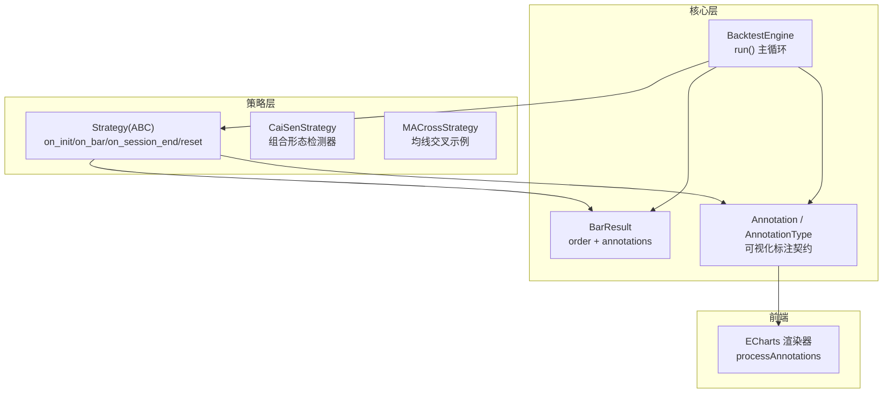
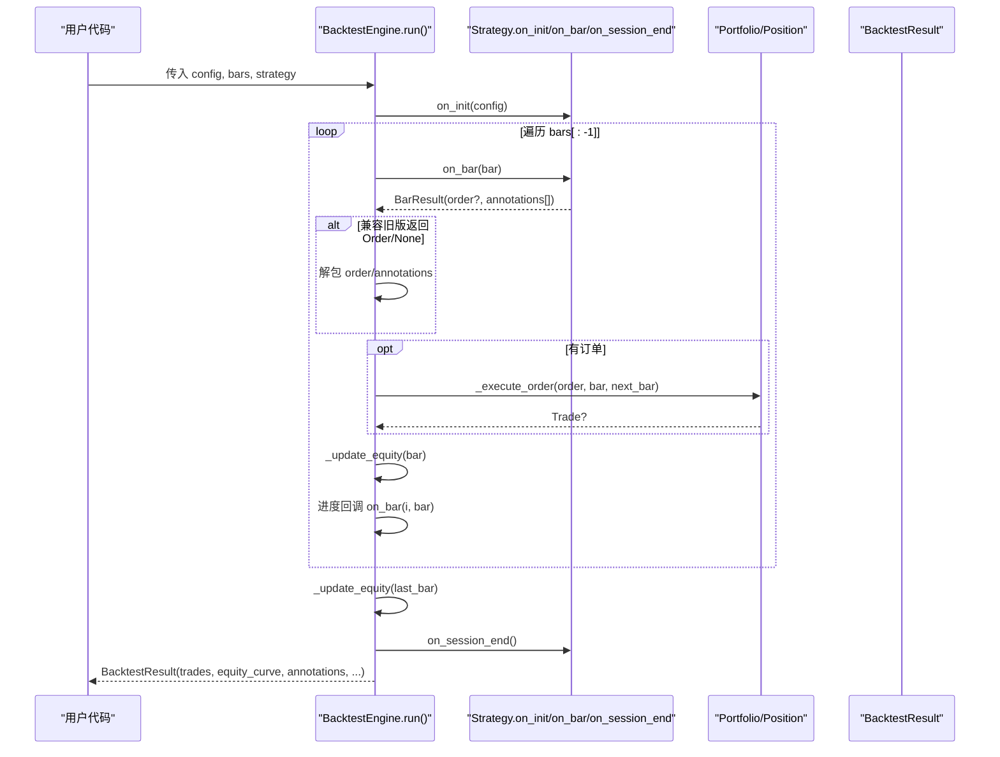
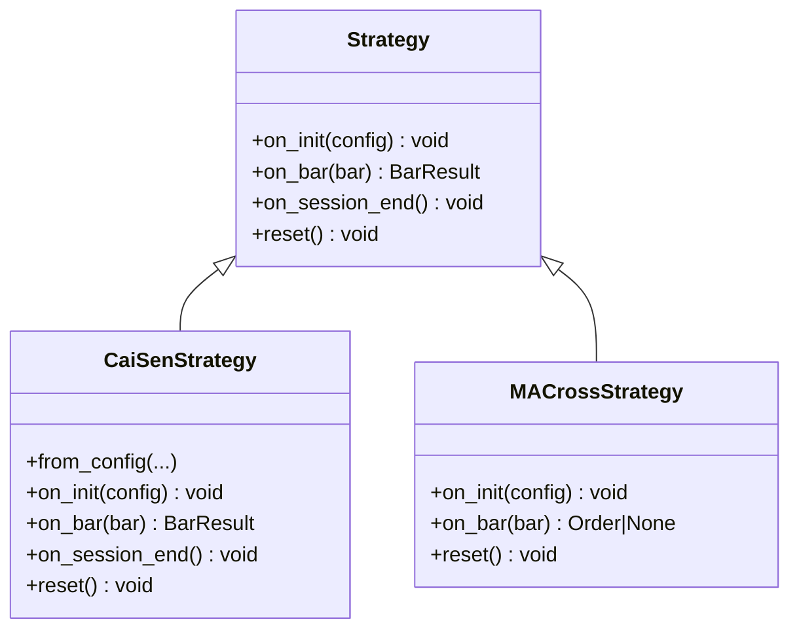
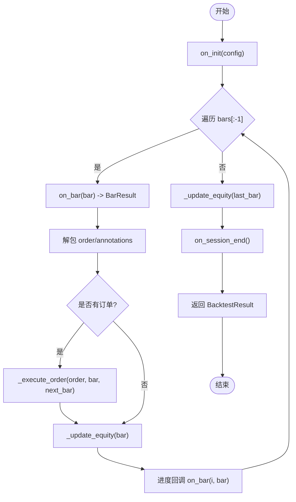
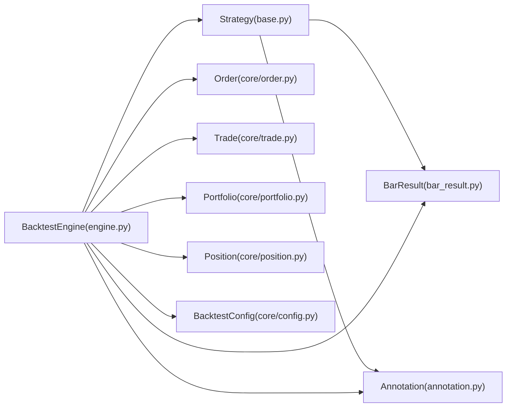

# 策略基类设计

<cite>
**本文引用的文件**   
- [src/caisen/strategy/base.py](file://src/caisen/strategy/base.py)
- [src/caisen/core/bar_result.py](file://src/caisen/core/bar_result.py)
- [src/caisen/core/annotation.py](file://src/caisen/core/annotation.py)
- [src/caisen/core/engine.py](file://src/caisen/core/engine.py)
- [examples/ma_cross.py](file://examples/ma_cross.py)
- [src/caisen/strategy/algorithm/cai_sen.py](file://src/caisen/strategy/algorithm/cai_sen.py)
- [tests/test_strategy_base.py](file://tests/test_strategy_base.py)
- [tests/test_backtest_engine.py](file://tests/test_backtest_engine.py)
- [docs/adr/0003-strategy-abc-interface.md](file://docs/adr/0003-strategy-abc-interface.md)
- [docs/adr/0005-visualization-annotations.md](file://docs/adr/0005-visualization-annotations.md)
</cite>

## 目录
1. [简介](#简介)
2. [项目结构](#项目结构)
3. [核心组件](#核心组件)
4. [架构总览](#架构总览)
5. [详细组件分析](#详细组件分析)
6. [依赖关系分析](#依赖关系分析)
7. [性能考虑](#性能考虑)
8. [故障排查指南](#故障排查指南)
9. [结论](#结论)
10. [附录](#附录)

## 简介
本文件围绕 Strategy 抽象基类及其相关契约，系统化阐述策略生命周期管理、BarResult 数据结构与返回格式、Annotation/AnnotationType 在可视化标注中的作用，并提供完整的策略开发示例。同时给出状态管理最佳实践、错误处理机制、性能优化建议，以及策略与回测引擎的集成方式和数据流处理机制。

## 项目结构
Strategy 基类位于 strategy 层，核心数据模型 BarResult 与 Annotation 位于 core 层，回测引擎 BacktestEngine 负责调度策略并执行订单。前端通过持久化的 annotations 进行可视化渲染。

图表来源
- [src/caisen/strategy/base.py:19-37](file://src/caisen/strategy/base.py#L19-L37)
- [src/caisen/core/bar_result.py:21-41](file://src/caisen/core/bar_result.py#L21-L41)
- [src/caisen/core/annotation.py:13-139](file://src/caisen/core/annotation.py#L13-L139)
- [src/caisen/core/engine.py:33-91](file://src/caisen/core/engine.py#L33-L91)
- [src/caisen/frontend/src/js/annotation-renderer.js:15-36](file://src/caisen/frontend/src/js/annotation-renderer.js#L15-L36)

章节来源
- [src/caisen/strategy/base.py:19-37](file://src/caisen/strategy/base.py#L19-L37)
- [src/caisen/core/bar_result.py:1-41](file://src/caisen/core/bar_result.py#L1-L41)
- [src/caisen/core/annotation.py:1-139](file://src/caisen/core/annotation.py#L1-L139)
- [src/caisen/core/engine.py:1-210](file://src/caisen/core/engine.py#L1-L210)

## 核心组件
- Strategy 抽象基类：定义策略生命周期钩子与 on_bar 返回值契约。
- BarResult：封装单根 K 线的交易决策（可选 Order）与可视化标注列表。
- Annotation/AnnotationType：前后端共享的可视化标注语义化类型与数据载体。
- BacktestEngine：驱动策略运行、执行订单、累积净值与标注，并产出结果。

章节来源
- [src/caisen/strategy/base.py:19-37](file://src/caisen/strategy/base.py#L19-L37)
- [src/caisen/core/bar_result.py:21-41](file://src/caisen/core/bar_result.py#L21-L41)
- [src/caisen/core/annotation.py:13-139](file://src/caisen/core/annotation.py#L13-L139)
- [src/caisen/core/engine.py:33-91](file://src/caisen/core/engine.py#L33-L91)

## 架构总览
下图展示了从回测启动到每根 K 线处理的完整调用链，包括兼容旧版返回 Order/None 的处理逻辑。

图表来源
- [src/caisen/core/engine.py:33-91](file://src/caisen/core/engine.py#L33-L91)
- [src/caisen/strategy/base.py:22-37](file://src/caisen/strategy/base.py#L22-L37)

章节来源
- [src/caisen/core/engine.py:33-91](file://src/caisen/core/engine.py#L33-L91)

## 详细组件分析

### Strategy 抽象基类与生命周期
- on_init(config): 回测开始前调用，用于读取配置或初始化内部状态。默认空实现，子类可覆盖。
- on_bar(bar): 每根 K 线必调，必须返回 BarResult。该方法是策略的核心决策入口。
- on_session_end(): 回测结束后调用，可用于清理资源或输出日志。
- reset(): 重置策略状态，便于多次运行同一策略实例时隔离状态。

设计理念
- 将“决策”与“执行”解耦：策略只负责决策（返回 BarResult），引擎负责执行订单与记录净值。
- 生命周期清晰：初始化→逐 bar 决策→结束清理，便于调试与扩展。
- 向后兼容：引擎对旧版返回 Order/None 的策略仍支持，降低迁移成本。

调用时机
- on_init: run() 开始时调用一次。
- on_bar: 对 bars[:-1] 逐条调用；bars[-1] 仅更新净值不调用 on_bar。
- on_session_end: 所有 bar 处理完成后调用一次。
- reset: 由外部控制，通常在多轮回测前手动调用。

章节来源
- [src/caisen/strategy/base.py:19-37](file://src/caisen/strategy/base.py#L19-L37)
- [src/caisen/core/engine.py:44-75](file://src/caisen/core/engine.py#L44-L75)
- [docs/adr/0003-strategy-abc-interface.md:1-11](file://docs/adr/0003-strategy-abc-interface.md#L1-L11)

#### 类图（Strategy 及常用工厂方法）

图表来源
- [src/caisen/strategy/base.py:19-37](file://src/caisen/strategy/base.py#L19-L37)
- [src/caisen/strategy/algorithm/cai_sen.py:36-245](file://src/caisen/strategy/algorithm/cai_sen.py#L36-L245)
- [examples/ma_cross.py:10-45](file://examples/ma_cross.py#L10-L45)

### BarResult 数据结构与返回格式
- 字段
  - order: 可选订单，None 表示本 bar 不交易。
  - annotations: 本 bar 新增的可视化标注列表，空列表表示无标注。
- 快捷构造
  - no_action(): 无订单、无标注。
  - with_order(order, annotations=None): 带订单的便捷构造。
- 返回要求
  - on_bar 必须返回 BarResult（引擎会解包 order 与 annotations）。
  - 为兼容旧策略，引擎也接受直接返回 Order/None，但推荐统一使用 BarResult。

使用建议
- 每根 bar 的决策与标注应集中在 BarResult 中返回，避免在策略内维护全局标注列表。
- 若无交易且无需标注，优先使用 BarResult.no_action()。

章节来源
- [src/caisen/core/bar_result.py:1-41](file://src/caisen/core/bar_result.py#L1-L41)
- [src/caisen/core/engine.py:48-56](file://src/caisen/core/engine.py#L48-L56)
- [tests/test_strategy_base.py:53-68](file://tests/test_strategy_base.py#L53-L68)

### Annotation 与 AnnotationType 在可视化标注中的作用
- AnnotationType 枚举定义了多种标注类型，如买卖信号、水平线、趋势线、支撑/阻力区间、文本标签、形态标记等。
- Annotation 是策略、结果、前端之间的共享契约，包含 type、timestamp 与 data。
- 提供便捷工厂方法：buy_signal、sell_signal、horizontal_line、pattern_mark、text_label 等，简化创建流程。
- to_dict 支持序列化，便于持久化与前端渲染。

作用范围
- 策略侧：在 on_bar 中按需生成 Annotation，放入 BarResult.annotations。
- 引擎侧：累积所有 annotations 到结果对象。
- 前端侧：根据 type 选择渲染器，绘制 markPoints/markLines 等图形元素。

章节来源
- [src/caisen/core/annotation.py:13-139](file://src/caisen/core/annotation.py#L13-L139)
- [docs/adr/0005-visualization-annotations.md:1-23](file://docs/adr/0005-visualization-annotations.md#L1-L23)
- [src/caisen/frontend/src/js/annotation-renderer.js:15-36](file://src/caisen/frontend/src/js/annotation-renderer.js#L15-L36)

### 策略与回测引擎的集成方式与数据流
- 集成点
  - BacktestEngine.run(strategy, bars) 驱动策略生命周期。
  - 每根 bar 调用 strategy.on_bar(bar)，解包 BarResult.order 并执行订单，累积 annotations。
  - 最终返回 BacktestResult，包含 trades、equity_curve、annotations 等。
- 数据流
  - 输入：BacktestConfig + List[Bar] + Strategy 实例。
  - 处理：on_init → 循环 on_bar → on_session_end。
  - 输出：BacktestResult（含交易、净值曲线、标注）。

图表来源
- [src/caisen/core/engine.py:33-91](file://src/caisen/core/engine.py#L33-L91)

章节来源
- [src/caisen/core/engine.py:33-91](file://src/caisen/core/engine.py#L33-L91)

### 完整策略开发示例（继承 Strategy 实现自定义逻辑）
- 基础示例：MA Cross 策略（旧式返回 Order/None，引擎兼容）。
  - 参考路径：[examples/ma_cross.py:10-45](file://examples/ma_cross.py#L10-L45)
- 现代示例：CaiSenStrategy（返回 BarResult，附带 pattern_mark 标注）。
  - 参考路径：[src/caisen/strategy/algorithm/cai_sen.py:178-221](file://src/caisen/strategy/algorithm/cai_sen.py#L178-L221)
- 测试用例：验证 on_bar 返回 BarResult、注解收集等。
  - 参考路径：[tests/test_strategy_base.py:53-68](file://tests/test_strategy_base.py#L53-L68)
  - 参考路径：[tests/test_backtest_engine.py:155-165](file://tests/test_backtest_engine.py#L155-L165)

开发步骤建议
- 继承 Strategy，实现 on_bar，返回 BarResult。
- 需要交易时，构造 Order 并通过 BarResult.with_order 返回。
- 需要可视化标注时，使用 Annotation 工厂方法构建，放入 annotations。
- 在 on_init 中读取配置，在 reset 中清空内部缓存。

章节来源
- [examples/ma_cross.py:10-45](file://examples/ma_cross.py#L10-L45)
- [src/caisen/strategy/algorithm/cai_sen.py:178-221](file://src/caisen/strategy/algorithm/cai_sen.py#L178-L221)
- [tests/test_strategy_base.py:53-68](file://tests/test_strategy_base.py#L53-L68)
- [tests/test_backtest_engine.py:155-165](file://tests/test_backtest_engine.py#L155-L165)

## 依赖关系分析
- Strategy 依赖 core 中的 BarResult、Annotation、AnnotationType。
- BacktestEngine 依赖 Strategy、BarResult、Annotation、Order、Trade、Portfolio、Position、BacktestConfig。
- 前端依赖后端输出的 annotations 进行渲染。

图表来源
- [src/caisen/strategy/base.py:19-37](file://src/caisen/strategy/base.py#L19-L37)
- [src/caisen/core/bar_result.py:21-41](file://src/caisen/core/bar_result.py#L21-L41)
- [src/caisen/core/annotation.py:13-139](file://src/caisen/core/annotation.py#L13-L139)
- [src/caisen/core/engine.py:1-210](file://src/caisen/core/engine.py#L1-L210)

章节来源
- [src/caisen/core/engine.py:1-210](file://src/caisen/core/engine.py#L1-L210)

## 性能考虑
- 避免在 on_bar 中进行昂贵计算：尽量增量维护指标或使用滑动窗口缓存。
- 减少对象分配：复用 BarResult 与 Annotation 实例，或使用工厂方法批量构造。
- 控制 annotations 数量：仅在关键节点生成标注，避免过多导致前端渲染压力。
- 利用 Engine 的 on_bar 进度回调进行长序列回测时的 UI 反馈与断点续跑。

## 故障排查指南
- 常见问题
  - on_bar 未返回 BarResult：若返回 Order/None，引擎仍可兼容，但建议统一改为 BarResult。
  - annotations 未显示：检查 Annotation.type 是否被前端渲染器支持，确认 timestamp 与 data 字段完整。
  - 净值曲线不一致：确保 _update_equity 在每根 bar 后正确调用，final_equity 应与最后一点一致。
- 定位手段
  - 使用单元测试验证 on_bar 返回类型与注解收集行为。
  - 打印/记录 BarResult 的 order 与 annotations 内容，确认数据流。
  - 对比 BacktestResult.equity_curve 与 final_equity 的一致性。

章节来源
- [tests/test_strategy_base.py:53-78](file://tests/test_strategy_base.py#L53-L78)
- [tests/test_backtest_engine.py:155-165](file://tests/test_backtest_engine.py#L155-L165)
- [tests/test_equity_final.py:41-70](file://tests/test_equity_final.py#L41-L70)

## 结论
Strategy 抽象基类以清晰的接口与生命周期管理，将策略决策与引擎执行解耦；BarResult 作为统一的返回契约，简化了订单与标注的输出；Annotation/AnnotationType 提供了前后端一致的可视化标注语义。遵循本文的最佳实践与示例，可快速实现高性能、可观测、易维护的交易策略。

## 附录
- 策略模板库规划与分类参见 ADR 与 Issue 文档，建议按趋势跟踪、均值回归、风险管理等类别组织模板，提升复用性与可组合性。
- 可视化报告方案采用 HTML+ECharts，标注数据持久化于 runs/{run_id}/data.json，便于离线分析与复现。