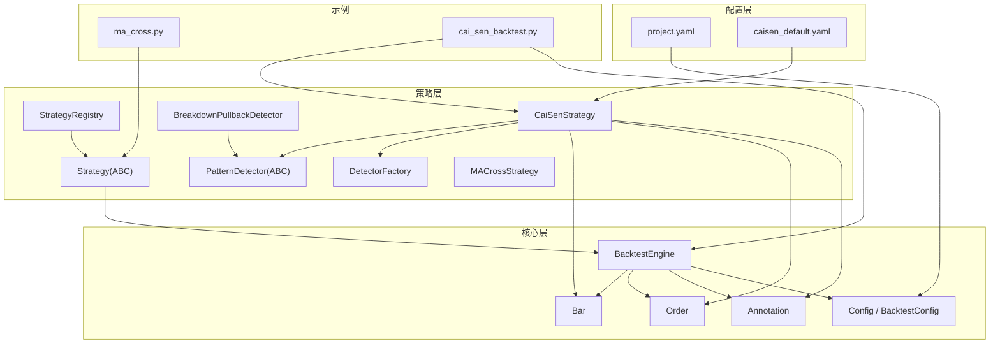
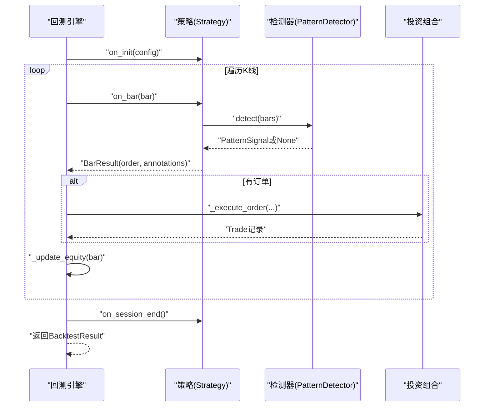
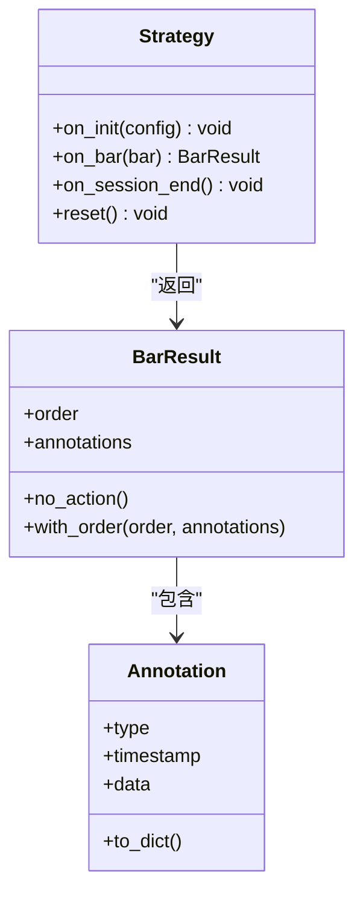
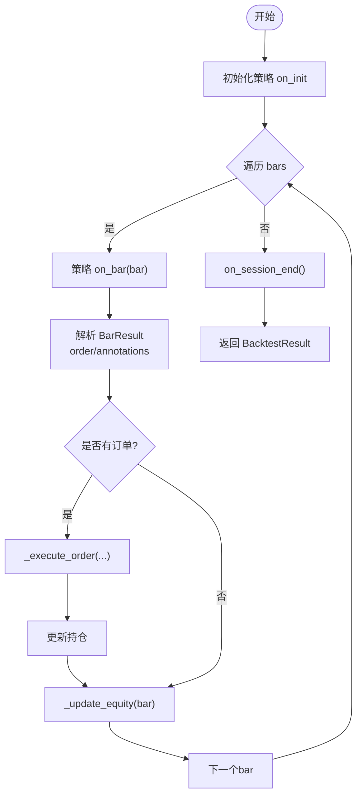
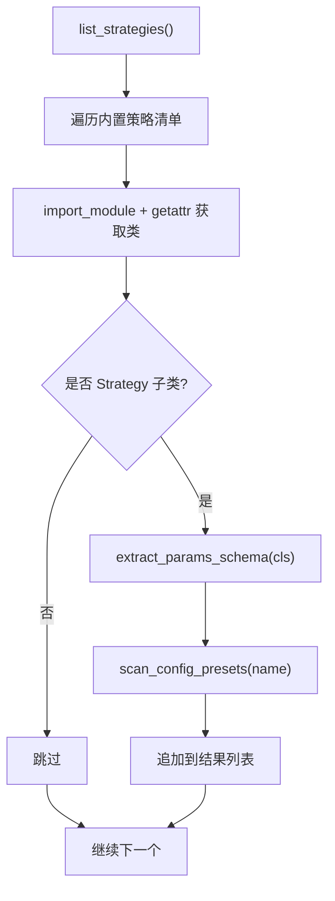
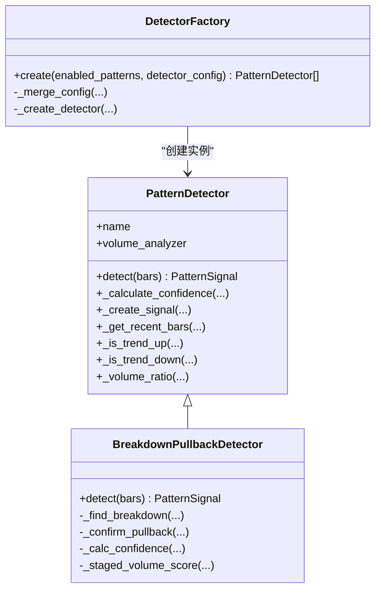
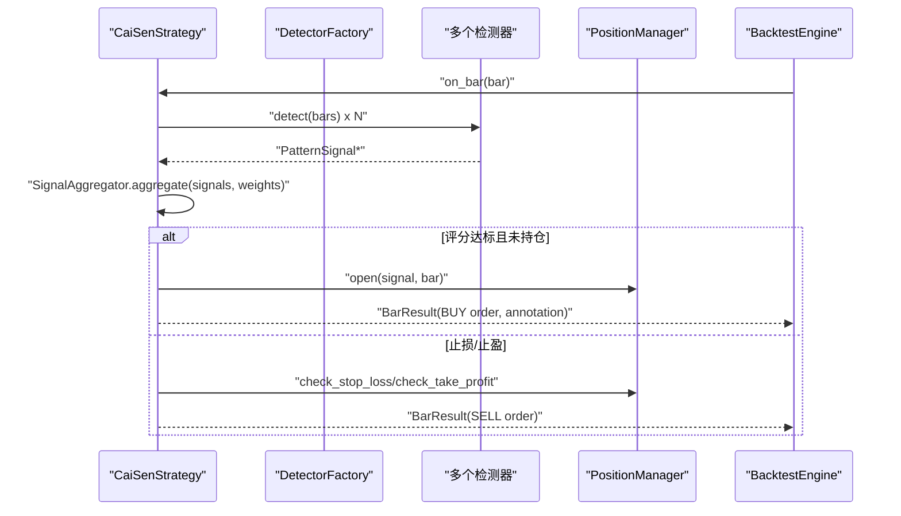
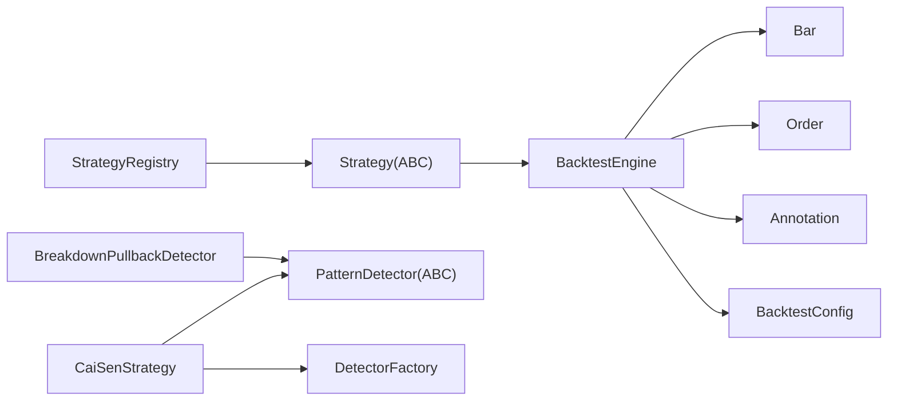

# 策略框架

<cite>
**本文引用的文件**   
- [src/caisen/strategy/base.py](file://src/caisen/strategy/base.py)
- [src/caisen/core/engine.py](file://src/caisen/core/engine.py)
- [src/caisen/core/bar_result.py](file://src/caisen/core/bar_result.py)
- [src/caisen/core/config.py](file://src/caisen/core/config.py)
- [src/caisen/core/bar.py](file://src/caisen/core/bar.py)
- [src/caisen/core/order.py](file://src/caisen/core/order.py)
- [src/caisen/core/annotation.py](file://src/caisen/core/annotation.py)
- [src/caisen/strategy/registry.py](file://src/caisen/strategy/registry.py)
- [src/caisen/strategy/algorithm/detector.py](file://src/caisen/strategy/algorithm/detector.py)
- [src/caisen/strategy/algorithm/factory.py](file://src/caisen/strategy/algorithm/caisen_components/factory.py)
- [src/caisen/strategy/algorithm/patterns/breakdown_pullback.py](file://src/caisen/strategy/algorithm/patterns/breakdown_pullback.py)
- [src/caisen/strategy/algorithm/cai_sen.py](file://src/caisen/strategy/algorithm/cai_sen.py)
- [configs/project.yaml](file://configs/project.yaml)
- [configs/strategies/caisen_default.yaml](file://configs/strategies/caisen_default.yaml)
- [examples/ma_cross.py](file://examples/ma_cross.py)
- [examples/cai_sen_backtest.py](file://examples/cai_sen_backtest.py)
</cite>

## 目录
1. [简介](#简介)
2. [项目结构](#项目结构)
3. [核心组件](#核心组件)
4. [架构总览](#架构总览)
5. [详细组件分析](#详细组件分析)
6. [依赖关系分析](#依赖关系分析)
7. [性能与优化](#性能与优化)
8. [故障排查指南](#故障排查指南)
9. [结论](#结论)
10. [附录：配置与示例](#附录配置与示例)

## 简介
本技术文档围绕 Caisen 策略框架，系统性阐述以下主题：
- Strategy 抽象基类的设计理念、生命周期管理与 on_bar 回调机制
- 状态管理与信号生成接口（BarResult、Annotation）
- 策略注册表系统（动态发现与加载）
- 检测器架构（PatternDetector 基类与自定义开发方法）
- 策略配置管理系统（YAML 结构与参数校验）
- 策略与回测引擎的集成方式与数据流处理
- 最佳实践（性能优化、错误处理、调试技巧）
- 完整示例（从均线交叉到复杂形态识别）

## 项目结构
Caisen 采用分层与模块化组织：
- core：核心数据类型与回测引擎（Bar、Order、Annotation、BacktestEngine、Config）
- strategy：策略基类、注册表、算法实现与检测器
- configs：全局与策略级 YAML 配置
- examples：示例脚本与模板
- result：结果计算与持久化（在本文档中作为引用）

图表来源
- [src/caisen/core/engine.py:1-209](file://src/caisen/core/engine.py#L1-L209)
- [src/caisen/strategy/base.py:1-37](file://src/caisen/strategy/base.py#L1-L37)
- [src/caisen/strategy/algorithm/detector.py:1-244](file://src/caisen/strategy/algorithm/detector.py#L1-L244)
- [src/caisen/strategy/algorithm/caisen_components/factory.py:1-237](file://src/caisen/strategy/algorithm/caisen_components/factory.py#L1-L237)
- [src/caisen/strategy/algorithm/cai_sen.py:1-245](file://src/caisen/strategy/algorithm/cai_sen.py#L1-L245)
- [src/caisen/core/bar.py:1-38](file://src/caisen/core/bar.py#L1-L38)
- [src/caisen/core/order.py:1-43](file://src/caisen/core/order.py#L1-L43)
- [src/caisen/core/annotation.py:1-139](file://src/caisen/core/annotation.py#L1-L139)
- [src/caisen/core/config.py:1-94](file://src/caisen/core/config.py#L1-L94)
- [configs/project.yaml:1-13](file://configs/project.yaml#L1-L13)
- [configs/strategies/caisen_default.yaml:1-50](file://configs/strategies/caisen_default.yaml#L1-L50)
- [examples/ma_cross.py:1-45](file://examples/ma_cross.py#L1-L45)
- [examples/cai_sen_backtest.py:1-183](file://examples/cai_sen_backtest.py#L1-L183)

章节来源
- [src/caisen/core/engine.py:1-209](file://src/caisen/core/engine.py#L1-L209)
- [src/caisen/strategy/base.py:1-37](file://src/caisen/strategy/base.py#L1-L37)
- [src/caisen/core/config.py:1-94](file://src/caisen/core/config.py#L1-L94)
- [configs/project.yaml:1-13](file://configs/project.yaml#L1-L13)

## 核心组件
- Strategy 抽象基类：定义 on_init、on_bar、on_session_end、reset 生命周期钩子；on_bar 返回 BarResult（兼容旧版 Order/None）。
- BarResult：封装单根 K 线的订单与标注输出。
- Annotation：可视化标注契约，贯穿策略、结果与前端。
- BacktestEngine：驱动策略运行、执行订单、更新持仓与净值曲线、收集标注。
- PatternDetector：纯函数式形态检测器基类，提供 detect(bars) 接口与置信度计算工具。
- DetectorFactory：按名称创建具体检测器实例并合并默认与用户配置。
- CaiSenStrategy：组合多检测器，聚合评分，管理仓位与风控，产出交易决策。
- MACrossStrategy：简单均线交叉策略示例，演示基础用法。

章节来源
- [src/caisen/strategy/base.py:1-37](file://src/caisen/strategy/base.py#L1-L37)
- [src/caisen/core/bar_result.py:1-41](file://src/caisen/core/bar_result.py#L1-L41)
- [src/caisen/core/annotation.py:1-139](file://src/caisen/core/annotation.py#L1-L139)
- [src/caisen/core/engine.py:1-209](file://src/caisen/core/engine.py#L1-L209)
- [src/caisen/strategy/algorithm/detector.py:1-244](file://src/caisen/strategy/algorithm/detector.py#L1-L244)
- [src/caisen/strategy/algorithm/caisen_components/factory.py:1-237](file://src/caisen/strategy/algorithm/caisen_components/factory.py#L1-L237)
- [src/caisen/strategy/algorithm/cai_sen.py:1-245](file://src/caisen/strategy/algorithm/cai_sen.py#L1-L245)
- [examples/ma_cross.py:1-45](file://examples/ma_cross.py#L1-L45)

## 架构总览
下图展示策略与回测引擎的核心交互流程：引擎每根 K 线调用策略 on_bar，策略返回 BarResult；引擎解包订单与标注，执行成交并更新净值与持仓。

图表来源
- [src/caisen/core/engine.py:33-91](file://src/caisen/core/engine.py#L33-L91)
- [src/caisen/strategy/algorithm/detector.py:112-123](file://src/caisen/strategy/algorithm/detector.py#L112-L123)
- [src/caisen/core/bar_result.py:21-41](file://src/caisen/core/bar_result.py#L21-L41)

## 详细组件分析

### Strategy 抽象基类与生命周期
- 设计要点：
  - on_init：回测前初始化，可读取配置。
  - on_bar：每根 K 线触发，返回 BarResult（含可选订单与标注），支持兼容旧版直接返回 Order/None。
  - on_session_end：回测结束清理。
  - reset：重置内部状态，便于重复运行。
- 数据契约：
  - BarResult：order 与 annotations 的组合，避免策略维护全局标注列表。
  - Annotation：统一标注类型与序列化，供可视化渲染。

图表来源
- [src/caisen/strategy/base.py:19-37](file://src/caisen/strategy/base.py#L19-L37)
- [src/caisen/core/bar_result.py:21-41](file://src/caisen/core/bar_result.py#L21-L41)
- [src/caisen/core/annotation.py:39-81](file://src/caisen/core/annotation.py#L39-L81)

章节来源
- [src/caisen/strategy/base.py:19-37](file://src/caisen/strategy/base.py#L19-L37)
- [src/caisen/core/bar_result.py:1-41](file://src/caisen/core/bar_result.py#L1-L41)
- [src/caisen/core/annotation.py:1-139](file://src/caisen/core/annotation.py#L1-L139)

### 回测引擎与数据流
- 控制流：
  - 初始化策略 on_init。
  - 主循环逐 bar 调用 on_bar，解析 BarResult，执行订单，更新净值与持仓，累积标注。
  - 结束阶段调用 on_session_end，汇总结果。
- 订单执行：
  - 成交价基于下一根开盘价，考虑滑点与手续费。
  - 数量计算支持固定数量与仓位比例（全仓或按比例）。
  - 持仓更新逻辑覆盖开仓、加仓、平仓、反向开仓等场景。
- 净值曲线：
  - 每根 bar 后根据当前价格计算权益并记录。

图表来源
- [src/caisen/core/engine.py:33-91](file://src/caisen/core/engine.py#L33-L91)
- [src/caisen/core/engine.py:93-209](file://src/caisen/core/engine.py#L93-L209)

章节来源
- [src/caisen/core/engine.py:1-209](file://src/caisen/core/engine.py#L1-L209)

### 策略注册表系统
- 功能：
  - 内置策略清单：code 与 llm 两类，支持显示名与备注。
  - 动态导入：importlib 加载模块与类，反射检查是否为 Strategy 子类。
  - 参数 Schema 提取：从 __init__ 签名推断参数类型与默认值。
  - 配置预设扫描：根据策略名映射到 configs/strategies 下以特定前缀命名的 .yaml 文件。
- 使用建议：
  - 新增策略时，在内置清单中添加条目，并在 configs/strategies 下放置对应前缀的配置预设。
  - 确保 __init__ 参数具备默认值以便 schema 提取。

图表来源
- [src/caisen/strategy/registry.py:108-135](file://src/caisen/strategy/registry.py#L108-L135)
- [src/caisen/strategy/registry.py:50-68](file://src/caisen/strategy/registry.py#L50-L68)
- [src/caisen/strategy/registry.py:71-105](file://src/caisen/strategy/registry.py#L71-L105)

章节来源
- [src/caisen/strategy/registry.py:1-135](file://src/caisen/strategy/registry.py#L1-L135)

### 检测器架构与自定义开发
- 基类 PatternDetector：
  - 纯函数接口 detect(bars)，无内部状态，便于测试与并行。
  - 提供置信度加权计算、趋势判断、成交量放大倍数等通用工具。
  - 内置 VolumeAnalyzer 用于分阶段量能确认。
- 典型实现 BreakdownPullbackDetector：
  - 平台识别 → 破底事件 → 拉回确认 → 买点分类（第一/第二买点）→ 止损与目标价 → 置信度计算。
  - 关键点 points 用于可视化标注。
- 工厂 DetectorFactory：
  - 根据 enabled_patterns 与 detector_config 合并默认与用户配置，创建具体检测器实例。

图表来源
- [src/caisen/strategy/algorithm/detector.py:80-244](file://src/caisen/strategy/algorithm/detector.py#L80-L244)
- [src/caisen/strategy/algorithm/patterns/breakdown_pullback.py:17-259](file://src/caisen/strategy/algorithm/patterns/breakdown_pullback.py#L17-L259)
- [src/caisen/strategy/algorithm/caisen_components/factory.py:54-237](file://src/caisen/strategy/algorithm/caisen_components/factory.py#L54-L237)

章节来源
- [src/caisen/strategy/algorithm/detector.py:1-244](file://src/caisen/strategy/algorithm/detector.py#L1-L244)
- [src/caisen/strategy/algorithm/patterns/breakdown_pullback.py:1-259](file://src/caisen/strategy/algorithm/patterns/breakdown_pullback.py#L1-L259)
- [src/caisen/strategy/algorithm/caisen_components/factory.py:1-237](file://src/caisen/strategy/algorithm/caisen_components/factory.py#L1-L237)

### 蔡森策略（组合形态检测）
- 组件化职责：
  - DetectorFactory：按配置创建检测器。
  - SignalAggregator：聚合各检测器信号并计算综合评分。
  - PositionManager：管理持仓、止损与止盈。
- 决策流程：
  - 每根 bar 更新历史 K 线，调用所有检测器 detect。
  - 聚合评分，若最高信号置信度超过阈值且未持仓则入场。
  - 止损/止盈检查触发出场。
  - 入场时构造 BarResult，附带形态标注。

图表来源
- [src/caisen/strategy/algorithm/cai_sen.py:174-245](file://src/caisen/strategy/algorithm/cai_sen.py#L174-L245)
- [src/caisen/strategy/algorithm/caisen_components/factory.py:81-111](file://src/caisen/strategy/algorithm/caisen_components/factory.py#L81-L111)

章节来源
- [src/caisen/strategy/algorithm/cai_sen.py:1-245](file://src/caisen/strategy/algorithm/cai_sen.py#L1-L245)

### 简单均线交叉策略示例
- 特点：
  - 维护最近收盘价序列，计算快慢均线。
  - 金叉买入、死叉卖出，quantity=0 表示按仓位比例或全仓。
  - 演示 Strategy 基本用法与 on_bar 返回 Order 的兼容模式。

章节来源
- [examples/ma_cross.py:1-45](file://examples/ma_cross.py#L1-L45)
- [src/caisen/core/engine.py:47-70](file://src/caisen/core/engine.py#L47-L70)

## 依赖关系分析
- 耦合与内聚：
  - Strategy 与 Engine 通过 BarResult 与 Annotation 解耦，职责清晰。
  - Detector 与 Strategy 分离，检测器只负责“看”，不交易。
  - Factory 集中管理检测器创建与配置合并，降低策略复杂度。
- 外部依赖：
  - YAML 配置加载（pyyaml）。
  - UUID 生成订单 ID。
  - datetime 时间戳序列化。

图表来源
- [src/caisen/core/engine.py:1-209](file://src/caisen/core/engine.py#L1-L209)
- [src/caisen/strategy/base.py:1-37](file://src/caisen/strategy/base.py#L1-L37)
- [src/caisen/strategy/algorithm/detector.py:1-244](file://src/caisen/strategy/algorithm/detector.py#L1-L244)
- [src/caisen/strategy/algorithm/caisen_components/factory.py:1-237](file://src/caisen/strategy/algorithm/caisen_components/factory.py#L1-L237)
- [src/caisen/strategy/registry.py:1-135](file://src/caisen/strategy/registry.py#L1-L135)

章节来源
- [src/caisen/core/engine.py:1-209](file://src/caisen/core/engine.py#L1-L209)
- [src/caisen/strategy/registry.py:1-135](file://src/caisen/strategy/registry.py#L1-L135)

## 性能与优化
- 检测器纯函数化：
  - 无内部状态，可并行测试与批量评估，减少副作用。
- 增量计算：
  - 对均线等指标可采用滑动窗口增量更新，避免重复求和。
- 批量检测：
  - 将 detect 输入为最近 N 根 K 线，限制 lookback 范围，降低 O(n^2) 风险。
- 配置合并缓存：
  - DetectorFactory 可缓存已创建的检测器实例，避免重复构建。
- 订单执行优化：
  - 批量更新持仓与净值，减少对象创建开销。
- 日志与断点：
  - 在关键分支添加结构化日志，便于定位性能瓶颈。

[本节为通用指导，无需源码引用]

## 故障排查指南
- 常见错误与定位：
  - 配置文件缺失或路径错误：检查 project.yaml 与策略 YAML 路径。
  - 策略导入失败：注册表会跳过异常，查看内置清单与模块路径是否正确。
  - 参数 Schema 为空：确保 __init__ 参数具有默认值。
  - 订单未成交：检查 quantity 与 position_pct 设置、可用资金与滑点/手续费。
  - 标注未显示：确认 BarResult.annotations 非空且 type 合法。
- 调试技巧：
  - 在 on_bar 入口打印 bar 索引与关键指标。
  - 使用最小数据集复现问题。
  - 逐步关闭检测器，定位问题形态。

章节来源
- [src/caisen/strategy/registry.py:115-134](file://src/caisen/strategy/registry.py#L115-L134)
- [src/caisen/core/engine.py:93-156](file://src/caisen/core/engine.py#L93-L156)
- [src/caisen/core/bar_result.py:21-41](file://src/caisen/core/bar_result.py#L21-L41)

## 结论
Caisen 策略框架通过清晰的抽象与模块化设计，实现了策略与引擎的解耦、检测器的纯函数化与可扩展性。结合注册表与配置系统，开发者可以快速发现、加载与迭代策略。配合完善的示例与可视化标注，既适合快速原型验证，也适用于复杂形态识别与系统化回测。

[本节为总结，无需源码引用]

## 附录：配置与示例

### 全局与策略配置
- 全局配置 project.yaml：
  - data_dir：本地行情数据根目录（Parquet 存储）。
  - output_dir：回测结果输出目录。
  - api_port：Web 服务端口。
- 策略配置 caisen_default.yaml：
  - params：平台与形态参数（如平台振幅、破底容忍度、拉回最大K线数等）。
  - patterns：形态开关。
  - pattern_weights：形态权重（质量评分）。

章节来源
- [configs/project.yaml:1-13](file://configs/project.yaml#L1-L13)
- [configs/strategies/caisen_default.yaml:1-50](file://configs/strategies/caisen_default.yaml#L1-L50)

### 示例脚本
- 均线交叉示例 ma_cross.py：
  - 演示 Strategy 继承、on_bar 返回 Order、position 管理。
- 蔡森策略回测示例 cai_sen_backtest.py：
  - 生成整理平台与破底翻场景数据。
  - 使用 CaiSenStrategy 与 BacktestEngine 进行回测。
  - 输出交易记录、信号与绩效指标。

章节来源
- [examples/ma_cross.py:1-45](file://examples/ma_cross.py#L1-L45)
- [examples/cai_sen_backtest.py:1-183](file://examples/cai_sen_backtest.py#L1-L183)