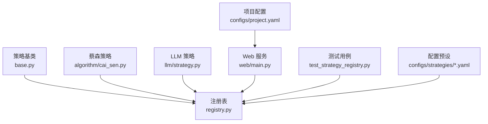
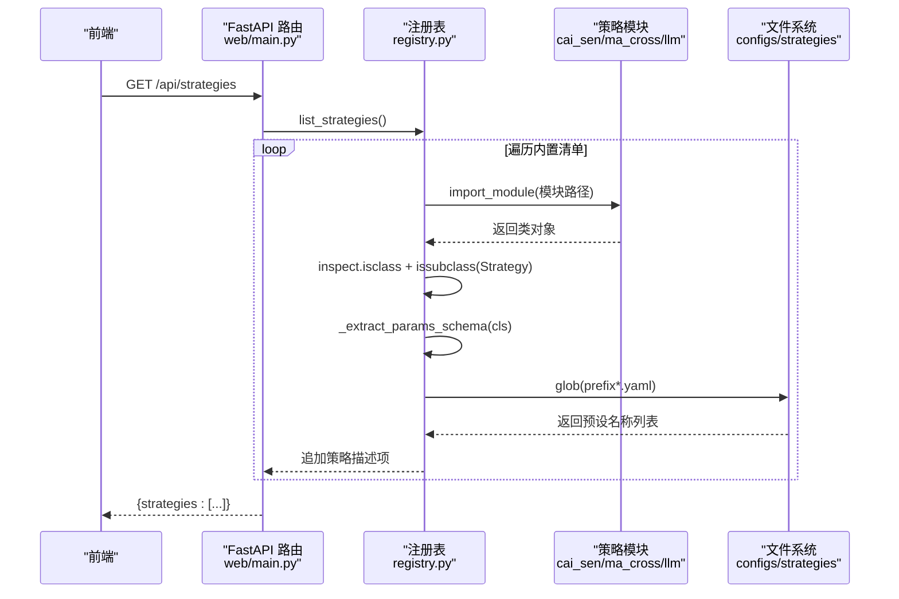
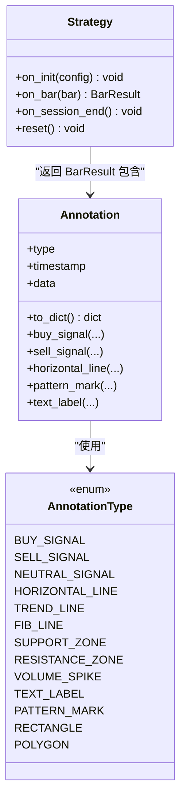
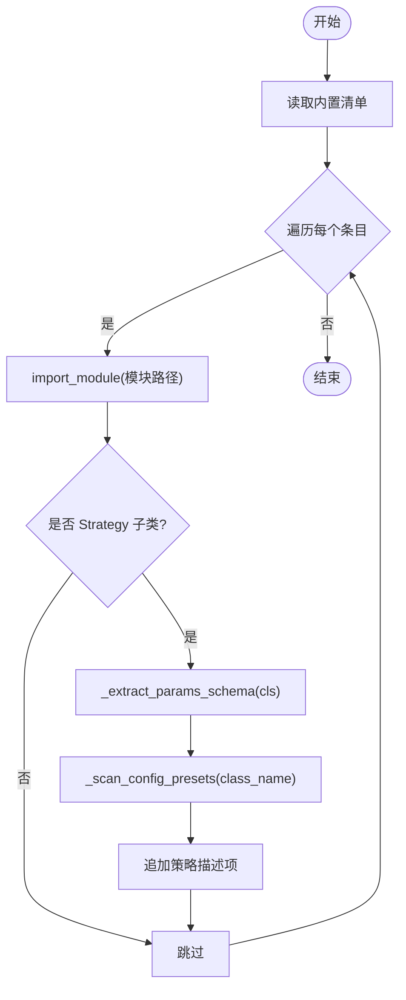
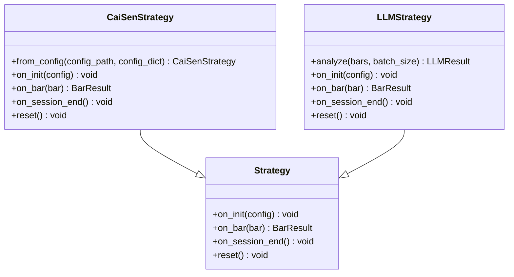
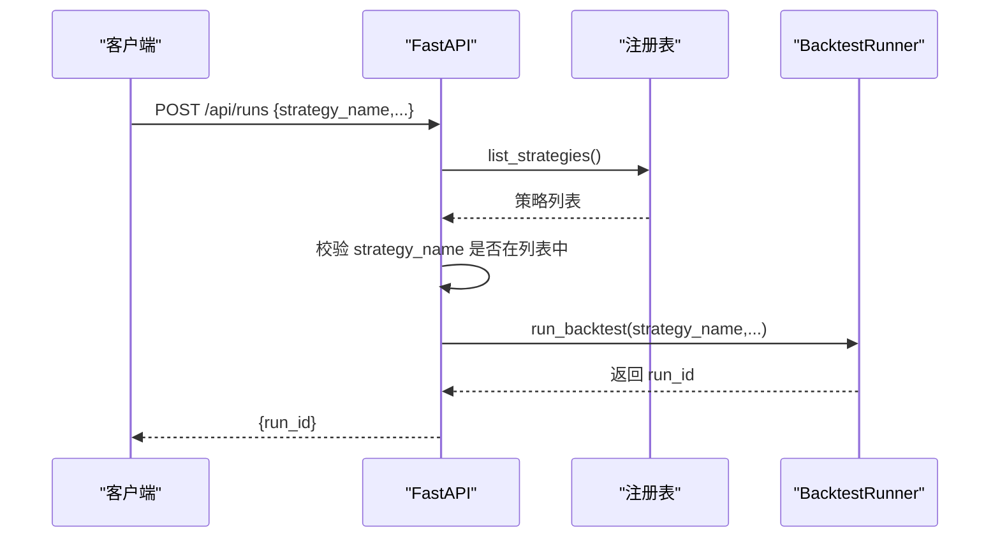
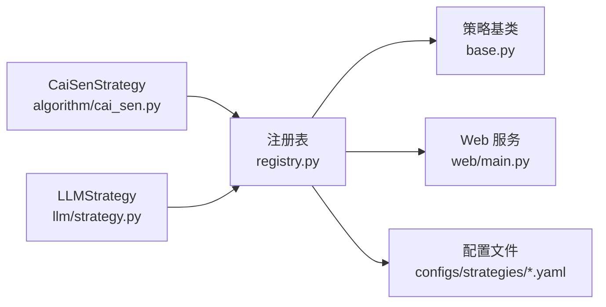

# 策略注册表系统

<cite>
**本文引用的文件**   
- [src/caisen/strategy/registry.py](file://src/caisen/strategy/registry.py)
- [src/caisen/strategy/base.py](file://src/caisen/strategy/base.py)
- [src/caisen/core/annotation.py](file://src/caisen/core/annotation.py)
- [src/caisen/strategy/algorithm/cai_sen.py](file://src/caisen/strategy/algorithm/cai_sen.py)
- [src/caisen/strategy/llm/strategy.py](file://src/caisen/strategy/llm/strategy.py)
- [src/caisen/web/main.py](file://src/caisen/web/main.py)
- [tests/test_strategy_registry.py](file://tests/test_strategy_registry.py)
- [configs/strategies/caisen_default.yaml](file://configs/strategies/caisen_default.yaml)
- [configs/project.yaml](file://configs/project.yaml)
</cite>

## 目录
1. [简介](#简介)
2. [项目结构](#项目结构)
3. [核心组件](#核心组件)
4. [架构总览](#架构总览)
5. [详细组件分析](#详细组件分析)
6. [依赖关系分析](#依赖关系分析)
7. [性能与并发特性](#性能与并发特性)
8. [故障排查指南](#故障排查指南)
9. [结论](#结论)
10. [附录：开发与实践指南](#附录开发与实践指南)

## 简介
本技术文档围绕“策略注册表系统”展开，聚焦以下目标：
- 动态策略发现与加载机制（内置清单、模块导入、参数 Schema 提取、配置预设扫描）
- 装饰器模式的使用现状与扩展点设计（当前实现为显式清单 + 反射；提供装饰器化改造建议）
- 策略分类管理与版本控制（type 字段、note 说明、配置预设前缀映射）
- 自定义策略注册方式与配置文件引用语法
- 策略包开发规范（目录结构、命名约定、依赖管理）
- 冲突解决与命名空间管理（类名唯一性、类型隔离）
- 线程安全性与扩展点设计
- 实际注册与使用示例（Web API、测试用例）

## 项目结构
策略注册表位于 strategy 子系统中，核心由“基类定义 + 注册表 + Web 暴露 + 测试验证”构成。关键路径如下：
- 策略基类：src/caisen/strategy/base.py
- 注册表：src/caisen/strategy/registry.py
- 内置策略示例：src/caisen/strategy/algorithm/cai_sen.py、src/caisen/strategy/llm/strategy.py
- Web 服务暴露：src/caisen/web/main.py
- 测试用例：tests/test_strategy_registry.py
- 配置预设：configs/strategies/*.yaml
- 项目全局配置：configs/project.yaml

图表来源
- [src/caisen/strategy/registry.py:1-143](file://src/caisen/strategy/registry.py#L1-L143)
- [src/caisen/strategy/base.py:1-37](file://src/caisen/strategy/base.py#L1-L37)
- [src/caisen/strategy/algorithm/cai_sen.py:1-245](file://src/caisen/strategy/algorithm/cai_sen.py#L1-L245)
- [src/caisen/strategy/llm/strategy.py:1-235](file://src/caisen/strategy/llm/strategy.py#L1-L235)
- [src/caisen/web/main.py:1-319](file://src/caisen/web/main.py#L1-L319)
- [tests/test_strategy_registry.py:1-62](file://tests/test_strategy_registry.py#L1-L62)
- [configs/strategies/caisen_default.yaml:1-50](file://configs/strategies/caisen_default.yaml#L1-L50)
- [configs/project.yaml:1-13](file://configs/project.yaml#L1-L13)

章节来源
- [src/caisen/strategy/registry.py:1-143](file://src/caisen/strategy/registry.py#L1-L143)
- [src/caisen/strategy/base.py:1-37](file://src/caisen/strategy/base.py#L1-L37)
- [src/caisen/web/main.py:102-106](file://src/caisen/web/main.py#L102-L106)
- [tests/test_strategy_registry.py:1-62](file://tests/test_strategy_registry.py#L1-L62)

## 核心组件
- 策略基类 Strategy：定义生命周期钩子 on_init、on_bar、on_session_end、reset，以及返回的 BarResult 和 Annotation 契约。
- 注册表 StrategyRegistry：维护内置策略清单，动态导入并校验是否为 Strategy 子类，提取参数 Schema，扫描配置预设，提供 list_strategies 与 get_module_path。
- Web 接口 /api/strategies：通过注册表返回可用策略列表，供前端展示与选择。
- 内置策略示例：CaiSenStrategy（组合形态检测）、MACrossStrategy（均线交叉）、LLMStrategy（离线预计算）。

章节来源
- [src/caisen/strategy/base.py:19-37](file://src/caisen/strategy/base.py#L19-L37)
- [src/caisen/strategy/registry.py:108-143](file://src/caisen/strategy/registry.py#L108-L143)
- [src/caisen/web/main.py:102-106](file://src/caisen/web/main.py#L102-L106)
- [src/caisen/strategy/algorithm/cai_sen.py:36-245](file://src/caisen/strategy/algorithm/cai_sen.py#L36-L245)
- [src/caisen/strategy/llm/strategy.py:15-235](file://src/caisen/strategy/llm/strategy.py#L15-L235)

## 架构总览
注册表采用“显式清单 + 运行时反射”的模式：
- 清单驱动：_BUILTIN_STRATEGIES 声明模块路径、类名、显示名、类型与备注
- 运行时发现：importlib.import_module 动态导入，inspect.isclass + issubclass 校验
- 元数据生成：从 __init__ 签名提取参数 Schema；扫描 configs/strategies 下匹配前缀的 YAML 预设
- 对外暴露：Web 层调用 list_strategies 返回结构化信息

图表来源
- [src/caisen/web/main.py:102-106](file://src/caisen/web/main.py#L102-L106)
- [src/caisen/strategy/registry.py:108-143](file://src/caisen/strategy/registry.py#L108-L143)
- [src/caisen/strategy/registry.py:50-68](file://src/caisen/strategy/registry.py#L50-L68)
- [src/caisen/strategy/registry.py:71-105](file://src/caisen/strategy/registry.py#L71-L105)

## 详细组件分析

### 策略基类与可视化标注契约
- Strategy 抽象基类定义了策略生命周期与每根 K 线的处理入口，返回 BarResult（订单与标注集合）。
- Annotation 与 AnnotationType 作为跨层共享契约，用于在策略、结果与前端之间传递可视化语义。

图表来源
- [src/caisen/strategy/base.py:19-37](file://src/caisen/strategy/base.py#L19-L37)
- [src/caisen/core/annotation.py:13-139](file://src/caisen/core/annotation.py#L13-L139)

章节来源
- [src/caisen/strategy/base.py:19-37](file://src/caisen/strategy/base.py#L19-L37)
- [src/caisen/core/annotation.py:13-139](file://src/caisen/core/annotation.py#L13-L139)

### 注册表：动态发现与元数据生成
- 内置清单：_BUILTIN_STRATEGIES 声明 CaiSenStrategy、MACrossStrategy、LLMStrategy 等
- 配置预设映射：_STRATEGY_CONFIG_PREFIX 将策略类名映射到 configs/strategies 下的文件名前缀
- 参数 Schema 提取：_extract_params_schema 基于 __init__ 签名推断默认参数类型与默认值
- 配置预设扫描：_scan_config_presets 根据前缀匹配 *.yaml 文件，返回去后缀的名称列表
- 列表输出：list_strategies 汇总 name、display_name、type、note、params_schema、config_presets

图表来源
- [src/caisen/strategy/registry.py:17-47](file://src/caisen/strategy/registry.py#L17-L47)
- [src/caisen/strategy/registry.py:50-68](file://src/caisen/strategy/registry.py#L50-L68)
- [src/caisen/strategy/registry.py:71-105](file://src/caisen/strategy/registry.py#L71-L105)
- [src/caisen/strategy/registry.py:108-143](file://src/caisen/strategy/registry.py#L108-L143)

章节来源
- [src/caisen/strategy/registry.py:17-47](file://src/caisen/strategy/registry.py#L17-L47)
- [src/caisen/strategy/registry.py:50-68](file://src/caisen/strategy/registry.py#L50-L68)
- [src/caisen/strategy/registry.py:71-105](file://src/caisen/strategy/registry.py#L71-L105)
- [src/caisen/strategy/registry.py:108-143](file://src/caisen/strategy/registry.py#L108-L143)

### 内置策略示例：CaiSenStrategy 与 LLMStrategy
- CaiSenStrategy：组合形态检测器，按权重聚合信号，结合仓位管理与风控规则进行入场/止损/止盈决策。
- LLMStrategy：离线预计算架构，on_init 一次性拉取数据并调用 LLM 分析，缓存 signals 与 annotations，on_bar 逐帧回放。

图表来源
- [src/caisen/strategy/algorithm/cai_sen.py:36-245](file://src/caisen/strategy/algorithm/cai_sen.py#L36-L245)
- [src/caisen/strategy/llm/strategy.py:15-235](file://src/caisen/strategy/llm/strategy.py#L15-L235)
- [src/caisen/strategy/base.py:19-37](file://src/caisen/strategy/base.py#L19-L37)

章节来源
- [src/caisen/strategy/algorithm/cai_sen.py:36-245](file://src/caisen/strategy/algorithm/cai_sen.py#L36-L245)
- [src/caisen/strategy/llm/strategy.py:15-235](file://src/caisen/strategy/llm/strategy.py#L15-L235)

### Web 集成与运行流程
- /api/strategies：返回注册表中的策略列表
- /api/runs：后台执行回测，支持 WebSocket 进度推送
- 输入校验：日期格式、策略名存在性校验

图表来源
- [src/caisen/web/main.py:107-132](file://src/caisen/web/main.py#L107-L132)
- [src/caisen/web/main.py:102-106](file://src/caisen/web/main.py#L102-L106)

章节来源
- [src/caisen/web/main.py:102-132](file://src/caisen/web/main.py#L102-L132)

### 装饰器模式的使用与扩展点设计
- 当前实现：未使用装饰器，采用显式清单 + 反射的方式注册策略
- 扩展点建议：
  - 引入 @register_strategy 装饰器，自动将继承自 Strategy 的类加入注册表
  - 保留 _BUILTIN_STRATEGIES 作为“白名单”，避免任意类被注册
  - 在装饰器中收集 display_name、type、note 等元数据，统一写入注册表
  - 可选：支持 version 字段与兼容性检查，便于策略版本演进

[本节为概念性内容，不直接分析具体文件]

### 策略分类管理与版本控制
- 分类：type 字段区分 code 与 llm 两类策略
- 备注：note 字段提供运行前置条件或注意事项（如 LLM 需要 API Key）
- 版本控制：可在注册表条目中增加 version 字段，并在加载时进行兼容性与弃用提示

章节来源
- [src/caisen/strategy/registry.py:17-47](file://src/caisen/strategy/registry.py#L17-L47)

### 配置文件引用语法与预设扫描
- 预设扫描：_scan_config_presets 根据 _STRATEGY_CONFIG_PREFIX 的前缀匹配 configs/strategies 下的 *.yaml 文件
- 引用语法：前端或后端通过 config_name 指定不含 .yaml 的文件名（例如 caisen_default），由 BacktestRunner 负责加载与应用
- 示例：caisen_default.yaml 展示了 params、patterns、pattern_weights 等结构

章节来源
- [src/caisen/strategy/registry.py:50-68](file://src/caisen/strategy/registry.py#L50-L68)
- [configs/strategies/caisen_default.yaml:1-50](file://configs/strategies/caisen_default.yaml#L1-L50)
- [src/caisen/web/main.py:42-56](file://src/caisen/web/main.py#L42-L56)

### 策略包开发规范与依赖管理
- 目录结构建议：
  - src/my_pkg/strategy/your_strategy.py（继承 Strategy）
  - src/my_pkg/configs/your_strategy_*.yaml（配置预设）
- 命名约定：
  - 策略类名需唯一，避免与内置策略冲突
  - 配置预设文件名以策略类名为前缀（如 your_strategy_default.yaml）
- 依赖管理：
  - 若策略依赖第三方库，应在 from_config 或 __init__ 中按需导入，失败时抛出明确错误
  - 建议在注册表清单中添加 note 说明外部依赖要求

[本节为通用指导，不直接分析具体文件]

### 冲突解决与命名空间管理
- 冲突来源：多个策略类同名或配置预设前缀重复
- 解决策略：
  - 类名唯一性：注册表以类名为键，重复将覆盖或报错（建议保持唯一）
  - 类型隔离：type 字段区分不同实现族（code/llm），避免误用
  - 前缀隔离：_STRATEGY_CONFIG_PREFIX 确保配置与策略一一对应

章节来源
- [src/caisen/strategy/registry.py:17-47](file://src/caisen/strategy/registry.py#L17-L47)

### 线程安全性与并发模型
- 当前注册表：list_strategies 为只读操作，不涉及全局可变状态，具备天然线程安全
- 对比参考：数据源注册表曾存在线程安全问题，已通过 Lock 保护（见相关 ADR）
- 建议：
  - 若未来引入可写注册表（动态注册/卸载），需添加互斥锁保护
  - Web 层并行请求对注册表的访问是安全的

章节来源
- [src/caisen/strategy/registry.py:108-143](file://src/caisen/strategy/registry.py#L108-L143)
- [docs/issues/platform/008-registry-thread-safety.md:1-41](file://docs/issues/platform/008-registry-thread-safety.md#L1-L41)

### 实际注册与使用示例
- 通过 Web 获取策略列表：GET /api/strategies
- 触发回测：POST /api/runs，传入 strategy_name、symbol、freq、start、end、config_name
- 测试验证：tests/test_strategy_registry.py 断言内置策略存在、LLM 类型与备注正确、导入失败静默跳过

章节来源
- [src/caisen/web/main.py:102-132](file://src/caisen/web/main.py#L102-L132)
- [tests/test_strategy_registry.py:1-62](file://tests/test_strategy_registry.py#L1-L62)

## 依赖关系分析
- 注册表依赖：
  - 策略基类 Strategy（类型校验）
  - 文件系统（扫描配置预设）
  - Web 服务（暴露 API）
- 策略实现依赖：
  - CaiSenStrategy 依赖 DetectorFactory、SignalAggregator、PositionManager 等组件
  - LLMStrategy 依赖 PromptBuilder、ResponseParser、DataSource 等组件

图表来源
- [src/caisen/strategy/registry.py:108-143](file://src/caisen/strategy/registry.py#L108-L143)
- [src/caisen/strategy/base.py:19-37](file://src/caisen/strategy/base.py#L19-L37)
- [src/caisen/strategy/algorithm/cai_sen.py:36-245](file://src/caisen/strategy/algorithm/cai_sen.py#L36-L245)
- [src/caisen/strategy/llm/strategy.py:15-235](file://src/caisen/strategy/llm/strategy.py#L15-L235)
- [src/caisen/web/main.py:102-106](file://src/caisen/web/main.py#L102-L106)

章节来源
- [src/caisen/strategy/registry.py:108-143](file://src/caisen/strategy/registry.py#L108-L143)
- [src/caisen/strategy/algorithm/cai_sen.py:36-245](file://src/caisen/strategy/algorithm/cai_sen.py#L36-L245)
- [src/caisen/strategy/llm/strategy.py:15-235](file://src/caisen/strategy/llm/strategy.py#L15-L235)
- [src/caisen/web/main.py:102-106](file://src/caisen/web/main.py#L102-L106)

## 性能与并发特性
- 注册表性能：
  - 每次调用 list_strategies 都会遍历内置清单并尝试导入模块，属于 O(n) 复杂度
  - 可通过缓存策略列表减少重复 IO 与导入开销
- 并发特性：
  - 当前注册表为只读，多线程安全
  - Web 层并行请求不会引发竞争条件
- 优化建议：
  - 启动时构建一次策略元数据缓存
  - 对配置预设扫描结果做持久化缓存（按时间戳失效）

[本节为一般性讨论，不直接分析具体文件]

## 故障排查指南
- 导入失败静默跳过：某策略模块导入异常不会影响其他策略返回，检查日志与依赖安装情况
- 配置预设未找到：确认 _STRATEGY_CONFIG_PREFIX 前缀与 configs/strategies 下的文件名一致
- Web 端策略未列出：确认策略类名与清单一致，且继承自 Strategy
- 日期格式错误：/api/runs 的 start/end 必须为 YYYY-MM-DD

章节来源
- [src/caisen/strategy/registry.py:116-134](file://src/caisen/strategy/registry.py#L116-L134)
- [src/caisen/strategy/registry.py:50-68](file://src/caisen/strategy/registry.py#L50-L68)
- [src/caisen/web/main.py:42-56](file://src/caisen/web/main.py#L42-L56)

## 结论
策略注册表系统通过“显式清单 + 反射 + 配置预设扫描”的组合，实现了稳定、可扩展的策略发现与元数据生成。当前实现具备良好的线程安全性与清晰的职责边界。未来可通过装饰器模式简化注册流程，增强版本管理与兼容性检查，进一步提升用户体验与可维护性。

[本节为总结性内容，不直接分析具体文件]

## 附录：开发与实践指南

### 如何注册自定义策略
- 步骤：
  - 创建继承自 Strategy 的类，实现 on_bar 等方法
  - 在注册表清单 _BUILTIN_STRATEGIES 中添加条目（模块路径、类名、显示名、type、note）
  - 在 _STRATEGY_CONFIG_PREFIX 中建立类名到配置前缀的映射
  - 在 configs/strategies 下放置对应前缀的 YAML 预设文件
- 注意：
  - 类名需唯一，避免冲突
  - type 字段用于分类（code/llm）
  - note 字段用于说明运行前置条件

章节来源
- [src/caisen/strategy/registry.py:17-47](file://src/caisen/strategy/registry.py#L17-L47)
- [src/caisen/strategy/registry.py:50-68](file://src/caisen/strategy/registry.py#L50-L68)

### 配置文件引用语法
- 前端或后端通过 config_name 指定不含 .yaml 的文件名
- 注册表根据策略类名前缀扫描 configs/strategies 下的匹配文件
- 示例：caisen_default.yaml 对应 CaiSenStrategy 的默认配置

章节来源
- [src/caisen/web/main.py:42-56](file://src/caisen/web/main.py#L42-L56)
- [src/caisen/strategy/registry.py:50-68](file://src/caisen/strategy/registry.py#L50-L68)
- [configs/strategies/caisen_default.yaml:1-50](file://configs/strategies/caisen_default.yaml#L1-L50)

### 策略包目录结构与依赖管理
- 目录结构：
  - src/my_pkg/strategy/your_strategy.py
  - src/my_pkg/configs/your_strategy_*.yaml
- 依赖管理：
  - 按需导入第三方库，失败时抛出明确错误
  - 在注册表清单中添加 note 说明外部依赖

[本节为通用指导，不直接分析具体文件]

### 策略冲突解决与命名空间管理
- 冲突来源：类名重复、配置前缀重复
- 解决策略：
  - 保持类名唯一
  - 使用 type 字段隔离不同实现族
  - 通过 _STRATEGY_CONFIG_PREFIX 确保配置与策略一一对应

章节来源
- [src/caisen/strategy/registry.py:17-47](file://src/caisen/strategy/registry.py#L17-L47)

### 线程安全性与扩展点设计
- 线程安全：
  - 当前注册表为只读，具备线程安全性
  - 若引入可写注册表，需添加互斥锁保护
- 扩展点：
  - 引入装饰器 @register_strategy 简化注册
  - 增加 version 字段与兼容性检查

章节来源
- [src/caisen/strategy/registry.py:108-143](file://src/caisen/strategy/registry.py#L108-L143)
- [docs/issues/platform/008-registry-thread-safety.md:1-41](file://docs/issues/platform/008-registry-thread-safety.md#L1-L41)