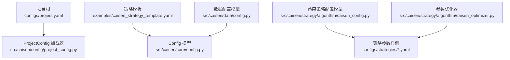
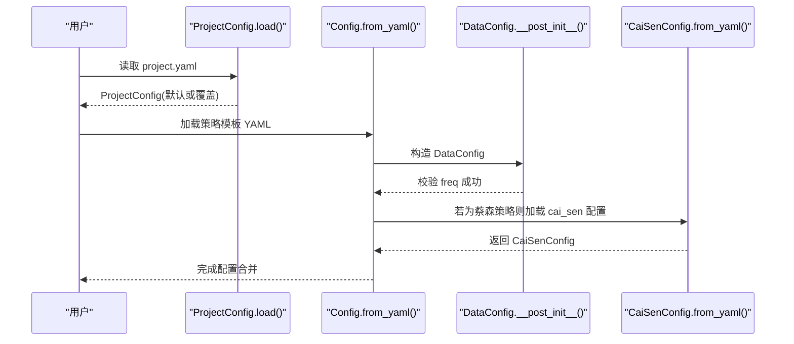
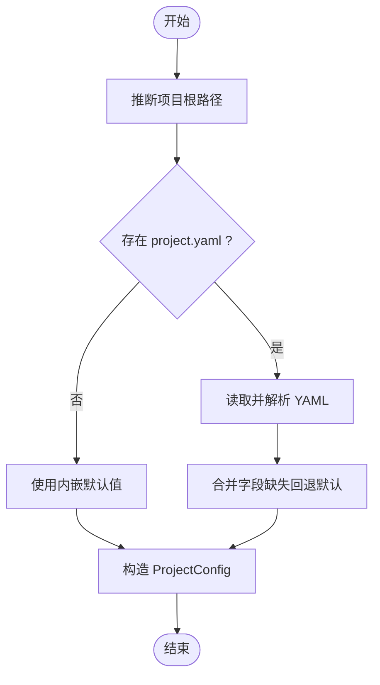
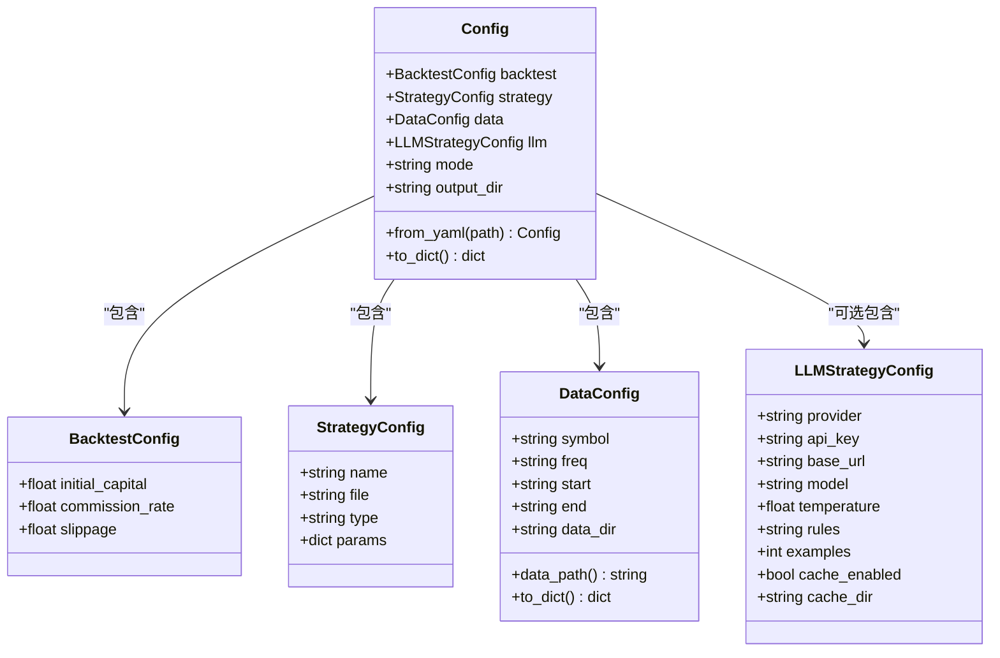
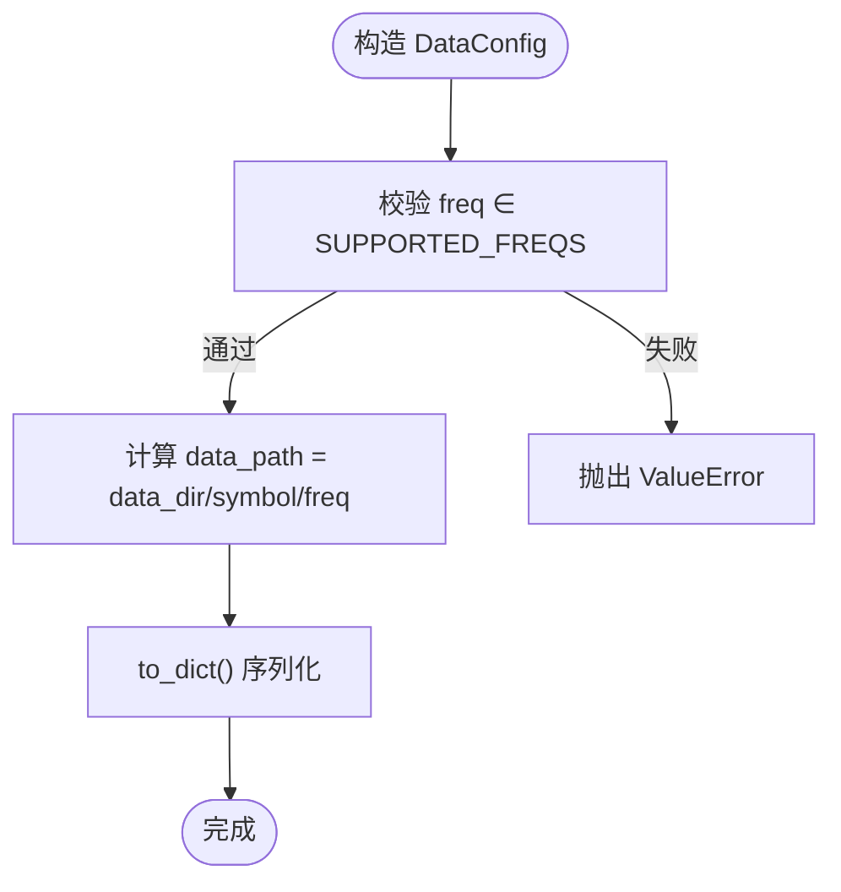
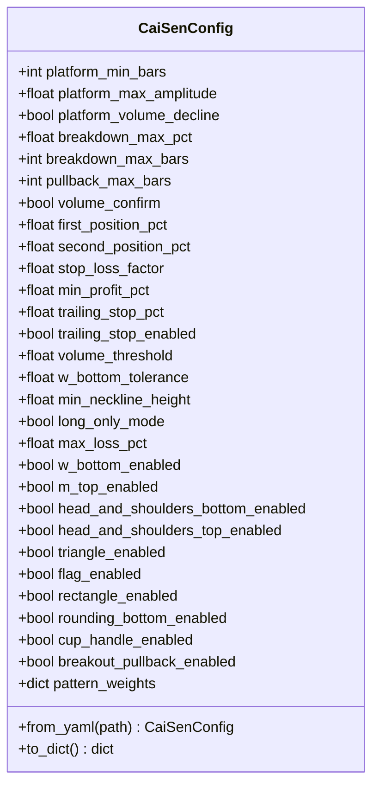
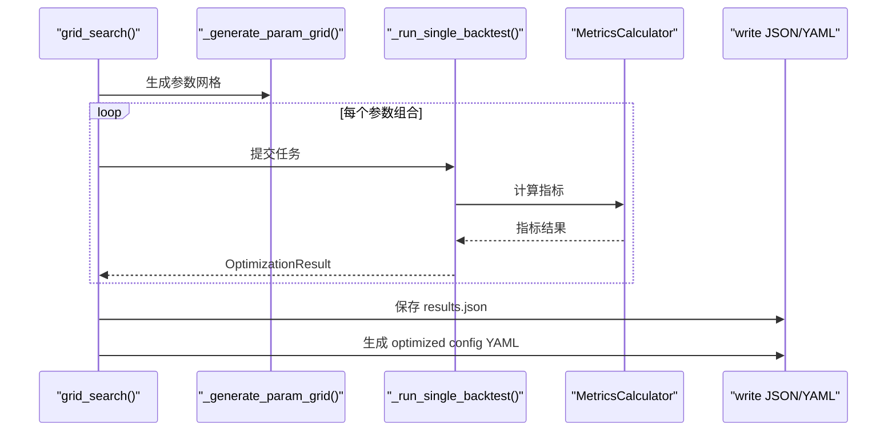
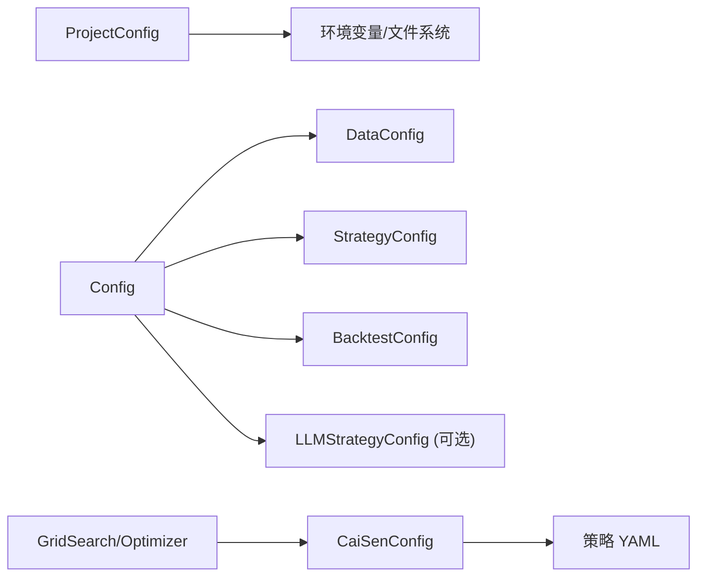

# 策略配置管理

<cite>
**本文引用的文件**   
- [project.yaml](file://configs/project.yaml)
- [project_config.py](file://src/caisen/config/project_config.py)
- [config.py（核心配置）](file://src/caisen/core/config.py)
- [config.py（数据配置）](file://src/caisen/data/config.py)
- [caisen_config.py（蔡森策略配置）](file://src/caisen/strategy/algorithm/caisen_config.py)
- [caisen_default.yaml](file://configs/strategies/caisen_default.yaml)
- [caisen_high_winrate.yaml](file://configs/strategies/caisen_high_winrate.yaml)
- [caisen_ag_60m_optimized.yaml](file://configs/strategies/caisen_ag_60m_optimized.yaml)
- [caisen_strategy_template.yaml](file://examples/caisen_strategy_template.yaml)
- [caisen_optimizer.py（参数优化器）](file://src/caisen/strategy/algorithm/caisen_optimizer.py)
- [test_config.py](file://tests/test_config.py)
- [test_project_config.py](file://tests/test_project_config.py)
- [exceptions.py（数据异常）](file://src/caisen/data/exceptions.py)
</cite>

## 目录
1. [简介](#简介)
2. [项目结构](#项目结构)
3. [核心组件](#核心组件)
4. [架构总览](#架构总览)
5. [详细组件分析](#详细组件分析)
6. [依赖关系分析](#依赖关系分析)
7. [性能与扩展性](#性能与扩展性)
8. [故障排查指南](#故障排查指南)
9. [结论](#结论)
10. [附录：配置模板与最佳实践](#附录配置模板与最佳实践)

## 简介
本技术文档围绕“策略配置管理系统”，系统性阐述 YAML 配置文件的结构、字段定义、验证机制、默认值处理、层次结构与继承关系，并提供不同场景下的配置示例与生成/验证工具用法说明。系统覆盖三类配置：
- 项目级全局配置：控制数据目录、输出目录、Web 端口等
- 回测与策略配置：控制回测引擎、策略类型与参数、数据源
- 策略特定配置（以蔡森策略为例）：形态开关、权重、风控与仓位管理等

## 项目结构
配置相关文件主要分布在以下位置：
- configs/project.yaml：项目级全局配置
- src/caisen/config/project_config.py：项目级配置加载器
- src/caisen/core/config.py：回测与策略的通用配置模型
- src/caisen/data/config.py：数据加载配置模型
- src/caisen/strategy/algorithm/caisen_config.py：蔡森策略配置模型与 YAML 解析
- configs/strategies/*.yaml：策略参数与形态开关的配置样例
- examples/caisen_strategy_template.yaml：完整策略运行模板
- src/caisen/strategy/algorithm/caisen_optimizer.py：网格搜索参数优化与配置生成

图表来源
- [project_config.py:1-56](file://src/caisen/config/project_config.py#L1-L56)
- [config.py（核心配置）:1-94](file://src/caisen/core/config.py#L1-L94)
- [config.py（数据配置）:1-51](file://src/caisen/data/config.py#L1-L51)
- [caisen_config.py（蔡森策略配置）:1-145](file://src/caisen/strategy/algorithm/caisen_config.py#L1-L145)
- [caisen_optimizer.py（参数优化器）:1-360](file://src/caisen/strategy/algorithm/caisen_optimizer.py#L1-L360)

章节来源
- [project.yaml:1-13](file://configs/project.yaml#L1-L13)
- [project_config.py:1-56](file://src/caisen/config/project_config.py#L1-L56)
- [config.py（核心配置）:1-94](file://src/caisen/core/config.py#L1-L94)
- [config.py（数据配置）:1-51](file://src/caisen/data/config.py#L1-L51)
- [caisen_config.py（蔡森策略配置）:1-145](file://src/caisen/strategy/algorithm/caisen_config.py#L1-L145)
- [caisen_optimizer.py（参数优化器）:1-360](file://src/caisen/strategy/algorithm/caisen_optimizer.py#L1-L360)

## 核心组件
- 项目级全局配置（ProjectConfig）
  - 负责从 configs/project.yaml 读取 data_dir、output_dir、api_port 等全局设置，缺失时静默使用内嵌默认值
- 回测与策略配置（Config / BacktestConfig / StrategyConfig）
  - 提供 from_yaml/_from_dict/to_dict 方法，统一构建回测、策略、数据与可选 LLM 配置
- 数据加载配置（DataConfig）
  - 校验 freq 是否在支持集合中，提供 data_path 计算与 to_dict 序列化
- 蔡森策略配置（CaiSenConfig）
  - 将 YAML 中的 params/patterns 映射到具体属性，并维护 pattern_weights 等高级选项

章节来源
- [project_config.py:1-56](file://src/caisen/config/project_config.py#L1-L56)
- [config.py（核心配置）:1-94](file://src/caisen/core/config.py#L1-L94)
- [config.py（数据配置）:1-51](file://src/caisen/data/config.py#L1-L51)
- [caisen_config.py（蔡森策略配置）:1-145](file://src/caisen/strategy/algorithm/caisen_config.py#L1-L145)

## 架构总览
配置体系采用“分层 + 合并”的方式：
- 项目级配置提供运行时环境基线（数据目录、输出目录、API 端口）
- 策略模板提供回测、策略与数据源的组合入口
- 策略特定配置（如 CaiSenConfig）通过 YAML 覆盖默认行为
- 参数优化工具可自动生成策略配置，形成“优化→配置→回测”的闭环

图表来源
- [project_config.py:1-56](file://src/caisen/config/project_config.py#L1-L56)
- [config.py（核心配置）:1-94](file://src/caisen/core/config.py#L1-L94)
- [config.py（数据配置）:1-51](file://src/caisen/data/config.py#L1-L51)
- [caisen_config.py（蔡森策略配置）:1-145](file://src/caisen/strategy/algorithm/caisen_config.py#L1-L145)

## 详细组件分析

### 项目级全局配置（ProjectConfig）
- 职责
  - 定位项目根目录，读取 configs/project.yaml
  - 对缺失字段使用内嵌默认值，不报错
- 关键流程
  - 自动推断项目根路径
  - 安全加载 YAML，仅接受 dict 类型
  - 构造 ProjectConfig 对象
- 典型字段
  - data_dir：本地行情数据根目录（Parquet 存放位置）
  - output_dir：回测结果输出目录
  - api_port：Web 服务端口

图表来源
- [project_config.py:1-56](file://src/caisen/config/project_config.py#L1-L56)

章节来源
- [project.yaml:1-13](file://configs/project.yaml#L1-L13)
- [project_config.py:1-56](file://src/caisen/config/project_config.py#L1-L56)
- [test_project_config.py:1-44](file://tests/test_project_config.py#L1-L44)

### 回测与策略配置（Config / BacktestConfig / StrategyConfig）
- 职责
  - 统一封装 backtest、strategy、data、llm、mode、output_dir 等
  - 提供 from_yaml/_from_dict/to_dict 进行读写转换
- 关键字段
  - backtest.initial_capital/commission_rate/slippage
  - strategy.name/file/type/params
  - data.*（由 DataConfig 提供）
  - llm.*（可选，LLM 策略相关）
  - mode/output_dir

图表来源
- [config.py（核心配置）:1-94](file://src/caisen/core/config.py#L1-L94)
- [config.py（数据配置）:1-51](file://src/caisen/data/config.py#L1-L51)

章节来源
- [config.py（核心配置）:1-94](file://src/caisen/core/config.py#L1-L94)
- [config.py（数据配置）:1-51](file://src/caisen/data/config.py#L1-L51)
- [test_config.py:1-91](file://tests/test_config.py#L1-L91)

### 数据加载配置（DataConfig）
- 职责
  - 校验 freq 是否属于支持集合
  - 提供 data_path 计算与 to_dict 序列化
- 校验规则
  - 当 symbol 非空且 freq 不在 SUPPORTED_FREQS 时抛出 ValueError
- 常用字段
  - symbol/freq/start/end/data_dir

图表来源
- [config.py（数据配置）:1-51](file://src/caisen/data/config.py#L1-L51)

章节来源
- [config.py（数据配置）:1-51](file://src/caisen/data/config.py#L1-L51)

### 蔡森策略配置（CaiSenConfig）
- 职责
  - 将 YAML 的 params/patterns 映射到 CaiSenConfig 的属性
  - 维护 pattern_weights 用于形态质量评分
- 映射规则
  - patterns 键名到 enabled 属性的映射表（如 W_BOTTOM → w_bottom_enabled）
- 典型字段
  - 平台检测、破底翻、仓位管理、风险控制、形态开关与权重、胜率增强参数

图表来源
- [caisen_config.py（蔡森策略配置）:1-145](file://src/caisen/strategy/algorithm/caisen_config.py#L1-L145)

章节来源
- [caisen_config.py（蔡森策略配置）:1-145](file://src/caisen/strategy/algorithm/caisen_config.py#L1-L145)

### 参数优化与配置生成（GridSearch + generate_optimized_config）
- 职责
  - 基于 GridSearch 遍历参数组合，并行执行回测，按综合评分排序
  - 从最优结果生成策略 YAML 配置
- 关键流程
  - 生成参数网格 → 并行回测 → 指标计算 → 评分排序 → 保存结果 → 生成配置
- 输出
  - optimization_results_{timestamp}.json
  - 生成的策略 YAML（含 params/patterns）

图表来源
- [caisen_optimizer.py（参数优化器）:1-360](file://src/caisen/strategy/algorithm/caisen_optimizer.py#L1-L360)

章节来源
- [caisen_optimizer.py（参数优化器）:1-360](file://src/caisen/strategy/algorithm/caisen_optimizer.py#L1-L360)

## 依赖关系分析
- 模块耦合
  - Config 依赖 DataConfig；CaiSenConfig 独立于 Config，但可与 StrategyConfig.params 协同
  - ProjectConfig 独立，提供运行时环境基线
- 外部依赖
  - PyYAML 用于 YAML 解析
  - openai 仅在 LLM 相关路径中使用
- 潜在循环依赖
  - 优化器内部延迟导入避免循环依赖

图表来源
- [project_config.py:1-56](file://src/caisen/config/project_config.py#L1-L56)
- [config.py（核心配置）:1-94](file://src/caisen/core/config.py#L1-L94)
- [config.py（数据配置）:1-51](file://src/caisen/data/config.py#L1-L51)
- [caisen_config.py（蔡森策略配置）:1-145](file://src/caisen/strategy/algorithm/caisen_config.py#L1-L145)
- [caisen_optimizer.py（参数优化器）:1-360](file://src/caisen/strategy/algorithm/caisen_optimizer.py#L1-L360)

章节来源
- [config.py（核心配置）:1-94](file://src/caisen/core/config.py#L1-L94)
- [config.py（数据配置）:1-51](file://src/caisen/data/config.py#L1-L51)
- [project_config.py:1-56](file://src/caisen/config/project_config.py#L1-L56)
- [caisen_config.py（蔡森策略配置）:1-145](file://src/caisen/strategy/algorithm/caisen_config.py#L1-L145)
- [caisen_optimizer.py（参数优化器）:1-360](file://src/caisen/strategy/algorithm/caisen_optimizer.py#L1-L360)

## 性能与扩展性
- 并行优化
  - 网格搜索使用线程池并行执行回测，提升大规模参数扫描效率
- 内存与 I/O
  - 建议合理设置 n_workers 与 top_n，避免过多并发导致资源争用
- 可扩展点
  - 新增策略可通过 StrategyConfig.type/params 接入
  - 新增数据源需遵循 DataConfig 契约并在注册表中登记

[本节为通用指导，无需列出章节来源]

## 故障排查指南
- 常见错误与定位
  - 频率不支持：DataConfig.__post_init__ 会抛出 ValueError，检查 freq 是否在 SUPPORTED_FREQS
  - 数据未找到：LocalDataSource 可能抛出 DataNotFoundError，核对 data_dir/symbol/freq 与时间范围
  - 日期范围无效：InvalidDateRangeError，确保 start < end
  - 数据校验失败：DataValidationError，检查 Parquet 数据结构与完整性
  - 策略配置为空或不存在：CaiSenConfig.from_yaml 抛出 FileNotFoundError/ValueError，确认路径与内容
- 调试建议
  - 打印 DataConfig.to_dict() 与 CaiSenConfig.to_dict() 对比期望
  - 使用测试用例快速验证配置解析与默认值覆盖逻辑

章节来源
- [config.py（数据配置）:1-51](file://src/caisen/data/config.py#L1-L51)
- [exceptions.py（数据异常）:1-47](file://src/caisen/data/exceptions.py#L1-L47)
- [caisen_config.py（蔡森策略配置）:1-145](file://src/caisen/strategy/algorithm/caisen_config.py#L1-L145)
- [test_config.py:1-91](file://tests/test_config.py#L1-L91)
- [test_project_config.py:1-44](file://tests/test_project_config.py#L1-L44)

## 结论
本配置管理体系通过分层设计实现了“项目级基线 + 策略模板 + 策略特定参数”的组合式配置，配合严格的校验与默认值回退，既保证易用性又具备生产可用性。参数优化工具进一步打通了“发现最优参数 → 生成配置 → 回测验证”的闭环，适合迭代优化与规模化部署。

[本节为总结，无需列出章节来源]

## 附录：配置模板与最佳实践

### 配置文件层次结构与继承关系
- 层次
  - 项目级：configs/project.yaml（覆盖内嵌默认值）
  - 策略模板：examples/caisen_strategy_template.yaml（组合 backtest/strategy/data）
  - 策略特定：configs/strategies/*.yaml（覆盖 CaiSenConfig 默认参数）
- 继承/覆盖
  - 内嵌默认值 < project.yaml < 策略模板 < 策略特定 YAML
  - 策略特定 YAML 的 params/patterns 直接覆盖 CaiSenConfig 对应属性

章节来源
- [project.yaml:1-13](file://configs/project.yaml#L1-L13)
- [caisen_default.yaml:1-50](file://configs/strategies/caisen_default.yaml#L1-L50)
- [caisen_high_winrate.yaml:1-23](file://configs/strategies/caisen_high_winrate.yaml#L1-L23)
- [caisen_ag_60m_optimized.yaml:1-35](file://configs/strategies/caisen_ag_60m_optimized.yaml#L1-L35)
- [caisen_strategy_template.yaml:1-59](file://examples/caisen_strategy_template.yaml#L1-L59)

### 字段定义与含义（摘要）
- 项目级（ProjectConfig）
  - data_dir：本地行情数据根目录（Parquet）
  - output_dir：回测结果输出目录
  - api_port：Web 服务端口
- 回测与策略（Config/BacktestConfig/StrategyConfig）
  - backtest.initial_capital/commission_rate/slippage
  - strategy.name/file/type/params
  - data.symbol/freq/start/end/data_dir
  - llm.provider/api_key/base_url/model/temperature/rules/examples/cache_enabled/cache_dir
  - mode/output_dir
- 蔡森策略（CaiSenConfig）
  - 平台检测：platform_min_bars/platform_max_amplitude/platform_volume_decline
  - 破底翻：breakdown_max_pct/breakdown_max_bars/pullback_max_bars/volume_confirm
  - 仓位管理：first_position_pct/second_position_pct
  - 风险控制：stop_loss_factor/min_profit_pct/trailing_stop_pct/trailing_stop_enabled
  - 其他：volume_threshold/w_bottom_tolerance/min_neckline_height/long_only_mode/max_loss_pct
  - 形态开关与权重：*_enabled 与 pattern_weights

章节来源
- [project_config.py:1-56](file://src/caisen/config/project_config.py#L1-L56)
- [config.py（核心配置）:1-94](file://src/caisen/core/config.py#L1-L94)
- [config.py（数据配置）:1-51](file://src/caisen/data/config.py#L1-L51)
- [caisen_config.py（蔡森策略配置）:1-145](file://src/caisen/strategy/algorithm/caisen_config.py#L1-L145)

### 配置验证机制与默认值处理
- 验证
  - DataConfig.freq 必须在 SUPPORTED_FREQS 中，否则抛错
  - CaiSenConfig.from_yaml 要求文件存在且非空
- 默认值
  - ProjectConfig 在缺少 project.yaml 时使用内嵌默认值
  - Config/BacktestConfig/StrategyConfig/DataConfig/CaiSenConfig 均提供合理的默认值

章节来源
- [config.py（数据配置）:1-51](file://src/caisen/data/config.py#L1-L51)
- [caisen_config.py（蔡森策略配置）:1-145](file://src/caisen/strategy/algorithm/caisen_config.py#L1-L145)
- [project_config.py:1-56](file://src/caisen/config/project_config.py#L1-L56)
- [test_project_config.py:1-44](file://tests/test_project_config.py#L1-L44)

### 不同场景配置示例（路径指引）
- 简单回测
  - 参考模板：examples/caisen_strategy_template.yaml
- 参数优化
  - 使用优化器生成配置：src/caisen/strategy/algorithm/caisen_optimizer.py
  - 已生成示例：configs/strategies/caisen_ag_60m_optimized.yaml
- 高胜率策略
  - 参考：configs/strategies/caisen_high_winrate.yaml
- 基准策略
  - 参考：configs/strategies/caisen_default.yaml

章节来源
- [caisen_strategy_template.yaml:1-59](file://examples/caisen_strategy_template.yaml#L1-L59)
- [caisen_optimizer.py（参数优化器）:1-360](file://src/caisen/strategy/algorithm/caisen_optimizer.py#L1-L360)
- [caisen_ag_60m_optimized.yaml:1-35](file://configs/strategies/caisen_ag_60m_optimized.yaml#L1-L35)
- [caisen_high_winrate.yaml:1-23](file://configs/strategies/caisen_high_winrate.yaml#L1-L23)
- [caisen_default.yaml:1-50](file://configs/strategies/caisen_default.yaml#L1-L50)

### 配置热重载与环境变量注入
- 热重载
  - 当前实现未提供显式的运行时热重载接口；建议在进程外监控配置变更并重启服务或重新加载配置
- 环境变量注入
  - LLMStrategyConfig.api_key 注释表明支持 ${VAR} 形式的环境变量注入；实际注入逻辑需在调用处实现（例如在 from_yaml/_from_dict 前对字符串进行替换）

章节来源
- [config.py（核心配置）:1-94](file://src/caisen/core/config.py#L1-L94)

### 配置生成器与验证工具用法
- 配置生成器
  - 使用 grid_search 进行网格搜索，并通过 generate_optimized_config 输出策略 YAML
- 验证工具
  - 单元测试覆盖配置解析与默认值覆盖：tests/test_config.py、tests/test_project_config.py
  - 自定义校验：可在 DataConfig.__post_init__ 与 CaiSenConfig.from_yaml 基础上扩展

章节来源
- [caisen_optimizer.py（参数优化器）:1-360](file://src/caisen/strategy/algorithm/caisen_optimizer.py#L1-L360)
- [test_config.py:1-91](file://tests/test_config.py#L1-L91)
- [test_project_config.py:1-44](file://tests/test_project_config.py#L1-L44)

### 最佳实践与常见问题
- 最佳实践
  - 优先使用项目级配置集中管理数据与输出路径
  - 策略模板只保留必要差异，其余参数下沉至策略特定 YAML
  - 使用优化器产出配置，避免手工调参误差
- 常见问题
  - freq 不支持：检查 SUPPORTED_FREQS 列表
  - 数据路径错误：核对 data_dir/symbol/freq 与 Parquet 文件布局
  - 配置为空或路径错误：确认 CaiSenConfig.from_yaml 的文件存在性与非空性

章节来源
- [config.py（数据配置）:1-51](file://src/caisen/data/config.py#L1-L51)
- [caisen_config.py（蔡森策略配置）:1-145](file://src/caisen/strategy/algorithm/caisen_config.py#L1-L145)
- [project_config.py:1-56](file://src/caisen/config/project_config.py#L1-L56)